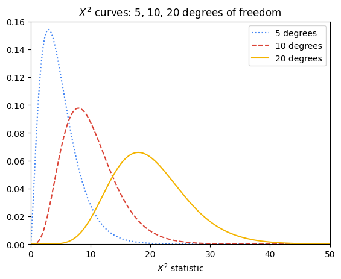
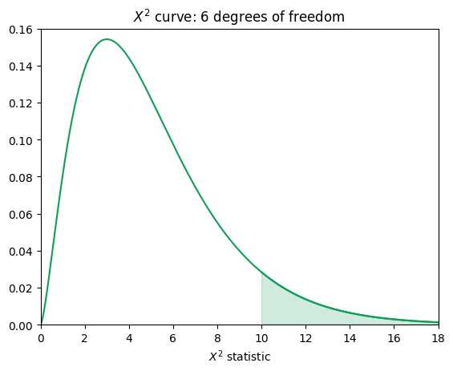
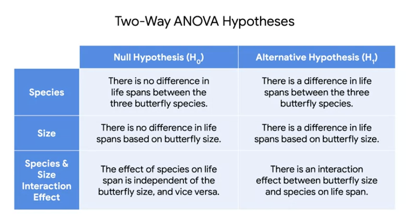
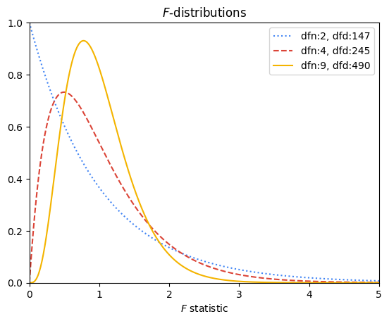
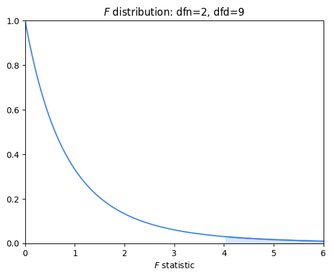

Hey. Welcome back to modeling variable relationships. ​We've covered a lot of material about regression so far. ​We worked through the assumptions, ​construction, evaluation, ​and interpretation of simple linear regression model, ​and then build a more complex model ​using multiple regression. ​These tools gave us powerful ways to ask and ​explore questions about continuous variables. ​For example, if we were ​interested in understanding product sales, ​multiple regression would allow ​us to consider the impact of ​both digital video and print advertising on sales. ​Now, we'll start focusing more on categorical variables.

​By expanding our toolkit to ​include more hypothesis testing, ​we can start asking and ​answering a different range of questions, ​for example, is the difference among ​three or more groups statistically significant? ​Is the distribution of ​observed data different from what we expected? ​Perhaps we're conducting user research and you ​want to make a change to the website you're analyzing. ​You can use hypothesis testing to ​determine if user engagement is different ​between a couple groups where ​each group is using distinct website layout. ​we call that hypothesis testing is ​a statistical procedure that uses ​sample data to evaluate ​an assumption about a population parameter. ​You are testing hypothesis about ​a population to see if there ​are any significant differences. ​For example, in the case of user research on a website, ​you could test the hypothesis that ​changing the color of the subscribe button ​or the placement of images might ​change how much time users spend on the website. ​You can utilize different models and test from ​your data toolbox to answer various questions.

​You can also use some techniques together. ​For example, sometimes you might want to combine ​a regression model with ​hypothesis test or a series of hypothesis tests. ​The core principles of ​data analysis continue to apply to each technique. ​We want to explore and better understand ​the relationships between different variables. ​We can use what we have learned to ​tell compelling stories about the data. ​Based on the kind of data we have available, ​we can determine which test ​or model will be most appropriate. ​But sometimes we have to use several test and models ​before we can determine ​the best approach to answer our questions.

​In this video, we'll start with ​Chi-squared distribution and chi-squared test. ​Chi is the 22nd letter of the Greek alphabet, ​and looks a lot like a fancy capital X in English $\chi$. ​Our discussion will expand on prior learnings ​about $t$-tests and hypothesis testing. ​Chi-squared test will help us determine if ​two categorical variables are ​associated with one another, ​and whether a categorical variable ​follows unexpected distribution. ​For example, if we flip a two-sided coin many times, ​we would expect about half of the time, ​one particular side comes up. ​About the other half of the time, ​the other side comes up.

​Next, we will examine analysis of variance ​or ANOVA and its variance, ​analysis of covariance, ​ANCOVA, and multivariate analysis of variance ​and covariant MANOVA and MANCOVA, respectively.

​By unpacking variable relationships ​with a focus on categorical data, ​we'll be able to expand the types of data we can ​effectively use to draw ​conclusions about various decisions, ​strategies, and practices in industry.

------------------------------------------------------------------------

# Hypothesis testing with chi-squared

Previously we encountered hypothesis testing in ​the form of one-tail and two-tailed $t$-tests. $​t$-tests help us answer questions about whether ​the mean of two different groups ​is significantly different.

​In this lesson, we'll explore if ​our data is what we expected it to be. ​We'll introduce two hypothesis tests, ​the *chi-squared goodness of ​fit* test and the *chi-squared test of independence*. ​These tests will help us compare ​our expected and observed data. ​We'll revisit null and alternative hypotheses ​when we define chi-squared test, ​just like you might have done with $t$-tests. ​When using linear regression, ​we were primarily focused on continuous variables, ​but what if our variables aren't continuous?

**​Chi-squared tests can address ​questions involving categorical variables**. ​For example, let's say you're working at ​a movie theater which sells small, ​medium, large, and extra-large portions of popcorn. ​You have projections or ​some expected counts of how each size will sell. ​In a bar chart, ​it can be difficult to determine if the expected counts ​are statistically the same as what you observed, ​but you can run a chi-squared goodness ​of fit test to answer the question. ​

::: nota
The chi-squared goodness of fit test determines whether ​an observed categorical variable ​follows an expected distribution. ​
:::

As a data practitioner for the movie theater, ​we mentioned, you're ​working on the popcorn sale problem. ​An employee claims that 25 percent of ​people order each size on any given day.

​Now you can create a table of counts based on ​the number of popcorn buyers on a given day. ​Let's say 100 people bought popcorn yesterday, ​then you can multiply ​the percentage by the total to figure ​out the expected counts for each cell in the table. ​25 percent of 100 is 25. ​You expect that 25 people buy each size of popcorn. ​For the chi-squared goodness of fit test, ​the null hypothesis states that 25 people ​buy each size of popcorn on any given day. ​Basically, the null hypothesis states that ​the variable follows the expected distribution. ​If we accept the null hypothesis, ​then we can say that the observed distribution of ​popcorn sales is the same as what the employee claims. ​The alternative hypothesis states that ​the variable doesn't follow the expected distribution.

​Basically, the distribution of the observed data ​is significantly different from ​what we expected it to be. ​This means that different number of people ​buy each size of popcorn on any given day. ​In this case, the chi-squared statistic equals the sum of ​the observed number minus ​the expected number squared ​divided by the expected number.

$$
\chi^2 = \sum \frac{(\text{Observed - Extpected})^2}{Expected}
$$

​Once you've gathered the observations ​about popcorn sales, ​you can then use the chi-squared statistic to calculate ​the $p$-value and determine if you can reject ​the null hypothesis at the given confidence level.

​The next test is called ​the **chi-squared test for independence**, ​sometimes called a test of homogeneity. ​

::: nota
The chi-squared test for ​independence determines whether or ​not two categorical variables ​are associated with each other. ​For example, let's say you are wondering ​if weather is associated with popcorn sales.
:::

​Maybe when it rains, ​people are more likely to buy hot buttery popcorn. ​To state the hypothesis, ​you first need to determine your variables. ​In the popcorn case, ​the first variable could be whether there's rain or not. ​The second variable could be if ​more than 100 people buy popcorn, ​or if 100 people or fewer buy popcorn. ​Now we're ready to state our hypotheses. ​**The null hypothesis in the test for independence is that ​the variables are independent ​and are not associated with each other.** ​The alternative hypothesis states that the variables are ​not independent and are associated with each other.

​For the chi-squared test, ​it's important to construct ​a two-by-two table of counts to ​see how many observations fall under each category.

+---------------------------+-------------+-------------+----------------------------+
|                           | **Rain**    | **No Rain** | **Row Totals (**$R_i$**)** |
+---------------------------+-------------+-------------+----------------------------+
| $100+$ Popcorn            | 58          | 77          | **135**                    |
+---------------------------+-------------+-------------+----------------------------+
| $\le 100$ Popcorn         | 25          | 115         | **140**                    |
+---------------------------+-------------+-------------+----------------------------+
| **Column Totals (**$C_j$) | **83**      | **192**     | **Grand Total = 275**      |
+---------------------------+-------------+-------------+----------------------------+

​Let's say we have data from the spring, ​summer, and fall popcorn sales. ​There were 275 days of data collected, ​including 83 days where it ​rained and 192 days where it did not. ​On 135 days, ​more than 100 people bought popcorn and on 140 days, ​fewer than 100 people bought popcorn. ​You can then fill in each cell ​with the count of days for each category. ​You can then calculate the expected value for ​each cell in the two-by-two table ​using the following formula. ​

$$
E_{ji}=\frac{R_i C_j}{\text{Grand Total}}
$$

Where $R_i$= Row total and $C_j$ = Column total

​The formula comes from ​the definition of independence where ​two events are independent if ​the probability of both occurring, ​probability of A and B is ​equal to the probability of A times the probability of B. ​The observed value is just the count for ​the cell in the ith row and jth column.

If two events are independent, the probability of both happening together is $P(A \text{ and } B) = P(A) \times P(B)$.

-   Overall probability of a rainy day: $P(\text{Rain}) = \frac{83}{275}$

-   Overall probability of high sales: $P(100+) = \frac{135}{275}$

-   If independent, expected probability of high sales on a rainy day:

    $\left(\frac{83}{275}\right) \times \left(\frac{135}{275}\right)$

$$
   E_{\text{Rain, 100+}} = \frac{135 \times 83}{275} \approx \mathbf{40.75} 
   $$

#### Computing all expected values:

+-------------------------+--------------------------+------------------------+------------------------+
| **Cell**                | **Calculation**          | **Expected Count (E)** | **Observed Count (O)** |
+-------------------------+--------------------------+------------------------+------------------------+
| **Rain &** $100+$       | $(135 \times 83) / 275$  | **40.75**              | 58                     |
+-------------------------+--------------------------+------------------------+------------------------+
| **No Rain &** $100+$    | $(135 \times 192) / 275$ | **94.25**              | 77                     |
+-------------------------+--------------------------+------------------------+------------------------+
| **Rain &** $\le 100$    | $(140 \times 83) / 275$  | **42.25**              | 25                     |
+-------------------------+--------------------------+------------------------+------------------------+
| **No Rain &** $\le 100$ | $(140 \times 192) / 275$ | **97.75**              | 115                    |
+-------------------------+--------------------------+------------------------+------------------------+

​You can then use the same formula as the goodness of ​fit test to calculate the chi-squared statistic.

To measure how much observed counts ($O$) deviate from expected counts ($E$), use the standard test statistic formula:

$$
\chi^2 = \sum \frac{(O - E)^2}{E}
$$

$$
\chi^2 = \frac{(58 - 40.75)^2}{40.75} + \frac{(77 - 94.25)^2}{94.25} + \frac{(25 - 42.25)^2}{42.25} + \frac{(115 - 97.75)^2}{97.75}
$$

$$
\chi^2 = \frac{297.56}{40.75} + \frac{297.56}{94.25} + \frac{297.56}{42.25} + \frac{297.56}{97.75}
$$

$$
\chi^2 \approx 7.30 + 3.16 + 7.04 + 3.04 = \mathbf{20.54}
$$

​As with the goodness of fit test, ​you can use the chi-squared statistic ​to calculate the $p$-value ​and determine if the two categorical variables ​are independent or not.

​**Degrees of Freedom (**$df$): $(r - 1)(c - 1) = (2 - 1)(2 - 1) = 1$

-   **Critical Value /** $p$-value: At $\alpha = 0.05$, the critical value for $df = 1$ is $3.841$.

-   **Decision:** Because our calculated test statistic ($\chi^2 = 20.54$) is much larger than $3.841$ (resulting in $p < 0.0001$), we **reject the null hypothesis**.

Great work, we'll cover a couple of the assumptions of ​chi-squared tests and how to perform ​chi-square test in more depth in upcoming readings. ​The key here is connecting ​concepts you have learned about ​hypothesis testing to these chi-squared test as well. ​You'll answer more questions ​about categorical variables soon.

------------------------------------------------------------------------

# Chi-squared tests: Goodness of fit versus independence

In the previous course, you learned how hypothesis tests are used to see significant differences among groups. Chi-squared tests are used to determine whether one or more observed categorical variables follow expected distribution(s). For example, you may expect that 50% more movie goers attend movies on weekends in comparison to weekdays. After observing movie goers attendance for a month, you then can perform a chi-squared test to see if your initial hypothesis was correct.

This reading will cover the two main chi-squared tests—goodness of fit and test for independence—which can be used to test your expected hypothesis against what actually occurred. Data professionals perform these hypothesis tests to offer organizations actionable insights that drive decision making.

## The Chi-squared goodness of fit test

**Chi-squared (χ²) goodness of fit test** is a hypothesis test that determines whether an observed categorical variable with more than two possible levels follows an expected distribution.

-   The null hypothesis (H~0~) of the test is that the categorical variable follows the expected distribution.

-   The alternative hypothesis (H~a~) is that the categorical variable does not follow the expected distribution.

Consider the scenario in this reading that will define the null and alternative hypotheses based on the scenario, set up a Goodness of Fit test, evaluate the test results, and draw a conclusion.

### Chi-squared goodness of fit scenario

Imagine that you work as a data professional for an online clothing company. Your boss tells you that they expect the number of website visitors to be the same for each day of the week. You decide to test your boss’s hypothesis and pull data every day for the next week and record the number of website visitors in the table below:

| **Day of the Week** | **Observed Values** |
|:--------------------|:--------------------|
| Sunday              | 650                 |
| Monday              | 570                 |
| Tuesday             | 420                 |
| Wednesday           | 480                 |
| Thursday            | 510                 |
| Friday              | 380                 |
| Saturday            | 490                 |
| Total               | 3,500               |

Here are the main steps you will take:

1.  Identify the Null and Alternative Hypotheses

2.  Calculate the chi-square test statistic (**𝛘**^2^)

3.  Calculate the $p$-value

4.  Make a conclusion

### **Step 1: Identify the null and alternative hypotheses**

The first step in performing a chi-squared goodness of fit test is to determine your null and alternative hypothesis. Since you are testing if the number of website visitors follows your boss’s expectations, the below are your null and alternative hypotheses :

H~0~: The week you observed follows your boss’s expectations that the number of website visitors is equal on any given day

H~a~: The week you observed does not follow your boss’s expectations; therefore, the number of website visitors is not equal across the days of the week

### **Step 2: Calculate the chi-squared test statistic (𝛘**^2^**)**

Next, calculate a test statistic to determine if you should reject or fail to reject your null hypothesis. This test statistic is known as the chi-squared statistic and is calculated based on the following formula:

$$
\sum \frac{(observed - expected)^2}{expected}
$$

The intuition behind this formula is that it should quantify the extent of any discrepancies between observed frequencies and expected frequencies for each categorical level. Squaring these differences does two things. First, it ensures that all discrepancies between observed and expected contribute positively to the chi-squared statistic. Second, it penalizes larger discrepancies. Dividing the sum of the squared differences by the expected frequency of each category level standardizes the differences. In other words, it accounts for the fact that larger discrepancies are more significant when the expected frequencies are small, and less so when the expected frequencies are large.

Returning to the example, since there were a total of 3,500 website visitors you observed; your boss’s expectation is that 500 visitors would visit each day (3,500/7). In the formula above, 500 would serve as the “expected” value. A column has been added to your original table to include the test statistic calculation for each weekday:

+---------------------+---------------------+----------------------------------+
| **Day of the Week** | **Observed Values** | **Chi-Squared Test Statistic**   |
+:====================+:====================+:=================================+
| Sunday              | 650                 | $$\frac{(650-500)^2}{500}=45$$   |
+---------------------+---------------------+----------------------------------+
| Monday              | 570                 | $$\frac{(570-500)^2}{500}=9.8$$  |
+---------------------+---------------------+----------------------------------+
| Tuesday             | 420                 | $$\frac{(420-500)^2}{500}=12.8$$ |
+---------------------+---------------------+----------------------------------+
| Wednesday           | 480                 | $$\frac{(480-500)^2}{500}=0.8$$  |
+---------------------+---------------------+----------------------------------+
| Thursday            | 510                 | $$\frac{(510-500)^2}{500}=0.2$$  |
+---------------------+---------------------+----------------------------------+
| Friday              | 380                 | $$\frac{(380-500)^2}{500}=28.8$$ |
+---------------------+---------------------+----------------------------------+
| Saturday            | 490                 | $$\frac{(490-500)^2}{500}=0.2$$  |
+---------------------+---------------------+----------------------------------+

The $\chi^2$ statistic would be the sum of the third column above:

$\chi^2 = 45 + 9.8 + 12.8 + 0.8 + 0.2 + 28.8 + 0.2$

$\chi^2 = 97.6$

::: nota-importante
Note that the $\chi^2$ goodness of fit test does not produce reliable results when there are any expected values of less than five.
:::

### **Step 3: Find the p-value**

Now that you have calculated the $\chi^2$ statistic, consider the following question: What is the probability of obtaining a $\chi^2$ statistic of 97.6 or greater when examining 3,500 website visits if they null hypothesis is true? This is the question that the $p$-value —or “observed significance level"— will answer.

A long time ago, Pearson realized that $p$-values for $\chi^2$ statistics very closely corresponded with areas under certain curves, known as $\chi^2$ curves. $\chi^2$ curves represent probability density functions, and their shapes vary based on how many degrees of freedom are present in the experiment. **Degrees of freedom are determined by the model, not by the data.** This means that, in the website traffic example, the degrees of freedom are determined by how many different days a given visit can occur on,not by how many visits are sampled nor by the daily frequencies of the samples themselves. When the model is fully specified (i.e., you know all the possible categorical levels), then:

**degrees of freedom = number of categorical levels – 1**.

In this example, there are seven categorical levels (one for each day of the week). Therefore, there are six degrees of freedom. This is because the counts of each level (day) are free to fluctuate, but once you know the counts for six days, the seventh day cannot vary. It must result in a total of 3,500 when summed with the other six days.

The following figure depicts the $\chi^2$ curves for three different degrees of freedom: five, 10, and 20.



The $p$-value for a given $\chi^2$ test statistic is very closely approximated by the area to its right beneath the $\chi^2$ curve of the appropriate degrees of freedom. Notice that the more degrees of freedom there are in the experiment, the greater the area under the right tail of the curve for any given $\chi^2$ test statistic, and therefore the greater the probability of getting a given $\chi^2$ test statistic if the null hypothesis is true.

The following figure contains the $\chi^2$ curve for six degrees of freedom. For a $\chi^2$ test statistic of, for instance, 10, the value of P is approximated by the shaded area under the curve where x ≥ 10.



In the case of the website visits, there are six degrees of freedom, but the $\chi^2$ test statistic is 97.6—far along the x-axis in the right-skewed tail of the curve. The area under this interval is miniscule: 7.94e-19. In other words, the chances of getting a $\chi^2$ test statistic ≥ 97.6 from 3,500 website visits if the null hypothesis were true are 7.94e-17% —practically zero.

### **Step 4: Make a conclusion**

Since the $p$-value is far less than 0.05, there is sufficient evidence to suggest that the number of visitors is not equal per day.

### Coding

Thankfully, you don’t need to manually calculate your $\chi^2$ test statistic or determine P by hand. You can use the [chisquare() function](https://docs.scipy.org/doc/scipy/reference/generated/scipy.stats.chisquare.html) from Python’s **scipy.stats** package to do this. The following code uses your observed and expected values to calculate the chi-squared test statistic and the p-value. Note that the degrees of freedom are set to the number of observed frequencies minus one. This can be adjusted using the **ddof** parameter, but note that this parameter represents **k - 1 - ddof** degrees of freedom, where **k** is the number of observed frequencies. So, by default, **ddof=0** when you call the function, and setting **ddof=1** means that your degrees of freedom are reduced by two.

```{python}
import scipy.stats as stats
observations = [650, 570, 420, 480, 510, 380, 490]
expectations = [500, 500, 500, 500, 500, 500, 500]
result = stats.chisquare(f_obs=observations, f_exp=expectations)
result
```

The output confirms your calculation of the chi-square test statistic in Step 2 and also gives you the associated $p$-value. Because the $p$-value is less than the significance level of 5%, you can reject the null hypothesis.

## The Chi-squared test for independence

**Chi-squared (χ²) Test for Independence** **is a hypothesis test that determines whether or not two categorical variables are associated with each other.** It is valid when your data comes from a random sample and you want to make an inference about the general population. - The null hypothesis $H_0$ of the test is that two categorical variables are independent. - The alternative hypothesis $H_a$ is that two categorical variables are not independent.

### Chi-squared test for independence scenario

Now suppose that you have been asked to expand your analysis to look at the relationship between the device that a website user used and their membership status. To do this, you must use the $\chi^2$ test for independence. In this example, the $\chi^2$ test of independence determines whether the type of device a visitor uses to visit the website (Mac or PC) is dependent on whether he or she has a membership account or browses as a guest (member or guest).

### **Step 1: Identify the null and alternative hypotheses**

Just like the goodness of fit scenario, the first step is to determine your null and alternative hypotheses. You are comparing if the device used to visit your clothing store (Mac or PC) is independent from the visitor’s membership status (member or guest). From that information you can determine that your null and alternative hypotheses are as follows:

-   $H_0$: The type of device a website visitor uses to visit the website is independent of the visitor’s membership status.

-   $H_a$: The type of device a website visitor uses to visit the website is not independent of the visitor’s membership status.

### **Step 2: Calculate the chi-squared test statistic (**$\chi^2$)

To calculate the $\chi^2$ test statistic, arrange the data as a table that contains *m* x *n* values, where *m* and *n* are the number of possible levels contained within each respective categorical variable. The following table below breaks down the website visitors based on the device they used and their membership status.

| **Observed Values** | **Member** | **Guest** | **Total** |
|:--------------------|:-----------|:----------|:----------|
| **Mac**             | 850        | 450       | 1,300     |
| **PC**              | 1,300      | 900       | 2,200     |
| **Total**           | 2,150      | 1,350     | 3,500     |

Notice that the table starts with 2 x 2 known values (two levels for each category), from which totals are derived. These totals can be used to calculate the expected values, which are necessary to get the $\chi^2$ test statistic.

To calculate the expected values, use the following formula:

$$
\text{expected value} = \frac{\text{column total} * \text{row total}}{\text{overall total}}
$$

For example, the expected value for a Mac member would be: $$
\text{expected value} = \frac{2,150 * 1,300}{3,500} = 799
$$

The logic of this calculation is as follows: if device and membership status are truly independent, then the rate of Mac users who are members should be the same as the rate of Mac users who are guests. The percentage of users who use Macs out of *all* the users is 1,300 / 3,500 = 0.371 \* 100 = 37.1%. Accordingly, 37.1% of members and 37.1% of guests would be expected to use Macs. So, 0.371 \* 2,150 members ≈ 799.

The following table contains all the expected values:

| **Expected Values** | **Member** | **Guest** |
|:--------------------|:-----------|:----------|
| **Mac**             | 799        | 501       |
| **PC**              | 1,351      | 849       |

### **Step 3: Find the** $p$-value

Finding the $p$-value associated with a particular $chi^2$ test statistic is similar to the process outlined already for the goodness of fit test. The only minor difference is how to determine the number of degrees of freedom. For an independence test with two categorical variables with *m* x *n* possible levels, there are (*m* – 1) (*n* – 1) degrees of freedom, assuming there are no other constraints on the probabilities. So, in the working example, this means there is (2 – 1)(2 – 1) = 1 degree of freedom. The $p$-value in this example is 0.00022. It was determined using Python.

### **Step 4: Make a conclusion**

Because the $p$-value is 0.00022, you can reject the null hypothesis in favor of the alternative. You conclude that the type of device a website user uses is not independent of his or her membership status. You may recommend to your boss to dive into the reasons behind why visitors sign up for paid memberships more on a particular device. Perhaps the sign-up button appears differently on a particular device. Or maybe there are device-specific bugs that need to be fixed. These are just a couple examples of things you might consider for further exploration.

### Coding

You can use the **scipy.stats** package’s [chi2_contingency() function](https://docs.scipy.org/doc/scipy/reference/generated/scipy.stats.chi2_contingency.html) to obtain the $chi^2$ test statistic and $p$-value of a $chi^2$ independence test. The **chi2_contingency()** function only needs the observed values; it will calculate the expected values for you. Here is the Python code:

```{python}
import numpy as np
import scipy.stats as stats
observations = np.array([[850, 450],[1300, 900]])
result = stats.contingency.chi2_contingency(observations, correction=False)
result
```

The output above is in the following order: the $chi^2$ statistic, $p$-value, degrees of freedom, and expected values in array format. One thing to note is that when degrees of freedom = 1 (i.e., you have a 2 x 2 table), the default behavior of the **stats.chi2_contingency()** function is to apply [Yates’ correction for continuity](https://en.wikipedia.org/wiki/Yates's_correction_for_continuity). This is to make it less likely that small discrepancies will result in significant $chi^2$ values. It is designed to be used when it’s possible for an expected frequency in the table to be small (generally \< 5). In the given example, it is known that the expected values are all well over five. Therefore, the **correction** parameter was set to False.

## Key takeaways

-   The $chi^2$ goodness of fit test is used to test if an observed categorical variable follows a particular expected distribution.

-   The $chi^2$ test for independence is used to test if two categorical variables are independent of each other or not (when samples are drawn at random and you want to make an inference about the whole population).

-   Both $chi^2$ tests follow the same hypothesis testing steps to determine whether you should reject or fail to reject the null hypothesis to drive decision making, as you have explored elsewhere in this program.

------------------------------------------------------------------------

# Introduction to the analysis of variance (ANOVA)

Knowing our data well helps us determine what we can do with the data. ​It helps us understand which tests we can run, which tests we can't run and ​which tests we might be able to run if we transform the data a bit more. ​In prior videos, we showed the difference between continuous and ​categorical variables.

​We've spent most of this course so far talking about linear regression, ​which can estimate continuous variables of interest. ​But there is so much categorical data out there. So far we've learned ​about the *chi squared goodness of fit* test and *test of independence*. ​Both of these tests examine the relationship between categorical ​variables.

​Now we'll focus on **Analysis of Variance or ANOVA**, which helps **examine ​the relationship between categorical variables and continuous variables**.

::: nota
​Analysis of Variance commonly called ANOVA is a group of statistical ​techniques that test the difference of means between three or more groups
:::

​If this sounds familiar, you might recall $t$-​tests which are a common statistical test. ​ANOVA is an extension of $t$-​tests. ​

While $t$-tests examine the difference of means between two groups. ​**ANOVA can test means between several groups**. ​

Let's say you work at a botanical garden and ​you're wondering if different species of butterflies have different lifespans. ​ANOVA testing can help in this situation.

::: extra
Under the hood, **ANOVA and Linear Regression are mathematically the exact same thing.**

What is ANOVA actually doing?

ANOVA (**AN**alysis **O**f **VA**riance) compares the means of three or more groups to see if at least one group mean is significantly different from the others in the same category

Instead of comparing every pair of groups one by one (which increases the risk of false positives), ANOVA looks at **variance**:

$$
\text{F-statistic} = \frac{\text{Variance BETWEEN group means}}{\text{Variance WITHIN the groups (random noise)}
$$

If the variance *between* the group means is much larger than the random noise *within* the groups, ANOVA gives you a small $p$-value, telling you: *"At least one group mean is different!"*

In linear regression, when you include a categorical variable like `Color` (`['Red', 'Blue', 'Green']`) in a regression, Python automatically chooses one category as the **baseline** ($\beta_0$, the intercept). If **Red** is the baseline:

$$
\text{Predicted } Y = \beta_0 + \beta_{\text{blue}}(\text{Blue}) + \beta_{\text{green}}(\text{Green})
$$

-   **Regression** $p$-value for `Blue`: Tests **only** if Blue is significantly different from **Red**. It tells you nothing about whether Blue is different from Green, or whether Green is different from Red.

-   **ANOVA** $p$-value for `Color`: Tests if **there is ANY overall difference** among Red, Blue, and Green simultaneously ($H_0: \mu_{\text{Red}} = \mu_{\text{Blue}} = \mu_{\text{Green}}$).

**ANOVA *is* Linear Regression**

When you run an ANOVA on a categorical variable (e.g., Diamond Color: D, E, F, H, I), Python is quietly doing the regression for you:

1.  **Dummy Encoding:** It picks one group as the baseline reference (say, Color D) and creates binary dummy variables for the other colors.

2.  **Fitting the Line:** It fits the linear equation:

    $$\text{log\_price} = \beta_0 + \beta_1(\text{Color E}) + \beta_2(\text{Color F}) + \dots$$

3.  **Partitioning Variance:** It breaks the total variation into explained variance (model) and unexplained variance (residuals).

+-------------------------------------------+---------------------------------------------------------------------------------------+-----------------------------------------------------------------------------------------+
| **Tool**                                  | **Primary Question It Answers**                                                       | **What It Outputs**                                                                     |
+-------------------------------------------+---------------------------------------------------------------------------------------+-----------------------------------------------------------------------------------------+
| **ANOVA (`anova_lm`)**                    | *"Does the categorical variable as a whole have an effect on the outcome?"*           | An **F-statistic** and overall $p$-value for each categorical variable.                 |
+-------------------------------------------+---------------------------------------------------------------------------------------+-----------------------------------------------------------------------------------------+
| **Linear Regression (`model.summary()`)** | *"How much does each specific group level differ from the baseline reference group?"* | Individual **coefficients (**$\beta$) and $t$-test $p$-values for every category level. |
+-------------------------------------------+---------------------------------------------------------------------------------------+-----------------------------------------------------------------------------------------+

What ANOVA **doesn't** tell you on its own is *which* specific value in the category has an effect. That's why you then look at individual regression coefficients or run pairwise tests to find out
:::

​There are two main types of ANOVA tests: ​One-way and two-way.

::: nota
One-way ANOVA testing compares the means of one **continuous** ​dependent variable in three or more groups of **one** categorical variable.\
:::

We'll use ​a categorical variable to represent the groupings. When using ANOVA, ​we have a null hypothesis and an alternative hypothesis. ​Let's say you're measuring the lifespans of three different butterfly species: ​Monarch, Mourning Cloak, and Swallowtail butterflies. Your colleagues suggest ​that the lifespans maybe the same regardless of butterfly species.

​Since the null hypothesis is that the lifespans are equal, a one-way ANOVA test ​is appropriate. ​This means that the lifespan of monarch butterflies is equal to the lifespan of ​mourning cloak butterflies, ​which is also equal to the lifespan of swallowtail butterflies. ​We can write

$$
H_0 = \mu_{monarch} = \mu_{\text{mourning cloak}} = \mu_{swallowtail}
$$

**To generalize, we can use one-way in ANOVA when the null hypothesis states that the means ​of each group are equal.** ​The alternative hypothesis would then be: the lifespan of these three ​butterfly species are not all the same. ​This is a little difficult to express using math symbols.

​So you can just write not before the null hypothesis,

$$
H_1 = \text{NOT } \mu_{monarch} = \mu_{\text{mourning cloak}} = \mu_{swallowtail}
$$​ ​Only one of the mean lifespan has to be different to reject the null hypothesis. ​We represent the alternative hypothesis as $H_1$ ​because you may run more complex tests in the future where you are testing more ​than two hypotheses at once. ​

One-way ANOVA is a great tool, but sometimes you might encounter situations ​in which there are two factors that are associated with the continuous dependent ​variable. At the botanical garden, let's say you want to study if butterfly ​lifespan is related to the species of the butterfly and the size of the butterfly. ​Imagine that butterflies can be small, medium, or large. ​Now the data is varying according to two factors, species and size.

::: nota
Two-way ANOVA ​testing compares the means of one **continuous** dependent variable based based on three or more groups of **two** categorical variables
:::

​You are now testing three null hypothesis and ​alternative hypothesis statements at once: ​

The first null and alternative hypothesis pair is the same as before. ​They focus on the relationship between species and lifespan.

-   ​The null hypothesis states that there is no difference in lifespans between ​the three butterfly species.

-   ​The alternative hypothesis states that there is a difference in life spans ​between the three butterfly species. ​

The next pair of hypotheses focuses on our second new categorical variable: size. ​

-   The null hypothesis is that there is no difference in lifespans based on ​butterfly size.

-   ​The alternative hypothesis is that there is a difference in lifespans based on ​butterfly size. ​

The last pair of hypotheses test the interaction between the two variables. This concept of interaction may be familiar from our work on multiple ​regression. ​

-   The null hypothesis states that the effect of species on lifespan is ​independent of the effect of butterfly size and vice versa. ​

-   The alternative hypothesis states that there is interaction effect between ​butterfly size and species on lifespan. ​



Regression lets you understand ​how independent variables impact dependent variables. ​ANOVA allows you to zoom in on some of those relationships to tell ​a complete story by unpacking relationships in a pair wise fashion. ​

Wonderful job! In this video, we reviewed the difference between one-way and ​two-way ANOVA, and were able to state the null and ​alternative hypotheses for each test in our butterfly scenario.

​Next, we'll learn how our computers and python can help us run ANOVA test

------------------------------------------------------------------------

# More about ANOVA

You’ve learned that analysis of variance—ANOVA—is a group of statistical techniques that test the difference of means between groups. **ANOVA testing is useful when you want to test a hypothesis about group differences based on categorical independent variables**. For example, if you wanted to determine whether changes in people’s weight when following different diets are statistically significant or due to chance, you could use ANOVA to analyze the results. Data professionals routinely must ascertain if there are meaningful differences between groups in their data. This reading will examine more closely the intuition behind ANOVA using a worked example. Later in the program, you will learn how to implement ANOVA in Python.

## **An overview of ANOVA**

The intuition behind ANOVA is to compare the variability between different groups with the variability within the groups. If they are comparable, then the differences between groups are more likely to be due to sampling variability. On the other hand, if the variability between groups is much larger than the variability expected from the samples within their respective groups, then those groups are probably drawn from significantly different subpopulations.

The variation between groups and within groups is calculated as sums of squares, which are then expressed as a ratio. This ratio is known as the F-statistic. The formula for each component of these calculations is presented in the worked example that follows.

Previously, you learned about one-way and two-way ANOVA. To review:

-   **One-way ANOVA:** Compares the means of one continuous dependent variable based on three or more groups of **one** categorical variable

-   **Two-way ANOVA:** Compares the means of one continuous dependent variable based on three or more groups of **two** categorical variables

To help you understand the intuition behind ANOVA, this reading will break down a worked example of a simple one-way ANOVA test.

## **One-way ANOVA**

### 5 steps

There are five steps in performing a one-way ANOVA test:

1.  Calculate group means and grand (overall) mean

2.  Calculate the sum of squares between groups (SSB) and the sum of squares within groups (SSW)

3.  Calculate mean squares for both SSB and SSW

4.  Compute the F-statistic

5.  Use the F-distribution and the F-statistic to get a $p$-value, which you use to decide whether to reject the null hypothesis

### Example

Return to the example of students studying for an exam. Suppose that in this case you wanted to compare three different studying programs, A, B, and C to determine whether they have an effect on exam score. Here is the data:

| **Student** | **Study program (X)** | **Exam score (Y)** |
|:------------|:----------------------|:-------------------|
| 1           | A                     | 88                 |
| 2           | A                     | 79                 |
| 3           | A                     | 86                 |
| 4           | A                     | 90                 |
| 5           | B                     | 94                 |
| 6           | B                     | 84                 |
| 7           | B                     | 87                 |
| 8           | B                     | 89                 |
| 9           | C                     | 85                 |
| 10          | C                     | 76                 |
| 11          | C                     | 81                 |
| 12          | C                     | 78                 |

#### First, state your hypotheses:

H~0~: 𝜇~A~ = 𝜇~B~ = 𝜇~C~

The mean score of group A = the mean score of group B = the mean score of group C.

H~1~: NOT (𝜇~A~ = 𝜇~B~ = 𝜇~C~)

The means of each group are not all equal. Remember, even if only one mean differs, that is sufficient evidence to reject the null hypothesis.

Next, determine your confidence level—the threshold above which you will reject the null hypothesis. This value is dependent on your situation and usually requires some domain knowledge. A common threshold is 95%.

Now, begin the steps of ANOVA.

#### **Step 1**

**Calculate group means and grand mean. The grand mean is the overall mean of all samples in all groups.**

The following table restructures the data in the previous table such that the scores for each study group are contained in their own column. Additionally, the mean score of each group has been calculated.

+----------------------------+----------------------------+----------------------------+
| **Study program A scores** | **Study program B scores** | **Study program C scores** |
+:===========================+:===========================+:===========================+
| 88                         | 94                         | 85                         |
+----------------------------+----------------------------+----------------------------+
| 79                         | 84                         | 76                         |
+----------------------------+----------------------------+----------------------------+
| 86                         | 87                         | 81                         |
+----------------------------+----------------------------+----------------------------+
| 90                         | 89                         | 78                         |
+----------------------------+----------------------------+----------------------------+
| **Mean: 85.75**            | **Mean: 88.5**             | **Mean: 80**               |
+----------------------------+----------------------------+----------------------------+

**Grand mean (M**~G~**) = 84.75**

#### **Step 2**

**A. Calculate the sum of squares between groups (SSB).**

$SSB=\sum_{g=1}n_g(Mg−M_G)^2$

where:

$n_g$ = the number of samples in the *g*^th^ group

$M_g$= mean of the *g*^th^ group

$M_G$= grand mean

→ **SSB** = \[4(85.75 – 84.75)² + 4(88.5 – 84.75)² + 4(80 – 84.75)²\]= 4 + 56.25 + 90.25**= 150.5**

**B. Calculate the sum of squares within groups (SSW).**

$SSW=\sum_{g=1}\sum_{i=1}(x_{gi}−M_g)^2$

where:

$x_{gi}$ = sample $i$ in group $g^{th}$

$M_g$ = mean of the $g^{th}$ group

The double summation acts like a nested loop. The outer loop is for each group and the inner loop is for all the samples in that group. So, for each sample in group 1, subtract from it the group's mean and square the result. Then, do the same thing with the samples in group 2, using the group 2 mean. Continue this way for all the groups and sum all the results.

The following table shows the squared difference between each observation and its group mean. It also contains the sums of these squared differences for each of the three study groups, A, B, and C.

+---------------+-------------+------------+------------------+------------------+------------------+
| Program A     | Program B   | Program C  | $(x_{Ai}−M_A)^2$ | $(x_{Bi}−M_B)^2$ | $(x_{Ci}−M_C)^2$ |
+:==============+:============+:===========+:=================+:=================+:=================+
| 88            | 94          | 85         | 5.06             | 30.25            | 25               |
+---------------+-------------+------------+------------------+------------------+------------------+
| 79            | 84          | 76         | 45.56            | 20.25            | 16               |
+---------------+-------------+------------+------------------+------------------+------------------+
| 86            | 87          | 81         | 0.06             | 2.25             | 1                |
+---------------+-------------+------------+------------------+------------------+------------------+
| 90            | 89          | 78         | 18.06            | 0.25             | 4                |
+---------------+-------------+------------+------------------+------------------+------------------+
| $M_A$ = 85.75 | $M_B$= 88.5 | $M_C$ = 80 | **Sum: 68.75**   | **Sum: 53**      | **Sum: 46**      |
+---------------+-------------+------------+------------------+------------------+------------------+

→ **SSW** = 68.75 + 53 + 46 **= 167.75**

#### **Step 3**

**Calculate mean squares between groups and within groups. The mean square is the sum of squares divided by the degrees of freedom, respectively.**

**A. Mean squares between groups (MSSB):**

$$
MSSB=\frac{SSB}{k-1}
$$

where:

$k$ = the number of groups

Note: $k−1$ represents the degrees of freedom between groups

$\to MSSB = \frac{150.5}{3-1} = 75.25$

**B.Mean squares within groups (MSSW):**

$$
MSSW = \frac{SSW}{n-k}
$$

where:

$n$ = the total number of samples in all groups

$k$ = the number of groups

Note: $n-k$ represents the degrees of freedom within groups

$\to MSSW = \frac{167.75}{12-3}=18.64$

#### **Step 4**

**Compute the F-statistic.**

The F-statistic is the ratio of the mean sum of squares between groups (MSSB) to the mean sum of squares within groups (MSSW):

$$
\text{F-statistic} = \frac{MSSB}{MSSW}
$$

$\to \text{F-statistic} = \frac{75.25}{18.64}=4.04$

A higher F-statistic indicates a greater variability between group means relative to the variability within groups, suggesting that at least one group mean is significantly different from the others.

#### **Step 5**

**Use the F-distribution and the F-statistic to get a** $p$**-value, which you use to decide whether to reject the null hypothesis.**

Similar to $t$-tests and 𝛸^2^ tests, ANOVA testing finds the area under a particular probability distribution curve—the F-distribution—of the null hypothesis to determine a $p$-value. The larger the F-statistic, the lesser the area beneath the curve and the more evidence against the null hypothesis, thus resulting in a lower $p$-value.

The shape of the F-distribution curve is determined by the degrees of freedom between and within groups. Here is a graph depicting F-distributions for three, five, and 10 groups—each group containing 50 samples. Note that “dfn” represents the degrees of freedom in the numerator (between groups) and “dfd” represents the degrees of freedom in the denominator (within groups). Notice how the degrees of freedom affect the shape of the curve.



Similar to $\chi^2$ curves, F-distributions help determine the probability of falsely rejecting the null hypothesis. In the case of ANOVA, this probability is represented by the area of the F-distribution beneath the curve where x ≥ your F-statistic. For example, the following graph depicts the F-distribution for the exam scores example. It has two degrees of freedom in the numerator and nine degrees of freedom in the denominator. The area beneath the curve where x ≥ 4.04 (the computed F-statistic) is shaded.



You can use statistical software to calculate this area. You will learn how to do this in a later activity. In this case, the area beneath the F-distribution to the right of 4.04 is 0.05604. This is the probability of observing an F-statistic greater than 4.04 if the null hypothesis were true. Whether this is sufficient to reject the null hypothesis is a decision you make at the beginning of your hypothesis test. For example, if you decided that you wanted a confidence level of 95% or greater, you cannot reject the null hypothesis that the means of the distributions for each program of study are all the same, because the $p$-value is 0.056.

## **Assumptions of ANOVA**

ANOVA will only work if the following assumptions are true:

1.  **The dependent values for each group come from normal distributions**

    -   Note that this assumption does NOT mean that *all* of the dependent values, taken together, must be normally distributed. Instead, it means that *within each group*, the dependent values should be normally distributed.

    -   ANOVA is generally robust to violations of normality, especially when sample sizes are large or similar across groups, due to the central limit theorem. However, significant violations can lead to incorrect conclusions.

2.  **The variances across groups are equal**

    -   ANOVA compares means across groups and assumes that the variance around these means is the same for all groups. If the variances are unequal (i.e., heteroscedastic), it could lead to incorrect conclusions

3.  **Observations are independent of each other**

    -   ANOVA assumes that one observation does not influence or predict any other observation. If there is autocorrelation among the observations, the results of the ANOVA test could be biased.

## **Key takeaways**

-   ANOVA tests are statistical tests that examine whether or not the means of a continuous dependent variable are significantly different from one another based on the different levels of one or more independent categorical variables.

-   It is sufficient for one group’s mean to be significantly different from the others to reject the null hypothesis; however, ANOVA testing is limited in that it doesn’t tell you *which* group is different. To make such a determination, other tests are necessary.

-   ANOVA works by comparing the variance between each group to the variance within each group. The greater the ratio of variance between groups to variance within groups, the greater the likelihood of rejecting the null hypothesis.

-   ANOVA depends on certain assumptions, so it is important to check that your data meets them in order to avoid drawing false conclusions. At the very least, if your data does not meet all of them, identify these violations.

------------------------------------------------------------------------

# Explore one-way vs. two-way ANOVA tests with Python

At the core of all of ​our regression analysis and statistics is storytelling. ​We want to understand how ​the different variables are related, ​although regression and ANOVA ​can help answer similar questions, ​one or the other might be more useful in specific cases. ​Our regression analysis will help ​provide a holistic picture of if ​and by how much a number of ​different variables impact an outcome variable. ​On the other hand ANOVA helps unpack ​pairwise comparisons among subsets of those variables to better understand the nuances among ​the elements that fueled the regression analysis.

+---------------------------------------------------------+-------------------------------------------------------------------+
| Regression Analysis                                     | ANOVA                                                             |
+=========================================================+===================================================================+
| IF and by HOW MUCH variables impact an outcome variable | Pairwise comparisons                                              |
|                                                         |                                                                   |
|                                                         | Understand nuance among elements that fueled regression analysis. |
+---------------------------------------------------------+-------------------------------------------------------------------+

​ANOVA can work like a magnifying glass ​zooming in on specific parts of the regression story. ​Now, let's use a subset of a dataset ​about diamonds to explore ANOVA in Python. ​You can load in ​the original dataset through the seaborne library.

​We've already cleaned the data ​and transform some variables, ​we have two variables, ​logarithm of the price ​and the color grade of each diamond. ​

```{python}
import pandas as pd
import seaborn as sns
# Load in diamonds data set from seaborn package
diamonds = sns.load_dataset("diamonds", cache=False)

# Examine first 5 rows of data set
diamonds.head()
# Check how many diamonds are each color grade
print(diamonds["color"].value_counts())
# Subset for colorless diamonds
colorless = diamonds[diamonds["color"].isin(["E","F","H","D","I"])]
# We took a subset of colorless and near colorless diamonds. We excluded G color grade diamonds as there were many more of them, 
# and we excluded J color grade diamonds as there were significantly fewer of them. 


# Select only color and price columns, and reset index
colorless = colorless[["color","price"]].reset_index(drop=True)
```

```{python}
#view current categories of colorless diamonds  
print(colorless.color.cat.categories)   
#using cat.categories Returns all valid defined categories, even if 0 rows currently hold that value.

# Remove dropped categories of diamond color
colorless.color = colorless.color.cat.remove_categories(["G","J"])

# Check that the dropped categories have been removed
colorless["color"].values.categories
```

Now that the dataset is loaded and cleaned, ​if you haven't already, import the Seaborn package as SNS, ​use a box plot to determine how ​the price varies based on the color grade.

```{python}
sns.boxplot(x="color", y="price", data=colorless)
```

::: extra
Raw Prices Are Severely Right-Skewed Financial metrics like income, home values, and diamond prices almost never follow a symmetric normal distribution. Most diamonds cluster at lower-to-mid prices, but a few rare, high-carat diamonds cost tens of thousands of dollars.

The Problem: Highly skewed distributions violate ANOVA’s core assumption of normality of residuals and cause extreme prices to act as high-leverage outliers.

```{python}
sns.histplot(data=colorless, x="price",  linewidth=.5)
```

The Log Solution: Taking the natural log "compresses" large values while stretching smaller values, converting a heavily skewed distribution into a bell-shaped, near-normal distribution.
:::

```{python}
# Import math package
import math

# Take the logarithm of the price, and insert it as the third column
colorless.insert(2, "log_price", [math.log(price) for price in colorless["price"]])

sns.histplot(data=colorless, x="log_price",  linewidth=.5)
```

```{python}
# Drop rows with missing values
colorless.dropna(inplace=True)

# Reset index
colorless.reset_index(inplace=True, drop=True)

sns.boxplot(x="color", y="log_price", hue="color", data=colorless)
```

​There are a few different color grades represented, ​D, E, F, G, H, and I. ​There seems to be some variation in the log of the price, ​but it's not clear if there is ​a difference based on color grade. ​Let's test it out using a one way ANOVA, ​you will be using the stats models module.

**​Start by creating a regression model ​using the OLS function,** ​and then fitting the model to ​the data using the fit method.

​This will allow you later to use ​the ANOVA function to see if there is ​a statistically significant difference ​in price between the groups. ​Remember that you have to add the capital C in ​parentheses around color in the OLS formula, ​to indicate color is a categorical variable. ​

```{python}
# Import statsmodels and ols function
import statsmodels.api as sm
from statsmodels.formula.api import ols

diamonds = colorless
model = ols(formula = "log_price ~ C(color)", data = diamonds).fit()
model.summary()
```

Based on the results from the model, ​you can observe that there is ​a statistically significant relationship ​between diamond color and price, ​but it's unclear if ​the price differs between the various colors. ​To learn more you can run a one way ANOVA test.

​You can create an ANOVA table using ​the stats models `anova_lm`function. ​The table will provide you with ​statistics about the color variable. ​Recall that a one way ANOVA test compares ​three or more groups of ​one categorical independent variable, ​based on one continuous dependent variable.

​Let's state the null and alternative hypotheses. - ​The null hypothesis is that there is ​no difference in price of diamond based on color grade, - ​the alternative hypothesis is that there is ​a difference in price of diamond based on color grade.

​Note, there are different ANOVA types 1, ​2, and 3 which you can read about in the documentation. ​The ANOVA table gives you the sum of squares and ​degrees of freedom for ​the color variables and it's residuals, ​as well as the F statistic ​and $p$-value for the color variable. ​

```{python}
# Run one-way ANOVA
sm.stats.anova_lm(model, typ = 2)
```

From the results, the $p$-value is very small, ​which means that you can reject ​the null hypothesis that the mean ​of the price is the same for all diamond color grades.

​Now, let's add another ​categorical variable into the mix, ​let's add in the cut of the diamond. ​There are three kinds of cuts to include ideal, ​premium, and very good.

​You can load in the dataset and clean it, ​you'll do the same as before and ​first fit a regression model, ​but the equation will address ​the possible interaction effects between cut and color.

```{python}
# Import diamonds data set from seaborn package
diamonds = sns.load_dataset("diamonds", cache=False)
# Subset for color, cut, price columns
diamonds2 = diamonds[["color","cut","price"]]

# Only include colorless diamonds
diamonds2 = diamonds2[diamonds2["color"].isin(["E","F","H","D","I"])]

# Drop removed colors, G and J
diamonds2.color = diamonds2.color.cat.remove_categories(["G","J"])

# Only include ideal, premium, and very good diamonds
diamonds2 = diamonds2[diamonds2["cut"].isin(["Ideal","Premium","Very Good"])]

# Drop removed cuts
diamonds2.cut = diamonds2.cut.cat.remove_categories(["Good","Fair"])

# Drop NaNs
diamonds2.dropna(inplace = True)

# Reset index
diamonds2.reset_index(inplace = True, drop = True)

# Add column for logarithm of price
diamonds2.insert(3,"log_price",[math.log(price) for price in diamonds2["price"]])
diamonds2.head()
```

```{python}
model2 = ols(formula = "log_price ~ C(color) + C(cut) + C(color):C(cut)", data = diamonds2).fit()
model2.summary()
```

​The colon indicates interaction between ​the color and cut categorical variables.

​Before you run the two way ANOVA test, ​let's review the three ​hypothesis pairs you'll be testing. ​First up are the null and alternative hypotheses ​about diamond price based on color, ​next are the hypotheses about ​diamond price based on cut, ​lastly are the hypotheses about ​the interaction between color and cut on diamond price.

​Now get the results of a two way ANOVA test using ​this same `anova_lm` function.

```{python}
sm.stats.anova_lm(model2, typ = 2)
```

​The table includes a row for each ​of the two categorical variables, ​and a row for the interaction between cut and color. ​Since the $p$-value is very small for all three, ​you can reject all three null hypotheses.

​In conclusion, the logarithm of ​the price is not the same for different colors, ​additionally, the logarithm of ​the price is not the same for different diamond cuts. ​Finally, there is an interaction effect between ​the color and cut that impacts the price of the diamond.

​Wonderful job. ​In this video, we reviewed the difference ​between one way and two way ANOVA, ​the null and alternative hypotheses, ​as well as how to code and ​interpret the results from Python. ​We've covered a lot so far, ​and in the following videos and readings will ​continue exploring the power of ANOVA testing.

------------------------------------------------------------------------

# ANOVA post hoc tests with Python

Previously, we talked about ​the effectiveness of ANOVA testing to understand ​continuous variables a bit more in ​relation to categorical variable of interests. ​To recap, ANOVA testing can be applied ​to the results we get from a linear regression. ​If we have a categorical ​independent variable such as diamond color, ​and we're trying to estimate the price of a diamond, ​we can use an ANOVA test to determine if there is ​a statistically significant difference ​in price based on diamond color. ​But as we stated before, ​the null hypothesis just ​states that the means are different. ​If we have three or more groups, ​we don't know which one is different or ​how many are different from each other. ​There might be cases where it's really important to ​know if one category in particular is different.

​For example, if you're building a roller coaster, ​you will be choosing among a couple of ​different material types based on their strengths. ​You really want to know if and ​how much the materials differ in strength. ​In this case, an ANOVA post-hoc tests can be helpful. ​

::: nota
An ANOVA post-hoc test performs a pairwise comparison ​between all available groups ​while controlling for the error rate.
:::

​If you recall from learning about statistics, ​we have confidence intervals and $p$-values to quantify our uncertainty. ​There's always a small chance that we falsely reject ​the null hypothesis purely based on probability.

​Falsely rejecting the null hypothesis is ​sometimes referred to as Type 1 error. ​Typically, there's a 5% chance we've ​rejected the null hypothesis when it was actually true. ​But if we run a bunch of tests all with ​a 5% chance that we're ​incorrectly rejecting the null hypothesis, ​the chance that we've made a mistake multiplies. ​**The odds that we've made at least one mistake ​increases very rapidly the more tests we perform.** ​

Post-hoc ANOVA test control ​for that increasing probability. ​One of the most common ANOVA post-hoc test ​is the Tukey's HSD (honestly significantly different).

After performing ​ANOVA test, where you get ​statistically significant results, ​all you know is that ​at least one of the groups means are different. ​**Tukey's HSD test will then compare ​all the pairs of groups and determine which pairs ​are different from one another while controlling for ​the fact that you're running ​multiple hypothesis tests all at once**.

::: extra
When you perform a single hypothesis test with $\alpha = 0.05$, you accept a 5% chance of making a **Type I error** (a "false alarm" where you claim a difference exists when it doesn't).

However, if your ANOVA tells you that `Color` is significant across 5 categories, you might want to test every possible pair to see *where* the differences are. With 5 categories, there are **10 possible pairwise combinations** ($\binom{5}{2} = 10$).

If you run 10 separate $t$-tests, each at $\alpha = 0.05$, your **Family-Wise Error Rate (FWER)**—the overall probability of getting *at least one* false positive across all 10 tests—blows up:

$$
\text{FWER} = 1 - (1 - \alpha)^k = 1 - (0.95)^{10} \approx 40\%
$$

There is nearly a **40% chance** of declaring a fake difference just by random luck!

\*\* What Tukey's HSD Does\*\*

**Tukey’s HSD (Honestly Significant Difference)** test fixes this by automatically adjusting the critical threshold based on the total number of comparisons. It holds the **overall family-wise error rate strictly at 5%**, no matter how many pairs you test.
:::

​Now let's return to the one-way ANOVA diamond example.

​Let's say you already have your packages imported from ​last time and you've saved ​the dataset as a DataFrame called diamonds, ​create the linear model again. ​You already know that there is ​a statistically significant relationship ​between color and price. ​Now, run the one-way ANOVA, just like before. ​Here, you can observe that ​the $p$-values are much smaller than ​0.05 so the results ​are statistically significant and therefore, ​you can reject the null hypothesis that ​the mean price is the same across all diamond colors.

```{python}
colorless.head()
model = ols(formula = "log_price ~ C(color)", data = colorless).fit()
model.summary()
sm.stats.anova_lm(model, typ=2)
```

​Now that you have significant results from an ANOVA test, ​you can run the Tukey's HSD post-hoc tests. ​First, import the Python function ​pairwise_tukey's HSD from SM. ​Next run the test.

```{python}
# Import Tukey's HSD function
from statsmodels.stats.multicomp import pairwise_tukeyhsd
# Run Tukey's HSD post hoc test for one-way ANOVA
tukey_oneway = pairwise_tukeyhsd(endog = colorless["log_price"], groups = colorless["color"], alpha = 0.05)
```

​The `endog` variable indicates which ​variable is being compared across groups. ​The `groups` variable tells the function which ​variable holds the groups you're interested in. ​In this case, color. ​The `Alpha` variable tells the function ​the significance or confidence level you are testing for. ​You set alpha to 0.05 as ​you are aiming for a 95% confidence level. ​You can access the results of Tukey's test in two ways. ​One way is to use the summary function. ​You can also use the print function.

```{python}
# Get results (pairwise comparisons)
tukey_oneway.summary()
```

​In both cases, you can observe all of ​the pairwise comparisons between ​each pair of diamond color grades. ​There is an adjusted $p$-value column, ​a column with the lower and upper bound ​of the confidence intervals, ​as well as the column letting you know whether or ​not you can reject the null hypothesis. ​If the reject column reads false, ​then you cannot reject the null hypothesis. ​If the reject column reads true, ​then you can reject the null hypothesis. ​The null hypothesis is that ​the diamond prices between ​the two color grades are the same.

The Tukey's HSD test informs us that you can reject ​the null hypothesis with a $p$-value of 0.001. ​For example, the diamond price is not ​the same for H and I grade diamonds.

​Awesome job today. ​To recap, combining tests may seem like a complex task, ​but it's so powerful to have ​a wide set of tools to run analysis. ​We'll continue unpacking ANOVA and post-hoc tests ​in the course materials. ​As always, revisit any prior videos ​and readings as needed. ​You can do this. ​Good luck, and I look forward ​to joining you again next time.

::: extra
Using Anova in feature selection

When people talk about variable selection for multiple regression, ANOVA is usually re-branded or skipped in favor of other techniques due to how it behaves in multi-variable settings

**ANOVA F-tests Are Used (Under Another Name)** When building regression models, ANOVA is heavily used in two specific variable selection workflows: - Nested Model Comparisons (Sequential ANOVA): Comparing a simple model against a complex model (e.g., $Y \sim X_1 + X_2$ vs. $Y \sim X_1 + X_2 + X_3$). An ANOVA $F$-test determines if adding $X_3$ significantly improves the model's overall $R^2$. - Stepwise Selection ($F$-to-enter / $F$-to-remove): Automated selection algorithms (like forward selection) often use ANOVA $F$-test $p$-values as the strict threshold to decide whether to add or drop a categorical predictor.

**Why One-Way ANOVA Fails for Multiple Regression** Running a simple One-Way ANOVA on each candidate variable before building your regression model leads to major issues: A. Multicollinearity (Redundancy) Suppose you are predicting house prices: - Neighborhood is significant in ANOVA ($p < 0.001$). - School District is significant in ANOVA ($p < 0.001$).

If you select both based on individual ANOVA tests, you will introduce massive multicollinearity because Neighborhood and School District overlap heavily. ANOVA tests variables in isolation, ignoring how much unique information a variable adds when other predictors are already in the model.

B. Confounding & Masking Effects A variable might look completely useless in a One-Way ANOVA, but become highly predictive once you control for other factors in a multiple regression model (and vice-versa).

3.  What Gets Taught Instead (and Why) Because modern data science focuses on out-of-sample prediction rather than just hypothesis testing, courses usually favor methods that handle all variables simultaneously:

+---------------------------------------+--------------------------------------------------------------------------------+--------------------------------------------------------------------------------------------+
| \*election Method                     | How it compares to ANOVA                                                       | Why it's preferred for ML/Analytics                                                        |
+=======================================+================================================================================+============================================================================================+
| **Penalized Regression (Lasso / L1)** | Shrinks unhelpful coefficients directly to 0.                                  | Handles numeric & categorical variables together while preventing overfitting.             |
+---------------------------------------+--------------------------------------------------------------------------------+--------------------------------------------------------------------------------------------+
| **AIC / BIC Information Criteria**    | Evaluates the model as a whole.                                                | Penalizes model complexity directly; doesn't rely on arbitrary $p$-value cutoffs ($0.05$). |
+---------------------------------------+--------------------------------------------------------------------------------+--------------------------------------------------------------------------------------------+
| **Permutation Feature Importance**    | Evaluates drop in model performance ($R^2$, RMSE) when a variable is shuffled. | Works uniformly across linear models, decision trees, and neural networks.                 |
+---------------------------------------+--------------------------------------------------------------------------------+--------------------------------------------------------------------------------------------+

**The Takeaway** ANOVA tells you "Does this variable have any relationship with $Y$ by itself?" Multiple regression requires asking "Does this variable provide new, non-redundant predictive power on top of what we already know?" Because ANOVA doesn't naturally account for variable overlap on its own, courses jump straight to Lasso, AIC/BIC, or adjusted $R^2$ for feature selection.
:::

------------------------------------------------------------------------

# ANCOVA: Analysis of covariance

So far, we've learned some exciting ways to uncover stories about categorical ​variables. ​One of these tests is ANOVA or analysis of variance. ​ANOVA helps us learn more about the differences in ​continuous Y variable based on different groupings. ​Using ANOVA, ​we can determine whether groups are actually different from one another. ​You may recall that when we learned about simple linear regression, ​we could only take into account one independent variable to explain ​the variance of one dependent variable. ​Then we learned about multiple regression, ​which allowed us to incorporate lots of different factors into our analysis. ​By working with simple linear regression, you build a strong foundation for ​understanding the mechanics of regression modeling. 

​By working with multiple regression, ​you were able to vastly expand the kinds of questions you could explore. ​For example, using simple linear regression, ​you could explore the relationship between the weather and ice coffee sales. ​But with multiple regression, you could then include temperature and ​distance to public transportation or ​other variables you think might be related to coffee sales. ​

There's a similar relationship between ANOVA and ​ANCOVA or *analysis of covariance*. ​

::: nota
Analysis of covariances or ANCOVA is a statistical technique that test ​the difference of means between three or ​more groups while controlling for the effects of covariance. ​
:::

**Covariates are the variables that are not of direct interest to the question we ​are trying to address.** ​

By taking the covariates into account, we can better isolate the relationship ​between the categorical variable we are interested in and the Y variable. ​This allows us to draw more accurate conclusions about the relationships ​among the variables. ​For example, if examining ice coffee sales ANCOVA allows you to analyze how the sales ​are different on workdays versus the weekend while controlling for ​the temperature of the day. 

​Let's say we have a drop in sales on weekend. ​We could assume that no one buys coffee on weekends because they're not going to ​work, but perhaps it was especially cold that weekend. ​ANCOVA allows us to double-check whether temperature was a factor. ​

You might wonder why a data analytics professional would ​use ANCOVA when we already have linear regression analysis we can use. ​There are many similarities between ANCOVA and linear regression. ​For example, both allow for continuous and categorical independent variables. ​Both focus on a continuous Y variable and ​both center on understanding relationships between variables. ​But the use cases depend on which variable we're most interested in understanding. ​With ANCOVA, while we are not focused on the covariates, we are including ​covariates to gain a clear understanding of the categorical variable. ​With regression, we might be interested in all of the independent variables or ​in predicting the Y variable for unseen data. ​


::: extra
ANCOVA (Analysis of Covariance)

ANCOVA is just **ANOVA + Linear Regression combined**. You use it when you want to compare continuous group means across a categorical variable ($X$), but you know there is a continuous nuisance variable (a **covariate**, $C$) that distorts your outcome ($Y$).

ANCOVA **statistically removes the variance** explained by the covariate *before* testing if the categorical groups are different.

**Conceptual Intuition**

Imagine comparing average **Sales Volume (**$Y$) across three **Store Layouts (**$X$: A, B, C).

-   If Layout A has higher sales, is it because of the layout, or simply because Layout A stores happen to be larger in square footage?

-   Here, **Store Square Footage** is your **Covariate (**$C$).

-   ANCOVA mathematically adjusts everyone’s sales to what they *would be* if all stores were the exact same size, allowing a fair comparison of Layout A vs. B vs. C.

**Mathematical Formulation**

ANCOVA is implemented directly as a multiple linear regression model:

$$
Y_i = \beta_0 + \beta_1 (\text{Category}_i) + \beta_2 (C_i) + \varepsilon_i
$$

Where:

-   $Y_i$ is the continuous outcome variable.

-   $\text{Category}_i$ is the categorical group (dummy-encoded).

-   $C_i$ is the continuous covariate.

-   $\beta_2$ isolates and removes the linear baseline effect of the covariate.

**Critical Assumption: Homogeneity of Regression Slopes**

ANCOVA assumes that the continuous covariate ($C$) has the **same linear relationship** with the outcome ($Y$) across **all** categorical group levels.

```{python}
import numpy as np
import pandas as pd
import matplotlib.pyplot as plt
import seaborn as sns

# Set random seed for reproducibility
np.random.seed(42)

# Generate synthetic dataset (n=40 per group)
n = 40
covariate_a = np.random.uniform(10, 50, n)
covariate_b = np.random.uniform(10, 50, n)

# 1. Valid ANCOVA Scenario: Equal Slopes (Beta_1 = 0.8 for both groups)
y_valid_a = 5 + 0.8 * covariate_a + np.random.normal(0, 3, n)
y_valid_b = 15 + 0.8 * covariate_b + np.random.normal(0, 3, n)

# 2. Invalid ANCOVA Scenario: Intersecting Slopes (Beta_GroupA = 1.2, Beta_GroupB = 0.1)
y_invalid_a = 2 + 1.2 * covariate_a + np.random.normal(0, 3, n)
y_invalid_b = 35 + 0.1 * covariate_b + np.random.normal(0, 3, n)

# Build DataFrames
df_valid = pd.DataFrame({
    'Covariate': np.concatenate([covariate_a, covariate_b]),
    'Outcome': np.concatenate([y_valid_a, y_valid_b]),
    'Group': ['Group A'] * n + ['Group B'] * n
})

df_invalid = pd.DataFrame({
    'Covariate': np.concatenate([covariate_a, covariate_b]),
    'Outcome': np.concatenate([y_invalid_a, y_invalid_b]),
    'Group': ['Group A'] * n + ['Group B'] * n
})

# Plotting Side-by-Side
fig, axes = plt.subplots(1, 2, figsize=(13, 5.5), sharey=True)
sns.set_theme(style="whitegrid")

# --- Left Plot: Valid ANCOVA ---
sns.regplot(data=df_valid[df_valid['Group'] == 'Group A'], x='Covariate', y='Outcome', 
            ax=axes[0], color='#1f77b4', label='Group A', ci=None)
sns.regplot(data=df_valid[df_valid['Group'] == 'Group B'], x='Covariate', y='Outcome', 
            ax=axes[0], color='#ff7f0e', label='Group B', ci=None)

axes[0].set_title('Valid ANCOVA\n(Homogeneity of Slopes Met: Parallel Lines)', fontsize=12, fontweight='bold', pad=10)
axes[0].set_xlabel('Covariate (C)', fontsize=11)
axes[0].set_ylabel('Outcome (Y)', fontsize=11)
axes[0].legend(title='Group')

# --- Right Plot: Invalid ANCOVA ---
sns.regplot(data=df_invalid[df_invalid['Group'] == 'Group A'], x='Covariate', y='Outcome', 
            ax=axes[1], color='#1f77b4', label='Group A', ci=None)
sns.regplot(data=df_invalid[df_invalid['Group'] == 'Group B'], x='Covariate', y='Outcome', 
            ax=axes[1], color='#ff7f0e', label='Group B', ci=None)

axes[1].set_title('Invalid ANCOVA\n(Homogeneity Violated: Intersecting Slopes)', fontsize=12, fontweight='bold', pad=10)
axes[1].set_xlabel('Covariate (C)', fontsize=11)
axes[1].legend(title='Group')

plt.tight_layout()
plt.show()
```

If slopes are parallel: The covariate affects all groups equally. You can run standard ANCOVA. If slopes intersect: There is an interaction effect between $X$ and $C$ ($X \times C$). You must switch to a moderated regression model instead of standard ANCOVA.
:::

That was a lot. ​We've gone through one-way ANOVA, two-way ANOVA, and ANCOVA. 

​After covering various linear regression models. ​All of these are important concepts to be able to talk about as a data analytics ​professional. ​But don't feel like you have to remember everything we're going through verbatim. ​That would be really hard. ​When you're working on a new project, you'll be able to refresh your memory by ​revisiting this course, doing a quick google search, or asking other people. ​I literally do this every day. ​For instance, I don't remember every equation off the top of my head. 

​But what's important is knowing that there are assumptions and equations. ​And when I need them, I can either look at my past code or search for them. ​If you're anything like me, you'll get really good at fine-tuning your searches. 

​Going back to ANCOVA, we're dealing with hypothesis tests. ​So it's important to state our null and ​alternative hypothesis before running a test. ​We'll cover how to run the test and Python later in this course. ​In this video, ​we'll focus on understanding what kinds of questions ANCOVA can help us answer. 

​Let's say that you're working at a bookstore and ​you're interested in the relationship between book genres and sales. ​It seems new books tend to get more attention because authors are traveling to ​promote their recent work. ​The good news is that ANCOVA will let us control for publication year. ​Controlling for other variables is important so ​we don't draw conclusions that are not accurate. ​In this example,

-   the categorical independent variable is book genre. ​

-   The covariates is the years since the book was published. 

-   ​The continuous dependent variable is the number of books sold in the last month. 

-   ​The null hypothesis or Ho is that book sales are equal for ​all genres regardless of the number of years since publication. ​

-   The alternative hypothesis or H1 is that book sales are not equal for ​all genres regardless of number of years since publication. 

​Just like with ANOVA, you have Python and our computers available to run ​the test and the math, but you need to interpret the results. ​Typically, if the test yields a $p$-value of less than 0.05, ​you can reject the null hypothesis that all of the means ​were the same even when controlling for the covariates. ​

Great work. ​We've reviewed a lot about the importance of ANCOVA, ​which you can add to your data analysis toolkit now. ​As always remember that there are additional resources for ​you to keep exploring ANOVA and its variants. 

​Good luck, and until next time, keep exploring interesting questions and ​telling compelling stories.

------------------------------------------------------------------------

# More dependent variables: MANOVA and MANCOVA

Remember how far you've come on your data journey so far, ​you've built and extended a number of models and tests from their ​most basic form to include more variables, and different kinds of data. ​As you've explored various models, you've encountered different questions you ​can answer, and different use cases for each model. ​You've made the shift from anova to ancova, ​much like you extended simple linear regression, to multiple regression. ​You added more independent variables to help isolate the effect, ​of each $x$, variable on the $y$ variable in question. 

​In this video, we'll add more dependent variables, ​to allow us to perform new and different kinds, of comparative analysis. ​The two tests will introduce our **manova** and **mancova** based on the names. ​You might be able to guess, how these relate to anova, and ancova.

## MANOVA

::: nota
**MANOVA** or multivariate analysis of variance is an extension of ANOVA that compares how **two, or more continuous outcome ​variables**, vary according to categorical independent variables.
:::

​Like anova, the two most common versions of manova, ​involve **one or two categorical independent variables**, and ​are referred to as a **one way and two way manova**. 

-   ​The independent variable must be categorical,

-   The outcome variables must be continuous. ​

Since we're still dealing with hypothesis testing, we need some hypotheses to test. ​Let's return to the bookstore example to generate, and test new hypotheses, ​about factors relating to book sales. ​The one categorical variable will be book genre, ​the two continuous deepening variables, ​could be the number of books sold per month, and profits from the book sales. ​Let's say, you're working with a one way MANOVA test, in this case, 

-   ​the null hypothesis would be that the means of both continuous variables ​are equal for every book genre. ​So, the number of books sold per month is the same for each book genre, and ​the profit from selling books, is the same for each book genre. 

-   ​The alternative hypothesis would be that the means of both continuous variables, ​are not equal for every book genre. ​This indicates, that the only two genres of books must differ for ​just one of the outcome variables were examining. ​

For example, perhaps the profit made from self help books, ​differs from the profit made from science fiction books. ​Or maybe the number of graphic novels sold per month, ​differs from the number of historical fiction books sold per month. ​In either case, you could reject the null hypothesis.

Manova allows us to ​think of each data point is having a number of characteristics. ​Which are the continuous Y variables, that we want to understand based on one, ​or two sets of groups we care about, the one, or two categorical $X$ variables. 

::: extra
MANOVA (Multivariate Analysis of Variance)

**What it actually does** While ANOVA compares group means on one continuous dependent variable, MANOVA compares group means across two or more continuous dependent variables simultaneously.

Why not just run multiple separate ANOVAs?

**Family-Wise Error Rate**: Running 5 separate ANOVAs at $\alpha = 0.05$ inflates your false-positive rate to nearly 23% ($1 - 0.95^5$). **Correlated Outcomes**: Outcome variables are often correlated (e.g., Customer Satisfaction and Customer Retention). MANOVA combines these outcome variables into a single synthetic compound variable (a linear combination) that maximizes group differences.

Conceptual Scenario

You want to test if Teaching Method ($X$: Traditional, Gamified, Hands-on) impacts student performance. Instead of measuring just test scores, you measure two continuous outcomes ($Y_1, Y_2$): - $Y_1$: Math Score - $Y_2$: Logic & Problem Solving Score

MANOVA tests whether the multi-dimensional vector of means (called a centroid $[\mu_{Y1}, \mu_{Y2}]$) differs across teaching methods.

**How MANOVA Test Statistics Work**

Unlike ANOVA's $F$-test (based on scalar variance ratios), MANOVA uses matrices: - $\mathbf{H}$ (Hypothesis / Between-group variance matrix) - $\mathbf{E}$ (Error / Within-group variance matrix)

Common multivariate test statistics calculate the eigenvalues of $\mathbf{E}^{-1}\mathbf{H}$: - **Wilks' Lambda (**$\Lambda$): The most standard metric; measures the proportion of total variance not explained by group differences (smaller values indicate stronger statistical significance). - **Pillai's Trace**: Most robust statistic when sample sizes are small or variance assumptions are slightly violated.
:::

## MANCOVA

​If however, we're only interested in one categorical variable, and ​we want to control for another variable. ​We can use, MANCOVA:

::: nota
MANCOVA or multivariate analysis of ​covariance, is an extension of ANCOVA and MANOVA that compares how **two, or more continuous outcome variables**, vary according ​to **categorical independent variables**, while controlling for covariates. ​
:::

Let's say you're still interested in whether book genre is related to ​the number of books sold, and the amount of profit, but you want to control for ​the popularity of the author, then you could use MANCOVA. The categorical $X$ variable is still book genre, but ​now you add a covariant, which is the follower account an ​author has across social media platforms, which you are controlling for. ​Then the two $y$ outcome variables remain the same, ​the number of books sold per month, and the monthly profit. 

-   ​The null hypothesis is that book sells, and monthly profits are equal for ​all genres, regardless of the author's social media following. 

​The alternative hypothesis, is that book sales and monthly profits ​are not equal, for all genres, regardless of the author's social media following. 

::: extra
​MANCOVA (Multivariate Analysis of Covariance)

### What it actually does

MANCOVA is the final synthesis: **Multiple continuous outcomes (**$Y_1, Y_2, \dots$) + Categorical groups ($X$) + Continuous covariates ($C$).

It evaluates whether group centroids across multiple outcome variables are significantly different after statistically partialling out the variance of one or more continuous covariates.

### Conceptual Scenario

-   **Independent Variable (**$X$): Book Genre (Sci-Fi, Romance, Non-Fiction)

-   **Dependent Variables (**$Y_1, Y_2$): Monthly Sales ($Y_1$) AND Monthly Profit Margin ($Y_2$)

-   **Covariate (**$C$): Author Social Media Followers

MANCOVA determines if Genre impacts the combination of Sales AND Profit Margin after adjusting for the author's pre-existing online popularity.
:::

As you continue expanding your data toolkit, you'll encounter more test, ​tools, and models that build off each other. ​Identifying the connections, and use cases, ​as important as you continue throughout your career, as a data professional, ​I'm excited for you to continue testing your hypotheses

::: extra
## Method Selection Matrix

+-------------+---------------------------------+------------------------------------------+----------------------------------------+-----------------------------------------------------------------------------------+
| **Model**   | **Categorical IVs (X) Unknown** | **Continuous IV Covariates (C) Unknown** | **Continuous Outcome DVs (Y) Unknown** | **Primary Question Answered**                                                     |
+-------------+---------------------------------+------------------------------------------+----------------------------------------+-----------------------------------------------------------------------------------+
| **ANOVA**   | $\ge 1$                         | $0$                                      | $1$                                    | Do group means differ on a single outcome?                                        |
+-------------+---------------------------------+------------------------------------------+----------------------------------------+-----------------------------------------------------------------------------------+
| **ANCOVA**  | $\ge 1$                         | $\ge 1$                                  | $1$                                    | Do group means differ after removing background noise/covariates?                 |
+-------------+---------------------------------+------------------------------------------+----------------------------------------+-----------------------------------------------------------------------------------+
| **MANOVA**  | $\ge 1$                         | $0$                                      | $\ge 2$                                | Do group means differ across a combined profile of multiple outcomes?             |
+-------------+---------------------------------+------------------------------------------+----------------------------------------+-----------------------------------------------------------------------------------+
| **MANCOVA** | $\ge 1$                         | $\ge 1$                                  | $\ge 2$                                | Do group profiles of outcomes differ after controlling for background covariates? |
+-------------+---------------------------------+------------------------------------------+----------------------------------------+-----------------------------------------------------------------------------------+
:::

------------------------------------------------------------------------

Everything we've covered so far has allowed us to ​explore categorical variables in different ways. ​By fully utilizing the assortment of tools ​available with regards to categorical variables, ​you'll be able to tell ​a wider variety of stories in your data. ​After all, we are scientists and sometimes we need to try ​out a few tests in order to ​figure out the story that the data holds. ​

Starting with just understanding ​one categorical variable, ​we examined the *chi-square goodness of fit test*, ​which determines whether a ​variable matches a theoretical distribution. ​Then the *test of independence* helped us determine whether ​two categorical variables were ​independent of one another. ​Moving beyond the chi-square distribution, ​we discovered ANOVA or analysis of variance. ​ANOVA forms the basis of ​all the other tests we covered in this section. 

​*One-way ANOVA* is a powerful way to determine if ​there are differences in a continuous outcome variable ​between groups you're interested in ​*Two-way ANOVA* allows you to gain similar insights, ​while incorporating another set of groups as well. ​*ANCOVA* built upon the idea of ANOVA by ​allowing us to control for another variable, ​to isolate the effect of the groups from covariates. ​*MANCOVA* built upon ANOVA and ANCOVA ​to allow testing of ​multiple outcome variables of interest. ​As with any hypothesis testing, ​all of these tests had null and alternative hypotheses. 

​Stating these hypotheses helps you to ​articulate what you're trying ​to learn from running these tests. ​I encourage you to continue working ​through scenarios with hypothesis tests. ​The more questions you ask, ​the more the data will reveal. 

​Keep in mind the data requirements of ​each test and that there's always room for error. ​With practice and time, ​you'll be telling impressive story soon. ​I'll join you again next time.