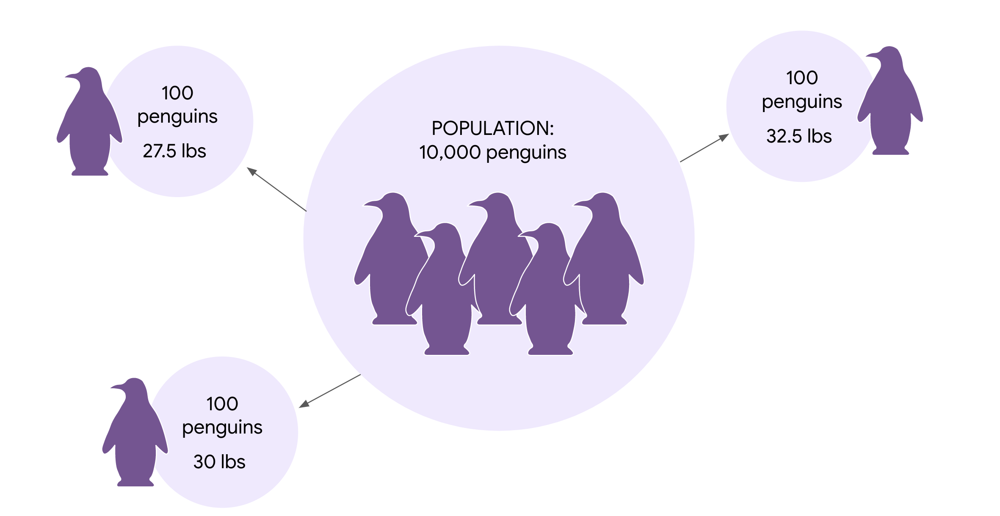
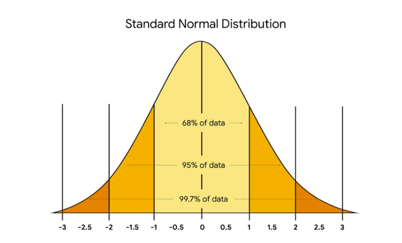
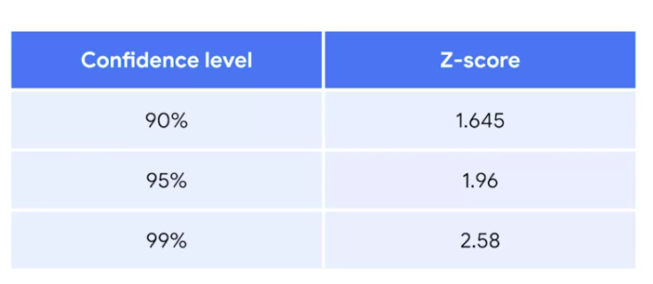
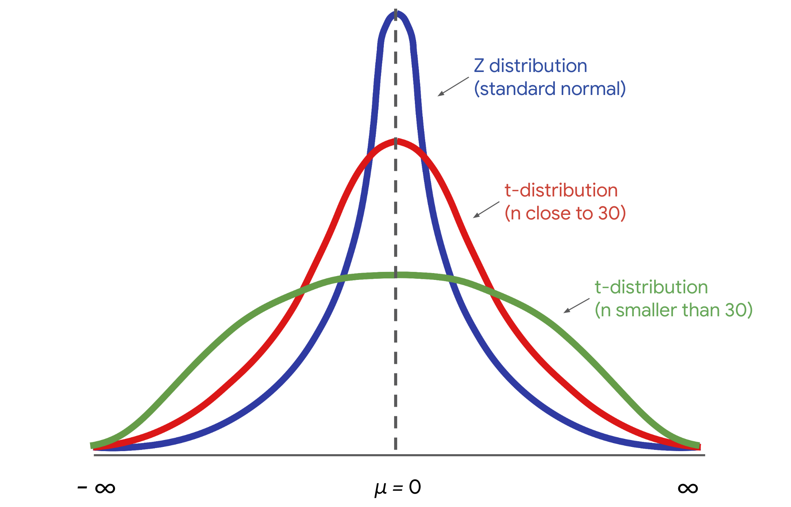

```{python}
#| include: false
import _setup
```

​A confidence interval is a range of values that ​describes the uncertainty surrounding an estimate. ​In stats and data science, ​there are different ways to describe ​the uncertainty of an estimate.

​Two of the main ways are ​confidence intervals and credible intervals. ​These concepts correspond to two different ways of ​thinking about statistics, frequentist and Bayesian. - ​Confidence intervals are frequentist concept, ​ - credible intervals are Bayesian concept.

​Well, the goal of confidence and ​credible intervals is similar. ​They have different statistical definitions ​and technical procedures. ​Right now, you don't need to worry about the details. ​I just want you to be aware of the broader context of ​different stats methods and ​the tools data professionals ​use to analyze and interpret data. ​Today, there's a lively debate among statisticians, ​researchers, and data professionals about how ​to apply and interpret confidence intervals. ​While the nuances of this debate ​are beyond the scope of this course, ​you may want to learn more about confidence intervals ​as you pursue your career in data analytics. ​Whether or not you join this ongoing conversation, ​it's important to know how to construct and interpret ​a confidence interval for at least two reasons. ​First, many data professionals use confidence intervals ​regularly as part of ​their job and it may soon be a part of yours. ​Second, there's a good chance you may be ​asked about confidence intervals ​in a future job interview, ​so it's essential to have a foundation in the topic. ​Coming up, we'll discuss ​the importance of confidence intervals and ​data-driven work and how they can help you ​describe the uncertainty of an estimate. ​For example, data professionals ​might use a confidence interval to describe ​the uncertainty of an estimate for ​the average return on investment for stock portfolio. ​The average maintenance costs for factory machinery, ​the percentage of customers who will ​register for rewards program, ​and the percentage of website visitors ​who will click on an ad. ​However, confidence intervals are often misinterpreted, ​which can lead to false conclusions in a study. ​You'll also learn how to correctly interpret ​confidence intervals and how to avoid common mistakes. ​We'll go over the procedure for ​constructing a confidence interval ​from identifying a sample statistics ​and choosing a confidence level, ​to finding the margin of error ​and calculating the interval. ​Then you'll learn how to construct ​confidence intervals for both means and proportions. ​Finally, you'll learn how to use Python SciPy stats ​module to construct a confidence interval ​for a point estimate of a population mean. ​When you're ready to learn more, ​I'll meet you in the next video.

# Introduction to confidence intervals

Earlier, we talked about how data professionals ​make point estimates about population parameters. ​For example, based on a sample of 100 penguins, ​a data professional might estimate that the mean weight of ​a population of 10,000 penguins is 31 pounds; ​or, based on a poll of 100 voters, ​a data professional might estimate that 55% of all ​100,000 voters prefer a certain candidate ​in an upcoming election.

**​A point estimate uses ​a single value to estimate a population parameter. ​In contrast, an interval estimate uses ​a range of values to estimate a population parameter.**

​A confidence interval is a type of interval estimate. ​For example, for penguin weight, ​you might construct a 95\% confidence interval ​between 28-32 pounds, ​or for the election poll, ​you might construct a 99\% ​confidence interval between 51-57%.

​In this video, we'll go over the main components of ​a confidence interval and discuss how ​confidence intervals help you ​express the uncertainty of an estimate.

​Typically, data professionals use ​confidence intervals rather than ​point estimates to share the results. ​A point estimate can be useful, ​but a single value like 30 pounds does not ​express the uncertainty built into any estimate. ​This uncertainty is due to the method of random sampling.

​For the purpose of our example, ​let's imagine that the mean weight of all ​10,000 penguins is 31 pounds, ​although you wouldn't know this ​unless you weighed every penguin. ​In practice, data professionals usually select ​one random sample because ​repeated random sampling is ​often expensive and time-consuming. ​Since the sample is random, ​the mean of any given sample will likely ​not be equal to the actual population mean. ​For example, you may happen to weigh ​a sample of penguins that have ​recently struggled to find food. ​They only weigh 28 pounds, ​or you may weigh a sample of penguins ​that recently fed on a fish buffet ​and are above average, at 32 pounds. ​Either way, your sample estimate will not ​equal the population mean of 31 pounds. ​If you only provide a sample statistic or point estimate, ​it won't be as accurate. ​**Confidence intervals give ​data professionals a way to express ​the uncertainty caused by ​randomness and provide a more reliable estimate.** ​Along with the sample statistic, ​a confidence interval includes ​a margin of error and a confidence level.

​Let's explore our penguin example to get ​a better idea of each component. ​We'll start with our sample statistic. ​The sample mean of our group of penguins is 30 pounds. ​Next, we will determine the interval for our estimate, ​which is defined by the sample statistic ​plus or minus the margin of error. **​The margin of error represents ​the maximum expected difference between ​a population parameter and a sample estimate.** ​In other words, this is ​the amount that a data professional ​expects their estimate might ​vary from their actual amount. ​If our sample step for our penguins is ​30 pounds and our margin of error is plus or ​minus two pounds that means that the lower limit of ​the interval is 28 pounds and ​the upper limit is 32 pounds. ​This range of values expresses ​the uncertainty in your estimate due to random sampling.

​**Calculating the margin of error involves ​multiplying the standard error by a z-score.** ​Remember, **a z-score measures the distance of ​a data point from the population mean ​in a standard normal distribution.** ​Typically, you'll use a computer for these calculations. ​

Along with a sample statistic and margin of error, ​a confidence interval also includes a confidence level. **​The confidence level describes ​the likelihood that a particular sampling method ​will produce a confidence interval ​that includes the population parameter.**

​For example, say you use a 95\% confidence level to ​calculate a confidence interval between 28-32 pounds. ​Technically, this means that if you ​took 100 random samples from ​the penguin population and calculated ​a 95\% confidence interval for each sample, ​then approximately 95 of the 100 intervals, ​or 95\% of the total, ​would contain the actual population mean. ​One such interval will be the range ​of values between 28-32 pounds.

​If this explanation seems rather ​abstract right now, don't worry. ​In a later video, ​we'll discuss confidence level in more detail.

​As a data professional, ​you can choose your own confidence level based ​on the desired accuracy of your estimate. ​Common confidence levels are 90, 95, ​and 99\%. 95\% is a popular choice. ​For example, most election polls ​report a 95\% confidence level, ​and most A/B tests recommend ​using a confidence level of 95\%. ​Note that there's nothing magical about 95\%. ​This is a choice based on tradition and ​statistical research and education. ​You can adjust the confidence level to ​meet the requirements of your analysis.

​Let's explore another example. ​Imagine you're a data ​professional working for a fashion company. ​Your manager asks you to estimate ​sales revenue for the new line of spring clothing. ​When you meet with stakeholders, you might say, ​"I think we'll do \$1 million in sales," or you might say, ​"Based on a 95\% confidence level, ​I estimate that our sales revenue will be ​between \$950,000 and \$1,050,000. ​The first statement offers a point estimate. ​The second statement provides a confidence level and ​an interval estimate and ​communicates the uncertainty in the estimate. ​It gives your stakeholders ​more information and helps them make ​more informed decisions about ​issues related to future sales revenue. ​As a data professional, ​you also have to make sure ​your stakeholders understand your results, ​so it's your job to clearly ​communicate how to interpret a confidence interval. ​We'll discuss interpretation more later on.

------------------------------------------------------------------------

# Interpret confidence intervals

Recently, you learned that data professionals use confidence ​intervals to express the uncertainty in their results. ​To better understand the results and ​effectively communicate them to stakeholders, ​it's important to know how to properly interpret a confidence interval. ​

Confidence intervals are one of the most misunderstood concepts in statistics. ​Because it's a complicated topic, both new students and experienced researchers ​sometimes make inaccurate statements about confidence intervals. ​So if you don't get the concept right away, don't worry, you're not alone. 

By the end of this video, ​you'll have a better understanding of how to interpret a confidence interval. ​You'll also learn some common forms of misinterpretation and how to avoid them. 

​Let's explore an example. ​Imagine you're data professional who works for ​an urban planning company in a large city. ​The city government asked your team to design new parks and ​walkways that feature red maple trees. ​For planning purposes, your manager asks you to estimate the mean height of all ​the red maple trees in the city, that's approximately 10,000 trees. ​Instead of measuring every single tree, you collect a sample of 50 trees. ​The mean height of the sample is 50ft with a standard deviation of 7.5ft. ​Based on a 95\% confidence level, you calculate a confidence interval for ​mean height that stretches between 48ft and 52ft. 

```{python}
#| echo: false
import numpy as np
import matplotlib.pyplot as plt
from scipy import stats

# 1. Given Scenario Parameters
N = 10_000         # Total population of red maple trees
n = 50             # Sample size
sample_mean = 50.0 # Sample mean height (in feet)
sample_std = 7.5   # Sample standard deviation (in feet)
confidence = 0.95  # Confidence level (95\%)

# 2. Calculate Standard Error (SE)
# SE = s / sqrt(n)
standard_error = sample_std / np.sqrt(n)

# 3. Calculate Degrees of Freedom for $t$-distribution
df = n - 1

# 4. Calculate Critical t-value (t*) for 95\% confidence
t_critical = stats.t.ppf((1 + confidence) / 2, df=df)

# 5. Calculate Margin of Error (MoE)
margin_of_error = t_critical * standard_error

# 6. Calculate Confidence Interval
ci_lower = sample_mean - margin_of_error
ci_upper = sample_mean + margin_of_error

# Print Results
print("--- CONFIDENCE INTERVAL REPORT ---")
print(rf"Sample Size (n): {n}")
print(rf"Sample Mean: {sample_mean:.2f} ft")
print(rf"Standard Error (SE): {standard_error:.4f} ft")
print(rf"Critical t-value (t*): {t_critical:.4f}")
print(rf"Margin of Error: {margin_of_error:.2f} ft")
print(rf"95% Confidence Interval: [{ci_lower:.2f} ft, {ci_upper:.2f} ft]")

# ---------------------------------------------------------
# Optional: Plotting the Confidence Interval & Sample Mean
# ---------------------------------------------------------
plt.figure(figsize=(8, 3))

# Plot the sample mean point and the error bar for CI
plt.errorbar(
    x=sample_mean, 
    y=0, 
    xerr=margin_of_error, 
    fmt='o', 
    color='#004a99', 
    ecolor='#004a99', 
    elinewidth=2, 
    capsize=8, 
    capthick=2, 
    label='Sample Mean & 95% CI'
)

# Customize plot appearance
plt.axvline(x=ci_lower, color='red', linestyle='--', alpha=0.7, label=rf'Lower Bound ({ci_lower:.2f} ft)')
plt.axvline(x=ci_upper, color='red', linestyle='--', alpha=0.7, label=rf'Upper Bound ({ci_upper:.2f} ft)')

plt.title("95% Confidence Interval for Red Maple Tree Heights", fontsize=12, fontweight='bold')
plt.xlabel("Tree Height (feet)")
plt.yticks([])  # Hide Y-axis ticks since it's a 1D range
plt.xlim(45, 55)
plt.legend(loc='upper right')
plt.grid(axis='x', linestyle=':', alpha=0.6)
plt.tight_layout()

plt.show()
```

​This interval estimate will help your team design new parks and ​walkways that meet city ordinances for landscaping. ​At this point, you may be wondering what does it mean to choose a 95\% confidence ​level and to say that you are 95\% confident in an interval estimate? ​Earlier, you learned that the confidence level expresses the uncertainty ​of the estimation process. ​Let's talk about what this means from a more technical perspective. 

​95\% confidence means that if you take repeated random samples from a population ​and construct a confidence interval for each sample using the same method, you can expect that **95\% of these intervals will capture the population mean**. ​You can also expect that 5\% of the total will not capture the population mean. 

​In practice, data professionals usually select one random sample and ​generate one confidence interval which may or may not contain the actual mean. ​This is because repeated random sampling is often difficult, expensive and ​time consuming. 

​Confidence intervals give data professionals a way to quantify ​the uncertainty due to random sampling. ​In our example, ​you have a 95\% confidence interval that the mean height is between 48 and 52 ft. 

​For the purpose of this example, let's say the actual mean height of all, ​10,000 red maples is 51 ft. ​In practice, you would have no way of knowing this unless you measured every ​single tree in the city. ​This means that if you were to take 20 random samples of 50 trees and ​calculate a confidence interval for each sample. ​You can expect 19 out of your 20 intervals or ​95\% of the total will capture the population mean of 51 ft. 

```{python}
#| echo: false

import numpy as np
import matplotlib.pyplot as plt
from scipy import stats

# 1. Set seed for reproducible results (ensures exactly 1 out of 20 misses)
np.random.seed(445)

# 2. Population and Sampling Parameters
true_pop_mean = 51.0    # Actual population mean height
pop_std = 7.5           # Population standard deviation
n = 50                  # Sample size
num_samples = 20        # Number of samples (20 intervals)
confidence = 0.95       # 95\% Confidence Level

# Critical t-value for 95\% confidence
t_critical = stats.t.ppf((1 + confidence) / 2, df=n - 1)

# 3. Simulate 20 samples and calculate their CIs
sample_means = []
ci_lowers = []
ci_uppers = []
contains_mean = []


for _ in range(num_samples):
    # Draw a sample of 50 trees from a normal population
    sample = np.random.normal(loc=true_pop_mean, scale=pop_std, size=n)
    
    mean = np.mean(sample)
    std = np.std(sample, ddof=1)
    se = std / np.sqrt(n)
    
    moe = t_critical * se
    lower = mean - moe
    upper = mean + moe
    
    # Check if the interval captures the true population mean
    captures = (lower <= true_pop_mean <= upper)
    
    sample_means.append(mean)
    ci_lowers.append(lower)
    ci_uppers.append(upper)
    contains_mean.append(captures)

# 4. Recreate the Plot
fig, ax = plt.subplots(figsize=(10, 5))

# Plot horizontal dashed line for the true population mean
ax.axhline(
    y=true_pop_mean, 
    color='gray', 
    linestyle='--', 
    linewidth=1.5, 
    zorder=1
)
ax.text(
    x=-0.8, 
    y=true_pop_mean, 
    s="Population\nmean", 
    va='center', 
    ha='right', 
    fontsize=10, 
    color='#333333'
)

# Plot each interval
for i in range(num_samples):
    x_pos = i + 1
    mean = sample_means[i]
    lower = ci_lowers[i]
    upper = ci_uppers[i]
    captures = contains_mean[i]
    
    # Match colors from the image: Green for capturing, Gold/Yellow for missing
    line_color = '#2ecc71' if captures else '#f1c40f'
    cap_marker = 's'       # Square caps like the original
    
    # Vertical interval line
    ax.plot([x_pos, x_pos], [lower, upper], color=line_color, linewidth=2, zorder=2)
    
    # Endpoint caps (squares)
    ax.plot(x_pos, lower, marker=cap_marker, color=line_color, markersize=5, zorder=3)
    ax.plot(x_pos, upper, marker=cap_marker, color=line_color, markersize=5, zorder=3)
    
    # Center sample mean (blue dot)
    ax.plot(x_pos, mean, marker='o', color='#4a90e2', markersize=8, zorder=4)

# Styling details
ax.set_title("Confidence Intervals", fontsize=16, pad=15)
ax.set_xlim(0, num_samples + 1)

# Remove axes ticks and frame to match clean visual layout
ax.set_xticks([])
ax.set_yticks([])
for spine in ax.spines.values():
    spine.set_visible(False)

plt.tight_layout()
plt.show()
```

​One such interval will be the range of values between 48 and 52 ft.

​Let's pause for a moment. ​I know that's a lot of new info to digest. ​Confidence intervals can be a bit tricky, ​that's why they're misinterpreted so often. ​To better understand what it means to say, you have 95\% confidence in your estimate, ​let's explore our urban planning example in more detail. ​Imagine you take another 20 random samples of 50 trees using the same ​sampling method. ​Because each sample is randomly selected from a large population, ​the mean will vary from one sample to the next. 

​Remember this is called sampling variability. ​For your first sample of 50 trees, the mean height is 50 ft. ​For your second sample of 50 trees, the mean height turns out to be 49.5 ft. ​For your third sample you get a mean height of 51.5 ft and so on. 

Because of sampling variability, the mean height for ​any given sample will not necessarily be equal to the actual population mean. Confidence intervals help express this uncertainty. ​The confidence intervals you calculate based on each sample mean ​will also vary from one sample to the next and ​any given interval will not necessarily contain the population mean of 51 ft. 

​For example, your first sample has a mean height of 50 ft and ​a confidence interval between 48 ft and 52 ft. ​This interval captures the population mean of 51 ft. ​Your second sample has a mean height of 49.5 ft and ​a confidence interval between 47.5 to 50.5 ft. ​This interval does not capture the population mean of 51 ft. ​However, a 95\% confidence level means that you can expect that 19 ​out of your 20 intervals or 95\% of the total will capture the population mean. ​In other words, this method will produce an interval that contains the population ​mean with the success rate of 95\% and that's a pretty good success rate. ​Now that you have a better understanding of how to interpret a confidence interval, ​let's review three common misinterpretations of this concept. 

​Being aware of these misinterpretations will help you avoid them in the future. 

​The first common misinterpretation of confidence intervals is that a 95\% ​confidence interval means that 95\% of all the data values in your data set ​fall within the interval. ​This is not necessarily true. ​For example, your 95\% confidence interval for tree heights is between 48 ft and 52. ​ft It may not be accurate to say that 95\% of all the values in your ​data set fall in this interval. ​It's possible that over 5% of the tree heights in your dataset are outside ​this interval either shorter than 48 ft or taller than 52 ft. 

​The second common misinterpretation, is that a 95\% confidence interval implies ​that 95\% of all possible sample means fall within the range of the interval. ​This is not necessarily true. 

​For example, your 95\% confidence interval for ​tree height is between 48 ft and 52 ft. ​Imagine you take repeated samples using the same sampling method. ​It's possible that over 5% of your sample means will be less than 48 ft or ​greater than 52 ft. 

​The third common misinterpretation is to assume that a confidence interval refers ​to the only possible source of error in your results. ​While every confidence interval includes a margin of error, ​many other kinds of errors can enter into statistical analysis. ​For example, the questions in a survey may be poorly designed or ​sampling bias may affect the sample data. ​The margin of error is a useful measure of uncertainty and makes your estimate more ​reliable, but it's not the only possible source of error in your analysis. 

​So when you're interpreting a confidence interval, remember ​that the uncertainty lies in an estimation process based on random sampling. 

**​A 95\% confidence level refers to the success rate of that process. ​In other words, you can expect 95\% of the random intervals you generate to ​capture the population Parameter.** ​Knowing how to properly interpret confidence intervals will give you ​a better understanding of your estimate and help you share useful and ​accurate information with stakeholders. 

​You may need to explain the common misinterpretations, too, and ​why they're incorrect. ​You don't want your stakeholders to get the wrong idea or ​base their decisions on a misinterpretation. ​Understanding how to effectively communicate your results to stakeholders ​is an important part of being a data professional.

# Confidence intervals: Correct and incorrect interpretations

Recently, you learned that data professionals use confidence intervals to help describe the uncertainty surrounding an estimate. To better understand your data, and effectively communicate your results to stakeholders, it’s important to know how to correctly interpret a confidence interval.

In this reading, we’ll review the correct way to interpret a confidence interval. We’ll also discuss some common forms of misinterpretation and how to avoid them.

Correct interpretation
Example: mean weight Let’s explore an example to get a better understanding of how to interpret a confidence interval. Imagine you want to estimate the mean weight of a population of 10,000 penguins. Instead of weighing every single penguin, you select a sample of 100 penguins. The mean weight of your sample is 30 pounds. Based on your sample data, you construct a 95\% confidence interval between 28 pounds and 32 pounds. 95 CI \[28, 32\] Interpret the confidence interval Earlier, you learned that the confidence level expresses the uncertainty of the estimation process. Let’s discuss what 95\% confidence means from a more technical perspective.

Technically, 95\% confidence means that if you take repeated random samples from a population, and construct a confidence interval for each sample using the same method, you can expect that 95\% of these intervals will capture the population mean. You can also expect that 5% of the total will not capture the population mean.

The confidence level refers to the long-term success rate of the method, or the estimation process based on random sampling.

For the purpose of our example, let’s imagine that the mean weight of all 10,000 penguins is 31 pounds, although you wouldn’t know this unless you actually weighed every penguin. So, you take a sample of the population.

Imagine you take 20 random samples of 100 penguins each from the penguin population, and calculate a 95\% confidence interval for each sample. You can expect that approximately 19 of the 20 intervals, or 95\% of the total, will contain the actual population mean weight of 31 pounds. One such interval will be the range of values between 28 pounds and 32 pounds.


## Incorrect interpretations

Now that you have a better understanding of how to properly interpret a confidence interval, let’s review some common misinterpretations and how to avoid them. 

### **Misinterpretation 1: 95\% refers to the probability that the population mean falls within the constructed interval**

One incorrect statement that is often made about a confidence interval at a 95\% level of confidence is that there is a 95\% probability that the population mean falls within the constructed interval. 

In our example, this would mean that there’s a 95\% chance that the mean weight of the penguin population falls in the interval between 28 pounds and 32 pounds. 

This is incorrect. The population mean is a constant. 

Like any population parameter, the population mean is a constant, not a random variable. While the value of the sample mean varies from sample to sample, the value of the population mean does not change. The probability that a constant falls within any given range of values is always 0% or 100%.  It either falls within the range of values, or it doesn’t. 

For example, any given random sample of 100 penguins may have a different mean weight: 32.8 pounds, 27.3 pounds, 29.6 pounds, and so on. You can use a sampling distribution to assign a specific probability to each of your sample means because these are random variables. However, the population mean weight is considered a constant. In our example, if you weigh all 10,000 penguins, you’ll find that the population mean is 31 pounds. This value is fixed, and does not vary from sample to sample.

| **Sample Mean (100 penguins)** | **Population Mean (10,000 penguins)** |
|:-------------------------------|:--------------------------------------|
| 32.8 lbs                       | 31 lbs                                |
| 27.3 lbs                       | 31 lbs                                |
| 29.6 lbs                       | 31 lbs                                |

So, it’s not strictly correct to say there is a 95\% chance that your confidence interval captures the population mean because this implies that the population mean is variable. Intervals change from sample to sample, but the value of the population mean you’re trying to capture does not.

What you can say is that if you take repeated random samples from the population, and construct a confidence interval for each sample using the same method, you can expect 95\% of your intervals to capture the population mean. 

**Pro tip:** Remember that a 95\% confidence level refers to the success rate of the estimation process. 

### **Misinterpretation 2: 95\% refers to the percentage of data values that fall within the interval**

Another common mistake is to interpret a 95\% confidence interval as saying that 95\% of all of the data values in the population fall within the interval. This is not necessarily true. A 95\% confidence interval shows a range of values that likely includes the actual population mean. This is *not* the same as a range that contains 95\% of the data values in the population. 

For example, your 95\% confidence interval for the mean penguin weight is between 28 pounds and 32 pounds. It may not be accurate to say that 95\% of all weight values fall within this interval. It’s possible that over 5% of the penguin weights in the population are outside this interval—either less than 28 pounds or greater than 32 pounds. 

### **Misinterpretation 3: 95\% refers to the percentage of sample means that fall within the interval**

A third common misinterpretation is that a 95\% confidence interval implies that 95\% of all possible sample *means* fall within the range of the interval. This is not necessarily true. For example, your 95\% confidence interval for mean penguin weight is between 28 pounds and 32 pounds. Imagine you take repeated samples of 100 penguins and calculate the mean weight for each sample. It’s possible that *over* 5% of your sample means will be less than 28 pounds or greater than 32 pounds.



## Key takeaways

Knowing how to correctly interpret confidence intervals will give you a better understanding of your estimate, and help you share useful and accurate information with stakeholders. You may need to explain the common misinterpretations too, and why they're incorrect. You don't want your stakeholders to base their decisions on a misinterpretation. Understanding how to effectively communicate your results to stakeholders is a key part of your job as a data professional.  

## Resources for more information

To learn more about interpreting confidence intervals, check out the following resources: 

-   This [article from ThoughtCo.](https://www.thoughtco.com/confidence-interval-mistakes-3126405) contains a useful list of common mistakes that are made when interpreting confidence intervals. 

------------------------------------------------------------------------

# Construct a confidence interval for a proportion

Recently, you learned that ​data professionals use confidence intervals to ​describe the uncertainty of ​an estimate for population mean or proportion. ​In this video, you'll learn how to ​construct a confidence interval for a proportion. ​

We'll go step-by-step through ​an example involving election polling, ​later on, we will cover means. ​

Imagine you are a data professional ​working for a polling agency. ​There's an upcoming election for ​governor between two candidates, ​Tiffany Davis and Maya Cruz. ​Your agency represents the Davis campaign. ​Election Day is four weeks away. 

​The Davis team asks you to conduct a poll ​to find out how their candidate is doing. ​You collect a random sample of 100 voters from ​the total population of 100,000 voters. ​You ask them which candidate they plan on voting for. ​The results show that ​55 percent of voters preferred Davis, ​and 45 percent of voters prefer Cruz. ​The poll favors your candidate. ​If Davis gets over 50 percent ​of the vote on election day, ​it's a win, so 55 percent ​is a good result. Great news, right? 

​But you also know that this is ​only a one random sample of ​100 voters out of a large population. ​If you took another random sample of 100 voters, ​you might get different results. ​If you took a third sample, ​the results might differ again and so on. ​In other words, your single sample may not provide ​the actual population proportion or percentage ​of all voters that will vote for Davis on election day. ​For example, on election day, ​Davis may get 52 percent, ​which is good enough to win, ​or a 49 percent, which is not. ​Instead of relying on a point estimate ​as proof that your candidate will win the election, ​you can use your sample data to ​construct a confidence interval. ​This will give the campaign team ​a better idea of the uncertainty of your estimate, ​and of the possible election results. ​Let's construct a confidence interval now. 

​Let's review the steps for ​constructing a confidence interval. 

-   ​First, identify a sample statistic. ​

-   Second, choose a confidence level. ​

-   Third, find the margin of error ​and

-   fourth, calculate the interval. ​

First, identify your **sample statistic**. ​Your pole represents the percentage of ​voters who prefer your candidate, ​which is 55 percent. ​This is a sample proportion. ​

Next, **choose a confidence level** for your poll. ​Most election polls report ​at 95 percent confidence level. ​The Davis campaign also requests that you use ​a 95 percent confidence level in your calculations. ​

Your third step is to find the **margin of error**. ​The margin of error refers to the range of ​values above and below your sample statistic. **​If you're working with a normal distribution ​and a large sample size, ​one way to calculate the margin of error is by ​multiplying the** $z$-score **by the standard error.** 

$$
ME = \text{z-score} \times SE
$$

​Let's break that down. ​To review, **a** $z$-score **measures the distance of ​a data point from the population mean ​and a standard normal distribution.** ​For example, a $z$-score of one is ​one standard deviation above the mean. ​A $z$-score of negative 1.5 is ​1.5 standard deviations below the mean. 

​



This table shows the $z$-scores that ​correspond to popular confidence levels. ​1.645 for 90 percent, ​1.96 for 95 percent, ​and 2.58 for 99 percent. ​If you choose a 95 percent confidence level, ​use a $z$-score of 1.96 to calculate the margin of error. 

To calculate the in python:
```{python}
import numpy as np
from scipy import stats

data = [10, 15, 20, 25, 30]

# Calculate Z-scores
z_scores = stats.zscore(data)
print(z_scores)
# Output: [-1.41421356 -0.70710678  0.          0.70710678  1.41421356]

```

​Now, you need to calculate your **standard error.** ​You may recall that the standard error measures ​the variability of your sample statistic. ​It shows how much your sample proportion is likely ​to differ from the actual population proportion. ​The larger the standard error, ​the more variability in your sample. ​

The formula for the standard error of ​the proportion is the square root of ​the sample proportion times 1 minus ​the sample proportion divided by the sample size. 

$$
SE(\hat{p})=\sqrt{\frac{\hat{p}(1-\hat{p})}{n}}
$$

​Your sample proportion is ​0.55 and your sample size is 100. ​If you enter the numbers into the formula, ​you get a standard error of about 0.05. 
$$
SE(\hat{p})=\sqrt{\frac{0.55(1-0.55)}{100}}=0.05
$$

​Let's put that altogether. ​The margin of error is your $z$-score of ​1.96 multiplied by your standard error of 0.05. 
$$
ME = \text{z-score} \times SE = 1.96 \times 0.05 =0.098
$$

​This equals 0.098. Finally, ​the last step in the process to construct ​a confidence interval is to calculate the interval. 

​The upper limit of your interval is ​the sample proportion plus the margin of error, ​or 0.55 plus 0.098. ​This equals 0.648 or 64.8 percent. ​The lower limit is ​the sample proportion minus the margin of error. ​This is 0.55 minus 0.098 equals 0.452 or 45.2 percent. 

​Therefore, you have a 95 percent ​confidence interval that stretches ​from 45.2 percent to 64.8 percent. ​

While your confidence interval ​mostly lies above 50 percent, ​this isn't necessarily a reason to be ​optimistic about the upcoming election, ​since the lower limit of 45.2 ​percent falls below 50 percent. ​Based on the confidence interval, ​losing the election is still a possibility. ​The campaign team may want to invest more in TV ​or social media advertising to ensure victory. ​Or if the campaign team wants ​a more accurate estimate of the election results, ​they may request another poll with a larger sample size. ​This will be a more accurate estimate ​because it includes more voters. 

​Let's say you conduct another poll with ​a sample size of 1,000 voters. ​The new poll reports that ​54 percent of voters preferred candidate Davis. ​If you calculate a 95 percent confidence interval ​using these numbers:

$$
SE(\hat{p})=\sqrt{\frac{0.54(1-0.54)}{1000}}=0.01576071
$$

$$
ME = \text{z-score} \times SE = 1.96 \times 0.01576071 =0.03089099
$$

95\%CI\[0.509109,0.570891\]

Your integral will stretch from ​50.9 percent to 57.1 percent. ​The lower limit of your interval is now above 50 percent. ​This should give the Davis team ​more confidence about the upcoming election. 

​Of course, there's still a chance ​their candidate may lose the election, ​since the confidence level is ​95 percent, not 100 percent. ​You may notice that as the sample size gets larger, ​the confidence interval gets narrower. 

​With a sample of 100, ​the interval covers 19.6 percentage points. ​With a sample size of 1,000, ​the interval covers 6.2 percentage points. ​This is because as your sample size increases, ​your margin of error decreases.

​If you could sample every member of the population, ​the margin of error would be zero. ​But of course, it's often ​too expensive and time-consuming ​to sample an entire population ​or to take repeated samples. 

​Data professionals typically work with ​a single random sample of a large population. ​Confidence intervals help data professionals give ​more reliable estimates based on the available data, ​and based on your data, ​your candidate will likely win the election.

------------------------------------------------------------------------

# Construct a confidence interval for a mean

Previously, you learned that data professionals use confidence intervals to ​express the uncertainty of an estimate. ​Then you constructed a confidence interval for the proportion of votes in an upcoming ​election in this video, you'll construct another confidence interval, but ​this time for a mean.

The basic process is the same as the one you use for ​proportion but requires new calculations.

We will go step by step through an example ​involving the marketing of a new cell phone. ​Imagine you're a data professional working for a company that produces cell phones. ​Recently, the company developed a phone with an extended battery life. ​It's designed to operate for at least 20 hours without recharging. ​This is a big upgrade in battery life and will boost sales. ​The marketing team is planning an ad campaign about the new battery to help ​sell the phone management wants to make sure the claim about ​20 hours of battery life is accurate for the ads go public. ​They ask you to analyze the data and make a reliable estimate for ​battery life of the new phone. ​

The company has produced 100,000 new phones. ​The Product Engineering team tests a random sample of 100 phones and ​records the data about battery life Based on the data. ​

You know that the sampled mean duration for battery life is 20.5 hours and ​the sample standard deviation is 1.7 hours. ​And based on the campaign's data about the standard manufacturing process of ​the batteries, ​you also know that the population standard deviation is 1.5 hours. ​The sample mean is over 20 hours for this test. ​However, you know that this is only one random sample of 100 ​phones out of a large population. ​If you took another random sample of 100 phones, you might get different results. ​If you took a third random sample, the results might differ again and so on. ​Your single sample may not provide the actual mean battery life for ​all the phones the population mean for battery life could be 19 hours, ​21 hours or something else. ​

You can use your sample data to construct a confidence interval that likely includes ​the population mean, for the phone's battery life, ​This will give the marketing team a better idea of the uncertainty in your estimate. ​It will also help them decide how to advertise the phone and ​whether they can claim that its battery lasts 20 hours or more. ​

Let's review the steps for constructing a confidence interval. ​

-   First, identify a sample statistic. 

-   ​Second, choose a confidence level,

-   third find the margin of error, and 

-   ​fourth, calculate the interval. ​

First, identify your sample statistic. ​Your sample represents the average duration of battery life for ​100 cell phones. ​In this example you're working with the sample mean. ​

Next choose a confidence level Management request that you choose in ​95\% confidence level. ​This is the company standard for new products. ​

Your third step is to find the margin of error which refers to the range of values ​above and below your sample statistic, you can calculate the margin of error by ​multiplying the $z$-score by the standard error. 

​You may recall that the $z$-score you use depends on your confidence level. 

​The $z$-score for a 95\% confidence level is 1.96. ​

Now you can calculate the standard error, ​which measures the variability of your sample statistic. ​It shows how much your sample mean is likely to differ from the actual ​population mean. ​The larger the standard error, the more variability. ​The formula for the standard error of the mean is the population standard ​deviation divided by the square root of the sample size. 

$$
SE =\frac{\sigma}{\sqrt{n}} = \frac{1.5}{\sqrt{100}}=0.15
$$

​Your population standard deviation is 1.5 and your sample size is 100. ​If you enter the numbers into the formula, you get a standard error of 0.15. ​

The margin of error is your Z score 1.96 multiplied by your standard error. 

$$
ME = z-score \times SE = 1.96 \times 0.15 =0.294
$$

 Finally calculate your confidence interval. ​

The upper limit of your interval is the sample mean, plus the margin of error. ​This is 20.5 plus 0.294 equals 20.794 hours or ​about 20 hours and 48 minutes. 

​The lower limit is the sample mean minus the margin of error, ​this is 20.5 minus 0.294 equals 20.206 or ​about 20 hours and 12 minutes. 

95\%CI\[20:12,20:48\]

​So you have a 95\% confidence interval for the battery life of the phone that ​stretches from 20 hours and 12 minutes to 20 hours and 48 minutes. ​The confidence interval gives company management important information. ​The lower limit of your interval 20 hours and ​12 minutes is above the company's goal of 20 hours. ​This helps the marketing team feel confident about advertising ​the battery life of the cell phone to be at least 20 hours. ​You present your findings to the company's stakeholders and ​the results satisfy everyone except the head of marketing. ​The marketing director has put a lot of time and ​effort into developing the ad campaign and wants to be even more confident. 

​The director requests that you analyze the data using a 99\% confidence level To ​make the marketing director happy you recalculate your results. ​Use the same sample data but using 99\% confidence level instead of 95\%

$$
ME = z-score \times SE = 2.58 \times 0.15 =0.387\
$$

99\%CI\[20:07,20:53\]

​Your confidence interval now stretches from 20 hours and ​seven minutes to 20 hours and 53 minutes. ​The lower limit of your interval is still above 20 hours. ​This result should give company management even more confidence about the battery ​life and hopefully satisfy the marketing director. 

​You may notice that **as the confidence level gets higher, the confidence interval ​gets wider,** With the confidence level of 95\%, the interval covers 36 minutes, ​with the confidence level of 99\%, the interval covers 46 minutes. ​This is because a wider confidence interval is more likely to include ​the actual population parameter. ​Note that in this example we know that the population standard deviation is ​1.5 hours. 

**​However, in practice, the population standard deviation is often unknown and ​has to be estimated based on the sample standard deviation. ​This is because it's difficult to get complete data on a large population if you ​don't know the population standard deviation, ​this changes the calculations for the confidence interval**.

To learn more, ​feel free to check out the relevant reading. ​As a data professional, you can use confidence intervals to help stakeholders ​make informed decisions based on accurate estimates. ​Your analysis of the data will help shape the company's strategy for ​the new product launch as a data professional. ​You play a key role in the future success of the new product. 

------------------------------------------------------------------------

# Construct a confidence interval for a small sample size

So far, you’ve constructed confidence intervals for large sample sizes, which are usually defined as sample sizes of 30 or more items. For example, when you estimated the mean battery life of a new cell phone, you used a random sample of 100 phones. On the other hand, small sample sizes are usually defined as having fewer than 30 items. Typically, data professionals try to work with large sample sizes because they give more precise estimates. But, it’s not always possible to work with a large sample. In practice, collecting data is often expensive and time-consuming. If you don’t have the time, money, or resources to take a large sample, you may end up working with a small sample.

In this reading, you’ll learn how to construct a confidence interval for a small sample size. We’ll go step-by-step through an example involving mean emission levels for a new car engine. 

## Large versus small sample sizes

First, let’s briefly discuss the different methods you use to construct confidence intervals for large and small sample sizes.

### **Large sample: Z-scores**

For large sample sizes, you use $z$-scores to calculate the margin of error, just like you did earlier to estimate mean battery life for cell phones. This is because of the central limit theorem: for large sample sizes, the sample mean is approximately normally distributed. For a standard normal distribution, also called a **z-distribution**, you use $z$-scores to make calculations about your data. 

### **Small sample: T-scores** 

For small sample sizes, you need to use a different distribution, called the $t$-distribution. Statistically speaking, this is because there is more uncertainty involved in estimating the standard error for small sample sizes. You don't need to worry about the technical details, which are beyond the scope of this course. For now, just know that **if you're working with a small sample size, and your data is approximately normally distributed, you should use the** $t$-distribution **rather than the standard normal distribution.**

For a $t$-distribution, you use $t$-scores to make calculations about your data. 

The graph of the $t$-distribution has a bell shape that is similar to the standard normal distribution. But, the $t$-distribution has bigger tails than the standard normal distribution does. The bigger tails indicate the higher frequency of outliers that come with a small dataset. As the sample size increases, the $t$-distribution approaches the normal distribution. When the sample size reaches 30, the distributions are practically the same, and you can use the normal distribution for your calculations. 



## Example: Mean emission levels 

Now that you know a little bit about the $t$-distribution and $t$-scores, let’s construct a confidence interval for a small sample size. 

### **Context**

Imagine you’re a data professional working for an auto manufacturer. The company produces high performance cars that are sold around the world. Typically, the engines in these cars have high emission rates of carbon dioxide, or CO~2~, which is a greenhouse gas that contributes to global warming. The engineering team has designed a new engine to reduce emissions for the company’s best-selling car. 

### **Goal**

The goal is to keep emissions below 460 grams of CO~2~ per mile. This will ensure the car meets emissions standards in every country it's sold in. Plus, the lower emissions rate is good for the environment, which will appeal to new customers. 

### **Ask**

The engineering team asks you to provide a reliable estimate of the emissions rate for the new engine. Due to production issues, there are only a limited number of engines available for testing. So, you’ll be working with a small sample size. 

### **Sample**

The engineering team tests a random sample of 15 engines and collects data on their emissions. The mean emission rate is 430 grams of CO~2~ per mile, and the standard deviation is 35 grams of CO~2~ per mile. 

Your single sample may not provide the actual mean emissions rate for *every* engine. The population mean for emissions could be above or below 430 grams of CO~2~ per mile. Even though you only have a small sample of engines, you can construct a confidence interval that likely includes the actual emission rate for a large population of engines. This will give your manager a better idea of the uncertainty in your estimate. It will also help the engineering team decide if they need to do more work on the engine to lower the emissions rate. 

## Construct the confidence interval

Let’s review the steps for constructing a confidence interval: 

1.  Identify a sample statistic. 

2.  Choose a confidence level. 

3.  Find the margin of error. 

4.  Calculate the interval.

### Step 1: Identify a sample statistic  

First, identify your sample statistic. Your sample represents the average emissions rate for 15 engines. You’re working with a sample *mean*. 

### Step 2: Choose a confidence level 

Next, choose a confidence level. The engineering team requests that you choose a 95\% confidence level. 

### Step 3: Find the margin of error  

Your third step is to find the margin of error. For a small sample size, you calculate the margin of error by multiplying the $t$-score by the standard error. 

The $t$-distribution is defined by a parameter called the degree of freedom. In our context, the degree of freedom is the sample size - 1, or 15-1 = 14. Given your degree of freedom and your confidence level, you can use a programming language like Python or other statistical software to calculate your $t$-score. 

```{python}
from scipy import stats

# 1. Given parameters
sample_size = 15
df = sample_size - 1  # 14 degrees of freedom
confidence_level = 0.95

# 2. Calculate the critical t-score (two-tailed)
# We evaluate the probability at (1 + confidence_level) / 2 = 0.975
t_score = stats.t.ppf((1 + confidence_level) / 2, df=df)

# 3. Print result formatted to 3 decimal places
print(rf"Degree of Freedom (df): {df}")
print(rf"Confidence Level: {int(confidence_level * 100)}%")
print(rf"Calculated t-score: {t_score:.3f}")
```

Based on a degree of freedom of 14, and a confidence level of 95\%, your $t$-score is 2.145.

Now you can calculate the standard error, which measures the variability of your sample statistic. 

Here’s the formula for the standard error of the mean that you’ve used before:

**Standard Error (Means)**

SE(x)=s/√(n)

In the formula, the letter $s$ refers to sample standard deviation, and the letter $n$ refers to sample size. 

Your sample standard deviation is 35, and your sample size is 15. The calculation gives you a standard error of about 9.04. 

```{python}
import numpy as np
se = 35/np.sqrt(15)
se
```

The margin of error is your $t$-score multiplied by your standard error. This is 2.145 \* 9.04 = 19.39.

### Step 4: Calculate the interval 

Finally, calculate your confidence interval. The upper limit of your interval is the sample mean plus the margin of error. This is 430 + 19.39 = 449.39 grams of CO~2~ per mile. 

The lower limit is the sample mean minus the margin of error. This is 430 − 19.39 = 410.61 grams of CO~2~ per mile. 

You have a 95\% confidence interval that stretches from 410.61 grams of CO~2~ per mile to 449.39 grams of CO~2~ per mile.

**95 CI \[410.61, 449.39\]**

The confidence interval gives the engineering team important information. The upper limit of your interval is below the target of 460 grams of CO~2~ per mile. This result provides solid statistical evidence that the emissions rate for the new engine will meet emissions standards. 

**Note**: Confidence intervals for small sample sizes only deal with population means, and not population proportions. The statistical reason for this distinction is rather technical, so you don’t need to worry about it for now.

## Key takeaways 

As a data professional, you’ll work with both large and small sample sizes. Although large samples give more precise estimates than small samples, collecting a small sample is usually less expensive and time-consuming than collecting a large sample. Knowing how to construct confidence intervals for different sample sizes will help you manage any dataset that you may encounter in your future career. 

## Resources for more information

To learn more about constructing confidence intervals for different sample sizes, refer to the following resources: 

-   This [article from Scribbr](https://www.scribbr.com/statistics/$t$-distribution/) contains a useful overview of the $t$-distribution and how to use it when constructing a confidence interval.

------------------------
# Work with confidence intervals in Python

Earlier, we talked about how data professionals use sample ​data to make point estimates about population parameters. ​For example, a data professional might take a random sample of 100 home ​prices in Mexico city to estimate the average price of all homes in Mexico city. 

​A point estimate can provide a general idea of a population parameter, but ​estimates usually include some error due to sampling variability. ​And in practice, taking repeated samples to get improved estimates is often ​too expensive and time consuming. ​So, data professionals use confidence intervals to describe the uncertainty of ​an estimate, and give stakeholders more information to work with. 

​In this video, you'll use python to construct confidence interval for ​a point estimate. ​We'll continue with our previous scenario, in which you're a data professional ​working for the Department of Education of a large nation, ​recall that you're analyzing data on the literacy rate for each district. 
​You'll continue to use the data that you worked with before. ​If you need to access the data, do so now. 

​In the previous video we imagine that the Department of Education asked you to ​collect the data on district literacy rates. ​You were only able to survey 50 randomly chosen districts, ​instead of all 634 districts included in your original data set. 

​You use python to simulate taking a random sample of 50 districts, and ​making a point estimate of the population mean or literacy rate for all districts. 

​Now, as the next step, imagine that the department asks you to construct a 95\% ​confidence interval for your estimate of the mean district literacy rate. ​You can use python to construct the confidence interval. 

​Let's open up a jupyter notebook and begin, ​first import the python packages you plan to use, numpy and pandas. ​To save time rename your packages with abbreviations, np and pd. ​To load the scipy stats module right from scipy import stats. ​You can also use the same sample data that you worked with in a previous video, ​write the code to have python simulate the same random sample of district literacy ​rate data. ​

```{python}
import numpy as np
import pandas as pd
from scipy import stats

education_districtwise = pd.read_csv(r"Datasets/education_districtwise.csv")
education_districtwise = education_districtwise.dropna()
sample_size = 50
sampled_data = education_districtwise.sample(n=sample_size, replace=True, random_state=31208)
sampled_data.head()
```

​The output shows the districts selected randomly from your dataset. ​Each has a different literacy rate. 

​In previous videos, you constructed a confidence interval step by step, ​let's review the four main steps. ​One, identify a sample statistic, two, choose a confidence level, ​three, find the margin of error, four, calculate the interval. 

​Earlier, you worked through these steps, ​one by one to construct a confidence interval. 

​With python you can construct a confidence interval with just a single line of code, ​and get your results faster. ​If you're working with a large sample size, say larger than 30, ​you can construct a confidence interval for ​the mean using scipy stats.`norm.interval` function. ​

```{python}
sample_mean = sampled_data.OVERALL_LI.mean()
print(sample_mean)
sample_std = np.std(sampled_data.OVERALL_LI, ddof= 1)
sample_se = sample_std /np.sqrt(sample_size)
#large sample size 
ci = stats.norm.interval(confidence = 0.95, loc = sample_mean, scale = sample_se)
ci
```

This function includes the following arguments. 
​-   `confidence` refers to the confidence level, 
-   `loc` refers to the sample mean, ​and 
-   `scale` refers to the sample standard error. ​

Let's explore each argument in more detail. 

​First, `confidence` or your confidence level. ​The Education Department requests a confidence level of 95\%, ​which is the accepted standard for government funded research. 

​Second, `loc`, or the sample mean, ​this is the mean literacy rate of your sample of 50 districts. 

​Third, `scale`, or the sample standard error. ​Recall that standard error measures the variability of your sample data. ​You may remember that the formula for the sample standard error is the sample ​standard deviation divided by the square root of the sample size. ​You can write code to express the formula and ​have python do the calculation for you. 

​Python makes this process super efficient. ​You have a 95\% confidence interval for the mean district literacy rate, ​that stretches from about 71.4% to 77.0%. ​The Department of Education will use your estimate of the mean district literacy ​rate to help make decisions about distributing funds to different states. 

​Now, imagine that a senior director in the Department wants to ​be even more confident about your results. 
​The director wants to make sure you have a reliable estimate, and ​suggest that you recalculate your interval with a 99\% confidence level. 

​To choose a new confidence level, copy and paste your previous code. ​Change your confidence from 0.95 to 0.99 to compute ​a 99\% confidence interval based on the sample data. ​Now, run the code, and here's your confidence interval. 

```{python}
ci = stats.norm.interval(confidence = 0.99, loc = sample_mean, scale = sample_se)
ci
```

​You have a 99\% confidence interval for the mean district literacy ​rate that stretches from about 70.5\% to 77.9\%. 

​You may notice that as the confidence level gets higher, ​the confidence interval gets wider. 
​With a confidence level of 95\%, the interval covers 5.6\% points. 
​With the confidence level of 99\%, the interval covers 7\% points. 
​This is because a wider confidence interval is more likely to include ​the actual population parameter. 

​In our scenario for this video, you only have data on 50 districts. ​However, in earlier videos, you computed the mean literacy rate for ​all 634 districts in your data set as about 73.4\%. ​So, as it turns out, ​both your confidence intervals capture the actual population mean. ​Your results will help the Department of Education decide ​how to distribute government resources to improve literacy. 

