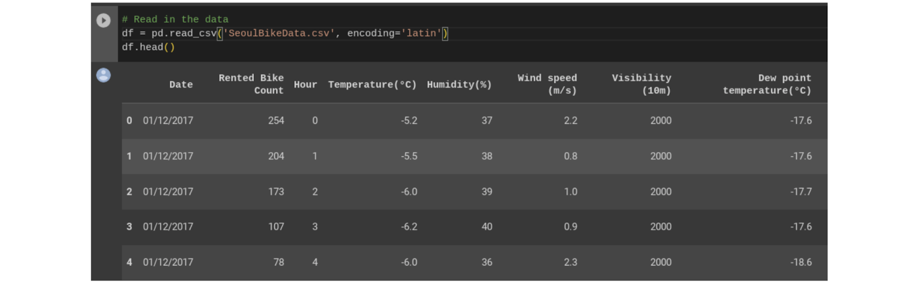
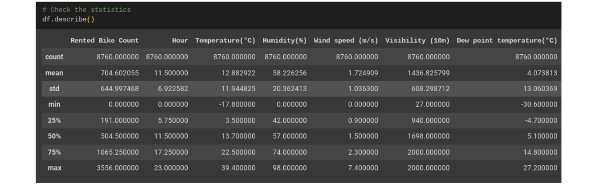
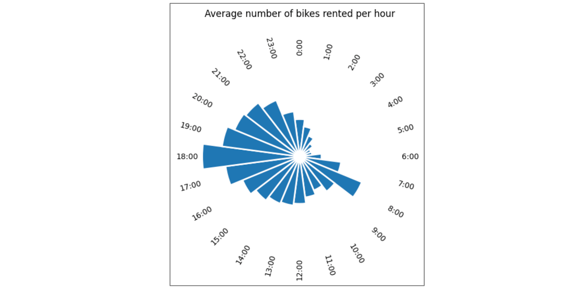
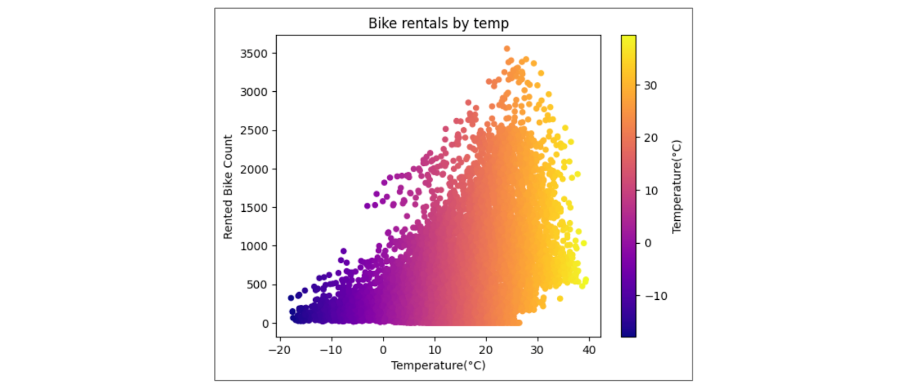
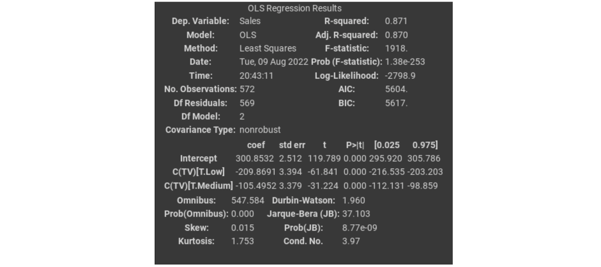
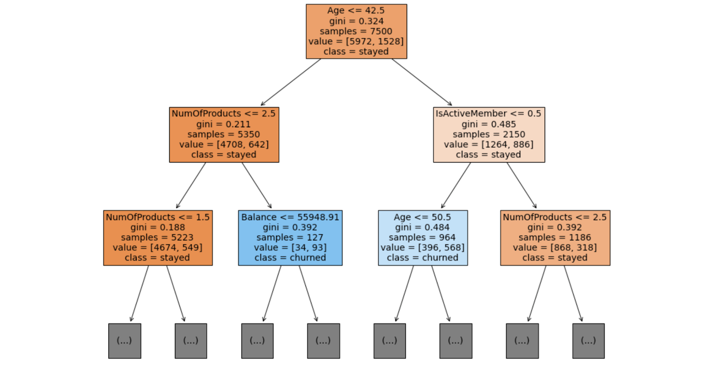

One of the greatest skills a data professional can have is learning how to apply their knowledge of one tool to another tool. Throughout your career, you might discover that different organizations you work for use different tools—and in the field of data science, new and emerging technologies mean that exciting new tools are being developed all the time. This means there will always be opportunities to expand your data science toolkit! In this reading, you will learn more about tools today, including some of the tools you’re going to learn about in this program. You will also explore some of the exciting ways tools are evolving and what that might mean for your toolkit in the future. Finally, you will explore a demonstration that illustrates how you’ll be using some of these tools in the very near future.

# Tools today

In this certificate program, you will have the opportunity to learn about many common tools data professionals use every day: spreadsheets, databases, query languages, data visualization, programming languages, and dashboards. Understanding the current tool landscape—and how it’s changing—will help you continue to grow your data science skills throughout your career. And understanding how the skills you learn for one tool can be applied to another means that you can adapt and add more tools to your toolkit!

+-----------------------+--------------------------------------------------------------------------------+--------------------------+--------------------------------------------+
| **Tool**              | **Definition**                                                                 | **Examples**             | **Transferable skills**                    |
+:======================+:===============================================================================+:=========================+:===========================================+
| Spreadsheets          | A digital worksheet where data can be manipulated and used for calculations    | -   Google Sheets        | -   Data entry                             |
|                       |                                                                                |                          |                                            |
|                       |                                                                                | -   Microsoft Excel      | -   Mathematical calculations              |
|                       |                                                                                |                          |                                            |
|                       |                                                                                |                          | -   Manage datasets                        |
|                       |                                                                                |                          |                                            |
|                       |                                                                                |                          | -   Task automation                        |
|                       |                                                                                |                          |                                            |
|                       |                                                                                |                          | -   Data manipulation                      |
|                       |                                                                                |                          |                                            |
|                       |                                                                                |                          | -   Data analysis                          |
+-----------------------+--------------------------------------------------------------------------------+--------------------------+--------------------------------------------+
| Databases             | A collection of data stored in a computer system                               | -   Google Cloud         | -   Database design                        |
|                       |                                                                                |                          |                                            |
|                       |                                                                                | -   CloudSQL             | -   Data storage management                |
|                       |                                                                                |                          |                                            |
|                       |                                                                                | -   Oracle               | -   Data integrity                         |
|                       |                                                                                |                          |                                            |
|                       |                                                                                | -   Microsoft SQL Server |                                            |
+-----------------------+--------------------------------------------------------------------------------+--------------------------+--------------------------------------------+
| Programming languages | A system of words and symbols used to write instructions that computers follow | -   SQL                  | -   Communicate with computer systems      |
|                       |                                                                                |                          |                                            |
|                       |                                                                                | -   R                    | -   Write and input commands               |
|                       |                                                                                |                          |                                            |
|                       |                                                                                | -   Python               | -   Manage datasets                        |
|                       |                                                                                |                          |                                            |
|                       |                                                                                | -   Java                 | -   Data manipulation                      |
|                       |                                                                                |                          |                                            |
|                       |                                                                                | -   C++                  | -   Data analysis                          |
+-----------------------+--------------------------------------------------------------------------------+--------------------------+--------------------------------------------+
| Data visualization    | The graphical representation of data                                           | -   Tableau              | -   Communicate data insights              |
|                       |                                                                                |                          |                                            |
|                       |                                                                                | -   Matplotlib           | -   Design compelling visuals              |
|                       |                                                                                |                          |                                            |
|                       |                                                                                | -   Seaborn              | -   Identify key metrics                   |
|                       |                                                                                |                          |                                            |
|                       |                                                                                | -   Google Charts        |                                            |
|                       |                                                                                |                          |                                            |
|                       |                                                                                | -   InfoGram             |                                            |
|                       |                                                                                |                          |                                            |
|                       |                                                                                | -   ChartBlocks          |                                            |
+-----------------------+--------------------------------------------------------------------------------+--------------------------+--------------------------------------------+
| Dashboards            | A tool that monitors live, incoming data                                       | -   Tableau              | -   Communicate data insights              |
|                       |                                                                                |                          |                                            |
|                       |                                                                                | -   LookerStudio         | -   Monitor real-time data                 |
|                       |                                                                                |                          |                                            |
|                       |                                                                                | -   Microsoft PowerBI    | -   Develop data visualizations            |
|                       |                                                                                |                          |                                            |
|                       |                                                                                |                          | -   Design filters and custom calculations |
+-----------------------+--------------------------------------------------------------------------------+--------------------------+--------------------------------------------+

Already, there are so many tools to choose from as a data professional. This certificate program will focus primarily on Python and data visualizations. As you progress in your career, you might find yourself learning new tools, and using your existing skills in new ways. Being able to recognize where tool skills overlap will help you continuously grow your data toolkit now and in the future. 

## You in the near future

So far in this reading, you have been considering how the skills you’re going to learn in this certificate program will help you use even more tools in the future. As you prepare for your learning journey, you can also think about how you’ll be able to apply these skills soon—not just in the distant future. 

This certificate program focuses on some of the most commonly used tools for data analytics and machine learning with Python. More specifically, you will use: 

-   NumPy and pandas for data processing and manipulation

-   matplotlib.pyplot, seaborn, and Tableau for visualizations

-   statsmodels for statistical tests and regression modeling

-   scikit-learn for building machine learning models

Next, consider the following overview of some of the tools you’ll use to complete tasks in this certificate program.

You’ll use pandas to view and manipulate tabular data with Python. In the following example, a comma-separated value (.csv) file is read into a pandas dataframe, of which the first five rows are displayed. A dataframe is basically a table used to organize data. This data is from the [UC Irvine Machine Learning Repository](http://archive.ics.uci.edu/dataset/560/seoul+bike+sharing+demand). It contains the count of public bicycles rented per hour in the Seoul Bike Sharing System, with corresponding weather data and holiday information.

You’ll use NumPy and pandas to perform calculations and get statistics for your data.

And you’ll use scikit-learn to build and analyze machine learning models:

This is just a small sample of the full range of topics you’ll learn about in this certificate. As you gain proficiency with these tools, you’ll be equipped to take on nearly any data task. 

## Tools tomorrow and beyond

The world of data science is always growing and evolving—tools you might not have even known about a few years ago can quickly become necessary for professionals working in the field. As you consider the skills you are developing now, it can be useful to consider all the ways you might also use them in the future. 

### Artificial intelligence

Artificial intelligence, or AI, refers to computer systems that are able to perform tasks that normally require human intelligence. One of the great benefits of using AI for data science is that it can help provide real-time insights to stakeholders. For example, a business with an e-commerce website might use AI to monitor and deliver insights about how customers use their website in real-time, allowing the team to make quick improvements. 

In today's dynamic workplace where leveraging the latest technology is key for productivity and efficiency, having an understanding of AI will boost your career as a data professional. While building a career in this industry, you can start enhancing your AI skills by exploring available AI tools that can assist with your role. One tool that's currently used is Tableau AI. Tableau AI aims to simplify the process of data analysis. This tool has the potential to help data professionals prepare data, reduce repetitive tasks, and suggest appropriate visualizations.

### Machine learning

Machine learning is the use and development of algorithms and statistical models to teach computer systems to analyze and discover patterns in data. Data analysts can train algorithms to analyze large amounts of data that would otherwise take a long time to process. For example, a financial analyst might use machine learning to find patterns in the data that help identify fraud. 

One of the most exciting developments in these future technologies is the way they can be used together to automate tasks and provide insights faster than ever.

## Key takeaways

As a data professional, you will continue learning new skills and applying your current skills in new ways throughout your career. Recognizing how skills can be transferable allows you to adapt to different organizations’ needs and evolving technologies. And as you progress through this, you add tools to your data science toolbox that will help you now and in the future!

# How data professionals use AI

Earlier, you briefly considered the role of artificial intelligence in data science. You may recall that **artificial intelligence (AI)** refers to the development of computer systems able to perform tasks that normally require human intelligence. For example, practical applications of AI include voice assistants, autonomous vehicles, automated recommendation systems, and more.

In this reading, you will learn more about the uses of AI for data work, and how AI can help data professionals better understand their data and make more informed decisions. You’ll also learn about the limitations of AI, and the differences between AI and human data professionals. 

## The uses of AI for data work

Data professionals can use AI to improve their data analysis, perform essential tasks, and streamline their workflow. For example, data professionals can use AI to:

-   Create predictive models to help accurately forecast future events or outcomes. 

-   Automate time-consuming tasks such as data cleaning, coding, and report writing. 

-   Analyze extremely large datasets. 

-   Improve the quality of data by identifying and correcting errors. 

-   Generate insights from data that would not be obvious to humans. 

-   Provide guidance on tasks such as choosing the right algorithms and interpreting results. 

-   Facilitatecollaboration among team members. 

Data professionals can leverage AI to enhance the quality and efficiency of their data projects, generate valuable insights, and help stakeholders make better business decisions.

### **Conversational AI tools: Gemini and ChatGPT**

Many data professionals now use conversational AI tools to help them analyze their data and boost their productivity. Two of the most frequently used tools are Gemini and ChatGPT.  Gemini was created by Google AI. ChatGPT, also known as Chat Generative Pre-trained Transformer, was developed by OpenAI. 

Gemini and ChatGPT are both **large language models (LLMs)** that are trained on massive datasets of text and code. An LLMis a type of AI algorithm that uses deep learning techniques to identify patterns in text and map how different words and phrases relate to each other. This allows LLMs to predict what word should come next. LLMs can generate human-like text in response to a wide range of prompts and questions. 

**Note**: This is a general introduction to LLMs. A detailed discussion of the development and computational logic of LLMs is beyond the scope of this course. 

Tools like Gemini and ChatGPT can help data professionals in a variety of ways. A data professional might ask Gemini or ChatGPT to: 

-   Clean a dataset by removing missing values, outliers, and duplicate data.

-   Create interactive data visualizations such as dashboards and heatmaps. 

-   Recommend a specific algorithm for a particular task based on the data professional's input.

-   Create a shared document to facilitate a brainstorming session among a team of data professionals. 

## Use cases for AI

Data professionals can use LLMs to improve their data analysis, perform essential tasks, and collaborate with teammates. Here are some useful prompts for data science workflows:

-   *Data cleaning*. LLMs can automate tasks such as data cleaning and coding. For example, you can ask an LLM to clean a dataset by removing missing values, outliers, and duplicate data.

-   *Exploratory data analysis (EDA)*. LLMs can perform exploratory data analysis (EDA) on datasets. For example, you can ask an LLM to create data visualizations, identify patterns and trends, and calculate summary statistics.

-   *Modeling*. LLMs can build and evaluate models. For example, you can ask an LLM to build a machine learning model to predict an outcome, and evaluate the performance of the model.

-   *Interpreting results*. LLMs can interpret the results of models. For example, you can ask an LLM to explain the features that are most important for a model, or generate insights from the results of a model.

-   *Collaboration*. LLMs can help you collaborate with teammates. For example, you can ask an LLM to create a shared document for a brainstorming session with a team of data professionals.

**Pro tip:** Be sure to structure your prompts in a way that makes it easier for the LLM to fulfill your requests and answer your questions. 

The following suggestions are best practices for writing prompts for LLMs:

-   *Be clear and concise in your instructions*. It is important to be clear and concise in your instructions so the LLM can understand how to help you. Details are great—just make sure they’re useful and relevant. Avoid giving the LLM unnecessary information.  

-   *Be precise*. When posing a question to an LLM, be precise about the input (if any) and the desired output.

-   *Include a description of LLM’s role*. This reinforces the purpose of your prompt. For example, you can tell the LLM to assume the role of a data scientist by writing “Act as a data scientist” or “You are a data scientist.”

-   *Provide context*. Providing context allows the LLM to understand the nuances of the relevant issue and generate more informed responses.

-   *Try multiple prompts*. Trying different prompts can provide different perspectives on a problem and enable the LLM to generate a variety of useful responses.

To help get you started, consider the following specific examples of prompts that data professionals can give an LLM:

-   “Act as a data scientist and write a detailed plan for a credit card fraud detection project.”

-   “I have a dataset of customer purchases at an online retail store. Act as a data scientist and write Python code for data visualization and exploration.”

-   “I have a dataset of customer characteristics and churn for an online video streaming service. Act as a data scientist and create a shared document for a team meeting.” 

-   “Act as a data generator and use Python code to generate a CSV file that contains mock employee data for a restaurant chain named Fast. The dataset has 100 rows and 5 columns. The columns are name, address, employee_id, department_id, email.”

-   “Act as a communications expert and share best practices for explaining a data science report to a business executive with no technical background.”

**Note:** LLMsare powerful, but they are still under development – including Gemini, which is still experimental research. As a data professional, it’s important to use your own judgment when interpreting the results. LLMs can generate insights that you may not have thought of on your own; however, it’s ultimately your responsibility to verify the results and make sure they make sense.

Data professionals across industries use AI to help analyze data and generate insights for stakeholders. Here are some examples of how data professionals use AI in specific sectors:

### Finance

-   Analyze financial transactions to help prevent fraud and protect customers' money.

-   Analyze large datasets of financial data to help identify potential risks and make more informed decisions about investments.

-   Analyze historical market data and current market conditions to help generate sound investment recommendations.

### Retail

-   Recommend products to customers based on their past purchase history and browsing behavior. 

-   Track customers' interactions with the retail website to help personalize the shopping experience. 

-   Analyze sales data and forecast future demand to help optimize the amount of product inventory and reduce costs.

### Manufacturing  

-   Automate tasks such as welding, painting, and assembly to help improve efficiency.

-   Analyze data from sensors and cameras to help identify defects in products before they are shipped to customers. 

-   Analyze data from production lines to help identify ways to produce more products at a lower cost.

## AI and human data professionals 

Data professionals use AI as a tool to help them understand data, make better decisions, and improve efficiency. Like all tools, AI has limitations. Human data professionals possess skills, abilities, and qualities that AI currently lacks. For example: 

-   *Intuition*. AI models are trained on data, and they can only make decisions based on the patterns they observe in the data. Humans can use their intuition and personal experience to make decisions that are not explicitly programmed into the AI model. For this reason, it’s important to always verify a model’s output before relying on it.

-   *Deal with ambiguity.* AI models are good at solving problems that are well-defined and have clear parameters. However, humans can identify and understand complex problems that are not well-defined and have ambiguous parameters by considering key details offered in the context of the project.

-   *Interpersonal communication*. AI models can generate reports and presentations, but they cannot communicate with stakeholders in the nuanced way that humans can. Humans can explain the results of their analysis to fit the needs of specific stakeholders, and use their emotional intelligence to address concerns. 

-   *Creativity*. AI models are good at following instructions, but they are not imaginative like humans. Humans can be creative in their approach to data analysis, and imagine new and innovative solutions to complex problems.

-   *Critical thinking*. Humans can think critically about their data and identify potential biases and ethical issues. AI models are usually trained on real-world data that contains biases and are therefore likely to reflect those biases in model outputs. 

-   *Leadership*. Humans can be leaders, and they can motivate and inspire others. AI may have difficulty understanding the nuances of human emotion, motivation, and communication. This limits AI’s ability to effectively run an organization.

-   *Factuality.* Generative AI models are trained to output text based on patterns in language. Sometimes the model output may be very well-composed and as a result, seem reliable, but may not be factual. As noted above, it’s important to always verify model output.

In the future, product and research teams may develop updates for AI that enlarge its current capabilities. However, human data professionals will continue to play an important role in data science by using their intuition, imagination, and unique experience to solve complex problems. 

## Key takeaways

Data professionals can use AI to help automate tasks, make predictions, generate insights, and communicate findings. They can leverage AI to be more productive in their work and more impactful in their organizations. Overall, AI is a powerful tool for data professionals but it is not without limitations. For this reason, human oversight and intervention is critical when working with AI and related tools.