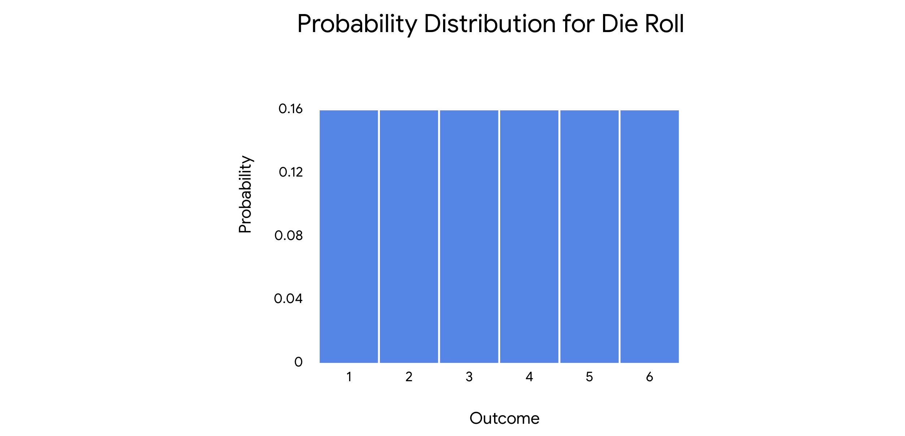
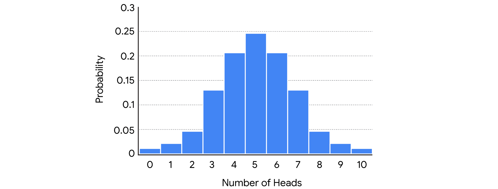
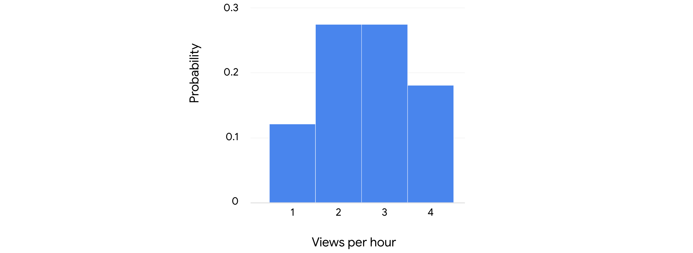

```{python}
#| include: false
import _setup
```

So far we've covered a lot of key concepts in basic probability. ​What you've learned about basic probability will help you better ​understand probability distributions or main topic for this part of the course.

​In my job as a data professional, I use probability distributions to model ​different kinds of data sets and to identify significant patterns in my data.

**​A probability distribution describes the likelihood of the possible outcomes of ​a random event.**

​Probability distributions can represent the possible ​outcomes of simple random events. ​Like tossing a coin or rolling a die. ​They can also represent more complex events. ​Like the probability of a new medication successfully treating a medical condition.

**​A random variable represents the values for ​the possible outcomes of a random event.** ​There are two types of random variables: discrete and continuous.

**​A discrete random variable has a countable number of possible values.** ​Often discrete variables are whole numbers that can be counted. ​For example, ​if you roll a die five times you can count the number of times the die lands on two. ​If you toss a coin five times you can count the number of times it lands on ​heads. ​ **A continuous random variable takes all the possible values in some range of numbers.** ​When it comes to continuous variables, ​you're dealing with decimal values rather than whole numbers. ​For instance, all the decimals values between one and ​two, such as 1.1, 1.12, 1.125 and so on. ​These values are not countable since there is no limit to the possible number of ​decimal values between one and two. ​Typically these are decimal values that can be measured such as height, ​weight, time or temperature. ​For example, if you measure the height of a person or object, ​you can keep on making your measurement more accurate. ​The height of a person could be 70.2 inches, 70.23 inches, ​70.237 inches, 70.2375 inches and so on. ​There is no limit to the number of possible values.

​It's not always immediately obvious if a variable is discrete or continuous. ​To help choose between the two, you can use the following general guidelines.

​If you can count the number of outcomes you are working with a discrete random ​variable. ​For example, counting the number of times a coin lands on heads. ​

If you can measure the outcome, ​you are working with the continuous random variable. ​For example, measuring the time it takes for a person to run a marathon.

​Now that we've explored random variables, ​let's return to the topic of probability distributions which described ​the probability of each possible value of the random variable.

​Discrete distributions represent discrete random variables and ​continuous distributions represent continuous random variables.

​Once you know the sample space of a random variable, ​you can assign probabilities to each of the possible values.

​In statistics you can use the term **sample space to describe the set ​of all possible values for a random variable.** ​For example, a single coin toss is a random variable with two possible values. ​Heads and tails. ​So the sample space is heads and tails.

​If you roll a six sided die, you have a random variable with six possible ​values or a sample space of one, two, three, four, five and six. ​ Let's check out an example of a discrete probability distribution. ​Take the familiar random event of a single die roll. ​The sample space for a single die roll is one, two, three, four, five and six. ​The probability of each outcome is the same. ​One out of six or 16.7%. ​You can display a discreet probability distribution as a table or a graph.

​The bar graph or histogram shows the same probability distribution for each value.

```{python}
#| echo: false
import matplotlib.pyplot as plt
import numpy as np

# Outcomes for a fair 6-sided die
outcomes = np.array([1, 2, 3, 4, 5, 6])
probabilities = np.full(6, 1 / 6)  # P(X = x) = 1/6 for each outcome

# Setup figure
plt.figure(figsize=(8, 5))
bars = plt.bar(
    outcomes,
    probabilities,
    color="#3498db",
    edgecolor="#2c3e50",
    width=0.55,
    linewidth=1.5,
)

# Axis titles and styling
plt.title(
    "Discrete Probability Distribution: Single Die Roll",
    fontsize=13,
    fontweight="bold",
    pad=15,
)
plt.xlabel("Outcome (X)", fontsize=11, labelpad=10)
plt.ylabel("Probability P(X)", fontsize=11, labelpad=10)
plt.xticks(outcomes, fontsize=10)
plt.yticks(
    np.arange(0, 0.25, 0.05),
    labels=["0.00", "0.05", "0.10", "0.15", "0.20"],
    fontsize=10,
)
plt.ylim(0, 0.22)
plt.grid(axis="y", linestyle="--", alpha=0.5)

# Add exact probability text labels on top of each bar
for bar in bars:
    height = bar.get_height()
    plt.text(
        bar.get_x() + bar.get_width() / 2.0,
        height + 0.005,
        f"1/6\n({height:.3f})",
        ha="center",
        va="bottom",
        fontsize=9.5,
        fontweight="bold",
        color="#2c3e50",
    )

plt.tight_layout()
plt.show()

```

​For a discrete probability the random variable is plotted along the X axis and ​the corresponding probability is plotted along the Y axis. ​In this case the X axis represents each possible outcome ​of a single die roll one through six. ​The Y axis represents the probability of each outcome.

​Continuous probability distributions and ​their graphs work a little differently from discrete distributions. ​This is due to the difference between discrete and continuous random variables.

​The probability distribution for a discrete random variable can ​tell you the exact probability for each possible value of the variable. ​For instance, the probability of rolling a die and ​getting a three is one out of six or about 16.7%. ​The probability distribution for a continuous random variable can only tell ​you the probability that the variable takes on a range of values. ​Let's check out an example to learn more.

​A continuous random variable may have an infinite number of possible values. ​Imagine you want to measure the height of an Oak tree you picked at random from ​a nearby forest.

​In this example, the height of the tree is a continuous random variable. ​The tree's height could be say 15 ft or ​15.2 ft or 15.2187 ft and so on. ​You can keep on adding another decimal place to the measurement without limit. ​Now say you want to know the probability that the height of the oak tree is exactly ​15.2 ft. ​Because the height of the tree could be any decimal value between the range ​of 15 ft and 16 ft. ​The probability that the tree is exactly any single value is essentially zero. ​In this example you'll need to use a continuous probability distribution to ​tell you the probability that the height of the oak tree is in a certain range or ​interval. ​Such as between 15 ft and 16 ft.

​The probability of any specific value is zero, so ​it only makes sense to talk about the probabilities of intervals. ​A convenient way to show the probabilities of a range or ​interval of values is with a curve. ​

On a graph, continuous distributions appear as curves. ​You may have heard of the bell curve, which refers to the graph for ​a continuous distribution called the normal distribution.

```{python}
#| echo: false
import matplotlib.pyplot as plt
import numpy as np
from scipy.stats import norm

# Normal distribution parameters matching the plot (Mean = 15, Std Dev = 0.9)
mean = 15
std_dev = 0.9

# Generate X values
x = np.linspace(11.5, 18.5, 500)
y = norm.pdf(x, mean, std_dev)

# Create figure
fig, ax = plt.subplots(figsize=(8, 5))

# Plot PDF curve
ax.plot(x, y, color="#555555", linewidth=1.8)

# Titles & axis labels
ax.set_title(
    "Probability density function of tree height",
    fontsize=15,
    pad=20,
    color="#111111",
)
ax.set_ylabel("Probability density", fontsize=11, labelpad=15, color="#444444")

# Ticks and limits
ax.set_xticks([12, 13, 14, 15, 16, 17, 18])
ax.set_yticks([0, 0.2, 0.4, 0.6, 0.8, 1.0])
ax.set_ylim(-0.02, 1.05)
ax.set_xlim(11.3, 18.7)

# Grid lines (horizontal light gray only)
ax.yaxis.grid(True, linestyle="-", color="#e0e0e0", linewidth=1)
ax.xaxis.grid(False)

# Minimalist styling (remove top, right, and left border lines)
ax.spines["top"].set_visible(False)
ax.spines["right"].set_visible(False)
ax.spines["left"].set_visible(False)
ax.spines["bottom"].set_color("#888888")

ax.tick_params(axis="x", colors="#333333", labelsize=10)
ax.tick_params(axis="y", colors="#555555", labelsize=10, length=0)

plt.tight_layout()
plt.show()

```

​On the curve the X axis refers to the value of the variable you're measuring, ​in this case oak tree height. ​The Y axis refers to something called probability density.

​This is a math function that deals with the values of intervals. ​You don't need to focus on the math part right now, ​just know that probability density is not the same thing as probability.

​There's a lot more to learn about probability distributions and ​how they can help you model different kinds of data. ​These topics are complex, so ​feel free to revisit the video to go over this part again.

------------------------------------------------------------------------

# The binomial distribution

Recently, you learned about ​**discrete probability distributions, ​which represent discrete random events** ​like tossing a coin or rolling a die. ​Often, the outcomes of discrete events are ​expressed as whole numbers that can be counted. ​For example, the number of times ​a coin lands on heads in 10 tosses. 

​In this video, you'll learn about one of ​the most widely used discrete probability distributions, ​the binomial distribution. ​

**The binomial distribution is ​a discrete distribution that models the probability ​of events with only two possible outcomes, ​success or failure**. ​This definition assumes that **each event is ​independent** or does not ​affect the probability of the others, ​and that the probability of ​success is the same for each event. ​For example, the binomial distribution applies ​to an event like tossing the same coin 10 times in a row. 

​Keep in mind that success and failure ​are labels used for convenience. ​For example, each toss has ​only two possible outcomes, heads or tails. ​You could choose to label either heads or tails ​as a successful outcome ​based on the needs of your analysis. ​**Whatever label you apply to the outcomes, ​it's important to know that they ​must be mutually exclusive**. ​As a quick refresher, ​two outcomes are mutually ​exclusive if they cannot occur at the same time. ​You can't get both heads and tails in a single coin toss. ​It's either one or the other. 

​Data professionals use the binomial distribution to ​model data in different fields such as medicine, ​banking, investing, and machine learning. ​For example, data professionals ​use binomial distribution to ​model the probability that ​a new medication generates side effects, ​a credit card transaction is fraudulent, ​or a stock price rises or falls in value. ​In machine learning, the binomial distribution ​is often used to classify data. ​For example, a data ​professional may train an algorithm to ​recognize whether a digital image ​of an animal is or is not a cat. ​The binomial distribution represents a type of ​random event called a binomial experiment. ​A binomial experiment is a type of random experiment. ​You may recall that a **random experiment is ​a process whose outcome ​cannot be predicted with certainty.** 

​All **random experiments** have three things in common. ​

-   The experiment can have more than one possible outcome. ​

-   You can represent each possible outcome in advance, ​

-   and the outcome of the experiment depends on chance. 

On the other hand, a **binomial experiment** ​has the following attributes. ​

-   The experiment consists of a number of repeated trials. ​

-   Each trial has only two possible outcomes. ​

-   The probability of success is the same for each trial, ​

-   and each trial is independent. 

​An example of a binomial experiment ​is tossing a coin 10 times in a row. ​This is a binomial experiment ​because it has the following features. ​The experiment consists of ​10 repeated trials or coin tosses. ​Each trial has only two possible ​outcomes, heads or tails. ​The probability of success is the same for each trial. ​If you define success as heads, ​then the probability of success for ​each toss is the same, 50 percent. ​Each trial is independent. ​The outcome of one coin toss does not ​affect the outcome of any other coin toss. 

​Let's check out another example of a binomial experiment. ​Suppose you want to know how many customers ​return an item to a department store on a given day. ​Say 100 customers visit the store each day. ​Ten percent of all customers who ​visit the store make a return. ​You label a return as a success. ​This is a binomial experiment because there are ​100 repeated trials or customer visits. ​Each trial only has two possible outcomes, ​return or not return. ​If you label return a success, ​the probability of success for ​each customer visit is the same, 10 percent. ​Each trial is independent. ​The outcome of one customer visit does not affect ​the outcome of any other customer visit. 

​It's important to understand ​the features of a binomial experiment because ​the binomial distribution could ​only model data for this type of event. ​If you're working with data for ​a different type of event, ​you need to use a different type ​of probability distribution, ​like the Poisson to model the data. ​Once you've determined that ​your distribution is binomial, ​you can apply the binomial distribution formula ​to calculate the probability. 

​No need to memorize it. ​You can use your computer to make the calculations. ​If you want to learn more, feel ​free to check out the relevant reading. 

$$
\begin{gathered}
\text{Binomial distribution formula} \\
P(X=k) = \frac{n!}{k!(n-k)!} p^k (1-p)^{n-k}\\
\\
\text {n-choose-k is }  \binom{n}{k} = \frac{n!}{k!(n-k)!}
\end{gathered}
$$​

In brief, the binomial ​distribution formula helps you determine ​the probability of getting a certain number of ​successful outcomes in a certain number of trials. ​

For example, getting a certain number of ​heads in a certain number of coin flips. ​In this formula, $k$ refers to the number of successes, $​n$ refers to the number of trials, $p$ refers to the probability of success on a given trial, ​and n-choose-k refers to the number of ​ways to obtain $k$ successes in $n$ trials. ​Let's explore our departments, for example, ​to better understand how the formula works. 

​This time, suppose 10 percent of ​all customers who visit the store make a return. ​Imagine that three customers visit the store. ​You label a return as a success. ​You can use the formula to ​determine the probability of getting 0, ​1, 2, and 3 returns among the three customers. ​In the calculation, X refers to the number of returns. ​I'll skip the calculations and ​go directly to the results. ​

If you plug in for the probability ​that X equals 0 returns, ​the result is 0.729. 

-   ​For the probability that X equals 1 return, ​the result is 0.243. ​

-   For the probability that X equals 2 returns, ​the result is 0.027. ​

-   For the probability that X equals 3 returns, ​the result is 0.001. ​

You can then use a histogram to ​visualize this probability distribution.

```{python}
#| echo: false
import matplotlib.pyplot as plt
import numpy as np
from scipy.stats import binom

# Parameters: n = 3 customers, p = 0.10 probability of return
n = 3
p = 0.10
x = np.array([0, 1, 2, 3])
probs = binom.pmf(x, n, p)  # [0.729, 0.243, 0.027, 0.001]

fig, ax = plt.subplots(figsize=(8, 5))

# Bars touching (width=1.0) with thin white dividers matching the slide
bars = ax.bar(
    x,
    probs,
    width=1.0,
    color="#4285F4",
    edgecolor="white",
    linewidth=1.2,
    align="center",
)

# Title & Y-axis label styled like the slide
ax.set_title(
    "Binomial distribution",
    fontsize=22,
    color="#4285F4",
    pad=25,
    loc="left",
    fontweight="normal",
)
ax.set_ylabel("Probability", fontsize=12, labelpad=15, color="#222222")

# Ticks and limits
ax.set_xticks([0, 1, 2, 3])
ax.set_yticks([0, 0.25, 0.50, 0.75])
ax.set_yticklabels(["0", "0.25", "0.5", "0.75"], fontsize=11, color="#444444")
ax.set_xticklabels(["0", "1", "2", "3"], fontsize=11, color="#444444")

ax.set_ylim(0, 0.85)
ax.set_xlim(-1.2, 4.2)

# Horizontal grid lines only
ax.yaxis.grid(True, linestyle="-", color="#e0e0e0", linewidth=1)
ax.xaxis.grid(False)

# Remove outer frame/spines
for spine in ["top", "right", "left", "bottom"]:
    ax.spines[spine].set_visible(False)

# Remove tick marks
ax.tick_params(axis="both", which="both", length=0)

plt.tight_layout()
plt.show()
```

 ​For a discrete probability distribution, ​like the binomial distribution, ​the random variable is plotted along the x-axis and ​the corresponding probability is ​plotted along the y-axis. ​In this case, the x-axis shows the visits per hour: 0, ​1, 2, and 3. ​The y-axis shows the probability of getting each result. 

​The binomial distribution lets ​you model the probability of ​events with only two possible outcomes, ​success or failure. ​Identifying the distribution of ​your data is a key step in ​any analysis and helps you make ​informed predictions about future outcomes. 

------------------------------------------------------------------------

# The Poisson distribution

As a data professional, ​knowing about probability distributions ​is super useful because ​different types of distributions ​help you model different kinds of data. ​Every time I work with a new dataset, ​I try to understand if there is ​a pattern present in the distribution data. ​

Knowing the probability distribution of my data ​also helps me choose the machine ​learning model that works best. ​This way, I'm able to get a better result in less time. ​

Data professionals work with ​many different types of probability distributions. ​As you advance in your career and continue to learn, ​you can explore different distributions ​and discover how they apply to your work. ​In this part of the course, ​we're focusing on two of ​the most common discrete probability distributions, ​the Binomial and the Poisson. 

​Earlier, you learned that ​the binomial distribution represents experiments with ​repeated trials that each have ​two possible outcomes, success or failure. ​In this video, you'll learn about ​the main features of the Poisson distribution. 

**​The Poisson distribution is ​a probability distribution that models ​the probability that a certain number of ​events will occur during a specific time period.** ​The Poisson distribution can also be used to ​represent the number of events that ​occur in a specific space, ​such as a distance, area, or volume, ​but in this course we'll focus on time. ​

Baron Simeon Denis Poisson, ​French mathematician, ​originally derive the Poisson distribution in 1830. ​He developed the distribution to ​describe the number of times a gambler would ​win in difficult game of ​chance in a large number of tries. ​

Data professionals use ​the Poisson distribution to model data, ​such as the expected number of ​calls per hour for a customer service call center, ​visitors per hour for a website, ​customers per day at a restaurant, ​and severe storms per month in a city. 

​The Poisson distribution represents a type of ​random experiment called a Poisson experiment. ​A Poisson experiment has the following attributes; ​The number of events in the experiment can be counted. ​The mean number of events that occurred during ​a specific time period is ​known, and each event is independent. ​

Let's explore an example. ​Imagine you're a data professional working for ​a large restaurant chain that serves fast food. ​You know that the drive-through service at a restaurant ​receives an average of two orders per minute. ​You want to determine the probability that a restaurant ​will receive a certain number ​of orders in a given minute. 

​This is a Poisson experiment ​because the number of ​events in the experiment can be counted. ​You can count the number of orders. ​The mean number of events that ​occur during a specific time period is known. ​There is an average of two orders per minute, **​each outcome is independent**. ​The probability of one person placing an order does not ​affect the probability of ​another person placing an order. 

​Once you know that you're working ​with the Poisson distribution, ​you can apply the Poisson distribution formula ​to calculate the probability. ​In brief, the formula helps you determine the probability ​that a certain number of events ​occurring during a specific time period. 

### Poisson Distribution Formula

$$
P(X=k) = \frac{\lambda^k e^{-\lambda}}{k!}
$$

-   The Greek letter lambda ($\lambda$) refers to the mean number of events that occur during a specific time period.
-   $k$ refers to the number of events.
-   $e$ is a constant equal to approximately $2.71828$.
-   The exclamation point ($!$) stands for factorial.

Let's continue with our restaurant chain example ​to better understand how the formula works. ​Recall that the drive-through service at ​a restaurant receives an average ​of two orders per minute. ​You can use the Poisson formula to determine ​the probability of the restaurant receiving 0, ​1, 2 or 3 orders in a given minute. ​Knowing this information may help ​the restaurant organized staffing for the drive-through. 

​I'll skip the calculations and ​go directly to the results. 

​If you plug in for the probability ​that X equals 0 orders, ​the result is 0.1353. ​

For the probability that X equals one order, ​the result is 0.2707. ​

For the probability that X equals two orders, ​again, the result is 0.2707. 

​For the probability that X equals three orders, ​the result is 0.1805. ​

You can then use a histogram to ​visualize the probability distribution. ​The x-axis shows the number of events, ​in this case, orders per minute. ​The y-axis shows the probability of occurrence. 

```{python}
#| echo: false
import matplotlib.pyplot as plt
import numpy as np
from scipy.stats import poisson

# Parameters
lam = 2.0  # Mean (average) orders per minute
n_orders = 10  # Range of orders to visualize

# Generate the sequence of x values (number of orders)
x = np.arange(0, n_orders + 1)

# Calculate the probability for each number of orders
probs = poisson.pmf(x, lam)

# Create the plot
fig, ax = plt.subplots(figsize=(10, 6))

# Notice that the bars touch each other (width=1.0) with white borders to create a clean 'block' look
bars = ax.bar(
    x,
    probs,
    width=1.0,
    color="#4285F4",
    edgecolor="white",
    linewidth=1.5,
    align="center",
)

# Title & Y-label styling
ax.set_title(
    f"Poisson Distribution of Orders (Average: {lam} per Minute)",
    fontsize=20,
    color="#4285F4",
    pad=25,
    loc="left",
    fontweight="normal",
)
ax.set_ylabel("Probability of Occurrence", fontsize=12, labelpad=15, color="#222222")
ax.set_xlabel("Number of Events (Orders per Minute)", fontsize=12, labelpad=15, color="#222222")

# Ticks and limits
ax.set_xticks(x)
ax.set_yticks([0, 0.1, 0.2, 0.3])
ax.set_yticklabels(["0", "0.1", "0.2", "0.3"], fontsize=11, color="#444444")
ax.set_xticklabels(x, fontsize=11, color="#444444")

# Set consistent margins
ax.set_ylim(0, 0.35)
ax.set_xlim(-1.2, n_orders + 1.2)

# Horizontal grid lines only
ax.yaxis.grid(True, linestyle="-", color="#e0e0e0", linewidth=1)
ax.xaxis.grid(False)

# Remove all outer box borders (spines)
for spine in ["top", "right", "left", "bottom"]:
    ax.spines[spine].set_visible(False)

# Remove tick marks
ax.tick_params(axis="both", which="both", length=0)

plt.tight_layout()
plt.show()
```

 Before we finish up, ​let's compare the two discrete probability distributions ​you recently learned about, ​the binomial and the Poisson. ​Sometimes it can be ​challenging to figure out if you should ​use a binomial distribution or a Poisson distribution. 

​To help you choose between the two, ​you can use the following general guidelines. ​

|   | Given | Want to Find | Example |
|:----------------|:------------------|:------------------|:------------------|
| **Poisson** | The average probability of an event happening for a specific time period | The probability of a certain number of events happening in that time period | The probability of getting 12 calls between 2 p.m. and 3 p.m. |
| **Binomial** | An exact probability of an event happening | The probability of the event happening a certain number of times in a repeated trial | The probability of getting 8 heads in 10 coin tosses |

​In your future career as a data professional, ​you'll use discrete distributions ​like the binomial and the Poisson to ​better understand your data and make ​informed predictions about future outcomes.

------------------------------------------------------------------------

Recently, you learned that data professionals use probability distributions to model different kinds of datasets, and to identify significant patterns in their data. Recall that a **probability distribution** describes the likelihood of the possible outcomes of a random event. Discrete probability distributions represent discrete random variables, or discrete events. Often, the outcomes of discrete events are expressed as whole numbers that can be counted. For example, rolling a die can result in a 2 or a 3, but not a decimal value such as 2.575 or 3.184.

In this reading, you’ll get an overview of the main attributes of four common discrete probability distributions: 

-   Uniform 

-   Binomial

-   Bernoulli 

-   Poisson 

## Discrete probability distributions 

### **Uniform distribution**

The uniform distribution describes events whose outcomes are all equally likely, or have equal probability. 

For example, rolling a die can result in six outcomes: 1, 2, 3, 4, 5, or 6. The probability of each outcome is the same: 1 out of 6, or about 16.7%. 

You can visualize a distribution with a graph, such as a histogram. For a discrete distribution, the random variable is plotted along the x-axis, and the corresponding probability is plotted along the y-axis. In this case, the x-axis represents each possible outcome of a single die roll, and the y-axis represents the probability of each outcome. 



***Note:** Data professionals often use the uniform distribution as part of more complex statistical methods, like Monte Carlo simulations. A detailed discussion of these methods is beyond the scope of this course.* 

***Note:** The uniform distribution applies to both discrete and continuous random variables.*

### **Binomial distribution**

The **binomial distribution** models the probability of events with only two possible outcomes: success or failure. These outcomes are mutually exclusive and cannot occur at the same time. 

This definition assumes the following: 

-   Each event is independent, or does not affect the probability of the others.

-   Each event has the same probability of success. 

Remember that success and failure are labels used for convenience. For example, if you toss a coin, there are only two possible outcomes: heads or tails. You could choose to label either heads or tails as a successful outcome based on the needs of your analysis.

The binomial distribution represents a type of random event called a binomial experiment. A binomial experiment has the following attributes:

-   The experiment consists of a number of repeated trials.

-   Each trial has only two possible outcomes.

-   The probability of success is the same for each trial.

-   And, each trial is independent.

An example of a binomial experiment is tossing a coin 10 times in a row. This is a binomial experiment because it has the following features:

-   The experiment consists of 10 repeated trials, or coin tosses.

-   Each trial has only two possible outcomes: heads or tails.

-   Each trial has the same probability of success. If you define success as heads, then the probability of success for each toss is the same: 50%.

-   Each trial is independent. The outcome of one coin toss does not affect the outcome of any other coin toss.

On the histogram, the x-axis shows the number of heads, and the y-axis shows the probability of getting each result. 



Data professionals might use the binomial distribution to model the probability that:

-   A new medication generates side effects

-   A credit card transaction is fraudulent 

-   A stock price rises in value 

In machine learning, the binomial distribution is often used to classify data. For example, a data professional may train an algorithm to recognize whether a digital image is or is not a specific type of animal, like a cat or a dog. 

### **Bernoulli distribution**

The Bernoulli distribution is similar to the binomial distribution as it also models events that have only two possible outcomes (success or failure). The only difference is that the Bernoulli distribution refers to only a single trial of an experiment, while the binomial refers to repeated trials. A classic example of a Bernoulli trial is a single coin toss. 

On the histogram, the x-axis represents the possible outcomes of a coin toss, and the y-axis represents the probability of each outcome. 

### **Poisson distribution**

The **Poisson distribution** models the probability that a certain number of events will occur during a specific time period. 

***Note:** The Poisson distribution can also be used to represent the number of events that occur in a specific space, such as a distance, area, or volume. In this course, we focus on time.*

The Poisson distribution represents a type of random experiment called a Poisson experiment. A Poisson experiment has the following attributes:

-   The number of events in the experiment can be counted.

-   The mean number of events that occur during a specific time period is known.

-   Each event is independent. 

For example, imagine you have an online website where you post content. Your website averages two views per hour. You want to determine the probability that your website will receive a certain number of views in a given hour.

This is a Poisson experiment because:

-   The number of events in the experiment can be counted. You can count the number of views.

-   The mean number of events that occur during a specific time period is known. There is an average of two views per hour.

-   Each outcome is independent. The probability of one person viewing your website does not affect the probability of another person viewing your website.

On the histogram, the x-axis shows the number of views per hour, and the y-axis shows the probability of occurrence.



Data professionals use the Poisson distribution to model data such as the number of: 

-   Calls per hour for a customer service call center

-   Customers per day at a shop 

-   Thunderstorms per month in a city

-   Financial transactions per second at a bank

## Key takeaways

Identifying the distribution of your data is a key step in any analysis, and helps you make informed predictions about future outcomes. In your future career as a data professional, you’ll use discrete distributions like the binomial and the Poisson to better understand your data. Knowing the probability distribution of your data will also help you choose the statistical method or machine learning model that works best for your analysis. 

## Resources for more information

To learn more about discrete probability distributions, refer to the following resources:

-   This [article from Statistics How To](https://www.statisticshowto.com/discrete-probability-distribution/) provides an overview of the concept of discrete probability distribution and offers links to explore more about specific kinds of distributions such as the binomial and Poisson.