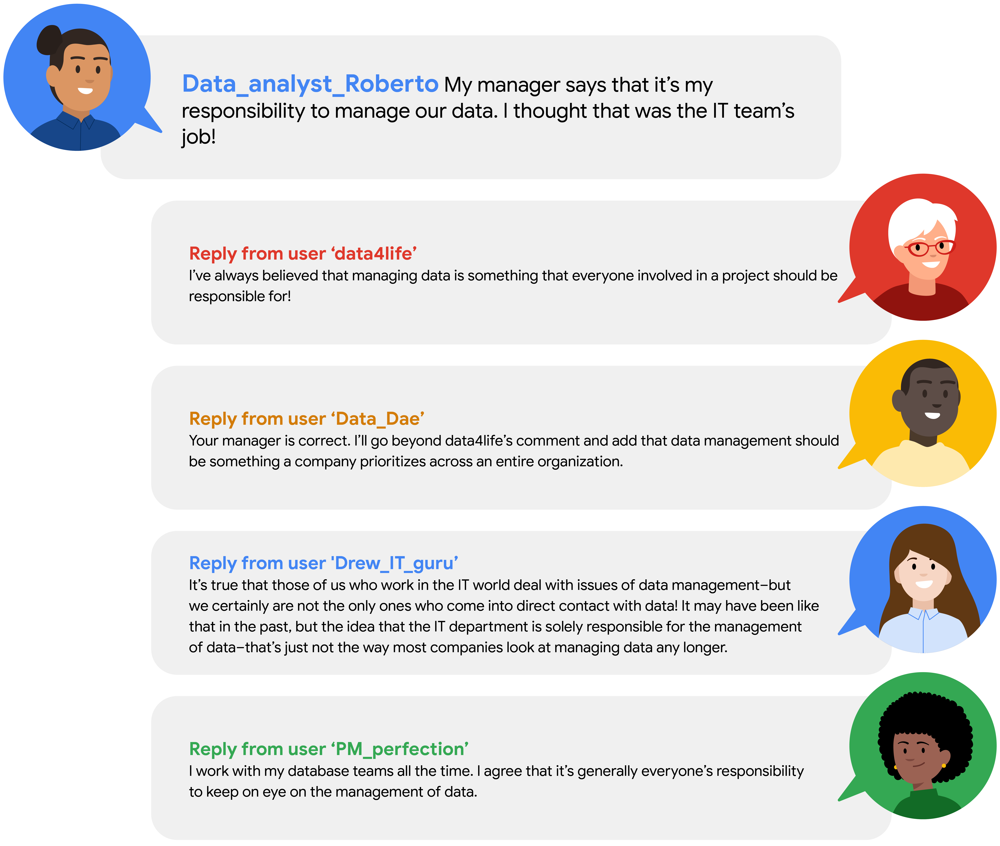

# Important ethical considerations for data professionals

This course content focuses on the responsibilities of data professionals in managing and protecting data, especially sensitive personal information, while being aware of bias in data collection and interpretation.

Data Privacy and Protection

Personally Identifiable Information (PII) includes sensitive data like biometric records and social security numbers that must be carefully managed to prevent identity theft and fraud. Industries are moving towards using aggregated data that removes personal identifiers to protect individual privacy and give users more control over their data. Bias in Data Handling

Data collection and interpretation can be influenced by human biases stemming from different backgrounds and experiences. Data professionals should be vigilant about both obvious and subtle biases and consider multiple interpretations of data insights before making decisions. Sampling and Representativeness

A representative sample reflects the characteristics of the larger population to avoid misleading conclusions. An example illustrates how analyzing data from a limited market segment without considering context (like local events) can lead to biased business decisions, emphasizing the need for comprehensive data evaluation.\

# Critical data security and privacy principles

You have learned how data analytics can be used for good causes, like assisting nonprofit organizations. Also, you learned that data professionals need to protect privacy within data and remain aware of other considerations, like data bias and making assumptions about data. 

As a data analytics professional, you have a responsibility to handle data ethically. Data ethics refers to well-founded standards of right and wrong that dictate how data is collected, shared, and used. Throughout your career you will work with a lot of data. This sometimes includes PII, or **personally identifiable information,** which can be used by itself or with other data to track down a person's identity. One element of treating data ethically is ensuring that the privacy and security of that data is maintained throughout its lifetime. In this reading, you will learn more about the importance of data privacy and some strategies for protecting the privacy of data subjects. 

## Privacy matters

Data privacy means preserving a data subject’s information and activity any time a data transaction occurs. This is also called information privacy or data protection. Data privacy is concerned with the access, use, and collection of personal data. For the people whose data is being collected, this means they have the right to:

-   Protection from unauthorized access to their private data

-   Freedom from inappropriate use of their data

-   The right to inspect, update, or correct their data

-   Ability to give consent to data collection

-   Legal right to access the data

In order to maintain these rights, businesses and organizations have to put privacy measures in place to protect individuals’ data. This is also a matter of trust. The public’s ability to trust companies with personal data is important. It’s what makes people want to use a company’s product, share their information, and more. 

## Protecting privacy with data anonymization 

Organizations use a lot of different measures to protect the privacy of their data subjects, like incorporating access permissions to ensure that only the people who are supposed to access that information can do so. Another key strategy to maintaining privacy is data anonymization. 

**Data anonymization** is the process of protecting people's private or sensitive data by eliminating PII. Typically, data anonymization involves blanking, hashing, or masking personal information, often by using fixed-length codes to represent data columns, or hiding data with altered values.

Data professionals can take additional measures to protect users and their data. **Data aggregation**, for example, is the process of collecting and combining details from a significant number of users in terms of totals or summary. Aggregating data ensures that information contained within datasets is shown in groups; when coupled with other anonymization techniques, data professionals can ensure compliance with data privacy and anonymization standards.

Data anonymization is used in just about every industry. As a data analytics professional, you probably won’t personally be performing anonymization, but it’s useful to understand what kinds of data are often anonymized before you start working with it. This data might include:

-   Telephone numbers

-   Names

-   License plates and license numbers

-   Social security numbers

-   IP addresses

-   Medical records

-   Email addresses

-   Photographs

-   Account numbers

Imagine a world where we all had access to each other’s addresses, account numbers, and other identifiable information. That would invade a lot of people’s privacy and make the world less safe. Data anonymization is one of the ways we can help keep data private and secure!

## Key takeaways

For any professional working with data about actual people, it’s important to consider the safety and privacy of those individuals. That’s why understanding the importance of data privacy and how data that contains PII can be made secure for analysis is so important. We have a responsibility to protect people’s data and the personal information that data might contain. 

If you’re interested in learning more about data privacy and ethics, you can check out [the Google Data Analytics Certificate program’s section on bias, credibility, privacy, ethics, and access](https://www.coursera.org/learn/data-preparation/home/week/2).

# The practices and principles of good data stewardship

As you have been learning, all data professionals are responsible for ensuring the quality, integrity, accessibility, and security of data. Data stewardship is the practice of ensuring that data is accessible, usable, and safe. Making data stewardship a normal part of your work habits will benefit everyone who relies on your analysis, both inside and outside of your organization. In this reading, you will learn more about data stewardship and receive some best practices that can assist in guiding your career in data analytics.

## Respect privacy

Earlier in this course, you learned about Information that permits the identity of an individual to be inferred by either direct or indirect means. This kind of information is commonly referred to as personally identifiable information or PII. When users share personal information, they are putting a high level of trust into an organization. It is the responsibility of all who have access within the organization to help protect the privacy of their users. As a data analytics professional, it is important to be thoughtful about any personal data and exhibit great care to protect it. In different parts of the world, laws are in place to guide best practices for data privacy. Laws provide a foundation for best practices as you grow in knowledge and experience on how to support and sustain privacy. One of your responsibilities as a data professional will be to stay up to date with any change in data laws and regulations that govern data. Depending on your organization’s location or industry considerations, there may be additional regulations and policies in place. Here are a couple of regional examples:

-   General Data Protection Regulation or [GDPR](https://gdpr.eu/) (European Union law):

    -   The GDPR is described on their website as the toughest privacy and security law in the world. It imposes obligations onto organizations anywhere, so long as they target or collect data related to people in the European Union.

-   Lei Geral de Proteção de Dados Pessoais or [LGPD](https://www.gov.br/cidadania/pt-br/acesso-a-informacao/lgpd) (Brazil’s general law for the protection of personal data):

    -   The LGPD is a data protection law that governs how companies collect, use, disclose, and process personal data belonging to people in Brazil. LGPD applies to companies that process data about individuals in Brazil.

-   The California Consumers Privacy Act or [CCPA](https://oag.ca.gov/privacy/ccpa) (Privacy rights for California consumers):

    -   The CCPA gives consumers more control over the personal information that businesses collect about them. These regulations provide guidance on how to implement the law.

    -   Additionally, states like Virginia, Colorado, New York, Utah, and Connecticut have enacted similar legislation to protect consumer privacy in their states.

## Be cautious of unintentional harm

Data analytics is expanding its influence across an increasing range of industries. Companies are using the results of data analysis to make informed decisions. Many of these decisions have the potential to impact people across a broad range of social and economic factors. It is good practice to continually strive to produce information that is accurate, while respecting cultural and social norms. 

Due to the global marketplace, decisions play out differently in different cultures. Taking these issues and considerations into account is very important for the executive team of an organization. Also, companies are known to take a position on particular politicized social and cultural issues, and these can be reflected in their policies. As a data analytics professional, you must be cognizant of your company’s policies. When presented with challenges, it is best to seek guidance from leadership within your organization on how to navigate.

## Avoid creating or reinforcing bias

You have learned about bias within data and how it can have an impact on your analysis. Identifying bias is not always simple. A good practice when working with data is to keep in mind that data gathering is a task managed by humans–and that process is informed by people from different backgrounds, experiences, beliefs, and worldviews. These and other types of biases can affect the data and the results, which in turn can have an impact on business decisions. You will learn more about bias within data as you progress through the program. 

## Consider inclusivity

Often in your role as a data analytics professional, you will have access to data collected in a variety of ways. You will need to consider whether the methods of data collection have excluded information from particular populations. Inclusionary approaches can expand how any organization collects and analyzes data. Building diverse research teams, communicating clearly with user communities, and engaging in careful and critical analysis that considers equity and inclusion benefits all stakeholders.

## Uphold high standards of scientific excellence

The processes and technology that you will interact with as a data analytics professional are deeply rooted in the scientific method. As you continue in your data professional journey, embrace inquiry, intellectual discussion, and collaboration. Invite feedback and assess feedback. Remember, artificial intelligence still depends heavily on the instructions provided by data professionals. The more time and consideration that goes into the process of data analytics, the better the results.

Different industries have different standards. In your role as a data analytical professional, you will need to be aware of the standards for the industries you are working in. Each industry will have its own standards based on industry conventions.

Conventions that work well in the transportation industry may not necessarily be as high of a priority for the healthcare industry. For example, in transportation, data is collected to create predictive analytics models to analyze the best route based on traffic patterns. In the healthcare industry, data is analyzed in medical imaging, predicting genetic factors, and speeding up the development of treatments.

## Data stewardship and ethics conversations

As you progress through your career as a data analytics professional, you will need to consider issues of ethical concern. For example, you may encounter situations where you address questions of bias or need to protect user data and personally identifiable information (PII). When these types of questions arise, many seek guidance and support from online communities of data professionals who have dealt with similar issues. The following graphics present scenarios involving these kinds of issues. You can also find text alternative versions of these conversations in the [Data stewardship and ethics conversations transcript.](https://docs.google.com/document/d/1REAcRzABhtysbB4Nt8h7Gyqu3Sjv4cLfNC-7ETzauSg/template/preview#)\

------------------------------------------------------------------------

------------------------------------------------------------------------

## Key takeaways

Data stewardship is the responsibility of every data professional. This responsibility goes beyond interactions with the data. By conducting your work in ways that are socially beneficial and inclusive, you will increase your ability to identify human bias. Guide your efforts through scientific and ethical principles and stay aware of possible bias throughout the data analysis process.