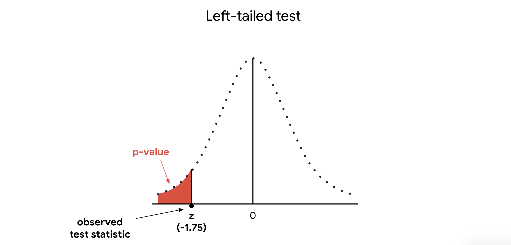
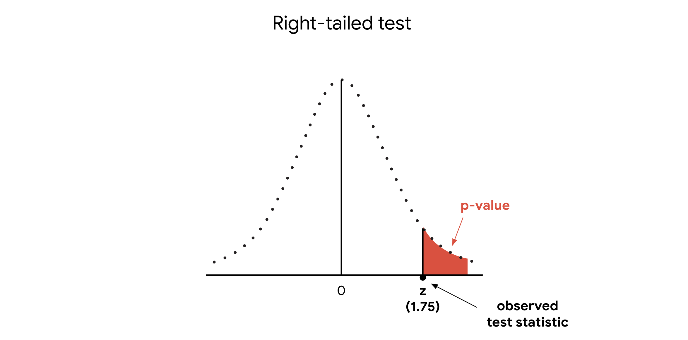
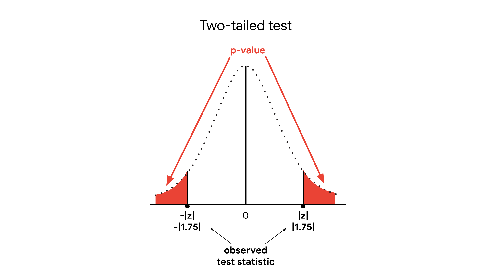
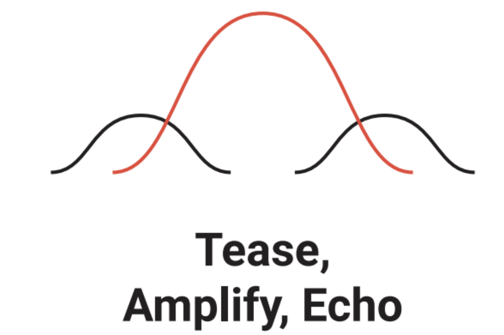

```{python}
#|include: false
import _setup
```

Hey there future data professional, ​you've come a long way ​since the beginning of your learning journey. ​Where to go? Just think ​of all the new skills you've developed. ​You can calculate descriptive stats like ​the mean and standard deviation to summarize your data. ​You can use probability distributions like the binomial, ​Poisson, and normal distribution ​to model different types of data. ​You can work with sampling distributions to ​estimate population means and proportions, ​and you can construct confidence intervals ​to help describe the uncertainty of an estimate. ​Now, you're going to add a new skill to ​your skill set, hypothesis testing.

::: nota
**​Hypothesis testing is a statistical procedure that uses ​sample data to evaluate ​an assumption about a population parameter.** ​
:::

For example, hypothesis tests are often used in ​clinical trials to determine whether ​a new medicine leads to better outcomes in patients.

​Imagine a pharmaceutical company ​invents a medicine to treat the common cold. ​The company tests a random sample of ​200 people with cold symptoms. ​Without medicine, the typical person experiences ​cold symptoms for 7.5 days. ​The average recovery time for people who take ​the medicine is 6.2 days. ​The company might then ask, ​are the results of the clinical trial ​statistically significant?

**Statistical significance ​is the claim that the results of ​a test or experiment are not explainable by chance alone.**

​In other words, did the drug ​actually have a positive impact on recovery time? ​Or are the results due to chance or sampling variability? ​To answer these questions, ​the company may ask a data professional ​to conduct a hypothesis test. ​The test helps quantify ​whether the result is likely due to ​chance or if it's statistically significant. ​This knowledge will help the company ​determine if the drug is ​truly effective and if it ​should be approved for public use.

​Coming up, we'll go over the general procedure for ​hypothesis testing from stating ​the null hypothesis and alternative hypothesis, ​to choosing a significance level, ​finding the $p$-value, ​and rejecting or failing to reject your null hypothesis. ​Then we'll explore ​two different types of hypothesis tests, ​one sample and two sample. ​Finally, you'll learn how to use ​Python stats module to ​conduct a two-sample hypothesis test ​to compare two population means. ​When you're ready to learn more, ​I'll meet you in the next video.

------------------------------------------------------------------------

Recently, you learned that a hypothesis test uses ​sample data to evaluate ​an assumption about a population parameter. ​For example, for a clinical trial of a new medicine, ​a hypothesis test can ​help you determine if the effect of the medicine on ​an average recovery time of your sample group is ​statistically significant or due to chance. 

​In this video, we'll go over the procedure for ​performing a hypothesis test, ​and you'll learn about the main concepts ​involved in hypothesis testing. ​Let's outline the steps for performing a hypothesis test. ​

::: nota
Steps of hypothesis testing

1.  State the null hypothesis ​and the alternative hypothesis. 

2.  Choose a significance level. ​

3.  Find the $p$-value, ​and

4.  Reject or fail to reject the null hypothesis.  ​
:::

Right now these concepts may seem a ​bit abstract, that's okay. ​You'll learn more about each ​one by the end of this video. ​For now, to clarify ​the steps involved in hypothesis testing, ​let's explore an example. ​Afterwards, we will revisit the concepts. 

Imagine you are given a coin to use in a game. ​You're not sure if the coin is fair or rigged. ​That is, you don't know if ​it's a standard coin or if it's been ​specifically waited to affect the outcome of a toss, ​for example, to always land on tails. 

​Before using it in the game, ​you want to find out that the coin is fair or not. ​You decide to test the coin by tossing it six ​times in a row and recording the outcomes. ​As you may recall from our ​earlier discussion of probability, ​if the coin is fair, ​the chance of landing on heads or tails is ​0.5 or 50 percent for any given toss. ​If the coin is rigged for tails, ​the chance of landing on tails for ​any given toss will be much higher, ​perhaps 90 or even 100 percent. ​Before you test it out, ​you need to have a benchmark to ​evaluate the results of the test. ​For example, let's say the ​first two tosses land on tails, ​is the coin rigged? ​

Recall that we use the multiplication rule to ​calculate the probability of independent events. ​The probability of the coin landing on ​tails two times in a row is ​0.5 times 0.5 which is 0.25 or 25 percent. ​That's not unlikely. At this point, ​you can't reasonably conclude that the coin is rigged. ​Now, imagine the coin lands on ​tails four times in a row. ​The probability of this occurring is 0.5 multiplied ​four times which is 0.0625 or 6.25 percent. ​That's unlikely but not impossible. ​However, you want to feel even more ​confident that the outcome is not due to chance. 

​You decide to use five percent as ​a threshold determine if the outcome is due to chance. ​In other words, if the probability of the outcome is ​less than five percent ​under the assumption that the coin is fair, ​you'll conclude that the coin is actually rigged. ​For example, the probability for ​a fair coin to land on tails six times in a row ​is 0.5 multiplied six times which is ​0.0156 or 1.56 percent. ​This is too unlikely because ​the likelihood is less ​than your threshold of five percent. ​If this occurs, you will conclude the coin is rigged. ​Now, you're ready to proceed with your test. ​You toss the coin six ​times in a row and record the results. 

​The coin lands on tails every time, ​you conclude that the coin is rigged. ​Unfortunately, the coin won't be ​of much use to you unless you're ​performing the magic trick and happened to ​need a coin that always lands on tails. 

​This example is a simplified version ​of a hypothesis test. ​To test out whether or not the coin is fair, ​you went through each step of ​the hypothesis testing procedure. 

​Let's review the steps for conducting a hypothesis test. ​

1.  State the null hypothesis ​and the alternative hypothesis. 

2.  Choose a significance level. ​

3.  Find the $p$-value, ​and

4.  Reject or fail to reject the null hypothesis.  ​

​Let's explore each step in more detail. 

# State the null hypothesis

​First, state your null hypothesis ​and your alternative hypothesis. ​

::: nota
**The null hypothesis is a statement that is assumed to be ​true unless there's convincing evidence to the contrary.** ​
:::

The null hypothesis typically ​assumes that your observed data occurs by chance. **​**

::: nota
**The alternative hypothesis is ​a statement that contradicts the null hypothesis, ​and is accepted as true ​only if there's convincing evidence for it.** ​
:::

The alternative hypothesis typically assumes that ​your observed data does not occur by chance. ​

In our example, your null hypothesis states ​that the coin is fair. ​Having a fair coin is ​the standard or typical state of things. ​The null hypothesis states that ​your observations result purely from chance. ​Your alternative hypothesis states the contrary claim, ​the coin is not fair. ​The alternative hypothesis says that the outcome was ​the result of rigging and did not happen by chance. 

# ​Choose a significance level

Next, choose your **significance level**.

::: nota
**Significance level** **is the threshold at which you will ​consider results statistically significant. ​**
:::

The significance level is also **the probability of ​rejecting the null hypothesis when it is true.** ​I'll talk more about this later in the video. ​In our example, you use five percent as ​a threshold determine if ​the outcome of the coin toss occurred by chance. ​Typically, data professional set ​the significance level at five percent. ​

Note that there's nothing magical about five percent, ​this is a choice based on tradition ​and statistical research in education. ​You can adjust the significance level ​to meet the requirements of your analysis. ​Other common choices are one percent and 10 percent. 

# Find the p-value

​Next, find your $p$-value. ​

::: nota
$p$**-value refers to the probability of observing results as ​or more extreme than those ​observed when the null hypothesis is true**. 
:::

​We already calculated that ​the probability of fair coin landing on tails ​six times in a row is 1.56 percent. 

​If you assume the null hypothesis ​is true and the coin is fair, ​then the $p$-value in our example is 1.56 percent. ​Anything lower than that would mean that there is ​stronger evidence for the alternative hypothesis. ​Remember, your alternative hypothesis ​is that the coin is not fair. 

​For instance, the probability of tossing seven tails ​in a row with a fair coin is 0.79 percent, ​which is lower than the $p$-value of 1.56 percent. ​If you toss seven tails in a row, ​you'd have even stronger evidence for ​the alternative hypothesis that the coin is not fair. 

# Reject or fail to reject the null hypothesis. ​

Finally, you have to decide whether to ​reject or fail to reject the null hypothesis. ​Statisticians always say, ​fail to reject rather than except. ​This is because hypothesis tests ​are based on probability, ​not certainty. ​Acceptance implies certainty. ​In general, as data professionals, ​we try not to claim certainty about ​results based on statistical methods. 

::: nota
​There are two main rules for drawing ​a conclusion about a hypothesis test. 

-   ​**If your** $p$**-value is less than your significance level, ​you reject the null hypothesis**. **​**

-   **If your** $p$**-value is greater than your significance level, ​you fail to reject the null hypothesis.** ​
:::

The example of the coin toss, ​your $p$-value of 1.56 percent ​is less than your significance level of five percent. ​You reject the null hypothesis ​and conclude that your result of ​six consecutive tails is ​statistically significant and not due to chance. ​Your decision to reject or fail to ​reject also depends on your significance level. ​Let's say, before your test, ​you chose a significance level of ​one percent instead of five percent. ​In that case, you would fail to reject ​the null hypothesis because your $p$-value of ​1.56 percent would be ​greater than your significance level of one percent. 

​**A statistically significant result cannot prove ​with 100 percent certainty ​that our hypothesis is correct. ​Because hypothesis testing is based on probability, ​there's always a chance of drawing ​the wrong conclusion about the null hypothesis**. ​

# Types of errors in Statistical Testing

In hypothesis testing, ​there are two types of errors you ​can make when drawing a conclusion, ​a Type I error and a Type II error. ​

::: nota
**A Type I error, ​also known as a false positive, ​occurs when you reject ​a null hypothesis that is actually true.** 
:::

**​In other words, you conclude that your result is ​statistically significant when in ​fact it occurred by chance.** ​In our example, concluding ​that the coin is rigged when it's ​actually fair would be considered a Type I error. ​Even though you've got six tails in a row, ​this outcome could still be due to chance. ​It's highly unlikely, but it's possible. ​

Earlier in the video, ​I mentioned that **your significance level is also ​the probability of rejecting ​the null hypothesis when it is true. ​A significance level of ​five percent means you are willing to accept ​a five percent chance you are ​wrong when you reject the null hypothesis.** ​To reduce your chance of making a Type I error, ​choose a lower significance level. ​Recall that if you choose ​a one percent significance level, ​you fail to reject the null ​and conclude that the coin is fair. ​However, choosing a lower significance level means you're ​more likely to make a Type II error or a false negative. 

::: nota
​**Type II error or a false negative: This occurs when you fail to reject a null hypothesis, ​which is actually false.**
:::

**​In other words, you conclude your result occurred by ​chance when it's in fact statistically significant.** 

​In our example, you would conclude that ​the coin is fair when it's actually rigged. ​As a data professional, ​it helps to be aware of the potential errors built ​into hypothesis testing and ​how they can affect your results. ​

Depending on the situation and the goal of your analysis, ​you may want to minimize the risk of ​either a Type I or Type II error. ​Imagine you're testing the strength of ​the fabric for a parachute manufacturer. ​You want to be very confident that the material you're ​using is strong enough for a functional parachute. 

​A Type I error or a false positive means ​you falsely identify the material as strong enough. ​Obviously, in this case, ​you want to minimize the risk of a Type I error. ​To do so, choose a significance level of ​one percent instead of the standard five percent. ​This change decreases the chance of a Type I error ​or false positive from 5-1 percent. ​Ultimately, it's your responsibility ​as a data professional to determine ​how much evidence you need to ​decide that a result is statistically significant. ​How risky is a Type I error or a false positive? ​There is no single correct answer ​for all of these situations. 

​It's up to you to decide. That's all for now. ​The coin toss example shows you ​the main concepts involved in ​conducting a hypothesis test. ​As a data professional, ​you'll use these concepts for ​any hypothesis test that you may want to conduct. 

------------------------------------------------------------------------

# Differences between the null and alternative hypotheses

Recently, you learned that **hypothesis testing** uses sample data to evaluate an assumption about a population parameter. Data professionals conduct a hypothesis test to decide whether the evidence from their sample data supports either the null hypothesis or the alternative hypothesis.

In this reading, we’ll go over the main differences between the null hypothesis and the alternative hypothesis, and how to formulate each hypothesis in different scenarios. 

# Statistical hypotheses

Let’s review the steps for conducting a hypothesis test:

1.  State the null hypothesis and the alternative hypothesis.

2.  Choose a significance level.

3.  Find the $p$-value.

4.  Reject or fail to reject the null hypothesis.

The first step for any hypothesis test is to state the null and alternative hypotheses. The null and alternative hypotheses are mutually exclusive, meaning they cannot both be true at the same time. 

The **null hypothesis** is a statement that is assumed to be true unless there is convincing evidence to the contrary.

::: note
The null hypothesis is not necessarily "what we believe." It is the position we start by assuming is true, and then ask whether the data give us strong enough evidence to reject it.
:::

The null hypothesis typically assumes that there is no effect in the population, and that your observed data occurs by chance. 

The **alternative hypothesis** is a statement that contradicts the null hypothesis, and is accepted as true only if there is convincing evidence for it. The alternative hypothesis typically assumes that there is an effect in the population, and that your observed data does *not* occur by chance. 

**Note:** The null and alternative hypotheses are always claims about the population. That’s because the aim of hypothesis testing is to make inferences about a population based on a sample. 

For example, imagine you’re a data professional working for a car dealership. The company implements a new sales training program for their employees. They ask you to evaluate the effectiveness of the program. 

-   Your **null hypothesis (H~0~):** the program had no effect on sales revenue. 

-   Your **alternative hypothesis (H~a~)**: the program increased sales revenue. 

Let’s explore each hypothesis in more detail. 

## **Null hypothesis**

The null hypothesis has the following characteristics:

-   In statistics, the null hypothesis is often abbreviated as H sub zero (H~0~). 

-   When written in mathematical terms, the null hypothesis always includes an equality symbol (usually =, but sometimes ≤ or ≥). 

-   Null hypotheses often include phrases such as “no effect,” “no difference,” “no relationship,” or “no change.” 

## **Alternative hypothesis**

The alternative hypothesis has the following characteristics:

-   In statistics, the alternative hypothesis is often abbreviated as H sub a (H~a~). 

-   When written in mathematical terms, the alternative hypothesis always includes an inequality symbol (usually ≠, but sometimes \< or \>). 

-   Alternative hypotheses often include phrases such as “an effect,” “a difference,” “a relationship,” or “a change.”

::: extra
Think of H₀ as "innocent until proven guilty"

Imagine someone is accused of a crime.

-   **H₀:** The person is innocent.

-   **Hₐ:** The person is guilty.

The prosecution doesn't need to prove that the person is innocent. Instead, it asks: "If this person really were innocent, how surprising would this evidence be?"

If the evidence is extremely unlikely under innocence, we reject H₀.
:::

## **Example scenarios**

Typically, the null hypothesis represents the *status quo*, or the current state of things. The null hypothesis assumes that the status quo hasn’t changed. The alternative hypothesis suggests a new possibility or different explanation. Let’s check out some examples to get a better idea of how to write the null and alternative hypotheses for different scenarios:

### Example#1: Mean weight

An organic food company is famous for their granola. The company claims each bag they produce contains 300 grams of granola—no more and no less. To test this claim, a quality control expert measures the weight of a random sample of 40 bags.

-   **H~0~**: μ = 300 (the mean weight of all produced granola bags is equal to 300 grams)

-   **H~a~:** μ ≠ 300 (the mean weight of all produced granola bags is not equal to 300 grams)

### Example#2: Mean height

Suppose it’s assumed that the mean height of a certain species of tree is 30 feet tall. However, one ecologist claims the actual mean height is greater than 30 feet. To test this claim, the ecologist measures the height of a random sample of 50 trees.

-   **H~0~**: μ ≤ 30 (the mean height of this species of tree is equal to or less than 30 feet)

-   **H~a~:** μ \> 30 (the mean height of this species of tree is greater than 30 feet)

### Example#3: Proportion of employees

A corporation claims that at least 80% of all employees are satisfied with their job. However, an independent researcher believes that less than 80% of all employees are satisfied with their job. To test this claim, the researcher surveys a random sample of 100 employees.

-   **H~0~**: p ≥ 0.80 (the proportion of all employees who are satisfied with their job is equal to or greater than 80%)

-   **H~a~:** p \< 0.80 (the proportion of all employees who are satisfied with their job is less than 80%)

### Example#4: Proportion of customers

The company claims that at least 80% of its customers are satisfied with their shopping experience. You survey a random sample of 100 customers. According to the survey, 73% of customers say they are satisfied.

-   H₀: P ≥ 0.80

-   Hₐ: P \< 0.80

## **Summary: Null versus alternative**

A very useful rule is:

-   If the claim contains an equality component (`=`, `≥`, or `≤`), it normally belongs in H₀.

-   The alternative gets the strict inequality.

The following table summarizes some important differences between the null and alternative hypotheses:

+--------------+---------------------------------------+---------------------------------------+
|              | **Null hypothesis (H~0~)**            | **Alternative hypothesis (H~a~)**     |
+:=============+:======================================+:======================================+
| **Claims**   | There is no effect in the population. | There is an effect in the population. |
+--------------+---------------------------------------+---------------------------------------+
| **Language** | -   No effect                         | -   An effect                         |
|              |                                       |                                       |
|              | -   No difference                     | -   A difference                      |
|              |                                       |                                       |
|              | -   No relationship                   | -   A relationship                    |
|              |                                       |                                       |
|              | -   No change                         | -   A change                          |
+--------------+---------------------------------------+---------------------------------------+
| **Symbols**  | Equality (=, ≤, ≥)                    | Inequality (≠, \<, \>)                |
+--------------+---------------------------------------+---------------------------------------+

# Key takeaways

The null hypothesis and the alternative hypothesis are foundational concepts in hypothesis testing. To conduct an effective hypothesis test, it’s important to understand the differences between the null and alternative hypotheses, and how to properly state each hypothesis. 

# Resources for more information

To learn more about the null hypothesis and the alternative hypothesis, refer to the following resources: 

-   This [article from Statistics How To](https://www.statisticshowto.com/probability-and-statistics/null-hypothesis/) features a detailed discussion of the null hypothesis.

------------------------------------------------------------------------

# Type I and type II errors

Earlier, you learned that you can use a hypothesis test to help determine if your results are statistically significant, or if they occurred by chance. However, because hypothesis testing is based on probability, there’s always a chance of drawing the wrong conclusion about the null hypothesis. In hypothesis testing, there are two types of errors you can make when drawing a conclusion: a Type I error and a Type II error.

In this reading, we’ll discuss the difference between Type I and Type II errors, and the risks involved in making each error.

# Errors in statistical decision-making

Let’s review the steps for conducting a hypothesis test:

1.  State the null hypothesis and the alternative hypothesis.

2.  Choose a significance level.

3.  Find the $p$-value.

4.  Reject or fail to reject the null hypothesis.

When you decide to reject or fail to reject the null hypothesis, there are four possible outcomes–two represent correct choices, and two represent errors. You can: 

-   Reject the null hypothesis when it’s actually true (**Type I error)**

-   Reject the null hypothesis when it’s actually false (Correct)

-   Fail to reject the null hypothesis when it’s actually true (Correct) 

-   Fail to reject the null hypothesis when it’s actually false (**Type II error**)


## **Example: Clinical trial**

Let’s explore an example to get a better understanding of Type I and Type II errors. Hypothesis tests are often used in clinical trials to determine whether a new medicine leads to better outcomes in patients. Imagine you’re a data professional who works for a pharmaceutical company. The company invents a new medicine to treat the common cold. The company tests a random sample of 200 people with cold symptoms. Without medicine, the typical person experiences cold symptoms for 7.5 days. The average recovery time for people who take the medicine is 6.2 days. 

You conduct a hypothesis test to determine if the effect of the medicine on recovery time is statistically significant, or due to chance. 

In this case:

-   Your **null hypothesis** (H~0~) is that the medicine has no effect.

-   Your **alternative hypothesis** (H~a~) is that the medicine is effective.

## **Type I error**

A **Type 1 error**, also known as a false positive, occurs when you reject a null hypothesis that is actually true. In other words, you conclude that your result is statistically significant when in fact it occurred by chance. 

For example, in your clinical trial, if the null hypothesis is true, that means the medicine has no effect. If you make a Type I error and reject the null hypothesis, you incorrectly conclude that the medicine relieves cold symptoms when it’s actually ineffective. 

The probability of making a Type I error is called alpha (α). Your significance level, or alpha (α), represents the probability of making a Type I error. Typically, the significance level is set at 0.05, or 5%. A significance level of 5% means you are willing to accept a 5% chance you are wrong when you reject the null hypothesis. 

### **Reduce your risk**

To reduce your chance of making a Type I error, choose a lower significance level.

For instance, if you want to minimize the risk of a Type I error, you can choose a significance level of 1% instead of the standard 5%. This change reduces the chance of making a Type I error from 5% to 1%.

| **Significance level (α)** | **Chance of making Type I error** |
|:---------------------------|:----------------------------------|
| 0.05                       | 5%                                |
| 0.01                       | 1%                                |

## **Type II error**

However, reducing your risk of making a Type I error means you are more likely to make a Type II error, or false negative. A **Type II error** occurs when you fail to reject a null hypothesis which is actually false. In other words, you conclude your result occurred by chance, when in fact it didn’t. 

For example, in your clinical study, if the null hypothesis is false, this means that the medicine is effective. If you make a Type II error and fail to reject the null hypothesis, you incorrectly conclude that the medicine is ineffective when it actually relieves cold symptoms. 

The probability of making a Type II error is called beta (β), and beta is related to the power of a hypothesis test (power = 1- β). Power refers to the likelihood that a test can correctly detect a real effect when there is one. 

### **Reduce your risk**

You can reduce your risk of making a Type II error by ensuring your test has enough power. In data work, power is usually set at 0.80 or 80%. The higher the statistical power, the lower the probability of making a Type II error. To increase power, you can increase your sample size or your significance level.

**Note**: A detailed discussion of the concept of statistical power is beyond the scope of this course. Power is something you’ll learn more about as you advance in your career as a data professional and grow your knowledge of statistics. 

## **Potential risks of Type I and Type II errors**

As a data professional, it’s important to be aware of the potential risks involved in making the two types or errors.

A Type I error means rejecting a null hypothesis which is actually true. In general, making a Type I error often leads to implementing changes that are unnecessary and ineffective, and which waste valuable time and resources. 

For example, if you make a Type I error in your clinical trial, the new medicine will be considered effective even though it’s actually ineffective. Based on this incorrect conclusion, an ineffective medication may be prescribed to a large number of people. Plus, other treatment options may be rejected in favor of the new medicine. 

A Type II error means failing to reject a null hypothesis which is actually false. In general, making a Type II error may result in missed opportunities for positive change and innovation. A lack of innovation can be costly for people and organizations. 

For example, if you make a Type II error in your clinical trial, the new medicine will be considered ineffective even though it’s actually effective. This means that a useful medication may not reach a large number of people who could benefit from it.

# Key takeaways 

As a data professional, it helps to be aware of the potential errors built into hypothesis testing and how they can affect your results. Depending on the specific situation, you may choose to minimize the risk of either a Type I or Type II error. Ultimately, it’s your responsibility as a data professional to determine which type of error is riskier based on the goals of your analysis. 

# Resources for more information

To learn more about Type I and Type II errors, refer to the following resources: 

-   This [article from Simply Psychology](https://www.simplypsychology.org/type_I_and_type_II_errors.html) contains a helpful summary of the differences between Type I and Type II errors. 

------------------------------------------------------------------------

# One-sample test for means or proportion

Earlier, I mentioned that there are ​two different types of hypothesis tests: ​one-sample and two-sample. ​

::: nota
**A one-sample test determines ​whether or not a population parameter, ​like a mean or proportion, ​is equal to a specific value.** ​

**A two-sample test determines ​whether or not two population parameters, ​such as two means or two proportions, ​are equal to each other.** ​
:::

We'll explore two-sample tests later on. ​

A data professional might conduct ​a one-sample hypothesis test to ​determine if a company's average sales revenue ​is equal to a target value, ​a medical treatment's average rate of ​success is equal to a set goal, ​or a stock portfolio's average rate of ​return is equal to a market benchmark. ​In this video, you'll conduct ​a one-sample hypothesis test. ​We'll explore an example involving ​data for an online delivery company. 

​There are different types of hypothesis tests you ​can use based on the type of ​sample data you're working with. ​In this course, we focus on $z$-tests and $t$-tests, ​two of the most commonly-used tests in data analytics. ​If these terms seem familiar, ​it's because they're related to $z$-scores and $t$-scores, ​which we've worked with before. 

::: nota-importante
​The one-sample $z$-test makes the following assumptions: 

-   ​the data is a random sample of ​a normally-distributed population,

-   ​the population standard deviation is known. 
:::

​Imagine you're a data professional ​who works for an online delivery company. ​Typically, the mean delivery time ​for an online food order ​is 40 minutes with a standard deviation of five minutes. ​But recently, company management launched ​a new training program to make ​the delivery process more efficient. 

​After delivery drivers completed the training program, ​management tracked a random sample of ​50 deliveries to understand how long a delivery takes. ​The sample of 50 deliveries had a mean delivery time of ​38 minutes with a standard deviation of five minutes. ​There is an observed difference of ​two minutes between the population mean ​of 40 minutes and the sample mean of 38 minutes. ​The management team asks you to ​determine if the decrease in ​average delivery time is statistically ​significant or if it's due to chance. ​If the decrease is statistically significant, ​the company wants to invest in developing and ​implementing the training program in other regions. ​You decide to conduct a one-sample $z$-test ​to analyze the data. ​Let's review the steps for conducting a hypothesis test. 

-   ​First, state the null hypothesis ​and the alternative hypothesis.
-   Second, choose a significance level.  ​- Third, find the $p$-value. ​
-   Fourth, reject or fail to reject the null hypothesis. 

​Start by stating ​your null hypothesis and alternative hypothesis. ​Recall that the null hypothesis ​is a statement that is assumed to ​be true unless there's ​convincing evidence to the contrary. **​In a one-sample** $z$-test, ​the null hypothesis states that ​the population mean is equal to an observed value. 

​In this case, your null hypothesis says ​that the average delivery time equals 40 minutes, ​40 minutes is the standard average delivery time. ​The alternative hypothesis is ​a statement that contradicts the null hypothesis. 

​In a one-sample test, ​there are three main options for ​the alternative hypothesis: ​the population mean is not equal to, is ​less than, or is greater than an observed value. 

​In this case, you want to test whether the training ​has decreased the average delivery time. ​Your alternative hypothesis says ​the average delivery time is less than 40 minutes. 

​Next, set the significance level or ​the threshold at which you will consider ​our results statistically significant. ​This is also the probability of ​rejecting the null hypothesis when it is true. 

​You choose a significance level of five percent, ​which is the company's standard for data analysis. 

​Now, find the $p$-value. ​Recall that your $p$-value is ​the probability of observing a difference in ​your results as or more extreme ​than the difference observed ​when the null hypothesis is true. ​Typically, the mean delivery time is 40 minutes. ​The mean delivery time of your sample is 38 minutes. ​Your null hypothesis claims ​that this two-minute difference in ​delivery time is due to chance or sampling variability. ​ Your $p$-value is the probability ​of observing a difference that is ​two minutes or greater if the null hypothesis is true. 

​If the probability of this outcome is ​very unlikely, in particular, ​if your $p$-value is less than ​your significance level of five percent, ​then you'll reject the null hypothesis. 

​As a data professional, ​you'll almost always calculate $p$-value on your computer ​using a programming language like ​Python or other statistical software. ​However, let's briefly explore the concepts involved ​in the calculation to get ​a better understanding of how it works. ​Being able to use code for ​calculations is important for your future career. ​But being familiar with the concepts behind ​the calculations will help you apply ​statistical methods to workplace problems. 

​The $p$-value is calculated from ​what's called a ***test statistic***.  ​In hypothesis testing, ​the ***test statistic (Z)*** is a value that shows how ​closely your observed sample mean matches ​the **sampling distribution of sample means** expected under the null hypothesis.

So if you assume the null hypothesis is ​true and the mean delivery time is 40 minutes, ​the data for delivery times ​follows a normal distribution. 

```{python}
import matplotlib.pyplot as plt
import numpy as np
from scipy.stats import norm

# 1. Given Parameters & Formulas
n = 50                      # Sample size
pop_mean = 40               # Population mean (\mu)
pop_std = 5                 # Population standard deviation (\sigma)
sample_mean = 38            # Sample mean (\bar{x})

# Calculate Standard Error (SE): SE = \sigma / \sqrt{n}
se = pop_std / np.sqrt(n)   # SE \approx 0.7071

# Calculate Z-score: Z = (\bar{x} - \mu) / SE
z_score = (sample_mean - pop_mean) / se  # Z \approx -2.8284

# Calculate exact p-value (cumulative area under curve up to sample_mean)
p_value = norm.cdf(sample_mean, loc=pop_mean, scale=se)  # p \approx 0.0023 (0.23%)

# 2. Setup Plot Data Range
# We plot 4 Standard Errors above and below the population mean (\mu \pm 4*SE)
x = np.linspace(pop_mean - 4 * se, pop_mean + 4 * se, 1000)
y = norm.pdf(x, loc=pop_mean, scale=se)

# 3. Create Figure
fig, ax = plt.subplots(figsize=(9, 5))

# Plot the sampling distribution curve (dashed line matching course style)
ax.plot(x, y, color='#555555', linestyle=':', linewidth=2, label=r'Sampling Distribution ($\bar{X}$)')

# 4. Fill the Tail Area representing the p-value
# Generate X values from the far left boundary up to sample_mean (38)
x_fill = np.linspace(pop_mean - 4 * se, sample_mean, 500)
y_fill = norm.pdf(x_fill, loc=pop_mean, scale=se)
# Fill 
ax.fill_between(x_fill, y_fill, color='#dc002b', alpha=0.85)

# 5. Add Reference Lines
# Vertical solid line at population mean (\mu = 40)
ax.axvline(x=pop_mean, color='#a0a0a0', linestyle='-', linewidth=1.2)
# Baseline (y = 0)
ax.axhline(y=0, color='#a0a0a0', linestyle='-', linewidth=1)

# 6. Annotations
# Point to the red shaded area (p-value)
ax.annotate(
    rf'p-value = {p_value:.4f}\n($Z = {z_score:.2f}$)', 
    xy=(sample_mean - 0.2, norm.pdf(sample_mean, pop_mean, se) + 0.01), 
    xytext=(36.2, 0.25),
    fontsize=11, 
    color='#dc002b', 
    fontweight='bold',
    arrowprops=dict(arrowstyle='->', color='#dc002b', lw=1.2)
)

# Label observed sample mean (\bar{x} = 38)
ax.annotate(
    rf'observed sample mean\n$\bar{{x}} = {sample_mean}$', 
    xy=(sample_mean, 0), 
    xytext=(36.8, -0.08),
    fontsize=10, 
    color='black',
    ha='center',
    arrowprops=dict(arrowstyle='->', color='gray', lw=1)
)

# 7. Axes Customization & Styling
ax.set_xticks([sample_mean, pop_mean])
ax.set_xticklabels([rf'38 ($\bar{{x}}$)', rf'40 ($\mu$)'], fontsize=12)
ax.set_yticks([])  # Hide Y-axis numbers to keep focus on distribution shape

ax.set_title('Sampling Distribution of Delivery Time Means', fontsize=15, pad=20)
ax.set_xlim(pop_mean - 4 * se, pop_mean + 4 * se)
ax.set_ylim(-0.1, max(y) * 1.15)

# Hide chart border spines
for spine in ax.spines.values():
    spine.set_visible(False)

plt.tight_layout()
plt.show()

```

​The ***test statistic*** shows where your observed data, ​a sample mean delivery time of ​38 minutes, will fall on that distribution.

::: extra
Understanding the $p$-value: Individual Values vs. Sampling Distributions

**Why Visualizing P-Values Can Be Confusing**

When introducing $p$-values, course graphics often draw a single normal curve with an observed value (e.g., $38$) placed far into the left tail. However, if we simply plot the **population distribution** of individual observations, a value of $38$ does not lie far in the tail at all.

Understanding why requires distinguishing between two distinct distributions:

1.  **The Population Distribution** ($X \sim N(\mu, \sigma)$): Describes the spread of *individual observations*.
2.  **The Sampling Distribution** ($\bar{X} \sim N(\mu, SE)$): Describes the spread of *sample means* of size $n$.

**Comparing the Distributions**

Suppose the population of delivery times has a mean $\mu = 40$ minutes and a standard deviation $\sigma = 5$ minutes. We observe a value of $38$.

1.  Single Observation ($X = 38$) A single delivery taking 38 minutes is only 2 minutes faster than average.

$$
\sigma = 5 \implies Z = \frac{38 - 40}{5} = -0.40
$$

-   **Result:** $38$ is only $0.40$ standard deviations below the mean.
-   **Area in Tail:** $P(X \le 38) \approx 34.46\%$ (a large portion of the curve).

2.  Sample Mean of 50 Deliveries ($\bar{x} = 38, n = 50$) An *average* of 38 minutes across 50 independent deliveries is much rarer because individual variations cancel each other out. The spread of sample means collapses down to the **Standard Error** ($SE$):

$$
SE = \frac{\sigma}{\sqrt{n}} = \frac{5}{\sqrt{50}} \approx 0.7071
$$

$$
Z = \frac{\bar{x} - \mu}{SE} = \frac{38 - 40}{0.7071} = -2.83
$$

-   Result: $\bar{x} = 38$ is $2.83$ standard errors below the mean.
-   Area in Tail ($p$-value): $P(\bar{X} \le 38) \approx 0.23\%$ (an extremely small sliver).

> **Key Takeaway:** Test statistics and $p$-values are computed against the **sampling distribution**, not the population distribution. Exaggerated course graphics often draw the tight sampling distribution shape ($Z = -2.83$) but label the axis with raw units ($38$ and $40$) for visual clarity.

Side-by-Side Python Comparison

```{python}
#| label: fig-distribution-comparison
#| fig-cap: "Comparison between the Population Distribution of Individual Data and the Sampling Distribution of the Mean."
#| fig-width: 12
#| fig-height: 5

import matplotlib.pyplot as plt
import numpy as np
from scipy.stats import norm

# Parameters
pop_mean = 40
pop_std = 5
n = 50
sample_mean = 38

# Standard Error & Z-score
se = pop_std / np.sqrt(n)
z_sample = (sample_mean - pop_mean) / se
p_val = norm.cdf(sample_mean, loc=pop_mean, scale=se)

# Initialize side-by-side plot
fig, (ax1, ax2) = plt.subplots(1, 2, figsize=(12, 5))

# -------------------------------------------------------------------
# Left Plot: Population Distribution (Individual Data Scale)
# -------------------------------------------------------------------
x1 = np.linspace(pop_mean - 3.5 * pop_std, pop_mean + 3.5 * pop_std, 1000)
y1 = norm.pdf(x1, loc=pop_mean, scale=pop_std)

ax1.plot(x1, y1, 'k:', linewidth=1.5, label=rf'Individual $X \sim N(40, 5^2)$')
x1_fill = np.linspace(pop_mean - 3.5 * pop_std, sample_mean, 500)
ax1.fill_between(x1_fill, norm.pdf(x1_fill, pop_mean, pop_std), color='#dc002b', alpha=0.7)

ax1.axvline(pop_mean, color='gray', linestyle='--', alpha=0.7)
ax1.set_title("1. Individual Deliveries (Population Scale)\n"
              rf"Spread ($\sigma$) = {pop_std} | $Z = -0.40$ | Tail Area = 34.46%", fontsize=11)
ax1.set_xticks([sample_mean, pop_mean])
ax1.set_xticklabels(['38', '40 (μ)'])

# -------------------------------------------------------------------
# Right Plot: Sampling Distribution of the Mean (n = 50)
# -------------------------------------------------------------------
x2 = np.linspace(pop_mean - 4 * se, pop_mean + 4 * se, 1000)
y2 = norm.pdf(x2, loc=pop_mean, scale=se)

ax2.plot(x2, y2, color='#333333', linestyle=':', linewidth=2, label=rf'Sample Mean $\bar{{X}} \sim N(40, SE^2)$')
x2_fill = np.linspace(pop_mean - 4 * se, sample_mean, 500)
ax2.fill_between(x2_fill, norm.pdf(x2_fill, pop_mean, se), color='#dc002b', alpha=0.85)

ax2.axvline(pop_mean, color='gray', linestyle='--', alpha=0.7)
ax2.set_title("2. Sampling Distribution of Mean (n = 50)\n"
              rf"Spread ($SE$) = {se:.4f} | $Z = {z_sample:.2f}$ | p-value = {p_val:.4f}", fontsize=11)
ax2.set_xticks([sample_mean, pop_mean])
ax2.set_xticklabels([rf'38 ($\bar{{x}}$)', '40 (μ)'])

# Styling cleanup for both axes
for ax in (ax1, ax2):
    ax.spines['top'].set_visible(False)
    ax.spines['right'].set_visible(False)
    ax.spines['left'].set_visible(False)
    ax.set_yticks([])

plt.tight_layout()
plt.show()
```
:::

​Since you're conducting a $z$-test, ​your ***test statistic*** is a $z$-score. ​Recall that a $z$-score is ​a measure of how many standard deviations ​below or above the population mean a data point is. ​$z$-scores tell you where ​your values lie on a normal distribution. ​

The following formula gives you a ***test statistic*** $z​$ based on your sample data: $$
Z = \frac{\bar{x}-\mu}{\frac{\sigma}{\sqrt{n}}}
$$

​Where $\bar{x}$ is the sample mean, $\mu$​ is the population mean,  $\sigma$ is the population standard deviation,  ​and $n$ is the sample size. 

​If you enter the numbers in ​the formula and do the calculation,​you get a $z$-score of -2.82. 

$$
Z = \frac{38-40}{\frac{5}{\sqrt{50}}} =-2,828
$$

​Let's check out where the $z$-score, - 2.82, lies on the distribution. ​It's far to the left, ​almost three standard deviations below the mean.

​For a normal distribution, ​the probability of getting ​a value less than your $z$-score of ​-2.82 is calculated by taking ​the area under the curve to the left of the $z$-score. ​This is called a **left-tailed test** because ​your $p$-value is located on ​the left tail of the distribution. ​The area under this part of ​the curve is the same as your $p$-value. ​Again, your $p$-value is the probability of observing ​a ***test statistic*** as or more ​extreme than that observed ​when the null hypothesis is true.

​Your alternative hypothesis states that ​the mean delivery time ​decreased based on your sample data. ​That's why we're interested in the probability of getting ​any value lower than your $z$-score of -2.82. ​In a different testing scenario, ​your ***test statistic*** might be positive 2.45, ​and you might be interested in values ​higher than the $z$-score 2.45. ​In that case, your $p$-value ​would be located on the right tail of ​the distribution and you'll be ​conducting a right-tailed test. 

​If you calculate the $p$-value, ​you'll find that it's 0.0023, ​so your $p$-value is 0.0023 or 0.23 percent. ​This means there's a 0.23 ​percent probability that the difference in ​mean delivery time would be 2 minutes or ​greater if the null hypothesis is true. ​In other words, it's highly ​unlikely that their difference is due to chance. 

​To draw a conclusion about your null hypothesis, ​compare your $p$-value with the significance level. 

​If your $p$-value is less than the significance level, ​you conclude that there is ​a statistically significant difference ​in mean delivery time. ​In other words, you reject the null hypothesis. ​If your $p$-value is greater than the significance level, ​you conclude that there is not ​a statistically significant difference ​in mean delivery time. ​In other words, you fail to reject the null hypothesis. ​Your $p$-value of 0.0023, ​or 0.23 percent is less than ​the significance level of 0.05 or five percent, ​so you reject the null hypothesis and conclude that ​there is a statistically significant difference ​in mean delivery time.  ​Your results suggest that ​the faster delivery time is likely ​due to the positive effects of the training. ​Your analysis will help company leadership decide ​whether to make a bigger investment ​in the training program going forward.  ​Based on your results, ​they're likely to do so.

Calculating the $p$-value in python:

```{python}
from scipy import stats
n = 50              # Sample size
pop_mean = 40       # Population mean under H0 (mu)
pop_std = 5         # Population standard deviation (sigma)
sample_mean = 38    # Observed sample mean (x_bar)

# Calculate Standard Error (SE)
se = pop_std / np.sqrt(n)  # 
# ---------------------------------------------------------
# Method 1: Directly using stats.norm.cdf with scale=SE
# ---------------------------------------------------------
# Calculate the p value
p_value_direct = stats.norm.cdf(sample_mean, loc=pop_mean, scale=se)

print(f"p-value (Direct): {p_value_direct:.4f}")

# ---------------------------------------------------------
# Method 2: Standardizing to Z-score first
# ---------------------------------------------------------
z_score = (sample_mean - pop_mean) / se  # (38 - 40) / 0.7071 = -2.8284

# Using standard normal distribution (mean=0, std=1)
p_value_z = stats.norm.cdf(z_score)

print(f"Z-score: {z_score:.4f}")
print(f"p-value (from Z): {p_value_z:.4f}")
```

::: nota
(Note: This is a one-tailed test looking for values $\le 38$. For two-tailed test, you would multiply this result by 2 to get $0.0047$ or $0.47\%$.)
:::

# Determine if data has statistical significance

Recently, you learned that statistical significance is the claim that the results of a test or experiment are not explainable by chance alone. A hypothesis test can help you determine whether your observed data is statistically significant, or likely due to chance. For example, in a clinical trial of a new medication, a hypothesis test can help determine if the medication’s positive effect on a sample group is statistically significant, or due to chance.

In this reading, you’ll learn more about the concept of statistical significance and its role in hypothesis testing.

**Statistical significance in hypothesis testing**\
Data professionals use hypothesis testing to determine whether a relationship between variables or a difference between groups is statistically significant.

Let’s explore an example to get a better understanding of the role of statistical significance in hypothesis testing.

Example: Mean battery life Let’s review the steps for conducting a hypothesis test:

1.  State the null hypothesis and the alternative hypothesis.

2.  Choose a significance level.

3.  Find the $p$-value.

4.  Reject or fail to reject the null hypothesis.

Imagine you’re a data professional working for a computer company. The company claims the mean battery life for their best selling laptop is 8.5 hours with a standard deviation of 0.5 hours. Recently, the engineering team redesigned the laptop to increase the battery life. The team takes a random sample of 40 redesigned laptops. The sample mean is 8.7 hours.

The team asks you to determine if the increase in mean battery life is statistically significant, or if it’s due to random chance. You decide to conduct a $z$-test to find out.

Step 1: State the null hypothesis and alternative hypothesis The null hypothesis typically assumes that your observed data occurs by chance, and it is not statistically significant. In this case, your null hypothesis says that there is no actual effect on mean battery life in the population of laptops.

The alternative hypothesis typically assumes that your observed data does not occur by chance, and is statistically significant. In this case, your alternative hypothesis says that there is an effect on mean battery life in the population of laptops.

In this example, you formulate the following hypotheses:

H0: μ = 8.5 (the mean battery life of all redesigned laptops is equal to 8.5 hours)

Ha: μ \> 8.5 (the mean battery life of all redesigned laptops is greater than 8.5 hours)

Step 2: Choose a significance level The significance level, or alpha (α), is the threshold at which you will consider a result statistically significant. The significance level is also the probability of rejecting the null hypothesis when it is true.

Typically, data professionals set the significance level at 0.05, or 5%. That means results at least as extreme as yours only have a 5% chance (or less) of occurring when the null hypothesis is true.

Note: 5% is a conventional choice, and not a magical number. It’s based on tradition in statistical research and education. Other common choices are 1% and 10%. You can adjust the significance level to meet the specific requirements of your analysis. A lower significance level means an effect has to be larger to be considered statistically significant.

Pro tip: As a best practice, you should set a significance level before you begin your test. Otherwise, you might end up in a situation where you are manipulating the results to suit your convenience.

In this example, you choose a significance level of 5%, which is the company’s standard for research.

Step 3: Find the $p$-value $p$-value refers to the probability of observing results as or more extreme than those observed when the null hypothesis is true.

Your $p$-value helps you determine whether a result is statistically significant. A low $p$-value indicates high statistical significance, while a high $p$-value indicates low or no statistical significance.

Every hypothesis test features:

A test statistic that indicates how closely your data match the null hypothesis. For a $z$-test, your test statistic is a z-score; for a $t$-test, it’s a t-score.

A corresponding $p$-value that tells you the probability of obtaining a result at least as extreme as the observed result if the null hypothesis is true.

As a data professional, you’ll almost always calculate $p$-value on your computer, using a programming language like Python or other statistical software. In this example, you’re conducting a $z$-test, so your test statistic is a z-score of 2.53. Based on this test statistic, you calculate a $p$-value of 0.0057, or 0.57%.

Step 4: Reject or fail to reject the null hypothesis In a hypothesis test, you compare your $p$-value to your significance level to decide whether your results are statistically significant.

There are two main rules for drawing a conclusion about a hypothesis test:

If your $p$-value is less than your significance level, you reject the null hypothesis.

If your $p$-value is greater than your significance level, you fail to reject the null hypothesis.

Note: Data professionals and statisticians always say “fail to reject” rather than “accept.” This is because hypothesis tests are based on probability, not certainty—acceptance implies certainty. In general, data professionals avoid claiming certainty about results based on statistical methods.

In this example, your $p$-value of 0.57% is less than your significance level of 5%. Your test provides sufficient evidence to conclude that the mean battery life of all redesigned laptops has increased from 8.5 hours. You reject the null hypothesis. You determine that your results are statistically significant.

Key takeaways As a data professional, it’s important to understand the concept of statistical significance to effectively conduct a hypothesis test and interpret the results. Insights based on statistically significant results can help stakeholders make more informed business decisions.

Resources for more information To learn more about statistical significance, refer to the following resources:

This article from Scribbr https://www.scribbr.com/statistics/statistical-significance/ provides a helpful overview of statistical significance and discusses some critiques of the concept in contemporary research.

# Two-Sample tests: Means

Earlier you conducted a one-sample hypothesis test to analyze data ​on the mean delivery time for an online food delivery service. ​Coming up, we'll explore a two-sample test for means.

​While a one-sample test determines whether a population mean is ​equal to a specific value, ​a two-sample test determines whether two population means are equal to each other.

​In data analytics, two-sample tests are frequently used for A/B testing. ​In my career as a data professional, I've conducted a number of A/B tests to help ​companies improve their online business. ​Typically I use a two-sample $t$-test to analyze the data. ​For example, let's say an online retail store is considering changing the landing ​page for its reward called members who are the most loyal customers. ​The metric that matters most to the company, ​is the average time users spend on the landing page per session.

​First I'd set up an experiment for two groups of users group A uses the default ​landing page and group B uses a redesigned version of the landing page.

​Then I'd use a $t$-test to compare the average time spent on each landing page, ​and determine if the difference between the two sample means is ​statistically significant. ​In other words, if group B spends more time on the landing page than group A, ​the $t$-test will help determine if that's due to chance, or ​to the new design of the landing page.

​In this video, you'll conduct a two-sample $t$-test to compare two population means. ​We'll work through an example based on the scenario I just shared with you.

​In data analytics, the two-sample $t$-test is the standard approach for ​comparing two means.

​The two-sample $t$-test for means makes the following assumptions.

-   **​The two samples are independent of each other.** ​For each sample, ​the data is drawn randomly from a normally distributed population.

-   **​The population standard deviation is unknown.** ​Typically, data professionals use a $z$-test when the population standard deviation is ​known, and use a $t$-test when the population standard deviation is unknown ​and needs to be estimated from the data. ​In practice, the population standard deviation is usually unknown because it's ​difficult to get complete data on large populations. ​So data professionals use the $t$-test for practical applications.

​While the test statistic for a $z$-test is a $z$-score, the test statistic for ​a $t$-test is a $t$-score. ​And while $z$-scores are based on the standard normal distribution, ​$t$-scores are based on the $t$-distribution.

​The graph of the $t$-distribution has a bell shape that is similar to the standard ​normal distribution, but ​the $t$-distribution has bigger tails than the standard normal distribution does. ​The bigger tails indicate the higher frequency of outliers that come with ​small dataset. ​As the sample size increases, ​the $t$-distribution approaches the normal distribution.

​For a $t$-test, the test statistic follows a $t$-distribution under the null hypothesis. ​Let's explore how to conduct a two-sample $t$-test.

​Imagine you're a data professional who works for a cosmetics company. ​The company is researching the amount of time customers spent on its website. ​Your team leader asks you to conduct an A/B test to determine if changing ​the background color of the landing page from gray to green has any effect on ​the average time spent on the page. ​

You randomly select two groups of users. ​The first group visits the gray landing page named version A. ​The second group visits the green landing page named version B. ​You collect the following data from the A/B test.

-   ​40 users visit version A. ​They spend a mean time of 300 seconds with a standard deviation of 18.5 seconds. ​

-   38 users visit version B. ​They spend a mean time of 305 seconds, with a standard deviation of 16.7 seconds.

​There is an observed difference of five seconds or ​305 minus 300 between the mean time spent on version B and version A. ​You decide to conduct a two-sample $t$-test to analyze the data. ​

Let's review the steps for conducting a hypothesis test.

1.  ​First state the null hypothesis and the alternative hypothesis.
2.  ​Second, choose a significance level.
3.  ​Third, find the $p$-value.
4.  ​Fourth, reject or fail to reject the null hypothesis.

**​First, state your null hypothesis and alternative hypothesis. ​**In a two-sample $t$-test the null hypothesis states that there is no difference ​between the two population means. ​This is assumed to be true unless there is convincing evidence to the contrary. ​So for your null hypothesis, ​you say there is no difference in the mean time spent on version A and version B. ​Your alternative hypothesis will state the contrary claim, ​there is a difference in the mean time spent on version A and version B.

​**Next, set the significant level** or ​the threshold at which you will consider a result statistically significant. ​This is the probability of rejecting the null hypothesis when it is true, ​you choose a significant level of 5% which is the company's standard for A/B testing.

**​Now find the** $p$**-value,** in this case your $p$-value is the probability ​of observing a difference in your sample means as or ​more extreme than the difference observed when the null hypothesis is true. ​

Based on your sample data, the difference between the mean time spent on version ​A and version B is five seconds. ​Your null hypothesis claims that this difference is due to chance. ​Your $p$-value is the probability of observing an absolute difference in sample ​means that is five seconds or greater, if the null hypothesis is true.

​If the probability of this outcome is very unlikely, in particular, if your $p$-value is less than your significance level of 5%, ​then you will reject the null hypothesis.

​As a data professional, you'll almost always calculate $p$-value on your computer ​using a programming language like python or other statistical software. ​Later on you'll use python for a two-sample $t$-test.

​To find your $p$-value, first calculate your ***test statistic***. ​Since you're conducting a $t$-test, you're working with a $t$-score. ​Use the following formula to calculate the ***test statistic*** $t$, ​based on your sample data. $$
t = \frac{(\bar{x_1}- \bar{x_2})}{SE_{diff}} 
$$

::: extra
Variances Always Add: When combining two independent sample estimates, their uncertainties (variances) add up— they never subtract, even when you are taking the difference between two sample means.

$$
SE_{diff}= \sqrt{SE^2_1 + SE^2_2}
$$

You Cannot Add Standard Errors Directly: You cannot simply add $SE_1 + SE_2$ (or $se_1 - se_2$). Standard errors are standard deviations, and standard deviations do not add linearly—their squares (variances) add

so $SE = \frac{s}{\sqrt{n}}$, its square is: $SE^2= \frac{s^2}{n}$
:::

The $t$ formula is then:

$$
t = \frac{(\bar{x_1}- \bar{x_2})}{SE_{diff}} \to \frac{(\bar{x_1}- \bar{x_2})}{\sqrt{(\frac{s_1^2}{n_1}+\frac{s^2_2}{n_2}})}
$$

​​Where $\bar{x_1}$ and $\bar{x_2}$ are the sample means of your two groups, $n_1$ and $n_2$ are the sample sizes of your two groups, $se_1$ and $se_2$ are the standard error of the two samples, and $s_1$ and $s_2$ are the sample standard deviations of your two groups.

​If you enter the numbers in the formula, and do the calculation, ​you get a test statistic $t$ of -1.2508.

​For a $t$-test, the test statistic follows a $t$-distribution under the null hypothesis. ​Recall that your alternative hypothesis states that there is a difference ​in the mean time spent on version A and version B. ​The observed difference is five seconds. ​So if you find a statistically significant difference between the means, ​either less than or greater than the observed difference of five seconds, ​you will reject the null hypothesis.

::: extra
When a test is set up to look for **"any effect"** or **"a difference"**, you have not committed to a direction beforehand.

-   **One-tailed question:** "Does the green background **increase** time on site?" ($\mu_B > \mu_A$)

-   **Two-tailed question:** "Is there **any difference** between green and gray?" ($\mu_A \neq \mu_B$)
:::

​Because you're interested in values in both directions, ​either less than or greater than your test statistic, ​your $p$-value is the probability of getting a value less than the $t$-score ​-1.2508 or greater than the $t$-score positive 1.2508.

```{python}
import matplotlib.pyplot as plt
import numpy as np
from scipy import stats

# 1. Given Data from A/B Test
n_A, mean_A, std_A = 40, 300.0, 18.5
n_B, mean_B, std_B = 38, 305.0, 16.7

# 2. Compute Two-Sample $t$-test Parameters (Course Method)
# NOTE: This is a simplified pooled variance approach commonly used in introductory courses.
df = n_A + n_B - 2  # Standard degrees of freedom (40 + 38 - 2 = 76)

# Pooled variance (s_p^2)
s_pooled_sq = (((n_A - 1) * std_A**2) + ((n_B - 1) * std_B**2)) / df

# Pooled standard error of the difference
se_diff = np.sqrt(s_pooled_sq * (1/n_A + 1/n_B))  # ~3.9976

# Calculated t-statistic
t_stat = (mean_B - mean_A) / se_diff  # 5 / 3.9976 = 1.25075...

# Rounded t matching the exact value displayed on course slides
abs_t = round(abs(t_stat), 4)  # 1.2508

# Calculate two-tailed p-value using rounded t (matches course p-value = 0.2148)
p_value = 2 * stats.t.sf(abs_t, df=df)  # 0.2148 (21.48%)

# 3. Setup Plotting Data
x = np.linspace(-4, 4, 1000)
y = stats.t.pdf(x, df=df)

fig, ax = plt.subplots(figsize=(8, 5))

# Dotted t-distribution curve
ax.plot(x, y, color='#555555', linestyle=':', linewidth=1.8)

# Shading Left Tail (<= -t)
x_left = np.linspace(-4, -abs_t, 300)
ax.fill_between(x_left, stats.t.pdf(x_left, df=df), color='#dc002b', alpha=0.9)

# Shading Right Tail (>= t)
x_right = np.linspace(abs_t, 4, 300)
ax.fill_between(x_right, stats.t.pdf(x_right, df=df), color='#dc002b', alpha=0.9)

# Center Vertical Line (Mean difference = 0 under H0)
ax.axvline(x=0, color='#b0b0b0', linestyle='-', linewidth=1, ymax=0.95)
ax.axhline(y=0, color='#b0b0b0', linestyle='-', linewidth=1)

# Annotations (p-value branching pointer)
ax.annotate(
    f'p-value = {p_value:.4f}', 
    xy=(-2.5, 0.04), xytext=(0, 0.35),
    ha='center', fontsize=13, color='#dc002b', fontweight='bold',
    arrowprops=dict(arrowstyle='-', color='#d3d3d3', lw=1)
)
ax.annotate(
    '', 
    xy=(2.5, 0.04), xytext=(0, 0.35),
    arrowprops=dict(arrowstyle='-', color='#d3d3d3', lw=1)
)

# Customizing X-Ticks & Labels to match course graphic
ax.set_xticks([-abs_t, 0, abs_t])
ax.set_xticklabels([f'-t\n-|{abs_t:.4f}|', '0', f't\n|{abs_t:.4f}|'], fontsize=12)
ax.set_yticks([])

# Title and Layout
ax.set_title('Two-tailed test', fontsize=18, pad=20)
ax.set_xlim(-4, 4)
ax.set_ylim(-0.05, max(y) * 1.15)

for spine in ax.spines.values():
    spine.set_visible(False)

plt.tight_layout()
plt.show()

```

Your $p$-value corresponds to the area under the curve on both the left tail and ​the right tail of the distribution.

​This is called a **two tailed test**. ​If you calculate the $p$-value you'll find that it's 0.2148 or 21.48%.

```{python}
# Manual calculation of the p-value given the t value.
# Degrees of Freedom
df = n_A + n_B - 2  # 40 + 38 - 2 = 76
p_val_manual = 2 * stats.t.sf(np.abs(round(t_stat,4)), df=df)
print(f"Manual p-value: {p_val_manual:.4f} ({p_val_manual * 100:.2f}%)")
```

​This means that there is a 21.48% probability that the absolute ​difference between this mean time spent on version A and ​Version B would be five seconds or greater, if the null hypothesis is true.

​To draw a conclusion, compare your $p$-value with the significance level. ​If your $p$-value is less than the significance level, ​you conclude that there is a statistically significant difference in ​the means between the two versions. ​In other words, you reject the null hypothesis that there is no difference in ​the mean time spent on version A and version B. ​

If your $p$-value is greater than the significance level, you conclude that ​there is not a statistically significant difference between the two versions. ​In other words, you fail to reject the null hypothesis that there is ​no difference in the mean time spent on version A and version B.

​Your $p$-value of 0.2148 or 21.48%, ​is greater than the significance level of 0.05 or 5%. ​So, you failed to reject the null hypothesis and ​conclude that there is not a statistically significant difference between ​the mean time spent on version A and version B. ​In other words, the observed difference in mean time spent is likely due to chance.

​Your analysis will help the company decide how to redesign their website. ​Since there is not a statistically significant difference in mean time spent ​based on the background colors of gray and green, ​you can recommend the company either test for a different color, such as blue or ​yellow or test for a different design feature such as text size or button shape. ​Perhaps a different design change will have an impact on the mean time spent by ​customers on landing page.

------------------------------------------------------------------------

# One-tailed and two-tailed tests

Earlier, you learned that a hypothesis test can be either one-tailed or two-tailed. A tail in hypothesis testing refers to the tail at either end of a distribution curve. 

In this reading, we’ll go over the main differences between one-tailed and two-tailed tests, and discuss the procedure for conducting each test. 

**A one-tailed test results when the alternative hypothesis states that the actual value of a population parameter is either less than or greater than the value in the null hypothesis.** 

A one-tailed test may be either left-tailed or right-tailed. A left-tailed test results when the alternative hypothesis states that the actual value of the parameter is less than the value in the null hypothesis. A right-tailed test results when the alternative hypothesis states that the actual value of the parameter is greater than the value in the null hypothesis. 

**A two-tailed test results when the alternative hypothesis states that the actual value of the parameter does not equal the value in the null hypothesis.**

::: callout-note
For example, imagine a test in which the null hypothesis states that the mean weight of a penguin population equals 30 lbs. 

-   In a left-tailed test, the alternative hypothesis might state that the mean weight of the penguin population is less than (“\<“) 30 lbs. 

-   In a right-tailed test, the alternative hypothesis might state that the mean weight of the penguin population is greater than (“\>”) 30 lbs. 

-   In a two-tailed test, the alternative hypothesis might state that the mean weight of the penguin population is not equal (“≠”) to 30 lbs.

In A/B Tests\

+------------------------------------+---------------------------------------------------------------------------+---------------------------------------------+
| **Feature**                        | **Two-Tailed A/B Test**                                                   | **One-Tailed A/B Test**                     |
+------------------------------------+---------------------------------------------------------------------------+---------------------------------------------+
| **Question Asked**                 | *"Is Version B **different** from Version A?"*                            | *"Is Version B **better** than Version A?"* |
+------------------------------------+---------------------------------------------------------------------------+---------------------------------------------+
| **Alternative Hypothesis (**$H_a$) | $\mu_B \neq \mu_A$                                                        | $\mu_B > \mu_A$                             |
+------------------------------------+---------------------------------------------------------------------------+---------------------------------------------+
| **What You Care About**            | Both positive impact (improvement) and negative impact (harm).            | Only positive impact (improvement).         |
+------------------------------------+---------------------------------------------------------------------------+---------------------------------------------+
| **Tail Shading**                   | Both left ($t \le -t_{\text{stat}}$) and right ($t \ge t_{\text{stat}}$). | Only right ($t \ge t_{\text{stat}}$).       |
+------------------------------------+---------------------------------------------------------------------------+---------------------------------------------+
| $p$-value Calculation              | $2 \times \text{tail area}$                                               | $1 \times \text{tail area}$                 |
+------------------------------------+---------------------------------------------------------------------------+---------------------------------------------+
:::

Let’s explore a more detailed example to get a better understanding of the difference between one-tailed and two-tailed tests. 

## **Example: One-tailed tests**

Imagine you’re a data professional working for an online retail company. The company claims that *at least* 80% of its customers are satisfied with their shopping experience. You survey a random sample of 100 customers. According to the survey, 73% of customers say they are satisfied. Based on the survey data, you conduct a $z$-test to evaluate the claim that *at least* 80% of customers are satisfied. 

Let’s review the steps for conducting a hypothesis test:

1.  State the null hypothesis and the alternative hypothesis.

2.  Choose a significance level.

3.  Find the $p$-value.

4.  Reject or fail to reject the null hypothesis.

First, you state the null and alternative hypotheses: 

-   **H**~0:~ P \>= 0.80 (the proportion of satisfied customers is greater than or equal to 80%)

-   **H**~a~: P \< 0.80 (the proportion of satisfied customers is less than 80%)

**Note:** This is a one-tailed test as the alternative hypothesis contains the less than sign (“\<“). 

Next, you choose a significance level of 0.05, or 5%.

Then, you calculate your $p$-value based on your test statistic. Recall that $p$-value is the probability of observing results as or more extreme than those observed when the null hypothesis is true**.** In the context of hypothesis testing, “extreme” means extreme in the direction(s) of the alternative hypothesis.

Your test statistic is a $z$-score of 1.75 and your $p$-value is 0.04. 

Since this is a left-tailed test, the $p$-value is the probability that the $z$-score is less than 1.75 standard units away from the mean to the left. In other words, it's the probability that the $z$-score is less than -1.75.

The probability of getting a value less than your $z$-score of -1.75 is calculated by taking the area under the distribution curve to the left of the $z$-score. This is called a left-tailed test, because your $p$-value is located on the left tail of the distribution. The area under this part of the curve is the same as your $p$-value: 0.04.



Finally, you draw a conclusion. Since your $p$-value of 0.04 is less than your significance level of 0.05, you *reject* the null hypothesis. 

**Note:** In a different testing scenario, your test statistic might be positive 1.75, and you might be interested in values as great or greater than the $z$-score 1.75. In that case, your $p$-value would be located on the right tail of the distribution, and you’d be conducting a right-tailed test.



## **Example: Two-tailed tests**

Now, imagine our previous example has a slightly different set up. Suppose the company claims that 80% of its customers are satisfied with their shopping experience. To test this claim, you survey a random sample of 100 customers. According to the survey, 73% of customers say they are satisfied. Based on the survey data, you conduct a $z$-test to evaluate the claim that 80% of customers are satisfied.

First, you state the null and alternative hypotheses: 

-   **H**~0~: P = 0.80 (the proportion of satisfied customers equals 80%)

-   **H**~a~: P ≠ 0.80 (the proportion of satisfied customers does not equal 80%)

**Note:** This is a two-tailed test as the alternative hypothesis contains the not equal sign (“≠”). 

Next, you choose a significance level of 0.05, or 5%.

Then, you calculate your $p$-value based on your test statistic. Your test statistic is a $z$-score of 1.75. Since this is a two-tailed test, the $p$-value is the probability that the $z$-score is less than -1.75 *or* greater than 1.75.

::: nota
Note that the $p$-value for a two-tailed test is always two times the $p$-value for a one-tailed test.
:::

So, in this case, your $p$-value = 0.04 + 0.04 = 0.08. In a two-tailed test, your $p$-value corresponds to the area under the curve on *both* the left tail and right tail of the distribution. 



# One-tailed versus two-tailed

You can use one-tailed and two-tailed tests to examine different effects. 

In general, a one-tailed test may provide more power to detect an effect in a single direction. However, before conducting a one-tailed test, you should consider the consequences of missing an effect in the other direction.

For example, imagine a pharmaceutical company develops a new medication they believe is more effective than an existing medication. As a data professional analyzing the results of the clinical trial, you may wish to choose a one-tailed test to maximize your ability to detect the improvement. In doing so, you fail to test for the possibility that the new medication is less effective than the existing medication. And, of course, the company doesn’t want to release a less effective medication to the public. 

A one-tailed test may be appropriate if the negative consequences of missing an effect in the untested direction are minimal. For example, imagine that the company develops a new, less expensive medication that they believe is at least as effective as the existing medication. The lower price gives the new medication an advantage in the market. So, they just want to make sure the new medication is not *less* effective than the existing medication. Testing whether it’s *more* effective is not a priority. In this case, a one-tailed test may be appropriate.

## Why Two-Tailed is the Standard in Practice

In real-world data science and business analytics, **two-tailed tests are heavily preferred and usually the default.**

1.  **Protecting Against Risk:** If you change a button color, redesign a landing page, or alter a checkout flow, it is entirely possible the change will make user engagement **worse**. A two-tailed test alerts you to negative effects with full statistical rigor.

2.  **Avoiding Bias:** If you use a one-tailed test expecting an improvement, but Version B actually performs much worse, a one-tailed test treats that negative result as "no different than zero." It completely ignores how bad the new design might be.

## When Would Someone Use a One-Tailed Test?

A data team might choose a one-tailed test only if **a change in the opposite direction is physically impossible, irrelevant, or won't change the business decision.**

-   **Example:** Testing a new server infrastructure that costs extra money. You only care if it makes site loading speed **faster** ($\mu_B < \mu_A$). If it's slower *or* the same, you won't buy it either way. Since both "no change" and "worse performance" lead to the exact same decision (don't buy), a one-tailed test can be justified.

## Key Takeaway

Unless a business problem explicitly states a directional goal (e.g., *"We only want to know if Green increases conversions"*), **always default to a two-tailed test.** It is the safer, more conservative statistical approach.

------------------------------------------------------------------------

# Two-sample tests: Proportions

Recently, you learned that data professionals use ​a two-sample $t$-test to compare two population means. ​For example, we conducted a two-sample $t$-test to compare ​the mean time spent on ​two different versions of ​a landing page for a cosmetics company. ​

In this video, you will conduct ​a two-sample $z$-test to ​compare two population proportions. ​We call that for technical reasons, ​$t$-tests do not apply to proportions.

::: extra
The key reason a $t$-test does not apply to proportions comes down to how variance is structured in categorical vs. continuous data:

**Proportions Have a Fixed Variance** In a continuous metric (like time spent on a landing page), the sample mean ($\bar{x}$) and the sample variance ($s^2$) are statistically independent. You must estimate the population variance from the data because it can be any positive number

In binary/categorical data (success/failure, click/no-click), the underlying distribution is Bernoulli.

For a proportion $p$, the population variance is strictly fixed by the proportion itself: $$
\sigma^2 = p(1 - p)
$$

Because the variance is directly calculated from $p$, you do not need to estimate an unknown population variance parameter ($\sigma^2$) independently from the mean.

**The** $t$-Distribution Accounts for Variance Uncertainty

The Student's $t$-distribution was created specifically to adjust for the extra uncertainty introduced when estimating an unknown variance ($s^2$) from small sample sizes.

Because proportions directly determine their own variance, there is no separate unknown variance parameter to estimate. Therefore, the extra "heavy tails" of the $t$-distribution are mathematically unnecessary.

**Normal Approximation Applies Directly (**$Z$**-Test)**

By the Central Limit Theorem, as long as your sample size is large enough (typically $n \cdot p \ge 10$ and $n \cdot (1 - p) \ge 10$), the sampling distribution of a difference in proportions follows a Normal distribution.Since you calculate the standard error directly using the sample proportions without needing a separate variance estimate, the test statistic follows a standard Normal distribution ($Z$), leading directly to a two-sample $z$-test.

## Formula Comparison: Proportions vs. Means

+----------------------------+--------------------------------------------------------------------------------+---------------------------------------------------------------+
| **Parameter**              | **Two-Sample Z-Test (Proportions)**                                            | **Two-Sample t-Test (Means)**                                 |
+----------------------------+--------------------------------------------------------------------------------+---------------------------------------------------------------+
| **Data Type**              | Binary / Categorical (e.g., Success/Failure)                                   | Continuous (e.g., Time spent, Height)                         |
+----------------------------+--------------------------------------------------------------------------------+---------------------------------------------------------------+
| **Test Statistic**         | $Z = \frac{(\hat{p}_1 - \hat{p}_2) - 0}{SE_p}$                                 | $t = \frac{(\bar{x}_1 - \bar{x}_2) - 0}{SE_{\bar{x}}}$        |
+----------------------------+--------------------------------------------------------------------------------+---------------------------------------------------------------+
| **Standard Error (**$SE$)  | $SE_p = \sqrt{\hat{p}(1 - \hat{p})\left(\frac{1}{n_1} + \frac{1}{n_2}\right)}$ | $SE_{\bar{x}} = \sqrt{\frac{s_1^2}{n_1} + \frac{s_2^2}{n_2}}$ |
+----------------------------+--------------------------------------------------------------------------------+---------------------------------------------------------------+
| **Variance Used**          | Calculated directly from pooled proportion $\hat{p}$                           | Calculated separately from sample variances $s_1^2, s_2^2$    |
+----------------------------+--------------------------------------------------------------------------------+---------------------------------------------------------------+
| **Reference Distribution** | Standard Normal ($Z$)                                                          | Student's $t$ (with $df$ degrees of freedom)                  |
+----------------------------+--------------------------------------------------------------------------------+---------------------------------------------------------------+

## Key Takeaway

-   In the $Z$-test, the standard error $SE_p$ relies entirely on the pooled proportion $\hat{p} = \frac{x_1 + x_2}{n_1 + n_2}$. You don't need a separate sample variance $s^2$.

-   In the $t$-test, the standard error $SE_{\bar{x}}$ relies on calculated sample variances ($s_1^2$ and $s_2^2$) because continuous data can spread out in any arbitrary way regardless of the mean.
:::

​A data professional might use ​a two-sample $z$-test to compare ​the proportion of defects ​among manufacturing products on two assembly lines, ​side effects to a new medicine for two trial groups, ​support for a new law among ​registered voters in two districts.

​Let's explore an example. ​Imagine you're a data professional working ​for an international construction company. ​The company has offices in London and Beijing. ​The human resources team would like ​to determine whether there is a difference ​in the level of employee satisfaction ​between the Beijing office and the London office. ​The team surveys a random sample of 50 employees in ​each office to discover if they ​are satisfied with their current job. ​They ask you to find out if there's ​a statistically significant difference ​in the proportion of satisfied employees ​in London and Beijing. ​If so the HR team will devote resources to ​investigating why employees at ​one office are more satisfied at work. ​According to the survey results, ​67 percent of the employees in ​the London office report being satisfied with their job, ​and 57 percent of the employees in ​the Beijing office report being satisfied with their job. ​There's an observed difference of 10 percentage points, ​or 67 minus 57, ​between the proportion of satisfied employees ​in London and Beijing.

​You decide to conduct ​a two-sample $z$-test to analyze the data. ​Let's review the steps for conducting a hypothesis test.

1.  ​State the null hypothesis ​and the alternative hypothesis. ​

2.  Choose a significance level. ​

3.  Find the $p$-value. ​

4.  Reject or fail to reject the null hypothesis.

​First, **state your null hypothesis ​and alternative hypothesis**. ​In a two-sample $z$-test, ​the null hypothesis states that there is ​no difference between the proportions of your two groups. ​This is assumed to be true unless there ​is convincing evidence to the contrary. ​ For your null hypothesis, ​you say there is no difference in the proportion of ​satisfied employees in London and Beijing. ​Your alternative hypothesis will ​state the opposite claim. ​For your alternative hypothesis, ​you say there is a difference in ​the proportion of satisfied employees ​in London and Beijing.

​Next, **set the significance level** or the threshold at ​which you will consider a result ​statistically significant. ​This is the probability of rejecting ​the null hypothesis when it is true. ​You choose a significance level of five percent, ​which is the company's standard for employee surveys.

​Now, **find the** $p$**-value.** ​In this case, your $p$-value is ​the probability of observing a difference in ​your sample proportions as or more ​extreme than the difference ​observed when the null hypothesis is true. ​

Based on your sample data, ​the difference between the proportion of ​satisfied employees in London and ​Beijing is 10 percentage points. ​Your null hypothesis claims that ​this difference is due to a chance. ​Your $p$-value is the probability of ​observing an absolute difference in sample proportions, ​that is 10 percentage points or ​greater if the null hypothesis is true. ​

If the probability of this outcome is very unlikely. ​In particular, if your $p$-value is less ​than your significance level of five percent, ​then you will reject the null hypothesis. ​

As a data professional, ​you'll almost always calculate $p$-value on your computer ​using a programming language like ​Python or other statistical software.

​To find your $p$-value, first, ​calculate your test statistic Z. ​

Use the following formula to calculate ​the $Z$-statistic based on your sample data.

::: extra
Remember: The Core Idea:

$Z = \frac{\text{Signal}}{\text{Noise}}$

Every $Z$-score is built on the exact same ratio: $$
Z = \frac{\text{Observed Difference} - \text{Expected Difference under } H_0}{\text{Standard Error}}
$$

-   Numerator ($\hat{p}_1 - \hat{p}_2$): The Signal. It measures the actual gap observed in your sample data (e.g., $0.67 - 0.57 = 0.10$ or 10 percentage points). Under the null hypothesis, we expect this gap to be $0$.

-   Denominator ($SE$): The Noise. It measures how much sample proportions naturally bounce around due to random sampling variance.

Dividing the signal by the noise answers: "Is our observed 10% gap large, or is it within the normal noise range we expect from small samples?"

But then we need to adapt the formula to the different mathematicall situations. For proportions:

$$
Z = \frac{\hat{p}_1 - \hat{p}_2}{SE}
$$

$$
SE= \sqrt{\hat{p}_0(1 - \hat{p}_0)\left(\frac{1}{n_1} + \frac{1}{n_2}\right)}
$$

$$
Z = \frac{\hat{p}_1 - \hat{p}_2}{\sqrt{\hat{p}_0(1 - \hat{p}_0)\left(\frac{1}{n_1} + \frac{1}{n_2}\right)}}
$$
:::

$$
Z = \frac{\hat{p}_1 - \hat{p}_2}{\sqrt{\hat{p}_0(1 - \hat{p}_0)\left(\frac{1}{n_1} + \frac{1}{n_2}\right)}}
$$

​where $\hat{p_1}$ and $\hat{p_2}$ are ​the sample proportions for your first and second group, $​n_1$ and $n_2$ are ​the sample sizes for your first and second group, ​and $\hat{p_0}$ is the pooled proportion. ​

The pooled proportion is a weighted average ​of the proportions from your two samples. ​This has a separate formula that ​you don't need to worry about right now. ​

::: extra
The Pooled Proportion ($\hat{p}_0$)

When testing the null hypothesis that two populations have equal proportions ($H_0: p_1 = p_2$), we combine (or "pool") the counts from both samples to calculate a single weighted average proportion under the assumption of equality:

$$
\hat{p}_0 = \frac{\text{Total Successes}}{\text{Total Sample Size}} \to \frac{x_1 + x_2}{n_1 + n_2} \to \frac{n_1\hat{p}_1 + n_2\hat{p}_2}{n_1 + n_2}
$$

**Where:**

-   $x_1, x_2$ are the total number of "successes" (positive outcomes) in each sample.

-   $n_1, n_2$ are the sample sizes for group 1 and group 2.

-   $\hat{p}_1, \hat{p}_2$ are the sample proportions $\frac{x_1}{n_1}$ and $\frac{x_2}{n_2}$.

> **Key Intuition:** Instead of evaluating the two groups separately, you simply sum the total successful cases across both groups and divide by the combined total number of participants.
:::

```{python}
import numpy as np
from scipy import stats

# 1. Given Problem Data
n_1, p_hat1 = 50, 0.67  # London office (Group 1)
n_2, p_hat2 = 50, 0.57  # Beijing office (Group 2)
alpha = 0.05            # Significance level

# 2. Step 1: Calculate the Pooled Proportion (p_hat_0)
# p_hat_0 = (n1*p_hat1 + n2*p_hat2) / (n1 + n2)
p_hat0 = (n_1 * p_hat1 + n_2 * p_hat2) / (n_1 + n_2)

# 3. Step 2: Calculate Standard Error (SE) using the course formula
se = np.sqrt(p_hat0 * (1 - p_hat0) * (1/n_1 + 1/n_2))

# 4. Step 3: Compute the Z-statistic
z_stat = (p_hat1 - p_hat2) / se
z_rounded = round(z_stat, 2)  # Matches the 1.03 from the course slide

print(f"z-score:      {z_rounded:.4f} ")

```

If you enter the numbers in ​the formula and do the calculation, ​you get a $z$-score of 1.03. ​

For a $z$-test, ​the test statistic follows ​a normal distribution under the null hypothesis.

​Recall that your alternative ​hypothesis states that there is ​a difference in the proportion of ​satisfied employees in London and Beijing. ​The observed difference is 10 percentage points. ​If you find a statistically significant difference ​between the two proportions, ​either less than or greater than ​the observed difference of 10 percentage points, ​you will reject the null hypothesis.

​Because you're interested in values in both directions, ​either less than or greater than your test statistic, ​your $p$-value is the probability ​of getting a value less than the $z$-score of ​negative 1.03 or greater than the $z$-score positive 1.03. ​Your $p$-value corresponds to the area under the curve on ​both the left tail and ​the right tail of the distribution.

​This is a two-tailed test. ​If you calculate the $p$-value, ​you'll find that it's 0.3030 or 30.3 percent.

```{python}

# 5. Step 4: Calculate Two-Tailed p-value
# Right tail probability: P(Z >= |Z|) = stats.norm.sf(abs_z)
# Multiply by 2 for a two-tailed test
p_val_rounded = 2 * stats.norm.sf(z_rounded)

# Output intermediate parameters
print(f"Pooled Proportion (p_0): {p_hat0:.4f}")
print(f"Standard Error (SE):    {se:.4f}")
print(f"Rounded Z-Statistic:    {z_rounded}")

print("\n--- Results ---")
print(f"p-value: {p_val_rounded:.4f} ({p_val_rounded * 100:.2f}%)")

```

​This means that there's a 30.3 percent ​probability that the absolute difference between ​the proportion of satisfied employees ​in London and Beijing ​would be 10 percent or ​greater if the null hypothesis is true.

​To draw a conclusion, ​compare your $p$-value with the significance level.

​If your $p$-value is less than the significance level, ​you conclude that there is ​a statistically significant difference ​in the proportions between the two groups. ​In other words, you reject the null hypothesis. ​If your $p$-value is greater than the significance level, ​you conclude that there is not ​a statistically significant difference ​in the proportions between the two groups. ​In other words, you fail to reject the null hypothesis.

```{python}
# 6. Step 5: Make Decision
if p_val_rounded < alpha:
    print("\nDecision: Reject the null hypothesis (H0).")
else:
    print("\nDecision: Fail to reject the null hypothesis (H0).")
    print("Conclusion: No statistically significant difference in employee satisfaction between London and Beijing.")

```

​Your $p$-value of 0.3030, ​or 30.3 percent is greater than ​the significance level of 0.05, or five percent. ​So you fail to reject ​the null hypothesis and conclude that there is not ​a statistically significant difference ​between the proportion of ​satisfied employees in the London office ​and the Beijing office. ​In other words, the observed difference in ​proportions is likely due to chance.

​Your analysis will help ​the human resources team save a lot of time and money, ​since there's no difference in ​employee satisfaction between the two offices, ​the HR team will not have to devote resources to ​investigating with the reasons behind the difference. ​However, they may want to find out how to ​make the employee satisfaction level a bit higher.

::: extra
# Expanding Beyond Two Binary Proportions

In the HR example, employee response was strictly binary (**Satisfied** vs. **Not Satisfied**) across two groups. In practice, categorical metrics often involve more than two outcomes or more than two groups.

## Multi-Class Proportions (e.g., Traffic Origin, Multiple Survey Options)

When analyzing data with multiple categories (e.g., website traffic split across **USA (10%)**, **Canada (12%)**, **Spain (25%)**, and **Others (53%)**), the underlying mathematical distribution shifts from Bernoulli/Binomial to a **Multinomial Distribution**.

-   **Evaluating a Single Category:** If you isolate one specific proportion (e.g., *USA vs. Non-USA*), the variance formula remains $\sigma^2 = p_k(1 - p_k)$. You can still run a Two-Sample $Z$-Test to compare the USA proportion between Version A and Version B.

-   **Evaluating the Entire Distribution Simultaneously:** To test whether the entire categorical profile across all countries changed at once, a $Z$-test cannot be used because category proportions are interdependent ($\sum p_k = 1$). Because all category proportions must sum to 1 ($\sum p_k = 1$), the categories are interdependent. Increasing traffic from the USA forces the proportion from other countries down. This introduces covariance between categories: $$
    \text{Cov}(X_i, X_j) = -n \cdot p_i \cdot p_j
    $$

+---------------------------------------------------------------------------+-----------------------------------------+-----------------------------------------------------------+
| **Question**                                                              | **Data Type**                           | **Test Used**                                             |
+---------------------------------------------------------------------------+-----------------------------------------+-----------------------------------------------------------+
| "Is the proportion of US visitors higher in Version A than Version B?"    | 1 Category collapsed (USA vs. Non-USA)  | Two-Sample $Z$-Test for Proportions                       |
+---------------------------------------------------------------------------+-----------------------------------------+-----------------------------------------------------------+
| "Has the overall geographic distribution (USA, CAN, ESP, Other) changed?" | All $k$ Categories simultaneously       | Chi-Square ($\chi^2$) Goodness-of-Fit / Independence Test |
+---------------------------------------------------------------------------+-----------------------------------------+-----------------------------------------------------------+
| "Is average session length different across countries?"                   | Continuous metric grouped by categories | ANOVA (Analysis of Variance)                              |
+---------------------------------------------------------------------------+-----------------------------------------+-----------------------------------------------------------+

## 
:::

------------------------------------------------------------------------

# A/B testing

Earlier, you learned that A/B testing is a way to compare two versions of something to find out which version performs better. For example, a data professional might use A/B testing to compare two versions of a web page or two versions of an online ad. You also learned that A/B testing utilizes statistical methods such as sampling and hypothesis testing. 

In this reading, you’ll learn more about the general purpose and design of an A/B test and how A/B testing uses statistical methods to analyze data. 

**Business context**

Data professionals often use A/B testing to help stakeholders choose the best design for a website or app to optimize marketing, increase revenue, or enhance customer experience. In practice, A/B testing involves randomly selecting a sample of users and dividing them into two groups (A and B). The two groups visit different versions of a company’s website. The two versions are identical except for a single design feature. For instance, the “Purchase” button on Group A’s version might have a different size, shape, or color than the “Purchase” button on Group B’s version. An A/B test uses statistical analysis to determine whether the change in the feature (e.g., a larger button) affects user behavior for a specific metric. A data professional might use an A/B test to analyze one of the following metrics: 

-   *Average revenue per user*: How much revenue does a user generate for a website?

-   *Average session duration*: How long does a user remain on a website?

-   *Click rate:* If a user is shown an ad, does the user click on it?

-   *Conversion rate*: If a user is shown an ad, will that user convert into a customer?

Let’s explore an example to get a better understanding of how A/B testing works. 

**Example: Average revenue per user**  

Imagine you’re a data professional who works for an online footwear retailer. The company is trying to grow its business and is researching the average revenue per user on its website. Your team leader asks you to conduct an A/B test to determine whether increasing the size of the “Purchase” button has any effect on average revenue. You randomly select a sample of users and divide them into two groups, A and B. Group A visits the standard version of the company website. Group B visits a version of the website that is identical to the standard version except for the larger “Purchase” button. You run the test online and collect your sample data. The results indicate that average revenue per user is higher for Group B. Finally, you conduct a two-sample hypothesis test to determine whether the observed difference in average revenue is statistically significant or due to chance. 

A typical A/B test has at least three main features: 

1.  Test design 

2.  Sampling 

3.  Hypothesis testing 

Let’s examine each feature in more detail using our example. 

## Test design 

First, let’s discuss the fundamental design of an A/B test. 

#### Randomized controlled experiment 

An A/B test is a basic version of what’s known as a randomized controlled experiment. In a **randomized controlled experiment**, test subjects are randomly assigned to a control group and a treatment group. The **treatment** is the new change being tested in the experiment. The **control** **group** is not exposed to the treatment. The **treatment group** is exposed to the treatment. The difference in metric values between the two groups measures the treatment’s effect on the test subjects.

**Note**: Ideally, exposure to the treatment is the only significant difference between the two groups. This test design allows researchers to control for other factors that might influence the test results and draw causal conclusions about the effect of the treatment. 

In our example, group A is the control group, group B is the treatment group, and the treatment is displaying a larger “Purchase” button. Users in the control group (A) visit the standard version of the company’s website. Users in the treatment group (B) visit an alternative version with a larger “Purchase” button (i.e., are exposed to the treatment). By making the website versions for A and B identical except for the size of the “Purchase” button, you minimize the chance that any observed difference in average revenue is due to other features such as page layout or background. This allows you to measure the effect of the larger button by comparing the difference in average revenue per user for group A and group B.  

Randomization, or randomly assigning test subjects to the control group or treatment group, also helps control the potential effect of other factors on the outcome of the experiment. In practice, many different factors might influence whether a user clicks the “Purchase” button or not. For example, perhaps super wealthy users are much more likely to make purchases in general, regardless of button size. If your treatment group consists *only* of super wealthy users, you won’t get valid test results. Any observed increase in average revenue might be due to wealth, not to the larger size of the “Purchase” button (the factor you’re interested in testing). Randomization helps minimize the chance that other factors, such as wealth, will significantly influence your results on average. 

## Sampling

Random selection helps you create a representative sample that reflects the characteristics of the overall user population. In our example, this is the population of online customers of the company you work for. Using a representative sample for your A/B test will give you valid results that are generalizable, or applicable to the overall population. 

You’ll also need to choose a sample size that is appropriate for your A/B test. The larger the sample size, the more precise the results, and the more likely you’ll get results that are statistically significant when there is a difference between group A and group B. However, working with large samples can be expensive and time-consuming. Data professionals determine sample size based on both the goal of the analysis and their available budget.   

## Hypothesis testing 

For the purpose of our example, let’s say you run the online test, collect your data, and discover that group B has a higher average revenue per user than group A. Recall that group B is the treatment group (larger “Purchase” button), and group A is the control group.

The next step is to determine whether the observed difference in your data is statistically significant or due to chance. A/B tests use two-sample hypothesis tests to draw conclusions about statistical significance. To determine whether the observed difference in average revenue per user is statistically significant, you conduct a two-sample t-test. You formulate your hypotheses as follows: 

-   **H**~0~: There is no difference in average revenue per user between A and B

-   **H**~a~: There is a difference in average revenue per user between A and B 

## Results

Based on the results of your $t$-test, you reject the null hypothesis and conclude that the observed increase in average revenue per user is statistically significant. 

The results of your A/B test help you decide whether or not to recommend a design change for your company’s website. In this case, when you present your results to company stakeholders, you suggest implementing the larger “Purchase” button to increase average revenue per user going forward. 

## Key takeaways

A/B testing is one of the most popular applications of statistics for business purposes. Data professionals use A/B testing to help business leaders optimize product performance, improve customer experience, and grow their online business. Understanding the general purpose and design of an A/B test will be useful in your future career as a data professional.

------------------------------------------------------------------------

# Experimental Design

Throughout this course, we’ve discussed how data professionals use hypothesis testing to determine whether the results of an experiment are statistically significant. In previous scenarios, we analyzed the results of experiments such as clinical trials and A/B tests. For instance, we imagined a clinical trial that tests the effectiveness of a new medicine and an A/B test that examines how changing the design of a web page affects the average time customers spend on the page. 

Data professionals often work with experimental data previously collected by other researchers. However, the right data for a specific project might not always be available or accessible. In this case, data professionals can design their own experiments and collect their own data. 

In this reading, we’ll discuss how data professionals design experiments to collect data, test hypotheses, and discover relationships between variables. You’ll learn more about the basic concepts and procedures of experimental design.

## Context: Experimental design

**Experimental design** refers to planning an experiment in order to collect data to answer your research question. 

Researchers conduct experiments in many fields: medicine, physics, psychology, manufacturing, marketing, and more. The typical purpose of an experiment is to discover a cause-and-effect relationship between variables. For example, a data professional might design an experiment to discover whether:

-   A new medicine leads to faster recovery time 

-   A new website design increases product sales

-   A new fertilizer increases crop growth 

-   A new training program improves athletic performance

It’s important to understand experimental design because it affects the quality of your data, and the validity of any conclusions you draw based on your results. A poor design might lead to invalid results, which can be costly for companies and consumers. Based on the results of a flawed experiment, a company can spend years developing a medicine that is ineffective or invest heavily in a manufacturing process that is inefficient. A well-designed experiment will give you reliable data that helps answer your research question.

You can explore an example to get a better understanding of experimental design. 

## Example: Clinical trial 

Imagine you’re a data professional who works for a pharmaceutical company. The company invents a new medicine to treat the common cold. Your team leader asks you to design an experiment to test the effectiveness of the medicine. You want to find out whether taking the medicine leads to faster recovery time.

There are at least three key steps in designing an experiment: 

1.  Define your variables 

2.  Formulate your hypothesis 

3.  Assign test subjects to treatment and control groups 

**Note**: These are basic steps that apply to controlled experiments (more below). Experimental design is a complex topic, and a more detailed discussion is beyond the scope of this course. 

Next, examine each step in more detail using our example. 

### Step 1: Define your variables

Data professionals often begin by defining the independent and dependent variables in their experiment. This helps clarify the relationship between the variables. 

::: nota
-   The **independent variable** refers to the cause you’re interested in investigating. A researcher changes or controls the independent variable to determine how it affects the dependent variable. “Independent” means it’s not influenced by other variables in the experiment.

-   The **dependent variable** refers to the effect you’re interested in measuring. “Dependent” means its value is influenced by the independent variable. 
:::

In your clinical trial, you want to find out how the medicine affects recovery time. Therefore:

-   Your independent variable is the medicine—the cause you want to investigate. 

-   Your dependent variable is recovery time—the effect you want to measure. 

In a more complex experiment, you might test the effect of different medicines on recovery time, or different doses of the same medicine. In each case, you manipulate your independent variable (medicine) to measure its effect on your dependent variable (recovery time). 

**Note**: Later in this certificate program, when we discuss regression analysis, you'll have the chance to learn about independent and dependent variables in more detail. 

### Step 2: Formulate your hypothesis

The next step is to formulate a hypothesis. Your hypothesis states the relationship between your independent and dependent variables and predicts the outcome of your experiment. Earlier, you learned that data professionals formulate both null and alternative hypotheses when they conduct research that involves statistical testing. Recall that the null hypothesis typically assumes that there is no effect on the population, and the alternative hypothesis assumes the opposite. For your clinical trial: 

-   Your null hypothesis (H~0~) is that the medicine has no effect. 

-   Your alternative hypothesis (H~a~) is that the medicine is effective.

### Step 3: Assign test subjects to treatment and control groups

**Treatment and control groups**

Experiments such as clinical trials and A/B tests are controlled experiments. In a **controlled experiment**, test subjects are assigned to a treatment group and a control group. The **treatment** is the new change being tested in the experiment. The **treatment group** is exposed to the treatment. The **control group** is not exposed to the treatment. The difference in metric values between the two groups measures the treatment’s effect on the test subjects. 

In your clinical trial, the treatment is the medicine that the subjects in the treatment group are given. The subjects in the control group are not given the medicine. Imagine your results show that mean recovery time is lower in the treatment group (6.2 days) than in the control group (7.5 days). The difference between the two groups, 7.5 - 6.2 = 1.3 days, measures the treatment’s impact. In other words, the medicine decreases mean recovery time by 1.3 days.

**Note**: After a data professional designs and runs their experiment, they use statistical testing to analyze the results. As a next step, you might conduct a two-sample t-test to determine whether the observed difference in recovery time is statistically significant or due to chance. 

Ideally, exposure to the treatment is the only significant difference between the two groups. This design allows researchers to control for other factors that might influence the test results and draw causal conclusions about the effect of the treatment. 

For example, imagine the subjects in your treatment group have a much healthier diet than the subjects in your control group. Any observed decrease in recovery time for the treatment group might be due to their healthier diet—and not to the medicine. In this case, you cannot say with confidence that the medicine alone is the *cause* of the faster recovery time. 

**Randomization** 

Typically, data professionals randomly assign test subjects to treatment and control groups. Randomization helps control the effect of other factors on the outcome of an experiment. Two common methods for assigning subjects to treatment and control groups are completely randomized design and randomized block design. 

In a **completely randomized design**, test subjects are assigned to treatment and control groups using a random process. For example, in a clinical trial, you might use a computer program to label each subject with a number and then randomly select numbers for each group.

Sometimes, however, a completely randomized design might not be the most effective approach. When designing an experiment, data professionals must account for **nuisance factors**. These are factors that can affect the result of an experiment, but are not of primary interest to the researcher. 

Researchers can use a **randomized block design** to minimize the impact of known nuisance factors. **Blocking** is the arranging of test subjects in groups, or blocks, that are similar to one another. In a block design, you first divide subjects into blocks, and then you randomly assign the subjects within each block to treatment and control groups.

For example, suppose you know that age is a significant factor in recovery time from the common cold. In particular, you know that people under the age of 35 tend to recover faster than older people. In this scenario, age is a nuisance factor because it might affect the results of your experiment. For example, in a clinical trial with a completely randomized design and a smaller sample size, you might randomly get a large proportion of young people in the treatment group. This will make it more difficult to determine whether any observed decrease in recovery time is due to the treatment (medicine) or to the nuisance factor (age). 

In this case, blocking for the age factor is a more effective way to design your experiment. First, you divide the test subjects into blocks based on age, such as 21-35, 36-50, and 51-65. Next, you randomly assign the subjects within each block to treatment and control groups. This way, if there is a significant difference in recovery time within a specific block, you can be more confident that this result is due to the treatment (medicine) and not to the nuisance factor (age). 

## Key takeaways

Data professionals use experimental design to plan experiments and collect data that helps answer their research questions. The design of an experiment affects the quality of your data and the validity of your conclusions. Whether you’re designing your own experiment, or using data collected by others, it’s important to understand the basic principles of experimental design. This knowledge will help you analyze data from experiments such as clinical trials, A/B tests, and more.  

------------------------------------------------------------------------

# Case study: Ipsos: How a market research company used A/B testing to help advertisers create more effective ads

Previously, you learned that A/B testing is a way to compare two versions of something to find out which version performs better. For example, a data professional might use A/B testing to compare two versions of a web page or two versions of an online ad. You also learned that A/B testing utilizes statistical methods such as sampling and hypothesis testing. This case study describes how Ipsos used A/B testing to compare two different online ad formats: ads presented in a sequenced narrative vs. a traditional 30-second ad presented multiple times. You’ll learn how data-driven market research reveals important insights about the impact of different ad formats on the effectiveness of a digital ad campaign.

## Company background  

Ipsos is a full-service market research company. Founded in France in 1975, Ipsos is now a global company with 18,000 staff operating in 90 countries. Ipsos provides research services across numerous private and public sector domains. These services include brand building; advertising effectiveness; product development; reputation; customer and user experience; and public opinion, election, and crisis management. Ipsos uses a combination of data sources for their research, from primary data collection to social listening, mobility, and satellite imagery. 

## Project background

Ipsos’ client for this project was an online media company that allows users to post their own video content. The media company wanted to help its own clients - the advertisers on their platform - create the most effective ads. In particular, they wanted to find out whether investing in sequenced ads would increase the likelihood of viewers recalling an ad and purchasing a product. Video ad sequencing lets advertisers show ads in an order based on the most engaging and memorable story structures. The media company commissioned Ipsos to conduct research to measure the impact of five different sequence structures on brand lift. 

**Note**: For the purpose of this case study, we will focus on only one sequence structure: Tease, Amplify, Echo. This sequence starts with a short ad to spark viewer curiosity (Tease); then, it moves on to a longer ad with more information to secure viewer engagement (Amplify); finally, it ends with a shorter ad that recaps the story and spurs viewers to action (Echo).  



## Project framework

Ipsos developed the following research question to guide their project: Does an ad sequence with the Tease, Amplify, Echo structure increase ad recall and purchase intent compared to repeated viewings of a traditional 30-second ad? 

Ipsos’ initial hypothesis was that ads presented in a sequenced narrative would be more effective than repeated viewings of a traditional ad. To test this hypothesis for these two advertising approaches, Ipsos conducted an A/B test. The A/B test set up an experiment for two groups of users: one group was shown the Tease, Amplify, Echo ads and the other group was shown a traditional ad multiple times. In each case, the different ad formats were based on the same brand content. You’ll learn more about the details of the testing process in what follows.  

## The challenges 

At the outset of the project, Ipsos identified two main challenges. The first challenge involved properly designing the A/B test. The second challenge involved creating the test ads in the appropriate test environment.

## Test design

Ipsos’s primary concern was for the results of the A/B test to be generalizable, or applicable to the overall population of the media company’s users. In other words, Ipsos wanted to make valid inferences about the larger user population based on the smaller sample of test participants. To obtain valid test results, Ipsos needed to do the following; 

1.  Create a representative sample of test participants that mirrored the overall population of the media company’s users.

2.  Create an online test environment that mirrored the media company’s online environment. This also implied creating test ads from multiple brands to reproduce the diversity of ads featured on the media company’s platform. 

## The approach  

Despite these challenges, Ipsos conducted the A/B test and achieved their research goals. Ipsos’ successful approach to their project included the following elements: 

-   Team

-   Sampling 

-   Testing process

-   Hypothesis testing 

## Team

To build an effective team, Ipsos created a cross-functional operation, including video production to create test ads based on the Tease, Amplify, Echo structure, and technology to build a realistic online test environment. 

To facilitate collaboration among project participants, Ipsos outlined a clear set of editing rules and organized a shared site to house links to videos and edit notes. This allowed rapid feedback and adjustment throughout the development process. Finally, Ipsos had senior client service project managers own and monitor the project design and workflow from beginning to end.

## Sampling

Ipsos used random selection from consumer panels to generate a representative sample that accurately reflected the characteristics of the overall user population. Ipsos also made sure that each test group included the same proportion of respondents for key categories such as age and gender. Further, Ipsos used a relatively large sample size of 7,500 respondents to obtain more precise results. 

## Testing process

To get valid test results, Ipsos conducted A/B testing in an online environment where respondents used the media company’s platform as they typically would in their everyday lives. To mirror the diversity of ads on the platform, Ipsos developed test ads across 30 brand categories, from airline tickets to fast food to laundry detergent. 

The testing process was organized in the following way: 

Surveys were administered online via respondents’ smartphones in November and December of 2018. After initial screening, respondents were taken to a browser-based version of the platform where they were free to search for and watch videos as they normally would. Ipsos dynamically inserted test ads at the beginning of the videos selected by respondents in the live test environment. After the browsing session, respondents completed a survey to measure brand lift for ad recall and product intent. 

## Hypothesis testing

The survey data indicated that the Tease, Amplify, Echo ad sequence led to higher levels of ad recall and purchase intent among respondents than repeated viewings of a traditional ad. To determine whether their observed results were statistically significant, Ipsos conducted a two-sample t-test for each category: one for ad recall and one for purchase intent. They formulated their hypotheses as follows: 

-   **H**~0~: There is no difference in ad recall between sequenced ads and a repeated traditional ad. 

-   **H**~a~:There is a difference in ad recall intent between sequenced ads and a repeated traditional ad. 

-   **H**~0~: There is no difference in purchase intent between sequenced ads and a repeated traditional ad. 

-   **H**~a~:There is a difference in purchase intent between sequenced ads and a repeated traditional ad. 

For both tests, Ipsos rejected the null hypothesis. They concluded that there are statistically significant and substantively meaningful differences in ad recall and purchase intent between sequenced ads and a repeated traditional ad. 

## The results  

The results of the A/B test indicated that ad sequencing works!  

The Tease, Amplify, Echo ad sequence had a significantly greater impact on ad recall and purchase intent than repeated viewings of a traditional ad. For example, across all product categories, 54% of viewers recalled the ad after being exposed to the “Tease, Amplify, Echo” sequence as compared to 42% with a repeated traditional ad. Further, 30% of viewers expressed intent to purchase after being exposed to the “Tease, Amplify, Echo” ad sequence as compared to 25% with a repeated traditional ad. 

## Resources

Explore the following resources to learn more about the research project that inspired this case study: 

-   This [website from Think With Google](https://www.thinkwithgoogle.com/feature/youtube-ad-sequencing-and-ad-recall/ad-sequencing?lang=en_US) showcases the five sequencing structures involved in the research project.