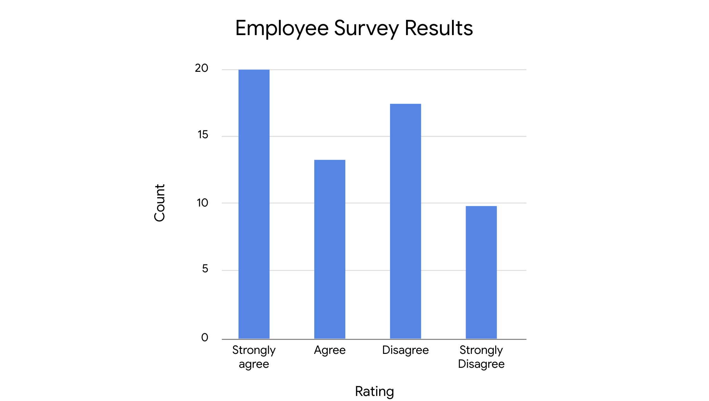
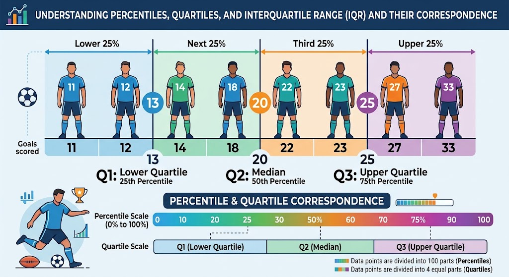
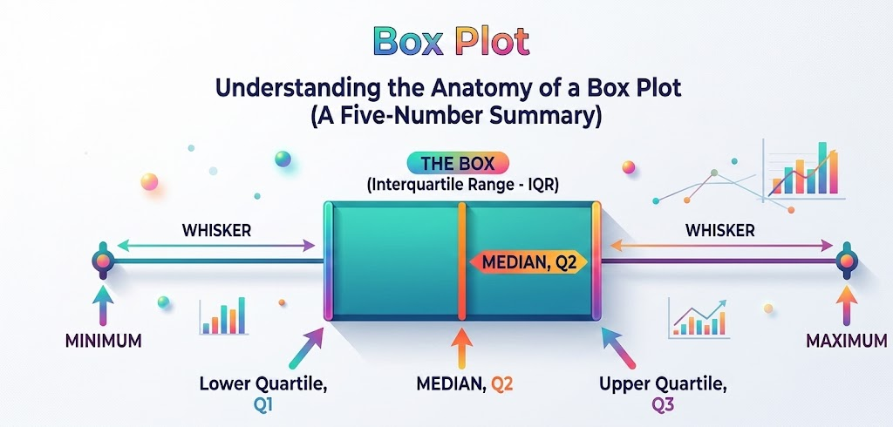

```{python}
#| include: false
import _setup

```

​Welcome to the next stage of your journey ​to learn advanced data analytics. ​

First, congratulations on your progress. ​You've learned how data professionals contribute ​to the success of an organization ​and the main tools and techniques they use on the job, ​and you know how to use code for exploratory data analysis. ​You can use data wrangling to organize and clean your data ​and create data visualizations ​to share important information. ​Well done. ​You already have quite a few tools ​in your analytic toolbox. ​Have room for a few more? ​Next up, statistics. ​

Statistics is the study of the collection, analysis, ​and interpretation of data. ​Statistics, often abbreviated as stats, ​provides data professionals with powerful tools ​and methods for transforming data into useful knowledge. ​You've already learned about exploratory data analysis ​and how it helps you summarize ​the main characteristics of your data. ​Descriptive statistics does this too, ​and that's where we'll start. ​

But data professionals also use statistics ​to do something more. ​Based on a small sample of available data, ​they can make informed predictions about uncertain events ​and make accurate estimates about unknown values. ​This is known as inferential statistics, ​and you'll learn all about it in this course. ​For example, data professionals use statistics ​to predict future sales revenue, ​the success of a new ad campaign, ​the rate of return on a financial investment, ​or the number of downloads for a new app. ​Statistical analysis can tell you ​which version of a website will attract more new customers ​for longer periods of time, ​or that new users will typically create an account ​after spending three minutes on the company's website. ​

The insights gained from statistical analysis ​help business leaders make decisions, ​solve complex problems, ​and improve the performance of the products and services. ​This is why data professionals are in such high demand ​and why the data career space keeps growing. ​

Speaking of data professionals, ​allow me to introduce myself. ​My name is Evan. ​I'm an economist, ​and I consult with various teams across Google. ​This means that I use statistics and other tools ​to analyze and interpret data ​to help business leaders make informed decisions. ​This includes helping them quantify uncertainty ​and identify if there's sufficient evidence ​to reject a hypothesis, ​both of which you'll learn more about later on. ​I'm thrilled to be your instructor in this course. ​

Before we begin, ​let me tell you about my own experience with statistics. ​As an undergraduate, I majored in economics and mathematics ​and then went on to get a PhD in economics. ​I focused on statistics and econometrics, ​a branch of economics that uses statistics ​to analyze economic problems. ​During my graduate studies, ​I interned at an online learning company ​and was a researcher at an online retail company. ​Across these roles and experiences, ​I've used many different statistical tools ​to solve problems. ​Often, I find that the problem I'm working on can be solved ​with a statistical method I'm unfamiliar with. ​I love constantly learning new methods ​and extending the range of problems I can work on. ​These advanced methods are built ​on a foundation of stats concepts. ​In this course, we'll focus on these fundamentals ​to prepare you for your future career. ​So if you're new to stats, welcome. ​

This course does not assume ​you have any prior knowledge of statistics. ​We'll begin from the beginning ​and work through each concept step by step. ​But if you have some experience in statistics, ​that's great too. ​We'll help you use what you already know in a new way ​so you can apply your stats knowledge ​to data analytics specifically.

​In this course, you'll discover ​how data professionals use statistical tools ​in their daily work. ​You'll also learn strategies for interpreting findings ​and sharing them with stakeholders who may not be familiar ​with stats concepts, or all the technical details. ​

We'll start this course with an introduction ​to the role of stats in data analytics, ​and we'll discuss the differences ​between descriptive and inferential stats. ​You'll learn how descriptive stats such as mean, median, ​and standard deviation help you quickly summarize ​and better understand your data. ​Then we'll explore how to use inferential statistics ​to draw conclusions and make predictions about data. ​

Next, we'll explore probability ​and discover useful ways to measure uncertainty. ​We'll discuss the basic rules of probability ​and how to interpret different types ​of probability distributions ​such as the normal, binomial, and Poisson distributions. ​From there, we'll move on to sampling. ​

We'll discuss what makes a good sample, ​the benefits and drawbacks of different sampling methods, ​and how to work with sampling distributions. ​We'll also examine confidence intervals ​which describe the uncertainty in an estimate. ​You'll learn how ​to construct different kinds of confidence intervals ​and interpret their meaning. ​After that, we'll explore how to use hypothesis testing ​to compare and evaluate competing claims about your data.

​We'll go over the steps for applying different tests ​to specific data sets, ​and we'll demonstrate how to interpret test results. ​Finally, you'll get a chance ​to apply your stats knowledge ​in your next portfolio project. ​The portfolio project features a scenario ​based on AB testing, ​an important practical application of statistics. ​In future job interviews, you can share your project ​as a demonstration of your skills ​and impress potential employers. ​I'll be your guide every step of the way ​and remember, you set the pace. ​Feel free to go over the videos as many times as you like ​and review topics that are new to you. ​By the end of the course, ​you'll have a useful toolkit of stats concepts ​to carry with you on the rest of your learning journey ​and in your future career. ​Let's get started.

------------------------------------------------------------------------

# The role of statistics in data science

Earlier, you learned that ​statistics is the study of the collection, ​analysis and interpretation of data. ​Today, humans generate and ​collect more data than ever before. ​Whenever we send a text message, ​make an purchase online, ​or post a photo on social media, ​we generate new data. ​As the amount of data grows, ​so does the need to analyze and interpret it. ​This is a big reason why stats ​and data-driven work is so important. ​and the field of data analytics is ​growing almost as fast as the data itself. ​Data professionals use statistics ​to analyze data in business, ​medicine, science, engineering, government, and more. ​In this video, we'll discuss ​the role of statistics in data science and why ​learning fundamental stats concepts is ​essential for every data professional. 

​Data professionals use the power statistical methods to ​identify meaningful patterns and relationships in data, ​analyze and quantify uncertainty, ​generate insights from data, ​make informed predictions about ​the future and solve complex problems. ​Even if you've never studied statistics, ​you probably use stats daily. ​For example, you may start your day ​by going online and checking the weather, ​where you learn that the forecast is ​for a 70 percent chance of rain, ​or a 50 percent chance of snow. ​Perhaps you visit a sports website ​to learn the batting average of ​your favorite cricket player or ​the scoring average of your favorite basketball player. ​On a news app, ​you might come across an election poll ​that reports a three percent margin ​of error and notes that ​an online survey was used to collect the data. ​Or perhaps you're a parent, ​and when you take your child to their yearly checkup, ​you learn that your child is in ​a certain percentile for height and weight. ​When you ask for more information, ​the doctor shows you the median height and ​weight for all kids who are the same age. 

​These scenarios include statistical concepts ​that you'll learn more about in this course. ​The weather report is based on ​probability or the likelihood of an event. ​The sports stats express average value. ​The election poll shows margin of error. ​The doctor uses the concept of percentile and median. ​All these stats give you ​useful knowledge that you can apply to your own life. ​Data professionals use the same concept in their work. 

​For example, a data professional might use ​probability to predict the future rate ​of return on an investment. ​They might estimate the annual ​average sales revenue for a company, ​calculate the margin of error to quantify ​the uncertainty of an employee satisfaction survey, ​or use percentiles to rank ​median home prices in different cities. ​On the job, data professionals use stats to ​transform data into insights ​that help stake holders make decisions. ​Statistics is the foundation of data analytics and is ​the basis for the most advanced methods ​of analysis that data professionals use. ​It all begins with the fundamental concepts ​that we're exploring in this course. ​Consider the role of grammar plays in ​your conversations, for example, ​when you chat with friends or coworkers, ​you're probably not thinking about ​grammatical concepts like the parts of speech. ​If you're having a conversation, ​then you already know how to use nouns, ​verbs, and adjectives. 

​Knowledge of basic grammar makes it ​possible to use language in the first place. ​This is why it's so foundational. ​In a similar way, shared knowledge of ​basic statistics allows data professionals ​to use a common language. ​Learning the basics will eventually let you join ​the conversation about more advanced topics. ​You'll build on your foundation in statistics with ​more complex methods like hypothesis testing, ​classification, regression, and time series analysis. ​I hope you're getting excited ​about how data professionals use ​stats to make sense of ​their data and gain useful knowledge. ​Coming up, you'll get a chance to check ​out an example of stats in action. 

------------------------------------------------------------------------

# Statistics in action: A/B testing

Today's economy is all about data. ​Business leaders want to make ​data-driven decisions based on evidence and analysis. ​Companies that use insights gained from data to guide ​their decision-making process are more likely ​to be successful than companies that don't, ​and data professionals are ​the people that generate those insights. ​They use statistics to transform data into ​knowledge, and help stakeholders make informed decisions. ​All the fundamental stats concepts that we cover in ​this course have valuable practical applications. ​In this video, you'll get ​a chance to check out stats in action. ​We'll go over one of the most popular applications ​of statistics for business, A/B testing. 

​I'll discuss how the stats concepts ​you'll learn in this course can ​help you analyze, and interpret data using an A/B test. ​Companies use A/B testing to ​evaluate everything from website ​design, to mobile apps, ​to online ads, to marketing emails. ​A/B testing is a way to compare ​two versions of something to find ​out which version performs better. ​A/B testing has become popular ​because it works well for many online applications. ​For example, businesses often use A/B testing to create ​two versions of a webpage to find out which one ​gets more clicks, purchases, or subscriptions. ​Even small changes to a webpage, ​like changing the color, ​size, or location of ​a button can increase financial gains. ​A/B test help business leaders optimized ​product performance and improve customer experience. 

​Another way companies use ​A/B testing is for marketing emails. ​You might send two versions of an email to ​your customer list to find out which version results in ​more sales, or you might test two versions of ​an online ad to discover which ​one visitors click on more often. ​Once you've conducted at the A/B test, ​you can use the data to make ​permanent changes to your ad. ​Let's go through an example of an A/B test step by step. ​Imagine you run an online store and ​10 percent of visitors to your website make a purchase. ​You want to run an A/B test to find out ​if changing the size of the add to cart button ​will increase the conversion rate, or ​the percentage of customers who purchase a product. ​The test presents two versions of your webpage, ​known as version A and version B, ​to a group of randomly selected users. 
​Version A is the original webpage. ​Version B is the webpage ​with the larger add to cart button. ​The test directs half the users to ​version A and half to version B. ​The test runs for two weeks. ​When the test is over, a statistical analysis ​of the results indicates ​that the larger button in version B ​resulted in an increase in purchases. ​The conversion rate for version B is 30 percent. ​This is three times greater ​than the conversion rate for version A, ​which is 10 percent. 

​That's a notable increase. ​Because of your A/B test, ​your company has a data-driven reason for replacing ​the current webpage with ​version B and increasing ​the size of an add to cart button. ​Now that you know how an A/B test works, ​let's explore the stats concepts behind A/B testing. ​Later on, we'll cover each concept in more detail. ​Think of this list as ​a brief preview of your future stats knowledge. ​The A/B test analyzes a small group of users drawn from ​the total population of all users that visit the website. ​In stats, we call this smaller group the sample. 

**​The sample is a subset of the larger population.** ​You can use data from a sample to make inferences ​or draw conclusions about the entire population. ​Data professionals use inferential statistics to make ​inferences about a dataset based on a sample of the data. ​In other words, stats are a powerful tool for predicting ​outcomes you don't know using data you do know. ​For example, you have no way of knowing how the ​next 100,000 website visitors will behave. ​What you can do is observe the ​next 1,000 visitors, and then ​use inferential statistics to predict ​how the following 99,000 will behave. ​As you'll discover, stats can help ​you make that prediction with accuracy. 

​This is why observing a sample through ​A/B testing can be so valuable to companies. ​They can use the results of the test to make ​changes that improve their business. ​Sampling, the process of selecting a subset of data ​from a population, is a critical part of an A/B test. ​Before you conduct the test, ​you need to decide on the sample size ​or the number of users in the test. ​Choosing the right sample size helps you get ​valid test results and avoid statistical errors. ​For example, you'll use stats ​to help you determine whether you need ​to use a sample size of 1,000 or 10,000 ​in order to predict customer behavior accurately. ​Like any statistical test, ​an A/B test can't predict ​user behavior with 100 percent certainty. 

​What stats can do is construct a confidence interval or ​a range of values that describes ​the uncertainty or surrounding an estimate. ​Knowing how to construct and ​interpret a confidence interval helps you ​make informed decisions about ​all users based on your test sample. ​Using stats, you can quantify the uncertainty of ​your A/B test and share ​this information with stakeholders ​to help them interpret the results. ​We'll talk more about how to interpret ​a confidence interval later on. ​After the test is complete, ​you'll need to determine the statistical ​significance of your results. ​Statistical significance refers to ​the claim that the results of ​a test or experiment are not explainable by chance alone. ​For instance, is the difference ​between version A and version B due ​to random chance or due to ​the fact that you changed the add to cart button? 

​A hypothesis test is ​a statistical method that helps you answer this question. ​The test helps quantify whether the result is likely due ​to chance or if it's statistically significant. ​A hypothesis test gives ​you data-driven support for changing ​your webpage to version B ​or for keeping it the same with version A. ​Software can help you calculate complex math problems. ​But having a working knowledge of ​stats lets you properly design, ​conduct, and interpret the results of a real test. ​By the end of this course, ​you'll know how to use all the stats concepts ​we just reviewed to analyze and interpret data. ​In fact, you'll be able to ​put your stats skills to work in ​a portfolio project based on ​a realistic A/B testing scenario. 

​Plus, your knowledge of ​stats will serve as a foundation for ​more advanced data analytics ​methods that you'll explore later on. 

------------------------------------------------------------------------

# Descriptive statistics vs inferencial statistics

Now that you know more about the role of ​statistics and data science, ​let's discuss the two main types of ​statistical methods, descriptive and inferential. ​Data professionals use each method ​to get different insights from their data. ​In this video, you'll learn the difference ​between descriptive and inferential stats ​and how data professionals use both ​to better understand their data. 

## Descriptive statistic

​Descriptive statistics describe or ​summarize the main features of a dataset. ​Descriptive stats are very useful because they let ​you quickly understand a large amount of data. ​For example, let's say you had data ​on the heights of 10 million people. ​You probably don't want to scan ​10 million rows of data to analyze it for your report. 

​Even if you did, it would be ​difficult to interpret the data. ​However, if you summarize the data, ​you can instantly make it meaningful. ​Finding the mean or average height ​gives you useful knowledge about the data ​plus reading a summary is much ​better than staring at millions of rows of data. ​

There are two common forms of descriptive statistics, ​visuals like **graphs** and **tables**, and **summary stats**. ​Previously you learned how graphs and ​tables can help you explore, ​visualize, and share your data. ​You're likely familiar with ​data visualizations such as histograms, ​scatter plots, and box plots. 

​**Summary statistics let you ​summarize your data using a single number.** ​A common example is the *mean* or *average* value. ​There are two main types of summary stats:, measures of central tendency and measures of dispersion. ​

-   Measures of central tendency like the mean, ​let you describe the center of your dataset.​

-   Measures of dispersion like standard deviation, ​let you describe the spread of ​your dataset or the amount of ​variation in your data points. ​

Stats like mean and standard deviation ​are used to describe and summarize data. ​But data professionals do more ​than just described their data. ​They also draw conclusions ​and make predictions based on data. ​For this, they use inferential statistics. 

## Inferential statistics

​Inferential statistics allow data professionals to make ​inferences about a dataset based on a sample of the data. ​

The dataset that the sample ​is drawn from is called the **population**. ​The population includes every possible element ​that you are interested in measuring. ​As we've discussed, **a sample is a subset of a population**. ​

Data professionals use samples to ​make inferences about populations. ​In other words, they use the data ​they collect from a small part of ​the population to draw conclusions ​about the population as a whole. ​Note that a statistical population may ​refer to people, objects, or events. 

​For instance, a population might be ​the set of all residents of a country, ​all the planets in our solar system, ​or all the outcomes of 1,000 coin flips. ​A sample is a smaller group or ​subset of any of these populations. ​Samples might be residents, ​planets, or coin flip outcomes. ​Let's check out an example. ​Say you want to research the music preferences of ​every college student in ​the United States to find out whether they prefer pop, ​rap, country, classical, or another genre of music. ​There around 20 million college students ​in the United States and would be too ​expensive and time-consuming to ​gather data from every single person. ​Instead, you can use a sample and ​survey only a subset of the 20 million students. 

​Later on, we'll discuss the factors that go into choosing ​different sample sizes and how ​larger sample sizes affect your results. ​For now, let's imagine you decide to ​survey 1,000 students instead of 20 million. ​Then you can use the results to make inferences about ​the music preferences of all college students. ​

Keep in mind that **your sample should be ​representative of your population**. ​Otherwise, the conclusions you draw from ​your sample will be unreliable and possibly biased. ​A representative sample is a sample that ​accurately reflects the population, for example, ​if you only survey math majors or only student athletes, ​your sample will not be representative ​of all college students. ​Finally, let's review two terms that correspond to ​population and sample, parameter and statistic. 

**​A parameter is a characteristic of a population**. ​**A statistic is a characteristic of a sample**, ​for example, the average height of ​the entire population of giraffes is a parameter. ​The average height of a random sample of ​100 giraffes is a statistic. ​

As I mentioned, it's difficult to collect data ​about every member of a large population. ​In this case, to locate and measure the height ​of every single giraffe in the world. ​We use the known value of a sample statistic, ​the average of 100 giraffes, ​to estimate the unknown value of ​a population parameter. That's all for now. 

​We've covered a lot of key concepts that are ​foundational for what you'll ​learn later on in the course. ​Coming up, we'll return to ​the topic of inferential statistics. ​We'll explore sampling in ​more detail and checkout common methods of ​inferential stats such as ​confidence intervals and hypothesis testing. 

------------------------------------------------------------------------

# Descriptive Statistics

Every time I explore new dataset, I feel a sense of excitement. ​It's like exploring a city for the first time. ​When I visit a new city, I often start my journey at the city's center. ​This way, I can figure out the distance between the center and ​the city limits or to a famous landmark I want to visit. ​Knowing where I am in relation to the center helps me find my way around. ​It's the same when I want to learn about a new dataset. ​First, I want to know the center of my dataset, ​then I want to know how spread out the other values are from the center. 

​Measuring the center and the spread of the dataset helps me quickly understand ​its overall structure, and decide which parts I want to explore in more detail. ​Earlier, you learn that summary statistics include measures of central tendency and ​measures of dispersion. ​**Measures of central tendency are values that represent the center of a dataset. ​Measures of dispersion are values that represent the spread of a dataset.** ​We'll talk more about measures of dispersion later on. ​In this video, ​you'll learn how to calculate three measures of central tendency. ​The mean, the median and the mode. 

​You may remember these terms from earlier in the program, but ​we'll discuss their importance in the study of statistics and data analysis. ​We'll also discuss which measure is best to use based on your specific data. ​Let's start with the mean. 

**Mean**​

**The mean is the average value in the dataset**. ​To calculate the mean, ​you add up all the values in your dataset and divide by the total number of values. ​For example, say you have the following set of values, 10, 8, 5, 70. ​To find the mean, you add up all the values for a total of 100, ​then you divide by 5, the total number of values. ​The mean or average value is 20. ​Next, the median.

**Median**

​**The median is the middle value in a dataset**. ​This means half the values in the dataset are larger than the median and ​half are smaller. ​You can find the median by arranging all values in the dataset from smallest to ​largest. ​If you arrange your five values in this way, you get 5, 7, 8, 10, 70. ​The median or middle value is eight. 

​If they're an even number of values in your dataset, ​the median is the average of the two middle values. ​Let's say you add another value, 4, to your set. ​Now, the two middle values are seven and eight. ​The median is their average, 7.5. ​You may notice that the mean, 20 is much greater than the median, 8. ​This is because there's one extreme value, 70 that increases the overall average. ​This value is known as an outlier. 

​Recall that **an outlier is a value that differs greatly from the rest of ​the data as measures of central tendency**. ​The mean and the median work better for different kinds of data. ​

**If there are outliers in your dataset, ​the median is usually a better measure of the center.** ​If there are no outlayers, the mean usually works well. ​For example, imagine you want to buy a home in a specific neighborhood. ​You tour ten homes in the area to get an idea of the average price. ​The first nine homes have a price of \$100,000. 

​The tenth home has the price of a million dollars. ​This is an outlier that pulls up the average. ​If you add all the home prices and divide by 10, you find that the mean or ​average price is \$190,000. ​The mean doesn't give you a good measure of the typical value of a home in this ​neighborhood. ​In fact, only one home out of ten costs more than \$100,000. ​The median home price is \$100,000. ​The median gives you a much better idea of the typical value of a home in this ​neighborhood, whether you use the mean or median depends on the specific dataset ​you're working with and what insights you want to gain from your data. 

​Finally, we have the mode. **​The mode is the most frequently occurring value in the dataset.** ​A dataset can have no mode, one mode or more than one mode. ​For example, the set of numbers: one, two, three, four, ​five, has no mode because there are no value repeats. ​In the set one, three, three, five, seven, the mode is three ​because three is the only value that occurs more than once. ​The set one, two, two, four, four has two modes, two and four. **​The mode is useful when working with categorical data** because it clearly shows ​you which category occurs most frequently. 

​Say an online retail company conducts a survey. ​Customers rate their experience as bad, mediocre, good or great. ​A bar chart summarizes the results. ​The highest bar refers to the rating bad. ​This is the most frequently occurring value or mode. ​The mode gives the company clear feedback on customer satisfaction. ​

To recap, the mean, median and mode ​all measure the center of a dataset in different ways. 

​The mean finds the average value. ​The median finds the middle value and ​the mod finds the most frequently occurring value. ​Knowing the center of your dataset helps you quickly understand its basic structure ​and determine the next steps in your analysis. ​Just like knowing the city center helps orient you in a new environment. 

------------------------------------------------------------------------

# Measures of central tendency: The mean, the median, and the mode

Recently, you learned that measures of central tendency are values that represent the center of a dataset. When you’re working with a new dataset, identifying the central location of your data helps you quickly understand its basic structure.

In this reading, you’ll learn more about three measures of central tendency: the mean, the median, and the mode. We’ll go over how to calculate each measure, and discuss which measure is best to use based on your specific data.

Measures of central tendency

The mean, median, and mode all describe the center of a dataset in different ways:

The mean is the average value in a dataset.

The median is the middle value in a dataset.

The mode is the most frequently occurring value in a dataset.

Let’s explore how to calculate each measure of central tendency.

Calculate the mean, the median, and the mode

## Mean

The mean is the average value in a dataset. To calculate the mean, you add up all the values in your dataset and divide by the total number of values.

For example, say you have the following set of values: 10, 5, 3, 50, 12. To find the mean, you add all the values for a total of 80. Then, you divide by 5, the total number of values. The mean, or average value, is 16.

## Median

The median is the middle value in a dataset. This means half the values in the dataset are larger than the median, and half the values are smaller than the median.

You can find the median by arranging all the values in a dataset from smallest to largest. If you arrange your five values in this way you get: 3, 5, 10, 12, 50. The median, or middle value, is 10.

If there are an even number of values in your dataset, the median is the average of the two middle values. Let’s say you add another value, 8, to your set: 3, 5, 8, 10, 12, 50. Now, the two middle values are 8 and 10. To get the median, take their average.

The median is 9.

## Mode

The mode is the most frequently-occurring value in a dataset. A dataset can have no mode, one mode, or more than one mode.

For example, the set of numbers 1, 12, 33, 54, 75 has no mode because no value repeats. In the set 2, 7, 7, 11, 20 the mode is 7, because 7 is the only value that occurs more than once. The set 3, 12, 12, 40, 40 has two modes: 12 and 40.

When to use the mean, the median, and the mode

Whether you use the mean, median, or mode to describe the center of your dataset depends on the specific data you’re working with and what insights you want to gain from your data. Let’s discuss some general guidelines for using each measure of central tendency.

## Mean versus median

Both the mean and the median describe the central location of a dataset. However, as measures of central tendency, the mean and the median work better for different kinds of data.

The mean has one main disadvantage: it is very sensitive to outliers in your dataset. Recall that an outlier is a value that differs greatly from the rest of the data.

If there are outliers in your dataset, the median is usually a better measure of the center. If there are no outliers, the mean usually works well.

For example, imagine you want to compute the average annual salary for an employee at a small startup company. You have the following salary data:

| **Employee** | #1       | #2       | #3       | #4       | #5       | #6       | #7        |
|:--------|:--------|:--------|:--------|:--------|:--------|:--------|:--------|
| **Salary**   | \$40,000 | \$45,000 | \$45,000 | \$45,000 | \$45,000 | \$50,000 | \$500,000 |

You can calculate the mean annual salary by adding up all the values in your dataset and dividing by the total number of values. There are seven salaries in total, and their sum is \$770,000.

\$770,000÷7=\$110,000

The mean salary for these seven employees is \$110,000. However, the data suggests that this mean value does not accurately reflect the typical salary of an employee at this company. Most employees have a salary between \$40,000–\$50,000. In fact, only one employee has a salary greater than \$50,000. The salary of \$500,000 is an outlier that pulls up the average, or skews the mean.

In this case, due to the presence of this outlier value, the median is a better measure of central tendency than the mean. The median, or middle value, in this dataset is \$45,000. The median gives you a better idea of the typical salary for an employee at this company.

## Mode

The mode is useful when working with categorical data because it clearly shows you which category occurs most frequently. Say a company conducts an employee satisfaction survey. The main item on the survey states, “I am satisfied with the opportunity I have to grow within the company.” Employees choose among four categories for their response: strongly agree, agree, disagree, strongly disagree. A bar chart summarizes the results.



The mode represents the highest bar in the bar chart, which refers to the rating “strongly agree.” This is the most frequently-occurring rating in the dataset. The mode gives the company clear feedback on employee satisfaction; in this case, positive feedback. 

## Key takeaways

Measures of central tendency such as the mean, median, and mode let you describe the center of your dataset using a single value. As a data professional, knowing the center of your dataset helps you quickly understand its basic structure and determine the next steps in your analysis. 

## Resources for more information

To learn more about measures of central tendency like the mean, median, and mode, explore the following resource:

-   This[article from the Australian Bureau of Statistics](https://www.abs.gov.au/websitedbs/D3310114.nsf/Home/Statistical+Language+-+measures+of+central+tendency#:~:text=There%20are%20three%20main%20measures,central%20value%20in%20the%20distribution.) offers a useful overview of the mean, median, and mode, and discusses how outliers influence measures of central tendency. 

------------------------------------------------------------------------

# Measures of dispersion

As I mentioned earlier, ​there are two things I want to know when I ​began to explore a new dataset. ​First, the location of the center or ​the measures of central tendency like the mean. ​Second, I want to know how spread out the values ​are from the center or the measures of dispersion, ​like the standard deviation. ​To get a complete picture of the data, ​it's good to know both the center and the spread. ​For example, datasets with the same central value ​can have different levels of variability or spread. ​Take three small data sets. ​Each set has three values that add up to 90. 

​Each set has the same mean, 90/3 equals 30. ​But the variation of values ​around the mean is much different. 

-   ​In the first set, the values 25, ​30 and 35 are all close to the mean of 30. 

-   Second set: 10, 25, 55​

-   The third set, the values 5, 10, ​and 75 are much more spread out from the mean. ​

Earlier, you learned how measures of central tendency, ​like mean, median, ​and mode represent the center of your dataset. 

​Now, you'll learn how measures of dispersion, ​such as the range and standard deviation ​can help you understand the spread of your data. ​

**The range is the difference between ​the largest and smallest value in a dataset.** 

​You have data on the daily temperature in ​Fahrenheit for the city of Central Valley, ​Costa Rica for the past week. ​The highest temperature is 77 degrees, ​the lowest temperature is 67 degrees. ​So the range is 10. ​The range is a useful metric ​because it's easy to calculate and ​gives you a very quick understanding ​of the overall spread of your dataset. ​However, standard deviation gives you ​a more nuanced idea of the variation in your data. ​Standard deviation measures how spread out ​your values are from the mean of your dataset. ​It calculates the typical distance ​of a data point from the mean. 

**​The larger the standard deviation, ​the more spread out your values are from the mean.** 

​Another measure of spread is called the **variance**, ​which is **the average of ​the squared difference of each data point from the mean**. ​Basically, it's the square of the standard deviation. ​You'll learn more about variance and ​how to use it in a later course. ​

Let's check out the plots of ​three normal probability distributions ​to get a better idea of spread. ​Later on, you'll learn more about ​distributions which map all the values in a dataset. ​For now, just know that the mean is ​the highest point on each curve, right in the center. 

```{python}
#| include: false
import numpy as np
import plotly.graph_objects as go
from scipy.stats import norm

# 1. Define the x-axis domain (from -9 to 9)
x_continuous = np.linspace(-9, 9, 500)
x_dots = np.linspace(-9, 9, 50)  # Sparse points for the blue dotted curve

# 2. Calculate Probability Density Functions (PDF) with Mean = 0
# Blue Curve: Standard Deviation = 1
y_blue = norm.pdf(x_dots, loc=0, scale=1)

# Green Curve: Standard Deviation = 2
y_green = norm.pdf(x_continuous, loc=0, scale=2)

# Red Curve: Standard Deviation = 3
y_red = norm.pdf(x_continuous, loc=0, scale=3)

# 3. Build the Plotly Figure
fig = go.Figure()

# Blue Trace: Dotted markers (Std Dev = 1)
fig.add_trace(
    go.Scatter(
        x=x_dots,
        y=y_blue,
        mode="markers",
        marker=dict(color="#3B82F6", size=6),
        name="Std Dev = 1 (Blue)",
    )
)

# Green Trace: Solid line (Std Dev = 2)
fig.add_trace(
    go.Scatter(
        x=x_continuous,
        y=y_green,
        mode="lines",
        line=dict(color="#A3E635", width=4),
        name="Std Dev = 2 (Green)",
    )
)

# Red Trace: Dashed line (Std Dev = 3)
fig.add_trace(
    go.Scatter(
        x=x_continuous,
        y=y_red,
        mode="lines",
        line=dict(color="#EF4444", width=4, dash="dash"),
        name="Std Dev = 3 (Red)",
    )
)

# 4. Styling to match the slide layout
fig.update_layout(
    xaxis=dict(
        tickvals=[-7.5, -5.0, -2.5, 0, 2.5, 5.0, 7.5],
        range=[-9, 9],
        showgrid=True,
        gridcolor="#E5E7EB",
    ),
    yaxis=dict(
        tickvals=[0.00, 0.05, 0.10, 0.15, 0.20, 0.25, 0.30, 0.35, 0.40],
        range=[0, 0.43],
        showgrid=True,
        gridcolor="#E5E7EB",
    ),
    template="plotly_white",
    width=800,
    height=500,
)

fig.show()
```

​Each curve has a different standard deviation. ​Blue is one, green is two, and red is three. ​The blue curve has the least spreads since ​most of its data points fall close to the mean. ​Therefore, the blue curve has ​the small standard deviation. ​The red curve has the largest standard deviation. ​It has the most spread since most of ​its data points fall farther away from the mean. ​Now, let's talk about how you ​determine with these numbers. 

​Here's the formula for ​the standard deviation of a sample.  
$$
s = \sqrt{\frac{\sum (x - \bar{x})^2}{n - 1}}
$$

​If you're new to stats this formula, ​it may seem like a secret code or an unfamiliar language. ​That's okay. We'll go over ​the variables and formula step-by-step. ​Plus you don't need to memorize ​the formula or do all the math on your own. ​As a data professional, ​you'll typically use a computer for calculations. 

​Being able to perform calculations ​is important for your future career, ​but being familiar with the concepts ​behind the calculations ​will help you apply statistical methods ​to workplace problems. 

​There are different formulas to calculate ​the standard deviation for a population and a sample. ​

As a reminder, data professionals typically work with ​sample data and then make ​inferences about populations based on the sample. ​So, we'll review the formula for a sample. 

​Let's consider how to interpret the formula by ​calculating the standard deviation of a small dataset, ​8, 10, and 12. 

​Calculating the standard deviation involves five steps. 

​First, find the mean of the dataset. ​The mean equals 10. ​$\bar{x}=10$

$$
s = \sqrt{\frac{\sum (x - 10)^2}{n - 1}}
$$

Next, for each value x on our dataset, ​we find the distance to the mean, and then we square it.  ​We'll include that calculation in our next step. ​The Greek letter sigma is a symbol that means sum. ​We need to do the x minus 10 squared ​calculation for each data point ​and add up all the results.

$$
s = \sqrt{\frac{(8 - 10)^2 + (10 - 10)^2 + (12 - 10)^2}{n - 1}}
$$

​N refers to the total number of ​values in your dataset, which is 3. 

$$
s = \sqrt{\frac{4 + 0 + 4}{2}}
$$

$$
s = \sqrt{\frac{8}{2}} =\sqrt{4} = 2
$$

 ​that's 2, the standard deviation. 

​Now let's explore an example of how ​standard deviation is useful in everyday life. 

​Meteorologists use standard deviation ​for weather forecasting to understand how much ​variation exists in daily temperatures in ​different places and to make ​more accurate predictions about the weather. 

​Imagine two meteorologists working ​in two different cities, ​City A and City B. 

​During the month of March, ​City A has a mean temperature of ​66 degrees Fahrenheit and ​a standard deviation of three degrees.  ​City B has a mean temperature of 64 degrees ​Fahrenheit and a standard deviation of 16 degrees. 

​Both cities have similar mean temperatures. ​In other words, the overall ​average temperature is about the same, ​but the standard deviation is much higher in City B. ​This means that there's more daily variation ​in temperature in City B. ​The weather may change dramatically ​from day to day there. ​In City A, the weather is more consistent. 

​If the meteorologist in ​City B predicted the weather based on the mean, ​they could be off by 16 degrees, ​which would lead to a lot of unhappy residents. 

​The standard deviation gives ​the meteorologist a useful measure of ​variation to consider and ​a level of confidence about their prediction. 

​A low standard deviation in ​temperature makes it a lot easier for ​the meteorologist in City A to ​accurately predict the daily weather. ​Data professionals use standard deviation to measure ​variation in many types of data like ad revenues, ​stock prices, employee salaries, and more. ​Now you have a better idea of ​how standard deviation measures the spread of your data. ​Coming up, we'll discuss some ways of understanding ​the relative position of the values in a dataset.


:::.extra

### Quick Recall: Population vs. Sample
* **Population ($N$):** The complete set of all elements or individuals you want to draw conclusions about.
* **Sample ($n$):** A representative subset of data selected from the larger population.

---

### Formulas

* **Population Standard Deviation ($\sigma$):**
  $$\sigma = \sqrt{\frac{\sum_{i=1}^{N} (x_i - \mu)^2}{N}}$$

* **Sample Standard Deviation ($s$):**
  $$s = \sqrt{\frac{\sum_{i=1}^{n} (x_i - \bar{x})^2}{n - 1}}$$

---

### Why Divide by $n - 1$? (Bessel's Correction)

When calculating sample variance, we use the sample mean ($\bar{x}$) instead of the true, unknown population mean ($\mu$). Because sample data points naturally cluster closer to their own sample mean than to the true population mean, dividing by $n$ underestimates the true variability in the population. 

Dividing by $n - 1$ (**Bessel's correction**) expands the result slightly, providing an **unbiased estimate** of the population standard deviation.

Example explanation:
-   The Population ($\mu$): Exact TruthIf you have all $N = 4$ values in the population (e.g., 5, 15, 12, 8), their average $\mu$ is 10. You aren't estimating anything. You are measuring the exact, true distance of every single member of the universe from their true center. Because there is no error or guessing involved, you divide by the full count, $N$.
-   The Sample ($\bar{x}$): The "Cheating" Problem: Suppose the true population mean score of all players in a league is $\mu = 50$. You pull a random sample of 4 players whose scores happen to be 40, 42, 44, 46.Their sample mean $\bar{x}$ is 43. Notice that 43 is closer to your 4 data points than the true population mean ($\mu = 50$) is.Because $\bar{x}$ is calculated directly from those 4 points, it naturally pulls itself into the absolute geometric center of those specific points.Measuring distances to your sample mean $\bar{x}$ will always yield smaller distances than measuring distances to the true population mean $\mu$. If you divide those smaller sample distances by $n$ (4), your calculated standard deviation will be systematically too small—it underestimates how spread out the real population actually is.

---

### What are Degrees of Freedom (ddof)?

**Degrees of Freedom** represent the number of independent pieces of information available to calculate a statistic.

When calculating sample standard deviation, we first calculate and fix the sample mean ($\bar{x}$). 
Fixing the mean creates a math constraint: all deviations from the mean must sum to zero ($\sum (x_i - \bar{x}) = 0$).

**An Intuitive Example:**
Suppose you have $n = 4$ numbers, and you know their average is 10 (meaning their sum must be 40):
* You can pick **3** numbers freely (e.g., 5, 15, 12).
* The **4th** number is automatically locked in (it must be 8 so the sum stays 40).
Out of $n$ numbers, only **$n - 1$** are free to vary independently once the mean is known. 


The parameter `ddof` (Delta Degrees of Freedom) specifies how many constrained parameters to subtract from the total count ($n$):
$$\text{Denominator} = n - \text{ddof}$$

* **`ddof = 0`**: Divides by $n$ (Population standard deviation — assumes no estimated mean constraint)
* **`ddof = 1`**: Divides by $n - 1$ (Sample standard deviation — accounts for estimating the sample mean)
---

### Implementation: Pandas vs. NumPy

Because of their differing intended use cases, **NumPy** and **Pandas** use different defaults for calculating standard deviation:

```{python}
import numpy as np
import pandas as pd

data = [10, 12, 23, 23, 16, 23, 21, 16]

# 1. NumPy defaults to Population Std Dev (ddof = 0)
np_std = np.std(data)  # Divides by N

# 2. Pandas defaults to Sample Std Dev (ddof = 1)
pd_series = pd.Series(data)
pd_std = pd_series.std()  # Divides by n - 1

# To match results across libraries:
sample_std_np = np.std(data, ddof=1)  # numpy Matching Pandas default 
pop_std_pd = pd_series.std(ddof=0)  # panda Matching NumPy default
```

NumPy (ddof=0 default): Originated as a general mathematical and signal-processing library, assuming you are computing raw mathematical variance over the exact array provided.

Pandas (ddof=1 default): Designed specifically for statistical analysis and data science, where datasets are almost always treated as samples drawn from a broader population.

:::

### **Example: Real estate prices** 

Imagine you're a data professional working for a real estate company. The real estate agents on your team like to inform their clients about the variation in rental prices in different residential areas. Part of your job is calculating the standard deviation of monthly rental prices for apartments in specific neighborhoods, and sharing this information with your team. Let’s say you have sample data on monthly rental prices for one-bedroom apartments in two different neighborhoods: Emerald Woods and Rock Park. Assume you calculate the mean and standard deviation for each dataset.  

**Emerald Woods**

| **Apartment**    | **#1** | **#2** | **#3**  | **#4**  | **#5**  |
|:-----------------|:-------|:-------|:--------|:--------|:--------|
| **Monthly Rent** | \$900  | \$950  | \$1,000 | \$1,050 | \$1,100 |

Mean: \$1,000

Standard deviation: \$79.05

**Rock Park**

| **Apartment**    | **#1** | **#2** | **#3**  | **#4**  | **#5**  |
|:-----------------|:-------|:-------|:--------|:--------|:--------|
| **Monthly Rent** | \$500  | \$650  | \$1,000 | \$1,350 | \$1,500 |

Mean: \$1,000

Standard deviation: \$431.56

Both neighborhoods have the same mean rental price of \$1,000 per month. However, the standard deviation for rental prices in Rock Park (\$431.56)  is much higher than the standard deviation for rental prices in Emerald Woods (\$79.05). This means that there is a lot more variation in rental prices in Rock Park. This is useful information for your agents. For example, they can tell clients that it may be easier for them to find a more affordable apartment in Rock Park that is far below the mean of \$1,000. Standard deviation helps you quickly understand the variation in prices in any given neighborhood. 

## Key takeaways

Data professionals use standard deviation to measure variation in many types of data like ad revenues, stock prices, employee salaries, and more. Measures of dispersion like the standard deviation, variance, and range let you quickly identify the variation in your data values, and get a better understanding of the basic structure of your data. 

## Resources for more information

To learn more about measures of dispersion like the range, variance, and standard deviation, explore the following resources: 

-   This [article from Statistics Canada](https://www150.statcan.gc.ca/n1/edu/power-pouvoir/ch12/5214891-eng.htm) provides a helpful summary of variance and standard deviation,  and discusses the usefulness of standard deviation as a measure of dispersion. 

------------------------------------------------------------------------

# Measures of position

Measures of position help you determine the position of ​a value in relation to other values in a dataset. ​Along with center and spread, ​it's helpful to know the relative position of the values. ​For example, whether one value ​is higher or lower than another, ​or whether a value falls in the lower, ​middle, or upper portion of your dataset. 

​In a city, this is similar to knowing where ​different places of interest are ​located in relation to one another. ​For example, it's useful to know ​how far the art museum is from ​the city park or if the famous restaurant you want to ​eat at is close to ​the historical monument you want to visit. 

​In this video, you'll learn ​about the most common measures of ​position, percentiles and quartiles. ​You'll also learn how to calculate ​the interquartile range and use ​the five number summary to summarize your data. ​

**A percentile is the value ​below which a percentage data falls**. ​Percentiles show the relative position ​or rank of a particular value in a dataset. ​

Some universities ask applicants ​to take standardized tests. ​For example, in the United States, ​the SAT and the ACT are common exams. ​When a student receives their test score, ​they usually also receive a corresponding percentile. ​For example, let's say a test score ​falls in the 99th percentile. ​This means the score is higher than ​99% of all test scores. ​If a score falls in the 75th percentile, ​the score is higher than 75% of all test scores. ​If the score falls in the 50th percentile. ​The score is higher than half or ​50% of all test scores and so on. 

**​Percentiles are useful for comparing values.** ​For example, different exams ​may have different scoring systems. ​SAT scores range 400-1600, ​ACT scores range 1-36, ​and a typical school exam in ​math or history may range 0-100. ​If you only know the raw scores for each test, ​say a 1,000 for the SAT, ​20 for the ACT, ​and 70 for the school exam, ​you have no way of making a meaningful comparison. ​If you know that all three test scores ​fall in the 50th percentile, ​then you can meaningfully compare ​student performance across the different exams. 

​You can use quartiles to get ​a general understanding of ​the relative position of values. ​**A quartile divides the values in ​a dataset into four equal parts.** ​Quartiles let you compare values ​relative to the four quarters of data. ​

Each quarter includes 25% of the values in your dataset. ​The first quartile is ​the middle value in the first half of the dataset. ​

-   The first quartile, Q1 ​is also called the lower quartile, ​25% of the data points are below Q1 and 75% are above it. ​

-   The second quartile is the median value in the set. ​Q2 is the median, ​50% of the data points are below Q2 and 50% are above it. ​

-   The third quartile is ​the middle value in the second half of the dataset, ​75% of the data points are below Q3 and 25% are above it. 

​Note the relationship between quartiles and percentiles. 

**​Q1 refers to the 25th percentile, ​**

**Q2 to the 50th percentile, ​**

**and Q3 to the 75th percentile.** 

​For example, say you're the manager of a sports team. ​You have data that shows how many goals ​each player on your team scored ​over the course of an entire season. ​You want to compare the performance ​of each player based on scoring. ​You can calculate quartiles for ​your data using these steps. 

​First, arrange the values from smallest to largest, ​11, 12, ​14, 18, 22, ​23, 27, 33. 

​Second, find the median of your data set. ​This is the second quartile, Q2. 

​There are an even number of values in the dataset so ​the median is the average of the two middle values, ​18 and 22, Q2 equals 20. ​

Third, find the median of ​the lower half of your dataset. ​This is the lower quartile, ​Q1, Q1 equals 13. ​

Finally, find the median of ​the upper half of your dataset. ​This is the upper quartile, ​Q3, Q3 equals 25. 

​Breaking the data into quartiles gives you ​a clear idea of player performance. ​You now know that ​the lower quartile of players scored 13 goals or less, ​and the upper quartile scored 25 goals or more. ​In other words, the lower ​25% of players scored 13 goals or less, ​and the upper 25% scored 25 goals or more. ​The middle 50% of players scored between 13 and 25 goals. ​

**The middle 50% of your data is ​called the interquartile range or IQR.** ​The interquartile range is ​**the distance between the first quartile, ​Q1, and the third quartile, Q3**. ​Technically, IQR is ​a measure of dispersion because it measures ​the spread or the middle 50% of your data. 

​This is the same as the distance between ​the 25th and 75th percentiles, ​or between Q1 and Q3. 

​IQR is also useful for ​determining the relative position of your data values. ​IQR equals Q3 minus Q1. ​In this case, Q3 equals 25 and Q1 equals 13, ​so IQR equals 12. 

​

Finally, you can summarize the major divisions ​in your dataset with the five-number summary. ​

The five numbers include:

-   the minimum, ​

-   the first quartile,

-   the median or second quartile, ​

-   the third quartile,

-   and the maximum. ​

For your sports data, the five-number summary is 11, ​13, 20, 25, 38. 

​The five-number summary is useful ​because it gives you an overall idea of ​the distribution of your data from ​the extreme values to the center. ​You can visualize it with a box plot. ​



The box part of the boxplot goes from ​the first quartile to the third quartile. ​The vertical line in the middle of the box is the median. ​The horizontal lines on ​each side of the box, known as whiskers, ​go from the first quartile to ​the minimum value and ​from the third quartile to the maximum value. ​The following boxplot shows the data on goals. ​We can find the values on ​the boxplot and determine the inter-quartile range. 

​Q1, or the lower quartile equals 13, ​Q3, or the upper quartile equals 25. ​The interquartile range is the length of the box, ​25 -13 = 12. ​Data professionals use measures of position such as ​percentiles and quartiles to better ​understand all kinds of data. ​This may include public health data ​such as life expectancy, ​economic data such as household income, ​business data such as product sales and more. ​That concludes our tour of descriptive statistics. ​Coming up, you'll use Python to ​compute descriptive stats and summarize a dataset. 

## Key takeaways

Data professionals use measures of position such as percentiles and quartiles to better understand all types of data, from product sales to household income. Measures of position help you quickly identify the relative location of your data values, and give you a more precise sense of the distribution of your data.

## Resources for more information

To learn more about measures of position like percentiles and quartiles, check out the following resource: 

-   This [statistics dictionary from Freie Universität Berlin](https://www.geo.fu-berlin.de/en/v/soga-py/Basics-of-statistics/index.html) provides clear definitions and useful examples of measures of position such as percentiles, quartiles, the five number summary, and more.