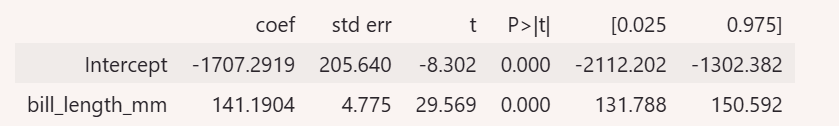

Are you ready to start practicing ​your computer programming skills now?

​In this video, we'll apply some of the concepts ​around simple linear regression to data. ​The move from theory to application is a big milestone, ​but remember that you have ​worked hard to get to this point. ​We'll go through the code in some depth today. ​You will have access to the code ​for you to review in detail.

​Let's begin by exploring a problem that's been affecting ​a local zoo where you were ​recently hired as part of the analytics team. ​The caretakers who manage ​the penguin habitats are having ​trouble keeping their population adequately fed. ​They're hoping to find out if ​certain features of the birds are ​related to body mass ​to better manage their feeding routines. ​The dataset includes ​structural measurements of different penguins, ​such as bill length and body mass.

​Now that you have some contexts, ​you can use exploratory data analysis ​to start analyzing the data.

​First import some packages, pandas and seaborne. ​Both will be especially useful today.

```{python}
# Import packages
import pandas as pd
import seaborn as sns
```

​The amazing thing about ​seaborne and many other libraries in ​Python and other programming languages, ​is that there are ​built-in datasets that you can work with. ​You don't even need to download any files. ​Now load the penguin dataset and ​save it as a variable called penguins. ​The `load_dataset` function returns ​a data frame so penguins is a data frame.

```{python}
# Load dataset
penguins = sns.load_dataset("penguins")

# Examine first 5 rows of dataset
penguins.head()
```

​There are a few continuous variables, bill length, ​buildup, and flipper length, ​all measured in millimeters. ​Body mass is measured in grams. ​There are also a few discrete variables, ​species, island, and sex. ​Since you're working with simple linear regression, ​you'll focus on the continuous variables. ​If you would like to, ​you can access the code to see how I clean the data. ​I subset the data to include only two species of ​penguin and dropped a couple of rows with missing data.

```{python}
# Keep Adelie and Gentoo penguins, drop missing values
penguins_sub = penguins[penguins["species"] != "Chinstrap"]
penguins_final = penguins_sub.dropna()
penguins_final.reset_index(inplace=True, drop=True)
```

​Now you can start creating plots to identify ​some linear relationships ​between the continuous variables. ​The clean data is saved in ​a data frame called penguins_final. ​Now you can input the data frame into ​seaborns pair plot function. ​Seaborns pair plot function ​creates a scatter plot matrix. **​A scatterplot matrix is a series of scatterplots ​that show the relationship between pairs of variables.**

```{python}
# Create pairwise scatterplots of data set
sns.pairplot(penguins_final)
```

​By using the `pairplot` function, ​you will observe a few linear relationships ​in the scatterplots. ​The diagonal displays the distribution ​of the continuous variables. ​This assures you that the data has met ​the linearity assumption for ​building a simple linear regression.

​First, bill length and ​body mass seem to be positively correlated. ​Next, flipper length and ​bill length also seem to be positively correlated. ​Lastly, body mass and ​flipper length also seem to be correlated. ​Let's explore the relationship between bill length and ​body mass further in terms ​of linear regression assumptions. ​We know we have met the first ​linear regression assumption of linearity. ​

Luckily, the diagonal of the pair plot ​also shows us the distribution of each variable. ​We can observe that both bill length and ​body mass are close to being normally distributed. ​This suggests that will probably ​have normally distributed residuals.

​The third assumption is of independent observations. ​Since each row has data on a different penguin, ​we have no reason to believe that one penguins ​billing or body mass is related to any other penguins.

​We can confirm the last assumption, ​homoscedasticity after we build ​our model when we graph the residuals.

​Now let's subset the data once more ​to isolate bill length and body mass. ​

```{python}
# Subset Data
ols_data = penguins_final[["bill_length_mm", "body_mass_g"]]
```

Note the use of double square brackets, ​which tells Python which columns you want to choose.

Use the seaborns `regplot` function to ​plot the data with the best fit regression line. ​You can observe a linear relationship ​between the variables, ​the best fit line, ​and a small shaded region around the line ​indicating the uncertainty around the model estimates. ​

```{python}
sns.regplot(x = "bill_length_mm", y = "body_mass_g", data = ols_data)
```

​Write out the regression formula in ​terms of computer can understand, ​and you'll save it as a variable called formula. ​As you do this, pay ​careful attention to the column names. ​You need to specify the column names exactly, ​so the computer knows how to run the regression model. ​First, type ​the $y$-variable column name, which is body_mass_g, and then tilde and ​the $x$-variable column name, which is bill_length_mm. ​The tilde \~ lets the computer know that ​whatever comes after is our $x$-variable.

```{python}
# Write out formula
ols_formula = "body_mass_g ~ bill_length_mm"
```

​Now that you have the data and the formula, ​you can create an OLS object using ​the OLS function from the stats model module. ​Save the object as a variable called OLS. ​Input the OLS formula variable as ​the formula argument of the OLS function. ​Then input OLS data variable as the data argument. ​Next, you'll use the OLS objects fit ​method to actually fit ​your linear regression model to the data. ​Save the results as a variable called model.

```{python}
# Import ols function
from statsmodels.formula.api import ols
# Build OLS, fit model to data
OLS = ols(formula = ols_formula, data = ols_data)
model = OLS.fit()
```

::: extra
Note than in a previous lesson we had used the ols function in a different way. Both snippets perform Ordinary Least Squares (OLS) linear regression using the same underlying library (statsmodels), but they use two different syntax styles provided by Python: the Numpy/Array approach and the R-style Formula approach.

```{python}
import statsmodels.api as sm

# 1. Extract the target (y) and predictor (x) as pandas Series/Arrays
y1 = ols_data["body_mass_g"]
x1 = ols_data["bill_length_mm"]

# 2. Manually add the intercept column (column of 1s)
X1 = sm.add_constant(x1)

# 3. Fit the OLS model (y comes first, then X)
model_array = sm.OLS(y1, X1)
results_array = model_array.fit()

# 4. View results
print(results_array.summary())
```

This works when you pass raw NumPy arrays directly into sm.ols Statsmodels' array interface does not include an intercept (the $y$-intercept or $c$ in $y = mx + c$) by default. You have to manually call `sm.add_constant(x)` to add a column of $1$s.

In the method we are seeing in this lesson, we are passing a Pandas DataFrame and specify column names as strings in a formula ("target \~ predictor"). The tilde \~ reads as "is modeled as a function of". So "body_mass_g \~ bill_length_mm" translates mathematically to: $$
\text{body_mass_g} = \beta_0 + \beta_1 \cdot \text{bill_length_mm}
$$ The formula syntax in Method 2 is generally preferred when working with real-world datasets in Pandas DataFrames. It is cleaner to write, easier to read, and automatically handles complex relationships (like categorical features or interaction terms like "y \~ x1 \* x2").

### Side-by-Side Comparison

|  |  |  |
|------------------------|------------------------|------------------------|
| **Feature** | **Method 1 (sm.OLS)** | **Method 2 (ols formula)** |
| **Data Format** | NumPy arrays or matrices | Pandas DataFrames |
| **Syntax Style** | Explicit array/matrix algebra | R-style formula string |
| **Target Variable** | Passed as first argument: `(y, X)` | Left of `~`: `"y ~ x"` |
| **Intercept (**$\beta_0$) | Must manually add `sm.add_constant()` | Added automatically |
| **Categorical Variables** | Must manually create dummy variables | Handled automatically via string/category columns |
:::

​Finally, print out the result of ​the ordinary least squares estimation, ​which is the technique the OLS function ​used to build the linear regression model. ​Then use the model summary method, ​which will print out a table ​of many different statistics.

```{python}
model.summary()
```

​This table contains lots of information. ​We'll go through some different ​sections of the table later in ​this course and leave ​the rest for you to explore on your own. ​For now we'll focus on the bottom section, ​which details the coefficients ​the model determined would generate the best fit line.

​Since we're using a simple linear regression model, ​we have two coefficients, ​an intercept or $\beta_0$ and a slope or $\beta_1$.



​You can find the Y-intercept of ​the best fit line and ​the intercept row of the coefficient column, ​which is abbreviated to coef in the table. ​In this case it's -1707.2919.

​You can find the slope in ​the bill length row of the coefficient column. ​The slope of the best fit line is 141.1904. ​

Let's rewrite this as a linear equation, ​which will help us interpret the results later.

$$ 
y= \text{intercept} + \text{slope} \cdot x 
$$

$$ 
\text{Penguin's body mass} = -1707.29 + 141.19 \cdot \text{bill lenght}
$$

​This means that penguin with ​one millimeter longer billing ​has 141.19 grams higher body mass on average. ​Remember, you still need to examine some assumptions ​about the residuals to double check the conclusion. ​

Great. You have fit ​a linear regression model to the data. ​

To finish checking the model's assumptions, ​calculate some fitted values ​using your models predict method. ​

```{python}
# Subset X variable
X = ols_data["bill_length_mm"]

# Get predictions from model
fitted_values = model.predict(X)
```

You can access ​the residuals using the model variable. ​By residuals we mean the difference between ​the actual and fitted values ​using the models resid attribute

```{python}
# Calculate residuals
residuals = model.resid
```

Finally, create a couple ​of plots to confirm your findings. ​

Now that we have calculated the fitted values and the residuals, let's return to the linear regression assumptions and create a scatter plot of the fitted values against the residuals. ​

```{python}
# Import matplotlib
import matplotlib.pyplot as plt
fig = sns.scatterplot(x=fitted_values, y=residuals)

# Add reference line at residuals = 0
fig.axhline(0)

# Set x-axis and y-axis labels
fig.set_xlabel("Fitted Values")
fig.set_ylabel("Residuals")

# Show the plot
plt.show()
```

This is a very common plot you'll encounter when working ​with linear regression to check various assumptions. ​From this plot, you can observe that ​residuals seem randomly space, ​which means you can assume homoscedasticity. ​A random looking scatter plot is indicative ​that the independence assumption is not violated. ​But it's not the sole reason ​that we believe it to be true. ​You could examine inputs and ​other more advanced statistical test to confirm this.

​Lastly, create a histogram of ​our residuals to determine if ​the residuals are normally distributed. ​If the residuals are normally distributed ​following that classic bell curve shape, ​then you can confirm ​the normality assumption has been met as well.

```{python}
import matplotlib.pyplot as plt
fig = sns.histplot(residuals)
fig.set_xlabel("Residual Value")
fig.set_title("Histogram of Residuals")
plt.show()
```

​The residuals are a little bit skewed in the histogram ​so you can create a QQ plot to verify normality. ​You can use the stats model QQ plot function ​to create the graph. ​

```{python}
import matplotlib.pyplot as plt
import statsmodels.api as sm
fig = sm.qqplot(model.resid, line = 's')
plt.show()
```

There is a straight diagonal line trending upward ​with some slight curvature on the extremes. ​You may want to explore this further, ​but for now this is ​pretty good confirmation of the normality assumption. ​

Now that you've confirmed all the assumptions are met, ​you can say that the results from ​the regression model are likely reasonable. ​Wow, we went through a lot of ​code and many plots together. ​You should be so proud of what ​you've accomplished in this video. ​Keep in mind that you can always review what we've ​covered along with the code and documentation. ​Great work.

------------------------------------------------------------------------

# Code functions and documentation

In this reading, you will review some of the code from the videos using a different subset of the penguin data. This reading will also share some tips when approaching the statsmodels documentation. This is a good opportunity to review Python functionality in conjunction with exploratory data analysis, basic data cleaning, and model construction.

## Review functions from video

### **Load the dataset**

The first few lines of code set up the coding environment and loaded the data. As you might be familiar with, you can call on the **import** function to import any necessary packages. You should use conventional aliases as needed. The example below references a dataset on penguins available through the **seaborn** package.

```{python}
# Import packages
import pandas as pd
import seaborn as sns

# Load dataset
penguins = sns.load_dataset("penguins")

# Examine first 5 rows of dataset
penguins.head()
```

### **Clean data**

After loading the data, the data was cleaned up to create a subset of data for the purposes of our course. The example isolates just the Chinstrap penguins from the dataset and drops rows with missing data.

The index of the dataframe is reset using the **reset_index()** [function](https://pandas.pydata.org/docs/reference/api/pandas.DataFrame.reset_index.html). When you subset a dataframe, the original row indices are retained. For example, let’s say there were Adelie or Gentoo penguins in rows 2 and 3. By subsetting the data just for Chinstrap penguins, your new dataframe would be listed as row 1 and then row 4, as rows 2 and 3 were removed. By resetting the index of the dataframe, the row numbers become rows 1, 2, 3, etc. The data frame becomes easier to work with in the future.

Review the code below. You are encouraged to run the code in your own notebook.

```{python}
# Subset just Chinstrap penguins from data set
chinstrap_penguins = penguins[penguins["species"] == "Chinstrap"]
# Reset index of dataframe
chinstrap_penguins.reset_index(inplace = True, drop = True)
```

### **Setup for model construction**

Now that the data is clean, you are able to plot the data and construct a linear regression model. First, extract the one X variable, **bill_depth_mm**, and the one Y variable, **flipper_length_mm**, that you are targeting.

```{python}
# Subset Data
ols_data = chinstrap_penguins[["bill_depth_mm", "flipper_length_mm"]]
```

Because this example is using statsmodels, save the ordinary least squares formula as a string so the computer can understand how to run the regression. The Y variable, **flipper_length_mm** comes first, followed by a tilde and the name for the X variable, **bill_depth_mm**.

```{python}
# Write out formula
ols_formula = "flipper_length_mm ~ bill_depth_mm"
```

### **Construct the model**

In order to construct the model, you’ll first need to import the **ols** function from the **statsmodels.formula.api** interface.

```{python}
# Import ols function
from statsmodels.formula.api import ols
```

Next, plug in the formula and the saved data into the **ols** function. Then, use the **fit** method to fit the model to the data. Lastly, use the **summary** method to get the results from the regression model. 

```{python}
# Build OLS, fit model to data
OLS = ols(formula = ols_formula, data = ols_data)
model = OLS.fit()
model.summary()
```

### **Model predictions and residuals**

You can access the predictions and residuals from a fitted [statsmodels.regression.linear_model.OLS](https://www.statsmodels.org/stable/generated/statsmodels.regression.linear_model.OLS.html) or [statsmodels.regression.linear_model.OLSResults](https://www.statsmodels.org/stable/generated/statsmodels.regression.linear_model.OLSResults.html) object as follows.

#### Predictions

Use the model’s [predict()](https://www.statsmodels.org/stable/generated/statsmodels.regression.linear_model.OLS.predict.html#statsmodels.regression.linear_model.OLS.predict) method, passing to it an array containing the values of the independent variable(s):

```{python}
predictions = model.predict(chinstrap_penguins[["bill_depth_mm"]])
```

#### Residuals

Use the model’s **resid** attribute:

```{python}
residuals = model.resid
```

## Navigating statsmodels documentation

It can require significant work to approach a new Python package or a new set of Python functions, especially when first coding. The benefit of Python being an open source programming language is that there is a strong Python community asking and answering questions. Part of being a successful data professional is knowing how to make your code work and troubleshooting when your code breaks. One way to do this is to go directly to the source, or the official documentation of a particular package.

You’ve been using the **statsmodels** package to build simple linear regression models. The [statsmodels documentation](https://www.statsmodels.org/devel/api.html) is available online and is updated regularly. Specifically, you are using the [statsmodels.formula.api interface](https://www.statsmodels.org/devel/api.html#statsmodels-formula-api) to perform ordinary least squares estimation.

Examining the page on the **ols** [function](https://www.statsmodels.org/devel/generated/statsmodels.formula.api.ols.html#statsmodels.formula.api.ols) or the function that performs OLS estimation, you will observe the different function parameters that are allowed, with some notes about each.

Unfortunately, at this time, the statsmodels documentation does not include code examples of how to use the function. If you find documentation that doesn’t provide as many examples as you need, or documentation that doesn’t provide examples that you need to troubleshoot your code, remember that you can always search online for the function you’re trying to use and explore how others in the Python community have handled comparable problems.

## Key takeaways

-   You can review this reading to refresh your memory about the code in the corresponding video.

-   You can view the statsmodels (or any other package’s) documentation as needed.

-   If the documentation does not hold the answer you’re looking for, you can always turn to the internet to check out other people’s work.