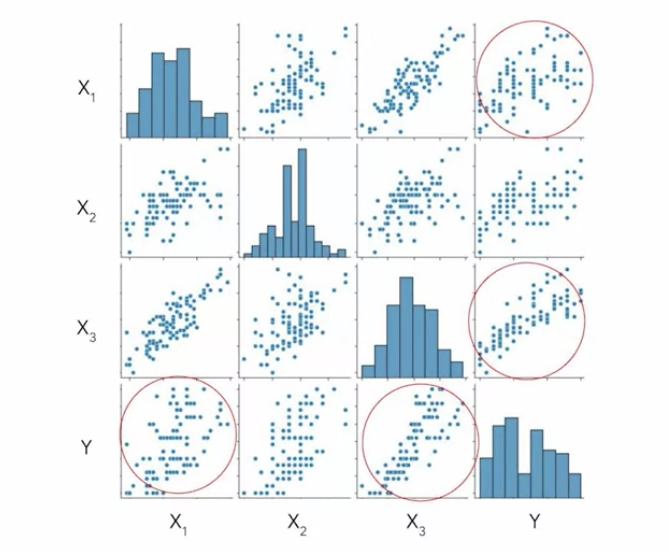
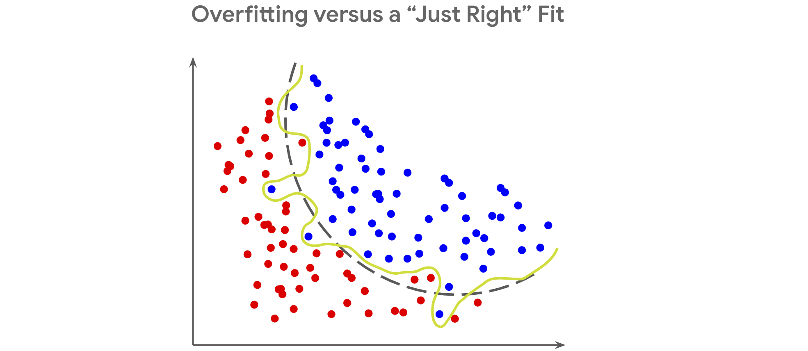
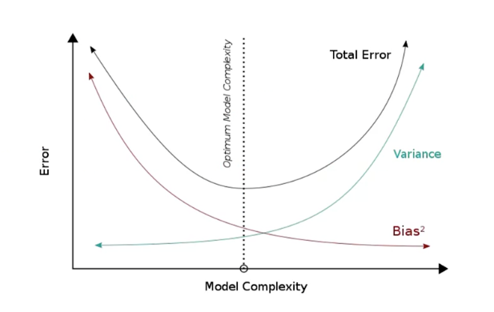
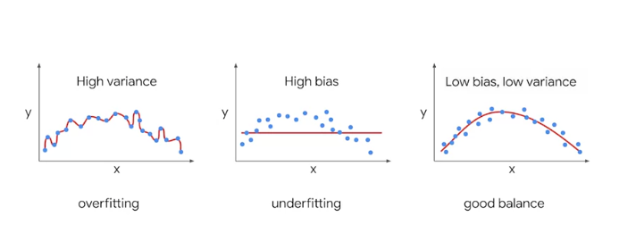

Hi there, it's great to join you again on your journey towards becoming a data ​analytics professional. ​You've come a long way since the start of this course. ​Together, we covered PACE in regression modeling and ​an overview of two foundational regression models, linear and logistic regression. ​We used your statistical knowledge to discuss how simple linear regression ​works and when to use it. ​You learned about model evaluation. ​You also learned how to interpret and ​communicate regression results effectively and accurately. ​All of these skills will translate to other regression and ​machine learning models. 

​As you grow as a data professional, ​you'll be able to use these skills to discover many data-driven insights. ​Simple linear regression is a great foundational technique but it can feel ​limiting as a technique, because it only allows for one independent variable. ​There are many cases where you might be interested in two, three, ​or four independent variables. ​For example, there could be many factors that are associated with product ​sales in a given month, such as holidays, new product launches, ​changes to the retail website, or changes to marketing campaigns. ​We need a new technique to figure out how each of these variables is correlated with ​product sales. ​This is where multiple linear regression comes in. ​In the upcoming videos, we'll be exploring the world of multiple linear regression, ​often referred to as multiple regression. 

​Just how we went through PACE, plan, analyze construct and ​execute with simple linear regression will do the same with multiple regression. ​To start, we'll discuss multiple regression. ​While simple linear regression only allows one independent variable X, ​multiple regression allows us to have many independent variables that ​are associated with changes in the one continuous dependent variable Y. ​Adding more independent variables into the equation complicates the math. ​But everything we covered is just an extension of simple linear regression ​concepts. ​As a result, we'll go back to our statistical basis and revisit PACE. ​Since this isn't your first model, we're going to start with A, analyze, ​we'll review model assumptions for multiple linear regression. 

​EDA will continue helping us determine if our assumptions hold true. ​Then we'll focus on construct phase, where we'll learn how to build the model and ​you'll have a bit more practice with Python. ​Next in the execute phase, we'll focus on interpretation and ​telling a story from multiple linear regression. ​With more independent variables, we have to think more carefully about ​the insights we derive and how we communicate our results. ​Then we'll iterate back to the construct phase and ​learn a bit more about the nuances of multiple linear regression. ​As data analytics professionals, one of the most important skills in figuring ​out the best model for each use case, which goes back to the plan in PACE. ​In pursuit of finding the best model, and as models become more complex, ​we need new ways to evaluate them effectively. 

​As a part of finding the best model, we'll learn about variable selection and ​regularization. ​In your career as a data analytics professional, ​you'll likely encounter some very big data sets, and it may be challenging to figure ​out which variables are statistically important just by looking at the data. ​But the tools you learn here will allow your computer to calculate a possible ​set of variables for a given model, output and evaluation metric. ​Although the computer is performing incredible mathematical operations, ​you, as the data professional, are reading the output so that you can understand and ​communicate the relationships the computer has uncovered. ​Now it's time for us to learn more about multiple regression and how we can use ​different independent variables to estimate a dependent variable. ​Let's keep putting together the regression puzzle. 

------------------------------------------------------------------------

# Introduction to multiple regression

Previously, we learned about simple linear regression. ​For example, the more advertisements a company uses, ​the more clicks their website receives. ​This is an example of a relationship between ​variables that can be modeled ​with simple linear regression. ​Because there is only one $x$ variable and one $y$ variable. ​The number of website clicks is ​a continuous dependent variable. ​The number of advertisements is the independent variable. ​

But the company might be interested in exploring ​the characteristics of each advertisement ​to determine what kinds of ​advertisements are related to more website clicks. ​Perhaps shorter advertisements are ​correlated with more clicks. ​Or maybe advertisements containing a call to action ​such as donate or ​subscribe are associated with more clicks. ​

Multiple linear regression can ​help us answer these kinds of questions. 

::: nota
​Multiple linear regression, ​also known as multiple regression, ​is a technique that estimates ​the linear relationship between one ​continuous dependent variable and ​two or more independent variables. ​
:::

Let's re-examine the equation ​for a simple linear regression, ​

$$
y = \beta_0 + \beta_1 \cdot X
$$

​Let's say that $y$ represents the website clicks and $​x$ represents the number of ​people that are in the advertisement. 

​Now, let's add in the length of ​the advertisement into the equation. ​

$$
y = \beta_0 + \beta_1 X_1 + \beta_2 X_2
$$

​The $X_1$ represents the number ​of people that are in the advertisement, ​and $X_2$ represents the length of the advertisement. ​Note that because we have two $X$ variables now, ​we've added subscripts to differentiate between them. ​You'll encounter this notation ​often in multivariate analysis. 

​Multiple regression allows, ​us at a basic level, ​to add any number of ​independent variables that we're considering. ​A full multiple regression equation might be ​$y = \beta_0 + \beta_1 X_1 + \beta_2 X_2 + \ldots + \beta_n X_n$, ​where you're interested in $n$ independent variables. 

​Even though we're just adding ​more Beta coefficients and independent variables, ​we can still reap the benefits of linear regression. ​Just like simple linear regression, ​multiple linear regression can yield ​highly interpretable and communicable results. ​But because the underlying math is a bit more complex, ​we have to be mindful of how we convey ​our results and what the coefficients mean. ​To ensure we're ethically communicating ​our results as clearly as possible, ​

We'll go over two concepts, ​one hot encoding and interaction terms. **​One hot encoding** allows us to use ​categorical independent variables in ​our multiple linear regression. ​For example, we might have ​print advertisements and digital advertisements. ​This is a categorical variable and ​one hot encoding will allow us to ​incorporate it into our regression model. 

​If we want to account for how ​two independent variables affect the $y$ variable together, ​we can use something called an **interaction term**. ​Both of these topics are important because they will ​change how we interpret the coefficients of our model. ​We will learn how to do this ​together in the upcoming videos

------------------------------------------------------------------------

Now that you have learned what multiple linear regression is, in this reading, you will explore three scenarios in which multiple regression models can help a company or organization understand a business problem. The goal of the reading is to understand the versatility of multiple linear regression, and to get you thinking about various applications of this powerful and flexible regression technique.

## Scenario 1: Selling graphic design services

Let’s say that you’re a data professional working at a company that sells graphic design services. The company you work for might be interested in understanding the factors related to customer satisfaction and retention. There are many ways you can measure this, and you can use any of the following factors to develop a promising multiple linear regression model.

### **Potential dependent variables (Y)**

-   Customer satisfaction

-   Number of returning customers

-   [Net Promoter Score](https://www.qualtrics.com/experience-management/customer/net-promoter-score/)

-   Satisfaction with customer service

### **Potential independent variables (X)**

-   Cost of services

-   Customer service response time

-   Adding new graphic design packages

-   Changing page layout

## Scenario 2: Running a restaurant

Imagine that you are working at a restaurant, and you want to determine how to improve the success of your business. Like any other client-facing business, you want to keep your costs down, your revenue high, and your customers happy. Similar to the prior example, there are many ways to measure the restaurant’s success. There are also a number of variables that could be correlated with the chosen metric of success. 

### **Potential dependent variables (Y)**

-   Total revenue

-   Number of reviews online

-   Number of five-star reviews online

-   Number of reservations per week

### **Potential independent variables (X)**

-   Spending on advertising/marketing

-   Operational costs

-   Size of menu

-   Foot traffic

-   Cancellation of reservations

-   Business partnerships (ex: delivery apps, farmers’ markets, community organizations)

## Scenario 3: Agricultural production

Suppose you are working in agricultural production, perhaps on a farm or a ranch. Even though this is a very different environment from a restaurant or online service, multiple regression can still be helpful. For example, let’s say that you are trying to predict crop yield, revenue for the season, or amount of crops sold. From the weather to soil conditions to labor and resource usage, there are many factors that could contribute to a good year or a bad year for a farm or any kind of agricultural production. Multiple regression can be used to help better plan and predict for worse years.

### **Potential dependent variables (Y)**

-   Crop yield

-   Revenue

-   Crops sold

### **Potential independent variables (X)**

-   Weather (rainfall, temperature)

-   Nutrients in soil

-   Historic crop yield

-   Cost of fertilizer

-   Cost of fuel, water, or energy used to maintain crops

-   Cost of labor

-   Partnerships with local restaurants or, grocery stores

## Key Takeaways

-   Multiple regression is a versatile and effective way to understand and describe more complex relationships between variables.

-   Multiple regression can be used in a variety of industries and contexts.

## Resources for more information

-   [“Multiple Regression: Definition, Uses, and 5 Examples.” *Indeed Editorial Team*](https://www.indeed.com/career-advice/career-development/multiple-regression).

-   [“Multivariate Regression Analysis \| STATA Data Analysis Examples.” *UCLA: Statistical Consulting Group.*](https://stats.oarc.ucla.edu/stata/dae/multivariate-regression-analysis/)

------------------------------------------------------------------------

# Represent categorical variables

As a data analytics professional, ​you might encounter scenarios in which you're ​interested in variables that are not continuous. ​They could be categorical. ​For example, in the case of ​website clicks and advertisements, ​some ads are black and ​white and some ads are all in color. ​Or maybe some ads have a call ​to action while other ads don't. ​Or perhaps some product ads ​are on different streaming services. ​These are all categorical variables that could be ​related to how many clicks the website receives. ​In the case where we have ​a categorical independent variable, ​we have to represent the categories as ​numbers for the computer to understand the data. 

​There are two main ways to handle categorical data, ​**one hot encoding** and **label encoding**. ​In this video, we will learn about one hot encoding. ​

::: nota
One hot encoding is a data transformation technique that ​turns one categorical variable ​into several binary variables. ​
:::

Let's take the example of ​an advertisement having a call to action or not, ​we would create a new variable in the dataset. ​Let's call it action, ​and mathematically, we'll denote it as X_action. ​If an advertisement has a call to action ​then X_action equals 1. ​If an advertisement commercial does not have ​a call to action then X_action equals 0. 

​Our equation would become

$$
y = \beta_0 + \beta_1 X_1 + \beta_2 X_2 + \beta_{action} X_{action}
$$

​$X_1$ measures the number of people in ​the advertisement and $X_2$ ​measures the length of the advertisement. ​Now, let's assume that we have ​two advertisements where $X_1$ and $X_2$ are the same. ​But one has a call to action and one doesn't. ​We can then assume that ​the advertisement with the call to action had ​$\beta_{action}$ more website clicks ​than the advertisement without a call to action. 

​Now, let's remove the call to action variable. ​What if we're interested in which ​streaming platform that ad is on? 

​Let's say the company is running ads ​on three services, A, B, ​and C. Let's also assume that ​ads can only run on one platform at a time. ​If an ad is on service A, ​it's not on service B or C. Now we have ​a categorical $X$ variable that has three possibilities. ​Let's figure out how to represent it mathematically. ​To represent two possibilities, ​has a call to action ​versus does not have a call to action, ​we use one binary variable. ​In order to represent three possibilities, ​we need two binary variables. 

​Let's examine why this works. ​Let's imagine we have a binary variable $X_{service A}$. ​If $X_{service A}$ equals 1, ​we know that the advertisement is playing on service A, ​but we also know two other pieces of information. ​If the ad plays on service A, ​then it is not playing on service B, ​and the ad is also not playing on ​service C. If $X_{service A}$ equals 0, ​we only know that advertisement ​is not on streaming service A. ​The advertisement could play on ​either service B or C. Since we have missing information, ​we need another binary variable to ​help us and the computer to figure it out. 

​Let's add a variable $X_{service B}$.  - ​If $X_{service A}$ equals 1, ​we already have all of our information. ​We know that the ad plays on ​service A so $X_{service B}$ must equal 0. ​The ad does not play on service B, ​and we also know it does not play on ​service C. - But if $X_{service A}$ equals 0, ​we can learn more information from $X_{service B}$. ​If $X_{service B}$ equals 1, ​then we know that the ad plays on service B. ​In turn, we know that the ad does not ​play on service C. - Lastly, ​if $X_{service A}$ equals 0 and $X_{service B}$ also equals 0, ​then we know the ad plays on ​neither service A nor service B. ​So the ad must play on service C.

Now we ​have all the information we need with just two variables. ​Let's revise the equation one more time. ​

$$
y = \beta_0 + \beta_1 X_1 + \beta_2 X_2 + \beta_{service A} X_{service A} + \beta_{service B} X_{service B}
$$

​Now that the equation is written out, ​you'll notice there is ​no variable X_service C ​because it would not provide us with more information. ​But the interpretation is a little bit different. ​We can think of service C ​as the default streaming service. 

$\beta_{service A}$ is the difference in website clicks ​for two advertisements that are the exact same, ​except one ad is played on ​service C and one is played on service A. ​Similarly, $\beta_{service B}$ is the difference in ​website clicks for two advertisements ​that are the exact same, ​except one ad is played on ​service C and one is played on service B. 

​In this video, you learned ​how one hot encoding allows us to ​turn one categorical variable ​into several binary variables. ​Now we can start estimating how many clicks the website ​will get based on variables about the ad. ​Soon we'll go over how to use Python ​to one hot encode categorical variables. ​We will revisit pace and regression ​modeling through model assumptions, ​model construction, model evaluation, ​and model interpretation together. ​Great work so far. 

​I can't wait to join you in the next video.

------------------------------------------------------------------------

# Make assumptions with multiple linear regressions

In previous videos, you learned about ​the model assumptions of simple linear regression. ​In this video, we'll review ​the assumptions you're already familiar with ​and introduce a new assumption ​specific to multiple linear regression. ​

Simple linear regression and ​multiple regression share four assumptions, ​linearity, independent observations, ​normality, and homoscedasticity.

​The main diagnostic tools are the same, ​scatter plots and plotting ​the residuals after model construction. ​To recap, the linearity assumption states ​that each predictor variable $X_i$ is ​linearly related to the outcome variable $​Y$. Plotting scatter plots of each $X$ ​variable against the $y$ variable will inform us ​which variables likely have a linear relationship with $Y$. ​The independent observation assumption states that ​each observation in the dataset is independent. ​We can only examine this assumption ​by checking the data collection process. ​For example, if we're collecting data about ​income people from the same household ​might not be independent from each other. ​The next assumption is the normality assumption, ​which states that the residuals are normally distributed. ​The last assumption we're reviewing ​is the homoscedasticity assumption, ​which states that the variation of ​the residuals errors is ​constant or similar across the model.

There is a completely new assumption ​when we're working with multiple regression. **​The data cannot be multicollinear**.

::: nota
​The no multicollinearity assumption states ​that no two independent variables, $​X_i$ and $X_j$ can be highly correlated with each other.
:::

​This means that $X_i$ and $X_j$ ​cannot be linearly related to each other. ​For example, if you're working at a concert venue, ​you might want to predict concert ticket sales. ​There are many factors involved. ​Number of social media followers, ​number of streams on the music platforms, ​year of the artist debuted, ​cost of the tickets, ​how many days until the concert and more. ​Although the cost of the ticket and ​how many days left until the concert might both be ​strong predictors of concert sales ​it is likely that the cost ​of the ticket is correlated with ​how many days are left until the concert. ​Maybe there's a sell the week before the concert. ​Sales spike up. ​If you keep both variables in the regression model, ​it will be unclear which factor has what effect.

​Additionally, you might not be explaining ​significantly more of the variance in ticket sales.

​Let's do some exploratory data analysis ​to confirm our initial thoughts. ​We can create a scatterplot matrix using ​Python code to show ​the relationship between pairs of variables. ​The scatter plot matrix creates ​a scatter plot for every pair of variables. ​If we're observing linear relationships between ​an independent variable and the dependent variable, ​we should consider including it in ​our multiple regression model. ​If we observe linear relationships ​between two independent variables, ​and we include both variables in the model will ​likely violate the no multicollinearity assumption.



In the concert ticket example, you have six variables in the dataset. One dependent variable, concert ticket sales, and five independent variables. Number of social media followers, number of streams on music platforms, year the artist debuted, cost of the ticket, how many days until the concert. You might expect the number of social media followers and the number of streams to be highly correlated with one another based on our context but you can't confirm this hunch until you create scatter plots.

That being said, EDA and visualizations are powerful tools, but they can't detect every relationship so we turn back to the math. Conveniently, our computer can calculate **VIF**. **The VIF quantifies how correlated each independent variable is with all the other independent variables.** The minimum value of VIF is 1 and it can get very large. The larger the VIF, the more multicollinearity there is in the model.

Once we have identified multicollinearity, one solution is to drop one or more variables with multicollinearity. Another possible solution is creating new variables using existing data. You can calculate the VIF again to check the multicollinearity assumption again.

Remember, when in doubt, explore your data. EDA and visualizations are critical to understanding underlying trends and telling a compelling story. By taking these steps, you can ensure that your model fits the data and that your results are reasonable. Great work so far, keep it up

------------------------------------------------------------------------

In prior videos, you have learned about linear regression assumptions. In this reading, you will build off that knowledge base to extend your understanding of multiple linear regression assumptions. This reading will help you review assumptions that apply to both simple linear regression and multiple linear regression, and will then focus more heavily on the concept of multicollinearity.

## Multiple linear regression assumptions

Recall that simple linear regression has four main assumptions that provide validity to the results derived from the analysis. To this list of four assumptions, we add the no multicollinearity assumption when working with multiple linear regression.

1.  **Linearity:** Each predictor variable (X) is linearly related to the outcome variable (Y).

2.  **(Multivariate) normality:** The errors are normally distributed.**\***

3.  **Independent observations:** Each observation in the dataset is independent.

4.  **Homoscedasticity:** The variation of the errors is constant or similar across the model.**\***

5.  **No multicollinearity:** No two independent variables can be highly correlated with each other.

### **\*Note on errors and residuals**

As noted earlier, “residuals” and “errors” are sometimes used interchangeably, but there is a difference. We use residuals to estimate errors when we are checking the normality and homoscedasticity assumptions of linear regression.

-   **Residuals** are the difference between the predicted and observed values. You can calculate residuals after you build a regression model by subtracting the predicted values from the observed values.

-   **Errors** are the natural noise assumed to be in the model.

## Extending prior assumptions

Much of what you learned about the first four assumptions with regard to simple linear regression can be directly applied to multiple linear regression. The code might be slightly different or longer, but the rationale is the same.

### **Linearity**

-   With multiple linear regression, you need to consider whether each *x* variable has a linear relationship with the *y* variable. 

-   You can make multiple scatterplots instead of just one, using seaborn’s [pairplot()](https://seaborn.pydata.org/generated/seaborn.pairplot.html) function, or the [scatterplot()](https://seaborn.pydata.org/generated/seaborn.scatterplot.html) function multiple times. Other libraries with plotting capabilities will have similar functions.

**Independent observations**

-   The independent observations assumption is still primarily focused on data collection.

-   You can check the validity of the assumption in the same way you would with simple linear regression.

### **(Multivariate) Normality**

-   Just as with simple linear regression, you can construct the model, and then create a Q-Q plot of the residuals. 

-   If you observe a straight diagonal line on the Q-Q plot, then you can proceed in your analysis. You can also plot a histogram of the residuals and check if you observe a normal distribution that way.

-   **Note:** It’s a common misunderstanding that the independent and/or dependent variables must be normally distributed when performing linear regression. This is not the case. Only the model’s residuals are assumed to be normal.

**Homoscedasticity**

-   As with simple linear regression, for multiple linear regression, just create a plot of the residuals vs. fitted values.

-   If the data points seem to be scattered randomly across the line where residuals equal 0, then you can proceed.

## How to check the no multicollinearity assumption

The no multicollinearity assumption is unique to multiple linear regression as it focuses on potential relationships between different independent (X) variables. When assessing the no multicollinearity assumption, you’re interested in identifying any linear relationships between the independent (X) variables. X variables that are linearly related could muddle the interpretation of the model’s results. If there are X variables that are linearly related, it is usually best to remove some independent variables from the model.

Note, however, that the assumption of no multicollinearity is most important when you are using your regression model to make inferences about your data, because the inclusion of collinear data increases the standard errors of the model’s beta parameter estimates.

::: nota
But there may be times when the primary purpose of your model is to make predictions and the need for accurate predictions outweighs the need to make inferences about your data. In this case, including the collinear independent variables may be justified because it’s possible that their inclusion would result in better predictions.
:::

There are a few ways to check the no multicollinearity assumption. This reading will cover two of them. One is purely visual, and the other is numerical in nature. Both can be done prior to building the linear regression model.

### **Scatterplots or Scatterplot Matrix**

A visual way to identify multicollinearity between independent (X) variables is using scatterplots or scatterplot matrices. The process is the same as when you checked the linearity assumption, except now you’re just focusing on the X variables, not the relationship between the X variables and the Y variable. If you’re using the seaborn library, you can use the **pairplot** function, or the **scatterplot** function multiple times.

### **Variance Inflation Factors (VIF)**

Calculating the variance inflation factor, or VIF, for each independent (X) variable is a way to quantify how much the variance of each variable is “inflated” due to correlation with other X variables.

You can read more about VIFs on the [Pennsylvania State University’s Eberly College of Science](https://online.stat.psu.edu/stat462/node/180/) website or on the website for Vilnius University’s e-book on [*Practical Econometrics and Data Science*](http://web.vu.lt/mif/a.buteikis/wp-content/uploads/PE_Book/4-5-Multiple-collinearity.html).

The details of calculating VIF are beyond the scope of this course, but it's helpful to know that represents the amount that the standard error of coefficient increases relative to a situation in which all of the predictor variables are uncorrelated.

To calculate the VIF for each predictor variable, you can use the [variance_inflation_factor()](https://www.statsmodels.org/dev/generated/statsmodels.stats.outliers_influence.variance_inflation_factor.html) function from the **statsmodels** package. Here is an example of how you might obtain VIFs for your predictor variables.

```python
from statsmodels.stats.outliers_influence import variance_inflation_factor
X = df[['col_1', 'col_2', 'col_3']]
vif = [variance_inflation_factor(X.values, i) for i in range(X.shape[1])]
vif = zip(X, vif)
print(list(vif))
```

The smallest value a VIF can take on is 1, which would indicate 0 correlation between the X variable in question and the other predictor variables in the model. A high VIF, such as 5 and above, according to the [statsmodels documentation](https://www.statsmodels.org/dev/generated/statsmodels.stats.outliers_influence.variance_inflation_factor.html#:~:text=The%20variance%20inflation%20factor%20is,of%20the%20design%20matrix%2C%20exog.), can indicate the presence of multicollinearity.

## What to do if there is multicollinearity in your model

### **Variable Selection**

The easiest way to handle multicollinearity is simply to only use a subset of independent variables in your model. For example, if your multiple linear regression model is something like this: $$
y=\beta_0 +\beta_1 X_1 +\beta_2 X_2 +\beta_3 X_3
$$ But if $X_1$ and $X_3$ are highly correlated, then you can choose to include only one of them in your final model, but not both.

There are a few specific statistical techniques you can use to select variables strategically. You’ll learn about these more in future videos:

-   Forward selection

-   Backward elimination

### **Advanced Techniques**

In addition to the techniques listed above that will be covered in-depth in this course, there are more advanced techniques that you may come across in your career as a data professional, such as:

-   Ridge regression

-   Lasso regression

-   Principal component analysis (PCA)

These techniques can result in more accurate and predictive models, but can complicate the interpretation of regression results.

## Key Takeaways

-   Many of the assumptions of simple linear regression extend readily to multiple linear regression.

-   You can use scatterplots and variance inflation factors to check for multicollinearity in a regression model.

-   There are different techniques for variable selection to remove multicollinearity in a model.


-----------------------------------------------------------------------
# Interpret multiple regression coefficients 

We've already interpreted the results ​of simple linear regression before. ​For example, if we plot some data ​about temperature and ice coffee sales, ​the scatter plot will show us a series of ​points in a diagonal line trending upward. ​We are able to interpret the results relatively simply. 
​In this video we'll go ​step-by-step through the process of building ​a multiple regression model ​and then interpreting the results. ​As an example, let's say the data follows this equation. 

$$
Sales = -44 + 2.2 * temperature
$$ 

​We can say that a one degree increase in temperature is ​associated with 2.2 more ice coffee sales. ​This is great and probably explains a large amount ​of why ice coffee sales vary on any given day. ​But there are other factors involved. ​If you work for a large coffee company, ​you might be interested in exploring ​factors under your control. ​You can't change the temperature, ​but you can be strategic about where you build ​your store or whether or not you ​have an ad on a nearby building. ​Thankfully, we're learning about ​multiple linear regression now. ​As a data analytics professional, ​you can help your coffee company answer these questions. ​Let's add one more variable to the equation. ​Is there an ad near the store? ​Let's revise the equation accordingly. 

$$
Sales = \beta_0 + \beta_{temperature} * X_{temperature} + \beta_{ad} * X_{ad}
$$

​The ad variable is a binary variable. ​There are two possible scenarios, ​when there is an ad nearby ​and when there isn't an ad nearby. ​If there is an ad posted nearby, ​then $X_{ad}$ equals 1, ​and the temperature will take on some value. ​Let's say it's 75 degrees Fahrenheit. 

$$
sales = \beta_0 + \beta_{temperature} * 75 + \beta_{ad} * 1
$$ 

We estimate that the presence of ​the ad is associated with some increase in sales. ​Now let's take the same temperature ​and say that there isn't an ad nearby. ​The equation then becomes 
$$
Sales = \beta_0 + \beta_{temperature} * 75 + \beta_{ad} * 0
$$ 

​The Beta ad terms drops ​out because it's multiplied by zero. ​When there isn't an ad then ​the sales are only a function of the temperature. 
Now let's remove the ad variable and introduce ​the question of proximity to public transportation. ​The variable transportation will measure how ​many kilometers away a given coffee shop is to a bus, ​train or subway stop. ​The equation becomes

$$
Sales = \beta_0 + \beta_{temperature} * X_{temperature} + \beta_{transportation} * X_{transportation}
$$ 

​Where temperature and distance to ​transportation are continuous variables. ​For every one degree increase in the temperature ​while holding distance to public transportation constant, ​we expect ice coffee sales to ​increase by $\beta_{temperature}$. ​For every one kilometer further a store is from ​public transportation while holding temperature constant, ​we expect iced coffee sales to ​decrease by $\beta_{transportation}$. 
​Note that we have to hold the other ​variable constant when interpreting the results. ​The math will explain why. 
​Now we've gone over what to do when we ​have several standalone variables. ​But there are cases when we ​might expect two variables to interact. ​For example in the case of ​temperature and distance to transportation, ​we might expect that if it's ​​cooler distance and transportation ​​might have a different effect. ​ 
​If we want to account for ​​how two variables values affect each other, ​​we include an interaction term. 

::: nota 

​​An interaction term represents ​​how the relationship between ​​two independent variables is associated with ​​changes in the mean of the dependent variable. ​ 
::: 

Typically we represent an interaction term as ​​the product of the two independent variables in question. ​​Going back to the example of coffee shops sales, ​​if we suspect that distance from transportation might be ​​associated with different changes in ​​coffee shops sales based on the temperature, ​​we can include an interaction term in our model. ​​The equation would then become 
$$
Sales = \beta_0 + \beta_{temperature} * X_{temperature} + \beta_{transportation} * X_{transportation} + \beta_{interaction} * (X_{temperature} * X_{transportation})
$$ 
​The interaction is represented ​​with a multiplication symbol. ​​In this example, we took ​​into consideration the interaction ​​between independent variables using the interaction term. 
​​We'll continue to learn how to interpret ​​the nuances of regression coefficients in this course. ​​We've covered a lot so far and practice​​ will help you build confidence in these concepts. ​​Spend time connecting the resources available in​​ this course to help you use multiple regression,​​ interpret the results, and tell the data story.​​ Next we'll keep digging into multiple regression 

# Interpret multiple regression results with Python

We explored some interesting and ​more complex questions that multiple regression can help us answer. ​We went through an overview of how to interpret multiple regression models. ​Now let's turn to Python. ​Just like with simple linear regression will find the best fit line by ​minimizing the sum of squared residuals which is a measure of error. ​While we could spend a lot of time performing ordinary least squares ​estimation one step at a time, ​Python has some built in functions that help us build models. ​This way we can spend our time as data analytics professionals exploring ​the data and communicating insights from the calculations. ​We're going to revisit the penguins dataset from earlier to see if we can ​learn more about the penguins body mass.

```{python}
# Import packages
import pandas as pd
import seaborn as sns
# Load dataset
penguins = sns.load_dataset("penguins", cache=False)

# Subset data
penguins = penguins[["body_mass_g", "bill_length_mm", "sex", "species"]]

# Rename columns
penguins.columns = ["body_mass_g", "bill_length_mm", "gender", "species"]

# Drop rows with missing values
penguins.dropna(inplace=True)

# Reset index
penguins.reset_index(inplace=True, drop=True)

# Examine first 5 rows of dataset
penguins.head()
```

​We've already done some exploratory data analysis and ​data cleaning and save data as a variable called penguins. ​Get a quick summary of the data using the pandas head function. ​There are four different variables in the dataset, body mass and ​grams, bill length in millimeters, gender and species. ​The data is relatively clean.

​For this problem you'll try to predict body mass based on the other variables.

​Next divide the dataset into the independent variables or X and the dependent variable Y. ​This step helps prepare the data for ​the function you'll use to create training and hold out datasets.

```{python}
# Subset X and y variables
penguins_X = penguins[["bill_length_mm", "gender", "species"]]
penguins_y = penguins[["body_mass_g"]]
```

​Use the train test split function from the psychic learned library ​to create a training data set and a holdout or testing dataset. ​First import the function. ​Now use the prepared data to divide the data into training and hold out datasets.

```{python}
# Import train-test-split function from sci-kit learn
from sklearn.model_selection import train_test_split

# Create training data sets and holdout (testing) data sets
X_train, X_test, y_train, y_test = train_test_split(penguins_X, penguins_y, 
                                                    test_size = 0.3, random_state = 42)
```

​Note that the test size variable is the proportion ​of data you're randomly assigning to the holdout dataset. ​In this case you're holding back 30% of the data to test the model. ​Depending on the context it may be appropriate to hold back more or ​less of the data. ​The random state variable does not have to be set, but ​you are assigning it the value of 42 so that you can replicate our results. ​You'll encounter the number 42 frequently in code documentation. ​The number 42 is a significant number in a popular science fiction novel and ​has been adopted by the computer science community. ​If you put in a different value for the random state variable, ​you'll get different results. ​It does not matter what number you put. ​But setting the random state allows someone else to replicate your work.

​Next, we need to think about our multiple regression formula. ​Our independent variables are bill length, gender and species will use the stats ​models module to run the regression like you did for simple linear regression. ​The stats models Ordinary Least Squared function OLS needs to know ​your regression formula. ​Save it as a variable.

```{python}
# Write out OLS formula as a string
ols_formula = "body_mass_g ~ bill_length_mm + C(gender) + C(species)"
```

​Note that we added capital C and parentheses around gender and species. ​The notation, let's stats models OLS function know that gender and ​species are categorical variables. ​The function will then encode the variables.

​If you haven't already imported the OLS function do so ​with the following line of code.

```{python}
# Import ols() function from statsmodels package
from statsmodels.formula.api import ols

# Create OLS dataframe
ols_data = pd.concat([X_train, y_train], axis = 1)
```

​The data is saved as a data frame called OLS data. ​You can input your formula and the data frame into the OLS function.

```{python}
# Create OLS object and fit the model
OLS = ols(formula = ols_formula, data = ols_data)
```

​Lastly use the OLS objects fit method to actually fit the model to the data.

```{python}
model = OLS.fit()
```

One of the benefits of using stats models OLS function is that it provides us ​with a compact summary table of relevant statistics. ​We can easily find the coefficients, standard errors, T statistics, ​P values and confidence intervals for each independent variable. ​These values let us interpret the regression results quickly and easily. ​Access the OLS summary table using the summary function.

```{python}
model.summary()
```

​Let's explore the male variable. ​Under the column for the coefficient there is a row labeled C parentheses male.

​The way the variable was encoded was male is 1 and female is 0. ​This means that the baseline or reference point is female penguins. ​So the coefficient indicates how much body mass would differ between ​two penguins that only differ in gender. ​Assuming the male and female penguins are the same species and ​have the same building. ​We expect the male penguins body mass to be about ​528.95 g more than the female penguin. ​The $p$-value is very small. ​So this coefficient is statistically significant.

​Now let's consider the row for bill length, ​assuming that two penguins are the same gender and species. ​If the bill length increases by one millimeter, we would expect the penguin ​with the longer bill to be about 35.55 g larger in body mass. ​The $p$-value is very small, so the estimate is statistically significant.

​The OLS summary table also gives you model evaluation metrics like R squared. ​The R squared is 0.85, ​indicating that your model explains about 85% of the variance in body mass. ​This seems reasonable, but we will discuss the importance of metrics other ​than R squared when working with multiple linear regression later.

​You know how to fit the model to the data and get a summary table of statistics and ​you explored the coefficients and P values. ​There's a lot more in the table. ​So you can investigate any of the metrics we have not covered yet in this course. ​I encourage you to peruse the readings in this lesson and ​try out the code on your own. ​All of these statistics form the basis for interpreting results and ​communicating with stakeholders. ​Great work so far. ​I'll join you again next time.

------------------------------------------------------------------------

# Variable selection and model evaluation

## The problem with overfitting

So far, we've extended simple linear regression to multiple regression, ​which is a powerful tool because it allows us to answer a wide variety of questions ​Whenever we're estimating a continuous variable by using several different ​independent variables. ​Multiple regression is a good first step, but every tool has its limitations. ​When we first discuss simple linear regression, ​we focused on R squared as the most common metric for evaluating linear regression. 

​To recap. ​R squared is the proportion of variants of the dependent variable Y. ​Explained by the independent variable or variables X. ​This seems like a reasonable and highly interpretable metric for ​determining how good of a linear regression model you have If you recall ​when we examine the output of multiple regression model, ​R squared was still one of the metrics listed but when we started adding more ​independent variables into the equation, R squared gets more complicated. 

​Whenever you add another independent variable to a multiple regression model, ​R squared increases without fail. ​But not all variables added to a model equally contribute to ​understanding changes. And why this is a problem? because the high R squared ​can be misleading if we're just trying to get a higher squared without ​considering what each variable contributes. ​The model becomes very specific to the data. ​It was built on therefore the model is no longer applicable to a larger population. ​As data analytics professionals, we call this overfitting now ​we're going to focus on what to do now that we know about. ​Overfitting

::: nota
Overfitting in the data space is when a model fits the observed or ​training data to specifically and ​is unable to generate suitable estimates for the general population. ​
:::

The conclusion from the regression model no longer applies to the population, ​which we are trying to draw conclusions for ​and only applies to the data used to build the model. 

​Overfitting tends to occur when a model is too complex or ​incorporates too many variables. ​Preventing overfitting is one of the reasons that we use model evaluation ​techniques like holdout sampling, which is when we set aside a part of the data ​we already had but did not use to fit the model.By using a holdout sample we can observe if the model performs just as well on data is not experienced yet. ​

Aside from holdout sampling, we can also use another metric called **adjusted ​R squared** to evaluate multiple regression models

::: nota
adjusted R squared is a variation ​of the R squared regression evaluation metrics that penalize unnecessary explanatory variables
:::

just like R squared, adjusted R squared varies from 0 ​to 1.

**Adjusted R squared is used to compare multiple models of varying complexity.** ​R squared is more useful when interpreting the results of a regression model as ​you can determine how much variation in the dependent variable is explained ​by the model. ​

Now that we have reviewed the problem of overfitting in some ways to better ​evaluate multiple regression models, we can turn to variable selection. 

​After all. ​We need a method, determine which variables to include and ​exclude in our models. ​I'm excited to explore a variable selection and ​other techniques later in this lesson. 

------------------------------------------------------------------------

# Underfitting and overfitting

As you have been learning, a multiple regression model is built using sample data from the population of interest with the goal of applying the model to unseen data from the population and getting reliable results. **Underfitting** and **overfitting** are two obstacles that the multiple regression model must mitigate so it can be applicable. In this reading, you will gain a general understanding of underfitting and get a closer look at overfitting.

## The two ways a model can be unreliable

### Underfitting

In the case of underfitting, a multiple regression model fails to capture the underlying pattern in the outcome variable. An underfitting model has a low R-squared value.

A model can underfit the data for a variety of reasons. The independent variables in the model might not have a strong relationship with the outcome variable. In this situation, different or additional predictors are needed. It could be the case that the sample dataset is too small, and this prevents the model from being able to learn the relationship between the predictors and the outcome. Using more sample data to build the model might reduce the problem of underfitting.

Consider the example of a multiple regression model that predicts the resale price of a pre-owned car. This model has two predictors: the color of the car and the year it was manufactured. The model’s R-squared value is quite low. This indicates that the model is underfitting because the current predictors do not have a strong relationship with the car’s resale price. There are likely other important predictors missing from the multiple regression model, like the mileage on the car or the make of the car. 

There are additional reasons that a multiple regression model might underfit the data, and the methods used to reduce this obstacle depend on the specific context. Because an underfitting multiple regression model is not able to capture the relationship between predictors and outcome in the sample data, this model will also not be able to produce reliable results when it is used on unseen data from the population. 

#### The difference between training data and test data

Before you learn more about overfitting, it is important to cover a step data scientists take before building a multiple regression model. They divide the sample data into two categories called **training data** and **test data**. Training data is used to build the model, and test data is used to evaluate the model’s performance after it has been built. Splitting the sample data in this way is also called **holdout sampling**, with the holdout sample being the test data. Holdout sampling allows data scientists to evaluate how a model performs on data it has not experienced yet.

The holdout sample might also be called the **validation data**. Regardless, the general idea remains the same: this is the data that is used to evaluate the model.

Data scientists obtain the training and test data by randomly splitting the sample dataset so that each record exclusively belongs to one of the two categories. This way, some records are used as the training data and other records are used as the test data.

### Overfitting

Underfitting causes a multiple regression model to perform poorly on the training data, which indicates that the model performance on test data will also be substandard. In contrast, overfitting causes a model to perform well on training data, but its performance is considerably worse when evaluated using the unseen test data. That’s why data scientists compare model performance on training data versus test data to identify overfitting.

Why is there a discrepancy between an overfitting model’s performance on training data versus test data?

An overfitting model fits the observed or training data too specifically, making the model unable to generate suitable estimates for the general population. This multiple regression model has captured the **signal** (i.e. the relationship between the predictors and the outcome variable) *and* the **noise** (i.e. the randomness in the dataset that is not part of that relationship). You cannot use an overfitting model to draw conclusions for the population because this model **only** applies to the data used to build it.

In the plot below, the dashed black line represents an optimal multiple regression model that performs well in distinguishing between the red and blue dots without overfitting the data. In contrast, the squiggly yellow line represents a model that overfits the data. Although this line might even do a slightly better job of separating the blue dots from the red ones, it is too specific to this data and will not perform well on another sample from the same population. In contrast, the black line will be continuously reliable in distinguishing between the two colors.



## Why does overfitting result in a higher R-squared value?

Earlier you learned that R-squared is a goodness of fit measure because it tells you the proportion of variance in the outcome variable that is captured by the independent variables in the multiple regression model. However, **as you add more independent variables to a model, the associated R-squared value will increase regardless of whether or not those predictors have a strong relationship with the outcome variable.**

In the example of the multiple regression model that predicts car resale price, you could continue to add more independent variables to the model, such as the number of letters in the name of the person selling the car and the favorite food of the person who bought the car (if you had this data, of course). These predictors are very unlikely to have a relationship with the resale price of the car, but if you add them to your multiple regression model, the R-squared value would still increase. Although this could lead you to think that the model with more predictors is performing better, the inflated R-squared value is a false sign of improvement. 

Generally, R-squared will continue to increase with more predictors because the model will become overly specific to the data it was built on even if the predictors do not have a strong relationship with the outcome variable. This is why **a high R-squared value is not enough by itself to indicate that the model will perform well** and might instead be a sign of overfitting.

### When to use adjusted R-squared instead

Along with the R-squared value, a multiple regression model also has an associated **adjusted R-squared value**. The adjusted R-squared penalizes the addition of more independent variables to the multiple regression model. Additionally, the adjusted R-squared only captures the proportion of variation explained by the independent variables that show a significant relationship with the outcome variable. These differences prevent the adjusted R-squared value from becoming inflated like the R-squared value.

When comparing between multiple regression models with varying numbers of predictors, you might find that models with more predictors have a higher R-squared value. This could be a result of overfitting. **To avoid selecting an overfitting model with an inflated R-squared, use the adjusted R-squared metric to select the optimal model.**

## Bias versus variance

A model that underfits the sample data is described as having a high **bias** whereas a model that does not perform well on new data is described as having high **variance**. In data science, there is a phenomenon known as the **bias versus variance tradeoff**. This tradeoff is a dilemma that data scientists face when building any machine learning model because an ideal model should have low bias and low variance. This is another way of saying that it should neither underfit nor overfit. However, as you try to lower bias, variance inevitably increases and vice versa. 

This is why you can never fully resolve the problems of underfitting and overfitting. Instead, focus on reducing these problems in your multiple regression model as much as possible.

## Key takeaways

Both underfitting and overfitting are obstacles to building a reliable multiple regression model. Although underfitting can be identified by model performance on training data, you must evaluate both training and test performance to identify overfitting. Because overfitting will result in an inflated R-squared value, use the adjusted R-squared value when comparing among multiple regression models with varying numbers of predictors. Although you cannot fully eliminate underfitting and overfitting from the model because of the bias versus variance tradeoff, you can significantly reduce these problems after they have been identified. 

### Resources for more information

-   [A detailed description of underfitting and how to mitigate it](https://www.ibm.com/cloud/learn/underfitting)

-   [Scikit-learn library documentation for the train_test_split function](https://scikit-learn.org/stable/modules/generated/sklearn.model_selection.train_test_split.html)

-   [A blog discussing multiple, adjusted, and predicted R-squared values](https://blog.minitab.com/en/adventures-in-statistics-2/multiple-regession-analysis-use-adjusted-r-squared-and-predicted-r-squared-to-include-the-correct-number-of-variables)

------------------------------------------------------------------------

## Top variable selection methods

In previous videos, we defined ​overfitting as a problem when we ​modeled the observed or training data ​too specifically and ​are unable to generate ​suitable estimates for the general population. ​One way to better evaluate how good a model is ​while factoring and overfitting is using adjusted $R^2$, ​which penalizes unnecessary variables in a model. ​

We learned that adjusted $R^2$ ​is most effective when we can ​compare multiple models that are using ​different subsets of independent variables. ​

In this video, we'll review ​a couple of variable selection techniques. ​Thankfully, Python and our computer will ​take care of a lot of the work very efficiently. ​But it's important as a data ​analytics professional to have ​a high-level understanding ​of what's going on in your machine. ​

::: nota
Variable selection, also known as feature selection, ​is the process of determining which variables ​or features to include in a given model. 
:::

​As with many of the processes discussed in this program, ​variable selection is iterative. ​As you grow as a data analytics professional, ​you will develop a stronger intuition ​for how to go about variable selection. ​In this video, we'll cover ​*forward selection* and *backward elimination*, ​which are based on extra sums of squares F-tests. ​These simple techniques will allow ​you to continue exploring the world of ​multiple regression and prepare ​you for more advanced techniques covered later. ​Forward selection and backwards elimination ​essentially work from opposite directions of the problem. ​We know that a model with ​zero independent variables is ​probably not the best choice. ​We know that a model with all of ​the possible independent variables is ​also probably not the best choice. 

​**Forward selection** is ​a stepwise variable selection process. ​It begins with the null model with ​zero independent variables and ​considers all possible variables to add. ​It incorporates the independent variable that contributes ​the most explanatory power to ​the model based on the chosen metric and threshold. ​The process continues one variable at a time ​until no more variables can be added to the model. ​

**Backwards elimination** is ​a stepwise variable selection process ​that begins with the full model with ​all possible independent variables ​and removes the independent variable that adds ​the least explanatory power to ​the model based on the chosen metric and threshold. ​The process continues one variable at a time ​until no more variables can be removed from the model. ​Both forward selection and backward elimination require ​more cutoff points or threshold to ​determine when to add or remove variables respectively. 

​One common test is the *extra sum of squares F-test*. ​

::: nota
The extra sum of squares ​F-test quantifies the difference between the amount ​of variance that is left unexplained by ​a reduced model, that is explained by the full model. 
:::

​The reduced model can be ​any model that is less complex than the full model. ​For the F-test, ​like other hypothesis tests, ​data professionals usually evaluate ​it based on a $p$-value. ​Based on the $p$-value, ​we can be fairly confident that ​important variance is being explained by a given model. ​

We'll revisit F-test later in ​this course when we talk more about ​hypothesis testing and estimating categorical variables. ​

​We've covered forward selection, ​backward elimination, and extra sum of squares F-test. ​This provides a great start to ​variable selection and making ​intentional decisions when constructing ​a multiple regression model. ​Coming up, we'll go over how ​to perform variable selection using ​Python and continue exploring ​ways to control for overfitting. 

------------------------------------------------------------------------

## Regularization: Lasso, Ridge, and Elastic Net regression

So far we've covered a lot about the versatility of linear regression models in ​impacting business decisions and strategy, but no tool is perfect. ​Previously we introduced the problem of overfitting when a regression model is fit ​too closely to the training data and ​therefore has trouble properly estimating the population data. 

​The problem of overfitting is related to the bias variance tradeoff, ​a concept at the heart of statistics and machine learning. 

::: nota
​The bias variance tradeoff balances two model qualities, bias and variance to minimize overall error for unobserved data.
:::

The ideal model has some bias and some variance. ​Bias simplifies the model predictions by making assumptions about the variable ​relationships. ​A highly biased model may oversimplify the relationship, ​underfitting to the observed data and generating inaccurate estimates. 



​For example, given some data, we could assume that Y equals 2, ​this is a highly biased model.

Variance in a model allows for ​model flexibility and complexity. ​So the model can learn from existing data, but a model with high variants can overfit to the observed data and generate inaccurate estimates for unseen data. ​Note this variance is not to be confused with the variance of a distribution. ​We can think of bias and variance as two ends of a scale. ​



We don't want there to be too much bias or too much variance. ​So we have to ask ourselves as data professionals how to balance some bias and ​some variants to minimize error and get the best model possible? ​

Speaking about balancing as data analytics professionals, we have to balance ​knowing that even as we gain experience, there's always going to be more to learn. ​I think it's super important to always keep learning and avoid complacency, ​like you all are currently doing. ​Personally I try to attend at least two conferences a year to learn what is going ​on in the industry and to network with other data professionals. ​I'm also really fond of collaborating and asking questions and ​have found that I learned so much from my colleagues this way. 

​Know that at this point you have a really solid foundation and we want to continue ​working with you to expand your vocabulary and toolkit even further. ​Now it's time to learn about regularized regression. 

### Regularization​

::: nota
Regularization is a set of regression techniques that shrinks regression ​coefficient estimates towards zero, adding in bias to reduce variance. ​
:::

By shrinking the estimates, regularization helps avoid the risk of overfitting ​the model. 

​There are three common regularization techniques. ​Lasso regression, ridge regression and elastic net regression. ​We won't go into all of the mathematical underpinnings of the techniques, but ​there are lots of resources in this course and online for ​you to explore further if you're interested. ​For all three kinds of regularized regression some bias is introduced to ​lower variance in the model. 

**​Lasso regression** completely removes variables that are not important to ​predicting the $y$ variable of interest. ​

In **ridge regression** the impact of less relevant variables is minimized but ​none of the variables will drop out of the equation, ​Ridge is a great option if you want to include all of the variables. ​When working with large data sets, ​we can't always know if we want variables to drop out of the model or not. 

​So we can use something called **elastic net regression** to test the benefit of lasso, ​ridge and a hybrid of lasso ridge regression all at once. ​

Each regularized regression technique is trying to help us better fit our model. ​But keep in mind that **the estimated parameters are much harder to interpret ​than with simple linear regression or multiple regression**. ​

That concludes our brief exploration into regularization and ​the bias variance tradeoff. ​Now that you know the basics of regularization and the bias variance ​tradeoff, you can continue learning about how to find the best regression model. ​Keep up the great work and I'm excited for ​us to continue on your journey to regression analysis.