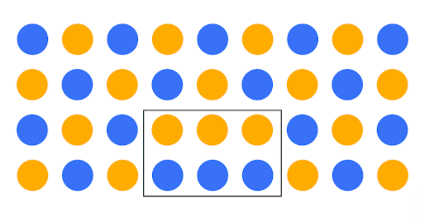

------------------------------------------------------------------------

```{python}
# include: false
import _setup
```

When you encounter a dataset that hasn't been cleaned, ​it can be really challenging. ​Data may at first seem structured, ​but it often can be hard to determine whether there ​are any data points that are ​measurably different from others. ​These extreme data observations, ​the ones that stand out from others, ​are known as outliers. **​Outliers are observations that ​are an abnormal distance from ​other values or an overall pattern in a data population**. ​In this lesson, we will discuss ​the three main types of outliers and why ​it is important for data professionals to ​identify them in the data we analyze. ​As a data professional, ​you should be fully aware of the beginnings and ends, ​highs and lows, ​and extreme points of your data ​across every variable in the dataset. ​These values will often be your outliers. ​It is essential that you recognize them, ​what their value is, and where they are. ​Otherwise, they will likely skew ​any conclusions you draw or models you build from them. ​There are three different types of outliers ​we will discuss in this lesson: global, ​contextual, and collective outliers. ​Later, you'll learn how to find ​outliers and work with them in Python. ​The first outliers will discuss ​tend to be the easiest data points to detect. \*\* Global Outliers\*\* ​Global outliers are values ​that are completely different from ​the overall data group and have ​no association with any other outliers. ​They may be inaccuracies, typographical errors, ​or just extreme values ​you typically don't see in a dataset. ​For example, if we had a set of human heights, ​1.7 meters, 1.9 meters, 1.6 meters, ​1.8 meters, 7.9 meters, ​1.8 meters, or 1.7 meters, ​the outlier is fairly obvious. ​Typically, global outliers should ​be thrown out to create a predictive model. ​Contextual outliers can be trickier to spot. **Contextual outliers** ​Contextual outliers are normal data points ​under certain conditions ​but become anomalies under most other conditions. ​As an example, movie sales are expected to ​be much larger when a film is first released. ​If there is a huge spike in sales a decade later, ​that would typically be considered ​abnormal or a contextual outlier. ​These outliers are more common in time-series data. ​Another example might be an outlier only in ​a specific single category of data. ​For instance, 2.5 meters may ​be a normal enough size for ​a category called mammal heights, ​but if the mammal is found out to be a mouse, ​we would likely consider this an outlier ​despite it fitting in with other mammal heights. ​Lastly, we have collective outliers. \*\* Collective Outliers\*\* ​Collective outliers are a group ​of abnormal points that follow ​similar patterns and are ​isolated from the rest of the population. ​Think of a parking lot at a store. ​It is not uncommon to have cars or scooters ​coming and leaving consistently ​during the hours a store is open, ​but to have a full parking lot ​after the store is closed would ​be considered a collective outlier. ​It could be that there is ​a company party or a local event nearby, ​which would explain the outlier of cars ​parked in the store parking lot after hours. ​One useful way to find ​these different types of outliers in our data ​is something we've already discussed ​quite a bit, visualization. ​It'll be easier to see any big dips or giant blips ​in the data when we plot it on ​a line graph or a bar chart. ​No matter how you discover that ​your data contains global, contextual, ​or collective outliers. ​It is essential that ​your EDA includes a strategy for dealing with them. ​ It will be up to you to decide how outliers need to be ​represented or whether they ​need to be removed completely. ​The decision on what to do must always be done in ​the context to the dataset ​and the business plan for the data. ​As mentioned in other lessons, ​always consider the ethical implications ​of any decision you make about outliers. ​When you're working as a data professional, ​it may be tempting to remove outliers to improve results, ​predictions or forecasts. ​But you will need to ask yourself, ​does that change the data story? ​For example, let's imagine that you are ​a data professional at a retail business. ​You review two years of ​sales data and find that there's one month ​where sales of a typically popular item ​are down dramatically. ​You might at first assume that there's ​a typo in the reported data, ​but as a diligent data professional, ​you ask questions about it. ​You discover that several top salespeople ​were on leave during that month and ​your company advertised a new product ​which slowed sales on the existing item. ​It is likely that both of ​these issues led to a drop in sales. ​Rather than dismissing the drop in sale as an outlier, ​this information will be helpful for the business team. ​Using this information, managers can prevent ​a future drop in sales numbers ahead ​of the product launches by ​hiring additional sales team members ​or limiting requested employee leave ​during those critical times. ​Later, you'll learn how to find ​outliers and work with them in Python.

# Protect the people behind the data

We’ve all been there…

Whether at work or at school, there’s a moment of realization about an essay or a project you’ve been working on—you suddenly realize you’ve made a mistake, and it needs to be fixed.

“But think of all of the trouble that will cause,” you think. “It will make the project late, and everyone will find out I made a mistake.”

Is it really worth the time and effort to stop the process and fix it?

For data professionals, the answer needs to always be YES.

The big picture Even seasoned data professionals can fail to see the big picture. As intuitive as our brains can be, we often fail to see how a small error, a tiny change, or a seemingly insignificant choice about data analysis can have significant implications on a process, a business, or even a whole population.

To help illustrate this, imagine a grid of alternating orange and blue circles. Now, imagine there is a person who can only see a small section of six circles. What if this person decides that it makes more sense for the circles to be arranged by groups, with orange circles on top and blue on bottom? You’ll find that even though the circles within the rectangle may be perceived as orderly, the reality is the change has actually disrupted the larger pattern. Now imagine the rectangle of six circles is a department and the bigger grid is an entire company.



Hopefully, this illustration helps you understand the importance of context and scope when dealing with data. One principle that can help data professionals keep data in context is ethics and developing an ethical mindset.

Here are three important concepts to help you foster an ethical mindset as you seek to tell stories with data:

-   Models have lives beyond code blocks and data strings.

-   Data science needs regulatory compliance.

-   Customers should choose how their data is used.

Models have lives beyond the code blocks and data strings There can be a tendency to think of data as strictly numbers and math. The reality is that data consists of people-driven inputs. Data professionals should never lose sight of the fact that analysis in all forms—visualizations, models, decisions, and strategies—impacts people.

The end goal of all data analysis and data science work should be to improve the lives of individuals and groups. Next time you are designing a data dashboard or coding a complex algorithm, take a moment to consider how the data might impact human beings, and whether the decisions you make alter that impact for the better. Remember that your own biases may prevent you from being able to anticipate many impacts, so gathering input from a diverse group of team members helps you mitigate your personal biases.

Here is a hypothetical data career example to help you see how this concept may someday impact your work:

Imagine a data professional is analyzing traffic flow data in order to help a city planner for a major metropolitan area decide where to focus on expanding roads. At first glance, using data for road construction appears to be a purely financial decision between a city and a road construction company. The professional’s analysis first led them to select a more hilly, uneven terrain as the most cost-effective place for the expansion of roads. But after analyzing the data with concern for the citizens and families who will be driving on those roads in all seasons, the data professional’s analysis determined the hilly area to have a higher accident risk, and decided to recommend a flatter location for road expansion.

Data science needs regulatory compliance If you are unfamiliar with the laws and regulations of the industry you work in, your job will not only be much more difficult, but also could land you in legal trouble. A data professional should always remain up to date and in compliance with all regulations in their particular field. As an example, when you begin a new job in the data career space, you can do the following:

-   Ask your manager for compliance guidance.

-   Take time to research the data governance policies.

-   Take time to research the regulatory body of your particular industry and its relevant policy documents.

Keep in mind that the data governance field is quite young and that regulations can and will change at a quick pace. Be sure to keep up with the changes!

It's important to follow the rules … but not just for rules’ sake. Here are a few important benefits of remaining compliant with regulatory bodies and data governance policies:

-   Keeps client and company data safe from security threats

-   Bolsters trust with clients, peer groups, companies, and public

-   Lessens likelihood of lost or mismanaged data

-   Ensures business critical data remains usable, accessible, and available

**Customers should choose how their data is used**

With each passing day, technology gets more advanced and capable. As data becomes increasingly involved in our day-to-day lives, it stands to reason the data itself becomes more and more important and valuable. Because of this, data privacy and security is critical to a company’s clients and a government’s citizens.

As data professionals, it is our ethical responsibility to treat client and customer data with respect and dignity. Companies that store, analyze, and utilize data as part of their business processes should make sure those processes are transparent and compliant. Customers who divulge confidential information in order to procure a service should be able to trust that the data will remain confidential and not compromised due to breaches or cyber security threats.

You’ll find that many companies have begun to treat customer data with more internal care and security. More companies are providing extensive employee training regarding the handling and securing of customer data. Many are adding multi-factor authentication systems and auditing their third-party vendors, requiring high levels of digital security systems and platforms.

As an example, because data breaches like Home Depot in 2014, Uber in 2017, and Instagram in 2020 have been commonplace for decades, corporations are increasingly ramping up cybersecurity, employee and vendor training, and transparency to customers and the public regarding data gathering and data use methods. Specifically, Home Depot has added data security into its risk management plan, and built a data security web page that describes what data they gather and how they use it.

Data transparency is not only good for business, it is the right thing to do—the ethical thing to do. Data professionals need to understand that more than anyone.

Key Takeaways Data ethics is an expanding field and remains an integral part of a data professional’s daily work. While manipulating, analyzing, or using data in any capacity, remember that data models have lives beyond code blocks and data strings. Data science needs regulatory compliance and customers should always get to choose how their data is used.

Resources for more information Data governance and data ethics are a growing field of work and study. Here are some resources should you like to learn more:

-   [Harvard Business School: 5 principles of Data Ethics for Business](https://online.hbs.edu/blog/post/data-ethics)

-   [Dataversity: Data Governance and Data Quality](https://www.dataversity.net/category/data-topics/data-governance/)

# Identify and deal with outliers in Python

​Earlier, you learned about three types of outliers, ​global, contextual, and collective. ​Now that we discussed outliers on a conceptual level, ​I'll show you how to identify them ​and analyze their impact in a Python notebook. ​Our goal will be to identify outliers across ​a 33-year span of ​total lightning strike counts in the United States. 

​​We'll continue using our NOAA lightening strike dataset. ​This time we'll group the total sum of ​the lightning strikes in ​the United States by year from 1987-2020. ​Let's first reveal the top 10 rows ​of data using the head function. 

```{python}
# Import statements
import pandas as pd
import numpy as np
import seaborn as sns
import datetime
from matplotlib import pyplot as plt
import plotly.express as px
df = pd.read_csv(r'Datasets/eda_outliers_dataset1.csv')
df.head()
```

​The dataset has two numeric columns, ​year and number of strikes. ​As you'll notice, we're dealing with ​some fairly large numbers ​for the lightening strike totals. ​It would be helpful to make them a bit ​shorter and easier to read in visualizations. ​To do that, let's write a readable numbers function. ​Below the function, there is ​a long explanatory text ​inside a triple set of quotation marks. ​This is called a documentation string or docstring. ​A documentation string or docstring is ​a line of text following a method or ​function that is used to explain to others using ​your code what this method or function does. 

```{python}
def readable_numbers(x):
    """takes a large number and formats it into K,M to make it more readable"""
    if x >= 1e6:
        s = '{:1.1f}M'.format(x*1e-6)
    else:
        s = '{:1.0f}K'.format(x*1e-3)
    return s

# Use the readable_numbers() function to create a new column 
df['number_of_strikes_readable']=df['number_of_strikes'].apply(readable_numbers)

df.head()

```

​A docstring represents ​good documentation practices in Python. ​It makes the code easier to understand and can be ​easily exported to create library documentation. ​A docstring was already provided ​for this readable numbers function. 

​Next we form an if else statement. ​We want to code any number above ​six digits to be formatted to one decimal place, ​followed by an M. Under the else statement we are ​formatting numbers with more than three digits ​to the same one decimal place, ​followed by the letter K. Under these statements, ​we define the new DataFrame we want ​titled number of strikes readable. 

​We then use the apply function ​to set our readable numbers ​statement to only the number ​of strikes column in the DataFrame. 

​Using the head function, ​we'll see the output of our newest code. 

​The new column has readable values of 15.6 million, ​209,000 and 44.6 million in its first three rows, ​where before they were ​just long strings of numeric digits. ​This indicates that we coded ​the read numbers function correctly. ​

Now that we have more readable values, ​let's plot our data. ​As you'll recall, our goal is to find any outliers among ​the total number of lightning strikes in ​33 years of NOAA data. ​One way to find any outliers would be to ​investigate the mean and median of this data. 

```{python}
print("Mean:" + readable_numbers(np.mean(df['number_of_strikes'])))
print("Median:" + readable_numbers(np.median(df['number_of_strikes'])))
```

​The mean is the average number of ​the given values and the median ​is the middle point of the given values. ​When we code for these two values, ​we use the numpy functions of mean and median. ​Were using the readable numbers for simplicity. ​The resulting output is the mean, ​26.8 million and the median 28.3 million. ​With the mean being two million ​strikes less than the median, ​we suspect the data distribution ​is likely skewed to the left. ​The left side of ​the distribution will be a good place to investigate. ​One effective way to visualize outliers is a boxplot. 

​As we discussed in a previous video, ​a boxplot divides the distribution of ​data points into four main quadrants or quartiles. ​The boxplot is helpful in visualizing ​and confirming the outliers we've already found. ​Let's plot the boxplot ​first and then we'll talk about it in more detail. 

​To design a boxplot using Python, ​we'll use the seaborne boxplot function. ​We'll use the number of strikes column from ​our DataFrame as the basis for the plot. ​Next, we'll use set x tick labels ​based on the readable numbers statement ​we created already. ​X tick labels simply allow us to give ​names to the x-axis marks ​so that they are read more easily. ​Lastly, we input the x and y labels, and the title. 

```{python}
# Create boxplot
box = sns.boxplot(x=df['number_of_strikes'])
g = plt.gca()
box.set_xticklabels(np.array([readable_numbers(x) for x in g.get_xticks()]))
plt.xlabel('Number of strikes')
plt.title('Yearly number of lightning strikes');
```

We are going to draw the same plot with plotly now.

```{python}

fig = px.box(
    df, 
    x='number_of_strikes', 
    points="outliers",       # Shows ALL points (regular data + outliers)
    width=600,
    height=350,
    title="Distribution of number of strikes"
);

# Keep the box blue while making ONLY the X markers red
fig.update_traces(
    fillcolor='#7f7fff',    # Box fill color
    line_color='blue',      # Whisker and box outline color
    marker=dict(
        symbol='x',
        size=8,
        color='red'          # Red ONLY for the outlier markers
    )
);

fig
```

​The blue rectangles in your boxplot are ​called the interquartile range. ​This range represents the difference between ​the third quartile and ​the first quartile of a set of data values. ​A standard rule statistics ​which you will learn more about another course is ​that any data point that falls beyond ​1.5 times the blue boxes are considered outliers. 

​What we're most focused on with our plot are that ​the two points beyond ​the far left of the line are below 10 million. ​This data visualization is showing us very ​clearly there are outliers ​included in our group of data points.  You'll notice that seaborn boxplot and plotly boxplot finds a different number of outliers.

​You'll recall that the purpose of a boxplot is to show ​the distribution of values ​separated into quadrants or quartiles. 

At their core, quantiles are cut points that divide an ordered dataset into equal-sized partitions, while percentiles are a specific type of quantile that splits data into 100 equal parts.

The Quantile Family "Quantile" is the overarching mathematical term. Depending on how many equal slices you divide your sorted data into, quantiles get specific names: - Percentiles (100 divisions): Split data into 100 equal parts ($1\%, 2\%, \dots, 99\%$). - Quartiles (4 divisions): Split data into 4 equal quarters ($25\%, 50\%, 75\%$). - Deciles (10 divisions): Split data into 10 equal tenths ($10\%, 20\%, \dots, 90\%$).

How Quantiles and Percentiles Relate

Quantiles are usually expressed as decimals ($0.0$ to $1.0$), whereas percentiles are expressed as percentages ($0\%$ to $100\%$).

They describe the exact same boundaries:

|  |  |  |
|------------------------|------------------------|------------------------|
| **Quantile (Decimal)** | **Percentile Equivalent** | **Common Name in Statistics / Boxplots** |
| **0.25** | **25th Percentile** | $Q1$ (Lower Quartile) — 25% of data falls below this point |
| **0.50** | **50th Percentile** | $Q2$ (Median) — 50% of data falls below this point |
| **0.75** | **75th Percentile** | $Q3$ (Upper Quartile) — 75% of data falls below this point |

**Intuition: What does a percentile mean?**

If a specific year's lightning strike total sits at the **80th percentile**, it means **80% of all recorded years had fewer (or equal) strikes**, while only **20% of years had more**.

**How Quantiles Control Boxplot Outliers**

Boxplots rely entirely on quartiles ($Q1$, $Q2$, $Q3$) to define normal boundaries and identify outliers:

1.  **The Box (**$\text{IQR}$): The box spans from $Q1$ to $Q3$. The height of the box is the Interquartile Range:

    $$\text{IQR} = Q3 - Q1$$

    This box holds the middle $50\%$ of your data.

2.  **The Whiskers (Fences):** Boundaries are extended $1.5 \times \text{IQR}$ above $Q3$ and below $Q1$:

    $$\text{Lower Fence} = Q1 - (1.5 \times \text{IQR})$$

    $$\text{Upper Fence} = Q3 + (1.5 \times \text{IQR})$$

3.  **Outliers:** Any data point outside these fence limits gets plotted as an individual point/outlier.

**Why Different Software Calculates Quantiles Differently**

If you have 100 data points, finding the 25th point is easy. But if you have 31 points (like 31 years of lightning data), $25\%$ of 31 is $7.75$. There is no "7.75th" row in your dataset!

To estimate the value at index $7.75$, libraries must **interpolate** between the 7th and 8th rows:

-   **NumPy / Pandas** uses linear interpolation by default ($0.75 \times \text{row}_8 + 0.25 \times \text{row}_7$).

-   **Plotly / R / Excel** use slightly different weighted fraction formulas.

Because $Q1$ changes slightly between tools, the calculated **Lower Fence** moves up or down by a tiny margin—which is why borderline values (like 7.4M) get flagged as an outlier in Pandas/Seaborn, but fall inside the fence in Plotly.

That 1987 value of 7.4M sits right on the ragged edge of the lower boundary.

​This next piece of code will help ​us define what value is at ​1.5 times below our interquartile range.  ​We'll use the quantile function to define what we'll call ​percentile 25 and percentile 75. 

​We enter our data column, ​number of strikes for our DataFrame, ​and then 0.25, ​and 0.75 in the argument fields. ​The values that occur between ​the 75th and 25th percentile are the interquartile range. ​We create a statement for interquartile range, IQR, ​defining percentile 75 minus ​percentile 25 is equal to IQR. 

```{python}
# Calculate 25th percentile of annual strikes
percentile25 = df['number_of_strikes'].quantile(0.25)

# Calculate 75th percentile of annual strikes
percentile75 = df['number_of_strikes'].quantile(0.75)

# Calculate interquartile range
iqr = percentile75 - percentile25

```

​Now, let's define two statements; ​upper limit and lower limit. 

-   ​Upper limit is equal to percentile 75 plus 1.5 times IQR. 
-   ​Lower limit is percentile 25 minus 1.5 times the IQR. 

​Lastly, let's have Python ​provide the exact value of the lower limit. ​We'll input print, followed by the text. 

​Don't worry if you're still trying ​to understand interquartile range. ​This concept will be explored ​further in depth later in the program. 

```{python}
# Calculate upper and lower thresholds for outliers
upper_limit = percentile75 + 1.5 * iqr
lower_limit = percentile25 - 1.5 * iqr

print('Lower limit is: '+ readable_numbers(lower_limit))
```

​Next, let's plot the values that lie ​below our lower limit of 8.6 million. 

```{python}
# Isolate outliers on low end
df[df['number_of_strikes'] < lower_limit]
```

​Now here are the outliers. 

​One great way of seeing these outliers in relation to ​the rest of the data points is a data visualization. ​For this plot, let's do a scatter plot. ​You may recall that ​a scatter plot represents relationships between ​different variables with individual data points ​without a connecting line. 

​To start the scatter plot, ​let's first add labels to each point on the plot. ​​The resulting plot shows us the years 1987 and ​2019 are the two values in red or two outliers. 

​Note, I have changed the plot from the one in the lesson to plotly because this one's code is much more readable

```{python}

# 1. Prepare data columns for text labels and colors
df['label'] = df['number_of_strikes'].apply(readable_numbers)
df['category'] = np.where(df['number_of_strikes'] < lower_limit, 'Low Outlier', 'Normal')

# 2. Build the interactive scatter plot
fig = px.scatter(
    df,
    x='year',
    y='number_of_strikes',
    color='category',
    color_discrete_map={'Low Outlier': 'red', 'Normal': 'blue'},
    text='label',
    title='Number of lightning strikes by year',
    labels={'year': 'Year', 'number_of_strikes': 'Number of strikes'},
    width=800,
    height=500
);

# 3. Put text labels above markers and customize point size
fig.update_traces(
    textposition='top center',
    marker=dict(size=7)
);

fig
```

Now that we've narrowed our scope of the outliers to just ​two years,1987 and 2019, ​we can do a little more investigating. ​Let's start with the 2019 lightning strike data. ​If we import just the 2019 data, ​the first thing we'll want to do, ​as we learned in a previous video is ​convert our date column to date-time. 

```{python}
df_2019 = pd.read_csv(r'Datasets/eda_outliers_dataset2.csv')
df_2019.head()
```

​Next, we'll create some new columns in ​our dataframe month and month text. ​You'll notice for the date, ​we use the str.slice function to ​cut the month names down to just the first three letters.

​Finally, we create a dataframe that ​groups the total number ​of lightning strikes for each month. ​

```{python}
# Convert `date` column to datetime
df_2019['date']= pd.to_datetime(df_2019['date'])

# Create 2 new columns
df_2019['month'] = df_2019['date'].dt.month
df_2019['month_txt'] = df_2019['date'].dt.month_name().str.slice(stop=3)

# Group by `month` and `month_txt`, sum it, and sort. Assign result to new df
df_2019_by_month = (df_2019.groupby(['month','month_txt'])
                    .sum(numeric_only=True)
                    .sort_values('month', ascending=True)
                    .head(12)
                    .reset_index())
df_2019_by_month
```

The result explains why the year is an outlier. ​For the 2019 dataset ​only lightning strikes from ​the month of December had been inputted. ​If you were a data professional tasked with ​calculating lightening strike risk, ​you would first research ​the NOAA documentation available ​to see if there's a reason given. ​If you don't find anything based on your research, ​you would then ask the NOAA why lightning strikes ​haven't been recorded for the other 11 months of 2019. 

Let's do the same with 1987

```{python}
# Read in 1987 data
df_1987 = pd.read_csv(r'Datasets/eda_outliers_dataset3.csv')

# Convert `date` column to datetime
df_1987['date'] = pd.to_datetime(df_1987['date'])

# Create 2 new columns
df_1987['month'] = df_1987['date'].dt.month
df_1987['month_txt'] = df_1987['date'].dt.month_name().str.slice(stop=3)

# Group by `month` and `month_txt`, sum it, and sort. Assign result to new df
df_1987_by_month = (df_1987.groupby(['month','month_txt'])
                    .sum(numeric_only=True)
                    .sort_values('month', ascending=True)
                    .head(12)
                    .reset_index());
df_1987_by_month
```

​This difference: that 2019 ​does not have data for all months, ​and that 1987 does have data for all months, ​helps us to know how to handle these two outliers. 

​For 2019, it would make sense ​to exclude it from our analysis. ​As for 1987, we recognize that it ​is indeed an outlier but it should not ​be excluded from our analysis because it does have ​lightening strike totals included ​for each month of the year. ​

Now, before we end, let's return to ​the mean and median values that we calculated earlier. ​First, let's create a new data-frame, ​including only data points that ​exclude the outliers we identified.

​Our goal here is to show the mean and ​median of the dataset excluding the outliers. ​To do this, we'll use a data-frame ​without outliers we just created ​and our readable numbers statement to only ​include data points that are ​greater than our lower limit. 

```{python}
# Create new df that removes outliers
df_without_outliers = df[df['number_of_strikes'] >= lower_limit]

# Recalculate mean and median values on data without outliers
print("Mean:" + readable_numbers(np.mean(df_without_outliers['number_of_strikes'])))
print("Median:" + readable_numbers(np.median(df_without_outliers['number_of_strikes'])))
```

​When we exclude those outliers, ​the mean and median are much closer together, ​suggesting a fairly evenly distributed dataset. 

Now, let's revisit the goal we set ​earlier: to identify outliers ​across the 33-year span of ​total lightning strike counts in the United States. ​We discussed a lot of ​new concept and we achieved this goal.

## Other options for managing the outliers

Next, you’ll consider reassigning outliers by deriving new values that are a better fit for the dataset.

Instead of deleting outliers, you can always reassign them, that is, change the values to ones that fit within the general distribution of the dataset. There are two common ways to do this, but many different ways can be used, depending on your use case:

**1. Create a floor and ceiling at a quantile:** For example, you could place walls at the 90th and 10th percentile of the distribution of data values. Any value above the 90% mark or below the 10% mark are changed to fit within the walls you set. Here is an example of what that code might look like:

```{python}
# Calculate 10th percentile
tenth_percentile = np.percentile(df['number_of_strikes'], 10)

# Calculate 90th percentile
ninetieth_percentile = np.percentile(df['number_of_strikes'], 90)

# Apply lambda function to replace outliers with thresholds defined above
df['number_of_strikes'] = df['number_of_strikes'].apply(lambda x: (
    tenth_percentile if x < tenth_percentile 
    else ninetieth_percentile if x > ninetieth_percentile 
    else x))
```

**2. Impute the average:** In some cases, it might be best to reassign all outlier values to match the median or mean value. This will ensure that your median and distribution are based solely on the non-outlier values, leaving the original outliers excluded. The actual imputation or reassigning of values can be pretty simple if you’ve already found the outliers. The following code block calculates the median of the values greater than the lower limit. Then it imputes the median where values are lower than the lower limit.

```{python}
# Calculate median of all NON-OUTLIER values
median = np.median(df['number_of_strikes'][df['number_of_strikes'] >= lower_limit])

# Impute the median for all values < lower_limit
df['number_of_strikes'] = np.where(df['number_of_strikes'] < lower_limit, median, df['number_of_strikes'])
```

**Note:** Outside of EDA, machine learning and regression modeling have more complex variations on dealing with outliers. You will learn more about those topics later.

## Key Takeaways

After detecting the outliers in a dataset, it is essential that you determine a strategy for how to handle them. Because every dataset and data-based problem is different, your strategy will vary. For the most part, you will be choosing between deleting, reassigning, or leaving outliers.

------------------------------------------------------------------------

# Reference guide: outliers

The following tools are helpful when dealing with outliers in a dataset.

### [**df.describe()**](https://pandas.pydata.org/docs/reference/api/pandas.DataFrame.describe.html "Link to pandas documentation for describe method")

-   **Description:** A **DataFrame** method that returns general statistics about the dataframe which can help determine outliers

    ```{python}
    data = {
        'planet': [
            'Mercury',
            'Venus',
            'Earth',
            'Mars',
            'Jupiter',
            'Saturn',
            'Uranus',
            'Neptune',
        ],
        'radius_km': [2440, 6052, 6371, 3390, 69911, 58232, 25362, 24622],
        'moons': [0, 0, 1, 2, 80, 83, 27, 14],
    }

    df = pd.DataFrame(data)
    df.describe()
    ```

### [**sns.boxplot()**](https://seaborn.pydata.org/generated/seaborn.boxplot.html "Link to seaborn documentation for boxplot function")

-   **Description:** A seaborn function that generates a box plot. Data points beyond 1.5x the interquartile range are considered outliers.