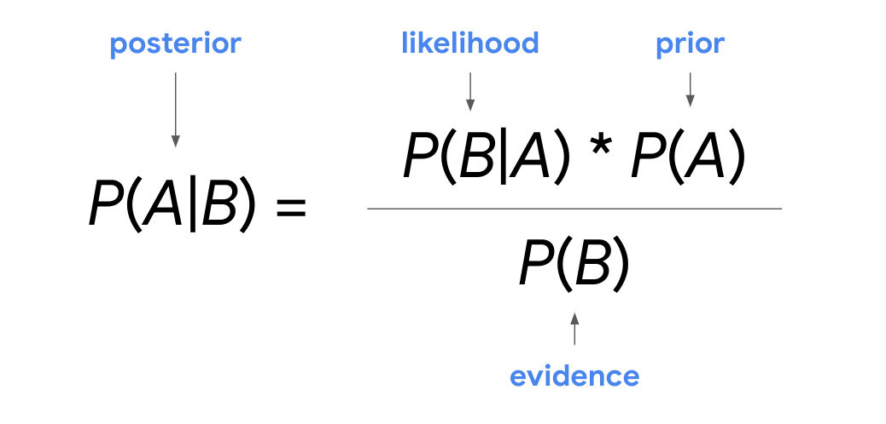

I really enjoyed exploring descriptive statistics with you and I'm excited for ​what's next: probability.

Probability is the branch of mathematics that ​deals with measuring and quantifying uncertainty. ​In other words, ​probability uses math to describe the likelihood of something happening. ​For example, the chance of rain tomorrow or of winning the lottery.

​Data professionals use probability to help business leaders make data driven ​decisions in situations of uncertainty. ​No one can know the outcome of future events with complete certainty.

​What data professionals can do is use all the available data to make reasonable ​predictions based on probability. ​For instance, ​imagine you're working with the stakeholder at a large aerospace company. ​They need to decide whether or not to invest in a new technology to improve ​the production process for their jet engines. ​As a data professional, you can estimate the probability that the new technology ​will have a positive impact and predict what its potential costs and ​benefits might be. ​The stakeholder can use this information to make an informed decision about what's ​best for the organization.

​We'll start by reviewing the two main types of probability: objective and ​subjective. We'll cover basic rules of probability, ​like the complement rule, the addition rule and the multiplication rule.

​Then we'll go over conditional probability and ​how to describe the relationship between dependent events. ​We'll check out Bayes' theorem, a key formula for conditional probability and ​the basis for more advanced Bayesian analysis. ​You'll also learn about probability distributions.

Probability distributions ​describe the likelihood of the possible outcomes of a random event and ​can be discrete or continuous. ​We'll check out discrete probability distributions such as the binomial and ​Poisson and find out how they can help you model specific kinds of data. ​Then we will explore continuous probability distributions and focus on ​the normal distribution, the most widely used distribution in all statistics. ​You'll discover its main features and how it applies to many different data sets.

​Next, we'll also discuss how z-scores can help you better understand ​the relationship between data values in a standard normal distribution. ​Finally, you learn how to use Python's SciPy stats module to apply ​probability distribution to your data. ​When you're ready to start learning about probability, ​join me in the next video.

------------------------------------------------------------------------

# Objective versus subjective probability

Probability helps you measure and quantify ​uncertainty and make ​informed decisions about uncertain outcomes. ​

For example, you might use ​probability to decide what to wear on a given day. ​Today's weather forecast says there's ​a 70 percent chance of snow. ​Based on this data, you decide to wear your hat, ​gloves, and snow boots. ​When the snow falls, you stay warm and dry. ​

Data professionals might use ​probability to predict the chances ​that a company will sell ​a certain amount of product in a given time period, ​a financial investment will have a positive return, ​a political candidate will win an election, ​or a medical test will be accurate.

​In this video, we'll explore ​the two main types of ​probability: objective and subjective. ​

**Objective probability** is based on statistics, ​experiments, and mathematical measurements. ​

**Subjective probability** is based on ​personal feelings, experience, or judgment.

​Let's start with objective probability. ​Data professionals use objective probability ​to analyze and interpret data. ​There are two types of objective probability: ​classical and empirical. ​

**Classical probability** is based on formal reasoning ​about events with equally likely outcomes. ​To calculate classical probability for an event, ​you divide the number of desired outcomes ​by the total number of possible outcomes. ​For example, if you flip a coin, ​the result will be either heads or tails. ​Heads and tails are terms commonly used to ​refer the two sides of the coin. ​There are only two possible outcomes, ​and both outcomes are equally likely. ​The chance that you get heads ​is one out of two or 50 percent, ​the same goes for tails. ​Or take playing cards. ​There are 52 cards in a standard deck. ​Choosing a card gives you a one-in-52 chance, ​or 1.9 percent of getting any card in the deck, ​whether it's the ace of hearts, ​10 of clubs, or four of spades. ​

But most events are more complex and ​do not have equally likely outcomes. ​Usually, the weather isn't ​a 50 percent chance of rain or snow, ​there might be an 80 percent chance of rain ​tomorrow and a 20 percent chance of some other outcome.

​While classical probability applies to ​events with equally likely outcomes, ​data professionals use empirical probability ​to describe more complex events. ​

**Empirical probability is based on ​experimental or historical data**; ​it represents the likelihood ​of an event occurring based on ​the previous results of an experiment or past events. ​To calculate empirical probability, ​you divide the number of times a specific ​event occurs by the total number of events. ​For example, say you conduct ​a taste test with 100 people to ​find out whether they prefer strawberry ​or mint chip-flavored ice cream. ​You want to know the probability that ​a person prefers strawberry ice cream. ​Your taste test reveals that ​80 people prefer strawberry ice cream. ​To calculate probability, you divide the number of times ​the event of preferring strawberry ice cream occurs, ​80, by the total number of events, 100. ​80 divided by 100 equals 0.8 or 80 percent. ​So the probability that a person prefers ​strawberry over mint chip is 80 percent. ​

Earlier, you learned about ​inferential statistics and how data professionals use ​sample data to make inferences ​or predictions about larger populations. ​Inferential statistics uses probability too. ​For instance, a retail company ​might survey a representative sample of ​100 customers to predict ​the shopping preferences of all their customers. ​

Data professionals rely on empirical probability to ​help them make accurate predictions based on sample data. ​For example, in an A/B test of a website, ​you test a sample of users to make ​a prediction about the future behavior of all users. ​Say the sample of users prefer ​a green add-to-cart button over a blue one. ​You may infer from this data ​that the larger population of ​future users will probably share their preference. ​An A/B test lets you make ​a reasonable prediction about ​future users based on empirical probability. ​This probability can help an online business ​make smarter decisions and increase sales.

​In contrast, the results of ​subjective probability are based on ​personal feeling, experience, or judgment. ​This type of probability does ​not involve formal calculations, ​statistical analysis, or scientific experiments. ​For instance, you may have ​an overwhelming feeling that ​a certain horse will win a horse race, ​or that your favorite team will ​win the championship game. ​You may have good reasons for your belief, ​but your reasons are personal or subjective. ​Your belief is not based on ​statistical analysis or scientific experiments. ​For this reason, the subjective probability of ​an event may differ widely from person to person. ​It's important to know the difference between ​subjective and objective probability when ​you evaluate a prediction or make a decision. ​For example, the CEO of ​an auto company might feel confident that using ​a new technology to manufacture their pickup truck ​will cut costs and increase profits. ​But if their prediction is only based on ​personal feeling or subjective probability, ​it may not be reliable. ​Data science based on ​statistical analysis or objective probability can help ​accurately predict the potential impact of ​the new technology and help the CEO make an informed, ​data-driven decision about adopting the technology. ​That's all for now. Coming up, ​we'll check out some fundamental concepts of probability.

------------------------------------------------------------------------

# The principles of probability

Recently, you learned that ​probability uses math to deal with ​uncertainty or to determine ​how likely it is that an event will occur. ​In this video, you'll learn ​some fundamental concepts of probability. ​We'll discuss the mathematical definition of ​probability and how to calculate ​probability for single random events. ​First, I want to give you some context ​about the types of examples we'll be using. ​In this part of the course, ​we're going to continue to reference ​examples of events like flipping coins, ​rolling dice, and drawing cards. ​There are a couple of reasons for this. ​One is historical. 

​The modern theory of probability ​originates in the analysis of games, ​of chance in the 16th and 17th centuries. ​Second, and more importantly, ​these are events with clearly defined outcomes ​that most people are familiar with. ​They're just super useful examples ​of basic probability concepts. ​That's why they're used in stats ​classes around the world. ​Later on in the course, ​we will explore probability of ​for more complex events ​like the ones you'll encounter in ​your future work as a data professional. ​Let's talk about the fundamental concepts of probability. ​

First, the probability that an event will ​occur is expressed as a number between 0 and 1. 

​If the probability of an event equals zero, ​there's a zero percent chance that the event will occur. ​If the probability of an event equals one, ​there's a 100 percent chance that the event will occur. ​There are lots of possibilities in between 0 and 1. ​If the probability of an event equals 0.5, ​there is a 50 percent chance that ​the event will occur or not occur. ​If the probability of an event is close to zero, ​there's a small chance that the event will occur. ​If the probability of an event is close to one, ​there's a strong chance that the event will occur. ​For example, the chance ​of a stock price going up this year ​is 0.05 or five percent, ​then you probably don't want to buy it. 

​If it's 0.95 or 95 percent, ​then it's probably a good investment. ​Probability measures the likelihood of random events. ​The result of a random event ​cannot be predicted with certainty. ​Before flipping a coin or rolling a die, ​you do not know the outcome. ​The coin could turn up heads or tails, ​and a die could show any number one through six. ​These are examples of what ​statisticians call a random experiment, ​also known as a statistical experiment. 

​**A random experiment is a process ​whose outcome cannot be predicted with certainty.** ​All random experiments have three things in common. ​

-   The experiment can have more than one possible outcome, 

-   ​you can represent each possible outcome in advance, ​

-   and the outcome of the experiment depends on chance. 

​Let's take the example of flipping a coin. ​There's more than one possible outcome. ​You can represent each possible outcome ​and advance heads or tails, ​and the outcome depends on chance. ​Until you actually toss the coin, ​you can't know whether it will be heads or tails, ​or think about rolling a six-sided die. ​There's more than one possible outcome, ​and all outcomes can be represented in advance, ​1, 2, 3, ​4, 5, and 6. 

​The outcome of any roll depends on chance. ​Until you roll the die, ​you can't know which number will turn up. ​To calculate the probability of a random experiment, ​you divide the number of desired outcomes ​by the total number of possible outcomes. ​You may recall that this is also ​the formula for classical probability. 

​The probability of tossing ​a coin and getting heads is one chance in two. ​This is 1 divided 2 equals 0.5 or 50 percent. ​

The probability of rolling a die and getting two, ​is one chance out of six, ​this is 1 divided 6 equals ​0.166 repeating or about 16.7 percent. 

​Now, let's conduct a different random experiment. ​Imagine a jar contains 10 marbles, ​two marbles are red, ​three are green, and five are blue. ​You decide to take one marble from the jar. ​You want to know the probability ​that the marble will be green. ​First, count the number of possible outcomes. ​You have an equal chance of choosing ​any one of the 10 marbles. ​Next, figure out how many of ​these outcomes refer to what you want to know. 

​The chance of choosing a green marble. ​Of the 10 total marbles, three are green. ​Therefore, the probability of choosing ​a green marble is 3 out of 10, or 0.3. ​In other words, you have a 30 percent chance ​of choosing a green marble. ​Now you know how to calculate ​the probability of a single random event. ​This knowledge will be useful as ​a building block for more ​complex calculations of probability. 

------------------------------------------------------------------------

# Fundamental concepts of probability

Recently, you learned that **probability** uses math to quantify uncertainty, or to describe the likelihood of something happening. For example, there might be an 80% chance of rain tomorrow, or a 20% chance that a certain candidate wins an election.

In this reading, you’ll learn more about fundamental concepts of probability. We’ll discuss the concept of a random experiment, how to represent and calculate the probability of an event, and basic probability notation. 

## Probability fundamentals 

### **Foundational concepts: Random experiment, outcome, event**

Let’s begin with three concepts at the foundation of probability theory: 

-   Random experiment

-   Outcome 

-   Event 

Probability deals with what statisticians call random experiments, also known as statistical experiments. A **random experiment** is a process whose outcome cannot be predicted with certainty. 

For example, before tossing a coin or rolling a die, you can’t know the result of the toss or the roll. The result of the coin toss might be heads or tails. The result of the die roll might be 3 or 6.  

All random experiments have three things in common:

-   The experiment can have more than one possible outcome.

-   You can represent each possible outcome in advance.

-   The outcome of the experiment depends on chance.

In statistics, the result of a random experiment is called an outcome. For example, if you roll a die, there are six possible outcomes: 1, 2, 3, 4, 5, 6. 

An event is a set of one or more outcomes. Using the example of rolling a die, an event might be rolling an even number. The event of rolling an even number consists of the outcomes 2, 4, 6. Or, the event of rolling an odd number consists of the outcomes 1, 3, 5.

In a random experiment, an event is assigned a probability. Let’s explore how to represent and calculate the probability of a random event. 

### **The probability of an event**

The probability that an event will occur is expressed as a number between 0 and 1. Probability can also be expressed as a percent. 

-   If the probability of an event equals 0, there is a 0% chance that the event will occur. 

-   If the probability of an event equals 1, there is a 100% chance that the event will occur. 

There are different degrees of probability between 0 and 1. If the probability of an event is close to zero, say 0.05 or 5%, there is a small chance that the event will occur. If the probability of an event is close to 1, say 0.95 or 95%, there is a strong chance that the event will occur. If the probability of an event equals 0.5, there is a 50% chance that the event will occur—or not occur.

Knowing the probability of an event can help you make informed decisions in situations of uncertainty. For example, if the chance of rain tomorrow is 0.1 or 10%, you can feel confident about your plans for an outdoor picnic. However, if the chance of rain is 0.9 or 90%, you may want to think about rescheduling your picnic for another day. 

### **Calculate the probability of an event**

To calculate the probability of an event in which all possible outcomes are equally likely, you divide the number of desired outcomes by the total number of possible outcomes. You may recall that this is also the formula for classical probability:

*\# of desired outcomes* ÷ *total \# of possible outcomes*

Let’s explore the coin toss and die roll examples to get a better idea of how to calculate the probability of a single random event. 

#### **Example: Coin toss**

Tossing a fair coin is a classic example of a random experiment: 

-   There is more than one possible outcome. 

-   You can represent each possible outcome in advance: heads or tails. 

-   The outcome depends on chance. The toss could turn up heads or tails.  

Say you want to calculate the probability of getting heads on a single toss. For any given coin toss, the probability of getting heads is one chance out of two. This is 1 ÷ 2 = 0.5, or 50%.

Now imagine that you were to toss a specially designed coin that had heads on both sides. Every time you toss this coin it will turn up heads. In this case, the probability of getting heads is 100%. The probability of getting tails is 0%.  

Note that when you say the probability of getting heads is 50%, you aren’t claiming that any actual sequence of coin tosses will result in exactly 50% heads. For example, if you toss a fair coin ten times, you may get 4 heads and 6 tails, or 7 heads and 3 tails. However, if you continue to toss the coin, you can expect the long-run frequency of heads to get closer and closer to 50%. 

#### **Example: Die roll**

Rolling a six-sided die is another classic example of a random experiment: 

-   There is more than one possible outcome. 

-   You can represent all possible outcomes in advance: 1, 2, 3, 4, 5, and 6.

-   The outcome depends on chance. The roll could turn up any number 1–6. 

Say you want to calculate the probability of rolling a 3. For any given die roll, the probability of rolling a 3 is one chance out of six. This is 1 ÷ 6 = 0.1666, or about 16.7%.

### **Probability notation**

It helps to be familiar with probability notation as it’s often used to symbolize concepts in educational and technical contexts. 

In notation, the letter P indicates the probability of an event. The letters A and B represent individual events. 

For example, if you’re dealing with two events, you can label one event A and the other event B. 

-   The probability of event A is written as P(A). 

-   The probability of event B is written as P(B).

-   For any event A, 0 ≤ P(A) ≤ 1. In other words, the probability of any event A is always between 0 and 1. 

-   If P(A) \> P(B), then event A has a higher chance of occurring than event B.

-   If P(A) = P(B), then event A and event B are equally likely to occur.

## Key takeaways 

Data professionals use probability to help stakeholders make informed decisions about uncertain events. Your knowledge of fundamental concepts of probability will be useful as a building block for more complex calculations of probability. 

## Resources for more information

To learn more about fundamental concepts of probability, refer to the following resources: 

-   These [lecture notes from Richland Community College](https://people.richland.edu/james/lecture/m116/sequences/probability.html) provide a useful summary of the fundamental concepts and basic rules of probability. 

------------------------------------------------------------------------

# The basic rules of probability and events

So far, we've been focusing on ​calculating the probability of single events. ​Many situations, both in ​everyday life and in data analytics, ​involve more than one event. ​As a future data professional, ​you'll often deal with probability for multiple events. ​In this video, we'll cover ​three basic rules of probability: ​the complement rule, the addition rule, ​and the multiplication rule. ​These rules help you better understand ​the probability of multiple events. ​We'll also discuss two different types of events: ​mutually exclusive events and independent events. ​Then you'll learn how to calculate ​probability for each of them. 

​First, let's discuss probability notation, ​which is the standard way to ​symbolize probability concepts. ​As we go along, I'll share ​some useful notations that will ​help us communicate more efficiently ​when it comes to basic probability. ​

The letter P indicates the probability of an event. ​For example, if you're dealing with two events, ​you can label one event A, ​and the other event B. ​The notation for the probability of event A is P(A). ​For the probability of event B, ​P(B), followed ​by the letter B in parenthesis. ​If you want to talk about the probability ​of event A not occurring, ​add an apostrophe after the letter A. P('A). ​You can also say this is the probability of not A.

​Now, let's check out our first basic rule, **​the complement rule**. 

​In stats, **the complement of ​an event is the event not occurring**. ​For example, either it rains ​or it does not rain. ​Either you win the lottery ​or you don't win the lottery. ​The complement of rain is no rain. ​The complement of winning is not winning. 

​The important thing to note ​is that **the two probabilities, ​the probability of an event happening and ​the probability of it not happening, ​must add to one**. ​Recall that a probability of one is the same as saying ​there's 100 percent certainty of an event occurring. ​Another way to think about it is that there is ​a 100 percent chance of ​one event or the other event happening. ​There may be a 30 percent chance of rain tomorrow, ​but there is a 100 percent chance that it will ​either rain or not rain tomorrow. ​

The complement rule says that ​the probability that event A does ​not occur is 1 minus the probability of event A. P('A)=1-P(A)​

For example, if the weather forecast ​says there's a 30 percent chance of rain tomorrow, ​there's a probability of 0.3. ​You can use the complement rule to ​calculate the probability that it does not rain tomorrow. ​The probability of no rain equals ​1 minus the probability of rain. ​This is 1 minus 0.3 equals 0.7 or 70 percent. 

​But the complement rule and our next rule, ​the addition rule, applied ​two events that are mutually exclusive. **​Two events are mutually exclusive ​if they cannot occur at the same time**. ​For example, you can't visit ​both Argentina and China at the same time, ​or turn left and right at the same time. **​The addition rule says that if ​the events A and B are mutually exclusive, ​then the probability of A or B happening is ​the sum of the probabilities of A and B**. ​Let's check out an example using a six-sided die. 

​Say you want to find out the probability of rolling ​either a two or a four on a single roll of the die. ​These two events are mutually exclusive. ​You can roll a two or a four, ​but not both at the same time. ​

**The addition rule says that to find ​the probability of either event happening, ​you should sum up their probabilities.** ​The odds of rolling any single number on a six-sided die ​are 1/6. ​The probability of rolling a two is 1/6, ​and the probability of rolling a four is 1/6. 

$$
\begin{gathered}
P(A\ or\ B) = P(A) + P(B) \\
P(\text{rolling a 2 or a 4}) = \frac{1}{6} +\frac{1}{6} = \frac{1}{3} 
\end{gathered}
$$

The probability of rolling either a two or a four ​is 1/3 or 33 percent. 

​The addition rule applies to mutually exclusive events. ​\
If you want to calculate ​probability for independent events, ​you can use the multiplication rule. ​**Two events are independent if the occurrence of ​one event does not change ​the probability of the other event.** ​This means that one event does not ​affect the outcome of the other event. ​For example, checking out a book from ​your local library does not affect tomorrow's weather. ​Drinking coffee in the morning does not ​affect the delivery of your mail in the afternoon. ​These events are separate and independent. 

**​The multiplication rule says that if ​the events A and B are independent, ​then the probability of both A and B happening is ​the probability of A multiplied by the probability of B.** 

​For instance, imagine two consecutive tosses. ​Say you want to know the probability of tails on ​the first toss and heads on the second toss. ​First, figure out what events you're dealing ​with and then apply the appropriate rule. ​Two coin tosses are independent events. ​The first toss does not ​affect the outcome of the second toss. ​For any toss, the probability of getting either heads or ​tails always remains 1/2 or 50 percent. 

​You would use the multiplication rule for this event. ​The probability of getting tails and ​heads is the probability of getting tails, ​multiply it by the probability of getting heads. 

$$
\begin{gathered}
P(A\ or\ B) = P(A) + P(B)\\
P(\text{tossing heads and then tails}) = \frac{1}{2} \times \frac{1}{2} = \frac{1}{4} = 0.25
\end{gathered}
$$

​The probability of each event is 0.5 or 50 percent. ​Now, plug in the numbers, 0.5 times ​0.5 equals 0.25 or 25 percent. ​The probability of getting tails on the first toss and ​heads on the second toss is 25 percent. ​

To recap, let's compare the addition and ​multiplication rules and list their differences. ​It will be helpful to keep these differences in mind, ​so you know when to use the two rules. 

​The addition rule sums up the probabilities of events, ​and the multiplication rule multiplies the probabilities. ​The addition rule applies to events ​that are mutually exclusive. ​The multiplication rule applies to ​events that are independent. ​The basic rules of probability help you describe ​events that are mutually exclusive or independent. ​In an upcoming video, ​we'll check out conditional probability, ​which applies to dependent events. 

------------------------------------------------------------------------

So far, you’ve been learning about calculating the probability of single events. Many situations, both in daily life and in data work, involve more than one event. As a future data professional, you’ll often deal with probability for multiple events. 

In this reading, you’ll learn more about multiple events. You’ll learn three basic rules of probability: the complement rule, the addition rule, and the multiplication rule. These rules help you better understand the probability of multiple events. First, we’ll discuss two different types of events that these rules apply to: mutually exclusive and independent. Then, you’ll learn how to calculate probability for both types of events.  

## Two types of events 

The three basic rules of probability apply to different types of events. Both the complement rule and the addition rule apply to events that are mutually exclusive. The multiplication rule applies to independent events. 

### **Mutually exclusive events**

Two events are **mutually exclusive** if they cannot occur at the same time. 

For example, you can’t be on the Earth and on the moon at the same time, or be sitting down and standing up at the same time. 

Or, take two classic examples of probability theory. If you toss a coin, you cannot get heads and tails at the same time. If you roll a die, you cannot get a 2 and a 4 at the same time. 

### **Independent events**

Two events are **independent** if the occurrence of one event does not change the probability of the other event. This means that one event does not affect the outcome of the other event. 

For example, watching a movie in the morning does not affect the weather in the afternoon. Listening to music on the radio does not affect the delivery of your new refrigerator. These events are separate and independent. 

Or, take two consecutive coin tosses or two consecutive die rolls. Getting heads on the first toss does not affect the outcome of the second toss. For any given coin toss, the probability of any outcome is always 1 out of 2, or 50%. Getting a 2 on the first roll does not affect the outcome of the second roll. For any given die roll, the probability of any outcome is always 1 out of 6, or 16.7%.

## Three basic rules  

Now that you know more about the difference between mutually exclusive and independent events, let’s review three basic rules of probability:

-   Complement rule 

-   Addition rule 

-   Multiplication rule

### **Complement rule**

The complement rule deals with mutually exclusive events. In statistics, the complement of an event is the event not occurring. For example, either it snows or it does not snow. Either your soccer team wins the championship or it does not win the championship. The complement of snow is no snow. The complement of winning is not winning.

The probability of an event occurring and the probability of it not occurring must add up to 1. Recall that a probability of 1 is the same as a 100%.

Another way to think about it is that there is a 100% chance of one event or the other event occurring. There may be a 40% chance of snow tomorrow. However, there is a 100% chance that it will either snow or not snow tomorrow.  

The **complement rule** states that the probability that event A does not occur is 1 minus the probability of A. In probability notation, you can write this as: 

**Complement rule**

P(A’) = 1 - P(A)

**Note:** In probability notation, an apostrophe (‘) symbolizes negation. In other words, if you want to indicate the probability of event A NOT occurring, add an apostrophe after the letter A: P(A’). You can say this as “the probability of not A.” 

So, if you know there is a 40% chance of snow tomorrow, or a probability of 0.4, you can use the complement rule to calculate the probability that it does not snow tomorrow. The probability of no snow equals one minus the probability of snow. 

P(no snow) = 1 - P(snow) = 1 - 0.4 = 0.6. 

So, the probability of no snow tomorrow is 0.6, or 60%.

### **Addition rule (for mutually exclusive events)**

The **addition rule** states that if events A and B are mutually exclusive, then the probability of A or B occurring is the sum of the probabilities of A and B. In probability notation, you can write this as: 

P(A or B) = P(A) + P(B)

Note that there is also an addition rule for mutually inclusive events. In this course, we focus on the rule for mutually exclusive events. 

Let’s explore our example of rolling a die. 

#### **Die roll (rolling either a 2 or a 4)**

Say you want to find the probability of rolling either a 2 or a 4 on a single roll. These two events are mutually exclusive. You can roll a 2 or a 4, but not both at the same time. 

The addition rule says that to find the probability of either event occurring, you sum up their probabilities. The odds of rolling any single number on a die are 1 out of 6, or 16.7%. 

P(rolling 2 or rolling 4) = P(rolling 2) + P(rolling 4) = ⅙ + ⅙ = ⅓

So, the probability of rolling either a 2 or a 4 is one out of three, or 33%. 

### **Multiplication rule (for independent events)**

The **multiplication rule** states that if events A and B are independent, then the probability of both A and B occurring is the probability of A multiplied by the probability of B. In probability notation, you can write this as: 

P(A and B) = P(A)×P(B)

Note that there is also a multiplication rule for dependent events. In this course, we focus on the rule for independent events. 

Let’s continue with our example of rolling a die.

#### **Die roll (rolling a 1 and then rolling a 6)**

Now imagine two consecutive die rolls. Say you want to know the probability of rolling a 1 and then rolling a 6. These are independent events as the first roll does not affect the outcome of the second roll. 

The probability of rolling a 1 and then a 6 is the probability of rolling a 1 multiplied by the probability of rolling a 6. The probability of each event is ⅙, or 16.7%. You can write this as:  

P(rolling 1 on the first roll and rolling 6 on the second roll) = P(rolling 1 on the first roll)×P(rolling 6 on the second roll) = ⅙×⅙  = 1/36 

So, the probability of rolling a 1 and then a 6 is one out of thirty-six, or about 2.8%. 

## Key takeaways  

The basic rules of probability help you describe events that are mutually exclusive or independent. Understanding basic rules of probability is an essential foundation for more complex analyses you will perform as a future data professional.  

## Resources for more information

To learn more about probability, refer to the following interactive guide: [Seeing Theory](https://seeing-theory.brown.edu/index.html#secondPage).

# Conditional probability

So far, you've learned how to calculate probability for ​a single event and for two or more independent events. ​Remember, two events are ​independent if one event does not ​affect the outcome of the other event, ​like two coin flips. ​

In this video, you'll learn how to calculate ​probability for two or more dependent events. ​This type of probability is ​known as conditional probability. ​

**Conditional probability refers to ​the probability of an event ​occurring given that another event has already occurred.** ​Conditional probability is used in many different fields, ​like finance, insurance, science, and machine learning. ​For example, an agency ​that sells life insurance might use ​conditional probability to decide how risky it is ​to insure someone who skydives for a living. 

​Data professionals, like those who ​work on machine learning models use ​conditional probability to make ​accurate predictions about complex data sets. ​

Before we get into calculating conditional probability, ​let's go over the concept of dependence. ​

**Two events are dependent if the occurrence of ​one event changes the probability of the other event.** ​This means that the first event affects ​the outcome of the second event. ​For instance, if you want to visit a website, ​you first need Internet access. ​Visiting a website depends ​on you having access to the Internet.  ​In each instance, we can say that the second event ​is dependent on or conditional on the first event. ​

Let's check out an example of dependence ​that's closer to probability theory. ​Imagine you have two events. ​

The first event is drawing ​an ace from a standard deck of playing cards, ​and the second event is drawing ​another ace from the same deck. ​There are four aces in a deck of 52 cards. ​For the first draw, ​the chance of getting an ace is four out of ​52 or 7.8 percent. 

​But for the second draw, ​the probability of getting an ace ​changes because you've removed a card from the deck. ​Now, there are three aces in a deck of 51 cards. ​For the second draw, the chance ​of getting an ace is three ​out of 51 or about 5.8 percent. ​

Getting an ace is now less likely. ​These two events are dependent because getting an ace on ​the first draw changes ​the probability of getting an ace on the second draw. ​Now you have a better understanding of dependent events. ​Let's return to conditional ​probability and check out the formula. 

​You don't need to memorize the formula, but personally, ​I find that reviewing the formula ​often helps me understand the concept better. ​That's why I'm sharing it with you. ​

$$
P(\text {A and B}) = P(A) * P(B|A)
$$

The formula says that for two dependent events, ​the probability of event A and event B occurring equals ​the probability of event A times ​the probability of event B given A. ​

You may notice that we have ​a new notation in this formula, ​the vertical bar between the letters B and A means ​that event B depends on event A happening. ​We say this as the probability of B given A. ​

The formula can also be expressed as ​the probability of event B given event A ​equals the probability that both A and B ​occur divided by the probability of A. ​

$$
P(B|A) = \frac{P(\text{A and B})}{P(A)}
$$

These are just two ways of ​representing the same equation. 

​Depending on the situation or ​what information you are given upfront, ​it may be easier to use one or the other. ​

We can apply the conditional probability formula ​to our example of drawing an ace playing card. ​The probability of event A or getting ​an ace on the first draw is four out of 52. ​The probability of event B given event A, ​or of getting an ace on the second draw, ​is three out of 51. ​Let's enter these numbers into the formula. ​

$$
\begin{gathered}
P(A) = \text{ace on first draw} = \frac{4}{52} \\
P(B|A) = \text {ace on second draw} = \frac {3}{51}\\
P(A \text { and } B) = \frac{4}{52} \times \frac {3}{51} = \frac{1}{121} = 0.5%
\end{gathered}
$$

​Let's check out another example. ​

Imagine you're applying for college. ​The college accepts 10 out of ​every 100 applicants or 10 percent. ​If you're accepted, you also ​hope to receive an academic scholarship. ​The college awards academic scholarships to two ​out of every 100 accepted students or two percent. ​You want to calculate the probability that you get ​accepted and you get a scholarship. 

​Getting a scholarship depends on first getting accepted. ​So this is a conditional probability ​because it deals with two dependent events. ​Let's call getting accepted, ​event A and getting a scholarship, event B. ​You want to calculate the probability ​of event A and event B. ​According to the formula, ​to find the probability of event A and event B, ​you can multiply the probability of event A by ​the probability of event B given event A. ​

$$
\begin{gathered}
P(A) = \text{getting accepted} = \frac{10}{100} \\
P(B|A) = \text {getting accepted and receiving a scholarship} = \frac {2}{100}\\
P(A \text { and } B) = \frac{10}{100} \times \frac {2}{100} = \frac{1}{500} = 0.2%
\end{gathered}
$$

The probability of event A, ​getting accepted is 10 out of 100. ​The probability of event B given event A, ​or getting a scholarship ​given that you are first accepted, ​is two out of 100. 

​Ten divide by 100 times 2 divided ​by 100 equals 1 divided by 500. ​The probability of getting ​accepted and getting a scholarship is ​one out of 500 or 0.2 percent. ​Conditional probability helps you better ​understand the relationship between dependent events. 

​As a data professional, ​I often use conditional probability ​to predict how an event, ​like an ad campaign, will impact sales revenue. ​Then I share my findings with stakeholders ​so they can make more informed business decisions. 

------------------------------------------------------------------------

\
Recently, you learned that **conditional probability** refers to the probability of an event occurring given that another event has already occurred. Conditional probability allows you to describe the relationship between dependent events, or how the occurrence of the first event affects the likelihood of the second event. 

In this reading, you’ll learn how to calculate conditional probability for two or more dependent events. Before we discuss calculating conditional probability, we’ll go over the concept of dependence.

## Conditional probability 

Previously, you calculated probability for a single event, and for two or more independent events, such as two consecutive coin flips. Conditional probability applies to two or more dependent events. 

### **Dependent events**

Earlier, you learned two events are **independent** if the first event does not affect the outcome of the second event, or change its probability. For example, two consecutive coin tosses are independent events. Getting heads on the first toss doesn’t affect the outcome of the second toss. 

In contrast, two events are **dependent** if the occurrence of one event changes the probability of the other event. This means that the first event affects the outcome of the second event. 

For instance, if you want to get a good grade on an exam, you first need to study the course material. Getting a good grade depends on studying. If you want to eat at a popular restaurant without waiting for a table, you have to arrive early. Avoiding a wait depends on arriving early.  In each instance, you can say that the second event is dependent on, or conditional on, the first event. 

Now that you have a better understanding of dependent events, let’s return to conditional probability and review the formula. 

### **Formula for conditional probability**

The formula says that for two dependent events A and B, the probability of event A and event B occurring equals the probability of event A occurring, multiplied by the probability of event B occurring, given event A has already occurred. 

**Conditional probability**

P(A and B) = P(A) \* P(B\|A)

In probability notation, the vertical bar between the letters B and A indicates dependence, or that the occurrence of event B depends on the occurrence of event A. You can say this as “the probability of B given A.” 

The formula can also be expressed as the probability of event B given event A equals the probability that both A and B occur divided by the probability of A. 

**Conditional probability**

P(B\|A) = P(A and B) / P(A)

These are just two ways of representing the same equation. Depending on the situation, or what information you are given up front, it may be easier to use one or the other. 

**Note:** The conditional probability formula also applies to independent events. When A and B are independent events, P(B\|A) = P(B). So, the formula becomes P(A and B) = P(A) \* P(B). This formula is also the multiplication rule that you learned about earlier in the course. 

### **Example: playing cards**

Let’s explore an example of conditional probability that deals with a standard deck of 52 playing cards. 

Imagine two events:

-   The first event is drawing a heart from the deck of cards.  

-   The second event is drawing another heart from the same deck.

Say you want to find out the probability of drawing two hearts in a row. These two events are dependent because getting a heart on the first draw changes the probability of getting a heart on the second draw.

A standard deck includes four different suits: hearts, diamonds, spades, and clubs. Each suit has 13 cards. For the first draw, the chance of getting a heart is 13 out of 52, or 25%. For the second draw, the probability of getting a heart changes because you’ve already picked a heart on the first draw. Now, there are 12 hearts in a deck of 51 cards. For the second draw, the chance of getting a heart is 12 out of 51, or about 23.5%. Getting a heart is now less likely—the probability has gone from 25% to 23.5%.

Now, let’s apply the conditional probability formula:

**P(A and B) = P(A) \* P(B\|A)**

You want to calculate the probability of both event A and event B occurring. Let’s call event A *1st heart,* which refers to getting a heart on the first draw. Let’s call event B *2nd heart*, which refers to getting a heart on the second draw, given a heart was drawn the first time. The probability of event A is 13/52, or 25%. The probability of event B is 12/51, or 23.5%. 

Let’s enter these numbers into the formula:

**P(1st heart and 2nd heart) = P(1st heart) \* P(2nd heart \| 1st heart)** = 13/52 \* 12/51 = 1/17 = 0.0588, or about 5.9%

So, there is a 5.9% chance of drawing two hearts in a row from a standard deck of playing cards.

### **Example: online purchases**

Let’s explore another example. Imagine you are a data professional working for an online retail store. You have data that tells you 20% of the customers who visit the store’s website make a purchase of \$100 or more. If a customer spends \$100, they are eligible to receive a free gift card. The store randomly awards gift cards to 10% of the customers who spend at least \$100. 

You want to calculate the probability that a customer spends \$100 and receives a gift card. Receiving a gift card depends on first spending \$100. So, this is a conditional probability because it deals with two dependent events. 

Let's apply the conditional probability formula:

**P(A and B) = P(A) \* P(B\|A)**

You want to calculate the probability of both event A and event B occurring. Let’s call event A *\$100* and event B *gift card*. The probability of event A is 0.2, or 20%. The probability of event B is 0.1, or 10%. 

**P(\$100 and gift card) = P(\$100) \* P(gift card given \$100)** = 0.2 \* 0.1 = 0.02, or 2%

So, the probability of a customer spending \$100 or more and receiving a free gift card is 0.2 \* 0.1 = 0.02, or 2%. 

## Key takeaways

Conditional probability helps you describe the relationship between dependent events. Data professionals often use conditional probability in a business context. For example, they might use conditional probability to predict how an event like a new ad campaign will impact sales revenue. This helps stakeholders make intelligent decisions about the best way to invest their company’s resources.  

## Resources for more information

To learn more about conditional probability, refer to the following resource: 

-   This [article from Investopedia discusses conditional probability in a business context](https://www.investopedia.com/terms/c/conditional_probability.asp#:~:text=Conditional%20probability%20is%20defined%20as,succeeding%2C%20or%20conditional%2C%20event.). 

------------------------------------------------------------------------

# Discover Baye's theorem

Earlier, you learned that ​conditional probability refers to the probability ​of an event occurring ​given that another event has already occurred. ​For example, when you draw ​an ace from a deck of playing cards, ​this changes the probability of ​drawing a second ace from the same deck. ​In this video, you'll learn how to ​calculate conditional probability using Bayes' theorem.

​Bayes' theorem, also known as Bayes' rule, ​is a math formula for ​determining conditional probability. ​It's named after Thomas Bayes, ​an 18th century mathematician from London, England. ​Bayes' theorem provides a way ​to update the probability of ​an event based on new information about the event. ​In Bayesian statistics, **prior probability refers ​to the probability of an event ​before new data is collected**. ​**Posterior probability is the updated probability ​of an event based on new data**. ​Posterior means occurring after. 

​Posterior probability is calculated by ​updating the prior probability using Bayes' theorem. ​For example, let's say ​a medical condition is related to age. ​You can use Bayes' theorem to more accurately determine ​the probability that a person has ​the condition based on age. ​The prior probability would be ​the probability of a person having the condition. ​The posterior or updated probability ​would be the probability of ​a person having the condition ​if they're in a certain age group. 

​Bayes' theorem is the foundation ​for the field of Bayesian statistics, ​also known as Bayesian inference, ​which is a powerful method for analyzing and ​interpreting data in modern data analytics. ​

Data professionals applied Bayes' theorem ​in a wide variety of ​fields from artificial intelligence to medical testing. ​For instance, financial institutions ​use Bayesian analysis to rate ​the risk of lending money to borrowers ​or to predict the success of an investment. ​Online retailers use Bayesian algorithms to predict ​whether or not users will like ​certain products and services. ​Marketers rely on Bayes' theorem for identifying ​positive or negative responses in customer feedback. ​Let's check out the theorem itself. ​As always, don't worry about memorizing it. ​Bayes' theorem is a bit ​complicated and this is the basic version of it. 

​Bayes' theorem says that for any two events A and B, ​the probability of A given B ​equals the probability of A multiplied ​by the probability of B given ​A divided by the probability of B. 

$$
\text{Bayes' Theorem: } P(A \mid B) = \frac{P(B \mid A) \cdot P(A)}{P(B)}
$$

​In math terms, **prior probability ​is the probability of event A**. ​**Posterior probability or what ​you're ultimately trying to figure ​out is the probability of event A given event B**. ​The key for Bayes' theorem is that it ​includes both the conditional probability of ​B given A and the conditional probability of A given B. ​If you know one of these probabilities, ​Bayes' theorem can help you determine the other. ​Let's check out an example. 

​Say you're planning a big outdoor event ​like a graduation party. ​The success of the event depends on good weather. ​On the day of the event, ​you notice that the morning is cloudy. ​You want to find out the chance of rain, ​given that this day starts off cloudy. ​If there's a high probability of rain, ​you may decide to move the event ​indoors or even cancel it. 

​You know the following information: ​at this time of year, ​the overall chance of rain is 10 percent. ​However, cloudy mornings are common. 

​About 40 percent of all days start off cloudy ​and 50 percent of all rainy days start off cloudy. ​In this example, your prior probability ​is the overall probability of a rainy day. 

​New data will update this probability, ​in this case, the knowledge that ​the morning is cloudy and that rain may be coming. ​What you ultimately want to find out is ​the probability that it will rain given that it's cloudy. 

​This is your posterior probability. ​You can use Bayes' theorem to ​update the prior probability ​that it rains based on ​the new data that the morning is cloudy. ​When you work with Bayes' theorem, ​it's helpful to first figure out ​what event A is and what event B is. 

​This makes it easier to understand ​the relationship between events and use the formula. ​

Let's use the word rain to refer to event A, ​the probability of rain. ​This is your prior probability. ​Event B is the probability that the day will be cloudy. ​Let's use the word cloudy to refer to event B. ​Now, you can rewrite the probability of event B ​given event A as the probability that it's cloudy, ​given that it rains. Finally, the probability of event A, ​given event B is the probability that it rains, ​given that it's cloudy. ​

$$
\text{Bayes' Theorem: } P(Rain \mid Cloudy) = \frac{P(Cloudy \mid Rain) \cdot P(Rain)}{P(Cloudy)}
$$

​This is your posterior probability or ​the updated probability that ​Bayes' theorem will help you calculate. ​Finally, enter what you know into the formula. ​

The probability of rain is 10 percent, ​

the probability that it's cloudy is 40 percent, 

​the probability that it's cloudy ​given that it rains is 50 percent. 

​\$ P(Rain \mid Cloudy) = \frac{0.5 \cdot 0.1}{0.4} =0.125 \$\$

The probability of rain given that it's cloudy equals ​0.1 times 0.5, divided by 0.4. ​This equals 0.125 or 12.5 percent. ​There's a 12.5 percent chance of rain today. ​This is your posterior probability or ​the updated probability based ​on the data that the morning is cloudy. 

​The odds are still in your favor. ​You decide to proceed with ​your outdoor party. Hope it's a fun one. 

------------------------------------------------------------------------

# The expanded version of Baye's theorem

You've already learned that Bayes' ​theorem tells you how to update ​the probability of an event ​based on new data about the event. ​But there are several different versions ​of Bayes theorem. ​They're written in different ways and ​used for different types of problems. ​In this video, you'll learn about an expanded version of ​Bayes theorem and how to use it to ​predict the accuracy of a test. 

The expanded version of Bayes theorem is long. ​If you're not an experienced statistician, ​it may seem quite intimidating. ​You don't need to worry about memorizing this formula. ​What's important to know is that, ​the expanded version works better than ​the basic version in certain situations. ​The theorem goes like this. 

$$
P(A \mid B) = \frac{P(B \mid A) \cdot P(A)}{P(B \mid A) \cdot P(A) + P(B \mid \text{not } A) \cdot P(\text{not } A)}
$$

The probability of event A given ​event B equals the probability of B given A, ​multiplied by the probability of A ​divided by the probability of B given A, ​times the probability of A plus ​the probability of B given not A, ​multiplied by the probability of not A. ​

Well, that was a lot. ​You can use the two versions of ​Bayes' theorem to deal with different types of problems. ​**Sometimes for instance, ​you don't know the probability of event B, ​which is in the denominator of ​the equation for the basic Bayes' theorem. ​In that case, you can use ​the expanded version of Bayes' theorem**, ​because you don't need to know the probability of ​event B to use the expanded version. 

​This longer version of Bayes' theorem is often used to ​evaluate tests such as medical diagnostic tests, ​quality control tests or ​software test such as spam filters. ​When evaluating the accuracy of a test, ​Bayes' theorem can take into ​account the probability for testing ​errors known as false positives and false negatives. ​

**A false positive is a test result that indicates ​something is present when it really is not**. ​For example, a spam filter may ​incorrectly identify a legitimate email as spam. ​False positives, often referred to medical testing, ​but they also apply to other areas like software testing. ​For instance, antivirus software ​may indicate that a computer file is a virus, ​even though the file is normal. ​

**A false negative is a test result that ​indicates something is not present when it really is.** ​For example, a spam filter may ​incorrectly identify a spam email as a legitimate. ​False negatives also apply to all kinds of tests. ​In manufacturing for instance, ​a quality control test may incorrectly ​identify a defective part as an acceptable part. ​Next, let's explore detailed example of ​how to use the longer Bayes theorem to evaluate a test. ​Let's say you want to evaluate the accuracy of ​a diagnostic test that checks ​for the presence of a peanut allergy. ​

Suppose that one percent of ​the population is allergic to peanuts. ​Based on historical data, ​if a person has the allergy, ​there is a 95 percent chance that the test is positive. 

​If a person doesn't have the allergy, ​there is still a two percent chance ​that the test is positive. ​This is a false positive, ​because it's a positive result for ​a person who does not actually have the allergy. ​

You want to know given that a person tests positive, ​what are the chances that they actually have the allergy? 

​You can also think of the situation in terms ​of prior and posterior probability, ​which you learned about earlier in connection with ​a basic version of Bayes theorem. 

​You start off with the prior probability ​that a person has the allergy, this is one percent. ​

Then you'll update this prior probability ​with new data based on testing; ​the probability of getting ​true positive and false positive test results. ​

Finally, you want to figure out ​the posterior probability that ​the allergy is present given that the test is positive. 

​There are two main events in this situation. ​First, actually having the allergy. ​Second, testing positive. ​

Let's call having the allergy, ​Event A and testing positive, Event B. 

​Remember, these two events are different, ​because you can test positive and not have the allergy, ​which is a false positive. ​Now, let's review what you know. ​First, there is the probability that ​a person actually has the allergy, ​which is one percent. 

-   P(A) = 1% Probability of having the allergy

-   P(B) = ? Probability of a person having a positive test result. This is unknown.

-   P(B\|A) = 95% Probability of the test giving positive when the person has the allergy

-   P(B\| not A) = 2% Probability of the test giving positive when the person does not have the allergy

-   Using the complementary rule we can calculate P('A) = 1-P(A) =99% is the probability of not having the allergy.

-   We want to calculate P(A\|B) Probability that the person has allergy, given that they have tested positive.

This is where you'd have trouble ​using the basic version of Bayes theorem, ​because the probability of ​Event B is part of the formula. ​Instead, you can use the expanded version since ​you don't need to know ​the probability of Event B for that formula.

$$
\begin{gathered}
P(A \mid B) = \frac{P(B \mid A) \cdot P(A)}{P(B \mid A) \cdot P(A) + P(B \mid \text{not } A) \cdot P(\text{not } A)}\\
\\
P(A \mid B) = \frac{0.95 \cdot 0.01}{0.95 \cdot 0.01 + 0.02 \cdot 0.99}=0.324 = 32.4%
\end{gathered}
$$

​If you do the math, the result is 0.324 or 32.4 percent. ​The probability of Event A given Event B, ​or the probability that the allergy is present given that ​the test is positive is 32.4 percent. ​If 32.4 percent seems low to you, ​it's because the allergy is rare to begin with. ​It's not very likely that a random person will both ​test positive and have the allergy. ​The expanded version of Bayes theorem gives ​you a better understanding of the accuracy of ​the test by taking into account ​multiple probabilities. That's all for now.

------------------------------------------------------------------------

# Calculate conditional probability with Bayes's theorem

Recently, you learned that Bayes's theorem is a math formula for determining conditional probability. The theorem is named after Thomas Bayes, an 18th-century mathematician from London, England. Recall that conditional probability refers to the probability of an event occurring given that another event has already occurred. For example, when you draw an ace from a deck of playing cards, this changes the probability of drawing a second ace from the same deck.

In this reading, you’ll learn more about the different parts of Bayes's theorem, and how you can use the theorem to calculate conditional probability.

Bayes’s theorem Bayes's theorem provides a way to update the probability of an event based on new information about the event.

Posterior and prior probability In Bayesian statistics, prior probability refers to the probability of an event before new data is collected. Posterior probability is the updated probability of an event based on new data.

Bayes’s theorem lets you calculate posterior probability by updating the prior probability based on your data.

For example, let’s say a medical condition is related to age. You can use Bayes’s theorem to more accurately determine the probability that a person has the condition based on age. The prior probability would be the probability of a person having the condition. The posterior, or updated, probability would be the probability of a person having the condition if they are in a certain age group.

The theorem Let’s examine the theorem itself.

Bayes’s theorem states that for any two events A and B, the probability of A given B equals the probability of A multiplied by the probability of B given A divided by the probability of B.

Bayes’s theorem

$$
\text{Bayes' Theorem: } P(A \mid B) = \frac{P(B \mid A) \cdot P(A)}{P(B)}
$$

P, left parenthesis, A, vertical bar, B, right parenthesis, equals, start fraction, P, left parenthesis, B, vertical bar, A, right parenthesis, times, P, left parenthesis, A, right parenthesis, divided by, P, left parenthesis, B, right parenthesis, end fraction In the theorem, prior probability is the probability of event A. Posterior probability, or what you’re trying to calculate, is the probability of event A given event B.

P(A): Prior probability

P(A\|B): Posterior probability

Sometimes, statisticians and data professionals use the term “likelihood” to refer to the probability of event B given event A, and the term “evidence” to refer to the probability of event B.

P(B\|A): Likelihood

P(B): Evidence

Using these terms, you can restate Bayes’s theorem as:

-   Posterior = Likelihood \* Prior / Evidence

It can be helpful to think about the calculation from these different perspectives and help to map your problem onto the equation.

One way to think about Bayes’s theorem is that it lets you transform a prior belief, P(A), into a posterior probability, P(A\|B), using new data. The new data are the likelihood, P(B\|A), and the evidence, P(B).

Note: This reading provides an introduction to the basic concepts and terms associated with Bayes’s theorem. A detailed examination of Bayesian statistics is beyond the scope of this course. As you progress in your career as a data professional, you’ll have the opportunity to further explore Bayes’s theorem and its various applications.

For now, a key point to remember is that Bayes's theorem includes both the conditional probability of B given A and the conditional probability of A given B. If you know one of these probabilities, Bayes’s theorem can help you determine the other.

Let’s explore an example to get a better understanding of how the theorem works.

Example: spam filter

A well-known application of Bayes’s theorem in the digital world is spam filtering, or predicting whether an email is spam or not. In practice, a sophisticated spam filter deals with many different variables, including the content of the email, its title, whether it has an attachment, the domain type of the sender address (.edu or .org), and more. However, we can use a simplified version of a Bayesian spam filter for our example.

Let’s say you want to determine the probability that an email is spam given a specific word appears in the email. For this example, let’s use the word “money.”

You discover the following information:

The probability of an email being spam is 20%.

The probability that the word “money” appears in an email is 15%.

The probability that the word “money” appears in a spam email is 40%.

In this example, your prior probability is the probability of an email being spam. Your posterior probability, or what you ultimately want to find out, is the probability that an email is spam given that it contains the word “money.” The new data you will use to update your prior probability is the probability that the word “money” appears in an email and the probability that the word “money” appears in a spam email.

When you work with Bayes’s theorem, it’s helpful to first figure out what event A is and what event B is—this makes it easier to understand the relationship between events and use the formula.

Let’s call event A a spam email and event B the appearance of the word “money” in an email. Now, you can re-write Bayes’s theorem using the word “spam” for event A and the word “money” for event B.

P(A\|B) = P(B\|A) \* P(A) / P(B)

P (Spam \| Money) = P(Money \| Spam) \* P(Spam) / P(Money)

You want to find out the following:

P(Spam \| Money), or posterior probability: the probability that an email is spam given that the word “money” appears in the email

Now, enter your data into the formula:

P(Spam), or prior probability: the probability of an email being spam = 0.2, or 20%

P(Money), or evidence: the probability that the word “money” appears in an email = 0.15, or 15%

P(Money \| Spam), or likelihood: the probability that the word “money” appears in an email given that the email is spam = 0.4, or 40%

P (Spam \| Money) = P(Money \| Spam) \* P(Spam) / P(Money) = 0.4 \* 0.2 / 0.15 = 0.53333, or about 53.3%.

So, the probability that an email is spam given that the email contains the word “money” is 53.3%.

## Key takeaways

Bayes's theorem is the foundation for the field of Bayesian statistics, also known as Bayesian inference, which is a powerful method for analyzing and interpreting data in modern data analytics. Data professionals use Bayes’s theorem in a wide variety of fields, from artificial intelligence to medical testing. 

Having a basic understanding of Bayes’s theorem will enable you to learn more about Bayesian statistics as you advance in your career as a data professional. 

## Resources for more information

To learn more about Bayes’s Theorem, refer to the following resource: 

-   [Bayes' theorem explained by Pennsylvania State University](https://www.ling.upenn.edu/courses/ling052/Bayes1.html)

For an interesting discussion of the "prosecutor's fallacy," check out this page:

-   [Explanation of the prosecutor's fallacy by the American Journal of Epidemiology](https://academic.oup.com/aje/article/179/9/1125/103523)