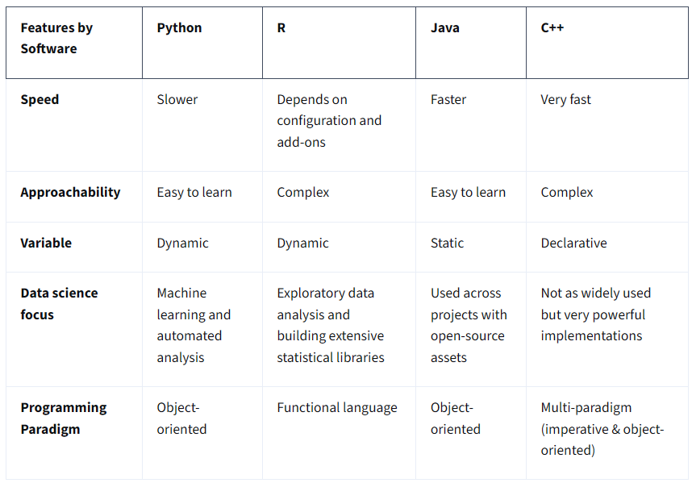

```{python}
#| include: false
import _setup
```
This page goes alonside the [Annotated follow-along guide_Hello,Python!](Annotated_follow-along_guide_Hello,_Python!.html) jupiter notebook. It is part of the Introduction to Data Analysis Using Python from Google in Coursera.

# Introduction to Python

Python is one of the most popular programming languages for data professionals, which makes it a great addition to your data analytics toolbox! As we’ve previously investigated, Python’s use of syntax to communicate commands and perform tasks mirrors spoken language. This makes Python a much easier programming language to learn. Python’s structure is similar to many other programming languages, but there are some key differences to consider as well.

In this reading, you’ll learn how Python compares to other programming languages data professionals use, including R, Java, and C++.

Five considerations of programming languages Python isn’t the only programming language used for data analysis, but it is one of the most widely used and most powerful. Many data professionals even use more than one programming language. Every language has benefits and drawbacks. For the purposes of this course, examine the following considerations: speed, approachability, variables, data science focus, and programming paradigm.

Speed There are many factors that contribute to the speed of a program’s execution, including compile time, runtime, hardware, installed dependencies, and the efficiency of the code itself. In general, low-level programming languages are faster, but they’re more difficult to learn and work with.

Approachability Approachability refers to how easy it is for new learners to start using a language. Learning new programming languages can be challenging depending on their syntax and overall structure. The syntax is the structure of code words, symbols, placement, and punctuation. Semantics builds meaning into those structures by using variables and objects. Additionally, those variables help add flexibility to the programs and objects where data is housed.

Variables Information in code is stored in variables. A variable is a named container which stores values in a reserved location in the computer’s memory. The way a programming language uses variables will have an effect on a system's core operations or kernel speed. Some languages use static variables to maintain a value throughout the entire run of a program. Others approach variables as dynamic, allowing values to be determined when a program is run. Some languages even allow declarative variables, which enable a program to determine where a variable should be placed.

Data science focus Programming languages have individual characteristics and can better serve different tasks in data analysis; this means programmers often use them for specific data science tasks.

Programming paradigm Programming languages can be object-oriented, functional, or imperative. Object-oriented programming languages are modeled around data objects. Functional programming languages are modeled around functions. Imperative languages are modeled around code statements that can alter the state of the program itself.

Programming language comparisons Python, R, Java and C++ are four of the most commonly used programming languages for data analysis. The following chart compares them using five considerations: speed, accessibility, variable, data science focus, and programming paradigm.



Key takeaways There are a number of different programming languages that can be used for data analysis. Each language has its own benefits and drawbacks. Learning to work with different languages will give you the opportunity to broaden your data skills and access new tools for your analysis. However, in this certificate program, Python will be your sole focus. As mentioned previously, Python is an easy to learn, object-oriented programming language that engages dynamic variables; though it sometimes requires a longer time to execute, it is a great tool for machine learning and automated analysis.

# Introduction to R

As you grow as a data analyst, you may need to learn additional programming languages. This program teaches Python, which is the most widely used language for data analysis. Python is a great starting point for foundational analysis, and its structure and syntax make it an accessible language for beginners. 

Another powerful programming language for data analysis is R. R is typically used by professionals with a statistical or research-oriented approach to problem-solving, such as data scientists, statisticians, and engineers. This reading provides a general introduction to R, its uses, and its benefits for data analysis. Knowing about R is helpful since you may encounter the language in a future professional role. 

Note that many of the coding concepts you'll learn with Python in this course are transferable to other programming languages, making it easier to pick up tools like R as you progress in your career. 

## **What is R?**

### **Historical context**

R is an open-source programming language and software environment specifically designed for statistical computing and graphics. Created in 1993 by professors Ross Ihaka and Robert Gentleman at the University of Auckland, New Zealand, R has since become a standard tool in data science, academic research, and various industries. 

Unlike general-purpose languages such as Python or Java, R is a domain-specific language whose features and syntax are tailored for statistical and data-related tasks. Most R users work within an Integrated Development Environment (IDE) called RStudio, which provides a user-friendly interface for writing code, viewing plots, and managing data. You can think of R as a comprehensive toolbox for working with data, built to handle everything from simple calculations to complex statistical modeling. 

### **Uses and applications**

R's primary use is in the fields of data analysis and data science. 

-   **Statistical analysis:** R is a standard tool for statistical analysis in academia and industry. Researchers use it to conduct complex statistical tests, build predictive models, and validate hypotheses.

-   **Machine learning:** R has a rich ecosystem of packages for machine learning tasks, from simple linear regression to advanced deep learning. Packages such as caret and tidymodels offer a unified interface for building, training, and evaluating models.

-   **Data wrangling:** A significant portion of any data analysis project involves cleaning and preparing data. R has powerful tools for this, most notably the tidyverse suite of packages. These packages, including dplyr for data manipulation and tidyr for data tidying, facilitate the process of transforming raw data into a usable format.

-   **Data visualization:** R excels at creating high-quality, professional plots and charts. Packages like ggplot2 can help you generate informative visualizations to explore data and communicate key findings.

-   **Reporting:** R can be integrated with tools like R Markdown to create dynamic reports, presentations, and dashboards that combine code, output, and prose. This ensures that reports are always up-to-date with the latest data and analysis.

### **Benefits**

R offers several key benefits that make it a useful tool for data analysts and data scientists. 

-   **Open-source:** R is a free, open-source project. This means that anyone can use R without licensing fees. Moreover, a global community of users and developers continuously contributes to R's improvement and expands its capabilities.

-   **Vast ecosystem of packages:** R has an extensive library of packages available on the Comprehensive R Archive Network (CRAN). With over 20,000 packages, R can handle almost any data analysis task, from specialized genomics analysis to financial modeling.

-   **Dedicated to data:** R was built by and for statisticians, so its design centers on data. R supports working with data structures and syntax that streamline the entire data analysis process.

-   **Strong community support:** The R community is large, active, and highly collaborative. This makes it easy for R users to find help, tutorials, and solutions to problems by accessing the R community's forums, blogs, and other online resources. 

## **Key takeaways**

R is a robust and flexible programming language for data analysis. R's statistical capabilities, visualization options, and extensive package ecosystem make it a useful tool for data professionals and researchers worldwide.

## **Additional resources**

Check out the following online resources to further explore R: 

-   [R for data science](https://r4ds.hadley.nz/) is a free online book by Hadley Wickham and Garrett Grolemund that includes a comprehensive introduction to R and the tidyverse, a collection of R packages designed for data science. It emphasizes practical data manipulation, visualization, and modeling.

-   [RStudio Education](https://education.rstudio.com/) provides tutorials, webinars, and learning pathways for beginners to get started with R and RStudio. Many R users work with an integrated development environment (IDE) like RStudio, which provides a user-friendly interface with a code editor, console, and tools for plotting and managing data.

-   [CRAN (Comprehensive R Archive Network)](https://cran.r-project.org/) is the central repository for R packages and offers access to extensive documentation and resources for thousands of R packages.

# Ways to learn about rogramming

Writing programming language code can be an exciting and rewarding experience. The programming field has a long history of people helping each other improve their skills and develop best practices. You will focus on the Python programming language in this course, but in the future you might choose to pursue additional programming languages based on your interests and professional goals. This reading is a general guide to help you decide which programming languages are best suited for you.

## **Popular programming languages by profession**

Let’s go through some potential job titles you might encounter and the most popular programming languages used in those professions. Also included is a list of additional resources for you to explore and learn more about each of the programming languages introduced.

### **Data analyst**

A data analyst collects, transforms, and organizes data to draw conclusions, make predictions, and drive informed decision-making. The most popular programming languages used by data analysts are Python  and R. 

**Python** is a general-purpose language that you can use to create what you need for data analysis. Here are a few resources to begin learning Python:

-   [The Python Software Foundation (PSF)](https://www.python.org/about/gettingstarted/): a website with guides to help you get started as a beginner 

-   [Python Tutorial](https://docs.python.org/3/tutorial/): a Python 3 tutorial from the PSF site

-   [Coding Club Python Tutorials](https://ourcodingclub.github.io/tutorials.html): a collection of coding tutorials for Python

**R** offers convenient statistical features for data analysis and is useful for creating advanced data visualizations. Check out these resources to learn more about R:

-   [The R Project for Statistical Computing](https://www.r-project.org/): a website for downloading R, documentation, and help

-   [R Manuals](https://cran.r-project.org/manuals.html): links to manuals from the R core team, including introduction, administration, and help

-   [Coding Club R Tutorials](https://ourcodingclub.github.io/tutorials.html): a collection of coding tutorials for R

-   [R for Beginners](https://cran.r-project.org/doc/contrib/Paradis-rdebuts_en.pdf): a starting guide to help you work with data, graphics, and statistics in R

**Kaggle** is an online repository of various datasets that can be used in both Python and R. It's a robust platform that regularly hosts solution-based competitions using data sets in high-interest industries. Learners may also explore a vast trove of data modeling discussions, trending plug-in models, and useful code snippets. Here are some great resources to get started in Kaggle:

-   [Datasets](https://www.kaggle.com/datasets): explore and download a vast collection of data sets while up-voting your favorite collection.

-   [Competitions](https://www.kaggle.com/competitions): commit individually or collaborate in a team towards data competitions for the possibility of financial rewards. Even without winning the competitions, this is a great way to network with other analysts.

-   [Learn](https://www.kaggle.com/learn): use this resource for an additional perspective on data visualization, linear regression techniques, or time series charting code. 

### **Web designer**

A web designer is responsible for the styling and layout of web pages containing text, graphics, and video. Web designers generally use Hypertext Markup Language v5 (HTML5) and Cascading Style Sheets (CSS) to create web pages. 

**HTML5** provides structure for web pages and is used to connect to hosting platforms. Learn more about HTML5 and CSS using these resources:

-   [HTML Tutorial](https://www.tutorialrepublic.com/html-tutorial/): an introduction to HTML with links to HTML5 features, examples, and references

-   [HTML5 Cheat Sheet](https://www.wpkube.com/html5-cheat-sheet/): a handy summary of HTML5 tags, attributes, and compatibility with HTML4

-   [HTML5 and CSS Fundamentals course](https://www.edx.org/course/html5-and-css-fundamentals): a free W3C course on edX; a verified course certificate can be issued for \$199 

**CSS** is used for web page design and controls graphic elements (color, layout, and font) and page presentation on multiple devices (large screens, mobile screens, and printers). Check out these cheat sheets for CSS:

-   [Interactive CSS Cheat Sheet](https://htmlcheatsheet.com/css/): includes the most common CSS snippets for gradient, background, font-family, border, and much more

-   [50 Best HTML & CSS Cheat Sheets](https://sharethis.com/best-practices/2020/02/best-html-and-css-cheat-sheets/): a list of 50 cheat sheets–choose a few that are useful to you

### **Mobile application developer**

A mobile application developer uses programming to create applications used on laptops, mobile phones, and tablets. The most popular programming languages for mobile application developers are Swift, Java, and C#.

**Swift** (for Apple platforms) is an open source scripting language for macOS, iOS, watchOS, and tvOS. Its main goal is to make applications run faster. Browse these resources for more information about Swift:

-   [Swift.org](https://swift.org/about/): an open source community with resources to learn how to use Swift, including videos and sample code

-   [Swift developer site](https://developer.apple.com/swift/): an Apple developer website with information for developers who want to use Swift 

-   [Swift development resources](https://developer.apple.com/swift/resources/): Apple’s collection of documentation, sample code, videos, and recommended books 

**Java** (for Android devices) is the official language for Android development. The article[I want to develop Android apps - which languages should I learn?](https://www.androidauthority.com/develop-android-apps-languages-learn-391008/) explores some other languages used for Android development. Check out these resources for Java:

-   [Android Studio](https://developer.android.com/studio): a downloadable integrated development environment (IDE) with tools to build apps for Android devices

-   [Build your first Android app in Java](https://developer.android.com/codelabs/build-your-first-android-app#1): instructions for installing Android Studio and creating your first app

-   [Java tutorial for beginners: write a simple app with no previous experience](https://www.androidauthority.com/java-tutorial-for-beginners-write-a-simple-app-with-no-previous-experience-1121975/): an overview of how to learn Java, with examples

**C#** (pronounced C-sharp) is an object-oriented programming language that is widely used to create mobile apps in the .NET open source developer platform. Xamarin extends the .NET platform with a framework for developers to create cross-platform mobile apps for both iOS and Android. Here are a few resources to help you learn C#:

-   [Microsoft .NET learning materials for C#](https://dotnet.microsoft.com/learn/csharp): includes free courses, tutorials, and videos to learn the programming language C#

-   [Microsoft Xamarin learning materials](https://dotnet.microsoft.com/learn/xamarin): includes free courses, tutorials, and videos to learn about mobile development with Xamarin

-   [Xamarin Tutorial - build your first iOS or Android app in C#](https://dotnet.microsoft.com/learn/xamarin/hello-world-tutorial/intro): instructions for building a mobile app that displays the text “Hello World”

-   [Learn C# from Codecademy](https://www.codecademy.com/learn/learn-c-sharp): a website with free basic interactive lessons, and additional activities that can be accessed with a monthly subscription

### **Web application developer**

A web application developer designs and develops network applications used across the web. The most popular programming languages used by web application developers are Python, Java, Ruby, and PHP.

**Python** is a general-purpose programming language. Check out the Python resources listed in the data analyst section.

**Java** is widely used to create enterprise web applications that can run on multiple clients. Java’s main strength is its “Write Once, Run Anywhere” (WORA) approach.Browse these resources to learn more about Java:

-   [Oracle Java Tutorials](https://docs.oracle.com/javase/tutorial/): Java tutorials from Oracle documentation

-   [Java for Beginners](https://www.homeandlearn.co.uk/java/java.html): a free Java course for beginners from the website “Home and Learn”

**Ruby** is a general-purpose, object-oriented programming language used for web application development. Ruby isn't the same as Ruby on Rails, which is an open source web application framework that runs using Ruby. Browse these resources to learn more about Ruby: 

-   [Ruby news](http://ruby-doc.org/): information about the latest Ruby releases and links to other resources

-   [Ruby documentation](http://www.ruby-lang.org/en/documentation/): includes guides, tutorials, and reference material to help you learn more about Ruby

-   [Ruby programmer’s guide](https://archive.org/details/programmingrubyp00thom/mode/2up/): a tutorial and reference guide for Ruby

-   [Learn Ruby from Codecademy](https://www.codecademy.com/learn/learn-ruby): a website with free basic interactive lessons, and additional activities that can be accessed with a monthly subscription

**PHP** is a scripting language particularly suited for web application development. It was based on Perl, another programming language. PHP is simple, flexible, and relatively easy to learn. Check out these resources to learn more about PHP:

-   [PHP downloads and documentation](https://www.php.net/): information about the latest PHP releases and links to other resources

-   [PHP the Right Way](https://phptherightway.com/): a quick reference for popular PHP coding standards

-   [Interactive PHP tutorial](https://www.learn-php.org/): a free tutorial that runs PHP code in exercises

### **Game developer**

A game developer is an application developer who specializes in video game creation. Game developers most commonly use the programming languages C# and C++.

**C#** is an object-oriented programming language that is widely used to create games. Check out the C# resources listed in the mobile application developer section.

**C++** is an extension of the C programming language that is also used to create console games, like those for Xbox. Browse more information about C++:

-   [Microsoft resources for C++](https://docs.microsoft.com/en-us/cpp/?view=msvc-160): learn how to install the Visual Studio IDE and write C++ code

-   [Microsoft C++ and C# code samples for gaming](https://docs.microsoft.com/en-us/samples/browse/?languages=cpp&terms=gaming): a resource with over 40 C++ and C# code samples for gaming 

-   [Interactive C++ tutorial](https://www.learn-cpp.org/): a free tutorial that runs C++ code in exercises

## **Tips for learning a new programming language**

The best way to learn any programming language is to practice it on your own as much as you can. Here are a few tips to follow when you start learning a new programming language:

-   Define a practice project and use the language to help you complete it. This makes the learning process more practical and engaging.  

-   Keep previous concepts and coding principles in mind. Many of these are transferable between programming languages. So, after you have learned one language, learning a second or third programming language tends to be much easier. 

-   Create and keep good notes and cheat sheets in whatever format (handwritten or typed) that works best for you.

-   Create an online filing system for information that you can easily access while you work in various programming environments.

### **Additional Python resources**

While this course will give you information about how Python works and how to write scripts in Python, you’ll likely want to find out more about specific parts of the language. Here are some great ways to help you find additional info: 

-   Read the [official Python documentation](https://docs.python.org/3/).

-   Search for answers or ask a question on [Stack Overflow](https://stackoverflow.com/). 

-   Subscribe to the Python [tutor](https://mail.python.org/mailman/listinfo/tutor) mailing list, where you can ask questions and collaborate with other Python learners.

-   Subscribe to the [Python-announce](https://mail.python.org/mailman/listinfo/python-announce-list) mailing list to read about the latest updates in the language.

# Jupiter Notebooks

Jupyter Notebook Overview

-   Jupyter Notebook is an open-source web application that allows users to create and share documents containing live code, visualizations, mathematical formulas, and text.

-   It supports collaboration on data projects and integrates code and output in a single document, which is helpful for learning and presenting.

Comparison with Terminal-Based Text Editors

-   Traditional terminal-based text editors execute code line-by-line and do not allow easy modification or re-execution of previous lines.

-   These editors are useful but less flexible for data analytics projects compared to Jupyter Notebooks.

Features of Jupyter Notebook

-   Code is organized into modular cells that can be moved, added, or deleted easily.

-   Supports markdown syntax for adding formatted text, comments, annotations, tables, and mathematical formulas.

-   Ideal for visualizations and presentations, making it a preferred tool among data professionals.

Throughout the course, learners will use Jupyter Notebooks to write code, perform analysis, and create projects showcasing their data skills.

Jupyter Notebook is an open-source web application for creating and sharing documents containing live code, mathematical formulas, visualizations, and text. This is a great tool to develop and present code in a standardized text block format that is interactive and shareable. You can create code, mathematical formulas, data visualizations, and even freestyle text—all in Jupyter notebooks!

You will be using Jupyter notebooks to write, execute, and present your own code throughout this program. This reading will guide you through using your own notebook. Note, however, that **for this certificate program you do not need to download any software.** You can complete all activities with the tools provided on the Coursera platform.

You can access Jupyter Notebook directly from your browser or download the desktop application onto your device to work with over 100 programming languages, including some you might already know like R and Python. There is [JupyterLab](https://jupyterlab.readthedocs.io/en/latest/), which is the full suite of tools for working with computational notebooks. There is also [Jupyter Notebook](https://jupyter-notebook.readthedocs.io/en/stable/), which is a more streamlined and simplified tool that nonetheless offers powerful ways to perform interactive computing. Again, for this certificate program, we recommend working within the Jupyter Notebook interface provided by Coursera. Activities that use Jupyter notebooks will be labeled as labs, and you will find relevant instructions for each activity on its landing page.

## Why Jupyter Notebook?

Notebooks are particularly useful for working with data. Here are some ways that Jupyter notebooks excel:

1.  **Modular/interactive computing:** You can write and execute individual chunks of code in small, manageable chunks, which are called cells. You can run a cell without necessarily having to run the whole notebook. This is especially helpful for data exploration and experimentation. Cells are also helpful with debugging, because they provide a user-friendly way to make a mistake, notice that you made the mistake, and iterate back to correct your mistake, without having to re-execute a whole script.

2.  **Integration of code and documentation:** Notebooks allow you to combine code, textual explanations, and visualizations like charts, graphs, and tables—all in a single document. 

3.  **Support for multiple languages:** The Data Analytics program will use Python, but Jupyter notebooks support many other languages, making them powerful and versatile.

4.  **Data exploration and analysis:** The notebook simplifies working with data by offering tools to load, clean, analyze, and examine it in an elegant interface.

5.  **Cloud-based services:** Many cloud computing platforms host Jupyter notebooks, which makes it easy to run and share notebooks without setting up a local environment. This is very useful for collaboration.

6.  **Libraries and extensions:** There is a rich ecosystem of extensions and plugins that enhance functionality for whatever type of project you’re working on. 

## How to use Jupyter notebooks

Once you’ve opened a Jupyter notebook, it’s time to use it! Here are some tips to get started.

### Command/edit mode

Notebooks have two working modes: command mode and edit mode. Command mode is used to interact with the notebook as a whole and perform actions like adding, moving, and deleting cells. Edit mode is used to type code or markdown text into a particular cell. 

Command mode is indicated by a blue bar on the left side of the current cell.

Edit mode is indicated by a green bar on the left and also a thin green border around the active cell.

To enter into edit mode, simply click into a cell to insert your cursor there or use the navigation arrows on your keyboard to select a cell and press Enter. To revert back to command mode, click anywhere outside the cell or press the escape key.

## Markdown mode

Jupyter notebooks allow you to toggle cells between coding mode and Markdown mode. Markdown is a markup language that lets you add formatting elements to plain text. It’s useful because it’s ubiquitous, future-proof, and platform independent. In Jupyter notebooks, Markdown text is used to provide written explanations, analysis, and context to explain the code and its output.

## Common actions

Most actions can be performed using both a mouse/graphic interface and keyboard shortcuts. Here are some of the most common actions.

### Add a new cell

-   Click on Insert in the menu bar at the top of the notebook. Options are to insert a new cell above or below the current cell.

-   Keyboard shortcuts (while in command mode):

    -   **a:** Insert a cell above the current cell

    -   **b:** Insert a cell below the current cell

### Delete a cell

-   Use command mode to select a cell or group of cells.

-   Click on Edit in the menu bar at the top of the notebook and select Delete Cells from the dropdown menu.

-   Keyboard shortcut (while in command mode): 

    -   **dd** (press D two times)

### Move a cell

-   Use command mode to select a cell or group of cells.

-   Click on the up arrow button or down arrow button in the menu bar at the top of the notebook to move the selected cell(s) up or down 

### Run a cell

-   Select a cell and click the **Run** button in the menu bar at the top of the notebook.

-   Keyboard shortcuts:

    -   **Ctrl + Enter:** Run selected cell

    -   **Shift + Enter:** Run selected cell and select next cell

    -   **Alt + Enter:** Run selected cell and insert new cell below

-   You can run cells from both command mode and edit mode

Press **h** while in command mode for a pop-up window with all available keyboard shortcuts. You can also check out [Jupyter Notebook interface components](https://jupyter-notebook.readthedocs.io/en/stable/ui_components.html) for more detailed descriptions of various notebook features.

# Troubleshooting

You will use Jupyter notebooks throughout the Data Analytics certificate program. At times, you might encounter difficulty accessing or running the notebook. Here are some troubleshooting steps to help you if this happens.

## Browser compatibility

Make sure your internet browser is updated regularly. It is best to use the latest version of Google Chrome, Firefox, or Microsoft Edge. If your browser is outdated or you are using a browser that is not supported by Coursera, you may encounter a problem. If your browser is up to date and you are using one of the browsers listed above and still encountering problems, try restarting your browser or clearing your browser’s cache and cookies. You can also use incognito mode, which prevents your browser from storing cookies and other temporary data.

## Internet connection

Coursera requires a stable internet connection. If you are experiencing problems starting or running a Jupyter notebook, your internet connection may be slow or unreliable. Some signs of an unstable internet connection may be pages failing to load, freezing labs, or the inability to type or enter commands within the lab environment. 

**Pro Tip:** If you are unable to complete a lab on one device, try using another device.

## Troubleshooting steps

To summarize, here are the troubleshooting steps to try if you encounter a problem with Jupyter notebooks in Coursera. 

1.  Make sure you are using the latest version of a supported browser: Google Chrome, Firefox, or Microsoft Edge.

2.  Restart your browser and clear your browser’s cache and cookies. You can also use incognito mode.

3.  Check your internet connection and make sure it is stable. You can try restarting your router and modem to regain a stable connection.

4.  Try restarting the lab again.

If all this fails, it’s possible that Coursera is performing maintenance or experiencing a service interruption. In that case, wait a little while and try again.

# Key takeaways

Jupyter Notebook is a powerful, open-source web application for creating and sharing documents that combine live code, text, and data visualizations. Notebooks are especially useful for developing and debugging code because of their modular nature, which lets you run code in small, manageable chunks called cells. The notebook interface has two main modes: command and edit. Use command mode to perform actions like adding, moving, and deleting cells. Use edit mode to type code or markdown text into a particular cell.

## Resources for more information

-   [Jupyter Notebooks interface training](https://jupyter-notebook.readthedocs.io/en/stable/ui_components.html) shows how to navigate and utilize the specific features, menus, and shortcuts of the Jupyter Notebook user interface.

-   [Jupyter software homepage](https://jupyter.org/) is the central hub for the Project Jupyter ecosystem, offering high-level overviews, news, and links to install or launch the software.

-   [Jupyter documentation](https://docs.jupyter.org/en/latest/) provides the official technical manuals and API references for installing, configuring, and using Jupyter tools.

-   [Jupyter Notebooks cloud (online)](https://jupyter.org/try-jupyter/notebooks/?path=notebooks/Intro.ipynb) allows users to run and share Jupyter Notebooks directly in a web browser without needing to install software on their local machine.

-   [Jupyter community forum](https://discourse.jupyter.org/) is a discussion space for users and developers to connect, share news, and discuss the broader ecosystem of Project Jupyter tools.

-   [Jupyter notebooks community forum](https://discourse.jupyter.org/c/notebook/3) is dedicated to discussions, troubleshooting, and sharing tips strictly related to the Jupyter Notebook application.

-   [Python community forum](https://www.python.org/community/forums/) is a general discussion board for topics related to the Python programming language, including syntax, libraries, and best practices (not limited to Jupyter).

-   [StackOverflow questions](https://stackoverflow.com/) is a forum where users ask specific technical questions and receive solutions from the programming community for code-related errors and implementation hurdles.

-   [Jupyter Notebooks installation](https://test-jupyter.readthedocs.io/en/latest/install.html) provides the specific steps and commands required to set up the Jupyter Notebook environment on a local computer.