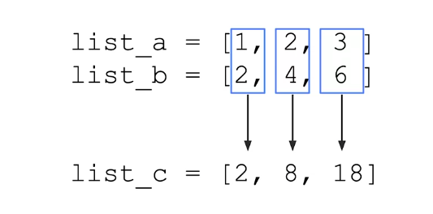
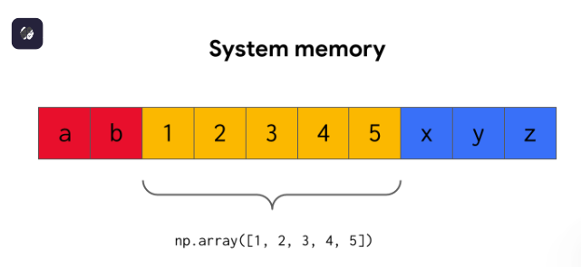

```{python}
#| include: false
import _setup
```
```{python}


import numpy as np
import pandas as pd
```

Python has many advanced calculation capabilities ​that are used for data work ​and other scientific applications. ​These features make it possible to extend, enhance, ​and reuse parts of the code. ​To access these features, ​you can import them from libraries, packages, and modules. ​These features are not included in basic Python, ​so it's necessary to add them to your scripts. ​The additional functionality can save you time ​constructing functions and objects in your own work. ​Using these features ​can also help you obtain extra data types ​for analyzing data or building machine learning models. ​Let's start with libraries.

​A library, or package, broadly refers ​to a reusable collection of code. ​It also contains related modules and documentation. ​You'll often encounter the terms library ​and package used interchangeably.

​Commonly used libraries ​for data work are matplotlib and Seaborn. ​Matplotlib is a comprehensive library ​for creating static, animated, ​and interactive visualizations in Python. ​Seaborn is a data visualization library ​that's based on matplotlib. ​It provides a simpler interface ​for working with common plots and graphs.

​The certificate program integrates ​two other commonly used libraries for data work, ​NumPy and pandas. ​NumPy, or numerical Python, is an essential library ​that contains multidimensional array ​and matrix data structures and functions to manipulate them. ​This library is used for scientific computation. ​And pandas, which stands for Python data analysis, ​is a powerful library built on top of NumPy ​that's used to manipulate and analyze tabular data.

​There are many other popular Python libraries and packages ​for data professional work ​such as scikit-learn, statsmodels and others. ​Scikit-learn, a library, and statsmodels, a package, ​consists of functions data professionals can use ​to test the performance of statistical models. ​They're used across various scientific fields. ​

Again, different practitioners across the field ​often conflate libraries and packages, ​so you may hear them refer to one, the other or both ways. ​

Libraries and packages provide sets of modules ​that are essential for data professionals. ​Modules are accessed from within a package or a library. ​They are Python files that contain collections of functions ​and global variables. ​

Global variables differ from other variables ​because these variables can be accessed ​from anywhere in a program or script.

​Modules are used to organize functions, classes, ​and other data in a structured way. ​Internally, modules are set up through separate files ​that contain these necessary classes and functions. ​

When you import a module, ​you are using pre-written code components. ​Each module is an executable file ​that can be added to your scripts. ​

Commonly used modules ​for data professional work are math and random. ​Math provides access to mathematical functions, ​and random is used to generate random numbers. ​This is useful when selecting random elements from a list, ​shuffling elements randomly, ​or working with random sampling, ​which you'll explore in a later course. ​

There are several ways to import modules ​depending on whether you want to use the whole package ​or just a single predefined function or feature. ​This adds functionality ​for carrying out specialized operations.

​There's lots more to learn about libraries, ​packages and modules, ​so feel free to refer to the course resources ​for more information on installing these features ​and to continue growing your Python knowledge. ​

# Introduction to NumPy

You've learned that part of what makes Python ​such a powerful and dynamic language are the packages ​and libraries that are available to it. ​One of the most widely used and important of these is NumPy. ​

Recall that NumPy contains multidimensional array ​and matrix data structures, ​as well as functions to manipulate them. ​You'll learn more about these data structures ​and functions soon, but for now, let's just consider NumPy ​at a high level and learn more about it. ​NumPy's power comes from vectorization. ​

Vectorization enables operations to be performed ​on multiple components of a data object at the same time. ​This is particularly useful for data professionals ​because their jobs often involve working ​with very large quantities of data, ​and vectorized code saves a lot of time ​because it computes more efficiently. 

​Let's explore this a little more. ​Suppose we have list A and list B, both the same length, ​and we want to create a new list C ​that's the element-wise product of each list. ​In other words, we want to multiply the first element ​of list A by the first element of list B, ​then multiply the second element of list A ​by the second element of list B, et cetera.



 ​If we try to multiply lists A and B together, ​the computer throws an error. 

```{python}
#| error: true
# Lists cannot be multiplied together.
list_a = [1, 2, 3]
list_b = [2, 4, 6]

list_a * list_b
```

​To perform this operation, we could write a for loop. ​We'd start by defining an empty list, list C, ​then make a range of indices to loop over, ​and append the product of list A and list B ​at each index to list C. ​This gets the job done, but if you're thinking, ​"There's gotta be an easier way," you're right! 

```{python}
# To perform element-wise multiplication between two lists, you could
# use a for loop.
list_c = []
for i in range(len(list_a)):
    list_c.append(list_a[i] * list_b[i])

list_c
```

​We can use NumPy to perform this operation ​as a vectorized computation. ​Simply convert each list to a NumPy array ​and multiply the two arrays ​together using the product operator. ​

```{python}
# NumPy arrays let you perform array operations.

# Import numpy, aliased as np.
import numpy as np

# Convert lists to arrays.
array_a = np.array(list_a)
array_b = np.array(list_b)

# Perform element-wise multiplication between the arrays.
array_a * array_b
```

The results are the same, ​but the vectorized approach is simpler, easier to read, ​and faster to execute because ​while loops iterate over one element at a time, ​vector operations compute simultaneously ​in a single statement. ​

The efficiency of this might not be noticeable now, ​but when working with large datasets it will be. ​

Vectors also take up less memory space, ​which is another factor that becomes important ​when working with a lot of data. 

​You might have noticed that when we used NumPy, ​we first had to import it. ​This is called an import statement. 

​An import statement uses the import keyword ​to load an external library, package, module, ​or function into your computing environment. ​Once you import something into your notebook ​and run that cell, you don't need to import it again ​unless you restart your notebook. ​When we import NumPy, we import it as NP. ​This is known as aliasing. ​Aliasing lets you assign an alternate name, or alias, ​by which you can refer to something. ​In this case, we're abbreviating NumPy to NP. ​Notice the NPs in the code below the import statement ​where we create our arrays. 

​If we didn't give NumPy an alias of NP, ​we'd have to type out "numpy" here in order to access ​its array function. ​Aliasing as NP makes the code shorter and easier to read. ​Note that NP is the standard alias. ​If you use something else, ​other people might get confused when reading your code. ​In addition to being highly useful in its own right, ​NumPy powers a lot of other Python libraries, ​like pandas, so understanding how NumPy works will help ​you use these other packages. ​There's a lot more to discover about NumPy. ​Coming up, you'll learn about its core data structures ​and functionalities. 

------------------------------------------------------------------------

Recently, you learned about Python libraries, packages, and modules. As you’ve discovered, importing these tools saves data professionals time and enhances their programming. Another benefit of commonly used  libraries is that they are constantly scrutinized and updated by talented and knowledgeable programmers. Thus, you can be confident that the underlying code is high quality. 

In this reading, you’ll learn more about the basic features of libraries, packages, and modules; how they are related; and a selection of basic modules you might use as a data professional.

## **Libraries, packages, and modules**

A **library** is a corpus of reusable code modules and their accompanying documentation. Libraries are bundled into **packages** that you install, which can then be imported into your coding environment as needed. You’ll typically encounter the terms “library” and “package” used interchangeably. Generally, this certificate program will refer to both as libraries, but it’s important to be acquainted with both terms.

**Modules** are similar to libraries, in that they are groups of related classes and functions, but they are generally subcomponents of libraries. In other words, a library can have many different modules, and you can choose to import the entire library or just the module you need. 

First we will have to install the libraries in our python environment you can look at this on your own, but it will like `pip install numpy`


## **Import statements**

Libraries and modules beyond the Python standard library typically must be imported into your working environment on an as-needed basis. Additional libraries are installed first and then imported into your working environment as needed.

To import a library or module, use an import statement. Import statements require particular syntax using the **import** keyword.

```{python}
import numpy as np
```

This import statement imports the NumPy library into your working environment. After running this command, you’ll have access to all NumPy classes and functions. For instance, to use the **array()** function on **\[2, 4, 6\]**, you’d write:

```{python}
np.array([2, 4, 6])
```

n this case, the NumPy library is imported with the **np** alias. You can assign any abbreviation you like as an alias, but commonly used libraries have common aliases. Therefore, straying from those could cause confusion when sharing code with others. Here are some common libraries and their conventional aliases used by data professionals:

`import numpy as np`

`import pandas as pd`

`import seaborn as sns`

`import matplotlib.pyplot as plt`

### Additional import syntax

#### **Importing modules**

`import matplotlib.pyplot as plt`

You may have noticed that this syntax differs slightly from the other examples. In this case, matplotlib is the library and pyplot is a module inside. The pyplot module is aliased as **plt**, and it’s accessed from the matplotlib library using the dot. 

#### **Importing functions**

Just as you can import libraries and modules, you can also import individual functions from libraries or from modules within libraries using a specific syntax. Here’s an example depicting a common import when using the scikit-learn library to build machine learning models:

`from sklearn.metrics import precision_score, recall_score`

Again, notice the different syntax. The import statement begins with the **from** keyword, followed by **sklearn.metrics**—the scikit-learn library + the **metrics** module. Next is the **import** keyword followed by the desired functions. In this case, there are two: **precision_score** and **recall_score**. 

The same syntax can be applied to the example using NumPy’s **array()** function. However, note that you typically would not encounter individual functions being imported from NumPy. It’s much easier and more common to just import the whole library.

`from numpy import array`

When a function is imported by name, like in this example, you can use it without any preceding syntax to indicate the library or module that it comes from: `array([2,4,6])`

### Discouraged syntax

One last syntactical variation that you might encounter is: `from library.module import *`

his imports everything from a particular library or module and allows you to use its functions without any preceding syntax. So, for instance, if you wrote **from numpy import \***,  you’d be able to use all of NumPy’s functions without preceding them with **numpy** or **np**. **This approach is not recommended** because it makes it difficult to track where functions come from. However, it’s helpful to be aware of this because you will likely encounter it in your work as a data professional. And, in specific instances, it might be useful.  

## **Commonly used built-in modules**

The Python standard library comes with a number of built-in modules relevant to data professional work such as **math**, **datetime**, and **random**. These can be imported without additional installation. In other words, you can import them directly, as long as you have Python installed. For example:

### [datetime](https://docs.python.org/3/library/datetime.html#module-datetime)

-   Provides many helpful date and time conversions and calculations

Example:

```{python}
import datetime  
date = datetime.date(1977, 5, 8)       # assign a date to a variable
print(date)                            # print date
print(date.year)                       # print the year that the date is in

delta = datetime.timedelta(days=30)    # assign a timedelta of 30 days to a 
                                       # variable
print(date - delta)                    # print date of 30 days prior 
```

### [math](https://docs.python.org/3/library/math.html#module-math)

-   Provides access to mathematical functions

Example:

```{python}
import math  
print(math.exp(0))          # e**0
print(math.log(1))          # ln(1)
print(math.factorial(4))    # 4! 
print(math.sqrt(100))       # square root of 100
```

### [random](https://docs.python.org/3/library/random.html#module-random)

-   Useful for generating pseudo-random numbers (refer to the documentation for explanation of pseudo-random number generation)

Example

```{python}
import random
print(random.random())          # 0.0 <= X < 1.0
print(random.choice([1, 2, 3])) # choose a random element from a sequence
print(random.randint(1, 10))    # a <= X <= b
```

**Key takeaways**

Libraries, packages, and modules are gateways to Python's countless capabilities. Understanding how to leverage them for your own coding needs will unlock new tools and functions that make your work much more efficient. Check out the Python Package Index at the [PyPI](https://pypi.org/) repository to search for useful libraries. There are packages designed for applications as diverse as chemistry, audio editing, natural language processing, and video games. Whatever it is you’re trying to do, chances are someone has developed a suite of tools to help you!

## **Additional resources**

Check out the Python Package Index at the [PyPI](https://pypi.org/) repository to search for useful libraries. There are packages designed for applications as diverse as chemistry, audio editing, natural language processing, and video games. Whatever it is you’re trying to do, chances are someone has developed a suite of tools to help you!

# Python’s new versions and features

You've learned that one of Python's great strengths is its dynamism: it is developed and supported by a large community of users. This makes it a language that changes and evolves . In other words, the language and its libraries are constantly growing, improving, and responding to user feedback. 

Python's dynamism, while a strength, can introduce complexities. This can lead to challenges when code is intended to be used for long periods of time or when multiple people work on a project together. A script or program developed in one Python version is often tied to that particular environment, and running it in a different version can lead to unexpected behavior. This is because Python and its libraries are updated over time. So, if you developed a project that used, say, Python 2.7.4 in 2013, and you try to run it now in Python 3.12.4, there's a possibility that it won't execute the same way. Similarly, collaborative projects can be hindered by team members using different library versions, resulting in compatibility issues.

## **Deprecation**

Code inevitably evolves, gets phased out, and becomes obsolete. This process is known as deprecation. If you're working in a Jupyter notebook, you'll generally get a warning if something you use is scheduled to be deprecated in a future release. Your code will still run, but it might not continue to do so in future versions, or if it does, its behavior might change. It's best to pay attention to these warnings and change your code to conform with the coming change, because it's easier to do it when you're actively writing the code than to come back to it when it breaks and try to figure out what you were doing at that particular stage of the project. Also, small updates—for example, Python 3.11.8 to 3.11.9—won't be as disruptive as large updates—say, Python 2.X to 3.X, so you'll notice more deprecation when there are major releases.

It's important to note that you can still use older versions of Python and its libraries. You don't always have to update your code every time there is a new release. Indeed, older versions typically continue to receive support long after they've been superseded by more recent releases. This is to allow for people and organizations to plan their code updates over time. While *you* might be able to simply update your project, it's a lot harder for a large company to update their code base while ensuring that nothing breaks. 

## **Environments**

The particular set of conditions and configurations that you use to develop code is known as your environment. Your environment includes the tools, libraries, dependencies, settings, etc. that are used to write and run your code. So, when you work on a project with a group of people, it's important that you all share the same environment so the code runs the same way for everybody. If you're doing this course's labs on Coursera, you generally don't have to worry about the environment because it has been preconfigured for you. But if you're doing the labs off the Coursera platform, be aware that your code might execute differently than it would on Coursera, depending on your environment. 

Environment management can be a complex and technical process, and we won't go into it much in this course because your environment has been preconfigured to allow you to focus on learning other skills. If you're interested in learning more about environment configuration or creating and working in your own development environment, [Anaconda Navigator](https://docs.anaconda.com/navigator/) is a great place to get started. Anaconda Navigator is a free, open-source, downloadable graphical user interface that provides a user-friendly tool set to manage environments. It also has a suite of other built-in feature integrations like Jupyter notebooks, PyCharm, VSCode, and other popular tools used by data professionals.

## **Check which versions you have**

We try to keep the code in this course current by using recent stable releases of Python and relevant libraries, but updating everything in all the courses for every new release isn't feasible or necessary. If you’re doing the Jupyter notebook activities on your own computer and not on Coursera, you may occasionally find differences in how your code runs compared to how it is demonstrated on Coursera. These differences are likely due to versioning.

To check which version of Python you're running in a Jupyter notebook, execute the following code in a notebook cell:

**import sys print(sys.version)**

To check which version of a library you're using, import the library and then use its **\_\_version\_\_** attribute to access its version information. For example:

**import numpy as np import pandas as pd print(np.\_\_version\_\_) print(pd.\_\_version\_\_)**

## **Key takeaways**

Python evolves and grows in response to its users and use cases. This means that code updates can change the behavior of code that was written in older versions. Understanding how to assess, manage, and troubleshoot your coding environment is an important part of coding.

------------------------------------------------------------------------

# Basic array operations

You've recently learned ​that the NumPy library uses vectorization ​to make working with data faster and more efficient, ​which makes your job easier. ​I demonstrated how NumPy performed ​an element-wise multiplication of two lists ​by converting the lists to arrays ​and then simply multiplying them together. ​Now, we're going to continue learning about arrays ​and how to work with them. 

​The array is the core data structure of NumPy. ​The data object itself ​is known as an "n-dimensional array," or ndarray for short. ​The ndarray is a vector. 

​Recall that vectors enable many operations ​to be performed together when the code is executed, ​resulting in faster run-times ​that require less computer memory. ​

You can create an ndarray from a Python object ​by passing the object to the ndarray function. 

​ndarrays are mutable, ​so you can change the values they contain. ​If I want to change this last value from a four to a five, ​I can do that by identifying the index number. ​Since we're dealing with the last value, here, ​it's necessary to use a negative one. ​But, **I can't change the size of the array ​without reassigning it.** ​If I try to add a number to the end of this array, ​the computer throws an error. ​So if you want to change the size of an array, ​you have to reassign it. 

​**Another requirement of the array ​is that all of its elements be of the same data type.** ​If I create an array with the integers one, two, ​and then a string of "coconut," ​NumPy will create an array ​that forces everything to the same data type, if possible. ​In this case, everything becomes a string, ​represented here by "U21," meaning unicode 21. ​So be careful when creating your arrays ​that they all contain data of the same type, ​or, if they don't, that this is intentional ​and useful to what you're doing. ​

You previously learned ​that calling the "type" function on an object ​will return the data type of the object. ​If we do that with an array, ​as you might expect, we get a NumPy array. 

​We can use the dtype attribute ​if we want to check the data type ​of the contents of an array. 

```{python}
# The dtype attribute returns the data type of an array's contents.
arr = np.array([1, 2, 3])
arr.dtype
```

​Here, the dtype attribute indicates ​that this array consists of integers. ​

As the name implies, ndarrays can be multidimensional. ​For a one-dimensional array, ​NumPy takes an array-like object of length X, ​like a list, ​and creates an ndarray in the shape of X. 

​A one-dimensional array is neither a row nor a column. ​We can use the shape attribute ​to confirm the shape of an array. ​

```{python}
# The shape attribute returns the number of elements in each dimension
# of an array.
arr.shape
```

We can also use the ndim attribute ​to confirm the number of dimensions the array has. ​

```{python}
# The ndim attribute returns the number of dimensions in an array.
arr.ndim
```

Data professionals will often need to confirm ​the shape and number of dimensions of their array. ​For example, if they're trying to attach it ​to another existing array. ​These methods are also commonly used ​to help understand what's going wrong ​when your code throws an error. ​

A two-dimensional array can be created from a list of lists, ​where each internal list is the same length. ​You can think of these internal lists as individual rows, ​so the final array is like a table. 

```{python}
# Create a 2D array by passing a list of lists to np.array() function.
arr_2d = np.array([[1, 2], [3, 4], [5, 6], [7, 8]])
print(arr_2d.shape)
print(arr_2d.ndim)
arr_2d
```

Notice that this array has a shape ​of four rows by two columns ​and is two dimensions. ​

If a two-dimensional array is a list of lists, ​then a three-dimensional array ​is a list that contains two of these, ​so a list of two lists of lists. ​This array can be thought of as two tables, ​each with two rows and three columns. 

```{python}
# Create a 3D array by passing a list of two lists of lists to np.array() function.
arr_3d = np.array([[[1, 2, 3],
                   [3, 4, 5]],

                  [[5, 6, 7],
                   [7, 8, 9]]]
)

print(arr_3d.shape)
print(arr_3d.ndim)
arr_3d
```

​Thus, it has three dimensions. ​This can go on indefinitely. ​Thankfully, there are ways ​to help simplify working with multidimensional arrays, ​which you'll learn about later. ​And unless you're doing ​very advanced scientific computations, ​you typically won't be working directly with NumPy arrays ​that are more than three dimensions. 

​NumPy also lets us reshape an array ​using the reshape method. ​Our two-dimensional array was four rows and two columns. ​But what if we wanted this data ​to be two rows by four columns? 

```{python}
# The reshape() method changes the shape of an array.
arr_2d = arr_2d.reshape(2, 4)
arr_2d
```

​We just plug these values into the reshape method ​and reassign the result back to the array 2D variable. ​

Reshaping data is a common task in data analysis, ​so it's important for you to be familiar ​with what it means and how it works. ​

There are many other operations ​that can be performed with arrays, ​and you'll surely learn those ​as the need for them arises in your projects. ​But there are other helpful functions and methods in NumPy ​that you'll use regularly. ​These include functions to calculate things like mean, ​and natural logarithm, ​and floor and ceiling operations, ​which round numbers to the nearest lesser ​and greater whole number, respectively. ​And many other frequently used ​mathematical and statistical operations. ​NumPy is very robust. 

​There are so many things you can do with it ​that we can only briefly consider them here. ​As you know, NumPy powers ​many other useful libraries and packages. ​In this certificate program, ​we won't be working a lot directly with NumPy, ​but we will be working a lot with a library ​that depends on it: Pandas. ​It's important that you understand the basics of NumPy ​because it will help you when you start working with Pandas. ​As you develop your skills as a data professional, ​you'll find yourself returning to NumPy time and time again ​because it's such an integral part ​of advanced data analysis. 

------------------------------------------------------------------------

# **Reference guide: Arrays**

As you’ve learned, NumPy is a powerful library capable of performing advanced numerical computing. One of its main features is its ability to work with vectors, arrays, and matrices. The NumPy library also has many useful mathematical functions. Data professionals use NumPy for many different tasks. One of its primary advantages is its speed. An operation applied to a vector executes much faster than the same operation applied to a list. Performance increases become apparent when working with large volumes of data. This reading is a reference guide for working with NumPy arrays. 

## **Create an array**

Remember that to use NumPy, you must first import it. Standard practice is to alias it as np. 

### [np.array()](https://numpy.org/doc/stable/reference/generated/numpy.array.html)

Creates an ndarray (n-dimensional array). There is no limit to how many dimensions a NumPy array can have, but arrays with many dimensions can be more difficult to work with.

#### 1-D array:

```{import numpy as np}
array_1d = np.array([1, 2, 3])
array_1d{python}

```

Notice that a one-dimensional array is similar to a list.

#### 2-D array:

```{array_2d = np.array([(1, 2, 3), (4, 5, 6)])}
array_2d{python}

```

Notice that a two-dimensional array is similar to a table.

#### 3-D array:

```{python}
array_3d = np.array([[[1, 2], [3, 4]], [[5, 6], [7, 8]]])

array_3d
```

Notice that a three-dimensional array is similar to two tables.

### [np.zeros()](https://numpy.org/doc/stable/reference/generated/numpy.zeros.html)

-   Creates an array of a designated shape that is pre-filled with zeros:

```{python}
np.zeros((3, 2))
```

### [np.ones()](https://numpy.org/doc/stable/reference/generated/numpy.ones.html)

-   Creates an array of a designated shape that is pre-filled with ones:

```{python}
np.ones((2, 2))
```

### [np.full()](https://numpy.org/doc/stable/reference/generated/numpy.full.html)

-   Creates an array of a designated shape that is pre-filled with a specified value:

```{python}
np.full((5, 3), 8)
```

These functions are useful for various situations, including:

-   To initialize an array of a specific size and shape and then subsequently fill it with values derived from a calculation

-   To allocate memory for later use

-   To perform matrix operations

## **Array methods**

NumPy arrays have many methods that allow you to manipulate and operate on them. For a full list of these, refer to the [NumPy array documentation](https://numpy.org/doc/stable/reference/arrays.ndarray.html). Some of the most commonly used methods include:

### [ndarray.flatten()](https://numpy.org/doc/stable/reference/generated/numpy.ndarray.flatten.html)

-   Returns a copy of the array collapsed into one dimension

```{python}
array_2d = np.array([(1, 2, 3), (4, 5, 6)])

array_2d.flatten()
```

### [ndarray.reshape()](https://numpy.org/doc/stable/reference/generated/numpy.reshape.html#numpy.reshape)

-   Gives a new shape to an array without changing its data

```{python}
array_2d = np.array([(1, 2, 3), (4, 5, 6)])

array_2d.reshape(3, 2)
```

Note that a value of -1 in the designated new shape indicates for NumPy to infer the value based on other given values. This is for user convenience.

```{python}
array_2d = np.array([(1, 2, 3), (4, 5, 6)])

array_2d.reshape(3, -1)
```

### [ndarray.tolist()](https://numpy.org/doc/stable/reference/generated/numpy.ndarray.tolist.html)

-   Converts an array to a list object. Multidimensional arrays are converted to nested lists. 

```{python}
array_2d = np.array([(1, 2, 3), (4, 5, 6)])
array_2d.tolist()
```

### Mathematical functions

NumPy arrays also have many methods that are mathematical functions, such as:

-   [ndarray.max()](https://numpy.org/doc/stable/reference/generated/numpy.ndarray.max.html): returns the maximum value in the array or along a specified axis

-   [ndarray.mean()](https://numpy.org/doc/stable/reference/generated/numpy.ndarray.mean.html): returns the mean of all the values in the array or along a specified axis

-   [ndarray.min()](https://numpy.org/doc/stable/reference/generated/numpy.ndarray.min.html): returns the minimum value in the array or along a specified axis

-   [ndarray.std()](https://numpy.org/doc/stable/reference/generated/numpy.ndarray.std.html): returns the standard deviation of all the values in the array or along a specified axis

```{python}
a = np.array([(1, 2, 3), (4, 5, 6)])

print(a.max())

print(a.mean())

print(a.min())

print(a.std())
```

## **Array attributes**

NumPy arrays have several attributes that allow you to access information about the array. Some of the most commonly used attributes include:

-   [ndarray.shape](https://numpy.org/doc/stable/reference/generated/numpy.ndarray.shape.html): returns a tuple of the array’s dimensions

-   [ndarray.dtype](https://numpy.org/doc/stable/reference/generated/numpy.ndarray.dtype.html): returns the data type of the array’s contents

-   [ndarray.size](https://numpy.org/doc/stable/reference/generated/numpy.ndarray.size.html): returns the total number of elements in the array

-   [ndarray.T](https://numpy.org/doc/stable/reference/generated/numpy.ndarray.T.html): returns the array transposed (rows become columns, columns become rows)

```{python}
array_2d = np.array([(1, 2, 3), (4, 5, 6)])

print(array_2d.shape)

print(array_2d.dtype)

print(array_2d.size)

print(array_2d.T)
```

## **Indexing and slicing**

You can access individual elements of a NumPy array using indexing and slicing. Indexing in NumPy is similar to indexing in Python lists, except you can use multiple indices to access elements in multidimensional arrays.

```{python}
a = np.array([(1, 2, 3), (4, 5, 6)])

print(a[1])

print(a[0, 1])

print(a[1, 2])
```

You can also use slicing to access subarrays of a NumPy array:

```{python}
a = np.array([(1, 2, 3), (4, 5, 6)])

print(a)

a[:, 1:]
```

## **Array operations**

NumPy arrays support many operations, including mathematical functions and arithmetic operations. These include array addition and multiplication, which performs element-wise arithmetic on arrays:

```{python}
a = np.array([(1, 2, 3), (4, 5, 6)])

b = np.array([[1, 2, 3], [1, 2, 3]])

print('a:')
print(a)
print()
print('b:')
print(b)
print()
print('a + b:')
print(a + b)
print()
print('a * b:')
print(a * b)
```

There are also nearly 100 other useful [mathematical functions](https://numpy.org/doc/stable/reference/routines.math.html#mathematical-functions) that can be applied to individual and/or multiple arrays.

## **Mutability**

NumPy arrays are mutable, but with certain limitations. For instance, you can change an existing element of an array:

```{python}
#| error: true
a = np.array([(1, 2), (3, 4)])

a[1][1] = 100

a
```

However, you cannot lengthen or shorten the array:

```{python}
#| error: true
a = np.array([1, 2, 3])

a[3] = 100

a
```

### How NumPy arrays store data in memory

NumPy arrays work by allocating a contiguous block of memory at the time of instantiation. Other structures in Python don’t do this. Their data is scattered across the system’s memory. This is what makes NumPy arrays so fast. All the data is stored together at a particular address in the system’s memory. However, this is also what prevents you from being able to lengthen or shorten the array. The abutting memory is occupied by other information. There’s no room for more data at that memory address. However, you can replace existing elements of the array with new elements. 



The only way to lengthen an array is to copy the existing array to a new memory address along with the new data. 

## **Key takeaways**

NumPy is a powerful Python library that uses n-dimensional arrays to perform rapid numerical operations, particularly on large datasets. With NumPy, you can manipulate arrays using various methods for reshaping, flattening, and performing mathematical operations. You can also access key attributes like shape and data type, and use indexing and slicing to access array elements.