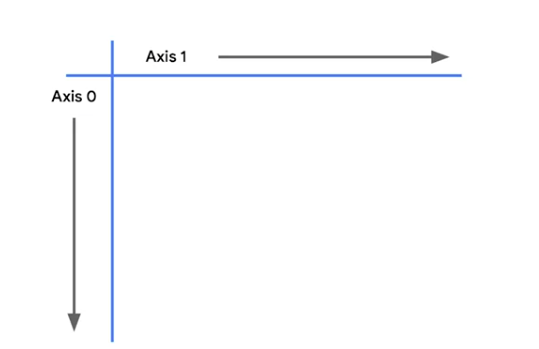

```{python}
#| include: false
import _setup
```

We previously discussed NumPy, ​and how it's an important tool ​for data professionals and anyone else ​whose job requires high performance computational power. ​We also investigated how other libraries ​and packages use NumPy ​because of the efficiencies that come with vectorization. ​One of these libraries is pandas, ​a quintessential tool both in this certificate program ​and in the world of data analytics. ​In this lesson, you're going to learn more about pandas ​and why it's so useful. ​Because pandas is a library ​that adds functionality to Python's core toolset, ​you have to import it. ​Similar to how we imported NumPy as NP, ​pandas has its own standard alias of PD. ​Typically, when using pandas, ​you import both NumPy and pandas together. ​This is just for convenience, ​given that NumPy is often used in conjunction with pandas. ​Strictly speaking, ​you don't have to import NumPy to work in pandas. ​Pandas is fully operational on its own.

​Pandas' key functionality is ​the manipulation and analysis of tabular data - ​that is, data that's in the form ​of a table, with rows and columns. ​A spreadsheet is a common example of tabular data. ​While NumPy is capable of many ​of the same functions and operations as pandas, ​it's not always as easy to work with ​because it requires you ​to work more abstractly with the data ​and keep track of what's being done to it, ​even if you can't see it. ​Pandas, on the other hand, ​provides a simple interface that allows you ​to display your data as rows and columns. ​This means that you can always follow exactly ​what's happening to your data as you manipulate it.

I'll give you a demonstration of pandas, ​and what it's like to use it. ​Later, we'll go into greater detail ​on its unique classes, processes, and functions.

​First of all, you can load data into pandas easily ​from different formats ​like comma-separated value files, or CSVs, ​Excel, and other spreadsheets, databases, and more. ​

Here, I'm loading a CSV file ​that I'm accessing via a web URL. ​The file contains information ​for some of the passengers from the Titanic, ​including their names, what class ticket they had, ​their age, ticket price, and cabin number.

```{python}
import pandas as pd

# Direct link to the public Titanic train.csv dataset
url = 'https://raw.githubusercontent.com/datasciencedojo/datasets/master/titanic.csv'

dataframe = pd.read_csv(url)
dataframe.head(25)
```

​By the way, this table of data is called a dataframe. ​The dataframe is a core data structure in pandas. ​Notice that the dataframe is made up of rows and columns, ​and it can contain data of many different data types ​including integers, floats, strings, booleans, and more. ​

If I want to calculate the average age of the passengers, ​we do so by selecting the age column ​and calling the mean method on it. ​I can also get the max, min, ​and standard deviation with minimal effort. ​I can also quickly check ​how many passengers were in each class. ​

```{python}
# Calculate the mean of the Age column.
dataframe['Age'].mean()
# Calculate the maximum value contained in the Age column.
dataframe['Age'].max()
# Calculate the minimum value contained in the Age column.
dataframe['Age'].min()
# Calculate the standard deviation of the values in the Age column.
dataframe['Age'].std()
# Return the number of rows that share the same value in the Pclass column.
dataframe['Pclass'].value_counts()
```

Checking summary statistics of the entire dataset ​only requires one line of code. ​

```{python}
# The describe() method returns summary statistics of the dataframe.
dataframe.describe()
```

This method gives me the number of rows ​as well as the mean, standard deviation, ​minimum and maximum values, ​along with the quartiles for every numeric column. ​

These concepts are all covered ​in greater depth elsewhere in the program. ​For now, I just want you to pay close attention ​to the power of pandas ​and all that you can accomplish with it. ​

Pandas also allows me to filter ​based on simple or complex logic. ​For example, here I'm selecting ​only the third class passengers who were older than 60.

```{python}
# Filter the data to return only rows where value in Age column is greater than 60
# and value in Pclass column equals 3.
dataframe[(dataframe['Age'] > 60) & (dataframe['Pclass'] == 3)]
```

​In addition to all of these data analysis tools, ​pandas also gives us ways to manipulate and change the data. ​For example, I can add a column that represents ​the inflation adjusted price of a ticket from 1912 to 2023.

```{python}
# Create a new column called 2023_Fare that contains the inflation-adjusted
# fare of each ticket in 2023 pounds.
dataframe['2023_Fare'] = dataframe['Fare'] * 146.14
dataframe
```

​Florence Briggs Thayer paid 71.28 pounds ​for her first class ticket. ​Today, that ticket would have cost her ​10,417 pounds sterling. ​

If you're wondering how I knew her name was ​Florence Briggs Thayer, ​it's because I can also select rows, columns, ​or individual cells from the data using indexing. ​Her name is in row one, column three. ​I can also do more complex data groupings and aggregations. ​

```{python}
# Use iloc to access data using index numbers.
# Select row 1, column 3.
dataframe.iloc[1, 3]
```

For example, ​here I'm grouping the passengers by class and sex, ​and then calculating ​the mean cost of a ticket for each group. ​Hopefully you're excited to start working with pandas. ​I know I'm looking forward to guiding you as you learn more ​about this powerful and fun data analysis tool.

```{python}
# Group customers by Sex and Pclass and calculate the total paid for each group
# and the mean price paid for each group.
fare = dataframe.groupby(['Sex', 'Pclass']).agg({'Fare': ['count', 'sum']})
fare['fare_avg'] = fare['Fare']['sum'] / fare['Fare']['count']
fare
```

------------------------------------------------------------------------

# The fundamentals of Pandas

You’ve learned that Python has many open-source libraries and packages—including NumPy and pandas—that make it one of the most useful coding languages. In this reading, you will review the basics of pandas dataframes and learn more about how to work with them. Understanding the fundamentals of pandas is essential to becoming a capable and competent data professional.

## **Primary data structures**

Pandas has two primary data structures: **Series** and **DataFrame**. 

-   **Series:** A Series is a one-dimensional labeled array that can hold any data type. It’s similar to a column in a spreadsheet or a one-dimensional NumPy array. Each element in a series has an associated label called an index. The index allows for more efficient and intuitive data manipulation by making it easier to reference specific elements of your data.

-   **DataFrame:** A dataframe is a two-dimensional labeled data structure—essentially a table or spreadsheet—where each column and row is represented by a Series.

## **Create a DataFrame**

To use pandas in your notebook, first import it. Similar to NumPy, pandas has its own standard alias, **pd**, that’s used by data professionals around the world:

```{python}
import pandas as pd
import numpy as np
```

Once you’ve imported pandas into your working environment, create a dataframe. Here are some of the ways to create a **DataFrame** object in a Jupyter Notebook

From a dictionary:

```{python}
d = {'col1': [1, 2], 'col2': [3, 4]}
df = pd.DataFrame(data=d)
df
```

From a numpy array:

```{python}
df2 = pd.DataFrame(np.array([[1, 2, 3], [4, 5, 6], [7, 8, 9]]),
                  columns=['a', 'b', 'c'])
df2
```

From a comma-separated values (csv) file:

`df3 = pd.read_csv(r'/file_path/file_name.csv')`

## **Attributes and methods**

The **DataFrame** class is powerful and convenient because it comes with a suite of built-in features that simplify common data analysis tasks. These features are known as attributes and methods. An attribute is a value associated with an object or class that is referenced by name using dotted expressions. A method is a function that is defined inside a class body and typically performs an action. A simpler way of thinking about the distinction between attributes and methods is to remember that attributes are *characteristics* of the object, while methods are *actions* or *operations*. 

**Common DataFrame attributes**

Data professionals use attributes and methods constantly. Some of the most-used **DataFrame** attributes include:

| **Attribute** | **Description** |
|:-----------------------|:-----------------------------------------------|
| [columns](https://pandas.pydata.org/docs/reference/api/pandas.DataFrame.columns.html#pandas.DataFrame.columns) | Returns the column labels of the dataframe |
| [dtypes](https://pandas.pydata.org/docs/reference/api/pandas.DataFrame.dtypes.html#pandas.DataFrame.dtypes) | Returns the data types in the dataframe |
| [iloc](https://pandas.pydata.org/docs/reference/api/pandas.DataFrame.iloc.html#pandas.DataFrame.iloc) | Accesses a group of rows and columns using integer-based indexing |
| [loc](https://pandas.pydata.org/docs/reference/api/pandas.DataFrame.loc.html#pandas.DataFrame.loc) | Accesses a group of rows and columns by label(s) or a Boolean array |
| [shape](https://pandas.pydata.org/docs/reference/api/pandas.DataFrame.shape.html#pandas.DataFrame.shape) | Returns a tuple representing the dimensionality of the dataframe |
| [values](https://pandas.pydata.org/docs/reference/api/pandas.DataFrame.values.html#pandas.DataFrame.values)  | Returns a NumPy representation of the dataframe |

Usage:

```{python}
dataframe.columns
#or
print(list(dataframe.columns))
```

**Common DataFrame methods**

Some of the most-used **DataFrame** methods include:

| **Method** | **Description** |
|:-----------------------|:-----------------------------------------------|
| [apply(*)*](https://pandas.pydata.org/docs/reference/api/pandas.DataFrame.apply.html#pandas.DataFrame.apply) | Applies a function over an axis of the dataframe |
| [copy()](https://pandas.pydata.org/docs/reference/api/pandas.DataFrame.copy.html#pandas.DataFrame.copy) | Makes a copy of the dataframe’s indices and data |
| [describe()](https://pandas.pydata.org/docs/reference/api/pandas.DataFrame.describe.html#pandas.DataFrame.describe) | Returns descriptive statistics of the dataframe, including the minimum, maximum, mean, and percentile values of its numeric columns; the row count; and the data types |
| [drop()](https://pandas.pydata.org/docs/reference/api/pandas.DataFrame.drop.html#pandas.DataFrame.drop) | Drops specified labels from rows or columns |
| [groupby()](https://pandas.pydata.org/docs/reference/api/pandas.DataFrame.groupby.html#pandas.DataFrame.groupby) | Splits the dataframe, applies a function, and combines the results |
| [head(*n=5*)](https://pandas.pydata.org/docs/reference/api/pandas.DataFrame.head.html#pandas.DataFrame.head) | Returns the first *n* rows of the dataframe (default=5) |
| [info()](https://pandas.pydata.org/docs/reference/api/pandas.DataFrame.info.html#pandas.DataFrame.info) | Returns a concise summary of the dataframe |
| [isna()](https://pandas.pydata.org/docs/reference/api/pandas.DataFrame.isna.html#pandas.DataFrame.isna) | Returns a same-sized Boolean dataframe indicating whether each value is null (can also use **isnull()** as an alias) |
| [sort_values()](https://pandas.pydata.org/docs/reference/api/pandas.DataFrame.sort_values.html#pandas.DataFrame.sort_values) | Sorts by the values across a given axis |
| [value_counts()](https://pandas.pydata.org/docs/reference/api/pandas.DataFrame.value_counts.html#pandas.DataFrame.value_counts) | Returns a series containing counts of unique rows in the dataframe |
| [where()](https://pandas.pydata.org/docs/reference/api/pandas.DataFrame.where.html#pandas.DataFrame.where) | Replaces values in the dataframe where a given condition is false |

These are just a handful of some of the most commonly used attributes and methods—there are many, many more! Some of them can also be used on pandas **Series** objects. For a more detailed list, refer to the [pandas DataFrame bydocumentation](https://pandas.pydata.org/docs/reference/api/pandas.DataFrame.html), which includes helpful examples of how to use each tool. 

### Quick Guide to Dataset Dimensions & Counts in Pandas

|  |  |  |  |
|------------------|------------------|------------------|------------------|
| **Goal** | **Method / Property** | **Output** | **What it actually counts** |
| **Total Rows** | `len(df)` | `14999` | Number of rows (includes `NaN`s) |
| **Dimensions** | `df.shape` | `(14999, 13)` | `(rows, columns)` tuple |
| **Non-Null Counts per Column** | `df.count()` | Series of counts | Counts **only valid (non-`NaN`) values** in each column |
| **Row Count per Group** | `df.groupby('col').size()` | Series of counts | Counts rows per group |
| **Frequency of Unique Values** | `df['col'].value_counts()` | Series of counts | Counts occurrence of each distinct value, sorted highest to lowest |

### 

```{python}
# Mini dataset with 6 rows and missing values
df = pd.DataFrame(
    {
        "label": ["A", "A", "B", "B", None, "A"],
        "device": ["iOS", "Android", "iOS", "iOS", "Android", None],
    }
)

df
```

### Total Rows: `len(df)`

Counts every row in the DataFrame, including rows with `None`/`NaN`

```{python}
len(df)
```

### Dimensions: `df.shape`

Returns a `(rows, columns)` tuple.

```{python}
df.shape
```

### Number of data cells

calculates the total number of cells (rows $\times$ columns).

```{python}
df.size
```

### Non-Null Counts: `df.count()`

Counts **only non-missing values** per column. Notice it shows `5` instead of `6` because each column has one missing value.

```{python}
df.count()
```

### Frequency Counts: `df['device'].value_counts()`

#### Single Column (Default: ignores `NaN`s)

Counts distinct values and sorts them by highest frequency.

```{python}
df["device"].value_counts()
```

#### Single Column (Including `NaN`s)

Pass `dropna=False` to explicitly show missing value counts.

```{python}
df["device"].value_counts(dropna=False)
```

### Multi-Column Counts: `df[['label', 'device']].value_counts()`

Counts occurrences of unique combinations across multiple columns.

```{python}
df[["label", "device"]].value_counts(dropna=False)
```

### Grouped Row Counts: `df.groupby().size()`

Used inside a `groupby` workflow. By default, it sorts by the group labels rather than the counts.

```{python}
df.groupby(["label", "device"], dropna=False).size()
```

### Using Reset_index

When you perform operations like `value_counts()` or `groupby().size()`, pandas returns a **Series** where your labels sit in the index rather than regular columns.

`reset_index()` moves those index labels back into standard columns and resets row numbers to `0, 1, 2...`, turning the result back into a flat DataFrame.

#### Converting `value_counts()` to a DataFrame

Running `value_counts()` produces a Series with `device` in the index:

```{python}
# Returns a Series (index = device, values = counts)
df["device"].value_counts()
```

Applying `.reset_index()` flattens it into a 2-column DataFrame:

```{python}
df["device"].value_counts().reset_index()
```

Flattening `groupby().size()` with Custom Names

```{python}
df.groupby(["label", "device"], dropna=False).size().reset_index(name="count")
```

#### Cleaning Up Row Numbers After Filtering (`drop=True`)

When you filter a DataFrame, the original row numbers are preserved, leaving gaps in your index:

```{python}
ios_only = df[df["device"] == "iOS"]
ios_only
```

Use `reset_index(drop=True)` to re-number the rows from `0` without saving the old scrambled row numbers as a new column:

```{python}
ios_only.reset_index(drop=True)
```

### Summary of Flags

-   **`name='...'`**: Used on a Series to name the column created from the values (e.g., `.reset_index(name='total')`).

-   **`drop=True`**: Used on a DataFrame to discard the current index instead of adding it as a column.

-   **`inplace=True`**: Modifies the existing DataFrame directly instead of returning a new copy.

------------------------------------------------------------------------

# ** Selection & Subsetting**
Note. I have changed the way I have written the selection statements to make them more clear and easier to understand. The course uses a different style that made it more confusing for me. 


To select, filter, or manipulate data in Pandas, you need to understand the **2D Coordinate System**. Both `.loc` and `.iloc` operate on a `[rows, columns]` axis structure:

```python
# The Universal Selection Pattern
df.indexer[row_selector, column_selector]
```

If you omit the column selector, Pandas assumes you want **all columns** (`:`).

---

**Key Mental Model: `.loc` vs `.iloc`**

| Selector | Primary Purpose | How it Indexes | Endpoint in Slices (`a:b`) |
| :--- | :--- | :--- | :--- |
| **`.loc`** | **Label**-based | Index labels & Column names | **INCLUDED** (includes `b`) |
| **`.iloc`** | **Integer position**-based | 0-indexed integer offsets | **EXCLUDED** (excludes `b`, standard Python) |

---

**Output Shape: Series vs DataFrame**

Across all selection methods, the return type depends on how you format your selection:

* **Single Value / String** (e.g., `'row_1'` or `'A'`) $\rightarrow$ Returns a 1D **Series**.
* **List of Values** (e.g., `['row_1']` or `['A']`) $\rightarrow$ Returns a 2D **DataFrame**.

We define a single master DataFrame `df` with custom string row labels to use across all examples:

```{python}
df = pd.DataFrame({
    'A': ['alpha', 'apple', 'arsenic', 'angel', 'android'],
    'B': [1, 2, 3, 4, 5],
    'C': ['coconut', 'coconut', 'cassava', 'coconut', 'clarinet'],
    'D': [6, 7, 8, 9, 10]
}, index=['row_0', 'row_1', 'row_2', 'row_3', 'row_4'])

df
```

## Row Selection

### Selection by Label (`.loc`)

```{python}
# Select single row as Series
df.loc['row_1']

# Select single row as DataFrame (using a list)
df.loc[['row_1']]

# Select multiple non-contiguous rows
df.loc[['row_2', 'row_4']]

# Select range of rows by label (INCLUDES 'row_3')
df.loc['row_0':'row_3']
```

### Selection by Position (`.iloc`)

```{python}
# Select 2nd row (index position 1) as Series
df.iloc[1]

# Select 2nd row as DataFrame
df.iloc[[1]]

# Select multiple rows by integer positions
df.iloc[[0, 2, 4]]

# Select range of rows by position (EXCLUDES index position 3)
df.iloc[0:3]
```

---

## Column Selection

Using explicit `.loc[:, ...]` or `.iloc[:, ...]` follows the `[rows, columns]` rule by specifying `:` for all rows.

### Selection by Label (`.loc`)

```{python}
# Select a single column as a Series (All rows, column 'B')
df.loc[:, 'B']

# Select multiple columns as a DataFrame
df.loc[:, ['A', 'C']]

# SLICE columns by label from 'B' to 'D' INCLUSIVE (Impossible with shortcuts like df['B':'D']!)
df.loc[:, 'B':'D']
```

### Selection by Position (`.iloc`)

```{python}
# Select the first column (position 0) as a Series
df.iloc[:, 0]

# Select specific non-contiguous columns (positions 0 and 3)
df.iloc[:, [0, 3]]

# SLICE columns by position: 0 to 3 (EXCLUDES index position 3)
df.iloc[:, 0:3]
```

---

## Selection Shortcuts & Direct Brackets `[...]`

When you only want columns (and don't need row slicing), Pandas provides fast shortcuts without `.loc` or `.iloc`.

### Dot Notation `df.col`
Convenient for quick inspection, but has limitations:
* Cannot create new columns (`df.new_col = ...` fails).
* Fails if column names contain spaces or match DataFrame methods (e.g., `df.count`).

```{python}
df.A
```

### Bracket Notation Slicing Trap
The direct bracket operator `[]` is "overloaded"—its behavior changes depending on whether it is called on a **DataFrame** or a **Series**:

```{python}
df.C.value_counts()[:20].rename_axis('unique_values').reset_index(name='counts').style.background_gradient()
```

Here is step-by-step how Pandas evaluates `df.C.value_counts()[:20]`:
1. `df.C` $\rightarrow$ Selects column `'C'` as a **Series**.
2. `.value_counts()` $\rightarrow$ Returns a **Series** containing frequency counts (sorted highest to lowest).
3. `[:20]` $\rightarrow$ Slices the **first 20 elements (rows)** of that 1D Series.

::: {.callout-tip}
Idiomatic Alternative
`series[:20]` is identical to `series.head(20)`. Using `.head(20)` is generally preferred in professional code because it explicitly states your intent to take top rows!
:::

### Rules for Direct Brackets `[...]`:

* **On a DataFrame (2D):**
  * `df['A']` (Single string) $\rightarrow$ Selects **COLUMN** `'A'` (Series)
  * `df[['A', 'B']]` (List of strings) $\rightarrow$ Selects **COLUMNS** `'A'` and `'B'` (DataFrame)
  * `df[0:3]` (Slice object) $\rightarrow$ Selects **ROWS** by position (like `.iloc[0:3]`)

* **On a Series (1D):**
  * `s[0]` or `s['label']` $\rightarrow$ Selects **SINGLE ROW ELEMENT**
  * `s[:20]` $\rightarrow$ Selects **TOP N ROWS**

## Cheat Sheet & Examples

```{python}
# --- DATAFRAME LEVEL ---
# 1. Select Column (String)
df['C']
```

```{python}
# 2. Select Multiple Columns (List of Strings)
df[['A', 'C']]
```

```{python}
# 3. Slice Rows directly on DataFrame (Slice object)
df[0:3]  # Returns first 3 rows
```

```{python}
# --- SERIES LEVEL ---
# 1. Generate a Series using value_counts()
counts = df['C'].value_counts()
```

```{python}
# 2. Slice top N rows of the Series using [:N]
counts[:2]  # Returns top 2 rows
```

```{python}
# 3. Best Practice Equivalent
counts.head(2)
```

#### Quick Reference Matrix

| Object | Inside `[...]` | What it Selects | Example |
| :--- | :--- | :--- | :--- |
| **DataFrame** | `'col_name'` | **Column** | `df['A']` |
| **DataFrame** | `['A', 'B']` | **Multiple Columns** | `df[['A', 'B']]` |
| **DataFrame** | `0:20` *(Slice)* | **Rows** (by position) | `df[0:20]` |
| **Series** | `0` or `'label'` | **Single Row Element** | `s[0]` |
| **Series** | `0:20` *(Slice)* | **Multiple Rows** | `s[:20]` |

---

## Simultaneous Row & Column Selection

To select specific rows **and** columns at the same time, supply both arguments: `[rows, columns]`.

### Using `.loc` (Labels)

```{python}
#reset the dataset to its original state

df = pd.DataFrame({
    'A': ['alpha', 'apple', 'arsenic', 'angel', 'android'],
    'B': [1, 2, 3, 4, 5],
    'C': ['coconut', 'coconut', 'cassava', 'coconut', 'clarinet'],
    'D': [6, 7, 8, 9, 10]
}, index=['row_0', 'row_1', 'row_2', 'row_3', 'row_4'])

# Rows 'row_0' to 'row_2', Columns 'A' and 'C'
df.loc['row_0':'row_2', ['A', 'C']]

# All rows, specific columns
df.loc[:, ['B', 'D']]
```

### Using `.iloc` (Positions)

```{python}
# Specific row positions, column range 0 to 2 (excludes position 3)
df.iloc[[2, 4], 0:3]

# All rows, columns at position 1 and 3
df.iloc[:, [1, 3]]
```

---

## Common Indexing Pitfalls & Traps

::: {.callout-warning}
### Trap 1: Label Slices vs. Position Slices
* `.loc['a':'c']` **INCLUDES** `'c'`.
* `.iloc[0:3]` **EXCLUDES** position `3` (returns positions 0, 1, 2).
:::

::: {.callout-important}
### Trap 2: Mixing Numeric Positions on String Indices
Because `df` has **custom string row labels** (`'row_0'`, `'row_1'`, etc.), using integers inside `.loc` will raise a `KeyError` because `.loc` looks for literal labels named `0`, `1`, etc.
:::

```{python}
#| error: true
# This raises KeyError because 0:3 are integers, not matching 'row_0' labels:
#df.loc[0:3, ['D']]
```

**How to solve this:**

```python
# Option A: Use iloc for position slicing, then bracket for column names (Viewing)
df.iloc[0:3][['D']]

# Option B: Convert positional integers to index labels dynamically (Best practice for assignment)
df.loc[df.index[0:3], 'D']
```

::: {.callout-note}
### Default RangeIndex Behavior
If your DataFrame uses default integer indexing (`0, 1, 2...`), `.loc[0:3]` **will work**, but remember: `.loc` treats `0:3` as **labels**, so it will include row index `3` (4 rows total)!
:::

```{python}
# Create a copy with default numeric index (0, 1, 2, 3, 4)
df_numeric = df.reset_index(drop=True)

# .loc includes index label 3 (returns 4 rows):
df_numeric.loc[0:3, ['D']]
```

# Dealing with operations on Data frame data points, using accesors

In Pandas, Accessors are specialized namespaces attached to a Series that grant access to type-specific, row-by-row methods.

Without an accessor, calling a method on a column acts on the Series structure itself (the container). With an accessor, Pandas exposes native methods corresponding to the data type inside the cells, applying those operations to every element simultaneously in a fast, vectorized way.

Container-Level vs. Element-Level Operations
To decide when an accessor is needed, ask: "Am I acting on the column structure, or on the data inside each cell?"

```
                  ┌──────────────────────────────────────────┐
                  │              Pandas Series               │
                  └────────────────────┬─────────────────────┘
                                       │
            ┌──────────────────────────┴──────────────────────────┐
            ▼                                                     ▼
 Container-Level Operations                              Element-Level Operations
  (No Accessor Needed)                                    (Accessor Required)
  Operates on the column as a whole.                      Reaches into each cell to modify 
  Examples: .head(), .sort_values(),                      or extract data based on its data type.
  .value_counts(), .dropna(), .sum()                      Examples: .str, .dt, .cat
```

The Three Main Accessors in Pandas
.str (String Accessor): Operates on text columns (object or string dtypes).

.dt (Datetime Accessor): Operates on date/time columns (datetime64 or timedelta64 dtypes).

.cat (Categorical Accessor): Operates on category-encoded columns (category dtype).

Example: When you write code on a Pandas column, Pandas assumes by default that you are talking to the container, not the text inside, usin the accessor it will iterate through the cells and apply the operation to each cell. :

```{python}
import pandas as pd

# 1. Build a sample dataset with String, Datetime, and Categorical columns
data = {
    'employee_name': ['  alice smith ', 'BOB JONES  ', ' charlie BROWN '],
    'hire_date': ['2021-03-15', '2022-08-01', '2023-11-20'],
    'department': ['Sales', 'Engineering', 'Sales']
}

df = pd.DataFrame(data)

# Ensure correct data types for accessors
df['hire_date'] = pd.to_datetime(df['hire_date'])
df['department'] = df['department'].astype('category')


# ==============================================================================
# 2. STRING ACCESSOR (.str)
# ==============================================================================
# Strips whitespace, converts to title case, and checks for substrings
df['clean_name'] = df['employee_name'].str.strip().str.title()
df['is_smith'] = df['clean_name'].str.contains('Smith')


# ==============================================================================
# 3. DATETIME ACCESSOR (.dt)
# ==============================================================================
# Extracts date components and properties directly from timestamps
df['hire_year'] = df['hire_date'].dt.year
df['hire_month_name'] = df['hire_date'].dt.month_name()
df['hire_day_of_week'] = df['hire_date'].dt.day_name()


# ==============================================================================
# 4. CATEGORICAL ACCESSOR (.cat)
# ==============================================================================
# Manages underlying category codes, ordering, and category labels
df['dept_code'] = df['department'].cat.codes


# Display results
print("--- CLEANED DATAFRAME ---")
print(df[['clean_name', 'hire_year', 'hire_day_of_week', 'dept_code']])
```

## **Key takeaways**

Pandas dataframes are a convenient way to work with tabular data. Each row and each column can be represented by a pandas **Series**, which is similar to a one-dimensional array. Both dataframes and series have a large collection of methods and attributes to perform common tasks and retrieve information. Pandas also has its own special notation to select data. As you work more with pandas, you’ll become more comfortable with this notation and its many applications in data science.

## Resources for more information

-   [pandas DataFrame class documentation](https://pandas.pydata.org/docs/reference/api/pandas.DataFrame.html)

-   [pandas Series class documentation](https://pandas.pydata.org/docs/reference/series.html)

-   [pandas selection documentation](https://pandas.pydata.org/docs/user_guide/10min.html#selection)

------------------------------------------------------------------------

# Boolean masking

Previously, we investigated several different ways ​of selecting data in a dataframe, ​including column selection, row selection, ​and selection of combinations of rows and columns ​using name-based and integer-based indexing. ​

In this section, you'll learn ​how to filter the data in the dataframe ​based on value-based conditions. ​You know that boolean is used ​to describe any binary variable ​with two possible values: true or false. ​

With pandas, you can use a powerful technique ​known as Boolean masking. ​Boolean masking is a filtering technique ​that overlays a Boolean grid onto a dataframe ​in order to select only the values in the dataframe ​that align with the True values of the grid. ​Data professionals use boolean masking all the time, ​so it's important that you understand how it works. ​Here's an example. 

​Suppose you have a dataframe of planets, their radii, ​and the number of moons each planet has. ​Now, suppose that you want to keep the rows ​of any planets that have fewer than 20 moons ​and filter out the rest. ​

A boolean mask is a panda Series object ​indicating whether this condition is true or false ​for each value in the "moons" column. ​The data contained in this series is type bool. ​Boolean masking effectively overlays this boolean series ​onto the dataframe's index. ​The result is that any rows in the dataframe ​that are indicated as True in the Boolean mask ​remain in the dataframe, ​and any row that are indicated as False get filtered out. ​Here's how to perform this operation in pandas. 

​We'll begin by creating a dataframe ​from a predefined dictionary ​using the pandas DataFrame function. ​The dataframe is called "planets." 

```{python}
# Instantiate a dictionary of planetary data.
data = {'planet': ['Mercury', 'Venus', 'Earth', 'Mars',
                   'Jupiter', 'Saturn', 'Uranus', 'Neptune'],
       'radius_km': [2440, 6052, 6371, 3390, 69911, 58232,
                     25362, 24622],
       'moons': [0, 0, 1, 2, 80, 83, 27, 14]
        }
# Use pd.DataFrame() function to convert dictionary to dataframe.
planets = pd.DataFrame(data)
planets
```

​

The next step is to create the boolean mask ​by writing a logical statement. ​Remember, the objective is to keep planets ​that have fewer than 20 moons and to filter out the rest. ​So, we define the mask by writing ​"planets at the moons column is less than 20". ​This results in a Series object ​that consists of the row indices ​where each index contains a True or False value ​depending on whether that row satisfies the given condition. ​This is the boolean mask. 

```{python}
# Create a Boolean mask of planets with fewer than 20 moons.
mask = planets['moons'] < 20
mask
```

​
To apply this mask to the dataframe, ​insert it into selector brackets ​and apply it to the dataframe. 

```{python}
# Apply the Boolean mask to the dataframe to filter it so it contains
# only the planets with fewer than 20 moons.
planets[mask]
```

​It's also possible to apply the conditional logic ​directly to the dataframe, skipping the part ​where we assign it to a variable named "mask." ​But breaking out the steps individually ​can make the code easier to follow. ​Note that we haven't permanently modified the dataframe. 

```{python}
# Define the Boolean mask and apply it in a single line.
planets[planets['moons'] < 20]
planets
```

​Applying the boolean mask using the conditional logic ​only gives a filtered "view" of it. ​So, when you call the planet's variable again ​it returns the full dataframe. ​However, we can assign the result to a named variable. 

```{python}
moons_under_20 = planets[mask]
moons_under_20
```

​This may be useful if you'll need ​to reference the list of planets ​with moons under 20 again later. ​Sometimes you'll need to filter data ​based on multiple conditions. ​Pandas uses logical operators to indicate ​which data to keep and which to filter out ​and statements that use multiple conditions. ​

These operators are: The ampersand for "and" ​the vertical bar for "or" and the tilde for "not". 

​Let's review how this works. ​Here's how to create a boolean mask ​that selects all planets ​that have fewer than 10 moons or greater than 50 moons. 

```{python}
# Create a Boolean mask of planets with fewer than 10 moons OR more than 50 moons.
mask = (planets['moons'] < 10) | (planets['moons'] > 50)
mask
```

​Notice that each condition is self-contained ​and a set of parentheses, ​and the two conditions are separated by a vertical bar, ​which is the logical operator that represents "or". 

​It's very important that each component ​of the logical statement be in the parenthesis. ​Otherwise, your statement will throw an error, or worse, ​return something that isn't what you intended. ​

To apply the mask, call the dataframe and put the statement ​or the variable it's assigned to in selector brackets. ​

```{python}
planets[mask]
```

Here's an example of how to select all planets ​that have more than 20 moons, ​but not planets with 80 moons ​and not planets with a radius less than 50,000 kilometers. 

​

```{python}
# Create a Boolean mask of planets with more than 20 moons, excluding them if they
# have 80 moons or if their radius is less than 50,000 km.
mask = (planets['moons'] > 20) & ~(planets['moons'] == 80) & ~(planets['radius_km'] < 50000)

# Apply the mask
planets[mask]
```

Let's break it into pieces. ​First is a statement for planets. ​In parentheses, we put "planets at the moons column ​must be greeter than 20" and close the parenthesis. 

​Then we use the "and" "not" operators before parentheses ​"planets at the moons column equals 80," close parentheses. ​Then we again use the "and" "not" operators ​before parentheses ​"planets at the radius column less than 50,000," ​close parentheses. 

​When we apply the mass to the dataframe, ​we're left with just one planet: ​Saturn, with 83 moons and a radius of 58,232 kilometers. ​

There are a near infinite number of ways ​to select and filter data using the basic tools ​that you've learned so far. ​As always, it takes a lot of practice ​before you know exactly how to execute ​every selection statement that your work requires. ​So make sure to bookmark any and all resources ​that you find helpful to reference. ​


## Modifying DataFrames: Chained Indexing vs. `.loc`

When updating values in a pandas DataFrame based on a condition, **chained indexing** causes silent failures or warnings, while **`.loc`** provides direct, reliable updates.

### The Problem: Chained Indexing

Chained indexing occurs when you evaluate two square brackets back-to-back:

```python
# BAD: Chained Indexing
df[mask]['column_name'] = new_value
```

The "Photocopy" Mental Model
* **Step 1 (`df[mask]`):** Pandas evaluates the boolean mask, creates a **temporary slice (photocopy)** of those rows, and hands it to Python.
* **Step 2 (`['column_name'] = new_value`):** Python updates the requested column **on the photocopy**.
* **Result:** The update completes on a temporary object that is immediately discarded. The original DataFrame (`df`) remains untouched, and pandas often raises a `SettingWithCopyWarning`.

```{python}
# Create sample DataFrame
companies = pd.DataFrame({
    'Company': ['InVision', 'Figma', 'Canva', 'Adobe'],
    'Industry': ['Design', 'Design', 'Design', 'Software'],
    'Year Founded': [2000, 2012, 2012, 1982]
})

print("=== ORIGINAL DATAFRAME ===")
print(companies)
print("\n" + "="*40 + "\n")

# Target row: InVision (Incorrect year: 2000 -> Should be: 2011)
mask = companies['Company'] == "InVision"

# ---------------------------------------------------------
# VARIATION 1: Chained Indexing (Fails to modify original)
# ---------------------------------------------------------
print("---  Testing Chained Indexing ---")
# Modifies temporary slice, not 'companies'
companies[mask]['Year Founded'] = 2011

print("Result after Chained Indexing:")
print(companies[companies['Company'] == "InVision"])
print("\nNotice that 'Year Founded' is STILL 2000!")

```

### The Solution: Single-Bracket Access with `.loc`

To update the original DataFrame directly, use a single set of square brackets with `.loc`:

```python
# GOOD: Direct Update via .loc
df.loc[row_indexer, column_indexer] = new_value
```

```
                  df.loc[ mask , 'column_name' ] = new_value
                          │             │
              Which rows? ┘             └ Which column?
```

This instructs pandas to access the exact memory location of the original DataFrame and update the cell in place without generating intermediate copies.


```{python}

print("---  Testing .loc[row, col] ---")
# Modifies original 'companies' DataFrame directly
companies.loc[mask, 'Year Founded'] = 2011

print("Result after .loc Assignment:")
print(companies[companies['Company'] == "InVision"])
print("\n'Year Founded' correctly updated to 2011!")
```

### Quick Reference Rules

* **Reading / Filtering:** Double brackets are acceptable (`df[mask]['column_name']`).
* **Writing / Assigning:** Always use a single set of brackets with `.loc` (`df.loc[mask, 'column_name'] = value`).

**Filtering by a List isin()**

Checks if values in a column match any element in a list. It returns a boolean mask (True/False), making it ideal for filtering.

```{python}
df_filtered = planets[planets['planet'].isin(['Earth', 'Mars'])]
df_filtered
```

```{python}
# Sample DataFrame with missing values and numbers
df_sales = pd.DataFrame({
    'store': ['Madrid', 'Barcelona', 'Sevilla', 'Valencia'],
    'q1_sales': [15000, 22000, np.nan, 18000],
    'q2_sales': [14000, np.nan, np.nan, 19000],
    'returned_items': [0, 5, 0, 0]
})

print("--- Original DataFrame ---")
print(df_sales)


```

.any()
Checking for "At Least One True"
.any() evaluates boolean values (True/False) across a Series or DataFrame and returns True if at least one value is True.
Checking for missing data in a column:

```{python}

df_sales.isna().any()
```

Checking if any row satisfies a condition:

```{python}
# 2. Check if any store had returned items > 0
has_returns = (df_sales['returned_items'] > 0).any()
print(f"\nWere there any returns registered? {has_returns}")
```

Checking across entire DataFrames (Axis 0 vs Axis 1):

```{python}
# Column-by-column check: Returns True/False for every column
df_sales.isna().any()

```

```{python}
# Row-by-row check: Returns True if a specific row has at least one NaN
df_sales.isna().any(axis=1)
```

### Complex logical statements

In statements that use multiple conditions, pandas uses logical operators to indicate which data to keep and which to filter out. These operators are:

| **Operator** | **Logic** |
|:-------------|:----------|
| **&**        | **and**   |
| **\|**       | **or**    |
| **\~**       | **not**   |

## Resources for more information

-   [pandas Boolean indexing documentation](https://pandas.pydata.org/docs/user_guide/indexing.html#boolean-indexing)


# Grouping and aggregation

Now that you've learned how to select ​and filter data using name and location-based indexing, ​as well as Boolean masking, ​it's time to take the next step. ​In this section, you'll learn how to group your data, ​aggregate it, and perform calculations on these groupings ​to help you discover what the data is telling you. 

​One of the most important and commonly used tools ​to group data in pandas is the groupby() method. ​

Groupby() is a pandas DataFrame method ​that groups rows of the dataframe together ​based on their values at one or more columns, ​which allows further analysis of the groups. ​

Let's return to our planet's dataset to demonstrate ​some different ways to use the groupby() method. ​This time we'll add a little more data, ​including the type of planet, ​whether or not it has a ring system, ​average temperature in degrees Celsius, ​and whether or not it has a global magnetic field. ​As always, when learning a new data tool, ​it's helpful to begin by applying it to a small example. 

​This will better enable you ​to understand exactly what's happening. ​First, let's examine the mechanics ​of what happens when you use groupby(). ​When you call the groupby() method on a dataframe, ​it creates a groupby object. ​If you do nothing else, ​the groupby object isn't very helpful. ​You'll basically get a statement saying, ​"Here's your object. ​It's stored at this address in the computer's memory." ​But once you have this object, ​there are all kinds of things you can do with it. 

```{python}
import numpy as np
import pandas as pd

# Instantiate a dictionary of planetary data.
data = {'planet': ['Mercury', 'Venus', 'Earth', 'Mars',
                   'Jupiter', 'Saturn', 'Uranus', 'Neptune'],
        'radius_km': [2440, 6052, 6371, 3390, 69911, 58232,
                     25362, 24622],
        'moons': [0, 0, 1, 2, 80, 83, 27, 14],
        'type': ['terrestrial', 'terrestrial', 'terrestrial', 'terrestrial',
                 'gas giant', 'gas giant', 'ice giant', 'ice giant'],
        'rings': ['no', 'no', 'no', 'no', 'yes', 'yes', 'yes','yes'],
        'mean_temp_c': [167, 464, 15, -65, -110, -140, -195, -200],
        'magnetic_field': ['yes', 'no', 'yes', 'no', 'yes', 'yes', 'yes', 'yes']
        }

# Use pd.DataFrame() function to convert dictionary to dataframe.
planets = pd.DataFrame(data)
planets
```

```{python}
# The groupby() function returns a groupby object.
planets.groupby(['type'])
```

​For example, if we group the dataframe by the type column ​and then apply the sum method to the groupby object, ​the computer returns a dataframe object with three rows, ​one for each planet type and three columns, ​one for each numerical column. 

```{python}
# Apply the sum() function to the groupby object to get the sum
# of the values in each numerical column for each group.
planets.groupby(['type']).sum(numeric_only=True)
```

​**Note:** Beginning in pandas v.1.5.0, numerical aggregation functions like **sum()**, **mean()**, **median()**, etc. must have their **numeric_only** keyword argument set to **True** when used with a **groupby()** operation or else pandas will throw an error if your data also contains non-numerical columns.

Only the numerical columns are returned, ​because the sum method only works on numerical data. ​The type column is an index of this dataframe. ​This information can be interpreted ​as the sum of all the values ​in each group at these respective columns. ​So for example, radii of all the gas giant planets ​sum to 128,143 kilometers. ​That information probably isn't very useful in most cases, ​but the total number of moons ​could definitely be something we want to calculate. 

​If you want to isolate the information ​at particular columns, just insert the columns ​as a list in selector brackets, ​following the groupby() statement. 

```{python}
# Apply the sum function to the groupby object and select
# only the 'moons' column.
planets.groupby(['type']).sum()[['moons']]
```

​You can also use other methods instead of sum. ​For example, min, max, mean, median, count, and many others. ​

Groupby will work on multiple columns too. ​When we pass a list containing the type ​and magnetic field columns to the groupby() method ​and then apply the mean() method to the result, ​we get a dataframe that contains a row ​for each unique combination of planet type ​and magnetic field. ​Again, the columns contain the mean calculated values ​for each numerical column for each group. ​Groupby() is very useful, ​because it helps you to better understand your data. ​

Another important method to use on the groupby objects ​is the agg() method. 

​Agg is short for aggregate. ​This method allows you ​to apply multiple calculations to groups of data. ​Let's start simple. ​What if we want to group the planets by their type ​and then calculate both the mean and the median values ​of the numeric columns for each group? ​We call the agg() method after the groupby() statement. ​In its argument field, we enter a list of the calculations ​we want to apply to the data. ​If these calculations are existing methods ​of groupby objects, they can just be entered as strings, but if there are non numeric columns in the dataframe that are not used in the group by, you will have to drop them with `.select_dtypes('number')` before calculating the aggregations or it will throw an error by trying to calculate a mean over a string, for example. `TypeError: dtype 'str' does not support operation 'mean'`

```{python}
# Group by type, then use the agg() function to get the mean and median
# of the values in the numeric columns for each group.
planets.select_dtypes('number').groupby(planets['type']).agg(['mean', 'median'])
```

​We can groupby multiple columns ​and apply multiple aggregation functions to each group. ​For instance, we can group the planets by type ​and whether or not they have a magnetic field, ​and then use the agg() method ​to calculate the mean and max values of each group. ​

And we can even define our own functions and apply them. ​For example, suppose we want to calculate ​the 90th percentile of each group. ​

We can define a function called percentile_90 ​that uses the quantile method on the array ​and returns the value at the 90th percentile. ​Then, we can call this custom function in our aggregation. ​

```{python}
# Define a function that returns the 90 percentile of an array.
def percentile_90(x):
    return x.quantile(0.9)

# Group by type and magnetic_field, then use the agg() function to apply the
# mean and the custom-defined `percentile_90()` function to the numeric
# columns for each group.
planets.select_dtypes('number').groupby([planets['type'], planets['magnetic_field']]).agg(['mean', percentile_90])
```

Notice that we can enter mean as a string, ​because this is an existing method of groupby objects, ​but we type the percentile_90 function ​as an object, because it's custom defined. 

​Groupby and aggregate are two tools ​that together, can give deep insight ​to the story that your data is telling you. ​The types of calculations that we just viewed ​are daily tasks of data professionals in nearly every field. ​Even though we only applied them to a very tiny data set, ​the same exact operations would work ​on a data set of every planet in the galaxy ​if we knew them all and if we had enough computing power ​to perform the aggregations. 

​There's a lot more we can do with groupby and aggregate, ​and as always, I encourage you to explore more on your own. ​But you should now have a solid understanding ​of how and when to apply these tools. 

------------------------------------------------------------------------

You’ve discovered that pandas is a Python library that facilitates reviewing and manipulating tabular data. In addition, **groupby()** and **agg()** are essential **DataFrame** methods that data professionals use to group, aggregate, summarize, and better understand data. In this reading, you’ll review how these functions work, as well as when and how to apply them. 

## groupby()

The [groupby()](https://pandas.pydata.org/docs/reference/api/pandas.DataFrame.groupby.html) function is a method that belongs to the **DataFrame** class. It works by splitting data into groups based on specified criteria, applying a function to each group independently, then combining the results into a data structure. When applied to a dataframe, the function returns a groupby object. This groupby object serves as the foundation for different data manipulation operations, including:

-   Aggregation: Computing summary statistics for each group

-   Transformation: Applying functions to each group and returning modified data

-   Filtration: Selecting specific groups based on certain conditions

-   Iteration: Iterating over groups or values

Here are some examples that use the **groupby()** function on a dataframe consisting of different articles of clothing:

```{python}
clothes = pd.DataFrame({'type': ['pants', 'shirt', 'shirt', 'pants', 'shirt', 'pants'],
                       'color': ['red', 'blue', 'green', 'blue', 'green', 'red'],
                       'price_usd': [20, 35, 50, 40, 100, 75],
                       'mass_g': [125, 440, 680, 200, 395, 485]})


clothes
```

Grouping the dataframe by **type** results in a **DataFrameGroupBy** object:

```{python}
grouped = clothes.groupby('type')
print(grouped)
print(type(grouped))
```

However, an aggregation function can be applied to the groupby object:

```{python}
grouped = clothes.groupby('type')
grouped.mean(numeric_only=True)
```

In the preceding example, **groupby()** combined all the items into groups based on their type and returned a **DataFrame** object containing the mean of each group for each numeric column in the dataframe. Note: In future versions of pandas it will be necessary to specify a **numeric_only** parameter when applying certain aggregation functions—like mean—to a groupby object. **numeric_only** refers to the datatype of each column. In earlier versions of pandas (like the version on this platform) it isn't necessary to specify **numeric_only=True**, but in future versions this must be done. Otherwise, it will be necessary to indicate the specific columns to be captured.)

In addition, groups may be created based on multiple columns:

```{python}
clothes.groupby(['type', 'color']).min()
```

In the preceding example, **groupby()** was called directly on the clothes dataframe. The data was grouped first by **type**, then by **color**. This resulted in four groups—the number of different existing combinations of values for type and color. Then, the **min()** function was applied to the result to filter each group by its minimum value.

To simply return the number of observations there are in each group, use the **size()** method. This will result in a **Series** object with the relevant information:

```{python}
clothes.groupby(['type', 'color']).size()
```

### Built-in aggregation functions

The previous examples demonstrated the **mean()**, **min()**, and **size()** aggregation functions applied to groupby objects. There are many available built-in aggregation functions. Some of the more commonly used include:

-   **count()**: The number of non-null values in each group

-   **sum()**: The sum of values in each group

-   **mean()**: The mean of values in each group

-   **median()**: The median of values in each group

-   **min()**: The minimum value in each group

-   **max()**: The maximum value in each group

-   **std()**: The standard deviation of values in each group

-   **var()**: The variance of values in each group

## agg()

The [agg()](https://pandas.pydata.org/docs/reference/api/pandas.DataFrame.agg.html) function is useful when you want to apply multiple functions to a dataframe at the same time. **agg()** is a method that belongs to the **DataFrame** class. It stands for “aggregate.” Its most important parameters are:  

-   **func**: The function to be applied

-   **axis**: The axis over which to apply the function (default= 0). 

Following are some examples of how **agg()** can be used. Note that they demonstrate how this function can be used by itself (without **groupby()**). Note also that, due to platform limitations, some of the following code blocks are not executable. In these cases, output is provided as an image.

The following example applies the **sum()** and **mean()** functions to the **price** and **mass_g** columns of the **clothes** dataframe.

```{python}
clothes[['price_usd', 'mass_g']].agg(['sum', 'mean'])
```

Notice the following: 

-   The two columns are subset from the dataframe before applying the **agg()** method. If you don’t subset the relevant columns first, **agg()** will attempt to apply **sum()** and **mean()** to *all* of the columns, which wouldn’t work because some columns contain strings. (Technically, **sum()** would work, but it would return something useless because it would just combine all the strings into one long string.)

-   The **sum()** and **mean()** functions are entered as strings in a list, without their parentheses. This will work for any built-in aggregation function.

Passsing a dictionary instead of a list of strings allows us to specify the columns and operations distinctinctly. In this example different functions are applied to different columns.

```{python}
clothes.agg(
    {'price_usd': 'sum',
     'mass_g': ['mean', 'median']
     })
```

Notice the following:

-   Columns are not subset from the dataframe before applying the **agg()** function. This is unnecessary because the columns are specified within the **agg()** function itself.

-   The argument to the **agg()** function is a dictionary whose keys are columns and whose values are the functions to be applied to those columns. If multiple functions are applied to a column, they are entered as a list. Again, each built-in function is entered as a string without parentheses.

-   The resulting dataframe contains **NaN** values where a given function was not designated to be used.

The following example applies the **sum()** and **mean()** functions across axis 1. In other words, instead of applying the functions down each column, they’re applied over each row.

```{python}
clothes[['price_usd', 'mass_g']].agg(['sum', 'mean'], axis=1)
```

## **groupby() with agg()**

The **groupby()** and **agg()** functions are often used together. In such cases, first apply the **groupby()** function to a dataframe, then apply the **agg()** function to the result of the groupby.

In the following example, the items in **clothes** are grouped by **color**, then each of those groups has the **mean()** and **max()** functions applied to them at the **price_usd** and **mass_g** columns.

```{python}
clothes.groupby('color').agg({'price_usd': ['mean', 'max'],
                             'mass_g': ['mean', 'max']})
```

## **MultiIndex**

You might have noticed that, when functions are applied to a groupby object, the resulting dataframe has tiered indices. This is an example of **MultiIndex**.

MultiIndex is a hierarchical system of dataframe indexing. It enables you to store and manipulate data with any number of dimensions in lower dimensional data structures such as series and dataframes. This facilitates complex data manipulation. 

This course will not require any deep knowledge of hierarchical indexing, but it’s helpful to be familiar with it. Consider the following example:

```{python}
grouped = clothes.groupby(['color', 'type']).agg(['mean', 'min'])
grouped
```

Notice that **color** and **type** are positioned lower than the column names in the output. This indicates that **color** and **type** are no longer columns, but named row indices. Similarly, notice that **price_usd** and **mass_g** are positioned above **mean** and **min** in the output of column names, indicating a hierarchical column index. 

If you inspect the row index, you’ll get a **MultiIndex** object containing information about the row indices:

```{python}
grouped.index
```

The column index shows a **MultiIndex** object containing information about the column indices:

```{python}
grouped.columns
```

To perform selection on a dataframe with a MultiIndex, use **loc** selection and put indices in parentheses. Here are some examples on **grouped**, which is a dataframe with a two-level row index and a two-level column index. For reference, here is the **grouped** dataframe:

```{python}
grouped
```

To select a first-level (top) column:

```{python}
grouped.loc[:, 'price_usd']
```

To select a second-level (bottom) column:

```{python}
grouped.loc[:, ('price_usd', 'min')]
```

To select first-level (left-most) row:

```{python}
grouped.loc['blue', :]
```

To select a bottom-level (right-most) row:

```{python}
grouped.loc[('green', 'shirt'), :]
```

And you can even select individual values:

```{python}
grouped.loc[('blue', 'shirt'), ('mass_g', 'mean')]
```

If you want to remove the row MultiIndex from a groupby result, include **as_index=False** as a parameter to your **groupby()** statement:

```{python}
clothes.groupby(['color', 'type'], as_index=False).mean(numeric_only=True)
```

Notice how **color** and **type** are no longer row indices, but named columns. The row indices are the standard enumeration beginning from zero. 

Again, you will not be expected to do any complex manipulations of hierarchically indexed data in this course, but it’s helpful to have a basic understanding of how MultIndex works, especially because **groupby()** manipulations typically result in a MultiIndex dataframe by default. 

## Key takeaways

**groupby()** will be an essential function in your work as a data professional, as it enables efficient combining and analysis of data. Similarly, **agg()** will help you apply multiple functions dynamically across a specified axis of a dataframe. Either on their own or when used together, these tools give data professionals deep access to data and help bring about successful projects.

## Resources for more information

-   [pandas groupby() documentation](https://pandas.pydata.org/docs/reference/api/pandas.DataFrame.groupby.html)

-   [pandas groupby() user guide and advanced examples](https://pandas.pydata.org/pandas-docs/stable/user_guide/groupby.html#splitting-an-object-into-groups)

-   [pandas groupby() cookbook with examples](https://pandas.pydata.org/pandas-docs/stable/user_guide/cookbook.html#cookbook-grouping)

-   [pandas agg() documentation](https://pandas.pydata.org/docs/reference/api/pandas.DataFrame.agg.html)

-   [pandas MultiIndex documentation](https://pandas.pydata.org/docs/user_guide/advanced.html)

------------------------------------------------------------------------

# Merging and joining Data

 We're going to learn about two pandas functions: ​concat and merge. 

​There's considerable overlap between ​the capabilities of these functions, ​but it's most important that you learn ​the basics of each because ​you will encounter them regularly as a data professional. 

## Concat​

We'll start with the concat function. ​Recall that to concatenate means ​to link or join together. ​The pandas concat function combines data ​either by adding it horizontally ​as new columns for existing rows, ​or vertically as new rows for existing columns. ​It's also capable of handling many ​data-specific complexities that arise, ​which allows for a high degree of user control. ​In this video, ​I'll demonstrate how to use the concat function ​to add new rows to existing columns, ​but remember, there's plenty of support documentation ​if you'd like additional information. ​Pandas has a specific way to indicate ​which way we want the data to be concatenated. 

​We do this by referring to axes. ​In fact, many pandas and NumPy functions ​have an "axis" keyword so you ​can specify whether you want ​to apply the function across rows or down columns. ​

The two axes of a dataframe are zero, ​which runs vertically over rows; ​and one, which runs horizontally across columns. 

​

We'll use our basic planets dataset ​to demonstrate how concat works. ​This data has four planets, their radii, ​and their number of moons, ​but it's missing the data ​for Jupiter, Saturn, Uranus, and Neptune.

```{python}
import numpy as np
import pandas as pd

# Instantiate a dictionary of planetary data.
data = {'planet': ['Mercury', 'Venus', 'Earth', 'Mars'],
        'radius_km': [2440, 6052, 6371, 3390],
        'moons': [0, 0, 1, 2],
        }
# Use pd.DataFrame() function to convert dictionary to dataframe.
df1 = pd.DataFrame(data)
df1
```

 ​Now suppose we want to add this data, ​which exists as a separate dataframe. ​Let's examine this second dataset ​with information about Jupiter, Saturn, Uranus, ​and Neptune before joining them. 

```{python}
# Instantiate a dictionary of planetary data.
data = {'planet': ['Jupiter', 'Saturn', 'Uranus', 'Neptune'],
        'radius_km': [69911, 58232, 25362, 24622],
        'moons': [80, 83, 27, 14],
        }
# Use pd.DataFrame() function to convert dictionary to dataframe.
df2 = pd.DataFrame(data)
df2
```

​Notice that this data is in the same format ​as the data in the df1 dataframe. ​It has the same columns for planet, radius, and moons. ​To combine the two dataframes, ​we'll want to add df2 as new rows below df1. ​To concatenate the first dataset ​with information about Mercury, Venus, Earth, ​and Mars with the second, ​which has information about Jupiter, ​Saturn, Uranus, and Neptune, ​we call PD concat and insert a list ​of the dataframes we want to concatenate. ​Then we need to include an axis keyword argument. ​This instructs the function ​to combine the data either side-by-side ​or one on top of the other. ​We want our resulting dataframe ​to have eight rows and three columns, ​which means we want to combine ​the data vertically. ​In other words, ​we want to add new data by extending axis zero, ​the vertical axis. 

```{python}
# The pd.concat() function can combine the two dataframes along axis 0,
# with the second dataframe being added as new rows to the first dataframe.
df3 = pd.concat([df1, df2], axis=0)
df3
```

​Perfect! ​The data was added as new rows. ​Notice that each row retains ​its index number from its original dataframe. ​If you want the numbering to restart, ​just reset the index. 

```{python}
# Reset the row indices.
df3 = df3.reset_index(drop=True)
df3
```

​We include the "drop =true" argument ​because otherwise a new index column ​will be added to the dataframe, ​which we don't want in this case. ​Now the enumeration of the row indices ​goes from zero to seven. 

​The concat function is great ​for when you have dataframes containing ​**identically formatted data** that ​simply needs to be combined vertically. ​If you want to add data horizontally, ​consider the merge function. ​

## Merge

The merge function is a pandas function ​that joins two dataframes together. ​**It only combines data by extending ​along axis one horizontally.** ​

Let's return to the planets. ​Now we have the radius and number of moons ​for all eight planets, ​but suppose we want to add the data ​for the planet type, ​whether it has rings, ​its average temperature, ​whether it has a magnetic field, ​and whether it has life on it. ​Perhaps this data exists as a separate dataframe, ​but it's missing Mercury and Venus ​and it has some recently discovered planets ​from other star systems, Janssen and Tadmor. 

```{python}
data = {'planet': ['Earth', 'Mars','Jupiter', 'Saturn', 'Uranus',
                   'Neptune', 'Janssen', 'Tadmor'],
        'type': ['terrestrial', 'terrestrial','gas giant', 'gas giant',
                 'ice giant', 'ice giant', 'super earth','gas giant'],
        'rings': ['no', 'no', 'yes', 'yes', 'yes','yes', 'no', None],
        'mean_temp_c': [15, -65, -110, -140, -195, -200, None, None],
        'magnetic_field': ['yes', 'no', 'yes', 'yes', 'yes', 'yes', None, None],
        'life': [1, 0, 0, 0, 0, 0, 1, 1]
        }
df4 = pd.DataFrame(data)
df4
```

​For two datasets to connect, ​they need to share a common point of reference. ​In other words, ​both datasets must have some aspect of them ​that is the same in each one. ​These are known as keys. ​**Keys are the shared points of reference ​between different dataframes, ​what to match on.** 

​In our case, the keys are the planets. ​Each dataframe contains planets for us to match on. ​Now let's consider the different ways ​that we can join this data. ​

We can join it so only the keys ​that are in both dataframes ​get included in the merge. ​This is known as an **inner join**. ​Alternatively, we can join the data ​so all of the keys from both dataframes ​get included in the merge. ​This is known as an **outer join**. 

​We can also join the data so all of the keys ​in the left dataframe are included, ​even if they aren't in the right dataframe. ​This is called a **left join**. ​Finally, we can join the data so all the keys ​in the right dataframe are included, ​even if they aren't in the left dataframe. ​This is called a **right join**. ​

Let's examine how each type ​of join affects our planet data. ​First we'll call the function ​and enter df3 and df4 ​as the left and right positional arguments, respectively. ​Then we include the keyword argument "on," ​which lets us specify what our keys ​to match on should be. 

​In this case, we want to use the "planet" column. ​Now we have the "how" keyword argument. ​This is where we enter the kind of join we want. ​Let's try "inner" first.

```{python}
# Use pd.merge() to combine dataframes.
# Inner merge retains only keys that appear in both dataframes.
inner = pd.merge(df3, df4, on='planet', how='inner')
inner
```

 ​This merged the data ​and only kept the planets ​that appeared in both dataframes. ​This means we're missing data ​for Mercury and Venus ​from the left dataframe ​as well as for Janssen and Tadmor ​from the right dataframe. ​Now let's try an outer join. 

```{python}
# Use pd.merge() to combine dataframes.
# Outer merge retains all keys from both dataframes.
outer = pd.merge(df3, df4, on='planet', how='outer')
outer
```

​Our function call will remain ​the same except for the "how" keyword argument, ​which we'll set to "outer." ​As expected, this results in a dataframe ​that contains all the keys ​from both initial dataframes. ​Notice that, because Janssen and Tadmor ​aren't in the left dataframe, ​they don't have information for radius and moons, ​so these columns get filled in with NaNs. ​Similarly, because Mercury and Venus ​aren't in the right dataframe, ​they too are missing some information ​in the final table, ​which is represented by NaNs. ​

Next we'll do a left join. ​

```{python}
# Use pd.merge() to combine dataframes.
# Left merge retains only keys that appear in the left dataframe.
left = pd.merge(df3, df4, on='planet', how='left')
left
```

Again, the function gets the same syntax ​except for the "how" argument, ​which is set to "left." ​This results in a dataframe ​that retains all the keys ​from the left dataframe ​and only the keys from the right dataframe ​that exist in the left dataframe too. 

​So Janssen and Tadmor are excluded. ​Finally, we'll perform a right join. ​

```{python}
# Use pd.merge() to combine dataframes.
# Right merge retains only keys that appear in right dataframe.
right = pd.merge(df3, df4, on='planet', how='right')
right
```

As expected, the result is a dataframe ​that has all the keys from the right dataframe, ​but none of the keys from the left ​that weren't also in the right. ​So Mercury and Venus are excluded. ​

# .apply() — Applying Custom Logic
.apply() runs a function across every value in a column (or across entire rows/columns). Use it when standard built-in vectorized operations aren't enough for complex logic.

Pattern 1: With lambda (Quick, one-liner transformations)

```{python}
## Sample DataFrame for custom transformations
df_employees = pd.DataFrame({
    'name': ['Ana', 'Carlos', 'Elena', 'David'],
    'department': ['Sales', 'IT', 'Sales', 'HR'],
    'salary': [35000, 48000, 42000, 31000],
    'rating': [9, 7, 6, 8]
})
```

```{python}
# Example A: Simple lambda function (Convert salary to thousands)
df_employees['salary_k'] = df_employees['salary'].apply(lambda x: f"${x/1000:.1f}k")
```

Pattern 2: With Custom Functions (For multi-step conditional logic)

```{python}
def performance_tier(score):
    if score >= 8:
        return 'High'
    elif score >= 6:
        return 'Medium'
    return 'Low'

df_employees['performance'] = df_employees['rating'].apply(performance_tier)
```

Pattern 3: Operating across multiple columns (axis=1)

```{python}
# Pass entire rows to calculate logic using multiple columns
def calculate_bonus(row):
    # 10% bonus for High performance in Sales, 5% for others
    if row['performance'] == 'High' and row['department'] == 'Sales':
        return row['salary'] * 0.10
    return row['salary'] * 0.05

df_employees['bonus'] = df_employees.apply(calculate_bonus, axis=1)

print(df_employees[['name', 'department', 'salary_k', 'performance', 'bonus']])
```

