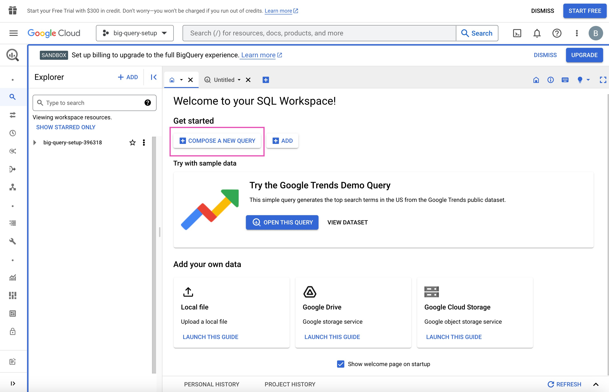
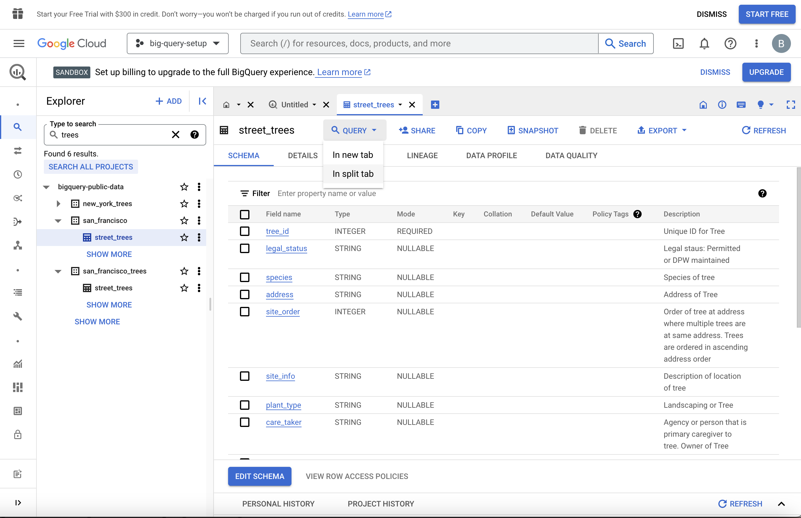
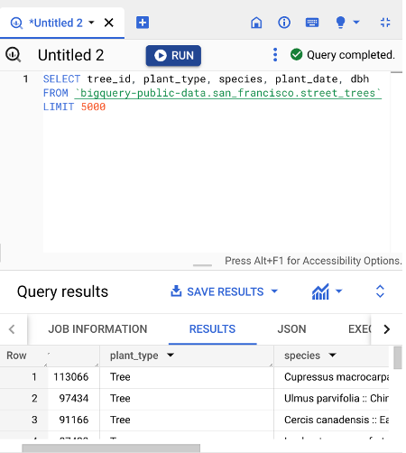

```{python}
#| include: false
import _setup
```
Imagine for a moment you're preparing a meal for friends. ​You have a recipe and raw ingredients, ​but this is the first time you'll cook the dish. ​Of course, you'll want your friends to enjoy it. ​If you're like me the idea of being judged on perfectly ​preparing a recipe the first time ​you've made it is scary. ​

Believe it or not this cooking example ​is what it's like to be ​a data professional during the discovery practice in EDA. ​The recipe you're trying to follow ​is equivalent to your company's project plan. ​You have everything you need at your disposal, ​a kitchen or a digital workspace ​with dedicated servers for data analysis computing, ​raw ingredients or a dataset ​and it's up to you on how to best mix, ​blend, and cook the ingredients in order ​to make a winning dish that your friends will enjoy. ​

In this lecture let's focus on raw ingredients. ​As a data professional you will be handling ​all different data in ​a number of different formats and file types. ​I will share with you the most common data sources, ​data formats, datatypes and a few Python functions. ​

Once you're familiar with the dataset source, ​format and the data types within it you'll be ready to ​handle questions or challenges ​as they arise during the analysis. ​

First, **when you're given ​data you'll want to know the source**. ​The term data source can have ​many different meanings in different contexts., ​but for our purposes we'll be defining ​data source as the location where the data originates. ​One good thing to know about ​a data source is how and when to ​contact subject matter experts such ​as engineers or database owners. ​These are the people who either generate ​the data or are in charge of delivering the datasets. ​When you have questions about the data as you do ​your discovery they will be the ones you reach out to. ​Knowing the ownership and source of ​the data is critical because by ​understanding the data source and who is responsible ​for it you can determine its reliability. ​Does the data owner have ​experience collecting and storing data? ​Does the data owner have ​any financial stake in the data's output? ​Understanding the source of ​the data will help you in telling ​the story of the data and ​make ethical decisions about its use.

​Another important part of determining ​the data source is understanding **how it's collected**. ​Whether the data was collected through ​a report from a computer system, ​a custom selection from a large online database, ​or a data table that has been manually entered, ​knowing about how the data was gathered will help ​you understand questions that may come up during EDA. ​For example, missing values ​could mean many different things. ​Maybe the database owners either ​didn't know or didn't want to disclose ​the data for manual entry or there might be ​lagging data or system bug from an online database. ​

The next thing you'll need to know about ​your data sources is the data **file format.** ​The main data formats you'll experience as a data ​professional are tabular files, XML files, ​CSV or comma-separated value files, spreadsheets, ​database files or JSON files ​which stands for JavaScript Object Notation. ​

Here are few examples of what these file types look like. ​If you've gotten this far into the program, ​you'll be familiar with **tabular** and Excel files by now. ​As you know they organize data in tables with ​data variables organized by rows and columns. ​Rows representing the objects, ​and columns representing aspects ​of the objects in the dataset. ​The advantage of this file type is ​a clear identification of patterns between variables. ​CSV files are simple text file which ​can be easy to import or store in other softwares, ​platforms, and databases. ​They look like rows of text and numbers ​separated by commas or other separators. ​The rows of data are broken up by ​commas rather than strict columns. ​The advantage of CSV files is ​more from a computer science aspect in ​that it is really ​a file type which is easily read even in a text editor. ​It is also easy to create and manipulate. ​In Python, you can use the `read_csv` function to read, ​write, and work with ​tabular data that is in the CSV format. ​

Database or DB for short is ​another way of storing data often in tables, ​indexes, or fields. ​Database files are great for searching and storage. ​They often require some basic knowledge ​of Structured Query Language or SQL. ​We will explore how to query data from ​databases in an upcoming section. ​

Lastly, JSON files are ​data storage files that are saved in a JavaScript format. ​You'll find the information in these files ​better resembles Python code, ​but with different language, function and format. ​JSON files may contain nested objects within them. ​You can think of nested objects as ​expandable file folders or ​drop-down menus within the code itself. ​For example a JSON file might have ​the ingredients for a recipe ​listed and under each ingredient, ​you'd have included nested information like weight, ​calories, and price as ​objects that define the ingredients. ​There are a few advantages of JSON files. ​They have a small message size. ​There are readable by almost any programming language, ​and they help coders easily ​distinguish between strings and numbers. ​There are Python libraries and ​functions built for working with JSON files. ​

You can import the JSON Python module into ​your Python notebook to use as ​an encoder and decoder of JSON files. ​There are also tools in the pandas called ​read_json and to_json, ​which will translate JSON files and convert ​an object to JSON format type, respectively. ​As a data professional, ​you may also be tasked to find ​data stories in other formats, ​like HTML, audio files, ​photos, email, text images, or text files. ​In every case, there are ​Python libraries or functions that can help ​you discover and structure ​the data for your research project. ​There is no best format for the data. ​It'll depend on the project and storage type. ​You're just looking for the format that ​best fits that particular dataset.

​Finally, the last raw ingredient ​in understanding data is **types of data**. ​You may already be familiar with ​the many different categories of data. ​As a reminder, there is a first, ​second, and third party data. ​First-party data is data that was ​gathered from inside your own organization. ​Second party data is data that was gathered outside ​your organization but directly from the original source. ​Finally, there's third party data, ​which is data gathered outside ​your organization and aggregated. ​Knowing the types of data, ​whether first, second, or third party, ​will help you be able to more efficiently answer or ​seek answers to the questions you ​may have that arise during analysis. ​For example if there are missing ​values in first-party data, ​then someone in your organization can help ​you determine whether the missing data can be recovered. ​For third-party data, you will likely ​have to reach out to a separate organization. ​You'll also be familiar with different types ​of data like geographic, ​demographic, numeric, ​time-based, financial, and qualitative data.

​Your job as a data professional require that ​you understand and work with all these types of data. ​Knowing the data source, ​format and type you're working with will ​help you to answer two very important questions. ​First, given what you know of the data so far, ​does it align with the plan ​as defined by your pace workflow? ​Second, do you have enough data ​to follow through with the plan in the pace workflow? ​If you've answered either these questions ​with a no or not sure, ​it is your job to reach out to the owners of the data ​and project stakeholders to ​inform them of the issue you found. ​For example, let's say you're assigned to predict ​the number of customers ​a retailer will expect to see next month. ​Unfortunately, we're only given ​profit margin data and ​only two months worth of customer purchase data. ​Because the profit margin data ​won't help you with returning ​customers and only two months of ​data won't give you much confidence and prediction, ​you should go back to the data source. ​You'll need customer purchase data from ​the last few years to ​accurately predict an upcoming month. ​Returning to the data source and requesting ​more data will keep everyone in the process, ​including you, focused on ​the plan that was ​established as part of your pace workflow. ​When you're working as a data professional, ​keeping this focus will be essential in identifying and ​carrying out high priority and value-add tasks. ​

As a data professional, ​you're expected to know what ​the data means and how to work with it ​to find solutions to ​business problems like cooking a meal, ​you'll be given the tools and ​ingredients you need to work on the problem. ​It is up to you to work with your team if there aren't ​enough ingredients or if what ​you've been given won't make a great dish.

------------------------------------------------------------------------

# Import datasets with Python

## How to import a dataset from a CSV file 

For this example, find a CSV file on your computer. If you don't have one, you can use a dataset of unicorn companies (companies that reached a valuation of \$1 billion USD) from this course's [Resources](https://www.coursera.org/learn/go-beyond-the-numbers-translate-data-into-insight/resources/9mSWv "Link to course resources").

There are several different ways to import a CSV file into Python, but we will only review some of the more common ways. Start by using a **with** statement and **open()** function. Pass the **file name (or file path)** of the CSV file to the **open()** function along with an argument for the **mode** parameter of the function.  

**with open("file path/file name", mode=)**

So the syntax so far is: `with open('file_path/file_name', mode=)` The mode is telling the Python library what to do with the file. When defining the **mode**, you use one of the following options: 

-   **'r'** – read

-   **'w'** – write

-   **'a'** – append

-   **'+'** – create new file

Typically, you’ll be defining the mode inside the **with open()** argument field as **'r'** because you want Python to open and read the CSV file. 

Next, we’ll add **as file** to the end, which is assigning the result to a variable name. In this case, we’ll name it **data**. 

``` python
with open('example_filepath/file', mode='r') as file: 
    data = file.read()
```

### **Importing a CSV file using pandas**

Instead of using Python's standard library to read a file, you can use pandas to import the CSV file into a dataframe. First, of course, you’ll want to import the pandas library into your Python notebook.

**import pandas as pd**

Next, you’ll use the **read_csv()** function to load the data into a dataframe. The file path then goes in the argument field.  

**df = pd.read_csv("file path/file name")**

``` python
    import pandas as pd
df = pd.read_csv(r'example_filepath/file')
```

***Note:** You can also use this same syntax for importing a CSV file that is stored on the internet. In the place of the filename, you would simply copy and paste the url.*

## How to import data by connecting to a database

There are a number of database solutions that you can connect to with Python, such as BigQuery, MySQL, SQLite, and Oracle. Databases are a convenient way for companies and organizations to store huge amounts of data. 

If the dataset is small enough, it can be downloaded and manipulated locally on your computer. However, often the datasets kept in databases are too large to access in their entirety on a personal computer. In this case you have a number of different options, most of which involve querying the database with SQL to obtain specific tables of interest. In other words, you extract select parts—usually specified rows and/or columns—from the whole dataset. The manner in which querying is done can vary with respect to systems, platforms, and interfaces. Because of this variability, this reference guide will only present a couple of different ways to query databases. Specifically, it will explore BigQuery, Google’s data warehouse that provides a wide range of tools and services to facilitate analysis.

### **Downloading data from BigQuery**

#### **Step 1: Access BigQuery**

BigQuery allows you to upload data for storage, and it also has a number of publicly available datasets to explore. You can access these public datasets for free using [BigQuery Sandbox](https://cloud.google.com/bigquery/docs/sandbox), which requires a free Google account. Sandbox gives you 10 GB of active storage and 1 TB of processed query data each month for free.

#### **Step 2: Perform a query**

Once you have authenticated your account and created a new project as indicated in the instructions linked in step one, you’re ready to query a database. Note that if it is your first time logging in, you may encounter a window asking “New to the BigQueryUI?” with a link to a quickstart guide.


From the “Welcome to your SQL Workspace!” page, click the “Compose a new query” button.



Click into the search bar in the Explorer on the left side of the page. For example, you can search for “trees.” Initially, this will return zero results. However, click “Search all projects” and it will return applicable datasets from the **bigquery-public-data** project and premade tables from those datasets. 

Click the **street_trees** table in the **san_francisco** dataset. The metadata for this table will appear in a panel to the right. Then, click “Query” from the menu at the top of the metadata panel. You can opt to query in a new tab or in a split-pane of the current window.





Once you are satisfied with your query, click the “Run” button at the top of the SQL query panel. The results will display below, and there is a button to “Save results,” which allows you to save the resulting table in different locations and formats. From there, you can read the data into your notebook.

### **Using notebooks within BigQuery**

Another way to access data on BigQuery is by using the tools within the BigQuery platform itself. This workflow more closely resembles what data professionals would use when working with very large datasets stored in the cloud. Essentially, **you set up a virtual machine on BigQuery**. A virtual machine is a computer that has its own CPU, memory, software, etc., just like any other computer, only it does not have its own dedicated hardware; they most often exist as a partition on a server. You can work in a Jupyter notebook on the virtual machine on the BigQuery platform, from which you can query and pull in data directly. 

This process requires you to set up a payment method. However, new users get a \$300 credit, and a ML instance is only a few cents per minute, so you’ll get approximately 2,000 hours of free usage before incurring any charges. There are a lot of great tutorials for setting this up. For instance, if you search for “How to use Jupyter notebook in Google Cloud AI,” you’ll find a number of useful videos and blogs on the topic.

### **Using notebooks outside of BigQuery**

It’s also possible to query data on BigQuery from notebooks that are not on the BigQuery platform. However, the details of this process are dependent on a number of factors, including the platform that is hosting the notebook, the operating environment, and the specific location of the data being accessed. Therefore, we will not go into depth on this method. Feel free to explore this on your own, though. You’ll find many helpful online resources that are just a search away.

## Key takeaways

There are lots of different kinds of data, which means there are numerous ways to import data. Learning several methods to import data, whether it be from a data file or a database, will build a solid foundation for your career as a data professional.

## Resources for more information

To learn more about importing data into Python, you can refer to the following links: 

-   [An overview of importing data in Python](https://towardsdatascience.com/an-overview-of-importing-data-in-python-ac6aa46e0889)

-   [How to connect to BigQuery from a Colab](https://colab.sandbox.google.com/notebooks/bigquery.ipynb#scrollTo=fkhbyGaXKs_6)

------------------------------------------------------------------------

# Pandas methods for the discovery of a dataset

## Python reference guide for EDA: Discovering

Use the following pandas methods and attributes to help you learn about a dataset when you encounter it for the first time.

Note: The following code will create a sample dataset:

```{python}
import pandas as pd
import numpy as np

# Set seed for reproducible random numbers
np.random.seed(42)

# Generate sample dataset
data = {
    'employee_id': range(101, 111),
    'department': np.random.choice(['Sales', 'Engineering', 'HR', 'Marketing'], size=10),
    'salary': [72000, 95000, 61000, np.nan, 105000, 88000, 67000, 92000, 78000, np.nan],
    'years_experience': [3.5, 7.0, 1.5, 10.0, 12.0, 5.0, 2.0, 8.5, 4.0, 6.0],
    'remote': np.random.choice([True, False], size=10),
    'performance_score': np.random.randint(1, 6, size=10)
}

df = pd.DataFrame(data)


```

**DataFrame.head()**

-   The **head()** method will display the first *n* rows of the dataframe. 

-   In the argument field, input the number of rows you want displayed in a Python notebook. The default is 5 rows. 

    ```{python}
    df.head()
    ```

### **DataFrame.info(X)**

-   The **info()** method will display a summary of the dataframe, including the range index, dtypes, column headers, and memory usage.

-   Leaving the argument field blank will return a full summary. As an option, in the argument field you can type in **show_counts=True**, which will return the count of non-null values for each column. 

```{python}
df.info()
```

### **DataFrame.describe()**

-   The **describe()** method will return descriptive statistics of the entire dataset, including total count, mean, minimum, maximum, dispersion, and distribution. 

-   Leaving the argument field blank will default to returning a summary of the data frame’s statistics. As an option, you can use “include=\[X\]” and “exclude=\[X\]” which will limit the results to specific data types, depending on what you input in the brackets. 

```{python}
df.describe()
```

### **DataFrame.shape**

-   **shape** is an attribute that returns a tuple representing the dimensions of the dataframe by number of rows and columns. Remember that attributes are not followed by parentheses. The code will look something like this: 

```{python}
df.shape
```

## Key takeaways

**head()**, **info()**, **describe()**, and **shape** are pandas tools that data scientists can use to understand a dataset at a high level. The information learned from using these tools will serve to inform the remainder of your EDA work when you use pandas to analyze data throughout your career.

## Resources for more information

For more information on the EDA discovering functions above and others like it, you can use the online Pandas reference guide: 

-   [A list of Pandas dataframe functions](https://pandas.pydata.org/docs/reference/frame.html)

------------------------------------------------------------------------

Now that you have a better understanding of ​exploratory data analysis and why it's important, ​let's do some discovering on a dataset similar to one ​you might work with in ​your career as a data professional. ​The National Oceanic and Atmospheric Administration, ​or NOAA, keeps ​a daily record of ​lightning strikes across much of North America. ​Let's imagine we've been tasked with performing EDA on ​this dataset so that it can be used to ​predict future lightning strikes in this region. ​In this video, we will use ​Python to do the EDA practice of ​discovering on data gathered by the NOAA in 2018. ​We will talk through the first ​steps data professionals would ​typically do when encountering ​a dataset for the first time. ​

Let's open up a Jupyter Python notebook to begin. ​First, we want to import the dataset we wish to ​analyze and ​the applicable python libraries we want to use. 

​​The NOAA dataset we will use is in the public domain, ​but we have provided ​a file to download so you can follow along. ​To begin, import ​the Python libraries and packages you plan to use. ​In our case, we'll use Pandas, ​NumPy and matplotlib.pyplot. ​To save time and increase efficiency, ​rename each library or ​package with a two-letter abbreviation, ​pd, np and plt, dt respectively. ​Another quick tip for saving time. 

```{python}
import pandas as pd
import numpy as np
import datetime as dt
import matplotlib.pyplot as plt
```

​Instead of clicking Run cell, ​you can always use the keyboard shortcut, ​Control or Command Enter. ​You may recall that Python packages ​like Pandas and NumPy are ​open source code packages that have been pre-designed and ​coded to help analyze and ​manipulate data more efficiently.  ​Pyplot is a package focused ​on plotting charts and visualizations. ​Most data professionals import ​all their commonly used libraries, ​packages, and modules at ​the beginning of any coding session. ​But you can import them at ​any time while working with data in a Python notebook.  ​The pandas conversion function to ​date time is incredibly ​helpful when working with dates and times. ​We will first convert our date column to datetime, ​which will split up the date objects into ​separate data points of year, month, and day. 

​This is good practice because throughout your career, ​you'll be grouping data by ​various time segments. We'll get to that later. 

​After running these initial functions, ​you are ready to begin your EDA ​discovering practice with this dataset. 

```{python}
df = pd.read_csv(r'Datasets/eda_using_basic_data_functions_in_python_dataset1.csv')
```

​Let's begin with the head method or function. ​Head will return as many rows of ​data as you input in the argument field. ​We'll look first at the top ten rows. ​When I input head with a ​ten in the argument of field and click "Run", ​the first ten rows of ​the dataset are now in our notebook. 

​This dataset contains three columns of data, ​date, number of strikes, ​and center point geom. ​At this point in the exercise, ​we will need to clearly understand ​what each of these columns means. ​Date and number of strikes are fairly straightforward. ​You'll want to pay attention to ​any dates and their format, ​which in this case is year, month, date. ​You'll also find when looking at the date column, ​that lightning strike data is recorded almost every ​day for at least one location in the year 2018. ​Some column headers are obvious, ​but some like the column header, ​center point geom aren't. ​If you are not sure about what ​the column headers mean ​while you're working on a project, ​you could go back to the public documentation available ​from the NOAA to confirm its meaning. 

```{python}
# Inspect the first 10 rows.
df.head(10)
```

​For this video, the information is provided. ​The center point geom column refers to ​the longitude and latitude of the recorded strikes. ​

We know the number of columns, ​but we also want to know ​how many rows and data we'll be working with.

```{python}
df.shape
```

 ​Another great EDA discovering tool is the info function. ​The method called Info gives ​the total number and datatypes of individual entries. ​Keep in mind that datatypes are called D types in Pandas. ​If we type df.info into our notebook and run it, ​we will get this output. 

```{python}
df.info()
```

**Convert the date column to datetime**

`info` will provide the total number of rows (3,401,012) and columns (3). It will also state the names and data types of each column, as well as the size of the dataframe in memory.

In this case, notice that the `date` column is an 'object' type rather than a 'date' type. Objects are strings. When dates are encoded as strings, they cannot be manipulated as easily. Converting string dates to datetime will enable you to work with them much more easily.

Let's convert to datetime using the pandas function `to_datetime()`.

```{python}
# Convert date column to datetime
df['date']= pd.to_datetime(df['date'])

```

​Our range index tells us our total number of ​entries, nearly 3.5 million. ​We also find that the data values in our date and ​center_point_geom columns are classified as objects, ​and the data in ​our number_of_strikes data column is classified as int64. ​Int64 refers to integer64. ​It means that the datatype ​contains integers or numbers between ​negative two to the power of 63 and two to the power of 63. ​Simply put, int64 is a standard integer somewhere ​between negative 9 quintillion ​and positive 9 quintillion. ​There's one more Dtype you might ​see when performing the info function, ​str, which refers to a string. ​Like objects, you'll likely ​be familiar with strings already. 

​Strings are sequences of characters ​or integers that are unchangeable. ​Getting back to the dataset we have ​a pretty good idea about its size and scope. ​We know it has three columns and we know ​it has 3,401,012 rows. ​We know what the columns mean. 

​There are other methods or functions that we ​could use during our practice for discovering. ​For example, the methods describe, ​sample, size, ​and shape are all useful for learning about a dataset. ​For this dataset though, ​we have what we need in order to understand what is going ​on in the dataset from a discovery standpoint. 

​Next, let's determine which months have ​the most lightning strikes ​by plotting our first visualization. ​

Remember, your dataset has over three million rows. ​If we don't do any categorizing or grouping, ​we can end up with a notebook that is ​stuck endlessly trying to run the code. ​

We've already converted our date column to datetime, ​which makes it easy for ​us to manipulate the data in the column. ​We want to group ​our daily strikes into something more manageable, ​like months, for example. ​Let's make our date reference ​the number each month corresponds to in a year. ​That is, January is one, ​February is two, and so on. 

​We'll do that by creating the column month using ​the code df, date,.dt.month. ​Dt in this instance stands for datetime. 

```{python}
# Create a new `month` column
df['month'] = df['date'].dt.month
df.head()
```

​Next, we'll make it easier to interpret on a chart. ​Let's convert the month data, ​which are currently numbers to month name abbreviations. ​We'll do this by creating another column, ​month underscore txt. ​This code will take the string of characters or ​month names and slice to ​include only the first three letters. 

```{python}
# Create a new `month_txt` column.
df['month_txt'] = df['date'].dt.month_name().str.slice(stop=3)
df.head()
```

​Before we try to plot this data on a chart, ​we need to sum the numbers of ​strikes in all locations by month. 

​We can do this by creating a DataFrame ​using the groupby function in which we will ​include the columns month and month_txt ​because these are the columns we will ​use to group and order the lightning strikes. ​We'll use the sum function to add ​the lightning strikes for each month together. 

```{python}
# Create a new helper dataframe for plotting.
df_by_month = df.groupby(['month','month_txt'])[['number_of_strikes']].sum().sort_values('month', ascending=True).head(12).reset_index()
df_by_month
```

​For our last lines of code in this video, ​let's plot the number of strikes ​by month for the year 2018 ​into a bar chart and ​then total number of strikes by state on a map. ​This will help us get a good sense of the data story. 

​You'll find that this looks like a big block of code, ​but because we are using the matplotlib.pyplot, ​the actual code for ​the visualization is not too difficult to follow.

```{python}
plt.bar(x=df_by_month['month_txt'],height= df_by_month['number_of_strikes'], label="Number of strikes")
plt.plot()

plt.xlabel("Months(2018)")
plt.ylabel("Number of lightning strikes")
plt.title("Number of lightning strikes in 2018 by months")
plt.legend()
plt.show()
```

​First, we have the plt.bar function which will ​have us enter the data columns we wish to ​plot with x-axis first, ​month underscore txt, ​followed by height or y-axis, ​which we will fill in with number ​underscore of underscore strikes. ​Next, we will give the bars a legend or label, ​as it's called in Python, ​which we will input as number of strikes. 

​Lastly, we'll fill in our bar graph details with ​the x and y-axis labels and the visualization title. ​Leave the legend and show argument fields blank for now. ​After we run the code you'll see that ​August 2018 had the most lightning strikes, ​while November and December 2018 ​had the least amount of strikes. ​Now you've completed your first experience coding ​for an EDA practice in Python. ​Very well done. ​We've a lot more to talk about and this is a great start.