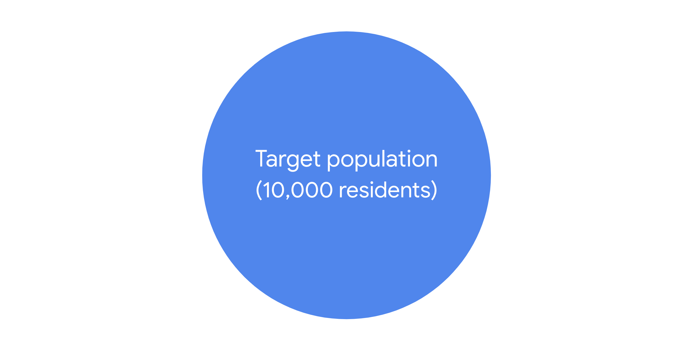
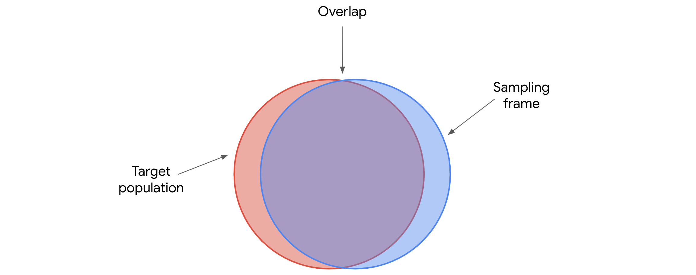
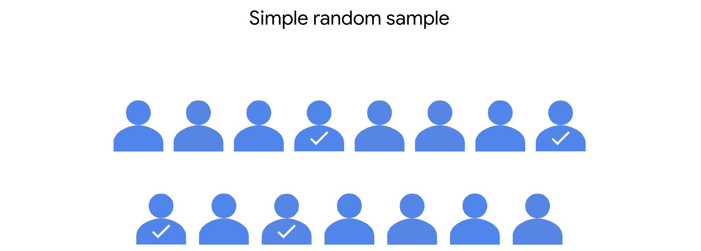
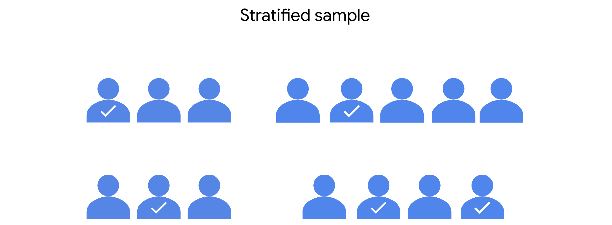
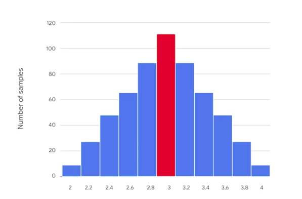
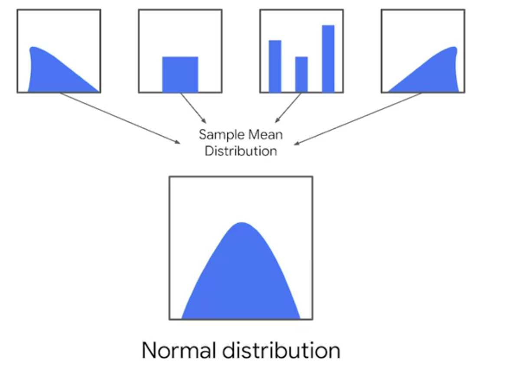
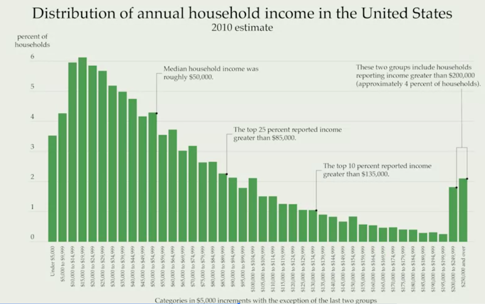
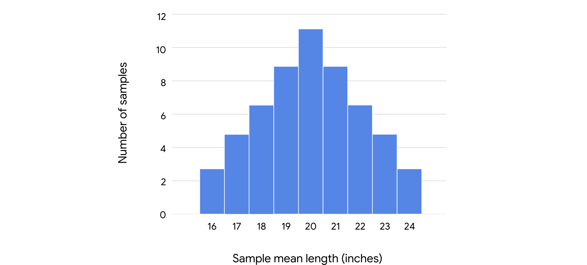
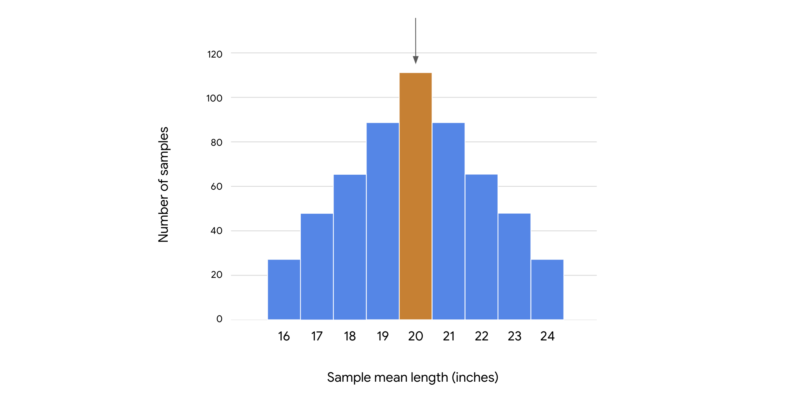

```{python}
#| include : false
import _setup
```

​You've learned a lot so far. ​You now have a better understanding of the essential role statistics plays in data ​science. ​You also have a solid foundation for using descriptive statistics and ​basic probability to describe, analyze and interpret data. ​

Your knowledge of the fundamental concepts of statistics is the first step on a path ​that leads to more advanced methods like hypothesis testing and ​regression analysis. ​What's really exciting is that this learning journey will continue throughout ​your future career as a data professional. ​The amount of data in the world is always growing and ​the data career space is constantly advancing. ​I often read about new machine learning methods to keep up with the changes in ​the field and develop new skills to use at work.

​The next stage of your journey is all about sampling or ​the process of selecting a subset of data from a population. ​For example if you want to survey a population of 100,000 people you ​can select a representative sample of 100 people. ​Then you can draw conclusions about the population based on your sample data ​coming up.

​We'll go over how the sampling process works and how data professionals use ​sample data to better understand larger populations recall that in statistics, ​a population can refer to any type of data including people objects, events, ​measurements and more.

​We'll start with a review of inferential statistics and ​examine the concept of a representative sample. ​Next we'll go over the different stages of the sampling process from choosing ​a target population to collecting data for your sample. ​

Then we'll explore the two main types of sampling methods, probability sampling and ​non probability sampling. ​We'll discuss the benefits and drawbacks of various sampling methods and ​describe how random sampling can help ensure that your sample is representative ​of the population, will also introduce different forms of bias and ​sampling like under coverage and non response bias and ​how they can affect non probability sampling methods.

​After that, we'll explore sampling distributions, ​which are probability distributions for sample statistics. ​You learn about sampling distributions for both sample means and proportions and ​how to estimate the corresponding values for populations. ​We'll also cover the central limit theorem and how it ​can help you estimate the population mean for different types of datasets.

​Finally, you learn how to use python's Saipi stats module to ​work with sampling distributions and make a point estimate of the population mean.

------------------------------------------------------------------------

Earlier in the course, we briefly discussed the difference between ​descriptive and inferential statistics. ​

**Descriptive statistics like the mean and ​standard deviation summarize the main features of the dataset.**

**​Inferential statistics use sample data to draw conclusions or ​make predictions about a larger population**. ​

Now we're going to return to inferential statistics and ​explore the relationship between sample and population in more detail. ​This part of the course is all about sampling, ​the process of drawing a subset of data from a population. ​

In this video, ​we'll discuss how data professionals use sampling in data science and ​the importance of working with the sample that is representative of the population. ​

Data professionals use sampling to analyze many different types of data. ​Here are some questions that sampling has helped my data science team answer, ​how many products in an app store do we need to test to feel confident ​that all the products are secure from malware? ​How do we select a sample of users to run an effective A/B test for ​an online retail store? ​And how do we select a sample of customers of a video streaming service to get ​reliable feedback on the shows they watch?

​Sampling is useful in data science because selecting a sample requires less time ​than collecting data on every item in a population. ​Using a sample saves money and resources and ​analyzing a sample is more practical than analyzing an entire population. ​This is especially important in modern data analytics ​where you often deal with extremely large datasets. ​For example, let's say you want to know the percentage of people in a large city ​who uses a laptop computer. ​One way to do this is to survey every resident in the city. ​First, it would be very difficult to access contact information for ​every resident of the city. ​Second, giving a survey to every resident of the city would be very expensive, ​complicated and time consuming. ​Another way is to find a much smaller subset of residents and ​give them a survey. ​This subset is your sample, then you can use the sample data you collect about ​laptop use to draw conclusions about the laptop use of the entire population. ​Collecting a sample is faster, more practical and ​less expensive than collecting data on every member of the population. ​

Keep in mind that your sample should be representative of your population. ​Recall that a representative sample accurately reflects the characteristics of ​a population. ​The inferences and ​predictions you make about your population are based on your sample data. ​If your sample doesn't accurately reflect your population, ​then your inferences will not be reliable and your predictions will not be accurate. ​And this can lead to negative outcomes for stakeholders and organizations. ​For instance, let's say you only contact computer scientists for ​your laptop survey. ​Your sample will not accurately reflect the overall population. ​Computer scientists are much more likely to use a laptop computer than the typical ​city resident. ​Many residents may not have access to any kind of computer or ​even know how to use one. ​A sample that only includes computer scientists is not representative. ​A representative sample would include people with different levels of computer ​knowledge and access.

​Let's consider another scenario. ​Imagine you want to find out the average height of every adult in ​the United States, that's a lot of people. ​It would take an incredible amount of time, energy and ​money to even attempt to measure every person in the country. ​Instead you can take a sample of 100 people and ​use that sample data to draw conclusions about the entire population. ​Now, let's say you have sample data only from professional basketball players. ​Pro basketball players are really tall, some are over seven feet tall. ​On average, they're much taller than almost everybody else in the population. ​Their average height does not accurately reflect the average height of the overall ​population. ​A sample that includes only pro basketball players is not representative of every ​adult in the US.

​As a data professional, I work with sample data every day. ​I can tell you that having a representative sample is super important. ​A wise teammate of mine once said that a good model can't overcome a bad sample. ​

------------------------------------------------------------------------

Earlier, you learned that **inferential statistics** use sample data to draw conclusions or make predictions about a larger population. Data professionals use inferential statistics to gain valuable insights about their data. 

In this reading, you’ll learn about the relationship between sample and population in more detail. We’ll also discuss how data professionals use sampling in data work, and the importance of working with a sample that is representative of the population.  

# Population and Sample 

## **Population vs. sample**

In statistics, a **population** includes every possible element that you are interested in measuring, or the entire dataset that you want to draw conclusions about. A statistical population can refer to any type of data, including:

-   People

-   Organizations

-   Objects

-   Events

-   And more 

For instance, a population might be the set of:  

-   All students at a university

-   All the cell phones ever manufactured by a company

-   All the forests on Earth 

A **sample** is a subset of a population. 

Samples drawn from the above populations might be: 

-   The math majors at the university

-   The cell phones manufactured by the company in the last week

-   The forests in Canada

Data professionals use samples to make inferences about populations. In other words, they use the data they collect from a small part of the population to draw conclusions about the population as a whole.

## **Sampling**

**Sampling** is the process of selecting a subset of data from a population.

In practice, it’s often difficult to collect data on every member or element of an entire population. A population may be very large, geographically spread out, or otherwise difficult to access. Instead, you can use sample data to draw conclusions, make estimates, or test hypotheses about the population as a whole.

Data professionals use sampling because: 

-   It’s often impossible or impractical to collect data on the whole population due to size, complexity, or lack of accessibility 

-   It’s easier, faster, and more efficient to collect data from a sample

-   Using a sample saves money and resources 

-   Storing, organizing, and analyzing smaller datasets is usually easier, faster, and more reliable than dealing with extremely large datasets 

### Example: election poll 

Imagine you’re a data professional working in a country with a large population like India, Indonesia, the United States, or Brazil. There is an upcoming national election for president. You want to conduct an election poll to see which candidate voters prefer. Let’s say the population of eligible voters is 100 million people. To survey 100 million people on their voting preferences would take an enormous amount of time, money, and resources – even assuming it would be possible to locate and contact all voters, and that all voters would be willing to participate. 

However, it is realistic to survey a sample of 100 or 1000 voters drawn from the larger population of all voters. When you’re dealing with a large population, sampling can help you make valid inferences about the population as a whole. 

## **Representative sample**

To make valid inferences or accurate predictions about a population, your sample should be representative of the population as a whole.  Recall that a **representative sample** accurately reflects the characteristics of a population. The inferences and predictions you make about your population are based on your sample data. If your sample doesn’t accurately reflect your population, then your inferences will not be reliable, and your predictions will not be accurate. And this can lead to negative outcomes for stakeholders and organizations. 

Statistical methods such as probability sampling help ensure your sample is representative by collecting random samples from the various groups within a population. These methods help reduce sampling bias and increase the validity of your results. You’ll learn more about sampling methods later on. 

### Example: election poll 

Ideally, the sample for your election poll will accurately reflect the characteristics of the overall voter population. A voter population in a large country will be diverse in political perspectives, geographic location, age, gender, race, education level, socioeconomic status, etc. Your sample will not be representative if you only collect data from people who belong to certain groups and not others. For example, if you survey people from one political party, or who have advanced degrees, or are older than 70. The results of an election poll based on a non-representative sample will not be accurate. In general, any claims or inferences you make about any  population will have more validity if they are based on a representative sample. 

# Key takeaways 

Data professionals work with powerful statistical tools that can model complex datasets and help generate valuable insights. But, if the sample data you’re working with doesn’t accurately reflect your population—that is, if your sample is not representative—then it doesn’t matter how good your model is. If your predictive model is based on a bad sample, then your predictions will not be accurate.

Ultimately, the quality of your sample helps determine the quality of the insights you share with stakeholders. To make reliable inferences about a population, make sure your sample is representative of the population. 

------------------------------------------------------------------------

# The Sampling process

As a data professional, you'll work with sample data all the time. ​Often this will be sample data previously collected by other researchers. ​Sometimes your team may collect their own data. ​Either way, it's important to know how the sampling process works ​because it directly affects the quality of your sample data. ​

The sampling process helps determine whether your sample is representative of ​the population and whether your sample is unbiased. ​If you estimate the mean height of a country's total adult population based on ​a sample of professional basketball players, ​your estimate will not be accurate. In this video, ​we'll go over the main stages of the typical sampling process. ​This will give you a useful framework for understanding how sampling is conducted ​and how the sampling process can affect your sample data. ​

To get a clear overview of the sampling process, let's divide it into five steps. 

-   ​Step one, identify the target population. ​

-   Step two, select the sampling frame. 

-   ​Step three, choose the sampling method.

-   Step four, ​determine the sample size, and

-   step five, collect the sample data.

As an example, ​let's consider a public opinion poll. 

​Imagine the city government of Vancouver, Canada wants to build a new subway system. ​The public will vote on whether or not to move forward with the project. ​The city government wants to find out if there's public support for the project. ​They ask you to take a poll and ​estimate the percentage of adult residents that support the project. ​Legal adults are 18 years or older. ​The first stage in the sampling process is to identify your target population. ​The target population is the complete set of elements that you're interested in ​knowing more about. 

​In this case, the target population includes every resident in the city who ​is 18 years or older and eligible to vote. ​Let's say that the city contains 100,000 such residents. Since it's too difficult ​and too expensive to survey everyone in the target population, ​you decide to take a sample. ​

The next step in the sampling process is to create a sampling frame. ​**A sampling frame is a list of all the items in your target population.** ​Basically, it's a complete list of everyone or everything you're interested ​in researching. The difference between a target population and ​a sampling frame is that the population is general and the frame is specific. 

​So if your target population is 100,000 city residents who are 18 years or ​older and eligible to vote, your sampling frame could be a list of names for ​all these residents--from Alana Aoki to Zoe Zappa. ​For practical reasons, **​your sampling frame may not accurately match your ​target population because you may not have access to every member of the population**. ​For instance, the city may not have reliable contact information about each ​resident, or perhaps not all eligible voters are actually registered to vote, ​so their opinions about the potential subway system aren't relevant, since ​the project will be decided by an election. For reasons like these, ​your sampling frame will not exactly overlap with your target population. ​Your sampling frame will include the list of residents 18 or ​over that you're able to obtain useful information about. ​So the sampling frame is the accessible part of your target population. ​

Next, you need to choose a sampling method, which is step three of the sampling ​process. ​One way to help ensure that your sample is representative is to choose the right ​sampling method. ​

There are two main types of sampling methods: probability sampling and ​non-probability sampling. In later videos, ​we'll explore the specifics in more detail. For now, ​just know that **probability sampling uses random selection to generate a sample**. ​**Non-probability sampling is often based on convenience or ​the personal preferences of the researcher rather than random selection**. ​Because probability sampling methods are based on random selection, every person ​in the population has an equal chance of being included in the sample. ​This gives you the best chance to get a representative sample, as your results ​are more likely to accurately reflect the overall population. 

​So, assuming you have the budget and the time, you can use a probability sampling ​method for your poll about the subway project. ​Using random selection gives you the best chance of getting a sample that's ​representative of your population. ​

Step four of the sampling process is to determine the best size for your sample, ​since you don't have the resources to pull everyone in your sampling frame. In ​statistics, **sample size refers to the number of individuals or items chosen for ​a study or experiment**. ​Sample size helps determine the accuracy of the predictions ​you make about the population. In general, ​the larger the sample size, ​the more accurate your predictions. Based on the desired level of accuracy for ​your survey, you can decide how many eligible voters to include in your sample. 

​Now, you're ready to collect your sample data. ​This is the final step in the sampling process. ​To pull the residents selected for your sample, ​you decide to conduct a survey. Based on the survey responses, ​you determine the percentage of eligible voters 18 and ​over who favor the proposed subject project. ​Then, you share this information with city leaders to help them make a more informed ​decision.

Effective sampling ensures that your sample data is representative of your ​target population. ​Then, when you use sample data to make inferences about the population, ​you can be reasonably confident that your inferences are reliable. 

​Your poll will give city leaders a better idea of public support for ​the new subway and help inform future decisions about the project. ​The decisions you make at each step of the sampling process can affect the quality of ​your sample data. ​Understanding the sampling process will make you a better data professional, ​whether you're analyzing data collected by other researchers or ​conducting a survey on your own. 

------------------------------------------------------------------------

# The stages of the sampling process

Recently, you’ve been learning about sampling. As a data professional, you’ll work with sample data all the time. Often, this will be sample data previously collected by other researchers; sometimes, your team may collect their own data. Either way, it’s important to know how the sampling process works, because it helps determine whether your sample is representative of the population, and whether your sample is unbiased. 

In this reading, we’ll go over the main stages of the sampling process in more detail. This will give you a better understanding of how the sampling process works and how each step of the process can affect your sample data. 

# The sampling process

First, let’s review the main steps of the sampling process:

1.  Identify the target population

2.  Select the sampling frame

3.  Choose the sampling method

4.  Determine the sample size 

5.  Collect the sample data

Let’s explore each step in more detail with an example. Imagine you’re a data professional working for a company that manufactures home appliances. The company wants to find out how customers feel about the innovative digital features on their newest refrigerator model. The refrigerator has been on the market for two years and 10,000 people have purchased it. Your manager asks you to conduct a customer satisfaction survey and share the results with stakeholders. 

## **Step 1: Identify the target population**

The first step in the sampling process is defining your target population. The **target population** is the complete set of elements that you’re interested in knowing more about. Depending on the context of your research, your population may include individuals, organizations, objects, events, or any other type of data you want to investigate. 

A well-defined population reduces the probability of including participants who do not fit the precise scope of your research. For example, you don’t want to include all the company’s customers, or customers who purchased the company’s other refrigerator models. 

In this case, your target population will be the 10,000 customers who purchased the company’s newest refrigerator model. These are the customers you want to survey to learn about their experience with the newest model. 



## **Step 2: Select the sampling frame**

The next step in the sampling process is to create a sampling frame. A **sampling frame** is a list of all the individuals or items in your target population. 

The difference between a target population and a sampling frame is that the population is general and the frame is specific. So, if your target population is all the customers who purchased the refrigerator, your sampling frame could be an alphabetical list of the names of all these customers. The customers in your sample will be selected from this list. 

Ideally, your sampling frame should include the entire target population. However, for practical reasons, your sampling frame may not exactly match your target population, because you may not have access to every member of the population. For instance, the company’s customer database may be incomplete, or contain data processing errors. Or, some customers may have changed their contact information since their purchase, and you may be unable to locate or contact them. Furthermore, sometimes the sampling frame might include elements outside of the target population simply by accident or because it is impossible to know the target population with certainty.



Therefore, generally your sampling frame is the *accessible* part of your target population, but sometimes it will include elements apart from this set.

## **Step 3: Choose the sampling method**

The third step in the sampling process is choosing a sampling method. 

There are two main types of sampling methods: **probability sampling** and **non-probability sampling**. Later on, we’ll explore the specific methods in more detail. For now, just know that probability sampling uses random selection to [generate a sample](https://www.statisticshowto.com/sample/). Non-probability sampling is often based on convenience, or the personal preferences of the researcher, rather than random selection. Often, probability sampling methods require more time and resources than non-probability sampling methods. 

Ideally, your sample will be representative of the population. One way to help ensure that your sample is representative is to choose the right sampling method. Because probability sampling methods are based on random selection, every element in the population has an equal chance of being included in the sample. This gives you the best chance to get a representative sample, as your results are more likely to accurately reflect the overall population.

So, assuming you have the budget, the resources, and the time, you should use a probability sampling method for your survey.  

## **Step 4: Determine the sample size**

Step four of the sampling process is to determine the best size for your sample, since you don’t have the resources to survey everyone in your sampling frame. In statistics, sample size refers to the number of individuals or items chosen for a study or experiment. 

Sample size helps determine the precision of the predictions you make about the population. In general, the larger the sample size, the more precise your predictions. However, using larger samples typically requires more resources. 

The sample size you choose depends on various factors, including the sampling method, the size and complexity of the target population, the limits of your resources, your timeline, and the goal of your research. 

Based on these factors, you can decide how many customers to include in your sample.

## **Step 5: Collect the sample data**

Now, you’re ready to collect your sample data, which is the final step in the sampling process. 

You give a customer satisfaction survey to the customers selected for your sample. The survey responses provide useful data on how customers feel about the digital features of the refrigerator. Then, you share your results with stakeholders to help them make more informed decisions about whether to continue to invest in these features for future versions of this refrigerator, and develop similar features for other models. 

# Key takeaways

Effective sampling ensures that your sample data is representative of your population. Then, when you use sample data to make inferences about the population, you can be reasonably confident that your inferences are reliable. 

The decisions you make at each step of the sampling process can affect the quality of your sample data. Understanding the sampling process will make you a better data professional, whether you’re analyzing data collected by other researchers or conducting a survey on your own. 

------------------------------------------------------------------------

# Compare sampling methods

In a previous video, ​you learned the differences between ​probability and non-probability sampling. ​Then you conducted a survey using probability sampling, ​which is the third step of the sampling process. ​In this video, you will learn more ​about the different methods of probability sampling. ​Then we'll discuss the benefits ​and drawbacks of each method.

​There are four different probability sampling methods:

-   ​simple random sampling, ​

-   stratified random sampling,

-   cluster random sampling, ​and

-   systematic random sampling.

# Simple Random Sample

**​In a simple random sample, ​every member of a population is selected ​randomly and has an equal chance of being chosen.** ​You can randomly select members using ​a random number generator or by ​another method of random selection.

​For example, say you want to survey ​the employees of a company about their work experience. ​The company employs 1,000 people. ​You can assign each employee in ​the company database a number from 1-1,000, ​and then use a random number generator to ​select 100 people for your sample. ​**The main benefit of ​simple random samples is that they're usually fairly ​representative since every member of ​the population has an equal chance of being chosen**. ​Random samples tend to **avoid bias** ​and surveys like these give you more accurate results. ​However, in practice, ​it's often expensive and time-consuming to ​conduct large, simple random samples. **​If your sample size is not large enough, ​a specific group of people in ​the population may be underrepresented in your sample**. ​If you use a larger sample size, ​your sample will more accurately reflect the population. ​

# Stratified random sample

**The next method of probability sampling ​is a stratified random sample. ​In a stratified random sample, ​you divide a population into groups and ​randomly select some members ​from each group to be in the sample.** ​These groups are called strata. ​Strata can be organized by age, gender, ​income, or whatever category ​you're interested in studying. ​For example, say you want to survey high school students ​about how much time they spend studying on weekends. ​You might divide the student population ​according to age: 14, ​15, 16, and 17-year-olds.

​Then you can survey an equal number ​of students from each age group. ​**Stratified random samples help ensure that members ​from each group in the population ​are included in the survey. ​This method allows you to draw ​more accurate conclusions about the relevant groups.** ​For instance, 14-year-olds and 17-year-olds, ​may have different perspectives ​about studying on the weekends. ​Older students can drive and may have ​more social activities or work on the weekends. **​Stratified sampling will capture both perspectives. ​One main disadvantage of ​stratified sampling is that it can be difficult to ​identify appropriate strata for ​a study if you lack knowledge of a population.**

​For example, if you want to study ​median income among a population, ​you may want to stratify your sample by job type, ​or industry, or location, or education level. ​If you don't know how relevant ​these categories are to median income, ​it will be difficult to choose ​the best one for your study.

# Cluster random sample

The next method of probability sampling ​is a cluster random sample. **​When you're conducting a cluster random sample, ​you divide a population into clusters, ​randomly select certain clusters, ​and include all members from ​the chosen clusters in the sample.** ​Cluster sampling is similar ​to stratified random sampling, ​but in stratified sampling, ​you randomly choose some members ​from each group to be in the sample. ​In cluster sampling, you choose ​all members from a group to be in the sample. ​Clusters are divided using ​identifying details, such as age, ​gender, location, or whatever you want to study.

​For example, imagine you want to conduct a survey of ​employees at a global company using cluster sampling. ​The company has 10 offices ​in different cities around the world. ​Each office has about the same number of ​employees and similar job roles. ​You randomly select three offices ​in three different cities as clusters. ​You include all the employees at ​the three offices in your sample. ​**One advantage of this method is that a cluster sample ​gets every member from a particular cluster, ​which is useful when each cluster ​reflects the population as a whole. ​This method is helpful when dealing with ​large and diverse populations that ​have clearly defined subgroups.**

​If researchers want to learn about ​the preferences of primary school students in Oslo, ​Norway, they can use one school as ​a representative sample of all schools in the city. ​**A main disadvantage of ​cluster sampling is that it may be difficult ​to create clusters that accurately ​reflect the overall population.** ​For example, for practical reasons, ​you may only have access to the offices in ​the United States when your company ​has locations all over the world. ​Employees in the United States may have ​different characteristics and values ​than employees in other countries. ​

# Systematic random sample

The final method of probability sampling ​is a systematic random sample. **​In systematic random samples, ​you put every member of ​a population into an ordered sequence. ​Then you choose a random starting point ​in the sequence and ​select members for your sample at regular intervals.**

​Let's assume you want to survey ​students at a community college. ​For a systematic random sample, ​you'd put the students' names in alphabetical order, ​randomly choose a starting point, ​and pick every fifth name to be in the sample. ​Systematic random samples are ​often representative of the population ​since every member has ​an equal chance of being included in the sample. ​Whether the student's last name starts with B ​or R isn't going to affect their characteristics. ​Systematic sampling is also quick and ​convenient when you have ​a complete list of the members of your population. ​**One disadvantage of ​systematic sampling is that you need to ​know the size of the population ​that you want to study before you begin.** ​If you don't have this information, ​it's difficult to choose consistent intervals.

​The four methods of probability sampling we've covered, ​simple, stratified, cluster, ​and systematic, are all based on random selection, ​which is the preferred method of ​sampling for most data professionals. ​These methods can help you create ​a sample that is representative of the population. ​In an upcoming video, ​we'll check out some methods of ​non-probability sampling and why ​they're not considered representative.

------------------------------------------------------------------------

Earlier, you learned that there are two main types of sampling methods: probability sampling and non-probability sampling. **Probability sampling** uses random selection to generate a [sample](https://www.statisticshowto.com/sample/). **Non-probability sampling** is often based on convenience, or the personal preferences of the researcher, rather than random selection. The sampling method you use helps determine if your sample is representative of your population, and if your sample is biased. Probability sampling gives you the best chance to create a sample that is representative of the population.

In this reading, you’ll learn more about the different methods of probability sampling, and the benefits and drawbacks of each method. 

# Probability Sampling Methods 

There are four different probability sampling methods: 

-   Simple random sampling

-   Stratified random sampling

-   Cluster random sampling

-   Systematic random sampling

Let’s explore each method in more detail.

## **Simple random sampling**

In a **simple random sample**, every member of a population is selected randomly and has an equal chance of being chosen. You can randomly select members using a random number generator, or by another method of random selection.



For example, imagine you want to survey the employees of a company about their work experience. The company employs 10,000 people. You can assign each employee in the company database a number from 1 to 10,000, and then use a random number generator to select 100 people for your sample. In this scenario, each of the employees has an equal chance of being chosen for the sample. 

The main benefit of simple random samples is that they’re usually fairly representative, since every member of the population has an equal chance of being chosen. Random samples tend to avoid bias, and surveys like these give you more reliable results. 

However, in practice, it’s often expensive and time-consuming to collect large simple random samples. And if your sample size is not large enough, a specific group of people in the population may be underrepresented in your sample. If you use a larger sample size, your sample will more accurately reflect the population.

## **Stratified random sampling**

In a **stratified random sample**,you divide a population into groups, and randomly select some members from each group to be in the sample. These groups are called strata. Strata can be organized by age, gender, income, or whatever category you’re interested in studying. 



For example, imagine you’re doing market research for a new product, and you want to analyze the preferences of consumers in different age groups. You might divide your target population into strata according to age: 20-29, 30-39, 40-49, 50-59, etc. Then, you can survey an equal number of people from each age group, and draw conclusions about the consumer preferences of each age group. Your results will help marketers decide which age groups to focus on to optimize sales for the new product. 

Stratified random samples help ensure that members from each group in the population are included in the survey. This method helps provide equal representation for underrepresented groups, and allows you to draw more precise conclusions about each of the strata. There may be significant differences in the purchasing habits of a 21-year-old and a 51-year-old. Stratified sampling helps ensure that both perspectives are captured in the sample. 

One main disadvantage of stratified sampling is that it can be difficult to identify appropriate strata for a study if you lack knowledge of a population. For example, if you want to study median income among a population, you may want to stratify your sample by job type, or industry, or location, or education level. If you don’t know how relevant these categories are to median income, it will be difficult to choose the best one for your study. 

## **Cluster random sampling**

When you’re conducting a **cluster random sample**, you divide a population into clusters, randomly select certain clusters, and include all members from the chosen clusters in the sample. 

Cluster sampling is similar to stratified random sampling, but in stratified sampling, you randomly choose *some* members from each group to be in the sample. In cluster sampling,  you choose *all* members from a group to be in the sample. Clusters are divided using identifying details, such as age, gender, location, or whatever you want to study

For example, imagine you want to conduct an employee satisfaction survey at a global restaurant franchise using cluster sampling. The franchise has 40 restaurants around the world. Each restaurant has about the same number of employees in similar job roles. You randomly select 4 restaurants as clusters. You include all the employees at the 4 restaurants in your sample.

One advantage of this method is that a cluster sample gets every member from a particular cluster, which is useful when each cluster reflects the population as a whole. This method is helpful when dealing with large and diverse populations that have clearly defined subgroups. If researchers want to learn more about home ownership in the suburbs of Auckland, New Zealand, they can use several well-chosen suburbs as a representative sample of all the suburbs in the city.

A main disadvantage of cluster sampling is that it may be difficult to create clusters that accurately reflect the overall population. For example, for practical reasons, you may only have access to restaurants in England when the franchise has locations all over the world. And employees in England may have different characteristics and values than employees in other countries. 

## **Systematic random sampling**

In a **systematic random sample**, you put every member of a population into an ordered sequence. Then, you choose a random starting point in the sequence and select members for your sample at regular intervals. 


One advantage of systematic random samples is that they’re often representative of the population, since every member has an equal chance of being included in the sample. Whether the student’s last name starts with L or Q isn’t going to affect their characteristics. Systematic sampling is also quick and convenient when you have a complete list of the members of your population. 

One disadvantage of systematic sampling is that you need to know the size of the population that you want to study before you begin. If you don’t have this information, it’s difficult to choose consistent intervals. Plus, if there’s a hidden pattern in the sequence, you might not get a representative sample. For example, if every 10th name on your list happens to be an honor student, you may only get feedback on the study habits of honor students – and not *all* students. 

# Key takeaways

The four methods of probability sampling we’ve covered—simple, stratified, cluster, and systematic—are all based on random selection, which is the preferred method of sampling for most data professionals. Probability sampling methods give you the best chance to create a sample that is representative of the population as a whole. And working with a representative sample allows you to make reliable inferences and accurate predictions about the population you’re researching. 

------------------------------------------------------------------------

# The impact of bias in sampling

In my work as a data professional I often use ​sample data to help build machine learning models. ​Today, a machine-learning model may ​help determine if a person gets an approval for a loan, ​an interview for a job or an accurate medical diagnosis. ​Models based on representative samples ​are much more likely to make ​fair and unbiased decisions ​about who gets a loan or a job interview. ​Using samples that are representative ​of the different types of people in ​the population helps ensure that ​each person receives the treatment that is best for them. ​

Unfortunately, bias can affect sample data. ​Sampling bias occurs when a sample is not ​representative of the population as a whole. ​To eliminate bias, I try to use samples that are ​representative of the overall population. 

​The consequences of drawing conclusions from ​a non-representative sample can be serious. ​Recently you learned that probability sampling methods ​use random selection, ​which helps avoid sampling bias. ​A randomly chosen sample means that all members of ​the population have an equal chance of being included. ​In contrast, non-probability sampling methods ​do not use random selection, ​so they do not typically generate representative samples. ​In fact, they often result in biased samples. 

​However, non-probability sampling is often less ​expensive and more convenient for researchers to conduct. ​Sometimes due to budget, ​time or other reasons, ​it's just not possible to use probability sampling. 

​Plus non-probability methods can be useful for ​exploratory studies which seek to ​develop an initial understanding of a population, ​not draw conclusions or make ​predictions about the population as a whole. ​

In this video, we'll discuss four methods of ​non-probability sampling and learn ​how sampling bias can affect each method. ​These four methods are convenient sampling, ​voluntary response sampling, ​snowball sampling, and purposive sampling. ​

Let's start with **convenience sampling. ​In this method, you choose members of ​a population that are easy to contact or reach.** ​As the name suggests, ​conducting a convenience sample involves ​collecting a sample from somewhere convenient to you, ​such as your workplace, ​a local school, or a public park. ​For example, to conduct an opinion poll, ​a researcher might stand in front of a local high school ​during the day and poll people that happened to walk by. 

​Because these symbols are based on convenience to ​the researcher and not a ​broader sample of the population, ​convenience samples often show undercoverage bias. ​**Undercoverage bias occurs when some members of ​a population are inadequately represented in the sample**. ​For instance, people who don't work at or ​attend the school will not be ​represented as much in this sample. ​

The next method of non-probability sampling ​is **voluntary response sampling. ​This type of sample consists of members of ​a population who volunteer to participate in a study**. ​For example, the owners of a restaurant ​want to know how people feel about their dinner options. ​They ask their regular customers to take ​an online survey about ​the quality of the restaurant's food. 

​Voluntary response samples tend to ​suffer from *nonresponse bias*, ​which occurs when certain groups of people are ​less likely to provide responses. ​People who voluntarily respond ​will likely have stronger opinions, ​either positive or negative ​than the rest of the population. ​This makes the volunteer customers at ​the restaurant an unrepresentative sample. 

​The next non-probability sampling method ​is snowball sampling. **​In a snowball sample researchers ​recruit initial participants to be in ​a study and then ask them to recruit ​other people to participate in the study.** ​Like a snowball, the sample size gets ​bigger and bigger as more participants join in. ​For example, if a study was ​investigating cheating among college students, ​potential participants might not want to come forward. 

​But if a researcher can find ​a couple of students willing to participate, ​these two students may know others ​who have also cheated on exams. ​The initial participants could ​then recruit others by sharing ​the benefits of the study and ​reassuring them of confidentiality. ​Although it may seem convenient that ​study participants help build the sample, ​this type of recruiting can lead to sampling bias. ​Because initial participants recruit ​additional participants on their own, ​it's likely that most of them ​will share similar characteristics. ​These characteristics might be ​unrepresentative of the total population under study. 

**​In purposive sampling researchers ​select participants based on the purpose of their study.** ​Because participants are selected for ​the sample according to the needs of the study, ​applicants who do not fit the profiles are rejected. 

​For example, a researcher wants to survey students on ​the effectiveness of certain ​teaching methods at the university. ​The researcher only wants to ​include students who regularly ​attend class and have ​an established record of academic achievement. ​So they select the students with ​the highest grade point averages ​to participate in the study. ​Purposive sampling, the researcher ​often intentionally exclude certain groups ​from the sample to focus on a specific group ​they think is most relevant to their study. ​In this case, the researcher excludes ​students who don't have high grade point averages. ​This could lead to biased outcomes ​because the students in the sample are not ​likely to be representative ​of the overall student population. ​

As a data professional, ​you have to think about bias and ​fairness from the moment you start ​collecting sample data to ​the time you present your conclusions. 

​Once you become aware of some common forms of bias, ​you can remain on the alert for bias in any form. 

------------------------------------------------------------------------

# Non-probability sampling methods

Recently, you learned that probability sampling methods use random selection, which helps avoid sampling bias. A randomly chosen sample means that all members of the population have an equal chance of being included. In contrast, non-probability sampling methods do not use random selection, so they do not typically generate representative samples. In fact, non-probability methods often result in biased samples. **Sampling bias** occurs when some members of the population are more likely to be selected than other members. 

In this reading, you’ll learn more about four methods of non-probability sampling, and learn how sampling bias can affect each method. We’ll also discuss why non-probability sampling may be useful in certain situations. 

# Non-probability sampling methods

Non-probability samples use non-random methods of selection, so not all members of a population have an equal chance of being selected. This is why non-probability methods have a high risk of sampling bias. However, non-probability methods are often less expensive and more convenient for researchers to conduct. Sometimes, due to limited time, money, or other resources, it’s not possible to use probability sampling. Plus, non-probability methods can be useful for exploratory studies, which seek to develop an initial understanding of a population, rather than make inferences about the population as a whole.  

We’ll go over four methods of non-probability sampling: 

-   Convenience sampling

-   Voluntary response sampling

-   Snowball sampling

-   Purposive sampling

Let’s explore each method in more detail. 

## **Convenience sampling**

For convenience sampling, you choose members of a population that are easy to contact or reach. As the name suggests, conducting a convenience sample involves collecting a sample from somewhere convenient to you, such as your workplace, a local school, or a public park.

For example, to conduct an opinion poll, a researcher might stand at the entrance of a shopping mall during the day and poll people that happen to walk by.

Because these samples are based on convenience to the researcher, and not a broader sample of the population, convenience samples often suffer from undercoverage bias. Undercoverage bias occurs when some members of a population are inadequately represented in the sample. For example, the above sample will underrepresent people who don’t like to shop at malls, or prefer to shop at a different mall, or don’t visit the mall because they lack transportation. 

Convenience sampling is often quick and inexpensive, but it’s not a reliable way to get a representative sample. 

## **Voluntary response sampling**

A voluntary response sample consists of members of a population who volunteer to participate in a study. Like a convenience sample, a voluntary response sample is often based on convenient access to a population. However, instead of the researcher selecting participants, participants volunteer on their own. 

For example, let’s say college administrators want to know how students feel about the food served on campus. They email students a link to an online survey about the quality of the food, and ask students to fill out the survey if they have time. 

Voluntary response samples tend to suffer from nonresponse bias, which occurs when certain groups of people are less likely to provide responses. People who voluntarily respond will likely have stronger opinions, either positive or negative, than the rest of the population. In this case, only students who really like or really dislike the food may be motivated to fill out the survey. The survey may omit many students who have more mild opinions about the food, or are neutral. This makes the volunteer students unrepresentative of the overall student population.

## **Snowball sampling**

In a snowball sample,researchers recruit initial participants to be in a study and then ask them to recruit other people to participate in the study. Like a snowball, the sample size gets bigger and bigger as more participants join in. Researchers often use snowball sampling when the population they want to study is difficult to access. 

For example, imagine a researcher is studying people with a rare medical condition. Due to reasons of confidentiality, it may be difficult for the researcher to obtain contact information for members of this population from hospitals or other official sources. However, if the researcher can find a couple of people willing to participate, these two people may know others with the same condition. The initial participants could then recruit others by sharing the potential benefits of the study.

Snowball sampling can take a lot of time, and researchers must rely on participants to successfully continue the recruiting process and build up the “snowball.” This type of recruiting can also lead to sampling bias. Because initial participants recruit additional participants on their own, it’s likely that most of them will share similar characteristics, and these characteristics might be unrepresentative of the total population under study. 

## **Purposive sampling**

In purposive sampling, researchers select participants based on the purpose of their study. Because participants are selected for the sample according to the needs of the study, applicants who do not fit the profile are rejected. 

For example, imagine a game development company wants to conduct market research on a new video game before its public release. The research team only wants to include gaming experts in their sample. So, they survey a group of professional gamers to provide feedback on potential improvements. 

In purposive sampling, researchers often intentionally exclude certain groups from the sample to focus on a specific group they think is most relevant to their study. In this case, the researcher excludes amateur gamers. Amateur gamers may purchase the new game for different reasons than professional gamers, and enjoy game features that don’t appeal to professionals. This could lead to biased results, because the professionals in the sample are not likely to be representative of the overall gamer population.

Purposive sampling is often used when a researcher wants to gain detailed knowledge about a specific part of a population, or where the population is very small and its members all have similar characteristics. Purposive sampling is not effective for making inferences about a large and diverse population. 

# Key takeaways

Non-probability sampling is useful for collecting data in situations where you have limited time, budget, and other resources. Non-probability sampling is also useful for exploratory research, when you want to get an initial understanding of a population, rather than make inferences about the population as a whole. However, it’s important to remember that non-probability sampling methods have a high risk of sampling bias.  

As a data professional, you have to think about bias and fairness from the moment you start collecting sample data to the time you present your conclusions. Once you become aware of some common forms of bias, you can remain on the alert for bias in any form.

------------------------------------------------------------------------

# Sampling distributions

In previous videos, you learned how the sampling process ​works and the benefits and ​drawbacks of various sampling methods. ​As a data professional, ​I often work with sample data ​to make informed predictions ​about future sales revenue or product performance. ​Understanding how sampling effects ​your data both positively and negatively, ​will be important in your future career ​in data analytics. ​For instance, one-way data professionals use ​sample statistics is to estimate population parameters. ​

As you may recall, **a statistic is a characteristic of ​a sample and a parameter ​is a characteristic of a population**. ​For example, the mean weight of ​a random sample of 100 penguins is a statistic. ​The mean weight of the total population of ​10,000 penguins is a parameter. 

​A data professional might use ​the mean weight of the sample of ​100 penguins to estimate ​the mean weight of the population. ​This type of estimate is called a *point estimate*. **​A point estimate uses ​a single value to estimate a population parameter.** 

​In this video, we'll discuss the concept of sampling ​distribution and how it can help you ​represent the possible outcomes of a random sample. ​You will also learn how the sampling distribution of ​the sample mean can help you make ​a point estimate of the population mean. 

**​A sampling distribution is ​a probability distribution of a sample statistic. ​**Recall that a probability distribution ​represents the possible outcomes of a random variable, ​such as a coin toss or die roll. 

​In the same way, a sampling distribution represents ​the possible outcomes for ​a sample statistic, like the mean. ​Imagine you take repeated simple random samples ​of the same size from a population. ​Since each sample is random, ​the mean value will vary from sample to ​sample in a way that cannot be predicted with certainty. ​

Right now, this may seem a bit abstract. ​To get a better idea of ​the sampling distribution of the mean, ​let's continue with our penguin example. ​Imagine you're setting a population ​of 10,000 blue penguins, ​which are the smallest of all known penguin species. ​You want to find out the mean weight of ​a blue penguin in this population. 

​Since it would take too long to locate ​and weigh every single penguin, ​you instead collect sample data from the population. ​Let's say you take repeated simple ​random samples of 10 penguins, ​each from the population. ​In other words, you randomly ​choose 10 penguins from the group, ​weigh them, and then repeat ​this process with a different set of 10 penguins. ​For your first sample, ​you find the mean weight of ​the 10 penguins is 3.1 pounds. ​For your second sample, ​the mean weight of the 10 penguins is 2.9 pounds. ​For your third sample, ​the mean weight is 2.8 pounds, and so on. ​

Imagine that the true mean weight of ​a penguin in this population is three pounds. ​Although in practice, you wouldn't know ​this unless you weighed every single penguin. ​Each time you take a sample of 10 penguins, ​it's likely that the mean weight of the penguins in ​your sample will be close to ​the population mean of three pounds, ​but not exactly 3 pounds. ​Every once in a while, you may get a sample full of ​smaller than average penguins with ​a mean weight of 2.5 pounds or less. ​Or you might get a simple full of larger than ​average penguins with a mean weight ​of 3.5 pounds or more. ​The mean weight will vary randomly from sample to sample. ​\
**Sampling variability refers to how much ​an estimate varies between samples.** ​You can use a sampling distribution to represent ​the frequency of all your different sample means. 

​I find that it helps to ​visualize these samples as a histogram. ​Let's plot 10 simple random samples of 10 penguins each. ​



The most frequently occurring sample means ​will be around three pounds. ​The least frequent sample means will be ​the more extreme ways such as 2.3 or 3.7 pounds. **​As you increase the size of a sample, ​the mean weight of your sample data will get ​closer to the mean weight of the population.** ​If you sample the entire population, in other words, ​if you actually weighed all 10,000 penguins, ​your sample mean would be the ​same as your population mean. ​But to get an accurate estimate of the population mean, ​you don't have to weigh 10,000 penguins. 

​If you take a large enough sample size from a population, ​say 100 penguins, ​your sample mean will be ​an accurate estimate of the population mean. ​

This point is based on the **central limit theorem**, ​which we'll explore in ​more detail later on in the course. ​For now, just know that **if your sample is large enough, ​your sample mean will roughly equal the population mean.** 

​For instance, imagine you ​collect a sample of 100 penguins ​and find that the mean weight of your sample is 3 pounds. ​This means that your best estimate for the mean weight of ​the entire penguin population is also 3 pounds. ​You can also use your sampling in ​it to estimate how accurately ​the mean weight of any given sample ​represents the population mean weight. ​This is useful to know because ​the mean varies from sample to sample in ​any given sample is not ​necessarily an exact reflection of the population mean. 

​For example, the true mean weight for ​the penguin population might be three pounds. ​The mean weight for any given sample of ​penguins might be 3.3 pounds, ​2.8 pounds, 2.4 pounds, and so on. ​**The more variability in your sample data, ​the less likely it is that the sample mean ​is an accurate estimate of the population mean. ​Data professionals use the standard deviation ​of the sample means to measure this variability.** ​Recall that the standard ​deviation measures the variability ​of your data or how spread out your data values are. ​The more spread between the data values, ​the larger the standard deviation. 

​In statistics, **the standard deviation of ​a sample statistic is called the standard error (SE).** 

​**The standard error of the mean measures ​variability among all your sample means.** ​A larger standard error indicates ​that the sample means are more spread out. ​A smaller standard error indicates ​that the sample means are closer together, ​or that there's less variability. 

​The less standard error, ​the more likely it is that your sample mean ​is an accurate estimate of the population mean. 

​For example, say you take ​three random samples of 10 penguins each, ​the mean weight of the first sample is 3.3 pounds. ​The second is 3.1 pounds, ​and the third is 2.9 pounds. ​There's not much variability ​among these three sample means. ​The values are all close together. ​The standard error will be relatively small. ​Now, say you take ​another three random samples of 10 penguins each. ​The mean weight of the first sample is 2.2 pounds, ​the second is 3.2 pounds, ​and the third is 4.2 pounds. ​There's more variability among these three sample means. ​The values are more spread out. ​The standard error will be relatively large. 

**​Note that the concept of standard error is ​based on the practice of repeated sampling. ​In reality, researchers usually ​work with a single sample. ​**It's often too complicated, expensive, ​or time-consuming to take ​repeated samples of a population. ​Instead, **statisticians have derived ​a formula for calculating ​the standard error based on ​the mathematical assumption of repeated sampling**. ​

You can use the following formula to ​calculate the standard error of the sample mean. ​

$$
SE = \frac{s}{\sqrt{n}}
$$

​where S is the sample standard deviation ​and n is the sample size.

(Note: When using the population standard deviation $\sigma$ instead of the sample standard deviation $s$, it is written as

$SE = \frac{\sigma}{\sqrt{n}}$

or

$\sigma_{\bar{x}} = \frac{\sigma}{\sqrt{n}}$.

​For example, in your study of penguin weights, ​imagine that a sample of 100 penguins has a mean weight ​of three pounds and a standard deviation of one pound. 

$$
SE = \frac{s}{\sqrt{n}}  \to frac{1}{\sqrt{100}} =0.1
$$

​​This means that your best estimate for ​the true population mean weight ​of all penguins is 3 pounds, ​but you should expect that ​the mean weight from one sample to the next ​will vary with a standard deviation of about 0.1 pounds. ​

As your sample size gets larger, ​your standard error gets smaller. ​This is because standard error measures the difference ​between your sample mean and the actual population mean. ​As your sample gets larger, ​your sample mean gets closer ​to the actual population mean. ​The more accurate the estimate of the population mean, ​the smaller the standard error. 

​Say you collect a sample of 10,000 ​penguins instead of 100 penguins. 

​You find that the sample mean weight is ​3 pounds and the sample standard deviation is 1 pound. ​The standard error is one divided by the square root of ​10,000, which equals 0.01. 

$$
SE = \frac{s}{\sqrt{n}}  \to frac{1}{\sqrt{10000}} =0.01
$$

​Your best estimate for the sample mean ​will still be 3 pounds, ​but now you can expect that the mean weight ​from one sample of penguins to the next ​will vary with a standard deviation of just 0.01 pounds. ​

In general, you can have ​more confidence in your estimates as ​the sample size gets larger ​and the standard error gets smaller. 

 ​Coming up, we'll explore this idea ​further when we talk about the central limit theorem. 

------------------------------------------------------------------------

# The central limit theorem

Recently, we talked briefly ​about the central limit theorem ​and the relationship between ​sample size and the sample mean. ​Data professionals use the central limit theorem to ​estimate population parameters for data in economics, ​science, business, and other fields. ​For example, they may use the theorem to estimate ​the mean annual household income ​for an entire city or country, ​the mean height and weight for ​an entire animal or plant population, ​or the mean commute time for ​all the employees of large corporation. ​In this video, you'll learn more ​about the central limit theorem and how ​it can help you estimate ​the population mean for different types of data.

**​The central limit theorem ​states that the sampling distribution of ​the mean approaches a normal distribution ​as the sample size increases.** ​In other words, as your sample increases, ​your sampling distribution assumes ​the shape of a bell curve. ​If you take a large enough sample of the population, ​the sample mean will be ​roughly equal to the population mean.

```{python}
import numpy as np
import matplotlib.pyplot as plt
from scipy.stats import norm

# 1. SETUP CONSTANTS & REPRODUCIBILITY
np.random.seed(42)  # For consistent shape reproduction
POPULATION_SIZE = 100000
SAMPLE_SIZE = 30
NUM_SAMPLES = 5000
BINS = 100

# 2. GENERATE POPULATION DISTRIBUTION DATA (Bimodal/Skewed)
# We recreate the bimodal, non-normal shape from the top image.
pop_comp1 = np.random.normal(loc=12, scale=3, size=int(0.6 * POPULATION_SIZE))
pop_comp2 = np.random.normal(loc=30, scale=6, size=int(0.4 * POPULATION_SIZE))
population = np.concatenate([pop_comp1, pop_comp2])

population_mean = np.mean(population)
population_std = np.std(population)


# 3. SIMULATE THE CLT: GENERATE THE SAMPLING DISTRIBUTION
# Collect the means of many random samples
sample_means = [
    np.mean(np.random.choice(population, size=SAMPLE_SIZE, replace=False))
    for _ in range(NUM_SAMPLES)
]


# 4. PLOTTING FUNCTION (MATPLOTLIB)
def recreate_clt_diagram(population, sample_means, pop_mean):
    # Create a two-row figure, sharing the x-axis for easier comparison
    fig, (ax_top, ax_bottom) = plt.subplots(
        nrows=2, ncols=1, sharex=True, figsize=(8, 9), dpi=100
    )
    plt.subplots_adjust(hspace=0.2)  # Adjust space between subplots

    # Color definitions to match screenshot
    blue_curve = "#3b82f6"
    gray_axis = "#6B7280"

    # Define x-range for smooth curves
    x_range = np.linspace(min(population) - 5, max(population) + 5, 500)

    # --- TOP SUBPLOT: POPULATION DISTRIBUTION ---
    # Draw the conceptual bimodal shape using Kernel Density Estimate (KDE)
    import statsmodels.api as sm

    kde = sm.nonparametric.KDEUnivariate(population)
    kde.fit()  # Estimate the density
    ax_top.plot(kde.support, kde.density, color=blue_curve, lw=2.5)

    # Conceptual vertical mean line
    ax_top.axvline(pop_mean, color="gray", linestyle="--", lw=1.5)

    # Top Plot Styling
    ax_top.set_ylabel(
        "Population\nDistribution",
        rotation=0,
        labelpad=40,
        fontsize=14,
        color="#111827",
    )
    ax_top.text(
        max(x_range),
        0.002,
        "$x$'s",
        fontsize=14,
        style="italic",
        color=gray_axis,
        ha="left",
    )  # X-axis label placeholder
    ax_top.set_xticks([pop_mean])  # Tick *only* at the mean
    ax_top.set_xticklabels([r"$\mu$"], fontsize=16)  # Set tick label
    ax_top.set_xlim(x_range[0], x_range[-1])
    ax_top.spines["top"].set_visible(False)
    ax_top.spines["right"].set_visible(False)
    ax_top.spines["left"].set_visible(False)
    ax_top.spines["bottom"].set_color(gray_axis)
    ax_top.set_yticks([])  # Hide Y-axis numbers

    # --- BOTTOM SUBPLOT: SAMPLING DISTRIBUTION ---
    # Calculate Normal Distribution based on the CLT
    se = population_std / np.sqrt(SAMPLE_SIZE)
    y_normal = norm.pdf(x_range, loc=pop_mean, scale=se)

    # Draw the ideal normal curve
    ax_bottom.plot(x_range, y_normal, color=blue_curve, lw=2.5)

    # Matching vertical mean line
    ax_bottom.axvline(pop_mean, color="gray", linestyle="--", lw=1.5)

    # Bottom Plot Styling
    ax_bottom.set_ylabel(
        "Sampling\nDistribution",
        rotation=0,
        labelpad=40,
        fontsize=14,
        color="#111827",
    )
    ax_bottom.text(
        max(x_range),
        0.02,
        r"$\bar{x}$'s",
        fontsize=14,
        style="italic",
        color=gray_axis,
        ha="left",
    )  # X-axis label placeholder
    ax_bottom.set_xticks([pop_mean])  # Tick *only* at the mean
    ax_bottom.set_xticklabels([r"$\mu_{\bar{x}}$"], fontsize=16)  # Set tick label
    ax_bottom.spines["top"].set_visible(False)
    ax_bottom.spines["right"].set_visible(False)
    ax_bottom.spines["left"].set_visible(False)
    ax_bottom.spines["bottom"].set_color(gray_axis)
    ax_bottom.set_yticks([])  # Hide Y-axis numbers

    # Save the plot for your notes
    # plt.savefig('CLT_diagram_recreation.png', bbox_inches='tight')
    plt.show()


# 5. EXECUTE THE PLOT
recreate_clt_diagram(population, sample_means, population_mean)
```

​For example, say you want to estimate ​the average height for ​a university student in South Africa. ​Instead of measuring millions of students, ​you can get data on a representative sample of students. ​If your sample size is large enough, ​the mean height of your sample will be ​roughly equal to the mean height of the population.

​There is no exact rule for ​how large a sample size needs to be ​in order for the central limit theorem to apply. ​In general, a sample size of ​30 or more is considered sufficient. ​Exploratory data analysis can help you determine ​how large of a sample is necessary for a given dataset. ​



What's really powerful about ​the central limit theorem is that ​it holds true for any population. ​You don't need to know the shape of ​your population distribution in ​advance to apply the theorem. ​If you collect a large enough sample, ​the shape of your sampling distribution ​will follow a normal distribution. ​This pattern is true even if ​your population has a skewed distribution.

​For example, here is a graph for ​annual household income in the US for the year 2010. ​The x-axis represents annual income and ​the y-axis represents the percent ​of households that have that income. ​You may notice how the data is skewed to ​the right and the shape ​of the distribution is far from normal. ​The distribution for annual income is skewed because of ​the extraordinarily high incomes ​of the wealthiest households.



​However, if you sample it comes at random ​among all households and take a large enough sample, ​your sampling distribution will ​follow a normal distribution. ​This is true even though the population distribution, ​every US household is not normal.

**A Single Sample vs. The Sampling Distribution** - A Single Sample (Size $n$): If you survey $n = 1,000$ households on income, your data points will still be heavily skewed to the right. The sample histogram mirrors the Population Distribution. - The Sampling Distribution: This is NOT a single sample. It is a theoretical distribution of the calculated means ($\bar{x}$) from thousands of repeated samples of size $n$.

If $n$ (the size of each individual sample) was large enough, the histogram of all those calculated sample means forms the bell curve, and the center ($\mu_{\bar{x}}$) aligns directly with the population mean ($\mu$).

​The mean income of your sampling ​distribution will give you ​an accurate estimate of ​the mean income of the entire population. ​

Let's check out another example. ​Imagine you're studying the population ​of coffee drinkers in the United States. ​You want to know the average amount of ​coffee each person drinks per day, ​but you don't have the time or money to ​survey every single coffee drinker in the US, ​which, by the way, ​is around 150 million people. ​Instead of surveying the entire population, ​you collect repeated random samples ​up to 100 coffee drinkers.

​Using this data, you calculate ​the mean amount of coffee consumed per ​day for your first sample, 22.5 ounces. ​For your second sample, ​the mean amount is 28.2 ounces. ​You take a third sample, ​the mean amount is 25.4 ounces and so on. ​In theory, you could take 10, ​50 or 100 samples and keep increasing the sample size ​until you've surveyed all 150 million people ​about their coffee consumption. ​The central limit theorem ​says that as your sample size increases, ​the shape of your sampling distribution will ​increasingly resemble a bell curve. ​In practice, this specific sample size ​you choose will depend on factors like budget, ​time, resources, ​and the desire level of confidence for your estimate. ​If you take a large enough sample from the population, ​the mean of your sampling distribution ​will equal the population mean.

​From this sample of the population, ​you can accurately estimate the average amount of coffee ​consumed per day for the entire population. ​In case you're wondering, ​the average American drinks around ​24 ounces or three cups of coffee per day. ​Based on what I've noticed, ​if we took a sample of only data professionals, ​the mean value might be even higher.

Whether you're measuring coffee consumption ​or household income, ​the central limit theorem is a useful method ​for better understanding the distribution of your data.

```{python}
import numpy as np
import plotly.graph_objects as go
from plotly.subplots import make_subplots

np.random.seed(42)

# --- PARAMETERS ---
# Population settings
POP_SIZE = 100000
POP_SCALE = 50

# Experiment 1: Changing sample size (n) with fixed K
N_EXP1_SMALL = 2
N_EXP1_LARGE = 30
K_EXP1_FIXED = 1000

# Experiment 2: Changing number of samples (K) with fixed n
K_EXP2_FEW = 30
K_EXP2_MANY = 1000
N_EXP2_FIXED = 30

# 1. Create population and compute population mean
population = np.random.exponential(scale=POP_SCALE, size=POP_SIZE)
pop_mean = np.mean(population)

# --- POPULATION HISTOGRAM ---
fig_pop = go.Figure()

fig_pop.add_trace(
    go.Histogram(
        x=population,
        nbinsx=100,
        marker_color="rgba(239, 68, 68, 0.7)",  # Red tint for the population
        name="Population",
    )
)

# Vertical line for Population Mean
fig_pop.add_vline(
    x=pop_mean,
    line_width=2.5,
    line_dash="dash",
    line_color="#DC2626",
    annotation_text=f"Mean: {pop_mean:.2f}",
    annotation_position="top right",
)

fig_pop.update_layout(
    template="plotly_white",
    height=400,
    width=950,
    title_text=f"<b>Original Skewed Population Distribution</b> (Mean = {pop_mean:.2f})",
    xaxis_title="Value",
    yaxis_title="Count",
    showlegend=False,
)

fig_pop.show()


# Helper function to generate sample means
def get_sample_means(pop, n, K):
    samples = np.random.choice(pop, size=(K, n), replace=True)
    return samples.mean(axis=1)


# --- EXPERIMENT 1: Small n vs Large n ---
means_exp1_small = get_sample_means(
    population, n=N_EXP1_SMALL, K=K_EXP1_FIXED
)
means_exp1_large = get_sample_means(
    population, n=N_EXP1_LARGE, K=K_EXP1_FIXED
)

# --- EXPERIMENT 2: Few K vs Many K ---
means_exp2_few = get_sample_means(
    population, n=N_EXP2_FIXED, K=K_EXP2_FEW
)
means_exp2_many = get_sample_means(
    population, n=N_EXP2_FIXED, K=K_EXP2_MANY
)

# Calculate Means for Subplots
m1_small_mean = np.mean(means_exp1_small)
m1_large_mean = np.mean(means_exp1_large)
m2_few_mean = np.mean(means_exp2_few)
m2_many_mean = np.mean(means_exp2_many)

# 2. Build Subplots with Dynamic Titles & Computed Means
fig = make_subplots(
    rows=2,
    cols=2,
    subplot_titles=(
        f"<b>Exp 1: Small n (n={N_EXP1_SMALL}, K={K_EXP1_FIXED})</b><br><i>Mean: {m1_small_mean:.2f} (Skewed shape)</i>",
        f"<b>Exp 1: Large n (n={N_EXP1_LARGE}, K={K_EXP1_FIXED})</b><br><i>Mean: {m1_large_mean:.2f} (Normal curve shape)</i>",
        f"<b>Exp 2: Few Samples (n={N_EXP2_FIXED}, K={K_EXP2_FEW})</b><br><i>Mean: {m2_few_mean:.2f} (Noisy estimation)</i>",
        f"<b>Exp 2: Many Samples (n={N_EXP2_FIXED}, K={K_EXP2_MANY})</b><br><i>Mean: {m2_many_mean:.2f} (Smooth estimation)</i>",
    ),
    vertical_spacing=0.22,
    horizontal_spacing=0.08,
)

# Colors
blue_fill = "rgba(59, 130, 246, 0.7)"

# Add Histograms
fig.add_trace(
    go.Histogram(x=means_exp1_small, nbinsx=60, marker_color=blue_fill),
    row=1,
    col=1,
)
fig.add_trace(
    go.Histogram(x=means_exp1_large, nbinsx=60, marker_color=blue_fill),
    row=1,
    col=2,
)
fig.add_trace(
    go.Histogram(x=means_exp2_few, nbinsx=60, marker_color=blue_fill),
    row=2,
    col=1,
)
fig.add_trace(
    go.Histogram(x=means_exp2_many, nbinsx=60, marker_color=blue_fill),
    row=2,
    col=2,
)

# Add Mean Reference Lines to Each Subplot
fig.add_vline(
    x=m1_small_mean,
    line_width=2,
    line_dash="dash",
    line_color="#1D4ED8",
    row=1,
    col=1,
)
fig.add_vline(
    x=m1_large_mean,
    line_width=2,
    line_dash="dash",
    line_color="#1D4ED8",
    row=1,
    col=2,
)
fig.add_vline(
    x=m2_few_mean,
    line_width=2,
    line_dash="dash",
    line_color="#1D4ED8",
    row=2,
    col=1,
)
fig.add_vline(
    x=m2_many_mean,
    line_width=2,
    line_dash="dash",
    line_color="#1D4ED8",
    row=2,
    col=2,
)

fig.update_layout(
    template="plotly_white",
    height=800,
    width=950,
    showlegend=False,
    title_text=f"<b>Central Limit Theorem Simulation</b> (True Pop Mean = {pop_mean:.2f})",
)

fig.show()
```

# Infer population parameters with the central limit theorem

Data professionals use the central limit theorem to estimate population parameters for data in economics, science, business, and many other fields.

In this reading, you’ll learn more about the central limit theorem and how it can help you estimate the population mean for different types of data. We’ll go over the definition of the theorem, the conditions that must be met to apply the theorem, and check out an example of the theorem in action.

The central limit theorem Definition

**The central limit theorem states that the sampling distribution of the mean approaches a normal distribution as the sample size increases. In other words, as your sample size increases, your sampling distribution assumes the shape of a bell curve. And, as you sample more observations from a population, the sample mean gets closer to the population mean.** If you take a large enough sample of the population, the sample mean will be roughly equal to the population mean.

For example, imagine you want to estimate the average weight of a certain class of vehicle, like light-duty pickup trucks. Instead of weighing millions of pickup trucks, you can get data on a representative sample of pickup trucks. If your sample size is large enough, the mean weight of your sample will be roughly equal to the mean weight of the population (adhering to the law of large numbers).

**Note: The central limit theorem holds true for any population. You don’t need to know the shape of your population distribution in advance to apply the theorem—the distribution could be bell-shaped, skewed, or have another shape. If you collect enough samples of sufficient size, the shape of the distribution of their means will follow a normal distribution.**

Conditions In order to apply the central limit theorem, the following conditions must be met:

-   **Randomization:** Your sample data must be the result of random selection. Random selection means that every member in the population has an equal chance of being chosen for the sample.

-   **Independence:** Your sample values must be independent of each other. Independence means that the value of one observation does not affect the value of another observation. Typically, if you know that the individuals or items in your dataset were selected randomly, you can also assume independence.

-   **10%:** To help ensure that the condition of independence is met, your sample size should be no larger than 10% of the total population when the sample is drawn without replacement (which is usually the case).

::: callout-note
Note: In general, you can sample with or without replacement. - **When a population element can be selected only one time, you are sampling without replacement.** - **When a population element can be selected more than one time, you are sampling with replacement.**

The **10% Condition** (often called the 10% rule) exists to resolve a technical contradiction between theoretical probability and real-world statistics when you are **sampling without replacement**.

The Core Problem: Lack of True Independence

Technically, to have true **statistical independence**, the outcome of one draw cannot change the probabilities of the next draw.

-   **Sampling WITH replacement:** If you draw a card from a standard 52-card deck, note it, and put it back, the chance of drawing an Ace on the second attempt is still $\frac{4}{52}$. The draws are **100% independent**.

-   **Sampling WITHOUT replacement:** If you draw an Ace and keep it out of the deck, the chance of drawing an Ace on the second attempt drops to $\frac{3}{51}$. The draws are **dependent** because the population changes after every pick.

In the real world (such as conducting surveys or extracting database records), almost all sampling is done **without replacement** —you don't ask the same person a survey question twice or pull the exact same user transaction record twice in a single sample. Even though sampling without replacement technically violates strict independence, the probability changes are so minuscule on large populations that we can safely ignore them.

The **10% Condition** serves as a rule of thumb: **As long as your sample size (**$n$) is less than 10% of the total population ($N$), the observations are "independent enough" for mathematical formulas to hold true.

The formula $SE = \frac{\sigma}{sqrt{n}}$ is essentially assuming that your observations are independent in the way they would be when sampling from a very large population, or when sampling with replacement.

is essentially assuming that your observations are independent in the way they would be when sampling from a very large population, or when sampling with replacement, but if the population is relatively small in comparison with the sample, this formula will not work. If your sample contains 90% of the population, you have very little uncertainty, you know almost exactly what the population mean must be.

If the standard deviation of the population is 15 and its true mean is 100 and you take a sample of 1000, $SE = \frac{15}{sqrt{1000}}$. The formula does not take the population size N into account. It is appropriate when the sampling fraction is small enough that sampling without replacement can be treated as approximately independent. It gives a Standard Error to correct the mean that you got from the sample, but the formula does not take into consideration how close your sample is to the total population.

```{python}
SE= 15/np.sqrt(1000)
SE
```

This is where the Finite Population Correction comes in

The correction is: 
$$
\sqrt{\frac{N-n}{N-1}}
$$

It basically says: "Hey, you're sampling from a finite population, and the closer your sample gets to the entire population, the less uncertainty you should have."

So the corrected standard error becomes: 
$$
SE = \frac{\sigma}{\sqrt{n}} \sqrt{\frac{N-n}{N-1}}
$$

so if $n = N$, $N-n =0$ so $SE=0$ ​

And now the 10% rule makes sense

The commonly taught rule is roughly:

If your sample is less than about 10% of the population, you can usually ignore the finite population correction, because the correction isn't very dramatic. For N =1000 and n=100: 
$$
\sqrt{\frac{1000-100}{999}} =0.949
$$

That's often small enough to ignore. But with n=500 
$$
\sqrt{\frac{1000-500}{999}} =0.707
$$ 
Now you're reducing the SE by about 29%.

So the 10% rule isn't some magical boundary where statistics suddenly changes. It's a rule of thumb about when the correction becomes important enough that you shouldn't ignore it.

### Practical Example

Imagine sampling $n = 100$ people without replacement:

-   **Scenario A (Violates 10% Rule):** The population is a small town of $N = 500$ people.

    -   Your sample ($100$) is **20%** of the population.

    -   Removing each person noticeably changes the remaining demographic ratios. The probabilities shift significantly with each draw, so you **cannot** assume independence.

-   **Scenario B (Satisfies 10% Rule):** The population is Madrid with $N \approx 3,300,000$ people.

    -   Your sample ($100$) is **0.003%** of the population.

    -   Removing one person changes the remaining pool from $3,300,000$ to $3,299,999$. The shift in probability is so infinitesimally small that it has zero practical impact on your calculations.

## How It Impacts the Central Limit Theorem (CLT)

When using the Central Limit Theorem to calculate standard error ($\sigma_{\bar{x}}$ or $\sigma_{\hat{p}}$), the standard formula assumes independence:

$$
\sigma\_{\bar{x}} = \frac{\sigma}{\sqrt{n}}
$$

If your sample exceeds 10% of the population, the standard error formula overestimates the variability because you are sampling a substantial chunk of the entire population.

-   **If** $n \le 0.10 N$: You can safely use standard CLT formulas without adjustment.

-   **If** $n > 0.10 N$: You are required to apply a mathematical correction factor known as the **Finite Population Correction (FPC)** factor:

$$
\text{FPC} = \sqrt{\frac{N - n}{N - 1}}
$$

## Summary Checklist for CLT Conditions

|  |  |  |
|------------------------|------------------------|------------------------|
| **Condition** | **Rule / Threshold** | **What It Prevents** |
| **Randomness** | Random sampling / assignment | Selection bias |
| **Independence** | Observations don't influence each other | Serial correlation bias |
| **10% Rule** | $n \le 10\% \text{ of } N$ (when sampling without replacement) | Violating independence in finite populations |
| **Sample Size** | $n \ge 30$ (or $np \ge 10$ and $n(1-p) \ge 10$ for proportions) | Skewed sampling distributions |
:::

::: practica
## Visualizing Overestimation of Variability

To see why the formula overestimates variability, imagine a finite population of $N = 1,000$ people.

If you take a sample of $n = 999$ people without replacement, almost every possible sample will contain almost every single person in the population. The sample means of different 999-person samples will be practically identical to each other—there is almost **zero actual variability** from sample to sample.

However, the standard formula $\frac{\sigma}{\sqrt{n}}$ doesn't look at $N$. It only sees $n = 999$ and assumes there are millions of other people left unmeasured. Thus, it calculates a theoretical spread that is much larger than the true spread.

## Python Experiment: Empirical vs. Theoretical Variability

Here is a Python simulation using `numpy`, `matplotlib`, and `seaborn`. It generates a population, draws 5,000 repeated samples without replacement across different sample sizes ($n$), and compares the **actual (empirical) standard deviation of sample means** against the **standard formula (**$\frac{\sigma}{\sqrt{n}}$).

Part 1: Create a finite population

We'll use a deliberately simple population first. Let's say: N=1,000 and the population has a mean around 100 and SD around 15.

The important thing is that we know the entire population in the simulation, even though in a real statistical problem we normally wouldn't.

We'll calculate:

μ, the population mean σ, the population SD

And we'll explicitly label them as population quantities, not sample statistics.

```{python}
import numpy as np
import matplotlib.pyplot as plt
import seaborn as sns

# Set random seed for reproducibility
np.random.seed(42)

# 1. Define a finite Population (N = 1,000) with a normal distribution
N = 1000
population = np.random.normal(loc=100, scale=15, size=N)
pop_mean = np.mean(population)
pop_std = np.std(population)
print("population mean: " , pop_mean)
print("population standard deviation:" ,pop_std )
```

We will try out different sample sizes, from 20 to 900. If we know the true population standard deviation, we can use the formula $SE = \frac{\sigma}{\sqrt{n}}$

```{python}
# Sample sizes to test: 
sample_sizes = [20, 50, 100, 300, 500, 800, 900, 999]
formula_se = []
for n in sample_sizes:    
    theoretical_se = pop_std/np.sqrt(n)
    formula_se.append(theoretical_se)

#Plot the results
plt.figure(figsize=(10, 6))

plt.plot(sample_sizes, formula_se, 'r--', label=r'Standard Formula ($\frac{\sigma}{\sqrt{n}}$)', linewidth=2)

plt.axvline(x=0.10 * N, color='gray', linestyle=':', label='10% Threshold (n = 100)')

plt.title(f'Variability of Standard Error with sample size (Population N = {N})', fontsize=14)
plt.xlabel('Sample Size (n)', fontsize=12)
plt.ylabel('Standard Error', fontsize=12)
plt.legend(fontsize=11)
plt.grid(True, alpha=0.3)

plt.show()
```

But in real life, we usually DON'T know σ, You only have your sample of n, and calculate your sample standard deviation.

```{python}
empirical_stds = []
#  Set random seed for reproducibility
np.random.seed(42)
# 2. Run the simulation
for n in sample_sizes:    
    sample = np.random.choice(population, size=n, replace=False)    
    actual_std = np.std(sample, ddof=1)
    empirical_stds.append(actual_std)         
    
# 3. Plot the results
plt.figure(figsize=(10, 6))

plt.plot(sample_sizes, empirical_stds, 'bo-', label='Sample Standard Deviation', linewidth=2)

plt.axvline(x=0.10 * N, color='gray', linestyle=':', label='10% Threshold (n = 100)')

plt.title(f'Variability of Standard Deviation with sample size (single sample))', fontsize=14)
plt.xlabel('Sample Size (n)', fontsize=12)
plt.ylabel('Standard deviation of the sample', fontsize=12)
plt.legend(fontsize=11)
plt.grid(True, alpha=0.3)

plt.show()
```

Because we only take one sample at each sample size, the estimated SE will vary randomly from one sample size to another. This is sampling variability, not a systematic effect of sample size on the population SD.

Now we can estimate the SE using: $\hat{SE} = \frac{s}{sqrt{n}}$

```{python}
estimated_SE = []
#  Set random seed for reproducibility
np.random.seed(42)
# 2. Run the simulation
for n in sample_sizes:    
    sample = np.random.choice(population, size=n, replace=False)
    sample_means= np.mean(sample)       
    sample_std = np.std(sample, ddof=1)        
    estimated_SE.append(sample_std /np.sqrt(n))
  
# 3. Plot the results
plt.figure(figsize=(10, 6))

plt.plot(sample_sizes, formula_se, 'r--', label=r'Standard Error Formula ($\frac{\sigma}{\sqrt{n}}$)', linewidth=2)
plt.plot(sample_sizes, estimated_SE, 'y:', label=r'Estimated Standard Error ($\frac{s}{\sqrt{n}}$)', linewidth=2)


plt.axvline(x=0.10 * N, color='gray', linestyle=':', label='10% Threshold (n = 100)')

plt.title(f'Variability of Standard Error with sample size (Population N = {N}. 1 Sample)', fontsize=14)
plt.xlabel('Sample Size (n)', fontsize=12)
plt.ylabel('Standard Error', fontsize=12)
plt.legend(fontsize=11)
plt.grid(True, alpha=0.3)

plt.show()
```

Now, if we have the chance to take many repeated samples, we can estimate the standard error empirically by calculating the standard deviation of the sample means.

```{python}
num_simulations = 5000
empirical_se = []
#  Set random seed for reproducibility
np.random.seed(42)
# 2. Run the simulation
for n in sample_sizes:
    sample_means = []
    
    # Draw repeated samples WITHOUT replacement
    for _ in range(num_simulations):
        sample = np.random.choice(population, size=n, replace=False)
        sample_means.append(np.mean(sample))
    
    # Actual variability observed across 5,000 samples    
    empirical_se.append(np.std(sample_means))  
       
# 3. Plot the results
plt.figure(figsize=(10, 6))

plt.plot(sample_sizes, formula_se, 'r--', label=r'Standard Error Formula ($\frac{\sigma}{\sqrt{n}}$)', linewidth=2)
plt.plot(sample_sizes, estimated_SE, 'y:', label=r'Estimated Standard Error ($\frac{s}{\sqrt{n}}$) with one sample', linewidth=2)
plt.plot(sample_sizes, empirical_se, 'bo-', label='Actual (Empirical) Sample Variability', linewidth=2)

plt.axvline(x=0.10 * N, color='gray', linestyle=':', label='10% Threshold (n = 100)')

plt.title(f'Variability of Standard Error with sample size (Population N = {N}. 1 Sample)', fontsize=14)
plt.xlabel('Sample Size (n)', fontsize=12)
plt.ylabel('Standard Error', fontsize=12)
plt.legend(fontsize=11)
plt.grid(True, alpha=0.3)


plt.show()
```

The closer the sample size gets to the total population size, the more the standard formula overestimates the actual variability of the sample means. We can correct this using the Finite Population Correction. So the corrected standard error becomes: 

$$
SE = \frac{\sigma}{\sqrt{n}} \sqrt{\frac{N-n}{N-1}}
$$

```{python}
num_simulations = 5000

fpc_corrected_stds = []
#  Set random seed for reproducibility
np.random.seed(42)
i=0 
for n in sample_sizes:
    
    # Corrected formula using Finite Population Correction (FPC)
    fpc = np.sqrt((N - n) / (N - 1))
    fpc_corrected = formula_se[i] * fpc
    fpc_corrected_stds.append(fpc_corrected)
    i+=1
   
       
# 3. Plot the results
plt.figure(figsize=(10, 6))

plt.plot(sample_sizes, formula_se, 'r--', label=r'Theoretical SE ($\frac{\sigma}{\sqrt{n}}$)', linewidth=2)
plt.plot(sample_sizes, estimated_SE, 'y:', label=r'Estimated SE ($\frac{s}{\sqrt{n}}$) with one sample', linewidth=2)
plt.plot(sample_sizes, empirical_se, 'bo-', label='Actual (Empirical) SE', linewidth=2)
plt.plot(sample_sizes, fpc_corrected_stds, 'g:', label='FPC Corrected SE', linewidth=2)
plt.axvline(x=0.10 * N, color='gray', linestyle=':', label='10% Threshold (n = 100)')

plt.title(f'Variability of Standard Error with sample size (Population N = {N}. 1 Sample)', fontsize=14)
plt.xlabel('Sample Size (n)', fontsize=12)
plt.ylabel('Standard Error', fontsize=12)
plt.legend(fontsize=11)
plt.grid(True, alpha=0.3)


plt.show()
```

:::

-   **Sample size:** The sample size needs to be sufficiently large.

Let’s discuss the sample size condition in more detail. There is no exact rule for how large a sample size needs to be in order for the central limit theorem to apply. The answer depends on the following factors:

-   **Requirements for precision**. The larger the sample size, the more closely your sampling distribution will resemble a normal distribution, and the more precise your estimate of the population mean will be.

-   **The shape of the population.** If your population distribution is roughly bell-shaped and already resembles a normal distribution, the sampling distribution of the sample mean will be close to a normal distribution even with a small sample size.

In general, many statisticians and data professionals consider a sample size of 30 to be sufficient when the population distribution is roughly bell-shaped, or approximately normal. However, if the original population is not normal—for example, if it’s extremely skewed or has lots of outliers—data professionals often prefer the sample size to be a bit larger. Exploratory data analysis can help you determine how large of a sample is necessary for a given dataset.

Example: Annual salary Let’s explore an example to get a better idea of how the central limit theorem works.

Imagine you’re studying annual salary data for working professionals in a large city like Buenos Aires, Cairo, Delhi, or Seoul. Let’s say the professional population you’re interested in includes 10 million people. You want to know the average annual salary for a professional living in the city. However, you don’t have the time or money to survey millions of professionals to get complete data on every salary.

Instead of surveying the entire population, you collect survey data from repeated random samples of 100 professionals. Using this data, you calculate the mean annual salary in dollars for your first sample: $40,300. For your second sample, the mean salary is: $41,100. You survey a third sample. The mean salary is $39,700. And so on. Due to sampling variability, the mean of each sample will be slightly different. In theory, you could take a very large sample and increase the sample size until you’ve surveyed all 10 million people about their salary. The central limit theorem says that as your sample size increases, the shape of your sampling distribution will increasingly resemble a bell curve.

If you take a large enough sample from the population, the mean of your sampling distribution will be roughly equal to the population mean. From this sample of the population, you can precisely estimate the average annual salary for the entire professional population.

Note: In practice, data professionals usually take a single sample. The specific sample size they choose depends on factors like budget, time, resources, and the desired level of confidence for their estimate.

# Key takeaways

The central limit theorem can help you infer population parameters like the mean even if you only have available data on a portion of the population. The larger your sample size, the more precise your estimate of the population mean is likely to be. Whether you're measuring vehicle weight or annual salary, the central limit theorem is a useful method for better understanding your data.

------------------------------------------------------------------------

Recently, you’ve learned about how data professionals use sample statistics to estimate population parameters. For example, a data professional might estimate the mean time customers spend on a retail website, or the mean salary of all the people who work in the entertainment industry. 

In this reading, you’ll learn more about the concept of sampling distribution and how it can help you represent the possible outcomes of a random sample. We’ll also discuss how the sampling distribution of the sample mean can help you estimate the population mean. 

# Sampling distribution of the sample mean 

A **sampling distribution** is a probability distribution of a sample statistic. Recall that a **probability distribution** represents the possible outcomes of a random variable, such as a coin toss or a die roll. In the same way, a sampling distribution represents the possible outcomes for a sample statistic. Sample statistics are based on randomly sampled data, and their outcomes cannot be predicted with certainty. You can use a sampling distribution to represent statistics such as the mean, median, standard deviation, range, and more. 

Typically, data professionals compute sample statistics like the mean to estimate the corresponding population parameters. 

Suppose you want to estimate the mean of a population, like the mean height of a group of humans, animals, or plants. A good way to think about the concept of sampling distribution is to imagine you take repeated samples from the population, each with the same sample size, and compute the mean for each of these samples. Due to sampling variability, the sample mean will vary from sample to sample in a way that cannot be predicted with certainty. The distribution of all your sample means is essentially the sampling distribution. You can display the distribution of sample means on a histogram. Statisticians call this the sampling distribution of the mean. 

**Note:** In practice, due to limited time and resources, data professionals typically collect a single sample and calculate the mean of that sample to estimate the population mean. 

Let’s explore an example to get a more concrete idea of the sampling distribution of the mean. 

## **Example: Mean length of lake trout**

You are a data professional working with a team of environmental scientists. Your team studies the effects of water pollution on fish species. Currently, your team is researching the effects of pollution on the trout population in Lake Superior, one of the Great Lakes in North America. As part of this research, they ask you to estimate the mean length of a trout. Let’s say there are 10 million trout in the lake. Instead of collecting and measuring millions of trout, you take sample data from the population. 

Let’s say you take repeated simple random samples of 100 trout each from the population. In other words, you randomly choose 100 trout from the lake, measure them, and then repeat this process with a different set of 100 trout. For your first sample of 100 trout, you find that the mean length is 20.2 inches. For your second sample, the mean length is 20.5 inches. For your third sample, the mean length is 19.7 inches. And so on. Due to sampling variability, the mean length will vary randomly from sample to sample. 

For the purpose of this example, let’s assume that the true mean length of a trout in this population is 20 inches. Although, in practice, you wouldn’t know this unless you measured every single trout in the lake. 

Each time you take a sample of 100 trout, it’s likely that the mean length of the trout in your sample will be close to the population mean of 20 inches, but not exactly 20 inches. Every once in a while, you may get a sample full of shorter than average trout, with a mean length of 16 inches or less. Or, you might get a sample full of longer than average trout, with a mean length of 24 inches or more. 

You can use a sampling distribution to represent the frequency of all your different sample means. For example, if you take 10 simple random samples of 10 trout each from the population, you can show the sampling distribution of the mean as a histogram. The most frequently occurring value in your sample data will be around 20 inches. The values that occur least frequently will be the more extreme lengths, such as 16 inches or 24 inches.



As you increase the size of a sample, the mean length of your sample data will get closer to the mean length of the population. If you sampled the entire population—in other words, if you actually measured every single trout in the lake—your sample mean would be the same as the population mean. 

However, you don’t need to measure millions of fish to get an accurate estimate of the population mean. If you take a large enough sample size from the population— – say, 1000 trout —– your sample mean will be a precise estimate of the population mean (20 inches).  



## **Standard error** 

You can also use your sample data to estimate how precisely the mean length of any given sample represents the population mean. 

This is useful to know because the sample mean varies from sample to sample, and any given sample mean is likely to differ from the true population mean. For example, the mean length of the trout population might be 20 inches. The mean length for any given sample of trout might be 20.2 inches, 20.5 inches, 19.7 inches, and so on.

Data professionals use the standard deviation of the sample means to measure this variability. In statistics, the standard deviation of a sample statistic is called the **standard error**. The standard error provides a numerical measure of sampling variability. The standard error of the mean measures variability among all your sample means. A larger standard error indicates that the sample means are more spread out, or that there’s more variability. A smaller standard error indicates that the sample means are closer together, or that there’s less variability.

In practice, using a single sample of observations, you can apply the following formula to calculate the estimated standard error of the sample mean: s / √n. In the formula, s refers to the sample standard deviation, and n refers to the sample size.

For example, in your study of trout lengths, imagine that a sample of 100 trout has a mean length of 20 inches and a standard deviation of 2 inches. You can calculate the estimated standard error by dividing the sample standard deviation, 2, by the square root of the sample size, 100:

2 ÷ √100 = 2 ÷ 10 = 0.2

This means you should expect that the mean length from one sample to the next will vary with a standard deviation of about 0.2 inches. 

The standard error helps you understand the precision of your estimate. In general, you can have more confidence in your estimates as the sample size gets larger and the standard error gets smaller. This is because, as your sample size gets larger, the sample mean gets closer to the population mean. 

# Key takeaways

Estimating population parameters through sampling is a powerful form of statistical inference. Sampling distributions describe the uncertainty associated with a sample statistic, and help you make proper statistical inferences. This is important because stakeholder decisions are often based on the estimates you provide. 

------------------------------------------------------------------------

# The sampling distribution of the proportion

In this part of the course, we've been talking about how data professionals ​use sample statistics to estimate population parameters. ​Recently, you learned how to use the sampling distribution of the mean to ​estimate the actual population mean. ​For example, you might estimate the mean weight of an animal population or ​the mean salary of all the people who work in the hospitality industry. ​

Data professionals also use sampling distributions to estimate population ​proportions. ​**In statistics, a population proportion refers to the percentage of individuals or ​elements in a population that share a certain characteristic.** ​Proportions measure percentages or parts of a whole. ​For example, you might survey 100 employees at a large company to estimate ​what percentage of all employees like the food at the office cafeteria. 

​Data professionals might also use the sampling distribution of the proportion ​to estimate the proportion of all visitors to a website who make a purchase before ​leaving. ​Assembly line products that meet quality control standards, or ​voters who support a candidate in an upcoming election. ​In this video, you'll learn about the sampling distribution of the sample ​proportion and how it can help you estimate the population proportion. 

​Imagine you work for a market research firm, ​your client is a company that manufactures sneakers and ​wants to make sure their sneakers appeal to the largest audience. ​You're asked to research sneaker preferences among residents of Santiago, ​Chile, who are between 16 and 19 years old. ​There are 100,000 teenagers in that age group. ​You might want to find out what proportion of this population prefers slip on ​sneakers over sneakers with shoelaces. ​Since it would take too long to locate and survey all 100,000 teens, ​you instead collect sample data from the population. ​Let's say you take repeated simple random samples of ​100 teenagers from the overall population. ​In your first sample, you find that 12% of teenagers prefer slip on sneakers. ​In your second sample, you find that 8% prefer slip on sneakers. ​You take a third sample, and the proportion is 11%. ​Earlier, we talked about sampling variability for the sample means or ​how the value of the mean varies from one sample to the next. ​The same holds true for proportions. 

​Let's assume we know that 10% of teenagers in the total population prefer slip-on ​sneakers. ​In most of the samples, the proportion of teenagers who prefer slip-on sneakers ​will be close to the true population proportion of 10%, but not exactly 10%. ​Occasionally, a sample may turn out to have a proportion that's very small or ​very large. ​

**You can use a sampling distribution to represent the frequency of all your ​different sample proportions.** ​For instance, ​if you take ten simple random samples of 200 teenagers from this population, ​you can show the sampling distribution of the proportion in a histogram. ​The most frequently occurring values in your sample data will be around 10%. ​The values that occur least frequently will be the more extreme proportions, ​such as 5% or 15%.

```{python}
import numpy as np
import matplotlib.pyplot as plt
import seaborn as sns

# Set seed for reproducibility
np.random.seed(25)

# Parameters from the prompt
p = 0.10             # True population proportion (10%)
n = 200              # Sample size (100 teenagers per sample)
num_samples = 10     # Number of simple random samples taken

# 1. Simulate drawing 10 samples of size 100 from a binomial distribution
# np.random.binomial(n, p, size) generates the count of teenagers who prefer slip-ons per sample
sample_counts = np.random.binomial(n=n, p=p, size=num_samples)

# 2. Convert counts to proportions (e.g., 9 out of 100 = 0.09 or 9%)
sample_proportions = sample_counts / n

# 3. Create the histogram plot
plt.figure(figsize=(8, 5))

# Plot histogram with distinct bins for sample proportions
sns.histplot(
    sample_proportions, 
    bins=np.arange(0.045, 0.165, 0.01), # Centered bin edges for visual clarity
    color='#004a99', 
    edgecolor='white',
    stat='count'
)

# Add a vertical reference line for the true population mean (10%)
plt.axvline(
    x=p, 
    color='#e74c3c', 
    linestyle='--', 
    linewidth=2, 
    label=f'True Population Proportion ({int(p*100)}%)'
)

# Customizing titles and labels
plt.title(f'Sampling Distribution of Proportions\n({num_samples} Samples of n={n})', fontsize=13, fontweight='bold')
plt.xlabel('Sample Proportion of Teenagers Preferring Slip-on Sneakers', fontsize=11)
plt.ylabel('Frequency (Number of Samples)', fontsize=11)

# Format X-axis as percentage labels for easier reading
plt.gca().xaxis.set_major_formatter(plt.FuncFormatter(lambda x, _: f'{int(x*100)}%'))

plt.legend()
plt.grid(axis='y', linestyle=':', alpha=0.6)
plt.tight_layout()

plt.show()
```

**​As with the sample means, ​the central limit theorem also applies to sample proportions. ​As your sample size increases, ​the distribution of the sample proportion will be approximately normal.** ​The overall average, or mean proportion, is located in the center of the curve. **​If you take a sufficiently large enough sample of teenagers, the sample ​proportion will be an accurate estimate of the true population proportion.** ​If you survey 1,000 teenagers and ​find that 10% prefer slip on sneakers, this means that your best estimate for ​the proportion of all teenagers who prefer slip-ons is also 10%. ​As with the sample mean, you can use the standard error of the proportion to ​measure sampling variability. ​This tells you how much a particular sample proportion is likely to differ ​from the true population proportion. 

​This is useful to know because the proportion varies from sample to sample, ​and any given sample proportion probably won't be exactly equal to the true ​population proportion. ​The true proportion of teenagers who prefer slip on sneakers might be 10%, ​but the proportion of any given sample might be 12%, 9%, 7%, and so on. ​The more variability in your sample data, the less likely it is that the sample ​proportion is an accurate estimate of the population proportion. 

​It's important to understand the accuracy of your estimate because stakeholder ​decisions are often based on the estimates you provide. ​You can use the following formula to calculate the standard error of ​the proportion

$$
SE(\hat{p})=\sqrt{\frac{\hat{p}(1-\hat{p})}{n}}
$$

​P hat refers to the population proportion, and $n$ refers to the sample size. ​In statistics, you say hat when you refer to the carrot symbol above the letter $\hat{p}$. 

​The formula is the square root of $\hat{p}$ multiplied by one minus $\hat{p}$ ​divided by $n$. ​

For example, suppose you survey 100 teenagers about their sneaker preferences ​and find that your estimate for ​the population proportion of teens who prefer slip-on sneakers is 10\% or 0.1. ​In this case, $\hat{p}$ is 0.1 and $n$ is 100. ​When you plug in the numbers into the formula for ​standard error of the proportion,

$$
SE(\hat{p})=\sqrt{\frac{\hat{p}(1-\hat{p})}{n}}= \sqrt{\frac{0.1(1-0.1)}{100}}=0.03
$$
​As your sample size gets larger, your standard error gets smaller. ​Because standard error measures the difference between your sample proportion ​and the true population proportion. ​As your sample gets larger, ​your sample proportion gets closer to the true population proportion. 

​The more accurate the estimate of the population proportion, ​the smaller the standard error. ​Your estimate will help stakeholders at the Sneaker Company make decisions about ​product development. ​Based on your results, ​they may want to put less money into developing slip-on sneakers. 

​Typically, the next step for a data professional would be to use the standard ​error to construct a confidence interval. ​This describes the uncertainty of your estimate and ​gives your stakeholders more detailed information about your results. ​Later on in this course, you'll learn how to calculate and interpret confidence ​intervals to more accurately predict preferences of a population.

# Sampling distributions with Python
Earlier, we talked about how data professionals use ​sample data to make ​point estimates about population parameters. ​For instance, if you want to know ​the average age of registered voters in Japan, ​you could take a survey of 100 registered voters. ​Then you could use the average age ​of the survey respondents, ​as a point estimate of ​the average age of all registered voters. ​If your sample size is large enough, ​your sample mean will give you ​a pretty good estimate of the population mean. 

​In this video, you'll use ​Python to simulate random sampling. ​Then based on your sample data, ​you'll make a point estimate of a population mean. ​We'll continue with our previous ​scenario in which you're a data ​professional working for ​the Department of Education of a large nation. 
​Recall that you're analyzing data on ​the literacy rate for each district. ​You'll continue to use ​the data set you worked with before. ​If you need to access the data, do so now. ​For this video, we'll make a slight change to our story. ​Imagine that you are asked to collect the data on ​district literacy rates and ​that you have limited time to do so. ​

You can only survey 50 randomly chosen districts, ​instead of 634 districts ​included in your original data set. ​The goal of your research study is to estimate ​the mean literacy rate for all 634 districts, ​based on your sample of 50 districts. 
​You can use Python to simulate taking ​a random sample of 50 districts from your data set. ​Now, let's open up a Jupyter notebook and get to work. ​To start, import ​the Python packages you will use numpy, pandas, ​and statsmodels.api, and ​the library you will use matplotlib.pyplot. ​To save time, rename each package ​in library with an abbreviation np, ​pd, plt, and sm. ​To load the scipy stats module write ​from scipy import stats. ​


```{python}
import numpy as np
import pandas as pd
import matplotlib.pyplot as plt
from scipy import stats
import statsmodels.api as sm
import plotly.express as px
```

```{python}
education_districtwise = pd.read_csv(r'Datasets/education_districtwise.csv')
education_districtwise.dropna()
```

First, you'll want to get ​a random sample of 50 districts. ​A cool feature of Python is that you can use code to ​simulate random sampling and ​choose the desired sample size. 
​To do this, use the sample() function in pandas. ​Before you write the code, ​let's review the function and its arguments. ​To simulate random sampling, ​use the following arguments in the sample function n, ​replace, and random_state. 

```{python}
sampled_data = education_districtwise.sample(n=50, replace=True, random_state=31208)
sampled_data.head() 
```

```{python}
sampled_data = education_districtwise.sample(n=50,replace=True, random_state=31208)
```

$​n$ refers to the desired sample size, ​replace indicates whether you are ​sampling with or without replacement, ​random_state refers to the seed of the random number. ​Let's explore each argument in more detail. ​First, sample size or the number or items in your sample. ​In this case, you want to take a random sample of ​50 district literacy rates from ​the overall literacy column. ​Second, replacement. 

​In general, you can sample with or without replacement. ​When a population element can ​be selected more than one time, ​you were sampling with replacement. ​When a population element can be selected only one time, ​you were sampling without replacement. ​For example, suppose we have a jar that contains ​100 unique numbers from 1-100. ​You want to select a random sample ​of numbers from the jar. ​After you pick a number from the jar, ​you can put the number aside ​or you can put it back in the jar. ​If you put the number back in the jar, ​it may be selected more than once. 
​This is sampling with replacement. ​If you put the number aside, ​it can be selected only one time. ​This is sampling without replacement. 

​For the purposes of our example, ​you will sample with replacement. ​The final part of the code is ​random_state or the seed of the random number. ​A random seed is a starting point ​for generating random numbers. ​You can use any arbitrary number to fix ​the random seed and give ​the random number generator a starting point. 
​Also, going forward you can use ​the same random seed to generate the same set of numbers. ​In a later video, you'll work with the sample again. ​Now you're ready to write your code. ​First, name a new variable sampled_data. ​Then set the arguments for the sample function. ​n sample size equals 50, ​replace equals true because ​you're sampling with replacement, ​for random_state, choose ​an arbitrary number for your random seed. ​How about 31,208? Now, ​display the value of your variable. 


​The output shows 50 districts ​selected randomly from your data set. ​Each has a different literacy rate. ​Now that you have your random sample, ​use the mean function to compute the sample mean. 


```{python}
estimate1 = sampled_data['OVERALL_LI'].mean()
(estimate1)
```

​First, name a new variable, estimate1. ​Next, use the mean function to ​compute the mean for your sample data. ​The sample mean for district literacy rate ​is about `{python} f"{estimate1:.2f}"` percent. ​This is a point estimate of the population mean ​based on your random sample of 50 districts. 

​Remember that the population mean is ​the literacy rate for all districts. ​Due to sampling variability, ​the sample mean is usually not ​exactly the same as the population mean. ​Next, let's find out what ​will happen if you compute the sample ​mean based on another random sample of 50 districts. ​To generate another random sample, ​name a new variable estimate 2. ​Then set the arguments for the sample function. ​Once again, n is 50, ​and replace is true. ​This time, choose a different number for ​your random state to generate different sample. ​How about 56,810? Finally, ​add the mean function at the end of ​your line of code to compute the sample mean. ​Display the value of your variable. 

```{python}
estimate2 = education_districtwise.sample(n=50, replace=True, random_state= 56810)['OVERALL_LI'].mean()
(estimate2)
```

​For your second estimate, ​the sample mean for your district literacy rate ​is about `{python} f"{estimate2:.2f}"` percent. ​Due to sampling variability, ​this sample mean is different ​from the sample mean of your previous estimate, ​`{python} f"{estimate1:.2f}"` percent but they're really close. 

​Recall that the central limit theorem ​tells you that when the sample size is large enough, ​the sample mean approaches ​a normal distribution and ​as you sample more observations from a population, ​the sample mean gets closer to the population mean. ​The larger your sample size, ​the more accurate your estimate of ​the population mean is likely to be. 
​In this case, the population mean is ​the overall literacy rate for ​all districts in the nation. 

```{python}
population_mean = education_districtwise['OVERALL_LI'].mean()
```


​In a previous video, ​you found that the population mean ​literacy rate is 73.39 percent. ​Based on sampling, your first estimated sample ​mean was `{python} f"{estimate1:.2f}"` percent, ​and your second estimate was `{python} f"{estimate2:.2f}"` percent. ​Each estimate is relatively close to the population mean. 

​Now, imagine you repeated this study ​10,000 times and obtain ​10,000 point estimates of the mean. ​In other words, you take 10,000 random samples of ​50 districts and compute the mean for each sample. ​According to the central limit theorem, ​the mean of your sampling distribution ​will be roughly equal to the population mean. 
​You can use Python to compute the mean of ​the sampling distribution with 10,000 samples. 

```{python}
estimate_list =[]
for i in range(10000):
    estimate_list.append(education_districtwise.sample(n=50, replace=True)['OVERALL_LI'].mean())

```

​Let's go over the code step by step. ​First, create an empty list to ​store the sample mean from each sample. ​Name this estimate_list. ​Second, set up a for loop with the range function. ​The loop will run 10,000 times ​and iterate over each number in the sequence. ​Third, specify what you ​want to do in each iteration of the loop. 
​The sample function tells the computer to take ​a random sample of 50 districts with replacement. ​The argument n equals 50 ​and the argument replace equals true. ​The append function adds ​a single item to an existing list. ​In this case, it appends the value of ​the sample mean to each item in the list. ​Your code generates a list of 10,000 values, ​each of which is the sample mean from a random sample. 

​Next, create a new data frame ​for your list of 10,000 estimates. ​Name a new variable estimate_df to store your data frame. 
​Now, name a new variable mean_sample_means. ​Then compute the mean for ​your sampling distribution of 10,000 random samples. ​Display the value of your variable. 

```{python}
estimate_df = pd.DataFrame(data={'estimate': estimate_list})
mean_sample_means = estimate_df['estimate'].mean()
mean_sample_means
```

​The mean of your sampling distribution ​is about 73.41 percent. ​This is essentially identical to ​the population mean of your complete dataset, ​which is about 73.4 percent. ​To visualize the relationship between ​your sampling distribution of 10,000 estimates ​and the normal distribution, ​we can plot both at the same time. ​For now, don't worry about the code, ​as it's beyond the scope of this course. 

```{python}
plt.hist(estimate_df['estimate'], bins=25, density=True, alpha=0.4
         , label = "histogram of sample means of 10000 random samples")
xmin, xmax = plt.xlim()
x = np.linspace(xmin, xmax, 100) # generate a grid of 100 values from xmin to xmax.
p = stats.norm.pdf(x, mean_sample_means, stats.tstd(estimate_df['estimate']))
plt.plot(x, p,'k', linewidth=2, label = 'normal curve from central limit theorem')
plt.axvline(x=population_mean, color='g', linestyle = 'solid', label = 'population mean')
plt.axvline(x=estimate1, color='r', linestyle = '--', label = 'sample mean of the first random sample')
plt.axvline(x=mean_sample_means, color='b', linestyle = ':', label = 'mean of sample means of 10000 random samples')
plt.title("Sampling distribution of sample mean")
plt.xlabel('sample mean')
plt.ylabel('density')
plt.legend(bbox_to_anchor=(1.04,1))
plt.show()
```

​I want to share three takeaways from this graph. 

​First, as the central limit theorem predicts, ​the histogram of the sampling distribution is ​well approximated by the normal distribution. ​The outline of the histogram ​closely follows the normal curve. 

​Second, the mean of the sampling distribution, ​the blue dotted line, ​overlaps with the population mean, ​the green solid line. ​This shows that the two means are ​essentially equal to each other. 

​Third, the sample mean of ​your first estimate of 50 districts, ​the red dashed line is farther away from the center. ​This is due to sampling variability. 

​The central limit theorem shows ​that as you increase the sample size, ​your estimate becomes more accurate. ​For a large enough sample, ​the sample mean closely follows a normal distribution. ​Your first sample of 50 districts estimated ​the mean district literacy rate is `{python} f"{estimate1:.2f}"` percent, ​which is relatively close to ​the population mean of 73.4 percent. 

​To ensure your estimate will be useful to the government, ​you can compare the nation's literacy rate ​to other benchmarks, ​such as the global literacy rate ​or the literacy rate of peer nations. ​If the nation's literacy rate is below these benchmarks, ​this may help convince the government to devote ​more resources to improving literacy across the country. ​Estimating population parameters through ​sampling is a powerful form of statistical inference. ​When you're dealing with large numbers ​and complex calculations, ​Python helps you quickly make accurate estimates. 

