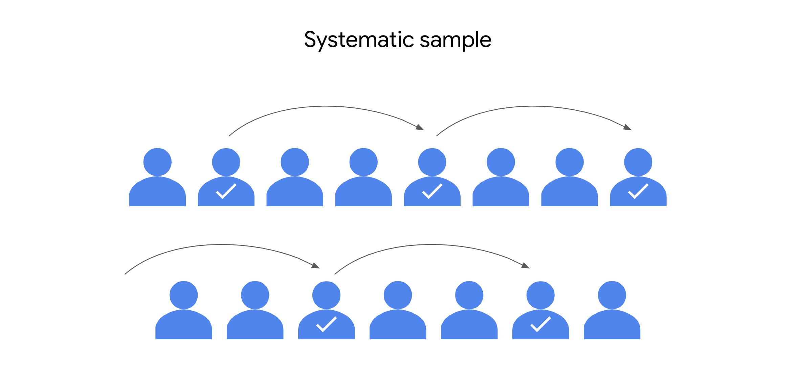

```{python}
#| include : false
import _setup
```

​You've learned a lot so far. ​You now have a better understanding of the essential role statistics plays in data ​science. ​You also have a solid foundation for using descriptive statistics and ​basic probability to describe, analyze and interpret data. ​

Your knowledge of the fundamental concepts of statistics is the first step on a path ​that leads to more advanced methods like hypothesis testing and ​regression analysis. ​What's really exciting is that this learning journey will continue throughout ​your future career as a data professional. ​The amount of data in the world is always growing and ​the data career space is constantly advancing. ​I often read about new machine learning methods to keep up with the changes in ​the field and develop new skills to use at work.

​The next stage of your journey is all about sampling or ​the process of selecting a subset of data from a population. ​For example if you want to survey a population of 100,000 people you ​can select a representative sample of 100 people. ​Then you can draw conclusions about the population based on your sample data ​coming up.

​We'll go over how the sampling process works and how data professionals use ​sample data to better understand larger populations recall that in statistics, ​a population can refer to any type of data including people objects, events, ​measurements and more.

​We'll start with a review of inferential statistics and ​examine the concept of a representative sample. ​Next we'll go over the different stages of the sampling process from choosing ​a target population to collecting data for your sample. ​

Then we'll explore the two main types of sampling methods, probability sampling and ​non probability sampling. ​We'll discuss the benefits and drawbacks of various sampling methods and ​describe how random sampling can help ensure that your sample is representative ​of the population, will also introduce different forms of bias and ​sampling like under coverage and non response bias and ​how they can affect non probability sampling methods.

​After that, we'll explore sampling distributions, ​which are probability distributions for sample statistics. ​You learn about sampling distributions for both sample means and proportions and ​how to estimate the corresponding values for populations. ​We'll also cover the central limit theorem and how it ​can help you estimate the population mean for different types of datasets.

​Finally, you learn how to use python's Saipi stats module to ​work with sampling distributions and make a point estimate of the population mean.

------------------------------------------------------------------------

Earlier in the course, we briefly discussed the difference between ​descriptive and inferential statistics. ​

**Descriptive statistics like the mean and ​standard deviation summarize the main features of the dataset.**

**​Inferential statistics use sample data to draw conclusions or ​make predictions about a larger population**. ​

Now we're going to return to inferential statistics and ​explore the relationship between sample and population in more detail. ​This part of the course is all about sampling, ​the process of drawing a subset of data from a population. ​

In this video, ​we'll discuss how data professionals use sampling in data science and ​the importance of working with the sample that is representative of the population. ​

Data professionals use sampling to analyze many different types of data. ​Here are some questions that sampling has helped my data science team answer, ​how many products in an app store do we need to test to feel confident ​that all the products are secure from malware? ​How do we select a sample of users to run an effective A/B test for ​an online retail store? ​And how do we select a sample of customers of a video streaming service to get ​reliable feedback on the shows they watch?

​Sampling is useful in data science because selecting a sample requires less time ​than collecting data on every item in a population. ​Using a sample saves money and resources and ​analyzing a sample is more practical than analyzing an entire population. ​This is especially important in modern data analytics ​where you often deal with extremely large datasets. ​For example, let's say you want to know the percentage of people in a large city ​who uses a laptop computer. ​One way to do this is to survey every resident in the city. ​First, it would be very difficult to access contact information for ​every resident of the city. ​Second, giving a survey to every resident of the city would be very expensive, ​complicated and time consuming. ​Another way is to find a much smaller subset of residents and ​give them a survey. ​This subset is your sample, then you can use the sample data you collect about ​laptop use to draw conclusions about the laptop use of the entire population. ​Collecting a sample is faster, more practical and ​less expensive than collecting data on every member of the population. ​

Keep in mind that your sample should be representative of your population. ​Recall that a representative sample accurately reflects the characteristics of ​a population. ​The inferences and ​predictions you make about your population are based on your sample data. ​If your sample doesn't accurately reflect your population, ​then your inferences will not be reliable and your predictions will not be accurate. ​And this can lead to negative outcomes for stakeholders and organizations. ​For instance, let's say you only contact computer scientists for ​your laptop survey. ​Your sample will not accurately reflect the overall population. ​Computer scientists are much more likely to use a laptop computer than the typical ​city resident. ​Many residents may not have access to any kind of computer or ​even know how to use one. ​A sample that only includes computer scientists is not representative. ​A representative sample would include people with different levels of computer ​knowledge and access.

​Let's consider another scenario. ​Imagine you want to find out the average height of every adult in ​the United States, that's a lot of people. ​It would take an incredible amount of time, energy and ​money to even attempt to measure every person in the country. ​Instead you can take a sample of 100 people and ​use that sample data to draw conclusions about the entire population. ​Now, let's say you have sample data only from professional basketball players. ​Pro basketball players are really tall, some are over seven feet tall. ​On average, they're much taller than almost everybody else in the population. ​Their average height does not accurately reflect the average height of the overall ​population. ​A sample that includes only pro basketball players is not representative of every ​adult in the US.

​As a data professional, I work with sample data every day. ​I can tell you that having a representative sample is super important. ​A wise teammate of mine once said that a good model can't overcome a bad sample. ​

------------------------------------------------------------------------

Earlier, you learned that **inferential statistics** use sample data to draw conclusions or make predictions about a larger population. Data professionals use inferential statistics to gain valuable insights about their data. 

In this reading, you’ll learn about the relationship between sample and population in more detail. We’ll also discuss how data professionals use sampling in data work, and the importance of working with a sample that is representative of the population.  

# Population and Sample 

## **Population vs. sample**

In statistics, a **population** includes every possible element that you are interested in measuring, or the entire dataset that you want to draw conclusions about. A statistical population can refer to any type of data, including:

-   People

-   Organizations

-   Objects

-   Events

-   And more 

For instance, a population might be the set of:  

-   All students at a university

-   All the cell phones ever manufactured by a company

-   All the forests on Earth 

A **sample** is a subset of a population. 

Samples drawn from the above populations might be: 

-   The math majors at the university

-   The cell phones manufactured by the company in the last week

-   The forests in Canada

Data professionals use samples to make inferences about populations. In other words, they use the data they collect from a small part of the population to draw conclusions about the population as a whole.

## **Sampling**

**Sampling** is the process of selecting a subset of data from a population.

In practice, it’s often difficult to collect data on every member or element of an entire population. A population may be very large, geographically spread out, or otherwise difficult to access. Instead, you can use sample data to draw conclusions, make estimates, or test hypotheses about the population as a whole.

Data professionals use sampling because: 

-   It’s often impossible or impractical to collect data on the whole population due to size, complexity, or lack of accessibility 

-   It’s easier, faster, and more efficient to collect data from a sample

-   Using a sample saves money and resources 

-   Storing, organizing, and analyzing smaller datasets is usually easier, faster, and more reliable than dealing with extremely large datasets 

### Example: election poll 

Imagine you’re a data professional working in a country with a large population like India, Indonesia, the United States, or Brazil. There is an upcoming national election for president. You want to conduct an election poll to see which candidate voters prefer. Let’s say the population of eligible voters is 100 million people. To survey 100 million people on their voting preferences would take an enormous amount of time, money, and resources – even assuming it would be possible to locate and contact all voters, and that all voters would be willing to participate. 

However, it is realistic to survey a sample of 100 or 1000 voters drawn from the larger population of all voters. When you’re dealing with a large population, sampling can help you make valid inferences about the population as a whole. 

## **Representative sample**

To make valid inferences or accurate predictions about a population, your sample should be representative of the population as a whole.  Recall that a **representative sample** accurately reflects the characteristics of a population. The inferences and predictions you make about your population are based on your sample data. If your sample doesn’t accurately reflect your population, then your inferences will not be reliable, and your predictions will not be accurate. And this can lead to negative outcomes for stakeholders and organizations. 

Statistical methods such as probability sampling help ensure your sample is representative by collecting random samples from the various groups within a population. These methods help reduce sampling bias and increase the validity of your results. You’ll learn more about sampling methods later on. 

### Example: election poll 

Ideally, the sample for your election poll will accurately reflect the characteristics of the overall voter population. A voter population in a large country will be diverse in political perspectives, geographic location, age, gender, race, education level, socioeconomic status, etc. Your sample will not be representative if you only collect data from people who belong to certain groups and not others. For example, if you survey people from one political party, or who have advanced degrees, or are older than 70. The results of an election poll based on a non-representative sample will not be accurate. In general, any claims or inferences you make about any  population will have more validity if they are based on a representative sample. 

# Key takeaways 

Data professionals work with powerful statistical tools that can model complex datasets and help generate valuable insights. But, if the sample data you’re working with doesn’t accurately reflect your population—that is, if your sample is not representative—then it doesn’t matter how good your model is. If your predictive model is based on a bad sample, then your predictions will not be accurate.

Ultimately, the quality of your sample helps determine the quality of the insights you share with stakeholders. To make reliable inferences about a population, make sure your sample is representative of the population. 

------------------------------------------------------------------------

# The Sampling process

As a data professional, you'll work with sample data all the time. ​Often this will be sample data previously collected by other researchers. ​Sometimes your team may collect their own data. ​Either way, it's important to know how the sampling process works ​because it directly affects the quality of your sample data. ​

The sampling process helps determine whether your sample is representative of ​the population and whether your sample is unbiased. ​If you estimate the mean height of a country's total adult population based on ​a sample of professional basketball players, ​your estimate will not be accurate. In this video, ​we'll go over the main stages of the typical sampling process. ​This will give you a useful framework for understanding how sampling is conducted ​and how the sampling process can affect your sample data. ​

::: summary
To get a clear overview of the sampling process, let's divide it into five steps. 

-   ​Step one, identify the target population. ​

-   Step two, select the sampling frame. 

-   ​Step three, choose the sampling method.

-   Step four, ​determine the sample size, and

-   step five, collect the sample data.

:::

As an example, ​let's consider a public opinion poll. 

​Imagine the city government of Vancouver, Canada wants to build a new subway system. ​The public will vote on whether or not to move forward with the project. ​The city government wants to find out if there's public support for the project. ​They ask you to take a poll and ​estimate the percentage of adult residents that support the project. ​Legal adults are 18 years or older. ​The first stage in the sampling process is to identify your target population. ​The target population is the complete set of elements that you're interested in ​knowing more about. 

​In this case, the target population includes every resident in the city who ​is 18 years or older and eligible to vote. ​Let's say that the city contains 100,000 such residents. Since it's too difficult ​and too expensive to survey everyone in the target population, ​you decide to take a sample. ​

The next step in the sampling process is to create a sampling frame. ​**A sampling frame is a list of all the items in your target population.** ​Basically, it's a complete list of everyone or everything you're interested ​in researching. The difference between a target population and ​a sampling frame is that the population is general and the frame is specific. 

​So if your target population is 100,000 city residents who are 18 years or ​older and eligible to vote, your sampling frame could be a list of names for ​all these residents--from Alana Aoki to Zoe Zappa. ​For practical reasons, **​your sampling frame may not accurately match your ​target population because you may not have access to every member of the population**. ​For instance, the city may not have reliable contact information about each ​resident, or perhaps not all eligible voters are actually registered to vote, ​so their opinions about the potential subway system aren't relevant, since ​the project will be decided by an election. For reasons like these, ​your sampling frame will not exactly overlap with your target population. ​Your sampling frame will include the list of residents 18 or ​over that you're able to obtain useful information about. ​So the sampling frame is the accessible part of your target population. ​

Next, you need to choose a sampling method, which is step three of the sampling ​process. ​One way to help ensure that your sample is representative is to choose the right ​sampling method. ​

There are two main types of sampling methods: probability sampling and ​non-probability sampling. In later videos, ​we'll explore the specifics in more detail. For now, ​just know that **probability sampling uses random selection to generate a sample**. ​**Non-probability sampling is often based on convenience or ​the personal preferences of the researcher rather than random selection**. ​Because probability sampling methods are based on random selection, every person ​in the population has an equal chance of being included in the sample. ​This gives you the best chance to get a representative sample, as your results ​are more likely to accurately reflect the overall population. 

​So, assuming you have the budget and the time, you can use a probability sampling ​method for your poll about the subway project. ​Using random selection gives you the best chance of getting a sample that's ​representative of your population. ​

Step four of the sampling process is to determine the best size for your sample, ​since you don't have the resources to pull everyone in your sampling frame. In ​statistics, **sample size refers to the number of individuals or items chosen for ​a study or experiment**. ​Sample size helps determine the accuracy of the predictions ​you make about the population. In general, ​the larger the sample size, ​the more accurate your predictions. Based on the desired level of accuracy for ​your survey, you can decide how many eligible voters to include in your sample. 

​Now, you're ready to collect your sample data. ​This is the final step in the sampling process. ​To pull the residents selected for your sample, ​you decide to conduct a survey. Based on the survey responses, ​you determine the percentage of eligible voters 18 and ​over who favor the proposed subject project. ​Then, you share this information with city leaders to help them make a more informed ​decision.

Effective sampling ensures that your sample data is representative of your ​target population. ​Then, when you use sample data to make inferences about the population, ​you can be reasonably confident that your inferences are reliable. 

​Your poll will give city leaders a better idea of public support for ​the new subway and help inform future decisions about the project. ​The decisions you make at each step of the sampling process can affect the quality of ​your sample data. ​Understanding the sampling process will make you a better data professional, ​whether you're analyzing data collected by other researchers or ​conducting a survey on your own. 

------------------------------------------------------------------------

# The stages of the sampling process

Recently, you’ve been learning about sampling. As a data professional, you’ll work with sample data all the time. Often, this will be sample data previously collected by other researchers; sometimes, your team may collect their own data. Either way, it’s important to know how the sampling process works, because it helps determine whether your sample is representative of the population, and whether your sample is unbiased. 

In this reading, we’ll go over the main stages of the sampling process in more detail. This will give you a better understanding of how the sampling process works and how each step of the process can affect your sample data. 

# The sampling process

First, let’s review the main steps of the sampling process:

1.  Identify the target population

2.  Select the sampling frame

3.  Choose the sampling method

4.  Determine the sample size 

5.  Collect the sample data

Let’s explore each step in more detail with an example. Imagine you’re a data professional working for a company that manufactures home appliances. The company wants to find out how customers feel about the innovative digital features on their newest refrigerator model. The refrigerator has been on the market for two years and 10,000 people have purchased it. Your manager asks you to conduct a customer satisfaction survey and share the results with stakeholders. 

## **Step 1: Identify the target population**

The first step in the sampling process is defining your target population. The **target population** is the complete set of elements that you’re interested in knowing more about. Depending on the context of your research, your population may include individuals, organizations, objects, events, or any other type of data you want to investigate. 

A well-defined population reduces the probability of including participants who do not fit the precise scope of your research. For example, you don’t want to include all the company’s customers, or customers who purchased the company’s other refrigerator models. 

In this case, your target population will be the 10,000 customers who purchased the company’s newest refrigerator model. These are the customers you want to survey to learn about their experience with the newest model. 


## **Step 2: Select the sampling frame**

The next step in the sampling process is to create a sampling frame. A **sampling frame** is a list of all the individuals or items in your target population. 

The difference between a target population and a sampling frame is that the population is general and the frame is specific. So, if your target population is all the customers who purchased the refrigerator, your sampling frame could be an alphabetical list of the names of all these customers. The customers in your sample will be selected from this list. 

Ideally, your sampling frame should include the entire target population. However, for practical reasons, your sampling frame may not exactly match your target population, because you may not have access to every member of the population. For instance, the company’s customer database may be incomplete, or contain data processing errors. Or, some customers may have changed their contact information since their purchase, and you may be unable to locate or contact them. Furthermore, sometimes the sampling frame might include elements outside of the target population simply by accident or because it is impossible to know the target population with certainty.


Therefore, generally your sampling frame is the *accessible* part of your target population, but sometimes it will include elements apart from this set.

## **Step 3: Choose the sampling method**

The third step in the sampling process is choosing a sampling method. 

There are two main types of sampling methods: **probability sampling** and **non-probability sampling**. Later on, we’ll explore the specific methods in more detail. For now, just know that probability sampling uses random selection to [generate a sample](https://www.statisticshowto.com/sample/). Non-probability sampling is often based on convenience, or the personal preferences of the researcher, rather than random selection. Often, probability sampling methods require more time and resources than non-probability sampling methods. 

Ideally, your sample will be representative of the population. One way to help ensure that your sample is representative is to choose the right sampling method. Because probability sampling methods are based on random selection, every element in the population has an equal chance of being included in the sample. This gives you the best chance to get a representative sample, as your results are more likely to accurately reflect the overall population.

So, assuming you have the budget, the resources, and the time, you should use a probability sampling method for your survey.  

## **Step 4: Determine the sample size**

Step four of the sampling process is to determine the best size for your sample, since you don’t have the resources to survey everyone in your sampling frame. In statistics, sample size refers to the number of individuals or items chosen for a study or experiment. 

Sample size helps determine the precision of the predictions you make about the population. In general, the larger the sample size, the more precise your predictions. However, using larger samples typically requires more resources. 

The sample size you choose depends on various factors, including the sampling method, the size and complexity of the target population, the limits of your resources, your timeline, and the goal of your research. 

Based on these factors, you can decide how many customers to include in your sample.

## **Step 5: Collect the sample data**

Now, you’re ready to collect your sample data, which is the final step in the sampling process. 

You give a customer satisfaction survey to the customers selected for your sample. The survey responses provide useful data on how customers feel about the digital features of the refrigerator. Then, you share your results with stakeholders to help them make more informed decisions about whether to continue to invest in these features for future versions of this refrigerator, and develop similar features for other models. 

# Key takeaways

Effective sampling ensures that your sample data is representative of your population. Then, when you use sample data to make inferences about the population, you can be reasonably confident that your inferences are reliable. 

The decisions you make at each step of the sampling process can affect the quality of your sample data. Understanding the sampling process will make you a better data professional, whether you’re analyzing data collected by other researchers or conducting a survey on your own. 

------------------------------------------------------------------------

# Compare sampling methods

In a previous video, ​you learned the differences between ​probability and non-probability sampling. ​Then you conducted a survey using probability sampling, ​which is the third step of the sampling process. ​In this video, you will learn more ​about the different methods of probability sampling. ​Then we'll discuss the benefits ​and drawbacks of each method.

​There are four different probability sampling methods:

-   ​simple random sampling, ​

-   stratified random sampling,

-   cluster random sampling, ​and

-   systematic random sampling.

# Simple Random Sample

**​In a simple random sample, ​every member of a population is selected ​randomly and has an equal chance of being chosen.** ​You can randomly select members using ​a random number generator or by ​another method of random selection.

​For example, say you want to survey ​the employees of a company about their work experience. ​The company employs 1,000 people. ​You can assign each employee in ​the company database a number from 1-1,000, ​and then use a random number generator to ​select 100 people for your sample. ​**The main benefit of ​simple random samples is that they're usually fairly ​representative since every member of ​the population has an equal chance of being chosen**. ​Random samples tend to **avoid bias** ​and surveys like these give you more accurate results. ​However, in practice, ​it's often expensive and time-consuming to ​conduct large, simple random samples. **​If your sample size is not large enough, ​a specific group of people in ​the population may be underrepresented in your sample**. ​If you use a larger sample size, ​your sample will more accurately reflect the population. ​

# Stratified random sample

**The next method of probability sampling ​is a stratified random sample. ​In a stratified random sample, ​you divide a population into groups and ​randomly select some members ​from each group to be in the sample.** ​These groups are called strata. ​Strata can be organized by age, gender, ​income, or whatever category ​you're interested in studying. ​For example, say you want to survey high school students ​about how much time they spend studying on weekends. ​You might divide the student population ​according to age: 14, ​15, 16, and 17-year-olds.

​Then you can survey an equal number ​of students from each age group. ​**Stratified random samples help ensure that members ​from each group in the population ​are included in the survey. ​This method allows you to draw ​more accurate conclusions about the relevant groups.** ​For instance, 14-year-olds and 17-year-olds, ​may have different perspectives ​about studying on the weekends. ​Older students can drive and may have ​more social activities or work on the weekends. **​Stratified sampling will capture both perspectives. ​One main disadvantage of ​stratified sampling is that it can be difficult to ​identify appropriate strata for ​a study if you lack knowledge of a population.**

​For example, if you want to study ​median income among a population, ​you may want to stratify your sample by job type, ​or industry, or location, or education level. ​If you don't know how relevant ​these categories are to median income, ​it will be difficult to choose ​the best one for your study.

# Cluster random sample

The next method of probability sampling ​is a cluster random sample. **​When you're conducting a cluster random sample, ​you divide a population into clusters, ​randomly select certain clusters, ​and include all members from ​the chosen clusters in the sample.** ​Cluster sampling is similar ​to stratified random sampling, ​but in stratified sampling, ​you randomly choose some members ​from each group to be in the sample. ​In cluster sampling, you choose ​all members from a group to be in the sample. ​Clusters are divided using ​identifying details, such as age, ​gender, location, or whatever you want to study.

​For example, imagine you want to conduct a survey of ​employees at a global company using cluster sampling. ​The company has 10 offices ​in different cities around the world. ​Each office has about the same number of ​employees and similar job roles. ​You randomly select three offices ​in three different cities as clusters. ​You include all the employees at ​the three offices in your sample. ​**One advantage of this method is that a cluster sample ​gets every member from a particular cluster, ​which is useful when each cluster ​reflects the population as a whole. ​This method is helpful when dealing with ​large and diverse populations that ​have clearly defined subgroups.**

​If researchers want to learn about ​the preferences of primary school students in Oslo, ​Norway, they can use one school as ​a representative sample of all schools in the city. ​**A main disadvantage of ​cluster sampling is that it may be difficult ​to create clusters that accurately ​reflect the overall population.** ​For example, for practical reasons, ​you may only have access to the offices in ​the United States when your company ​has locations all over the world. ​Employees in the United States may have ​different characteristics and values ​than employees in other countries. ​

# Systematic random sample

The final method of probability sampling ​is a systematic random sample. **​In systematic random samples, ​you put every member of ​a population into an ordered sequence. ​Then you choose a random starting point ​in the sequence and ​select members for your sample at regular intervals.**

​Let's assume you want to survey ​students at a community college. ​For a systematic random sample, ​you'd put the students' names in alphabetical order, ​randomly choose a starting point, ​and pick every fifth name to be in the sample. ​Systematic random samples are ​often representative of the population ​since every member has ​an equal chance of being included in the sample. ​Whether the student's last name starts with B ​or R isn't going to affect their characteristics. ​Systematic sampling is also quick and ​convenient when you have ​a complete list of the members of your population. ​**One disadvantage of ​systematic sampling is that you need to ​know the size of the population ​that you want to study before you begin.** ​If you don't have this information, ​it's difficult to choose consistent intervals.

​The four methods of probability sampling we've covered, ​simple, stratified, cluster, ​and systematic, are all based on random selection, ​which is the preferred method of ​sampling for most data professionals. ​These methods can help you create ​a sample that is representative of the population. ​In an upcoming video, ​we'll check out some methods of ​non-probability sampling and why ​they're not considered representative.

------------------------------------------------------------------------

Earlier, you learned that there are two main types of sampling methods: probability sampling and non-probability sampling. **Probability sampling** uses random selection to generate a [sample](https://www.statisticshowto.com/sample/). **Non-probability sampling** is often based on convenience, or the personal preferences of the researcher, rather than random selection. The sampling method you use helps determine if your sample is representative of your population, and if your sample is biased. Probability sampling gives you the best chance to create a sample that is representative of the population.

In this reading, you’ll learn more about the different methods of probability sampling, and the benefits and drawbacks of each method. 

# Probability Sampling Methods 

There are four different probability sampling methods: 

-   Simple random sampling

-   Stratified random sampling

-   Cluster random sampling

-   Systematic random sampling

Let’s explore each method in more detail.

## **Simple random sampling**

In a **simple random sample**, every member of a population is selected randomly and has an equal chance of being chosen. You can randomly select members using a random number generator, or by another method of random selection.


For example, imagine you want to survey the employees of a company about their work experience. The company employs 10,000 people. You can assign each employee in the company database a number from 1 to 10,000, and then use a random number generator to select 100 people for your sample. In this scenario, each of the employees has an equal chance of being chosen for the sample. 

The main benefit of simple random samples is that they’re usually fairly representative, since every member of the population has an equal chance of being chosen. Random samples tend to avoid bias, and surveys like these give you more reliable results. 

However, in practice, it’s often expensive and time-consuming to collect large simple random samples. And if your sample size is not large enough, a specific group of people in the population may be underrepresented in your sample. If you use a larger sample size, your sample will more accurately reflect the population.

## **Stratified random sampling**

In a **stratified random sample**,you divide a population into groups, and randomly select some members from each group to be in the sample. These groups are called strata. Strata can be organized by age, gender, income, or whatever category you’re interested in studying. 


For example, imagine you’re doing market research for a new product, and you want to analyze the preferences of consumers in different age groups. You might divide your target population into strata according to age: 20-29, 30-39, 40-49, 50-59, etc. Then, you can survey an equal number of people from each age group, and draw conclusions about the consumer preferences of each age group. Your results will help marketers decide which age groups to focus on to optimize sales for the new product. 

Stratified random samples help ensure that members from each group in the population are included in the survey. This method helps provide equal representation for underrepresented groups, and allows you to draw more precise conclusions about each of the strata. There may be significant differences in the purchasing habits of a 21-year-old and a 51-year-old. Stratified sampling helps ensure that both perspectives are captured in the sample. 

One main disadvantage of stratified sampling is that it can be difficult to identify appropriate strata for a study if you lack knowledge of a population. For example, if you want to study median income among a population, you may want to stratify your sample by job type, or industry, or location, or education level. If you don’t know how relevant these categories are to median income, it will be difficult to choose the best one for your study. 

## **Cluster random sampling**

When you’re conducting a **cluster random sample**, you divide a population into clusters, randomly select certain clusters, and include all members from the chosen clusters in the sample. 

Cluster sampling is similar to stratified random sampling, but in stratified sampling, you randomly choose *some* members from each group to be in the sample. In cluster sampling,  you choose *all* members from a group to be in the sample. Clusters are divided using identifying details, such as age, gender, location, or whatever you want to study

For example, imagine you want to conduct an employee satisfaction survey at a global restaurant franchise using cluster sampling. The franchise has 40 restaurants around the world. Each restaurant has about the same number of employees in similar job roles. You randomly select 4 restaurants as clusters. You include all the employees at the 4 restaurants in your sample.

One advantage of this method is that a cluster sample gets every member from a particular cluster, which is useful when each cluster reflects the population as a whole. This method is helpful when dealing with large and diverse populations that have clearly defined subgroups. If researchers want to learn more about home ownership in the suburbs of Auckland, New Zealand, they can use several well-chosen suburbs as a representative sample of all the suburbs in the city.

A main disadvantage of cluster sampling is that it may be difficult to create clusters that accurately reflect the overall population. For example, for practical reasons, you may only have access to restaurants in England when the franchise has locations all over the world. And employees in England may have different characteristics and values than employees in other countries. 

## **Systematic random sampling**

In a **systematic random sample**, you put every member of a population into an ordered sequence. Then, you choose a random starting point in the sequence and select members for your sample at regular intervals. 

Imagine you want to survey students at a high school about their study habits. For a systematic random sample, you’d put the students’ names in alphabetical order and randomly choose a starting point: say, number 4. Starting with number 4, you select every 10th name on the list (4, 14, 24, 34, … ), until you have a sample of 100 students.



One advantage of systematic random samples is that they’re often representative of the population, since every member has an equal chance of being included in the sample. Whether the student’s last name starts with L or Q isn’t going to affect their characteristics. Systematic sampling is also quick and convenient when you have a complete list of the members of your population. 

One disadvantage of systematic sampling is that you need to know the size of the population that you want to study before you begin. If you don’t have this information, it’s difficult to choose consistent intervals. Plus, if there’s a hidden pattern in the sequence, you might not get a representative sample. For example, if every 10th name on your list happens to be an honor student, you may only get feedback on the study habits of honor students – and not *all* students. 

# Key takeaways

The four methods of probability sampling we’ve covered—simple, stratified, cluster, and systematic—are all based on random selection, which is the preferred method of sampling for most data professionals. Probability sampling methods give you the best chance to create a sample that is representative of the population as a whole. And working with a representative sample allows you to make reliable inferences and accurate predictions about the population you’re researching. 

------------------------------------------------------------------------

# The impact of bias in sampling

In my work as a data professional I often use ​sample data to help build machine learning models. ​Today, a machine-learning model may ​help determine if a person gets an approval for a loan, ​an interview for a job or an accurate medical diagnosis. ​Models based on representative samples ​are much more likely to make ​fair and unbiased decisions ​about who gets a loan or a job interview. ​Using samples that are representative ​of the different types of people in ​the population helps ensure that ​each person receives the treatment that is best for them. ​

Unfortunately, bias can affect sample data. ​Sampling bias occurs when a sample is not ​representative of the population as a whole. ​To eliminate bias, I try to use samples that are ​representative of the overall population. 

​The consequences of drawing conclusions from ​a non-representative sample can be serious. ​Recently you learned that probability sampling methods ​use random selection, ​which helps avoid sampling bias. ​A randomly chosen sample means that all members of ​the population have an equal chance of being included. ​In contrast, non-probability sampling methods ​do not use random selection, ​so they do not typically generate representative samples. ​In fact, they often result in biased samples. 

​However, non-probability sampling is often less ​expensive and more convenient for researchers to conduct. ​Sometimes due to budget, ​time or other reasons, ​it's just not possible to use probability sampling. 

​Plus non-probability methods can be useful for ​exploratory studies which seek to ​develop an initial understanding of a population, ​not draw conclusions or make ​predictions about the population as a whole. ​

In this video, we'll discuss four methods of ​non-probability sampling and learn ​how sampling bias can affect each method. ​These four methods are convenient sampling, ​voluntary response sampling, ​snowball sampling, and purposive sampling. ​

Let's start with **convenience sampling. ​In this method, you choose members of ​a population that are easy to contact or reach.** ​As the name suggests, ​conducting a convenience sample involves ​collecting a sample from somewhere convenient to you, ​such as your workplace, ​a local school, or a public park. ​For example, to conduct an opinion poll, ​a researcher might stand in front of a local high school ​during the day and poll people that happened to walk by. 

​Because these symbols are based on convenience to ​the researcher and not a ​broader sample of the population, ​convenience samples often show undercoverage bias. ​**Undercoverage bias occurs when some members of ​a population are inadequately represented in the sample**. ​For instance, people who don't work at or ​attend the school will not be ​represented as much in this sample. ​

The next method of non-probability sampling ​is **voluntary response sampling. ​This type of sample consists of members of ​a population who volunteer to participate in a study**. ​For example, the owners of a restaurant ​want to know how people feel about their dinner options. ​They ask their regular customers to take ​an online survey about ​the quality of the restaurant's food. 

​Voluntary response samples tend to ​suffer from *nonresponse bias*, ​which occurs when certain groups of people are ​less likely to provide responses. ​People who voluntarily respond ​will likely have stronger opinions, ​either positive or negative ​than the rest of the population. ​This makes the volunteer customers at ​the restaurant an unrepresentative sample. 

​The next non-probability sampling method ​is snowball sampling. **​In a snowball sample researchers ​recruit initial participants to be in ​a study and then ask them to recruit ​other people to participate in the study.** ​Like a snowball, the sample size gets ​bigger and bigger as more participants join in. ​For example, if a study was ​investigating cheating among college students, ​potential participants might not want to come forward. 

​But if a researcher can find ​a couple of students willing to participate, ​these two students may know others ​who have also cheated on exams. ​The initial participants could ​then recruit others by sharing ​the benefits of the study and ​reassuring them of confidentiality. ​Although it may seem convenient that ​study participants help build the sample, ​this type of recruiting can lead to sampling bias. ​Because initial participants recruit ​additional participants on their own, ​it's likely that most of them ​will share similar characteristics. ​These characteristics might be ​unrepresentative of the total population under study. 

**​In purposive sampling researchers ​select participants based on the purpose of their study.** ​Because participants are selected for ​the sample according to the needs of the study, ​applicants who do not fit the profiles are rejected. 

​For example, a researcher wants to survey students on ​the effectiveness of certain ​teaching methods at the university. ​The researcher only wants to ​include students who regularly ​attend class and have ​an established record of academic achievement. ​So they select the students with ​the highest grade point averages ​to participate in the study. ​Purposive sampling, the researcher ​often intentionally exclude certain groups ​from the sample to focus on a specific group ​they think is most relevant to their study. ​In this case, the researcher excludes ​students who don't have high grade point averages. ​This could lead to biased outcomes ​because the students in the sample are not ​likely to be representative ​of the overall student population. ​

As a data professional, ​you have to think about bias and ​fairness from the moment you start ​collecting sample data to ​the time you present your conclusions. 

​Once you become aware of some common forms of bias, ​you can remain on the alert for bias in any form. 

------------------------------------------------------------------------

# Non-probability sampling methods

Recently, you learned that probability sampling methods use random selection, which helps avoid sampling bias. A randomly chosen sample means that all members of the population have an equal chance of being included. In contrast, non-probability sampling methods do not use random selection, so they do not typically generate representative samples. In fact, non-probability methods often result in biased samples. **Sampling bias** occurs when some members of the population are more likely to be selected than other members. 

In this reading, you’ll learn more about four methods of non-probability sampling, and learn how sampling bias can affect each method. We’ll also discuss why non-probability sampling may be useful in certain situations. 

# Non-probability sampling methods

Non-probability samples use non-random methods of selection, so not all members of a population have an equal chance of being selected. This is why non-probability methods have a high risk of sampling bias. However, non-probability methods are often less expensive and more convenient for researchers to conduct. Sometimes, due to limited time, money, or other resources, it’s not possible to use probability sampling. Plus, non-probability methods can be useful for exploratory studies, which seek to develop an initial understanding of a population, rather than make inferences about the population as a whole.  

We’ll go over four methods of non-probability sampling: 

-   Convenience sampling

-   Voluntary response sampling

-   Snowball sampling

-   Purposive sampling

Let’s explore each method in more detail. 

## **Convenience sampling**

For convenience sampling, you choose members of a population that are easy to contact or reach. As the name suggests, conducting a convenience sample involves collecting a sample from somewhere convenient to you, such as your workplace, a local school, or a public park.

For example, to conduct an opinion poll, a researcher might stand at the entrance of a shopping mall during the day and poll people that happen to walk by.

Because these samples are based on convenience to the researcher, and not a broader sample of the population, convenience samples often suffer from undercoverage bias. Undercoverage bias occurs when some members of a population are inadequately represented in the sample. For example, the above sample will underrepresent people who don’t like to shop at malls, or prefer to shop at a different mall, or don’t visit the mall because they lack transportation. 

Convenience sampling is often quick and inexpensive, but it’s not a reliable way to get a representative sample. 

## **Voluntary response sampling**

A voluntary response sample consists of members of a population who volunteer to participate in a study. Like a convenience sample, a voluntary response sample is often based on convenient access to a population. However, instead of the researcher selecting participants, participants volunteer on their own. 

For example, let’s say college administrators want to know how students feel about the food served on campus. They email students a link to an online survey about the quality of the food, and ask students to fill out the survey if they have time. 

Voluntary response samples tend to suffer from nonresponse bias, which occurs when certain groups of people are less likely to provide responses. People who voluntarily respond will likely have stronger opinions, either positive or negative, than the rest of the population. In this case, only students who really like or really dislike the food may be motivated to fill out the survey. The survey may omit many students who have more mild opinions about the food, or are neutral. This makes the volunteer students unrepresentative of the overall student population.

## **Snowball sampling**

In a snowball sample,researchers recruit initial participants to be in a study and then ask them to recruit other people to participate in the study. Like a snowball, the sample size gets bigger and bigger as more participants join in. Researchers often use snowball sampling when the population they want to study is difficult to access. 

For example, imagine a researcher is studying people with a rare medical condition. Due to reasons of confidentiality, it may be difficult for the researcher to obtain contact information for members of this population from hospitals or other official sources. However, if the researcher can find a couple of people willing to participate, these two people may know others with the same condition. The initial participants could then recruit others by sharing the potential benefits of the study.

Snowball sampling can take a lot of time, and researchers must rely on participants to successfully continue the recruiting process and build up the “snowball.” This type of recruiting can also lead to sampling bias. Because initial participants recruit additional participants on their own, it’s likely that most of them will share similar characteristics, and these characteristics might be unrepresentative of the total population under study. 

## **Purposive sampling**

In purposive sampling, researchers select participants based on the purpose of their study. Because participants are selected for the sample according to the needs of the study, applicants who do not fit the profile are rejected. 

For example, imagine a game development company wants to conduct market research on a new video game before its public release. The research team only wants to include gaming experts in their sample. So, they survey a group of professional gamers to provide feedback on potential improvements. 

In purposive sampling, researchers often intentionally exclude certain groups from the sample to focus on a specific group they think is most relevant to their study. In this case, the researcher excludes amateur gamers. Amateur gamers may purchase the new game for different reasons than professional gamers, and enjoy game features that don’t appeal to professionals. This could lead to biased results, because the professionals in the sample are not likely to be representative of the overall gamer population.

Purposive sampling is often used when a researcher wants to gain detailed knowledge about a specific part of a population, or where the population is very small and its members all have similar characteristics. Purposive sampling is not effective for making inferences about a large and diverse population. 

# Key takeaways

Non-probability sampling is useful for collecting data in situations where you have limited time, budget, and other resources. Non-probability sampling is also useful for exploratory research, when you want to get an initial understanding of a population, rather than make inferences about the population as a whole. However, it’s important to remember that non-probability sampling methods have a high risk of sampling bias.  

As a data professional, you have to think about bias and fairness from the moment you start collecting sample data to the time you present your conclusions. Once you become aware of some common forms of bias, you can remain on the alert for bias in any form.

