​Previously, we provided a high level overview of regression analysis and ​two core foundational regression models, linear and logistic regression. ​In this section of the course we'll go over how to set up, ​build, evaluate, and interpret our first regression model. ​We'll also review model assumptions, construction, evaluation, and ​interpretation as we've previously defined. 

​There are a lot of new concepts. ​So if you ever need to get reorganized, remember the pace framework, ​plan, analyze, construct, and execute. 

​Each part of pace aligns with a part of the process of regression analysis. ​Sometimes we have to repeat some steps, but these are the phases to keep in mind. ​And we'll go through the process concretely ​together using examples to help guide you. ​

To recap, **linear regression is a technique that estimates the linear relationship ​between a continuous dependent variable and one or more independent variables.** 

​Recall that an independent variable is the variable whose trends are associated with ​the dependent variable. ​Independent variables are commonly represented by the letter $x$. ​Meanwhile the dependent variable is the variable that a given model estimates, ​also known as the outcome variable. ​The dependent variable is commonly represented by the letter $y$.  ::: nota ​We'll learn more about simple linear regression. **​Simple linear regression** is a technique that estimates the linear relationship ​between **one** independent variable, $x$, and **one** continuous dependent variable, $y$.  ::: ​The model assumptions code, evaluation metrics, and ​interpretation skills we review here will extend directly into more ​complex models like multiple linear regression. ​By solidifying your foundation through simple linear regression, ​you'll be prepared to tackle advanced models that can answer more complex ​questions in different industries and business context. 

​As we go through simple linear regression together, ​you'll combine many of your prior skill sets, including Python programming, ​exploratory data analysis or EDA, and statistics. ​These tools will allow you to construct a simple linear regression model that can ​help you influence strategy and decision making in any company or organization. 

​The key terms, activities, and learning resources that we explore together in ​these videos will also be important in the rest of this course, ​which will refer back to our discussions of simple linear regression. ​Together, we'll go through all the stages of pace while learning regression ​modeling. 

​We'll first review the linear regression equation and ​then learn about estimating parameters using ***ordinary least squares***. ​Then we'll define each of the four key assumptions of simple linear regression. 

​As for the analyzed stage, we'll use Python and ​EDA to verify if our data meets these assumptions. ​In the construct stage, we'll build your first regression model in Python together. ​You'll also have opportunities to practice both Python and EDA on your own as well. 

​We'll also learn several evaluation metrics and ​a technique to help you quantify how good your model is. ​Lastly, aligned with the execute stage, we'll use our metrics to practice ​interpreting our results for stakeholders and non technical audiences. ​I'm so excited to get started on simple linear regression modeling. ​So let's begin. 

# Ordinary least squares estimation

In prior videos, ​we've mentioned simple linear regression, ​which is a regression technique that estimates ​the linear relationship between ​one independent variable $x$, ​and one continuous dependent variable $y$. ​Recall that the linear and linear regression ​indicates what the data looks like when plotted on an $x$-$​y$ coordinate plane, a line. 

​In simple linear regression, ​we're only interested in two variables, ​one $x$ and one $y$ variable. ​The equation for a regression line is  $$
\text {y= intercept + slope * x}
$$

$$
y = \beta_0 + \beta_1 X
$$

​Since we'll have a number of ​data points for any given problem, ​there are many different lines we ​could draw that might fit the data. ​However, we're looking for the best fit line. ​The line that fits the data best by ​minimizing a **loss function**, or error. 

```{python}
import numpy as np
import matplotlib.pyplot as plt

# Set random seed for consistent data generation
np.random.seed(10)

# 1. Generate scatter plot points with a positive linear trend
n_points = 18
x = np.random.uniform(-1.5, 3.5, n_points)
y = 1.2 * x + 1.5 + np.random.normal(0, 0.8, n_points)

# 2. Set up figure and clean axis styling
fig, ax = plt.subplots(figsize=(8, 6), facecolor='white')

# Remove top and right spines
ax.spines['top'].set_visible(False)
ax.spines['right'].set_visible(False)

# Position left/bottom spines through the origin (0,0) area to match the image
ax.spines['left'].set_position(('data', 0))
ax.spines['bottom'].set_position(('data', 0))
ax.spines['left'].set_color('#aaaaaa')
ax.spines['bottom'].set_color('#aaaaaa')

# Hide numerical tick marks and labels for a clean visual concept
ax.set_xticks([])
ax.set_yticks([])

# 3. Plot the scatter points (grey dots)
ax.scatter(x, y, color='#7f7f7f', s=100, zorder=3)

# 4. Draw multiple candidate regression lines intersecting near the center
x_line = np.linspace(-2.2, 4.2, 200)

lines_config = [
    # (slope, intercept, color)
    (0.6, 1.4, '#1f4e5b'),   # Dark Teal line (lower slope)
    (1.0, 1.3, '#d63031'),   # Red line (best fit)
    (1.25, 1.1, '#4a90e2'),  # Blue line (slightly steeper)
    (1.7, 0.5, '#e6b800'),   # Yellow line (steep slope)
]

for slope, intercept, color in lines_config:
    y_line = slope * x_line + intercept
    
    # Plot line
    ax.plot(x_line, y_line, color=color, linewidth=2.2, zorder=2)
    
    # Add double-ended arrowheads matching the original image
    # End arrow (top-right)
    ax.annotate(
        '', xy=(x_line[-1], y_line[-1]), xytext=(x_line[-5], y_line[-5]),
        arrowprops=dict(arrowstyle='->', color=color, lw=2.2, mutation_scale=15),
        zorder=2
    )
    # Start arrow (bottom-left)
    ax.annotate(
        '', xy=(x_line[0], y_line[0]), xytext=(x_line[4], y_line[4]),
        arrowprops=dict(arrowstyle='->', color=color, lw=2.2, mutation_scale=15),
        zorder=2
    )

# 5. Add Axis Labels ('x' and 'y')
ax.text(4.4, -0.4, 'x', fontsize=14, fontweight='bold', color='#333333')
ax.text(-0.3, 4.5, 'y', fontsize=14, fontweight='bold', color='#333333')

# Adjust layout limits
ax.set_xlim(-2.5, 4.7)
ax.set_ylim(-2.0, 4.7)

plt.tight_layout()
plt.show()
```

​In order to find the best fit line, ​we need to measure error. ​We can consider error as ​some difference between the data we have, ​the observed values, ​and the predicted values generated by a given model. 

​The predicted values are ​the estimated $y$ values for each $x$ calculated by a model. ​The difference between observed or actual values and ​the predicted values of ​the regression line are what's known as a **residual**. ​

The equation for residual value is ​residual equals observed value minus predicted value.  $$
\epsilon_i = Y_i - \hat{Y}_i
$$ ​Each data point has one residual. ​ ​Epsilon is a Greek letter that resembles the letter E, ​as in E for error.

​We can calculate individual residuals ​for each data point. ​An important thing to note is that **the sum of ​the residuals is always equal to zero for OLS (Ordinary Least Squares) estimators**. ​For some estimators, the sum of ​the residuals is not always equal to zero. ​

In order to capture a summary ​of total error in the model, ​we square each residual and then ​add up the residuals for every data point. ​This is called the sum of squared residuals.  ::: nota ​The sum of squared residuals, or SSR, ​is the sum of the squared differences between ​each observed value and the associated predicted value.  $$
\sum_{i=1}^{n} \epsilon_i^2 = \sum_{i=1}^{n} (Y_i - \hat{Y}_i)^2
$$

:::

​For linear regression, we'll be using a technique ​called **ordinary least squares** to get our best-fit line.  ::: nota ​Ordinary least squares, also known as OLS, ​is a method that minimizes the sum of ​squared residuals to estimate ​parameters in a linear regression model.  :::

​Using OLS, we can calculate $\hat{\Beta_0}$ ​and $\hat{\Beta_1}$ using properties of the sample data. ​Recall that the hat symbol means ​it is an estimate of a parameter. ​We will never know the exact parameter. ​

Remember parameters or Betas ​are characteristics of a population. ​Since we will only ever have sampled data, ​our goal is to get ​a reasonable estimate of the parameter. 

​Let's say that we have a certain sample of data and ​we now want to determine a line that fits the data well. ​For our first attempt at a best-fit line, ​the slope is 1 and the intercept is 2.5. 

​To calculate the sum of squared residuals, first, ​we calculate the predicted values for each $x$. ​Next, we can find the residual ​for every observed value of $x$. ​On the graph we've plotted the residuals. ​The residuals are the difference between ​each observed value and what the line predicted. 

```{python}
import numpy as np
import matplotlib.pyplot as plt

# Set random seed for consistent data generation
np.random.seed(42)

# 1. Generate scatter plot points following Y = 2.5 + x with some noise
n_points = 18
x = np.random.uniform(-1.5, 3.5, n_points)
y = 2.5 + 1.0 * x + np.random.normal(0, 0.8, n_points)

# Select specific indices to display red vertical residual lines
residual_indices = [2, 7, 12]

# 2. Set up figure and clean axis styling
fig, ax = plt.subplots(figsize=(8, 6), facecolor='white')

# Remove top and right spines
ax.spines['top'].set_visible(False)
ax.spines['right'].set_visible(False)

# Position axes through the origin (0,0)
ax.spines['left'].set_position(('data', 0))
ax.spines['bottom'].set_position(('data', 0))
ax.spines['left'].set_color('#777777')
ax.spines['bottom'].set_color('#777777')

# Hide tick marks and numbers for a clean conceptual look
ax.set_xticks([])
ax.set_yticks([])

# Add double-ended arrowheads to the main x and y axes
ax.plot(1, 0, ">k", transform=ax.get_yaxis_transform(), clip_on=False, color='#777777')
ax.plot(0, 1, "^k", transform=ax.get_xaxis_transform(), clip_on=False, color='#777777')
ax.plot(0, 0, "<k", transform=ax.get_yaxis_transform(), clip_on=False, color='#777777')
ax.plot(0, 0, "vk", transform=ax.get_xaxis_transform(), clip_on=False, color='#777777')

# 3. Draw vertical residual lines (red) from selected points to the regression line
for idx in residual_indices:
    px, py = x[idx], y[idx]
    y_pred = 2.5 + px
    ax.vlines(x=px, ymin=min(py, y_pred), ymax=max(py, y_pred), color='#d63031', linewidth=1.5, zorder=2)

# 4. Plot scatter points (grey circles)
ax.scatter(x, y, color='#7f7f7f', s=110, zorder=3)

# 5. Draw the main red regression line: Y = 2.5 + x
x_line = np.linspace(-2.2, 4.2, 200)
y_line = 2.5 + x_line
ax.plot(x_line, y_line, color='#d63031', linewidth=2.5, zorder=2)

# Add double-ended arrowheads to the red regression line
ax.annotate(
    '', xy=(x_line[-1], y_line[-1]), xytext=(x_line[-5], y_line[-5]),
    arrowprops=dict(arrowstyle='->', color='#d63031', lw=2.5, mutation_scale=15),
    zorder=2
)
ax.annotate(
    '', xy=(x_line[0], y_line[0]), xytext=(x_line[4], y_line[4]),
    arrowprops=dict(arrowstyle='->', color='#d63031', lw=2.5, mutation_scale=15),
    zorder=2
)

# 6. Annotations: Equation label, "Residual" label with arrow, and axis names
# Equation label
ax.text(3.6, 5.0, r'$Y = 2.5 + x$', fontsize=13, fontweight='bold', color='#333333')

# Axis labels
ax.text(4.4, -0.4, 'x', fontsize=14, fontweight='bold', color='#333333')
ax.text(-0.3, 5.7, 'y', fontsize=14, fontweight='bold', color='#333333')

# "Residual" text with arrow pointing to the leftmost highlighted residual line
target_x = x[residual_indices[0]]
target_y_mid = (y[residual_indices[0]] + (2.5 + target_x)) / 2

ax.annotate(
    'Residual', 
    xy=(target_x, target_y_mid), 
    xytext=(target_x - 1.5, target_y_mid - 0.2),
    arrowprops=dict(arrowstyle='->', color='#333333', lw=1.2),
    fontsize=12, 
    color='#333333',
    ha='right',
    va='center'
)

# Set axis boundaries
ax.set_xlim(-2.5, 4.7)
ax.set_ylim(-1.0, 6.0)

plt.tight_layout()
plt.show()
```

​But let's try to get a little bit closer to the points. ​Let's try another line. ​This time, we'll set the slope equal to ​1.25 and the intercept equal to 3. 

```{python}
import numpy as np
import matplotlib.pyplot as plt

# Set random seed for consistent data generation
np.random.seed(42)

# 1. Generate scatter plot points following Y = 2.5 + x with some noise
n_points = 18
x = np.random.uniform(-1.5, 3.5, n_points)
y = 3 + 1.25 * x + np.random.normal(0, 0.8, n_points)

# Select specific indices to display red vertical residual lines
residual_indices = [2, 7, 12]

# 2. Set up figure and clean axis styling
fig, ax = plt.subplots(figsize=(8, 6), facecolor='white')

# Remove top and right spines
ax.spines['top'].set_visible(False)
ax.spines['right'].set_visible(False)

# Position axes through the origin (0,0)
ax.spines['left'].set_position(('data', 0))
ax.spines['bottom'].set_position(('data', 0))
ax.spines['left'].set_color('#777777')
ax.spines['bottom'].set_color('#777777')

# Hide tick marks and numbers for a clean conceptual look
ax.set_xticks([])
ax.set_yticks([])

# Add double-ended arrowheads to the main x and y axes
ax.plot(1, 0, ">k", transform=ax.get_yaxis_transform(), clip_on=False, color='#777777')
ax.plot(0, 1, "^k", transform=ax.get_xaxis_transform(), clip_on=False, color='#777777')
ax.plot(0, 0, "<k", transform=ax.get_yaxis_transform(), clip_on=False, color='#777777')
ax.plot(0, 0, "vk", transform=ax.get_xaxis_transform(), clip_on=False, color='#777777')

# 3. Draw vertical residual lines (red) from selected points to the regression line
for idx in residual_indices:
    px, py = x[idx], y[idx]
    y_pred = 3 + 1.25 * px
    ax.vlines(x=px, ymin=min(py, y_pred), ymax=max(py, y_pred), color='#7830d6', linewidth=1.5, zorder=2)

# 4. Plot scatter points (grey circles)
ax.scatter(x, y, color='#7f7f7f', s=110, zorder=3)

# 5. Draw the main red regression line: Y = 3 + 1.25x
x_line = np.linspace(-2.2, 4.2, 200)
y_line = 3 + 1.25 * x_line
ax.plot(x_line, y_line, color='#7830d6', linewidth=2.5, zorder=2)

# Add double-ended arrowheads to the red regression line
ax.annotate(
    '', xy=(x_line[-1], y_line[-1]), xytext=(x_line[-5], y_line[-5]),
    arrowprops=dict(arrowstyle='->', color='#7830d6', lw=2.5, mutation_scale=15),
    zorder=2
)
ax.annotate(
    '', xy=(x_line[0], y_line[0]), xytext=(x_line[4], y_line[4]),
    arrowprops=dict(arrowstyle='->', color='#7830d6', lw=2.5, mutation_scale=15),
    zorder=2
)

# 6. Annotations: Equation label, "Residual" label with arrow, and axis names
# Equation label
ax.text(3.6, 5.0, r'$Y = 3 + 1.25x$', fontsize=13, fontweight='bold', color='#333333')

# Axis labels
ax.text(4.4, -0.4, 'x', fontsize=14, fontweight='bold', color='#333333')
ax.text(-0.3, 5.7, 'y', fontsize=14, fontweight='bold', color='#333333')

# "Residual" text with arrow pointing to the leftmost highlighted residual line
target_x = x[residual_indices[0]]
target_y_mid = (y[residual_indices[0]] + (3 + 1.25 * target_x)) / 2

ax.annotate(
    'Residual', 
    xy=(target_x, target_y_mid), 
    xytext=(target_x - 1.5, target_y_mid - 0.2),
    arrowprops=dict(arrowstyle='->', color='#333333', lw=1.2),
    fontsize=12, 
    color='#333333',
    ha='right',
    va='center'
)

# Set axis boundaries
ax.set_xlim(-2.5, 4.7)
ax.set_ylim(-1.0, 6.0)

plt.tight_layout()
plt.show()
```

​Again, we have to plot the residuals ​and calculate the sum of squared residuals. ​From the graph, it seems we're getting closer, ​but it's hard to tell if we've got the best line. ​We could just keep trying different lines. ​Through trial and error, pick a line that ​we think is closest to the data points. ​But that's very time-consuming. 

​The good news is that in Python, ​the computer will use OLS, ​or the ordinary least squares estimation technique to ​test out many lines and ​identify which one is the best fit line. 

​With OLS estimation, we find that $\hat{\beta}_0$ equals 1.5 and $\hat{\beta}_1$ equals 3.2. ​The lines we're estimating represent ​the best fit of the model to the data.

​Later, we'll talk about uncertainty using p-values ​and confidence intervals to aid ​in the interpretation of results. 

​Now that we've covered what simple linear regression is, ​we'll go back to PACE in ​our regression analysis framework. ​We'll examine the model assumptions ​that the data needs to follow for ​us to use this cool new tool in our regression toolbox.

------------------------------------------------------------------------

# Explore ordinary least squares

As previously mentioned, one way for finding the best fit line in regression modeling is to try different models until you find the best one. But for simple linear regression, the formulas for the best beta coefficients have been derived. In this reading, you will go through an example to gain a better understanding of how the sum of squared residuals can change as $\hat{\beta_0}$, and $\hat{\beta_1}$. There will be resources for further exploration if you’re interested in deriving the formulas for estimating the coefficients using ordinary least squares. In this reading, we will cover:

-   Formula and notation review

-   Minimizing the sum of squared residuals (SSR)

-   Estimating beta coefficients

# Formula and notation review

Earlier, you learned about simple linear regression as a method for estimating the linear relationship between a continuous dependent variable and one independent variable. An estimate based on simple linear regression can be represented mathematically as $\hat{y} = \hat{\beta_0} + \hat{\beta_1}X$, with, hat, on top, equals, beta, with, hat, on top, start subscript, 0, end subscript, plus, beta, with, hat, on top, start subscript, 1, end subscript, X .

Remember that the hat symbol indicates that the beta coefficients are just estimates. As a result, the y-values derived from the regression model are also just estimates. 

A common technique for calculating the coefficients of a linear regression model is called ordinary least squares, or OLS. Ordinary least squares estimates the beta coefficients in a linear regression model by minimizing a measure of error called the sum of squared residuals.

You can calculate the sum of squared residuals via this formula:

$$
\sum_{i=1}^{N} (Observed - Predicted)^2
$$ which can be rewritten using mathematical notation as: $$
\sum_{i=1}^{N} (y_i - \hat{y}_i)^2
$$

The large E shaped symbol is the capital Greek letter, sigma, and it denotes a sum. So the sum of squared residuals is the sum of the squared differences between the observed values and the values predicted by the regression model.

# Minimizing the sum of squared residuals (SSR)

For the purposes of this reading, assume that you have a dataset of 6 observations: (0, -1), (1, 2), (2, 4), (3, 8), (4, 11), and (5, 12). These can be plotted on a 2-dimensional X-Y coordinate plane.

| **X (observed)** | **Y (observed)** |
|:-----------------|:-----------------|
| 0                | -1               |
| 1                | 2                |
| 2                | 4                |
| 3                | 8                |
| 4                | 11               |
| 5                | 12               |

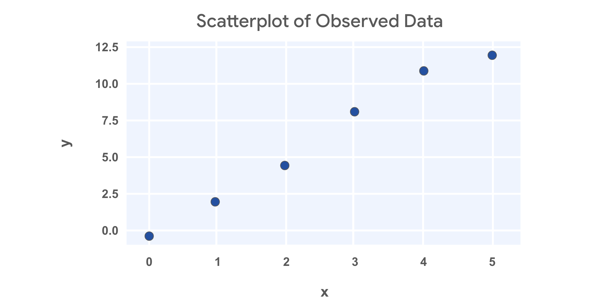

Line 1: $\hat{y} = -0.5 + 3x$

Next, let’s assume some values for $\hat{\beta_0}$ and $\hat{\beta_1}$ and calculate the sum of squared residuals. For the first attempt, let’s assume $\hat{\beta_0} = -0.5$ and $\hat{\beta_1} = 3$. Then the linear equation would be $\hat{y} = -0.5 + 3x$. Since you now have the equation for $\hat{y}$, you can calculate the predicted values by plugging in each value of $x$.

For example, if $x = 0$, then $\hat{y} = -0.5 + 3(0) = -0.5$. If $x = 1$, then $\hat{y} = -0.5 + 3(1) = 2.5$. So after calculating all the predicted values, then you can calculate the residual for each data point.

+------------------+----------------+-------------------------------+-----------------------------+
| **X (observed)** | **Y (actual)** | **Y (predicted) = -0.5 + 3x** | **Residual**                |
+:=================+:===============+:==============================+:============================+
| 0                | -1             | -0.5                          | -1 - (-0.5) = -1+0.5 = -0.5 |
+------------------+----------------+-------------------------------+-----------------------------+
| 1                | 2              | 2.5                           | 2 - 2.5 = -0.5              |
+------------------+----------------+-------------------------------+-----------------------------+
| 2                | 4              | 5.5                           | 4 - 5.5 = -1.5              |
+------------------+----------------+-------------------------------+-----------------------------+
| 3                | 8              | 8.5                           | 8 - 8.5 = -0.5              |
+------------------+----------------+-------------------------------+-----------------------------+
| 4                | 11             | 11.5                          | 11 - 11.5 = -0.5            |
+------------------+----------------+-------------------------------+-----------------------------+
| 5                | 12             | 14.5                          | 12 - 14.5 = -2.5            |
+------------------+----------------+-------------------------------+-----------------------------+

Then you can square each of the residuals by multiplying them by themselves, and then adding them all together to calculate the sum of squared residuals.

| **Residual**                | **Squared Residual** |
|:----------------------------|:---------------------|
| -1 - (-0.5) = -1+0.5 = -0.5 | 0.25                 |
| 2 - 2.5 = -0.5              | 0.25                 |
| 4 - 5.5 = -1.5              | 2.25                 |
| 8 - 8.5 = -0.5              | 0.25                 |
| 11 - 11.5 = -0.5            | 0.25                 |
| 12 - 14.5 = -2.5            | 6.25                 |

Sum of squared residuals =0.25+0.25+2.25+0.25+0.25+6.25=9.5

## Line 2: $\hat{y} = -0.5 + 2.5x$

Next, let’s adjust just the slope from the prior example. So $\hat{\beta_0} = -0.5$ but $\hat{\beta_1} = 2.5$. Then the linear equation would be $\hat{y} = -0.5 + 2.5x$. You can plug in values for $x$ just like last time to calculate the predicted values and get the squared residuals.

+------------------+----------------+---------------------------------+--------------+-----------------------+
| **X (observed)** | **Y (actual)** | **Y (predicted) = -0.5 + 2.5x** | **Residual** | **Squared Residuals** |
+:=================+:===============+:================================+:=============+:======================+
| 0                | -1             | -0.5                            | -0.5         | 0.25                  |
+------------------+----------------+---------------------------------+--------------+-----------------------+
| 1                | 2              | 2                               | 0            | 0                     |
+------------------+----------------+---------------------------------+--------------+-----------------------+
| 2                | 4              | 4.5                             | -0.5         | 0.25                  |
+------------------+----------------+---------------------------------+--------------+-----------------------+
| 3                | 8              | 7                               | 1            | 1                     |
+------------------+----------------+---------------------------------+--------------+-----------------------+
| 4                | 11             | 9.5                             | 1.5          | 2.25                  |
+------------------+----------------+---------------------------------+--------------+-----------------------+
| 5                | 12             | 12                              | 0            | 0                     |
+------------------+----------------+---------------------------------+--------------+-----------------------+

Sum of squared residuals =0.25+0+0.25+1+2.25+0=3.75=0.25+0+0.25+1+2.25+0=3.75equals, 0, point, 25, plus, 0, plus, 0, point, 25, plus, 1, plus, 2, point, 25, plus, 0, equals, 3, point, 75.

Great! This estimate is way better!

# Estimating beta coefficients

You could keep adjusting the slope and intercept, and then calculating the predicted values, residuals, and squared residuals. But there’s really no way to be sure you’ve found the best fit line. Through advanced math, some formulas have been derived to find the beta coefficients that minimize error.

There are multiple ways to write out the formulas for finding the beta coefficients. For simple linear regression, one way to write the formulas is as follows:

-   $\hat{\beta_1} = \frac{\sum_{i=1}^{n}(X_i - \bar{X})(Y_i - \bar{Y})}{\sum_{i=1}^{n}(X_i - \bar{X})^2}$

-   $\hat{\beta_0} = \bar{Y} - \hat{\beta_1}\bar{X}$

You won’t be asked to calculate beta coefficients without help from a computer, but it can be interesting to explore if you desire. We’ve provided additional resources in case you’re interested.

# Key takeaways

Given a sample of data, you can try out different lines that could fit your data. You could calculate the sum of squared residuals for each line to determine which fits your data best. As a data professional, it’s important to understand what the sum of squared residuals represents, and how to calculate it on your own. Thankfully, we have computers and programming languages that can calculate the sum of squared residuals and perform OLS for us. You can explore the deeper math behind OLS and SSR on your own if you wish!

# Resources

-   [Parameter Estimation - Ordinary Least Squares Method](https://www.geo.fu-berlin.de/en/v/soga-py/Basics-of-statistics/Linear-Regression/Simple-Linear-Regression/Parameter-Estimation/index.html): *Rudolph, A., Krois, J., Hartmann, K. (2023): Statistics and Geodata Analysis using Python ([SOGA-Py](https://www.geo.fu-berlin.de/soga-py)). Department of Earth Sciences, Freie Universitaet Berlin.*

------------------------------------------------------------------------

# Correlation and the intuition behind simple linear regression

So far you’ve learned that simple linear regression is a technique that estimates the linear relationship between one independent variable, $X$, and one continuous dependent variable, $Y$. You’ve also learned about ordinary least squares estimation (OLS), which is a common way to determine the coefficients of the regression line—the line of “best fit” through the data. In this reading, you’ll explore the meaning of correlation; learn about $r$, or the “correlation coefficient;” and discover how to determine the regression equation. This knowledge will help you better understand relationships between variables, and thus how linear regression works.

::: nota
Correlation is a measurement of the way two variables move together. If there is a strong correlation between the variables, then knowing one will be very helpful to predict the other. However, if there is a weak correlation between two variables, then knowing the value of one will not tell you much about the value of the other. In the context of linear regression, correlation refers to linear correlation: as one variable changes, so does the other at a constant rate.
:::

In the statistics course, you learned that a continuous variable can be summarized using some basic numbers. Two of these summary statistics are:

-   Average: A measurement of central tendency (mean, median, or mode)

-   Standard deviation: A measurement of spread

When two variables are summarized together, there is another relevant statistic called $r$, **Pearson’s correlation coefficient** (named after the person who helped develop it), or simply the linear correlation coefficient. **The correlation coefficient quantifies the strength of the linear relationship between two variables.**

It always falls in the range of \[-1, 1\]. - When $r$ is negative, there is a negative correlation between the variables: as one increases, the other decreases. - When $r$ is positive, there is a positive correlation between the variables: as one increases, so too does the other. - When $r = 0$, there is no linear correlation between the variables.

Note that there are cases where one variable might be precisely determined by another—like y=x2 or y=sin(x)—but the value of the linear correlation between $X$ and $Y$ would nonetheless be low or zero because their relationship is non-linear.

The following figure depicts scatterplots of bivariate (bi = “two”, variate = “variables”) data where each variable has the same mean and standard deviation and only the correlation coefficient varies.

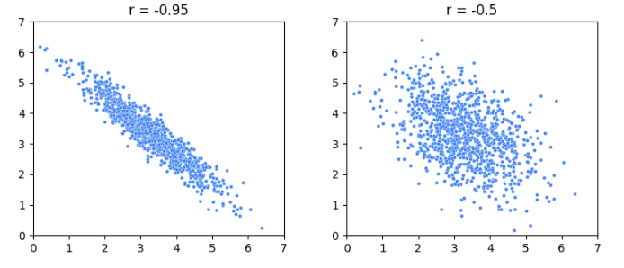

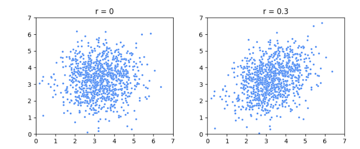


However, $r$ only tells you the strength of the linear correlation between the variables; it does not tell you anything about the magnitude of the slope of the relationship between the variables aside from its sign. For example, variables with $r=1$ wouldn't tell you if increasing $X$ by one would lead to $Y$ increasing by 10, 100, 0.1, or something else. It would only tell you that you can be sure that it *would* increase. This fact is illustrated in the following figure, where even though the slopes of the lines are all different, $r$ is only either -1 or 1. If the line is perfectly horizontal or perfectly vertical, then $r$ is undefined. (If you’re wondering why, refer to the equation below. One of the terms in the denominator would equal zero, which would make the whole denominator equal zero, which would result in an

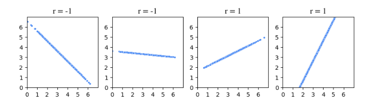

### Calculate $r$

The formula for $r$ is:

$$
r=\frac{covariance(X ⁣,Y)}{(SD X)(S⁣D Y)}
$$

where: $$
covariance(X ⁣,Y)=\frac{\sum_{i=1}^n (x_i-\bar{x})(y_i-\bar{y})}{n}
$$

::: nota
Note: The formulas for $r$ and covariance given here represent those used for entire populations. For samples, the denominator of the covariance formula is $n - 1$ and, similarly, the standard deviations in the formula for $r$ are calculated using $n - 1$ instead of $n$. For simplicity, this reading will use the population formulas in its demonstrations.
:::

An easier way of thinking about this calculation is:

the numerator—the covariance—represents the extent to which $X$ and $Y$ vary together from their respective means. When this value is positive, it suggests that high values of $X$ tend to be associated with high values of $Y$, indicating a positive correlation. Conversely, if the value is negative, it suggests that high values of $X$ tend to be associated with low values of $Y$ and vice versa, indicating a negative correlation. 

The denominator—the product of the standard deviations—standardizes the units of the numerator. It adjusts for the inherent variability of the individual variables. This makes $r$ a statistic without a unit. It is a pure number, without dimension.

An equivalent way to calculate $r$ is to convert each data point in each variable to standard units (subtract the mean, divide by the standard deviation), then take the average of the products.

Here’s an example. Suppose five students took an exam and you recorded how many hours they spent studying and also their grade. The following table breaks out the calculation of $r$.

remember the formula for standard units: $$
z = \frac{(x - \bar{x})}{SD}
$$

+----------------+-----------------+------+------+--------------------------------------------------------------------------------------------------------------------+
|                |                 |      |      | Hours studying (X) \| Exam grade (Y) \| X in standard units \| Y in standard units \| Product of standard units \| |
+================+=================+======+======+:===================================================================================================================+
| 2              | 75              | -1.5 | -0.5 | 0.75                                                                                                               |
+----------------+-----------------+------+------+--------------------------------------------------------------------------------------------------------------------+
| 4              | 65              | -0.5 | -1.5 | 0.75                                                                                                               |
+----------------+-----------------+------+------+--------------------------------------------------------------------------------------------------------------------+
| 5              | 80              | 0    | 0    | 0                                                                                                                  |
+----------------+-----------------+------+------+--------------------------------------------------------------------------------------------------------------------+
| 6              | 95              | 0.5  | 1.5  | 0.75                                                                                                               |
+----------------+-----------------+------+------+--------------------------------------------------------------------------------------------------------------------+
| 8              | 85              | 1.5  | 0.5  | 0.75                                                                                                               |
+----------------+-----------------+------+------+--------------------------------------------------------------------------------------------------------------------+
| **mean X = 5** | **mean Y = 80** |      |      | **mean of products (r) = 0.6**                                                                                     |
|                |                 |      |      |                                                                                                                    |
| **SD X = 2**   | **SD Y = 10**   |      |      |                                                                                                                    |
+----------------+-----------------+------+------+--------------------------------------------------------------------------------------------------------------------+

The correlation coefficient is 0.6. Here is a graph of this data:

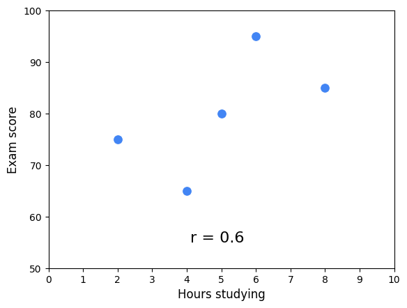

Notice that the cloud of points slopes upwards. This corresponds with $r$ being positive. The correlation coefficient works as an indicator of association because it uses the product of each variable’s deviation from its mean. When the product is positive, it means *both* the $X$ and the $Y$ values are either below their respective means (negative standard units) or above their respective means (positive standard units). They vary together. However, when this product is negative, it means one of the values is above its mean and the other is below it. They vary in opposing directions relative to their respective means.

The following figure illustrates this idea. The figure is divided into quadrants. The vertical line represents the mean $X$ value and the horizontal line represents the mean $Y$ value. Each point is labeled with the product of its standardized scores (refer to the table above). The average of these scores is $r$. When $r$ is positive, more points will tend to be in the positive quadrants, and vice versa.

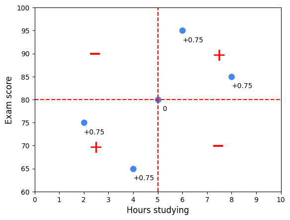

## **Regression**

In the absence of any other information, if you had to guess a randomly selected student’s exam score, the best way for you to minimize your error would be to guess the average of all the students’ scores. But what if you also knew how many hours that student studied? Now, your best guess might be the average score of only the students who studied for that many hours. 

Here is an example using a sample of 100 students with study times rounded to the nearest half hour. Suppose you were told a student studied for seven hours. To guess their exam score, one way to minimize error is to guess the average of only the students who studied for seven hours.

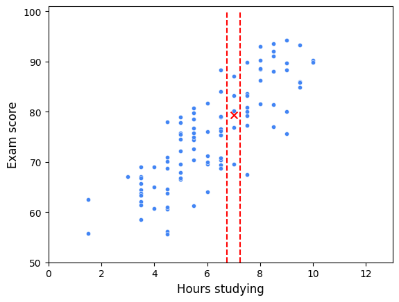

In this scatterplot, all of the students who studied for seven hours fall between the two vertical lines. Their mean exam score is represented by an $X$. Linear regression expands on this concept. A regression line represents the estimated average value of $Y$ for every value of $X$, given the assumptions and limitations of a linear model. In other words, the actual average $Y$ values for each $X$ might not lie exactly on the regression line if the relationship between $X$ and $Y$ is not perfectly linear or if there are other factors influencing $Y$ that are not included in the model. The regression line attempts to balance out these influences to find a straight-line relationship that best fits the data as a whole. It’s an estimation of the central tendency of $Y$, given $X$.

### The regression equation

Now that you know about $r$ and you better understand the concept of regression, you’re ready to put everything together to find the line of best fit through the data. The formula for this line is known as the **regression equation**. There are two keys to this step.

The first is:

-   The mean value of $X$ and the mean value of $Y$ (i.e., point (x̄, ȳ)) will always fall on the regression line. 

The second is to understand what $r$ means: ::: nota For each increase of one standard deviation in $X$, there is an expected increase of $r$ standard deviations in $Y$, on average over $X$.  ::: The following figure illustrates how these concepts work together to determine the regression line.

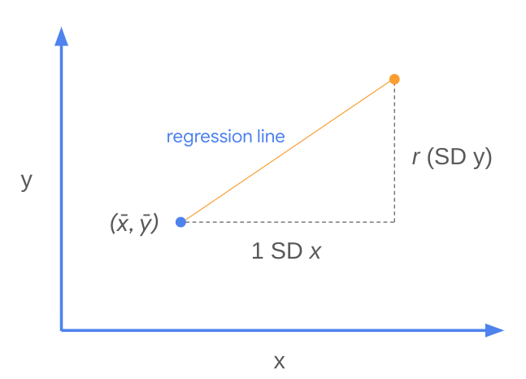

In other words, the slope of the regression line is: $$
m = r \frac{SD ⁣Y}{SD ⁣X}
$$

This is $m$ in the formula for a line: $y = mx + b$. The intercept, represented by $b$, is therefore: $b = y - mx$. Because you know that point ($\bar{x}$, $\bar{y}$) is always on the regression line, you can plug in the $x$ and $y$ values from this point to calculate the intercept. Here’s an example using the original sample of five students.

|           | **Hours studying (X)** | **Exam grade (Y)** |
|:----------|:-----------------------|:-------------------|
| **mean:** | 5                      | 80                 |
| **SD:**   | 2                      | 10                 |
| **r:**    | **0.6**                |                    |

Broken into steps:

1.  Calculate slope: $m = r \frac{SD ⁣Y}{SD ⁣X} = 0.6 \frac{10}{2} = 3$.

2.  Calculate the intercept: Substitute $\bar{x}$, $\bar{y}$, and $m$ into the equation $y = mx + b$:   $80 = 3(5) + b$  →   $b = 65$.

3.  Generalize to get the regression equation: $y = 3x + 65$.

Here is the regression line overlaid onto the data:

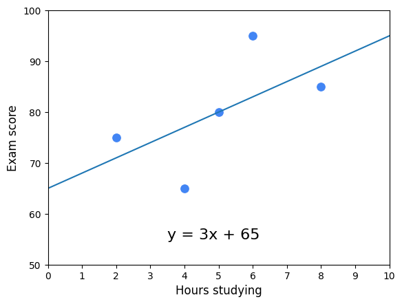

This is referred to as "the regression of $Y$ on $X$." Here is the regression line for all 100 students:

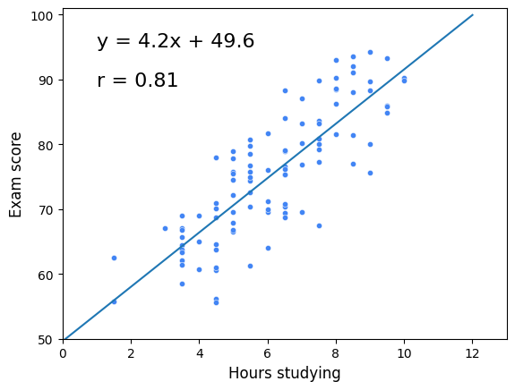

## **Key Takeaways**

Linear regression is one of the most important tools that data professionals use to analyze data. Understanding the fundamental building blocks of simple linear regression will help you as you continue learning about more complex methods of regression analysis. Here are some key points to keep in mind:

-   Correlation is a measurement of the way two variables move together.

-   $r$ (a.k.a.\* Pearson’s correlation coefficient, a.k.a. correlation coefficient) quantifies the strength of the linear relationship between two variables. 

    -   It always falls in the range of \[-1, 1\].

    -   Variables that tend to vary together from their means are positively correlated. Conversely, variables that tend to vary in opposite ways to their respective means are negatively correlated.

-   The regression line estimates the average y value for each $x$ value. It minimizes the error when estimating $y$, given $x$.

-   The slope of the regression line is $r \frac{SD ⁣Y}{SD ⁣X}$.

-   The point ($\bar{x}$, $\bar{y}$) is always on the regression line.

# Make linear regression assumptions

Alright, let's begin with the analyzed stage ​of the pace framework.

​The first task in ​simple linear regression analysis ​is checking the assumptions of the model. ​In addition to the technical needs of the model, ​you'll need to consider ​the business context of the problem you're working on. ​This will come in the plan stage. ​Previously, I spoke about ​m**odel assumptions as statements about the data that ​must be true in order to justify ​the use of a particular modeling technique**.

​Ensuring that we're using ​the right model given the data that we ​have allows us to be ​confident in the results those models produce. ​Think of model assumptions as the bridge between ​the analyze and construct phase of the pace framework. ​In other words, examine the assumptions ​before the construct phase when possible. ​Certain assumptions can only be ​checked after model construction. ​Make sure you check those assumptions after you apply ​the model to confirm if the model is valid or not.

​Data visualizations can be used as ​a tool to determine if model assumptions are met. ​Thankfully, Python will help you ​tremendously with generating these, ​and I'll be here to guide you through it all too.

​There are four key assumptions ​of a simple linear regression: - linearity, - normality, ​ - independent observations, - and homoscedasticity.

​For now, we'll focus on understanding what each of ​these assumptions mean and how they ​are checked using data visualizations.

## Linearity

​The first assumption of ​a linear regression just so happens to ​be the simplest to check for, the linearity assumption.

​You already know that the linear in ​linear regression comes from the way ​the data looks when plotted on an $x$, $​y$ coordinate plane: a line. ​To detect if this assumption is met, ​you just have to make sure that the points on ​the plot appear to fall along a straight line.

​If the visualization looks like ​a random cloud or resembles a curve rather than a line, ​then the assumption is considered invalidated, ​meaning that this model does not fit the data well. ​You might need a different or ​a more complicated model for this dataset.

```{python}
import matplotlib.pyplot as plt
import numpy as np

# Set random seed for reproducibility
np.random.seed(42)

# Generate Data 1: Non-linear (Quadratic curve)
x1 = np.linspace(-3, 3, 100)
y1 = -(x1**2) + np.random.normal(0, 1.2, size=len(x1))

# Generate Data 2: Random cloud (No linear or non-linear relationship)
x2 = np.random.uniform(-3, 3, 100)
y2 = np.random.uniform(-10, 2, 100)

# Setup figure with 2 subplots side-by-side
fig, (ax1, ax2) = plt.subplots(1, 2, figsize=(12, 5), dpi=100)

# Plot 1: Quadratic Curve
ax1.scatter(x1, y1, color='black', s=40, zorder=3)
ax1.set_title("Non-Linear Trend (Quadratic)", fontsize=13, pad=12)
ax1.set_xlabel("X", fontsize=11)
ax1.set_ylabel("Y", fontsize=11)
ax1.set_xticks([])
ax1.set_yticks([])
for spine in ax1.spines.values():
    spine.set_color('#cccccc')
ax1.text(0.90, 0.90, '❌', fontsize=24, transform=ax1.transAxes, ha='center', va='center')

# Plot 2: Random Cloud
ax2.scatter(x2, y2, color='black', s=40, zorder=3)
ax2.set_title("Random Cloud (No Relationship)", fontsize=13, pad=12)
ax2.set_xlabel("X", fontsize=11)
ax2.set_ylabel("Y", fontsize=11)
ax2.set_xticks([])
ax2.set_yticks([])
for spine in ax2.spines.values():
    spine.set_color('#cccccc')
ax2.text(0.90, 0.90, '❌', fontsize=24, transform=ax2.transAxes, ha='center', va='center')

plt.suptitle("Linearity Assumption NOT Met: Two Scenarios", fontsize=16, y=1.02)
plt.tight_layout()
plt.savefig('linearity_comparison.png', bbox_inches='tight')
print("Successfully generated plot!")
```

​In contrast, a scatter plot that shows ​the data points clustering around a line indicates ​the linear regression would be ​an appropriate model to represent ​the relationship between $x$ and $y$.

```{python}
import matplotlib.pyplot as plt
import numpy as np
import seaborn as sns
import statsmodels.api as sm

# Set random seed for reproducibility
np.random.seed(42)

# Generate linear data with random noise
x = np.linspace(1, 10, 80)
y = 2.0 * x + 3.0 + np.random.normal(loc=0.0, scale=2.2, size=len(x))

# 1. Fit Ordinary Least Squares (OLS) model using Statsmodels
X = sm.add_constant(x)
model = sm.OLS(y, X)
results = model.fit()

# Extract fitted values and residuals
fitted_values = results.fittedvalues
residuals = results.resid

# 2. Apply Seaborn theme to match course aesthetics
sns.set_theme(style="darkgrid")

# Create figure with 2 subplots (Observed Fit + Residuals Diagnostic Plot)
fig, axes = plt.subplots(1, 2, figsize=(12, 4.8), dpi=100)

# Subplot 1: Regression Plot (Y vs X) using Seaborn
sns.regplot(
    x=x,
    y=y,
    ax=axes[0],
    color="#1a73e8",
    scatter_kws={"color": "black", "s": 40},
    line_kws={"linewidth": 2},
)
axes[0].set_title(
    "Linearity Met: Observed vs Fitted Line",
    fontsize=12,
    fontweight="bold",
    pad=10,
)
axes[0].set_xlabel("Predictor (X)")
axes[0].set_ylabel("Outcome (Y)")

# Subplot 2: Residuals vs Fitted Plot using Seaborn (Primary Diagnostic Plot)
sns.scatterplot(x=fitted_values, y=residuals, ax=axes[1], color="#1a73e8", s=45)
axes[1].axhline(0, color="red", linestyle="--", linewidth=1.5)
axes[1].set_title(
    "Linearity Met: Residuals vs Fitted Values\n(Random Cloud around 0)",
    fontsize=12,
    fontweight="bold",
    pad=10,
)
axes[1].set_xlabel("Fitted Values ($\hat{Y}$)")
axes[1].set_ylabel("Residuals ($e$)")

plt.tight_layout()
plt.show()
```

## Normality

​Next up on the checklist is the normality assumption. ​This assumes that **the residual values ​or errors are normally distributed**. ​Since this assumption is about residuals, ​you cannot check the assumption ​until after the model is built. ​But once the model is built, ​you can create a specific plot called a ​quantile-quantile or QQ plot of the residuals. ​If the points on the plot appear to ​form a straight diagonal line, ​then you can assume normality ​and check this assumption off the list.

```{python}
import matplotlib.pyplot as plt
import numpy as np
import scipy.stats as stats

# Set random seed matching previous code
np.random.seed(42)

# Generate identical data: linear with gaussian noise
x = np.linspace(1, 10, 80)
y = 2.0 * x + 3.0 + np.random.normal(loc=0.0, scale=2.2, size=len(x))

# Calculate OLS model residuals
m, b = np.polyfit(x, y, 1)
residuals = y - (m * x + b)


# Create Q-Q Plot
fig, ax = plt.subplots(figsize=(7, 5), dpi=100)

# Generate Q-Q plot data using scipy.stats
(osm, osr), (slope, intercept, r) = stats.probplot(residuals, dist="norm")

# Plot standard Q-Q scatter points and reference line
ax.scatter(osm, osr, color='black', s=45, zorder=3)
ax.plot(osm, slope * np.array(osm) + intercept, color='#1a73e8', linewidth=2.5, zorder=4)

# Title and Labels
ax.set_title("Q-Q Plot: Normality Assumption MET", fontsize=15, pad=12, fontweight='bold')
ax.set_xlabel("Theoretical Quantiles", fontsize=12, labelpad=8)
ax.set_ylabel("Ordered Residuals", fontsize=12, labelpad=8)

# Styling frame
for spine in ax.spines.values():
    spine.set_color('#cccccc')
    spine.set_linewidth(1.2)

# Minimal tick display
ax.tick_params(colors='#4a4a4a', labelsize=10)

# Green Checkmark Badge
ax.text(0.10, 0.90, '✓', color='#2e7d32', fontsize=26, fontweight='bold',
        transform=ax.transAxes, ha='center', va='center',
        bbox=dict(boxstyle='circle,pad=0.2', facecolor='#f0f0f0', edgecolor='none'))

plt.tight_layout()
plt.savefig('qq_plot_met.png', bbox_inches='tight')
```

::: extra

**Fitting the OLS Model:**
```python
results = sm.OLS(y, sm.add_constant(x)).fit()
```
`sm.OLS` fits an Ordinary Least Squares regression. `sm.add_constant(x)` adds an intercept column of ones so the model estimates both slope ($\beta_1$) and intercept ($\beta_0$).

**Extracting Residuals:**
```python
residuals = results.resid
```
`results.resid` automatically calculates the model residuals $e_i = y_i - \hat{y}_i$ across all observed points.

**Generating the Q-Q Plot:**
```python
sm.qqplot(residuals, line='s')
```
The function sorts sample residuals, maps them against theoretical standard normal quantiles, and overlays a reference line.

| Parameter / Attribute | Description |
| :--- | :--- |
| `residuals` | Array-like series of model residuals $e_i$. |
| `line='s'` | Standardized line fit through the data (uses sample mean and standard deviation). |
| `line='45'` | Adds a 1-to-1 reference line ($y = x$). |
| `ax=ax` | Passes the plot directly into a Matplotlib/Seaborn subplot axis. |

:::

### Common Departures from Normality

```{python}
#| label: fig-qq-departures
#| fig-cap: "Diagnostic Q-Q plots showcasing ideal normality vs. common violations."
#| fig-align: center

import matplotlib.pyplot as plt
import numpy as np
import seaborn as sns
import statsmodels.api as sm

np.random.seed(42)
sns.set_theme(style="darkgrid")

fig, axes = plt.subplots(1, 3, figsize=(15, 4.5), dpi=100)

# Scenario A: Normal (Ideal)
res_normal = np.random.normal(0, 1, 100)
sm.qqplot(res_normal, line="s", ax=axes[0])
axes[0].set_title("Normal Residuals (Ideal)", fontweight="bold")

# Scenario B: Heavy-Tailed (Fat Tails)
res_heavy = np.random.standard_t(df=3, size=100)
sm.qqplot(res_heavy, line="s", ax=axes[1])
axes[1].set_title("Heavy Tails (Extreme Outliers)", fontweight="bold")

# Scenario C: Right-Skewed
res_skewed = np.random.exponential(scale=1.0, size=100) - 1.0
sm.qqplot(res_skewed, line="s", ax=axes[2])
axes[2].set_title("Right-Skewed Residuals", fontweight="bold")

plt.tight_layout()
plt.show()
```

* **Straight Line:** Points follow the red reference line closely. Normality assumption is met.
* **S-Curve (Heavy Tails):** Points bend upward on the right end and downward on the left end, indicating extreme outliers on both sides.
* **Upward/Downward Curve (Skewness):** Points curve away from the line in a single arc, signaling an asymmetric distribution (e.g., right-skewed or left-skewed errors).
:::

### ​Independent Observation assumption

Next is the independent observation assumption, ​which states that each observation ​in the dataset is independent. ​Here, it is helpful to use contextual information about ​data collection and the variables ​used to determine if this is true. **​If the assumption is met, ​we would expect a scatter plot of the fitted values ​versus residuals to resemble ​a random cloud of data points. ​**If there are any patterns, ​then we might need to re-examine the data.

```{python}

#| label: fig-independence-assumption
#| fig-cap: "Checking the Independence Assumption: Random residual cloud vs. non-random trend."
#| fig-align: center

import matplotlib.pyplot as plt
import numpy as np
import seaborn as sns

np.random.seed(42)
n = 100

# Apply Seaborn theme for course consistency
sns.set_theme(style="darkgrid")

# 1. Assumption MET: Random cloud (Independent)
fitted_met = np.random.uniform(5, 25, n)
residuals_met = np.random.normal(0, 2, n)

# 2. Assumption VIOLATED: Non-linear / Autocorrelated pattern
fitted_viol = np.linspace(5, 25, n)
residuals_viol = 3 * np.sin(fitted_viol / 2) + np.random.normal(0, 0.8, n)

fig, axes = plt.subplots(1, 2, figsize=(12, 5), dpi=100)

# Plot Met (Seaborn)
sns.scatterplot(
    x=fitted_met,
    y=residuals_met,
    color="#1a73e8",
    alpha=0.8,
    s=50,
    ax=axes[0],
)
axes[0].axhline(0, color="#d93025", linestyle="--", linewidth=1.5)
axes[0].set_title(
    "Assumption MET: Random Cloud\n(Independent Observations)",
    fontsize=12,
    fontweight="bold",
    pad=10,
)
axes[0].set_xlabel("Fitted Values ($\hat{y}$)")
axes[0].set_ylabel("Residuals ($e$)")
axes[0].set_ylim(-6, 6)

# Badge Met
axes[0].text(
    0.08,
    0.88,
    "✓",
    color="#2e7d32",
    fontsize=22,
    fontweight="bold",
    transform=axes[0].transAxes,
    ha="center",
    va="center",
    bbox=dict(
        boxstyle="circle,pad=0.2", facecolor="#e8f5e9", edgecolor="none"
    ),
)

# Plot Violated (Seaborn)
sns.scatterplot(
    x=fitted_viol,
    y=residuals_viol,
    color="#e67c73",
    alpha=0.8,
    s=50,
    ax=axes[1],
)
axes[1].axhline(0, color="#d93025", linestyle="--", linewidth=1.5)

# Trend line highlighting pattern
smooth_x = np.linspace(5, 25, 200)
axes[1].plot(
    smooth_x,
    3 * np.sin(smooth_x / 2),
    color="#c5221f",
    linestyle="-",
    linewidth=2,
    label="Non-random Pattern",
)

axes[1].set_title(
    "Assumption VIOLATED: Clear Pattern\n(Dependent / Autocorrelated Data)",
    fontsize=12,
    fontweight="bold",
    pad=10,
)
axes[1].set_xlabel("Fitted Values ($\hat{y}$)")
axes[1].set_ylabel("Residuals ($e$)")
axes[1].set_ylim(-6, 6)
axes[1].legend(loc="lower right")

# Badge Violated
axes[1].text(
    0.08,
    0.88,
    "✗",
    color="#c5221f",
    fontsize=22,
    fontweight="bold",
    transform=axes[1].transAxes,
    ha="center",
    va="center",
    bbox=dict(
        boxstyle="circle,pad=0.2", facecolor="#fce8e6", edgecolor="none"
    ),
)

plt.tight_layout()
plt.show()

```

### Homoscedasticity

Last but not least, ​the homoscedasticity assumption is fourth on the list. ​This one sounds complicated but ​knowing the literal meaning of the term helps. ​**Homoscedasticity means having the same scatter.** ​Scatter plots come to the rescue once ​again when checking for homoscedasticity. ​

Returning to the scatter plot of ​fitted values versus residuals, ​there should be constant variance ​along the values of the dependent variable. ​This assumption is true if you notice ​no clear pattern in a scatter plot. ​Sometimes you'll hear this described ​as a random cloud of data points. ​But for example, if you observe a cone-shaped pattern, ​then the assumption is invalid.

```{python}
#| label: fig-homoscedasticity-assumption
#| fig-cap: "Checking Homoscedasticity: Constant residual variance vs. expanding cone shape."
#| fig-align: center

import matplotlib.pyplot as plt
import numpy as np
import seaborn as sns

np.random.seed(42)
n = 100

# Apply Seaborn theme for course consistency
sns.set_theme(style="darkgrid")

# Fitted values for both plots
fitted_values = np.linspace(5, 25, n)

# 1. Homoscedasticity (Constant Variance) -> Random Cloud / Equal Spread
res_homo = np.random.normal(0, 2, n)

# 2. Heteroscedasticity (Non-constant Variance) -> Cone / Funnel Shape
# Noise scale increases linearly with fitted values
sigma = 0.3 * fitted_values
res_hetero = np.random.normal(0, sigma, n)

fig, axes = plt.subplots(1, 2, figsize=(12, 4.8), dpi=100)

# Left Plot: Homoscedasticity (Seaborn)
sns.scatterplot(
    x=fitted_values, y=res_homo, color="#1a73e8", alpha=0.8, s=50, ax=axes[0]
)
axes[0].axhline(0, color="#d93025", linestyle="--", linewidth=1.5)

# Parallel variance bands
axes[0].axhline(4.5, color="#1a73e8", linestyle=":", alpha=0.7, linewidth=1.5)
axes[0].axhline(-4.5, color="#1a73e8", linestyle=":", alpha=0.7, linewidth=1.5)

axes[0].set_title(
    "Homoscedasticity MET: Constant Variance\n(Equal Scatter / Random Cloud)",
    fontsize=12,
    fontweight="bold",
    pad=10,
)
axes[0].set_xlabel("Fitted Values ($\hat{y}$)")
axes[0].set_ylabel("Residuals ($e$)")
axes[0].set_ylim(-12, 12)

# Green Check Badge
axes[0].text(
    0.08,
    0.88,
    "✓",
    color="#2e7d32",
    fontsize=22,
    fontweight="bold",
    transform=axes[0].transAxes,
    ha="center",
    va="center",
    bbox=dict(
        boxstyle="circle,pad=0.2", facecolor="#e8f5e9", edgecolor="none"
    ),
)

# Right Plot: Heteroscedasticity (Seaborn)
sns.scatterplot(
    x=fitted_values, y=res_hetero, color="#e67c73", alpha=0.8, s=50, ax=axes[1]
)
axes[1].axhline(0, color="#d93025", linestyle="--", linewidth=1.5)

# Cone boundary lines
axes[1].plot(
    fitted_values,
    0.45 * fitted_values,
    color="#c5221f",
    linestyle="--",
    linewidth=1.8,
    label="Expanding Variance",
)
axes[1].plot(
    fitted_values,
    -0.45 * fitted_values,
    color="#c5221f",
    linestyle="--",
    linewidth=1.8,
)

axes[1].set_title(
    "Homoscedasticity VIOLATED: Non-Constant Variance\n(Cone / Funnel Shape)",
    fontsize=12,
    fontweight="bold",
    pad=10,
)
axes[1].set_xlabel("Fitted Values ($\hat{y}$)")
axes[1].set_ylabel("Residuals ($e$)")
axes[1].set_ylim(-12, 12)
axes[1].legend(loc="lower right")

# Red X Badge
axes[1].text(
    0.08,
    0.88,
    "✗",
    color="#c5221f",
    fontsize=22,
    fontweight="bold",
    transform=axes[1].transAxes,
    ha="center",
    va="center",
    bbox=dict(
        boxstyle="circle,pad=0.2", facecolor="#fce8e6", edgecolor="none"
    ),
)

plt.tight_layout()
plt.show()
```

::: extra​
#### Breakdown of the Visuals

-   **Etymology:** *Homo* = Same, *Scedasticity* = Scatter/Spread. So **Homoscedasticity** simply means "Equal Scatter."

-   **Left Plot (Met):** The vertical spread of the residuals remains uniform from left to right inside parallel boundaries. The residual variance does not depend on the predicted value $\hat{y}$.

-   **Right Plot (Violated / Heteroscedasticity):** The vertical spread expands into a **cone or funnel shape** as fitted values grow larger. This non-constant variance often occurs when working with monetary data or scaling growth, and can usually be fixed by applying a logarithmic transformation ($\ln(y)$) to the target variable.
:::

Linearity, normality, independent observations and ​homoscedasticity are the four assumptions ​of a simple linear regression. ​Before moving ahead, don't feel like you need ​to memorize all of this material right now. ​Remember, data analysis is an iterative process. ​You can go back to these concepts, ​check to see how the assumptions aligned with your data, ​and then move forward with the regression process. ​You will have plenty of opportunities to ​practice and hone your skills throughout this course. ​Now let's apply everything you've learned here ​and try it out on a dataset using Python.

------------------------------------------------------------------------

# The four main assumptions of simple linear regression

In this reading, you will review the four main assumptions of simple linear regression, how to check that the assumptions are met, and what to do if an assumption is not met. You can use the additional resources to replicate the graphs and explore assumptions on your own. If there are any terms not defined in this reading, refer to the glossary of terms available throughout the course at the end of each module. This reading will cover:

-   Simple linear regression assumptions

-   How to check the validity of the assumptions

-   What to do if an assumption is violated

## Simple linear regression assumptions

To recap, there are four assumptions of simple linear regression:

1.  **Linearity:** Each predictor variable (Xi) is linearly related to the outcome variable (Y).

2.  **Normality:** The errors are normally distributed.**\***

3.  **Independent Observations:** Each observation in the dataset is independent.

4.  **Homoscedasticity:** The variance of the errors is constant or similar across the model.**\***

**\*Note on errors and residuals**

This course has rather interchangeably used the terms "errors" and "residuals" in connection with regression. You may see this in other online resources and materials throughout your time as a data professional. In actuality, there is a difference:

-   **Residuals** are the difference between the predicted and observed values. You can calculate residuals after you build a regression model by subtracting the predicted values from the observed values.

-   **Errors** are the natural noise assumed to be in the model.

-   Residuals are used to estimate errors when checking the normality and homoscedasticity assumptions of linear regression.

## How to check the validity of the assumptions

As previously reviewed, many of the simple linear regression assumptions can be checked through data visualizations. Some assumptions can be checked before a model is built, and others can only be checked after the model is constructed, and predicted values are calculated.

### **Linearity**

In order to assess whether or not there is a linear relationship between the independent and dependent variables, it is easiest to create a scatterplot of the dataset. The independent variable would be on the x-axis, and the dependent variable would be on the y-axis. There are a number of different Python functions that you can use to read in the data and to create a scatterplot. Some packages used for data visualizations include Matplotlib, seaborn, and Plotly. Testing the linearity assumption should occur before the model is built.

```{python}
import pandas as pd
import seaborn as sns
penguins = pd.read_csv(r'Datasets/penguins.csv')
chinstrap_penguins = penguins[penguins['species'] == 'Chinstrap']

# Create pairwise scatterplots of Chinstrap penguins data
sns.pairplot(chinstrap_penguins)
```

### Normality

The normality assumption focuses on the errors, which can be estimated by the residuals, or the difference between the observed values in the data and the values predicted by the regression model. For that reason, the normality assumption can only be confirmed after a model is built and predicted values are calculated. Once the model has been built, you can either create a QQ-plot to check that the residuals are normally distributed, or create a histogram of the residuals. Whether the assumption is met is up to some level of interpretation.

**Quantile-quantile plot** The quantile-quantile plot (Q-Q plot) is a graphical tool used to compare two probability distributions by plotting their quantiles against each other. Data professionals often prefer Q-Q plots to histograms to gauge the normality of a distribution because it’s easier to discern whether a plot adheres to a straight line than it is to determine how closely a histogram follows a normal curve. Here’s how Q-Q plots work when assessing the normality of a model’s residuals:

1.  **Rank-order the residuals.** Sort your $n$ residuals from least to greatest. For each one, calculate what percentage of the data falls at or below this rank. These are the $n$ quantiles of your data.

2.  **Compare to a normal distribution.** Divide a standard normal distribution into $n+1$ equal areas (i.e., slice it $n$ times). If the residuals are normally distributed, the quantile of each residual (i.e., what percentage of the data falls below each ranked residual) will align closely with the corresponding $z$-scores of each of the $n$ cuts on the standard normal distribution (these can be found in a normal $z$-score table or, more commonly, using statistical software).

3.  **Construct a plot.** A Q-Q plot has the known quantile values of a standard normal distribution along its x-axis and the rank-ordered residual values on its y-axis. If the residuals are normally distributed, the quantile values of the residuals will correspond with those of the standardized normal distribution, and both will increase linearly. If you first standardize your residuals (convert to $z$-scores by subtracting the mean and dividing by the standard deviation), the two axes will be on identical scales, and, if the residuals are indeed normally distributed, the line will be at a 45° angle. However, standardizing the residuals is not a requirement of a Q-Q plot. In either case, if the resulting plot is not linear, the residuals are not normally distributed.

In the following figure, the first Q-Q plot depicts data that was taken from a normal distribution. It forms a line when plotted against the quantiles of a standard normal distribution. The second plot depicts data that was drawn from an exponential distribution. The third plot uses data drawn from a uniform distribution. Notice how the second and third plots don’t adhere to a line.

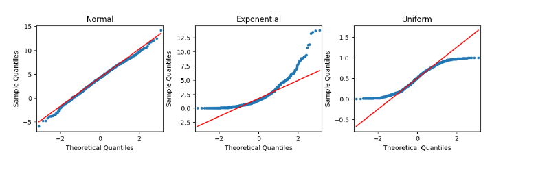

#### **How to code a Q-Q plot**

Thankfully, you don’t have to manually perform the steps outlined previously. There are computing libraries to handle that. One way to create a Q-Q plot is to use the statsmodels library. If you import **statsmodels.api**, you can use the [qqplot()](https://www.statsmodels.org/stable/generated/statsmodels.graphics.gofplots.qqplot.html) function directly. The example below uses the residuals from a **statsmodels ols** model object. The model regresses penguins’ flipper length on their bill depth (Y on X).

```{python}
import statsmodels.api as sm
import matplotlib.pyplot as plt

#drop na values

chinstrap_penguins = chinstrap_penguins.dropna()
flipper_length = chinstrap_penguins.flipper_length_mm
bill_depth = chinstrap_penguins.bill_depth_mm

model = sm.OLS(flipper_length, sm.add_constant(bill_depth))
results = model.fit()
residuals = results.resid
fig = sm.qqplot(residuals, line = 's')
plt.show()
```

And here is a histogram of the same data:

```{python}
fig = sns.histplot(residuals)
fig.set_xlabel("Residual Value")
fig.set_title("Histogram of Residuals")
plt.show()
```

### Independent Observations

Whether or not observations are independent is dependent on understanding your data. Asking questions like:

How was the data collected?

What does each data point represent?

Based on the data collection process, is it likely that the value of one data point impacts the value of another data point?

An objective review of these questions, which would include soliciting insights from others who might notice things you don't, can help you determine whether or not the independent observations assumption is violated. This in turn will allow you to determine your next steps in working with the dataset at hand.

### Homoscedasticity

Like the normality assumption, the homoscedasticity assumption concerns the residuals of a model, so it can only be evaluated after a regression model has already been constructed. A scatterplot of the fitted values (i.e., the model’s predicted Y values) versus the residuals can help determine whether the homoscedasticity assumption is violated.

```{python}
import matplotlib.pyplot as plt

#get the fitted values from the model
fitted_values = results.fittedvalues

fig = sns.scatterplot(x=fitted_values, y=residuals)
fig.axhline(0)
fig.set_xlabel("Fitted Values")
fig.set_ylabel("Residuals")
plt.show()
```

## What to do if an assumption is violated 

Now that you've reviewed the four assumptions and how to test for their violations, it’s time to discuss some common next steps you can take once an assumption is violated. Keep in mind that if you transform the data, this might change how you interpret the results. Additionally, if these potential solutions don’t work for your data, you have to consider trying a different kind of model.

For now, focus on a few essential approaches to get you started!

### Linearity: 

Transform one or both of the variables, such as taking the logarithm.

For example, if you are measuring the relationship between years of education and income, you can take the logarithm of the income variable and check if that helps the linear relationship.

### Normality:

Transform one or both variables. Most commonly, this would involve taking the logarithm of the outcome variable.

When the outcome variable is right skewed, such as income, the normality of the residuals can be affected. So, taking the logarithm of the outcome variable can sometimes help with this assumption.

If you transform a variable, you will need to reconstruct the model and then recheck the normality assumption to be sure. If the assumption is still not satisfied, you’ll have to continue troubleshooting the issue.

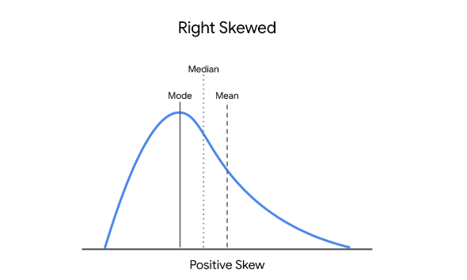

### Independent observations 

Take just a subset of the available data.

If, for example, you are conducting a survey and get responses from people in the same household, their responses may be correlated. You can correct for this by just keeping the data of one person in each household.

Another example is if you are collecting data over a time period. Let’s say you are researching data on bike rentals. If you collect your data every 15 minutes, the number of bikes rented out at 8:00 a.m. might correlate with the number of bikes rented out at 8:15 a.m. But, perhaps the number of bikes rented out is independent if the data is taken once every 2 hours, instead of once every 15 minutes.

### Homoscedasticity 

Define a different outcome variable.

If you are interested in understanding how a city’s population correlates with the number of restaurants in a city, you know that some cities are much more populous than others. You can then redefine the outcome variable as the ratio of population to restaurants.

Transform the Y variable.

As with the above assumptions, sometimes taking the logarithm or transforming the Y variable in another way can potentially fix inconsistencies with the homoscedasticity assumption.

## Key takeaways 

-   There are four key assumptions for simple linear regression: linearity, normality, independent observations, and homoscedasticity.

-   There are different ways to check the validity of each assumption. Some assumptions can be checked before the model is built, while some can be checked after the model is built.

-   There are ways to work with the data that can correct for violations of model assumptions.

-   Changing the variables will change the interpretation.

-   If the assumptions are violated, even after data transformations, you should consider other models for your data.

## Resources for more information

-   [Download the seaborn penguins dataset here](https://raw.githubusercontent.com/mwaskom/seaborn-data/master/penguins.csv "penguins dataset from seaborn GitHub repository")

-   More information about the penguins dataset: [Introduction to Palmer penguins ](https://allisonhorst.github.io/palmerpenguins/articles/intro.html)

-   More information about Q-Q plots: [Normal Quantile-Quantile Plots (video from jbstatistics)](https://www.youtube.com/watch?v=X9_ISJ0YpGw)