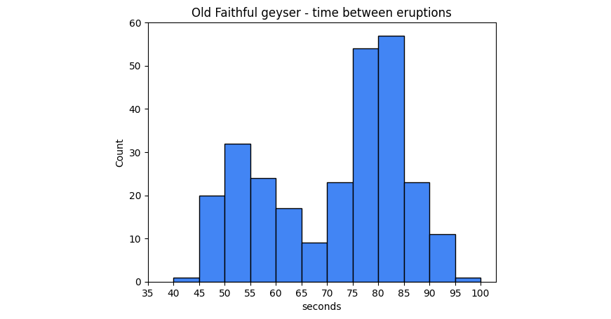
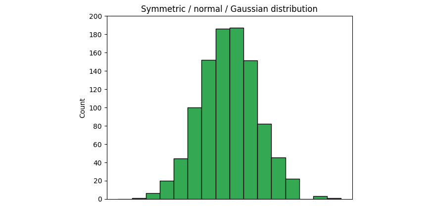
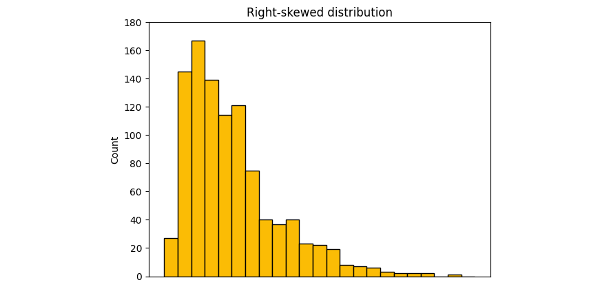
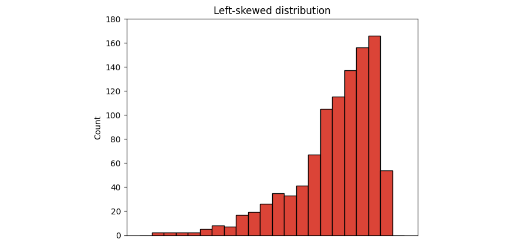
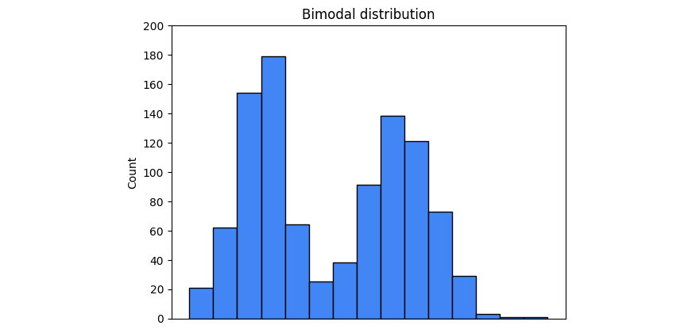
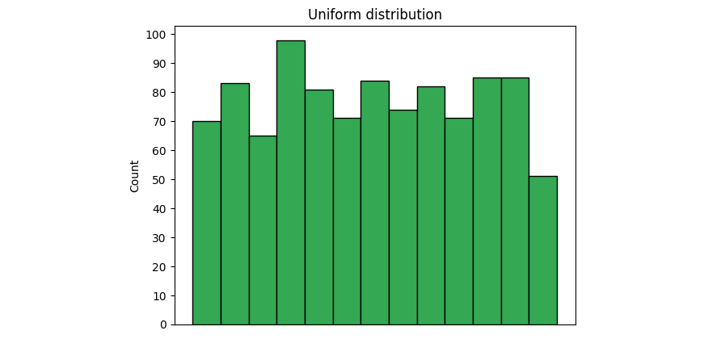

```{python}
#| include: false
import _setup
```

As a data analytics professional, ​you will often need to learn more about your datasets. ​This is where the structuring practice of EDA can help.

​Let's explore the valuable methods ​that are part of this practice. ​As you'll recall from earlier in the program, ​structuring helps you to organize, ​gather, separate, group, and ​filter your data in ​different ways to learn more about it. ​Next, we'll talk about ​the methods involved in structuring and later, ​you'll practice these concepts using Python.

​First on the list of structuring methods is **sorting**. ​Sorting is the process of ​arranging data into meaningful order. ​Imagine that you are given a dataset about kangaroos. ​

The kangaroo dataset contains information about ​kangaroo characteristics like pouch size, ​tail length, total body length, ​and much, much more. ​The first data we'll consider is a data column measuring ​the volume of the kangaroo pouches in cubic centimeters. ​We can sort those values in ascending or descending ​order from biggest to smallest or smallest to biggest. ​

Another useful structuring tool is **extraction**. ​Extracting is the process of retrieving ​data from a dataset or source for further processing, ​you can think of extraction as ​retrieving whole columns of data. ​An example of extraction is to ​take the kangaroo data from before, ​then evaluate just two of the columns from ​the dataset such as pouch volume and tail length. ​You can use the resulting data for ​analysis, comparisons, or visualization. ​

Another structuring method is **filtering**. ​Filtering is the process of ​selecting a smaller part of your dataset ​based on specified parameters ​and using it for viewing or analysis. ​You can think of filtering as ​selecting rows of a dataset. ​In the case of our kangaroo dataset, ​filtering can look like ​viewing only the kangaroo pouches of ​kangaroos that also have tails shorter than one meter. ​This is useful in finding ​meaningful groups or trends in the data.

​Next on the list of structuring methods is **slicing.** ​Slicing breaks information down into smaller parts to ​facilitate efficient examination and ​analysis from different viewpoints. ​Think of slicing as an either ​or both options for columns and rows. ​A combination of extraction and filtering. ​In the kangaroo dataset, ​let's say you have a column of ​their body length called total body length. ​In another column, you have the kangaroos identified ​as one of the three different regional populations. ​If you were to take the body length of ​only one of the three regional populations, ​you would be pulling a slice of the data.

**​Grouping** is our next structuring method. ​Grouping sometimes called bucketizing, ​is aggregating individual observations ​of a variable into groups. ​An example of grouping is to add a new column called ​Total Body length next to ​the kangaroo tail length column. ​Then group all the tail lengths into three types, ​long, average, and short ​based on the measurements in the tail length column. ​You can now find and organize ​the total body length values ​based on the kangaroo tail length groups. ​

The last structuring method is **merging**. ​Merging is a method to combine ​two different data frames ​along a specified starting column. ​For example imagine we had ​an additional dataset of ​kangaroo information from a different field study, ​but with the same parameters and variables. ​We might use the merge or join functions to ​align the columns and ​combine the new data into one data set. ​

It's essential that you do not change ​the meaning of the data while performing your filtering, ​sorting, slicing, joining, and merging operations. ​If for example, we did ​not merge the kangaroo pouch measurements ​correctly with their matching kangaroo name and ID, ​the data would not be representative ​and our analysis would be far less than useful. ​Being true to the data is being true to its story. ​Hopefully, you are beginning to understand the value of ​organizing and structuring data in order to analyze it. ​Coming up, we will practice structuring using Python.

------------------------------------------------------------------------

# Pandas tools for structuring a dataset

As you’ve learned, there are far too many Python functions to memorize all of them. That’s why, as every data professional will tell you, you’ll be using reference sheets and coding libraries nearly every day in your data analysis work. 

The following reference guide will help you identify the most common Pandas tools used for structuring data. Note that this is just for reference. For detailed information on how each method works, including explanations of every parameter and examples, refer to the linked documentation.

## **Combine data**

Note that for many situations that require combining data, you can use a number of different functions, methods, or approaches. Usually you’re not limited to a single “correct” function. So if these functions and methods seem very similar, don’t worry! It’s because they are! The best way to learn them, determine what works best for you, and understand them is to use them!

[**df.merge()**](https://pandas.pydata.org/docs/reference/api/pandas.DataFrame.merge.html "Link to pandas merge method documentation")

-   A method available to the **DataFrame** class.

-   Use **df.merge()** to take columns or indices from other dataframes and combine them with the one to which you’re applying the method.

-   Example\> `df1.merge(df2, how=‘inner’, on=[‘month’,’year’])`

[**pd.concat()**](https://pandas.pydata.org/docs/reference/api/pandas.concat.html "Link to pandas concat function documentation")

-   A pandas function to combine series and/or dataframes

-   Use **pd.concat()** to join columns, rows, or dataframes along a particular axis

-   Example: `df3 = pd.concat([df1.drop(['column_1','column_2'], axis=1), df2])`

[**\
df.join()**](https://pandas.pydata.org/docs/reference/api/pandas.DataFrame.join.html "Link to pandas join method documentation")

-   A method available to the **DataFrame** class.

-   Use **df.join()** to combine columns with another dataframe either on an index or on a key column. Efficiently join multiple **DataFrame** objects by index at once by passing a list.

-   Example: `df1.set_index('key').join(df2.set_index('key'))`

## Extract or select data

**df\[\[columns\]\]**

-   Use **df\[\[columns\]\]** to extract/select columns from a dataframe.

```{python}
import pandas as pd

# This is what the course platform ran hidden in the background
data = {
    'animal': ['cardinal', 'gecko', 'raven'],
    'class': ['Aves', 'Reptilia', 'Aves'],
    'color': ['red', 'green', 'black'],
    'legs': [2, 4, 2]
}

df = pd.DataFrame(data)


print(df)
print()
df[['animal', 'legs']]
```

[**df.select_dtypes()**](https://pandas.pydata.org/docs/reference/api/pandas.DataFrame.select_dtypes.html)

-   A method available to the **DataFrame** class.

-   Use **df.select_dtypes()** to return a subset of the dataframe’s columns based on the column dtypes (e.g., **float64**, **int64**, **bool**, **object**, etc.).

```{python}
print(df)
print()
df2 = df.select_dtypes(include=['int64'])
df2
```

## Filter data

Recall from Course 2 that Boolean masks are used to filter dataframes.

**df\[condition\]**

-   Use **df\[condition\]** to create a Boolean mask, then apply the mask to the dataframe to filter according to selected condition.

```{python}
print(df)
print()
df[df['class']=='Aves']
```

## Sort data

[**df.sort_values()**](https://pandas.pydata.org/docs/reference/api/pandas.DataFrame.sort_values.html "Link to sort_values function pandas documentation")

-   A method available to the **DataFrame** class.

-   Use **df.sort_values()** to sort data according to selected parameters.

```{python}
print()
df.sort_values(by=['legs'], ascending=False)
```

## Slice data 

[**df.iloc\[\]**](https://pandas.pydata.org/docs/reference/api/pandas.DataFrame.iloc.html "Link to iloc pandas documentation")

-   Use **df.iloc\[\]** to slice a dataframe based on an integer index location.

-   Examples:

    **df.iloc\[5:10, 2:\]** → selects only rows 5 through 9, at columns 2+

    **df.iloc\[5:10\]** → selects only rows 5 through 9, all columns **df.iloc\[1, 2\]** → selects value at row 1, column 2 **df.iloc\[\[0, 2\], \[2, 4\]\]** → selects only rows 0 and 2, at columns 2 and 4

[**df.loc\[\]**](https://pandas.pydata.org/docs/reference/api/pandas.DataFrame.loc.html "Link to loc pandas documentation")

-   Use **df.loc\[\]** to slice a dataframe based on a label or Boolean array.

```{python}
print(df)
print()
df.loc[:, ['color', 'class']]
```

## Key takeaways

The tools in this reference guide are foundational to structuring data, including filtering, sorting, merging, and slicing. You will find yourself using them throughout your career as a data professional. 

## Resources for more information

Refer to these links for more details on Python functions and their various parameters. 

-   [Pandas documentation to describe parameters in Python functions](https://pandas.pydata.org/docs/index.html)

-   [W3schools provides explanations for Python functions in an easy-to-understand way](https://www.w3schools.com/)

------------------------------------------------------------------------

# EDA structuring with Python

You've learned about how structuring data ​can help professionals analyze, ​understand, and learn more about their data. ​Now, let's use a python notebook, ​and discover how it works in practice. ​

We'll continue using our NOAA lightning strike dataset. ​For this video, we'll consider the data for 2018, ​and use our structuring tools to learn more about whether ​lightning strikes are more ​prevalent on some days than others. ​Before we do anything else, ​let's import our Python packages, and libraries. ​These are all packages and libraries ​you're familiar with, Pandas, ​NumPy, Seaborn, datetime, matplotlib.pyplot. ​For a quick refresher, ​let's convert our date column to datetime, ​and take a look at our column headers. 

```{python}

import pandas as pd
import numpy as np
import seaborn as sns
import datetime
from matplotlib import pyplot as plt
# Read in the 2018 data.
df = pd.read_csv(r'Datasets/eda_structuring_with_python_dataset1.csv') 
df.head()
#Convert the `date` column to datetime.
df['date'] = pd.to_datetime(df['date']) 
```

​We do this to get our dates ready for ​any future string manipulation we may want to do, ​and to remind us of what is in our data. ​As you remember, there are ​three columns in the dataset; date, ​number of strikes, and center point geom, ​which you'll find after running the head function. ​

Next, let's learn about the shape of our data ​by using the df shape function. ​When we run this cell, ​we get 3,401,012, 3. ​Take a moment to picture the shape of this dataset. ​We're talking about only three columns wide and ​nearly 3.5 million cells vertically. ​That's incredibly long and thin. 

```{python}
df.shape
```

​We'll use a function for finding any duplicates. ​When we enter df.drop_underscore ​duplicates with ​an empty argument field followed by.shape, ​the notebook will return the number of rows, ​and columns remaining after duplicates are removed. 

```{python}
df.drop_duplicates().shape
```

​Because this returns the same exact number ​as our shape function, ​we know there are no duplicate values. ​

Let's discuss some of those structuring concepts we ​learned about earlier. Let's start with sorting. ​We'll sort the number of strikes column in ​descending value or most to least. ​While we do this, ​let's consider the dates with ​the highest number of strikes. 

```{python}
# Sort by number of strikes in descending order.
df.sort_values(by='number_of_strikes', ascending=False).head(10)
```

 ​If we add the head function to the end, ​the notebook outputs the top 10 cells for us to analyze. ​We find that the highest number of ​strikes are in the lower 2000s. ​It does seem like a lot of ​lightning strikes in just one day, ​but given that it happened in ​August when storms are likely, ​it is probable these 2000 plus strikes ​were counted during a storm. ​Next, let's look at the number of ​strikes based on the geographic coordinates, ​latitude, and longitude. 

​We can do this by using the value_counts function. 

To find the number of days that a given geographic location had at least one lightning strike, we will use the `value_counts()` function on the `center_point_geom` column. The logic is that if each row represents a location-day, then counting the number of times each location occurs in the data will give you the number of days that location had lightning.

```{python}
# Identify the locations that appear most in the dataset.
df.center_point_geom.value_counts()
```

​​Based on our result, ​we learned that the locations with ​the most strikes have lightning on average, ​every one in three days, ​with numbers in the low 100s. ​Meanwhile, some locations are reporting ​only one lightning strike for the entire year of 2018. ​

We also want to learn if we have ​an even distribution of values, ​or whether 108 is ​a notably high-value for lightning strikes in the US. 

```{python}
# Identify the top 20 locations with most days of lightning.
df.center_point_geom.value_counts()[:20].rename_axis('unique_values').reset_index(name='counts').style.background_gradient()
```

After running the cell, ​we discover zero notable drops in ​lightning strike counts among the top 20 location. ​This suggests that there are zero, ​notably high lightning strike data points, ​and that the data values are evenly distributed. ​Next, let's use another structuring method, grouping. ​You'll often find stories hidden ​among different groups in your data. ​

For this dataset, one useful grouping ​is categorizing lightning strikes by day of week ​which will tell us whether any particular day has ​fewer or more lightning strikes than others. ​Let's first create some new data columns. ​

```{python}
# Create two new columns.
df['week'] = df.date.dt.isocalendar().week
df['weekday'] = df.date.dt.day_name()
df.head()
```

We create a column called ​week by inputting `df.date.dt.isocalendar.` ​​Let's also add a column that names the weekday. 

​Again, you'll discover the dates now ​have week numbers and assigned weekdays. ​We have some new columns, ​so let's group the number of ​strikes by weekday to determine ​whether any particular day of week ​has more lightning strikes than others. ​Let's create a DataFrame with ​just the weekday and number of lightning strikes.

```{python}
# Calculate the mean count of lightning strikes for each weekday.
df[['weekday','number_of_strikes']].groupby(['weekday']).mean()
```

​What we're telling the notebook here is to create ​a DataFrame with weekday and number of strikes, ​but then also group ​the total number of strikes by day of the week, ​giving us the mean number of strikes for that day. ​

To understand what this data is telling us, ​let's plot a box plot chart. ​

A boxplot is a data visualization ​that depicts the locality, ​spread, and skew of groups of values within quartiles. ​For this dataset and notebook, ​a box plot visualization ​will be the most helpful because it will ​tell us a lot about ​the distribution of lightning strike values. ​Most of the lightning strike values will be ​shown as grouped into colored boxes, ​which is why this visualization is called a box plot. ​The rest of the values will string out to ​either side with a straight line that ​ends in a t. We will ​discuss more about box plots in an upcoming video. 

```{python}
weekday_order = ['Monday','Tuesday', 'Wednesday', 'Thursday','Friday','Saturday','Sunday']
# Create boxplots of strike counts for each day of week.
g = sns.boxplot(data=df, 
            x='weekday',
            y='number_of_strikes', 
            order=weekday_order, 
            showfliers=False 
            );
g.set_title('Lightning distribution per weekday (2018)');
```

Showfliers refers to outliers ​that may or may not be included in the box plot. ​If you input, true, outliers are included. ​If you input false, ​outliers are left off the box plot chart. ​Keep in mind, we aren't deleting ​any outliers from the dataset when we create this chart, ​we're only excluding them from our visualization to get ​a good sense of the distribution of ​strikes across the days of the week. 

You'll discover something really interesting. ​The median, indicated by ​these horizontal black lines remains the ​same on all of the days of the week. ​As for Saturday and Sunday, however, ​the distributions are both ​lower than the rest of the week. ​Let's consider why that is. ​What do you think is more likely? 

​That lightning strikes across ​the United States take a break on ​the weekends or that people do ​not report as many lightning strikes on weekends? ​While we don't know for sure, ​we have clear data suggesting ​the total quantity of ​weekend lightning strikes is lower than weekdays. ​We've also learned a story about our dataset that we ​didn't know before we tried grouping it in this way. 

​Let's get back into our notebook and ​learn some more about our lightning data. ​One common structuring method we learned ​about in another video was merging, ​which you'll remember means ​combining two different data sources into one. ​We'll need to know how to perform ​this method in Python if we want ​to learn more about our data across multiple years. ​Let's add two more years to our data, 2016 and 2017. 

​To merge three years of data together, ​we need to make sure each dataset is formatted the same. ​The new datasets do not have ​the extra columns week and ​weekday that we created earlier. ​To merge them successfully, ​we need to either remove ​the new columns or add them to the new datasets. ​There's an easy way to merge the three years of ​data and remove the extra columns at the same time. ​Let's call our new data frame union_df. ​We'll use the pandas function concat to merge or ​more accurately concatenate the three years of data. ​Inside the concat argument field we'll type in ​df.drop to pull the weekday and weak columns out. 

```{python}
# Import 2016–2017 data
df_2 = pd.read_csv(r'Datasets/eda_structuring_with_python_dataset2.csv')
df_2.head()
# Convert `date` column to datetime.
df_2['date'] = pd.to_datetime(df_2['date'])

# Create a new dataframe combining 2016–2017 data with 2018 data.
union_df = pd.concat([df.drop(['weekday','week'],axis=1), df_2], ignore_index=True)
union_df.head()
```

​We also input the axis ​we want to drop, which is one. ​Lastly, and most essentially, ​we add the data frame name we are ​concatenating to, df_2. ​We also input true for ignore index ​because the two data frames will already align ​along their first columns and ​now you've just learned to merge three years of data. ​

To help us with the next part of structuring, ​create three date columns ​following the same steps you used previously. ​We've already added the columns for year, ​month, and month_text to the code.

```{python}
# Add 3 new columns.
union_df['year'] = union_df.date.dt.year
union_df['month'] = union_df.date.dt.month
union_df['month_txt'] = union_df.date.dt.month_name()
union_df.head()
```

​Now let's add all the lightning strikes ​together by year so we can compare them. ​We can do this by simply ​taking the two columns we want to look at, ​year and number of strikes and group ​them by year with the function.sum on the end. 

```{python}
# Calculate total number of strikes per year
union_df[['year','number_of_strikes']].groupby(['year']).sum()
```

​You'll find that 2017 did have ​fewer total strikes in 2016 and 2018. ​Because the totals are different, ​it might be interesting as part of our analysis to see ​lightning strike percentages by month of each year. 

​Let's call this lightning by month grouping ​our union data frame by month, text and year. ​Additionally, let's aggregate the number of ​strikes column by using the pandas function `NamedAgga`.

```{python}
# Calculate total lightning strikes for each month of each year.
lightning_by_month = union_df.groupby(['month_txt','year']).agg(
    number_of_strikes = pd.NamedAgg(column='number_of_strikes',aggfunc=sum)
    ).reset_index()

lightning_by_month.head()
```

 ​In the argument field, ​we place our column name and ​our aggregate function equal to some, ​so that we get the totals for ​each of the months in all three years. ​When we input the head function, ​we have the months in alphabetical order, ​along with the sums of each month. ​We can do the same aggregation for ​year and years strikes to review ​those same numbers we saw before with ​2017 having fewer strikes than the two other years. 

```{python}
# Calculate total lightning strikes for each year.
lightning_by_year = union_df.groupby(['year']).agg(
  year_strikes = pd.NamedAgg(column='number_of_strikes',aggfunc=sum)
).reset_index()

lightning_by_year.head()
```

​We created those two data frames, ​lightning by month and lightning by year in order to ​derive our percentages of ​lightning strikes by month and year. ​We can get those percentages by typing lightning by ​month.merge with lightning by year, ​on equal sign year in the argument field. ​You'll find that the merge function ​is merging lightning by ​year into our lightning by month ​data frame according to the year. ​Lastly, we can create ​a percentage lightning per month column by dividing the ​percentage lightning.number of strikes by ​percentage lightning after which we'll add ​the asterix 100 to give us percentage.

```{python}
# Combine `lightning_by_month` and `lightning_by_year` dataframes into single dataframe.
percentage_lightning = lightning_by_month.merge(lightning_by_year,on='year')
percentage_lightning.head()
# Create new `percentage_lightning_per_month` column.
percentage_lightning['percentage_lightning_per_month'] = (percentage_lightning.number_of_strikes/
                                                          percentage_lightning.year_strikes * 100.0)
percentage_lightning.head()
```

 ​Now, when we use our head function, ​we have a restructured data frame. ​To more easily review our percentages by month, ​let's plot a data visualization. ​For this one, a simple grouped bar graph will work well. 

```{python}
plt.figure(figsize=(10,6));

month_order = ['January', 'February', 'March', 'April', 'May', 'June', 
               'July', 'August', 'September', 'October', 'November', 'December']

sns.barplot(
    data = percentage_lightning,
    x = 'month_txt',
    y = 'percentage_lightning_per_month',
    hue = 'year',
    order = month_order );
plt.xlabel("Month");
plt.ylabel("% of lightning strikes");
plt.title("% of lightning strikes each Month (2016-2018)");
```

​We'll adjust our figure size to 10 and 6 first. ​Then we use the seaborne library bar plot ​with our x-axis as ​month texts and our y-axis ​as percentage lightning per month. ​For some color, we'll have our hue change according to ​the year column with the data ​following the month order column. ​Finally, let's input our x and ​y labels and our title and run the cell. ​When you analyze the bar chart, ​August 2018 really stands out. ​In fact, more than one-third of ​the lightning strikes for ​2018 occurred in August of that year. ​The next step for a data ​professional trying to understand ​these findings might be to ​research storm and hurricane data, ​to learn whether those factors contributed to ​a greater number of ​lightning strikes for this particular month. 

------------------------------------------------------------------------

# ​Histograms

As you’ve been learning, the purpose of exploratory data analysis (EDA) is just what its name says: explore and analyze the data. As a data professional, you’ll almost always begin with a guiding question or objective, such as, “Where are the highest emitters of carbon dioxide located?” or “Determine the characteristics of people most likely to buy product X.” Reflecting on this often throughout your process creates a driving force that keeps you on track. 

One of the most important tools at your disposal when exploring data is the **histogram**. A histogram is a graphical representation of a frequency distribution, which shows how frequently each value in a dataset or variable occurs. It’s essential for data professionals to understand the distributions of their data, because this knowledge drives many downstream decisions around experiment design, modeling, and further analysis. In this reading, you’ll learn about histograms, what they are, how to make them, and how to interpret them.

## **Introduction to histograms**

Histograms are commonly used to illustrate the shape of a distribution, including the presence of any outliers, the center of the distribution, and the spread of the data. Histograms are typically represented by a series of bars, where each bar represents a range of values. Bar height represents the frequency or count of the data points within that range.

The following example is a histogram of the number of seconds between eruptions of the Old Faithful geyser in Yellowstone National Park, Wyoming, USA. 



The x-axis represents the number of seconds between eruptions. The y-axis represents the eruption count. So, as indicated by the second bar in the graph, there are 20 eruptions that occurred after a wait time of 45-49 seconds. 

## **The importance of histograms**

Histograms are an essential tool for understanding the characteristics of a dataset. They provide a visual representation of the data’s distribution and enable data professionals to identify patterns, trends, or outliers within the data. Histograms can also help data professionals choose appropriate statistical tests and models for the data and determine whether the data meets any assumptions required for the analysis. Histograms are widely used in any field and any situation that requires any kind of data analysis, including finance, health care, engineering, and social sciences.

## **How to interpret histograms**

Interpreting histograms involves understanding the shape, center, and spread of the distribution. There are several common shapes of histograms, including:

1.Symmetric: A symmetric histogram has a bell-shaped curve with a peak in the middle, indicating that the data is evenly distributed around the mean. This is also known as a normal, or Gaussian, distribution.



2\. Skewed: A skewed histogram has a longer tail on one side than the other. A right-skewed histogram has a longer tail on the right side, indicating that there are more data points on the left side of the histogram.





3\. Bimodal: A bimodal histogram has two distinct peaks, indicating that the data has two modes.



4.Uniform: A uniform histogram has a flat distribution, indicating that all data points are evenly distributed.



The examples provided are not the only distributions you’ll encounter, but they are some of the most common. Soon, you will learn more about distributions. 

Now, return to the Old Faithful geyser histogram at the beginning of this reading. Ask yourself: what type of distribution is represented by that graph? In addition to the shape, it’s important to understand the center and spread. The center of the distribution is typically represented by the mean or median, while the spread is represented by the standard deviation or range of the data. The center and spread can provide insights into data concentration and variability.

## **How to create histograms**

Python’s seaborn and matplotlib libraries provide simple and powerful options to create histograms

### pyplot

`plt.hist(x, bins=10, …)`

To generate a histogram in matplotlib, use the **hist()** function in the pyplot module. The function can take many different arguments, but the primary ones are:

-   x: A sequence of values representing the data you want to plot. It can be a list, tuple, NumPy array, pandas series, and so on.

-   bins: The number of bins you want to sort your data into. The default value is 10, but this parameter can be an int, sequence, or string. If you use a sequence, it defines the bin edges, including the left edge of the first bin and the right edge of the last bin. In other words, if bins = \[1, 3, 5, 7\], then the first bin is \[1–3) (including 1, but excluding 3) and the second \[3–5). The last bin, however, is \[5–7\], which includes 7. A string refers to a predefined binning strategy supported by numpy. Refer to the documentation for more information.

The following example demonstrates how to generate the Old Faithful geyser histogram from the beginning of this reading using the **plt.hist()** function.

```{python}
# Load the Old Faithful geyser dataset provided in the seaborn into a Pandas DataFrame
df = sns.load_dataset('geyser')
print(df.head())


# Plot histogram with matplotlib pyplot
plt.hist(df['waiting'], bins=range(40, 101, 5))
plt.xticks(range(35, 101, 5))
plt.yticks(range(0, 61, 10))
plt.xlabel('waiting')
plt.ylabel('count')
plt.title('Old Faithful geyser - time between eruptions')
plt.show();
```

In this case, the data being plotted is the seconds column of the dataframe. The bins begin at 40 seconds and go to 100 seconds in steps of five, for a total of 12 bins.

### Seaborn

`sns.histplot(x, bins, binrange, binwidth …)`

One way to generate a histogram in seaborn is to use the **sns.histplot()** function. Like the matplotlib function, **sns.histplot()** can take many arguments. Here are some important ones:

-   x: The data sequence. Same as **plt.hist()**

-   bins: Same as **plt.hist()**

-   binrange: Lowest and highest value for bin edges; can be used either with **bins** or **binwidth**; defaults to data extremes

-   binwidth:Width of each bin, overrides **bins** but can be used with **binrange**

The following example is the code used to generate the Old Faithful geyser histogram using the seaborn **histplot()** function. It uses all of the previously mentioned parameters. Run this code block to generate a histogram.

Notice in this case that **binrange** is defined from 40 to 100 and **binwidth** is set to 5. This produces the same results as setting **bins=range(40, 101, 5)**. This example also makes use of a couple of style parameters by specifying a particular color using hex code notation and setting the color saturation level to 100%, as indicated by the **alpha** parameter.

```{# Plot histogram with seaborn}
ax = sns.histplot(df['seconds'], binrange=(40, 100), binwidth=5, color='#4285F4', alpha=1)
ax.set_xticks(range(35, 101, 5))
ax.set_yticks(range(0, 61, 10))
plt.title('Old Faithful geyser - time between eruptions')
plt.show();{python}

```

## **Key takeaways**

Histograms help data professionals understand the frequency distributions of their dataset and variables. Knowledge of the shape and type of data distribution will affect important downstream decisions, such as statistical tests and model architecture selection. Additionally, knowing the shape of your data gives valuable insights into the story that your data is telling you by helping you understand its distributional trends.