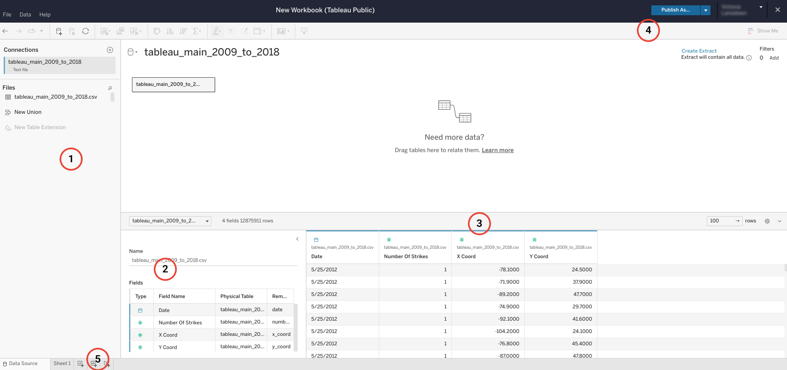
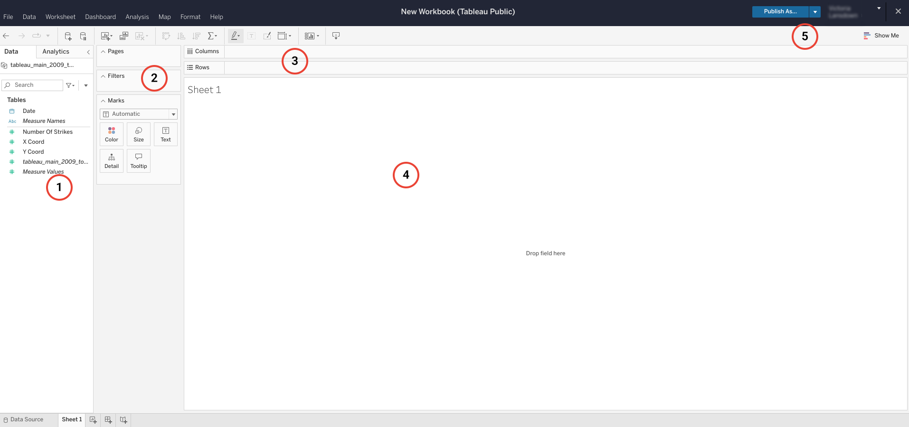

Tableau is a powerful tool used by data professionals around the world to create, present, and share visualizations created from tabular data. If you have taken the Google Data Analytics Professional Certificate, then you should already be familiar with Tableau. If you haven’t completed the Data Analytics Certificate, you can review resource materials below and linked in other videos. The Tableau software is available for free through its browser version, which allows learners like you to test out the capabilities of the software in a limited capacity. In this reading, you will be given an overview of Tableau Public, the free use, basic version of this visualization software.

Reviewing the fundamentals of Tableau Public In this reading, you will learn about the basic structure of the data source and design screens featured in Tableau Public. The data source page is used for inputting or connecting to the data, and the design page is used for plotting and creating data visualizations. Both are needed to successfully design impactful and compelling data visualizations.

Note: To review the Tableau Public setup process, refer to the reading about how to sign on to Tableau Public .

Data source page Before you can start designing visualizations, you’ll first need to upload your data. Since you’ve already set up your Tableau Public profile, all you need to do is log in and select Web Authoring under Create in the navigation bar.

Note: Everything required for Tableau in this course can be completed with Web Authoring; you are not required to download the Tableau software.

Tableau Public Web Authoring Web authoring allows you to create visualizations directly from a web browser. Can you create a viz without downloading any software? Yes! Since you’ve already set up your Tableau Public profile , all you need to do is log in and select Web Authoring under Create in the navigation bar. For the purposes of this certificate program, you can perform everything you need in Tableau Public. The instructions in the following resources refer to Tableau Public.

Tableau Desktop Public Edition You can also download the software directly to your Mac or PC. Select Tableau Desktop Public Edition under Create in the navigation bar on Public’s website.

Reminder: Tableau Public should only be used for analyzing and sharing public data. All workbooks and datasets published will be freely accessible to anyone.

After you upload your dataset, you can perform the following steps outlined to match the circled numbers in the following image:

The following descriptions correspond to the image above. 

1.  This left-hand pane includes your data connections and files. Here you will find all the files you upload in a list so that you can keep track of multiple files and/or multiple connections to different databases.

2.  Just to the right of the data connections window is a list of all of the fields that Tableau Public has detected in a particular file. If you have multiple files uploaded, you can select the file from a dropdown to access each file’s fields. As you’ll learn in an upcoming video, Tableau’s fields are acquired from the data columns in your file. Tableau automatically sorts these fields into dimensions or measures and discrete or continuous variables.

3.  The biggest pane on the page, on the middle right, allows you to access all of the columns of your file as Tableau fields, including several rows of data. Unlike the pane to the left, this pane allows you to create new fields based on those already present, such as new calculation fields, groups, sets, or parameters (you will learn more about these features in upcoming videos). You may be prompted to select “update now” or “update automatically” in order to populate this pane with your data. If that’s the case, it is good practice to update automatically to ensure you’re consistently working with recent data. (For reference -- review the following image, after #5.)

4.  The blue button “Publish” in the upper right of the screen acts as your “save” button. Because Tableau Public is a browser-based platform, anything you create and want to save will be published to your public account. There are ways to password lock or hide data sources and data visualizations if desired, but Tableau Public only offers the Publish field for saving your work. When you click on the ‘Publish’ button, you may automatically be navigated to your data design page, which may be blank depending on your design progress. Do not be alarmed. Your latest dataset uploads or data designs were still saved; just navigate back to where you were last and continue editing your visualization.

5.  Lastly, you will use the collection of buttons at the bottom left of the page to navigate to your data design page.  You’ll find button options for creating a new worksheet, a new dashboard, and a new story. These elements will be introduced in the next section. 

### **Data design page**

The data design page is where your data visualizations will be built. To navigate to the data design page, click on ‘Sheet 1’ or create a new sheet as instructed in #5 on the previous corresponding image. When you first click to open a data design page, you may be prompted that Tableau is ‘Creating Extract’. That means that Tableau is extracting the providing data to be used in visualizations. This process may take several minutes. Here you will move your data source fields to appropriate shelves to build the type of visualization you want. You can build data visualizations or entire interactive dashboards from this page.

The following numbered items correspond to the numbers displayed in the Tableau workbook image above.

1.  In this pane on the far left, you will find your list of discrete and continuous dimensions and measures. You will move these variables to different panes on this page to build visualizations. You will learn more about these variables later. 

2.  In the next pane just to the right, you’ll find “Pages,” “Filters,” and “Marks.” You can move any dimension or measure to these different fields to manipulate the data visualization. You will learn how to use these features in upcoming videos. 

3.  At the top of the page, just under the menu bar, there are two empty rows that act as your main two shelves for moving your variable fields. The “Columns” and “Rows” shelves help you position your data visualization as desired. You’ll also notice above these rows a toolbar and menu full of other options for manipulating your data visualization. 

4.  In the middle of the screen is the main viewing panel for your visualization. As you add elements and drag your dimensions and measures to different fields, you will notice the impact they have on your data visualization in this panel. In the upper right corner you will find your “Publish” button, which acts as the save button, and the “Show Me” dropdown. Under the “Show Me” dropdown, you will find a selection of data visualization types and guides for building each of them. 

5.  When you’re ready to [save and share your work](https://help.tableau.com/current/pro/desktop/en-us/publish_workbooks_tableaupublic.htm), publish it to your Tableau Public profile. View the options for publishing your work by clicking on the down arrow next to the “Publish” button on the top navigation bar.

## Other ways to review Tableau tools

### **Google Data Analytics Professional Certificate**

As mentioned earlier, if you have taken the [Google Data Analytics Professional Certificate](https://www.coursera.org/professional-certificates/google-data-analytics) program, you are already familiar with Tableau and Tableau Public. Go to the [Get started with Tableau](https://www.coursera.org/learn/visualize-data/lecture/sLxV4/data-visualizations-with-tableau) lesson in that program to review what you have learned.

### **Tableau.com**

By visiting [Tableau.com](https://www.tableau.com/), you’ll notice multiple product offerings, everything from Tableau Public (which is free) to Tableau Desktop, Tableau Mobile, and Tableau Server. Each product has its own use and specialization, but the main elements for data visualization are the same. You can search through the [Tableau Help page](https://www.tableau.com/support/help?_ga=2.3466357.45238129.1654614666-316280037.1654614666) to find specific articles on just about any topic regarding data visualizations. There are a variety of training resources available from Tableau to help users learn the different features of their products. Tableau offers a variety of training resources for helping to learn their different products. 

## Key takeaways

Tableau is a powerful data visualization tool, but that means it takes a lot of practice and experience to use it proficiently. The two main pages you’ll use are the data source and data design pages. There are also a large number of resources available to help you in each step of the process, including Tableau Help and Grow With Google Data Analytics Certificate Program. 

## Resources for more information

To help you troubleshoot or to learn more, you can use  the following links:

-   Use Tableau resource page to set up your data for success: [Set up data sources](https://help.tableau.com/current/pro/desktop/en-us/datasource_prepare.htm)

-   Tableau Tools and Web Authoring Help: [Design charts and analyze data](https://help.tableau.com/current/pro/desktop/en-us/design_and_analyze.htm)

-   The Tableau Public “Discover” page, which includes “Viz of the Day” and other beautiful vizzes designed on the platform: [Welcome to Tableau Public](https://public.tableau.com/app/discover)

-   Beginner's guide to using Tableau Public: [A step-by-step guide to get you started on your own data viz journey](https://www.google.com/url?q=https://www.tableau.com/blog/beginners-guide-tableau-public?_gl%3D1*uv0ojo*_ga*MjU5NjUyMzcuMTY1NDMwMDM4MQ..*_ga_8YLN0SNXVS*MTY5MTE4NzA1Mi4xMC4xLjE2OTExODcwNzcuMC4wLjA&sa=D&source=docs&ust=1691485449789685&usg=AOvVaw267xvonfqL2uCc_x_yXcip)

-   Getting Ready to Publish Your First Data Visualization: [A step-by-step guide for analyzing data and publishing a viz to your Tableau Public profile](https://www.tableau.com/blog/getting-ready-publish-your-first-data-visualization)

   "Where can I find training material and sample visualizations to help me with my own data visualizations?"

Tableau

You’re already quite familiar with Tableau’s free browser software: 
Tableau Public
. Of course, they offer a variety of software packages that appeal to every data professional, from the daily power user to the occasional presenter. 

But did you know that Tableau also offers a comprehensive education and tutorial platform focused on training both software users and class leaders? In their 
Resources
 tab, Tableau offers video tutorials, e-learning courses, and webinars to help every level of user improve their data visualizations. Along with articles, blogs, and white papers, Tableau has a huge collection of sample visualizations (including 
Viz of the Day
, which showcases some of the best Tableau vizzes) that is meant to encourage and empower data pros at every level to turn their dull datasets into effective storytelling tools. 

Tableau.com website homepage, showing featured visualizations.
______________________________________________________________________________________________

"Where can I find a community of data professionals dedicated to building intelligent data visualizations for businesses? "

PowerBI

What 
PowerBI
 
is probably best known for is its popular software product used by businesses and corporations worldwide for data visualization. Not only do they offer a free online version of their premium product, PowerBI, they also provide comprehensive 
guided learning
 and 
online workshops
 for teaching users of its products to create powerful data visualizations. 

A growing number of data pros are also part of their 
PowerBI
 
data visualization community
. Here, users collaborate and share insight about the most effective ways to build data visualizations for businesses and organizations of every kind all over the world, like The Associated Press, Nokia, Real Madrid Football Club, Toyota, UNICEF, Galadari Brothers, and Eurobank, to name a few.  

______________________________________________________________________________________________

"Where can I find data visualizations paired with the datasets they are built from? "

Information is Beautiful

Founded by author and data visualization expert David McCandless, the
 Information is Beautiful 
platform is a gathering place for data pros who want to help people make clearer, more informed decisions in the world. 

The site is a treasure trove of data visualizations on a host of topics. The Information is Beautiful team also has blogs, newsletters, and live and 
online workshops
, which aim to help data professionals improve their craft. Beyond the powerful visualizations and graphs on their website, Information is Beautiful focuses on transparency by sharing all of the datasets on which they base their vizzes.  

Information is Beautiful website, including 6 different data visualizations.
__________________________________________________________________________

"Where can I go to learn more about communicating my data visualizations effectively?"

Storytelling with Data

As evidenced by their name, 
Storytelling with Data
 is an organization focused on communicating with concise data that informs change. They provide training, workshops, and tools for the craft that combines both data visualization and storytelling.

Storytelling with Data has a particularly engaged 
community
, where data pros gather to learn, practice, ask for feedback, and help others. Though they don’t have their own dedicated software for designing vizzes, they have a myriad of tiered resources for training, office hours, and consulting.    

Storytelling with Data website.
__________________________________________________________________________

"Where can I go to find out more about data visualizations created in Python?"

Python Graph Gallery

If you are looking to improve your skill in plotting data visualizations in Python, the
 Python Graph Gallery
 is a fantastic website to visit. This site created by 
Yan Holtz
 includes a wide range of different types of visualization plots, like bar graphs, line charts, times series charts, geographic maps, and many more. Along with each visualization, you will also find the accompanying Python code used to plot the viz. 

The site is organized first by plot type, but can also be sorted by the visualization Python package used, seaborn, matplotlib, or plotly. There is also a space for general knowledge tips and tricks, and a section titled 
Dataviz Inspiration
, which can help you understand what Python is capable of. 

Python Graph Gallery website, main page.
Key Takeaways
Your data visualization education doesn’t end when you complete this program. There are amazing resources available that are consistently being updated with the latest trends and most up-to-date principles regarding the design, ethics, accessibility,  and communication of data visualizations.  

