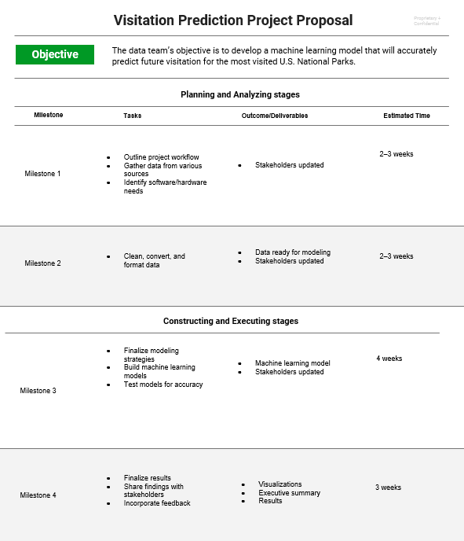
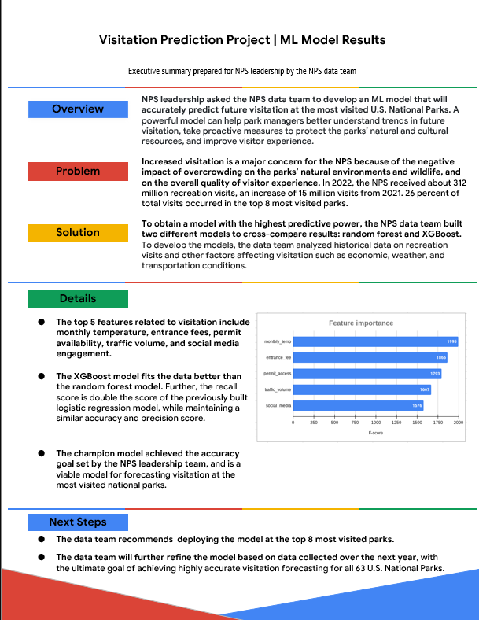
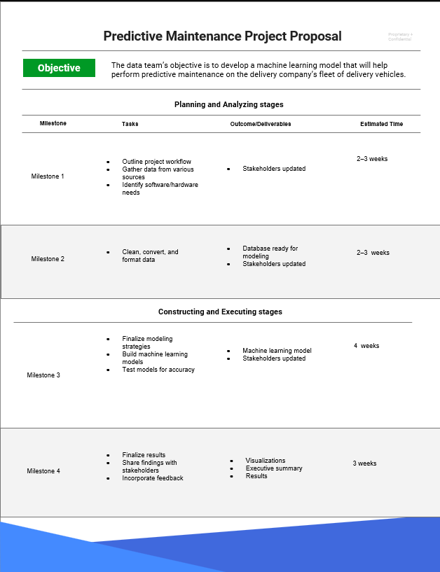

There are many different workflows when working in projects, one is

-   Ask

-   Prepare

-   Process

-   Share

-   Act

The PACE framework is a more flexible version of this workflow.

## Why do we use a workflow structure?

As a general rule, data professionals rely on workflow structures to guide them through the duration of data projects. Within a large-scale project, there can be a number of tasks that require a certain order of operations. Identifying complexities and finding consistent ways to work together can make projects more efficient and enable more productive communication. Identifying these and other types of potential blockers early can help you plan and prepare resources in advance before they can negatively affect a project. 

Our team of data professionals who assisted in creating this program developed PACE as a flexible model; you are encouraged to revisit each stage without interrupting the entire workflow. Through PACE, you will identify areas of action and contexts for when they will need to be considered. All in all, PACE offers professionals a customizable scaffold that can support their efforts while working through every stage of a data project.

# PACE framework, a structured approach to managing data science projects effectively.

PACE is a cyclical framework emphasizing continuous communication among team members and stakeholders. It allows for iteration and adaptation throughout the project lifecycle to ensure alignment \]and effectiveness. And if you want to continue exploring this topic, try one of these follow-up questions:

## Plan

At the beginning of a project, it is important to establish a solid foundation for success. Here you will define the scope of your project. This is when you will begin by identifying the informational needs of the organization. During the planning stage, you will have the widest viewpoint of a project. By assessing all of the factors and processes involved, you are mapping a path to completion, using your creativity to conceptualize a course of action. Here you will also take special note of tasks that may require an innovative approach within your workflow.

**Summary**: The planning stage is where you conceptualize the scope of the project and develop the steps that will guide you through the process of completing a project.

Here are a few examples of the types of planning stage tasks:

-   Research business data

-   Define the project scope

-   Develop a workflow

-   Assess project and/or stakeholder needs

The Plan stage of PACE focuses on **identifying informational needs and the business impact of the project**.

## Analyze

In the analyzing stage, you will interact with the data for the first time. Here you will acquire all of the data you will need for the project. Some datasets could come from primary sources within your organization. Others may need to be collected from secondary sources outside your company. You may even find that you need governmental or open source data. The analyzing stage is also where you will engage in exploratory data analysis or EDA. This involves cleaning, reorganizing and analyzing all of the necessary data for the project.

**Summary**: The analyzing stage is where you will collect, prepare, and analyze all of the data for your project.

Here are a few examples of the types of analyzing stage tasks:

-   Format database

-   Scrub data

-   Convert data into usable formats

Data Analysis and Exploration: The Analyze stage involves acquiring, cleaning, and transforming data for **exploratory data analysis (EDA)**. Collaboration with stakeholders helps prioritize which insights to pursue further.

## Construct

Just as the name suggests, the construction stage is all about building. In this stage of PACE, you will be building, interpreting, and revising models. Some projects will require machine learning algorithms to uncover correlations within your data. You will use these correlations to uncover information from the data that would otherwise go unused. These relationships can help your organization make informed decisions about the future.

**Summary**: In the construction stage you will build models that will allow you access to hidden relationships locked within data.

Here are a few examples of the types of construction stage tasks:

-   Select modeling approach

-   Build models

-   Build machine learning algorithms

Constructing and Executing Solutions: The Construct stage is where deeper analysis happens, including **building models and uncovering data relationships**.

## Execute

In the execution stage, you will put your analysis and construction into action. Here you will deliver your findings to the internal (inside of your organization) and external (outside of your organization) stakeholders. Quite often, this will involve stakeholders from the business-side of the companies you are working with. Presenting your findings is only a part of the execution stage. Stakeholders will provide feedback, ask questions, and make recommendations that you will collect and incorporate.

**Summary**: In the execution stage you will present the finding of your analysis, receive feedback, and make revisions as necessary.

Here are a few examples of execution stage tasks:

-   Share results

-   Present findings to other stakeholders

-   Address feedback

The Execute stage involves **sharing findings**, presenting recommendations, and iterating based on feedback. Communication and Flexibility.

## Communication and PACE 

Regardless of where you might be within the PACE workflow, communication is essential to moving the framework through to the realization of the project. One way to think of this is by visualizing the four stages of PACE as a completed circuit and with communication being represented by the flow of electricity. 

At each stage, there will always be a need for communication to improve the workflow. This could be asking questions about your data, gathering additional sources, updating stakeholders on progress, or presenting findings and receiving feedback. 

## Adaptability of PACE

At the start of a project, the PACE model offers a good structure to guide you. At the beginning, you have the planning stage, where you gather the information and tools you will need and set up a framework to guide you. When you are analyzing data and constructing models, the analyzing and construction stages assist you. After these steps, the execution stage is where you share results and gather feedback.

Although the PACE model is first presented as stages in a certain order, you will discover that the open flow of communication allows you to easily move to the stages you need. New information and feedback can be incorporated at any part of the process. You might need to return to the analyzing stage to clarify some aspect of the data and then go to the executing stage to present this aspect to your stakeholders, without the need to construct new models. The PACE framework can be adapted to fit any project. Its adaptability will prepare you for a dynamic profession that requires a high degree of professional flexibility and communication.

## Key takeaways 

Data professionals need structured workflows to help them manage the large number of tasks within data projects. The PACE professional workflow was designed specifically for this program to assist you in developing your professional structures and practices. PACE functions like a completed circuit, with communication flowing between each stage. The design of PACE promotes flexibility, allowing for free movement between stages as needed.

# Key Elements of Communication

-   Communication involves three main components: purpose, receiver, and sender.

-   Purpose refers to the reason behind the communication, which can range from technical analysis to strategic insights.

Understanding the Receiver and Sender

-   The receiver is the audience, and understanding their knowledge and needs is crucial for effective communication.

-   The sender, often the data professional, must consider their relationship to the receiver, their role, and any personal biases that might influence the message.

Adapting the Message

-   The same message can be communicated differently depending on the purpose and audience.

-   For example, technical details might be emphasized with colleagues, while the impact of a project is highlighted for non-technical audiences.

This foundation helps data professionals communicate insights clearly and appropriately to various stakeholders in their work environment.

## Effective communication drives PACE 

Throughout the stages of PACE, stakeholders can offer feedback, pose questions, or ask for clarification. Being able to communicate is key; at every point in a project’s life cycle, you will need to be able to share obstacles and results, and provide necessary information to guide decision-making. Communication drives each stage of PACE, from collecting data to constructing models to sharing results. As a data professional, you will need a combination of strong communication skills and the technical skills you’re learning to succeed in the data career space. In this reading, you will learn some tips for effective communication you can apply throughout the stages of PACE. You will also discover some best practices for sharing your findings through presentations that you can use in the future.

## Seven tips for effective communication

Over the course of a typical work day, you will interact with stakeholders in a variety of ways. Some of your interactions will be through emails and messaging, others through meetings and one-on-one conversations, and even formal presentations. Each interaction requires an individualized approach to ensure that your audience understands what you are trying to communicate. The following seven tips can help guide your communication, no matter what form it takes or what stage of PACE your project is in: 

### 1. Speak the language of your audience

Identify the needs of your audience. It’s important to know the objectives of the person you are communicating with. Focusing on their needs allows you to gain insight and assess how technical the conversation should be. Consider the following questions:

-   Why has this person contacted you?

-   What does your stakeholder want from this interaction?

-   What’s important to them, their team, or their organization?

In your role as a data professional, you will interact with a variety of stakeholders. Determine what they know, what they need to know, and what might go beyond their level of involvement in a project. 

-   Break down technical concepts into simpler terms. 

-   Use shorter sentences so main ideas are easier to understand and remember.

-   Use direct language and minimize embellishments or unnecessary detail.

-   Pay attention to diverse backgrounds and respect the lived experiences of others.

**Pro tip**: Avoid jargon, acronyms, and technical “buzzwords” that could lead to confusion.

### 2. Invite questions and welcome feedback

Everyone can use feedback–whether it is positive reinforcement or areas for improvement. When you are focused on the details of a task, it’s possible to overlook something. Another person’s feedback offers you a great way to gather insights for your personal growth and professional excellence. By accepting the challenge that feedback and questions present, you will strengthen your own skills and help the overall project.

-   Merge your passion for finding solutions with the goals of the project.

-   Continue to strive for greater understanding of the results.

-   Elicit feedback and questions to improve communication about your projects.

-   Consider opportunities to reflect on your communication skills.

**Pro tip**: Analyze feedback. Is it valid? Does the person have a complete understanding of the goals of the project or data analytical process? If not, set up an additional meeting to help clarify.

### 3. Be the connection to the data

You are your team’s direct connection to the insights your data offers. Your goal is to help other stakeholders understand the process and how it addresses their needs. When everyone understands the process, communication can be highly effective.

-   Focus on the objectives to help others better understand your data process.

-   Tell the story of the data with a compelling and cohesive narrative.

-   Respond to questions in a timely manner.

-   Demonstrate your value to the team. 

-   Find opportunities to address stakeholder questions.

**Pro tip**: Continue to proactively identify ways the data and tools you have access to can address the objectives of your team and drive new insights.

### 4. Let your visualizations help tell the story 

Visualizations are one of the best ways to communicate ideas, especially when dealing with big data. Visual references help bring to life the details inside your data. Graphs, charts, and infographics can promote general understanding. Later you will explore Tableau, a visualization tool that you can use to create compelling visuals from data.

-   Be sure that your visuals tell the story within the data.

-   Design visualizations for inclusivity.

-   Use labels and text to clarify, not clutter. 

-   Use fonts that are easy to read.

-   Use high contrast, shading, and other customizations to communicate your messages clearly.

-   Offer handouts, slides, and other material in accessible formats.

**Pro tip**: Keep visualizations simple. When deciding what to include in a presentation, less is more.

### 5. Build positive professional relationships

When you consider the responsibilities and objectives of others, your communication will reflect that consideration. This builds credibility and influence in your workplace and allows you to continue growing throughout your career. 

-   Focus on what matters to your audience.

-   Invite feedback and discussion.

-   Be a trusted subject matter expert who communicates clearly and inclusively.

-   Cultivate positive interactions to strengthen working relationships and improve morale.

**Pro tip**: When a stakeholder contacts you, be accessible and engaged in your communication.

### 6. Identify assumptions about the data

The backgrounds, experiences, beliefs, and worldviews of people can influence the information contained within data. In your role as a data analytics professional, you will want to consider ways that these various factors can introduce bias.

If they are not recognized, assumptions can have a powerful effect on outcomes. Without information, there is often a tendency to fill in the gaps in understanding with assumptions. The most effective methods to reduce the impact of assumptions are practicing active listening and effectively asking questions. For example, these questions can help identify any assumptions:

-   Is there something I am taking for granted?

-   Am I assuming something here that I shouldn’t?

-   Can I determine if the assumption is correct?

**Pro tip:** Data professionals need to identify their own assumptions as well as any assumptions their audience might have. Make sure you consider any bias you might have, too!

### 7. Identify limitations in the data 

As a data professional, you will also encounter limitations within data that can impede your analysis. These limitations will need to be addressed before you can proceed. To assist you in identifying data limitations, ask the following questions:

-   Is the data complete? Are there missing values or sections?

-   Are the datasets formatted correctly?

-   Is this a sufficient sample size to conduct analysis of an entire population or group?

-   What are the biases present in the data set?

-   Does this data contain personally identifiable information? What steps will I take to protect this information?

**Pro tip:** In addition to identifying and communicating about data limitations before analysis, you will also need to make sure stakeholders are aware of any limitations still affecting the results during your presentation.

## Share Findings

One of the most important communications you will have with stakeholders will be sharing your findings, often through presentations. This will mean translating the results, concepts, and terms of your analysis for wider audiences. When sharing the results of your analysis with stakeholders, there are some best practices that you should apply:

-   Craft results to the needs of your stakeholders. Communicate why this data will help them achieve their goals.

-   Determine the visualizations and/or dashboards that are the most effective. What data will you need to show and how do you want stakeholders to interact with it?

-   Think about the design carefully. A simple yet visually appealing approach to visualizations is always the best.

-   Use a hierarchy of data in your visualizations/dashboards. Information that is most important should be easily accessible, but you should provide a path for more details.

### What should I keep in mind when I share results?

-   What information is the most important to my audience?

-   What is the most efficient way to share with the tools available and the time I’m allotted?

-   What can I do to make the key points effectively?

### Presentations

Presenting information clearly and effectively is key to a data scientist's workflow. Communication skills that pertain to presentations include but are not limited to: the structure of your presentation, slide design, the tone of your voice and the body language you convey, and more. It’s also important to consider accessibility as you are creating any assets. Check with your organization about accessibility guidelines. You may also refer to online resources like [The World Wide Web Consortium’s (W3C) web accessibility initiative](https://www.w3.org/WAI/).

#### Tips for presentations

-   Structure your presentation. Be sure there is a logical structure: a beginning, middle, and end.

-   Presentation slides are not scripts. Don’t read or put complete paragraphs on presentation slides.

-   Make sure your data can be understood visually and consider potential accessibility challenges for your audience.

-   Focus most on the points your data illustrates.

-   Share one—and only one—major point from each chart.

-   Label chart components clearly.

-   Visually highlight “Aha!” zones.

-   Write a slide title that reinforces the data’s point.

A solid presentation can help others understand the findings of your data analysis and ensure that you are effectively communicating.

## Key takeaways

Effective communication is important for data professionals. Regardless of where you are in the framework of a project, communication can inform and empower your stakeholders. Identify the needs of your audience and invite feedback. Remember that your role is to connect the data, technology, and the stakeholders. When sharing the results of your data analysis, make your presentations clear, focused, accessible, and take into account any assumptions or limitations presented by the data. Demonstrate your value by being available and ready to share insights in a simple way that promotes general understanding.

Practice example: Image you are part of a project on the Nation Park Service and we are asked to create a model to forecast number of visitors to the different parks. The communitcation will be very different if directed to

a\) a new data professional joining your team

b\) a new writer for NPS public relations

Email #1 to the new data professional provides:

-   An overview of the data team’s workflow. This information gives the new data professional insight into how the data team shares their results and invites feedback from internal stakeholders.

-   The accuracy goal for the visitation prediction model. Knowing the project objective is important for a data professional working to develop an effective ML model.  

Email #2 to the new public relations writer provides:

-   Relevant information for creating non-technical articles that promote the NPS’ mission and work. This information includes the purpose and benefits of the visitation prediction project, and the problem the project is addressing. 

-   Direct, non-technical language that does not include unnecessary detail. 

Both emails:

-   Invite the recipient to ask follow-up questions. Questions are an opportunity to improve communication and learn more about the project.

Examples:

Email #1: Email to a new dat a professional on the NPS data team

Dear Akbar, My name is Cynthia, one of the data professionals with the National Park Service and a member of the data team responsible for the visitation prediction project. Welcome to the team!

I look forward to working with you. As a data professional, you will need to know about the data team’s workflow. At the start of a new project, the entire team contributes to a strategy document that includes the project’s scope and objective, data sources, and key milestones. Next, the team cleans, organizes, and explores the data. Then, we build and test machine learning model(s). Finally, we share the results with stakeholders and receive feedback. The accuracy goal for the visitation prediction model is 90%. If you have further questions about the project, please feel free to reach out anytime. Cynthia Delgado Data Scientist National Parks Service Data Team

Email #2: Email to a new writer for NPS public relations

Dear Victoria, My name is Cynthia, one of the data professionals with the National Park Service and a member of the data team responsible for the visitation prediction project. Welcome to the team! I look forward to working with you.

I’ve been asked to provide you with an overview of the visitation prediction project. The recent increase in visitation is a major concern for the NPS. In 2022, the NPS received about 312 million recreation visits, an increase of 15 million visits from 2021. 26 percent of total visits occurred in the top 8 most visited parks. Unexpected increases in visitation can stress the natural environments and wildlife within the parks, and reduce the overall quality of visitor experience. NPS leadership has asked the data team to build a model that will accurately predict future visitation at the most visited parks. A powerful model can help park managers better understand trends in future visitation, take proactive measures to protect the parks’ natural and cultural resources, and improve visitor experience.

If you have further questions about the project, please feel free to reach out anytime. Cynthia Delgado Data Scientist National Parks Service Data Team

# Elements of successful communication

As you have been learning, communication is the driving force behind PACE because data professionals need to be able to communicate effectively with stakeholders while working through different stages of a project. You have already learned some important tips for effective communication. But, there are a few more elements for successful communication you should consider. This reading provides best practices for successful communication that you can follow in your workplace communications. 

## Understanding why

Having a clear vision of why you are communicating is the first thing you need to consider. Your “why” depends on the context set by the business or organization you work for as well as the goals orienting the project. When crafting any form of communication, use your why to guide main ideas so that your audience can identify how to act or respond with purpose.  

When you prepare to communicate, take a moment to outline important goals and expectations you have, like: 

-   Goals of the project you are communicating about

-   What you hope to gain from this communication

-   What you’re asking your audience to do

-   What you need your audience to understand

Understanding the why behind your communication will help you organize your thoughts and develop clearer, more direct communication. 

## Set the stage

When you are developing effective communication, you have to consider more than just the why–you also need to think about *where* the communication is taking place. Setting will have a direct impact on how your message is delivered and how you shape it. As you prepare to communicate, consider the most appropriate way to communicate for the setting you plan to be in.

On the job, it’s possible that you will communicate in a variety of settings. What information you share, how you share it, and how you follow up will depend on the context of that communication. For example, you might:

-   Ask a coworker for advice about a recent obstacle over lunch

-   Send an email updating all the stakeholders about an important project

-   Share progress with your team in a weekly meeting

-   Present the results of your analysis to a boardroom of executives

Each of these settings will require you to consider how you’re communicating, what each of those audiences need, and what you need from them in return. As you develop your communication skills, don’t forget that the setting can be just as important as the actual communication.  

### How to work one-on-one and in small groups

One of the most common settings you will work in as a data professional is a one-on-one or small group meeting. As you prepare to communicate in these settings, remember that it is important to:

-   Respect your colleagues' time by scheduling a meeting in advance 

-   Convey interest by practicing active listening

-   Check for alignment by asking questions

## All about time

Time is a currency in the professional world. It’s very important to be efficient–this includes making sure your communication is understandable so that stakeholders can quickly comprehend your message. To ensure your message is clear and concise, remember to always:

-   Use direct language 

-   Minimize wordiness

-   Avoid unnecessary details

-   Always strive for clarity  

-   Use proper grammar and punctuation

-   Keep vocabulary simple and avoid technical language

-   Break complex ideas into shorter sentences to make concepts easier to understand and remember

Not only will these suggestions help make your communication efficient and easier to understand, they will also save you time having to re-explain important concepts. And more than that, your colleagues will be grateful that you respected their time. 

## Active Listening

As you begin your career as a data professional, you will spend a lot of time in meetings and in conversation. Many stakeholders are from different departments both inside and outside of your organization. The information shared during these interactions is valuable. Often, it’s where you gather insight into how the business operates, its goals, key milestones, and parameters within projects. 

When you listen actively, you:

-   Invite understanding of others

-   Develop empathy for others and their responsibilities 

-   Build a connection with colleagues

-   Promote trust

When you are practicing active listening, you make the effort to understand the speaker’s point of view. This helps you understand what other people are trying to communicate and sets you up to ask better, more insightful questions.

## Asking Questions 

Data professionals aren’t automatically developing solutions. For data analysis to be effective, data professionals need to ask the right questions. In fact, the entire data analytical process depends on it. 

Asking questions is a powerful communication tool. Asking the right questions can lead to institutional learning and a fruitful exchange of ideas. Many times, questions invite innovation and initiate efforts that can help improve projects and overall workflow. 

Asking questions builds rapport and trust among team members. The right questions can often help mitigate business risks by uncovering unforeseen pitfalls and hazards. Here are a few tips to help guide your questioning:

-   Ask questions that haven’t been answered already

-   Ask questions that reveal the bigger picture

-   Ask questions that gather information or further the knowledge of the team

-   Ask questions that can help clarify misunderstandings

Effective questions are more likely to get you the answers you need to do your best work– which is good for the whole team. 

## Key takeaways

In this reading, you learned that communication is present in all aspects of data professional work. Focus on the purpose, setting, and timing of your communication in order to promote more successful discussions with your team. Additionally, becoming an active listener that asks relevant questions enables more efficient communication and invites the perspective of other stakeholders. All these factors add up and make a big difference in how effectively you communicate as a data professional.

# The value of the PACE strategy document

You have learned about the PACE workflow and how it helps bring structure to the data analytical process. This reading introduces the PACE strategy document. It is a resource designed to assist you in this program and throughout your career as a data analytics professional.

## Why do I need the PACE strategy document?

The videos, readings, activities, and projects in this program are a foundation for advancing your data skills and knowledge. But, success in the data career space involves more than data analytical skills. Data professionals are often involved in organizational decision making. This requires them to communicate about data and the results of data analysis with a variety of stakeholders.

In the advanced data analysis program, you’ll be introduced to different aspects of the field, which data analytics professionals encounter. Concepts and skills are arranged in a logical order and organized into courses that will prepare you for more advanced analytical tasks. 

After each course, you'll be asked to develop an end-of-course project that demonstrates your mastery of expected data professional skills, such as your analytical and communication skills. To assist, you will receive an individual PACE strategy document for each of the course projects. Inside the PACE strategy documents, you’ll find helpful tips and opportunities to reflect on what you have learned and consider how to apply it to your job as a data analytics professional. Additionally, your responses within these strategy documents will help you create executive summaries that will inform decision makers and stakeholders of a project’s progress.

PACE strategy documents provide evidence of your expanded knowledge and can serve as a powerful motivator when acquiring new skills. Commitment to an educational program requires dedication and persistence. Your knowledge base and technical proficiency will be expanded through this journey. The gradual nature of personal growth makes it difficult to monitor day-to-day progress. Each PACE strategy document is designed to function as a record of your progress while developing new data analytical skills. The strategy documents will also help you improve communication skills by providing thoughtful questions designed to help identify and detail each step of your data analysis.

## A look at the PACE strategy document

You will find a PACE strategy document included with the end-of-course project for each course in this program. Even though these strategy documents were designed for the specific needs of a particular course, there are consistent elements in each of them.

### Instructions

In the “Instructions” section of the PACE strategy document, you will find general guidelines and special considerations for completing the document.

### Course project recap

In this section, the goals for each end-of-course project are outlined. By completing each task and the items needed for your projects, you will achieve these goals. No matter which workplace scenarios you select, the project goals will align with the knowledge you have gained in that course.

### Relevant interview questions

This section of the PACE strategy document builds context around your data tasks. The questions unlock a deeper understanding of data analytics, previewing the way you'll be able to speak after completing each course and its corresponding projects. During your job search, these questions can help you prepare for the types of questions you'll encounter during technical interviews.

### Review relevant course materials

In this section of the PACE strategy document you are given links to course materials you can review and reference as you complete each project. Links to relevant course materials provide you with quick access to relevant course information you need to complete your project.

### Reference guide

In the “Reference Guide,” you can find an outline of tasks required to complete the end-of-course project and the stage of PACE that each task addresses. Additionally, you can refer to the material when you are on the job completing similar tasks and projects later in your career.

### Data project questions & considerations

The questions in this section are specific to different stages of the PACE workflow. These “Data Project Questions & Considerations“ directly correspond to the questions you will encounter in the Jupyter notebooks for courses 2 - 6.  The answers you give to these questions will help you map out your thought process through each stage of the project.

## PACE strategy documents and Jupyter notebooks

Each end-of-course project  will also include a specially created Jupyter notebook containing helpful tips to assist you when programming project elements. Similar to the strategy documents, each notebook includes thought-provoking questions that will help guide you through the tasks of each end-of-course project. You find some questions appear in both locations, signifying relevance in both areas of the project. The information in these documents can be referenced together during the executing stages of each project to produce executive summaries to inform your team members and stakeholders.

## The benefits of the PACE strategy documents

Gathering content for a portfolio can be challenging without the proper resources. This is where preserving detailed records of your decision making may pay off. The more you consider the questions at each stage of a project, and preserve thoughtful responses, the more valuable these PACE strategy documents can be for  your future. Each PACE strategy document offers you a wealth of content that you can use to create a cohesive and branded portfolio. By creating a collection of your thoughts and internal processes, you develop a valuable resource you can reference throughout your career. 

## Key takeaways

The PACE strategy document will help you complete the end-of-course projects by providing you with questions that deepen your understanding of the data analysis process. PACE strategy documents offer valuable insight into your personal workflow and provide a source of information that enhances your resume, portfolio, and job interview preparation.

# Communicate objectives with a project proposal

In this reading you will continue examining communication within the data workspace. As you have learned, communication is a key part of all aspects of data professional work. On a data team, project tasks and responsibilities are shared by different data professionals. Effective communication and collaboration among all team members and stakeholders is key to the success of any data project.

A **project proposal** can provide the structure and communication needed for tracking tasks. In addition, project proposals are beneficial for teams when facing challenges that require a high degree of flexibility. As projects progress, the expectations, resources, or even team members can change. This will require adjustments within a project that can impact the overall workflow and delivery date.

## Project proposals

A project proposal's main function is to outline objectives and requirements. Project proposals present ideas in more detailed and actionable segments often called **milestones**. Proposals are commonly created with input from team members and other stakeholders. It may also be the case that project proposals are shared with clients or executives to gain approval and inform them of a project’s path to completion. Project proposals are used across a multitude of industries and organizations. Although the design and layout of project proposals can vary, there are key elements that are common among them.

### Elements of a project proposal

Each project proposal contains important information that a team will need to consider before work begins. Below is a brief explanation of some common sections you will find in project proposals. Note that the format of project proposals will vary, so not every section described here will be included in every project proposal.

**Project title:** The title of the project is prominent, usually placed near the top of a document. Effective titles are brief and purposeful. Depending on the context and circumstances surrounding a project, the title can change over time.

**Project objective:** The objective statement is a one to three sentence explanation of what the project is trying to achieve.

**Milestones:** Milestones are groupings of tasks within a project, breaking the work needed into smaller, manageable goals. Milestones assist in the delegation and scheduling of work that needs to be completed within projects.

-   The milestones in the provided example are representative of future end-of-course projects.

**Tasks:** Tasks detail the work that needs to be completed within a milestone.

-   The tasks in the provided example parallel some of the work you will complete in upcoming end-of-course projects.

**Outcomes:** Outcomes are the completed actions or results that allow a project to continue.

**Deliverables:** Deliverables are items that can be shared amongst team members or with stakeholders. These are the end products of work undertaken for a project.

**Stakeholders:** The individuals or groups who are directly involved and have a vested interest in the success of a project. Input from stakeholders can serve as a basis for making decisions throughout a project.

**Estimated time:** At the beginning of a project, the time needed to complete milestones is estimated. As a project develops, these estimates will often need to be updated to account for adjustments to timelines or changes in team members.

### Sample project proposal

The sample project proposal, linked below, deals with a fictional visitation prediction project undertaken by the U.S. National Park Service (NPS). Use this document as a reference as you review each of the following sections.

This project proposal’s audience is the NPS data team. The purpose is to gather a comprehensive list of project tasks and divide them into smaller actionable groupings or milestones. Project proposals assist project managers in setting up task tracking, scheduling, and allocating resources. Furthermore, they serve as a reference for the team and as a valuable tool when new members are added to the project.

{fig-align="center"}

## PACE and project proposals

In this course, you learned about the scalability of PACE (Plan, Analyze, Construct, and Execute). Through the PACE framework, projects can be organized globally by outlining their main tasks and deliverables. At the same time, each individual task within a project can be broken down into smaller actions.

You will discover that PACE strategy documents are a great reference when working on project proposals. During your end-of-course projects, you’ll be presented with questions that will assist you in identifying the planning, analyzing, constructing, and executing stages. The more time you spend considering and answering each question, the more information you’ll have available to you when creating project proposals.

## Key takeaways

A project proposal is a plan of action that outlines what needs to be accomplished and how to achieve your intended goals and outcomes. Proposals define a project’s purpose and scope, and list key milestones, deliverables, timelines, and schedules. It’s important to update proposals throughout the course of a project, as the project’s scope, objectives, and stakeholders may change over time.

# Connect PACE with executive summaries

Regardless of workflow, data professionals need ways to share and communicate plans, updates, and summaries about projects. A document called an **executive summary** is used to update decision makers who may not be directly involved in the tasks of a project. In your role as a data professional, you will often be involved in creating executive summaries. 

## Executive summaries

Executive summaries are documents that summarize the most important points about a project, giving decision makers a brief overview of the most relevant information. They can also be used to help new team members quickly become acquainted with a project. The format is designed to respect the responsibilities of decision makers and/or executives who may not have time to read and understand an entire report. 

Executive summaries are used across numerous industries and organizations. There are many ways to present information within an executive summary, including software options built specifically for that purpose. In this program, you will primarily consider a one-page format within a presentation slide. Although the design and layout of executive summaries can vary, there are key elements that are common among them.

### Elements of an executive summary

Executive summaries are used across a wide variety of businesses and typically include the following elements: 

**Project title:** A project's theme is incorporated into the executive summary title to create an immediate connection with the target audience.

**The problem:** A statement that focuses on the need or concern being targeted or addressed by the project. Note that the problem can also be referred to as the hypothesis that you’re trying to prove through data analysis.

**The solution:** This statement summarizes a project’s main goal. In this section, actions are described that address the concerns outlined in the problem statement.

**Details/Key Insights:** The purpose of this section is to provide any additional background information that may assist the target audience in understanding the project's objectives. Determining what details to include depends on the intended audience.

**Next steps/Recommendations:** Information that supports the actions the team plans to take. This can also include recommendations for decision makers based on the insights gained over the course of the project. In this section, a data professional may also include general project reflections. When you are adding to this section, include at least one point for recommendations and one for the suggested next steps.

### Sample executive summary

The following sample executive summary deals with a fictional visitation prediction project undertaken by the U.S. National Park Service (NPS). The intended audience of this summary is a group of decision makers from NPS leadership. The purpose of this summary is to share the insights gained through data analysis of recreational park visits. Each section delivers a short statement without embellishment. This allows decision makers to quickly grasp the most relevant points about a project. Reference this document as you review each of the following sections.

## PACE and executive summaries

In this course, you explored the PACE (Plan, Analyze, Construct, Execute) workflow and how it can help guide projects. Through PACE, the tasks and deliverables of a project are clearly identified and recorded in a PACE strategy document. 

You will discover that PACE strategy documents are a great reference when working on executive summaries. When planning, analyzing, constructing, and executing your end-of-course and capstone projects, the PACE strategy documents provide questions to guide you. The more time you spend considering and answering each question, the more information you’ll have available to you when creating executive summaries.

## Key takeaways

Executive summaries offer an effective way to share information with decision makers, clients, and executives. These documents summarize the most important information within a project or plan of action, and share key insights and results. Typically, an executive summary reports on an identified problem and outlines the solutions used to address the problem. 

# Practice: create a project proposal 

You are a data professional working for an international delivery company.  Company leadership has asked the data team to develop a machine learning model for predictive maintenance on its fleet of delivery vehicles.Predictive maintenance uses machine learning to help predict equipment failures before they occur. The ML model analyzes both historical data such as performance and maintenance records, and real-time data collected from sensors placed on vehicles. 

Leadership wants to use the power of predictive maintenance to monitor the performance of delivery vehicles, and to identify and fix issues before they cause costly downtime or delays. For example, if the engine of a delivery vehicle breaks down, the company has to deal with delivery delays, dissatisfied customers, vehicle repair or replacement, and potential safety issues. Predictive maintenance offers benefits such as optimized delivery, increased safety, improved customer service, and reduced costs.

Your manager asks you to create a project proposal to identify and organize key milestones and deliverables for the project. The proposed timeline for the project is 12 weeks. The goal is to build a model with at least 90% accuracy.\

\